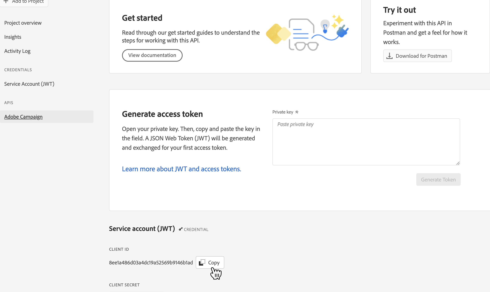
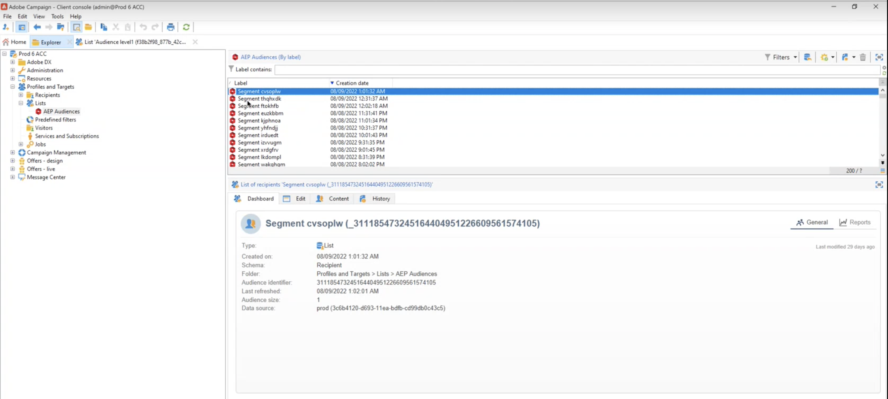

# Adobe Campaign Managed Cloud Services 연결 {#adobe-campaign-managed-services}

## 개요 {#overview}

Adobe Campaign Managed Cloud Services은 크로스 채널 고객 경험을 디자인하고 시각적 캠페인 운영, 실시간 상호 작용 관리 및 크로스 채널 실행을 위한 환경을 제공할 수 있는 플랫폼을 제공합니다. [Campaign으로 시작](https://experienceleague.adobe.com/docs/campaign/campaign-v8/start/get-started.html)

Campaign을 사용하여 다음을 수행할 수 있습니다.
* 액세스 가능한 하나의 뷰를 통한 개인화 및 고객 참여 촉진,
* 이메일, 모바일, 온라인 및 오프라인 채널을 고객 여정에 통합,
* 의미 있고 시기적절한 메시지 및 제안 전달 자동화.

>[!IMPORTANT]
>
>Adobe Campaign Managed Cloud Services 연결을 사용할 때는 다음 보호 기능을 염두에 두십시오.
>
>* 최대 50개의 세그먼트를 [활성화됨](#activate) 목적지에 대해
>* 각 세그먼트에 대해 최대 20개의 필드를 추가할 수 있습니다 [맵](#map) Adobe Campaign에
>* Azure Blob 저장소 데이터 랜딩 영역(DLZ)의 데이터 유지 : 7일,
>* 활성화 빈도는 최소 3시간입니다.

## 사용 사례 {#use-cases}

Adobe Campaign 관리 서비스 대상을 사용하는 방법과 시기를 더 잘 이해할 수 있도록 Adobe Experience Platform 고객이 이 대상을 사용하여 해결할 수 있는 샘플 사용 사례입니다.

Adobe Experience Platform은 id 그래프, analytics의 행동 데이터, 오프라인 및 온라인 데이터 등과 같은 정보를 통합하는 고객 프로필을 만듭니다. 이 통합을 사용하면 Adobe Experience Platform에서 제공하는 대상으로 Adobe Campaign 내에 이미 존재하는 세그멘테이션 기능을 늘릴 수 있으므로 Campaign에서 해당 데이터를 활성화할 수 있습니다.

예를 들어, 스포츠 복장 회사는 Adobe Experience Platform 기반의 스마트 세그먼트를 활용하고 Adobe Campaign을 사용하여 활성화하여 Adobe Campaign에서 지원하는 다양한 채널에서 고객 기반에 연결하려고 합니다.

메시지가 전송되면 전송, 열기, 클릭 수와 같은 Adobe Campaign의 경험 데이터를 사용하여 Adobe Experience Platform의 고객 프로필을 개선하려고 합니다.

그 결과 Adobe Experience Cloud 에코시스템에서 보다 일관성 있는 크로스 채널 캠페인과 신속한 적용 및 학습이 가능한 풍부한 고객 프로필이 제공됩니다.

[Adobe Experience Platform과 Adobe Campaign 통합에 대해 자세히 알아보기](https://experienceleague.adobe.com/docs/campaign/campaign-v8/connect/ac-aep.html)

## 전제 조건 {#prerequisites}

Campaign이 Adobe Experience Platform에서 데이터를 검색하려면 캠페인 API 프로젝트를 만들고 고객 지원 센터에 연결된 클라이언트 ID를 허용 목록에 추가하도록 요청해야 합니다.

>[!NOTE]
>
>API 프로젝트를 만드는 방법에 대한 글로벌 정보는 [이 설명서](https://experienceleague.adobe.com/docs/platform-learn/getting-started-for-data-architects-and-data-engineers/set-up-developer-console-and-postman.html)

1. 에 로그인합니다. [Adobe Developer 콘솔](https://console.adobe.io/) 새 프로젝트를 만듭니다.

1. 선택 **[!UICONTROL API 추가]** 및 **[!UICONTROL Adobe Campaign]**.

   

1. 키 쌍을 생성합니다.

1. 을(를) 선택합니다 `<Instance Name> - admin` 제품 프로필을 선택하고 **[!UICONTROL 구성된 API 저장]**.

1. API 프로젝트가 만들어집니다. 아래 참고 사항 **[!UICONTROL 클라이언트 ID]** 프로젝트에 표시됩니다. Adobe 고객 지원 센터에 연락하여 허용 목록에 클라이언트 ID를 추가하도록 요청하십시오.

   

## 지원되는 ID {#supported-identities}

*Adobe Campaign Managed Cloud Services* 은 아래 표에 설명된 id의 활성화를 지원합니다. 추가 정보 [id](/help/identity-service/namespaces.md).

| Target ID | 설명 | 고려 사항 |
|---|---|---|
| external_id | 사용자 지정 사용자 ID | 소스 ID가 사용자 지정 네임스페이스이면 이 타겟 ID를 선택합니다. 이 ID를 사용하여 고객을 나타내는 Campaign 인스턴스의 ID에 매핑하는 것이 좋습니다(충성도_ID, account_ID, customer_ID..) |
| ECID | Experience Cloud ID | ECID를 나타내는 네임스페이스입니다. 이 네임스페이스를 다음 별칭으로 참조할 수도 있습니다. &quot;Adobe Marketing Cloud ID&quot;, &quot;Adobe Experience Cloud ID&quot;, &quot;Adobe Experience Platform ID&quot;. 다음 문서를 참조하십시오. [ECID](/help/identity-service/ecid.md) 추가 정보. |
| email_lc_sha256 | SHA256 알고리즘을 사용하여 해시된 이메일 주소 | 일반 텍스트와 SHA256 해시된 이메일 주소는 모두 Adobe Experience Platform에서 지원합니다. 소스 필드에 해시되지 않은 속성이 포함되어 있으면 **[!UICONTROL 변형 적용]** 옵션, [!DNL Platform] 활성화 시 데이터를 자동으로 해시합니다. |
| phone_sha256 | SHA256 알고리즘으로 해시된 전화 번호 | 일반 텍스트와 SHA256 해시 전화 번호는 모두 Adobe Experience Platform에서 지원합니다. 소스 필드에 해시되지 않은 속성이 포함되어 있으면 **[!UICONTROL 변형 적용]** 옵션, [!DNL Platform] 활성화 시 데이터를 자동으로 해시합니다. |
| GAID | Google 광고 ID | 소스 ID가 GAID 네임스페이스이면 GAID 대상 ID를 선택합니다. |
| IDFA | 광고주용 Apple ID | 소스 ID가 IDFA 네임스페이스인 경우 IDFA 대상 ID를 선택합니다. |

{style=&quot;table-layout:auto&quot;}

## 내보내기 유형 및 빈도 {#export-type-frequency}

대상 내보내기 유형 및 빈도에 대한 자세한 내용은 아래 표를 참조하십시오.

| 항목 | 유형 | 참고 |
---------|----------|---------|
| 내보내기 유형 | **[!UICONTROL 프로필 기반]** | 원하는 스키마 필드와 함께 세그먼트의 모든 구성원을 내보냅니다(예: 전자 메일 주소, 전화 번호, 성)을 선택한 대로 [대상 활성화 워크플로우](/help/destinations/ui/activate-batch-profile-destinations.md#select-attributes). |
| 내보내기 빈도 | **[!UICONTROL 일괄 처리]** | 배치 대상은 파일을 다운스트림 플랫폼으로 3, 6, 8, 12 또는 24시간 단위로 내보냅니다. 자세한 내용 [배치 파일 기반 대상](/help/destinations/destination-types.md#file-based). |

{style=&quot;table-layout:auto&quot;}

## 대상에 연결 {#connect}

>[!IMPORTANT]
> 
>대상에 연결하려면 **[!UICONTROL 대상 관리]** [액세스 제어 권한](/help/access-control/home.md#permissions). 다음 문서를 참조하십시오. [액세스 제어 개요](/help/access-control/ui/overview.md) 또는 제품 관리자에게 문의하여 필요한 권한을 얻으십시오.

이 대상에 연결하려면 [대상 구성 자습서](../../ui/connect-destination.md). 대상 구성 워크플로우에서 아래 두 섹션에 나열된 필드를 채웁니다.

### 대상 세부 사항 채우기 {#destination-details}

대상에 대한 세부 사항을 구성하려면 아래 필수 및 선택적 필드를 입력합니다. UI에서 필드 옆에 있는 별표는 필드가 필수임을 나타냅니다.

* **[!UICONTROL 이름]**: 나중에 이 대상을 인식하는 이름입니다.
* **[!UICONTROL 설명]**: 나중에 이 대상을 식별하는 데 도움이 되는 설명입니다.
* **[!UICONTROL 인스턴스 선택]**: 사용자 **[!DNL Campaign]** 마케팅 인스턴스입니다.
* **[!UICONTROL 대상 매핑]**: 에서 사용 중인 대상 매핑을 선택합니다 **[!DNL Adobe Campaign]** 게재를 전송하는 중입니다. [자세히 알아보기](https://experienceleague.adobe.com/docs/campaign/campaign-v8/profiles-and-audiences/add-profiles/target-mappings.html).

### 경고 활성화 {#enable-alerts}

경고를 활성화하여 대상으로 데이터 흐름 상태에 대한 알림을 받을 수 있습니다. 목록에서 경고를 선택하여 데이터 흐름 상태에 대한 알림을 수신합니다. 경고에 대한 자세한 내용은 [UI를 사용하여 대상 경고 구독](../../ui/alerts.md).

대상 연결에 대한 세부 정보 제공을 마치면 를 선택합니다 **[!UICONTROL 다음]**.

### 거버넌스 정책 및 시행 작업 {#governance}

대상으로 내보내려는 데이터에 적용할 수 있는 마케팅 작업을 선택합니다. Adobe Campaign의 경우 **[!UICONTROL 이메일 타겟팅]** 마케팅 작업입니다.

마케팅 작업에 대한 자세한 내용은 [데이터 사용 정책 개요](/help/data-governance/policies/overview.md) 페이지.

## 세그먼트를 이 대상에 활성화 {#activate}

>[!IMPORTANT]
> 
>데이터를 활성화하려면 **[!UICONTROL 대상 관리]**, **[!UICONTROL 대상 활성화]**, **[!UICONTROL 프로필 보기]**, 및 **[!UICONTROL 세그먼트 보기]** [액세스 제어 권한](/help/access-control/home.md#permissions). 다음 문서를 참조하십시오. [액세스 제어 개요](/help/access-control/ui/overview.md) 또는 제품 관리자에게 문의하여 필요한 권한을 얻으십시오.

읽기 [대상자 데이터를 활성화하여 묶음 프로필 내보내기 대상 활성화](https://experienceleague.adobe.com/docs/experience-platform/destinations/ui/activate/activate-batch-profile-destinations.html) 대상 데이터를 이 대상에 활성화하는 방법에 대한 지침입니다.

### 특성 및 ID 매핑 {#map}

프로필로 내보낼 XDM 필드를 선택하여 해당 Adobe Campaign 필드에 매핑합니다.[이메일 마케팅 대상을 위한 ID 및 속성 선택에 대해 자세히 알아보십시오](overview.md)

1. 소스 필드 선택:

   * 선택 **식별자** (예: 이메일 필드)를 Adobe Experience Platform 및 Adobe Campaign에서 프로필을 고유하게 식별하는 소스 ID로,

   * 다른 모든 선택 **XDM 소스 프로필 속성** Adobe Campaign으로 내보내야 합니다.
   >[!NOTE]
   >
   >segmentMembershipStatus 필드는 segmentMembership 상태를 반영하기 위해 필요한 매핑입니다. 이 필드는 기본적으로 추가되므로 수정하거나 제거할 수 없습니다.

1. Adobe Campaign의 대상 필드에 각 필드를 매핑합니다. 사용 가능한 대상 필드는 다음 경우에 선택한 대상 매핑에 의해 결정됩니다 [대상 만들기](#destination-details).

1. 필수 속성 및 중복 제거 키를 식별합니다. &quot;필수&quot; 또는 &quot;중복 제거 키&quot;로 표시된 속성의 값은 null일 수 없습니다.

   * [필수 속성](../../ui/activate-batch-profile-destinations.md#mandatory-attributes) 모든 프로필 레코드에 선택한 속성이 포함되어 있는지 확인합니다. 예: 내보낸 모든 프로필에는 이메일 주소가 포함되어 있습니다. ID 필드와 중복 제거 키로 사용되는 필드를 모두 필수로 설정하는 것이 좋습니다.
   * [중복 제거 키](../../ui/activate-batch-profile-destinations.md#mandatory-attributes) 는 사용자가 프로필을 중복 제거하기를 원하는 ID를 결정하는 기본 키입니다.

      >[!IMPORTANT]
      >
      >중복 제거 키 속성의 이름이 선택한 대상 매핑의 열 이름과 일치하는지 확인합니다.
   

1. 매핑이 수행되면 대상 구성을 검토 및 완료하여 데이터 전송을 시작할 수 있습니다 **[!DNL Campaign]**.
   [대상 구성을 검토하고 완료하는 방법을 알아봅니다.](/help/destinations/destination-types.md#review).

## 내보낸 데이터 / 데이터 내보내기 유효성 검사 {#exported-data}

대상이 활성화되면 Campaign에서 해당 작업 및 내보낸 데이터에 액세스할 수 있습니다.

### 데이터 내보내기 작업 모니터링 {#jobs}

로 이동합니다 **[!UICONTROL 관리]** > **[!UICONTROL 감사]** > **[!UICONTROL 대상 로드 작업]** 메뉴에서 Adobe Experience Platform에서 활성화된 모든 내보내기 작업을 모니터링할 수 있습니다.

### 내보낸 데이터에 액세스 {#data}

로 이동합니다 **[!UICONTROL 프로필 및 타겟]** > **[!UICONTROL 목록]** > **[!UICONTROL AEP 대상]** 메뉴를 사용하여 대상을 활성화한 후 만든 대상에 액세스할 수 있습니다.

## 데이터 사용 및 거버넌스 {#data-usage-governance}

모두 [!DNL Adobe Experience Platform] 대상은 데이터를 처리할 때 데이터 사용 정책을 준수합니다. 방법에 대한 자세한 정보 [!DNL Adobe Experience Platform] 데이터 거버넌스 적용, 읽기 [데이터 거버넌스 개요](/help/data-governance/home.md).
