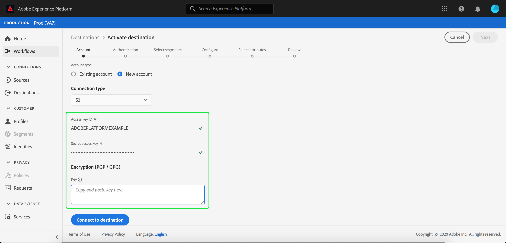

# Adobe Campaign 연결

Adobe Campaign은 온라인과 오프라인 등 모든 채널에서 캠페인을 개인화하고 전달할 수 있는 솔루션 집합입니다. 자세한 내용은 [Campaign Classic 시작](https://experienceleague.adobe.com/docs/campaign-classic/using/getting-started/starting-with-adobe-campaign/about-adobe-campaign-classic.html)을 참조하십시오.

세그먼트 데이터를 Adobe Campaign으로 전송하려면 먼저 Adobe Experience Platform에서 대상](#connect-destination)을 연결한 다음 [저장소 위치에서 Adobe Campaign으로 데이터 가져오기](#import-data-into-campaign)를 설정해야 합니다.[

## 내보내기 유형 {#export-type}

**프로필 기반**  - 원하는 스키마 필드와 함께 세그먼트의 모든 구성원을 내보냅니다(예:이메일 주소, 전화 번호, 성)을  **[!UICONTROL Select attributes]** 대상 활성화  [작업 과정](../../ui/activate-destinations.md#select-attributes) 단계에서 선택한 대로 설정합니다.

## 연결 대상 {#connect-destination}

**[!UICONTROL Connections]** > **[!UICONTROL Destinations]**&#x200B;에서 Adobe Campaign을 선택한 다음 **[!UICONTROL Configure]**&#x200B;를 선택합니다.

>[!NOTE]
>
>이 대상과의 연결이 이미 있는 경우 대상 카드에 **[!UICONTROL Activate]** 단추가 표시될 수 있습니다. [!UICONTROL Activate]과 [!UICONTROL Configure] 사이의 차이에 대한 자세한 내용은 대상 작업 공간 설명서의 [카탈로그](../../ui/destinations-workspace.md#catalog) 섹션을 참조하십시오.

Connect 대상 작업 과정의 **[!UICONTROL Account]** 단계에서 저장소 위치에 대한 **[!UICONTROL Connection type]**&#x200B;을 선택합니다. Adobe Campaign의 경우 **[!UICONTROL Amazon S3]**, **[!UICONTROL SFTP with Password]**, **[!UICONTROL SFTP with SSH Key]** 및 **[!UICONTROL Azure Blob]** 중에서 선택할 수 있습니다. Adobe Campaign으로 데이터를 보내는 데 권장되는 방법은 [!DNL Amazon S3] 또는 [!DNL Azure Blob]입니다. 연결 유형에 따라 아래 정보를 입력한 다음 **[!UICONTROL Connect]**&#x200B;을 선택합니다.

- **[!UICONTROL Amazon S3]** 연결의 경우 액세스 키 ID와 비밀 액세스 키를 제공해야 합니다.
- **[!UICONTROL SFTP with Password]** 연결의 경우 도메인, 포트, 사용자 이름 및 암호를 제공해야 합니다.
- **[!UICONTROL SFTP with SSH Key]** 연결의 경우 도메인, 포트, 사용자 이름 및 SSH 키를 제공해야 합니다.
- **[!UICONTROL Azure Blob]** 연결의 경우 연결 문자열을 제공해야 합니다.

원하는 경우, RSA 형식 공개 키를 첨부하여 PGP/GPG를 사용하여 암호화를 **[!UICONTROL Key]** 섹션 아래의 내보낸 파일에 추가할 수 있습니다. 이 공개 키 **는 Base64 인코딩 문자열로 기록되어야 합니다.**

**[!UICONTROL Account authentication]**&#x200B;에서 아래와 같이 대상에 대한 관련 정보를 입력합니다.
- **[!UICONTROL Name]**:대상의 관련 이름을 선택합니다.
- **[!UICONTROL Description]**:대상에 대한 설명을 입력합니다.
- **[!UICONTROL Bucket Name]**: *S3 연결을 참조하십시오*. 내보내기 데이터를 CSV 또는 탭으로 구분된 파일로 저장할 S3 버킷의 위치를 입력합니다.[!DNL Platform]
- **[!UICONTROL Folder Path]**:내보내기 데이터를 CSV 또는 탭 구분 파일 [!DNL Platform] 로 저장할 저장 위치에 경로를 제공합니다.
- **[!UICONTROL Container]**: *Blob 연결의 경우*. 폴더 경로가 있는 Blob가 들어 있는 컨테이너입니다.
- **[!UICONTROL File Format]**: **CSV** 또는  **TAB_DIPORTED**. 저장소 위치로 내보낼 파일 형식을 선택합니다.
- **[!UICONTROL Marketing actions]**:마케팅 작업은 데이터를 대상에 내보내려는 의도를 나타냅니다. Adobe 정의 마케팅 작업 중에서 선택하거나 자신의 마케팅 작업을 만들 수 있습니다. 마케팅 작업에 대한 자세한 내용은 [데이터 사용 정책 개요](../../../data-governance/policies/overview.md) 페이지를 참조하십시오. 같은 문서에서 [Adobe 정의 마케팅 작업](../../../data-governance/policies/overview.md#core-actions)도 참조하십시오.

위의 필드를 채운 후 **[!UICONTROL Create destination]**&#x200B;을 선택합니다. 이제 대상이 연결되었으며 [세그먼트](../../ui/activate-destinations.md)를 대상에 활성화할 수 있습니다.

## 세그먼트 활성화 {#activate-segments}

세그먼트 활성화 작업 과정에 대한 자세한 내용은 [프로필 및 세그먼트를 대상](../../ui/activate-destinations.md)에 활성화를 참조하십시오.

## 대상 특성 {#destination-attributes}

[세그먼트](../../ui/activate-destinations.md)를 Adobe Campaign 대상에 활성화하는 경우 [공용 스키마](../../../profile/home.md#profile-fragments-and-union-schemas)에서 고유한 식별자를 선택하는 것이 좋습니다. 대상으로 내보낼 고유 식별자 및 기타 XDM 필드를 선택합니다. 자세한 내용은 이메일 마케팅 대상 문서에서 내보낸 파일](./overview.md#destination-attributes)에서 대상 특성으로 사용할 스키마 필드 선택을 참조하십시오.[

## 내보낸 데이터 {#exported-data}

[!DNL Adobe Campaign] 대상의 경우 [!DNL Platform]은 사용자가 제공한 저장 위치에 탭으로 구분된 `.txt` 또는 `.csv` 파일을 만듭니다. 파일에 대한 자세한 내용은 세그먼트 활성화 자습서에서 [이메일 마케팅 대상 및 클라우드 스토리지 대상](../../ui/activate-destinations.md#esp-and-cloud-storage)을 참조하십시오.

## Adobe Campaign {#import-data-into-campaign}에 데이터 가져오기 설정

>[!IMPORTANT]
>
>- 이 통합을 수행하는 동안 Adobe Campaign 계약에 따라 SFTP 저장소 제한, 데이터베이스 저장소 제한 및 활성 프로필 제한에 주의하십시오.
>- [!DNL Campaign] 워크플로우를 사용하여 Adobe Campaign에서 내보낸 세그먼트를 예약, 가져오기 및 매핑해야 합니다. Adobe Campaign Classic 설명서에서 [반복 가져오기 설정](https://experienceleague.adobe.com/docs/campaign-classic/using/automating-with-workflows/use-cases/data-management/recurring-import-workflow.html) 및 Adobe Campaign Standard 설명서에서 [데이터 관리 활동 정보](https://experienceleague.adobe.com/docs/campaign-standard/using/managing-processes-and-data/data-management-activities/about-data-management-activities.html)를 참조하십시오.
>- Adobe Campaign으로 데이터를 보내는 데 권장되는 방법은 [!DNL Amazon S3] 또는 [!DNL Azure Blob]입니다.

[!DNL Platform]을(를) [!DNL Amazon S3] 또는 [!DNL Azure Blob] 스토리지에 연결한 후 저장소 위치에서 Adobe Campaign으로 데이터 가져오기를 설정해야 합니다. 이를 수행하는 방법에 대한 자세한 내용은 다음 Adobe Campaign 설명서 페이지를 참조하십시오.
- [Adobe Campaign Classic 문서에서 데이터 가져오기 및 내보내기](https://experienceleague.adobe.com/docs/campaign-classic/using/getting-started/importing-and-exporting-data/get-started-data-import-export.html) 와  [데이터 로드(파일)](https://experienceleague.adobe.com/docs/campaign-classic/using/automating-with-workflows/action-activities/data-loading--file-.html) 를 시작합니다.
- [Adobe Campaign Standard 설명서에서 프로세스 및 데이터 ](https://experienceleague.adobe.com/docs/campaign-standard/using/managing-processes-and-data/get-started-workflows.html) 관리 및  [로드 ](https://experienceleague.adobe.com/docs/campaign-standard/using/managing-processes-and-data/data-management-activities/load-file.html) 파일을 시작합니다.