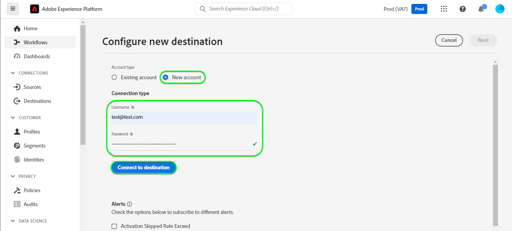

# [!DNL Mailchimp Interest Categories] 연결

[[!DNL Mailchimp]](https://mailchimp.com) 은(는) 기업에서 연락처를 관리하고 상담하는 데 사용하는 인기 있는 마케팅 자동화 플랫폼 및 이메일 마케팅 서비스입니다 *(클라이언트, 고객 또는 기타 이해 당사자)* 메일링 목록 및 이메일 마케팅 캠페인 사용. 이 커넥터를 사용하여 관심사 및 선호도에 따라 연락처를 정렬합니다.

[!DNL Mailchimp Interest Categories] 사용 [대상](https://mailchimp.com/help/getting-started-audience/), [그룹](https://mailchimp.com/help/getting-started-with-groups/), 및 관심 범주 *(그룹 이름 또는 그룹 제목이라고도 함)*. 각 [!DNL Mailchimp] 그룹은 관심 범주 목록입니다. 연락처는 웹 사이트의 등록 양식을 통해 하나 이상의 관심 범주를 구독할 때 관심 범주와 연결됩니다. 또한 대상자 내에서 연락처를 그룹으로 구성하고 관심 카테고리와 연결할 수 있으며, 세그먼트를 만드는 데 이 연락처를 사용할 수 있습니다. 이러한 대상을 사용하여 타겟팅된 캠페인 이메일을 구독한 연락처에 브로드캐스트할 수 있습니다.

<!--
Compared to [!DNL Mailchimp Tags] which you would use for internal classification, [!DNL Mailchimp Interest Categories] is meant to manage subscriptions to topics of interest that your contacts might be interested in. *Note, Experience Platform also has a connection for [!DNL Mailchimp Tags], you can check it out on the [[!DNL Mailchimp Tags]](/help/destinations/catalog/email-marketing/mailchimp-tags.md) page.*
-->

이 [!DNL Adobe Experience Platform] [대상](/help/destinations/home.md) 를 사용합니다. [[!DNL Mailchimp batch subscribe or unsubscribe API]](https://mailchimp.com/developer/marketing/api/lists/batch-subscribe-or-unsubscribe/) 생성할 API [관심 범주](https://mailchimp.com/developer/marketing/api/interest-categories/) 그런 다음 선택한 각 Platform 대상자의 연락처를 해당 관심사 카테고리에 추가합니다. 다음을 수행할 수 있습니다. **새 연락처 추가** 또는 **기존 의 정보 업데이트 [!DNL Mailchimp] 연락처**, 그런 다음 **원하는 그룹에서 추가하거나 제거합니다.** 기존 항목 내 [!DNL Mailchimp] 새 세그먼트 내에서 대상자를 활성화한 후 대상자입니다. [!DNL Mailchimp Interest Groups] 플랫폼에서 선택한 대상 이름을 내 관심 카테고리로 사용합니다. [!DNL Mailchimp].

## 사용 사례 {#use-cases}

을(를) 사용하는 방법과 시기를 더 잘 이해할 수 있도록 [!DNL Mailchimp Interest Categories] destination은 Adobe Experience Platform 고객이 이 대상을 사용하여 해결할 수 있는 샘플 사용 사례입니다.

### 마케팅 캠페인을 위해 연락처에 이메일 보내기 {#use-case-send-emails}

스포츠 용품 웹사이트의 판매부는 축구에 관심이 있다고 스스로 확인한 연락처 목록에 이메일 기반의 마케팅 캠페인을 방송하기를 원한다. 연락처 목록은 웹 사이트의 개발 팀으로부터 받은 데이터 내보내기의 배치로 분리되므로 추적해야 합니다. 팀이 기존 을(를) 식별함 [!DNL Mailchimp] 대상자 및 는 각 목록의 연락처가 추가되는 Experience Platform 대상자 빌드를 시작합니다. 이 대상자를 (으)로 보낸 후 [!DNL Mailchimp Interest Categories], 선택한 항목에 연락처가 없는 경우 [!DNL Mailchimp] 대상자는 연락처가 속한 대상자 이름으로 그룹에 추가됩니다. 에 연락처가 이미 있는 경우 [!DNL Mailchimp] 대상자 또는 그룹이 있는 경우 해당 정보가 업데이트됩니다. 데이터가 (으)로 전송되면 [!DNL Mailchimp Interest Categories], Sales Team에서 마케팅 캠페인 이메일을 선택하여 [!DNL Mailchimp] 대상입니다.

## 전제 조건 {#prerequisites}

Experience Platform 및 에서 설정해야 하는 사전 요구 사항에 대해서는 아래 섹션을 참조하십시오 [!DNL Mailchimp] 및 를 사용하기 전에 수집해야 하는 정보의 경우 [!DNL Mailchimp Interest Categories] 대상.

### Experience Platform의 사전 요구 사항 {#prerequisites-in-experience-platform}

에 대한 데이터를 활성화하기 전에 [!DNL Mailchimp Interest Categories] 대상, 다음 항목이 있어야 합니다. [스키마](/help/xdm/schema/composition.md), a [데이터 세트](https://experienceleague.adobe.com/docs/platform-learn/tutorials/data-ingestion/create-datasets-and-ingest-data.html), 및 [세그먼트](https://experienceleague.adobe.com/docs/platform-learn/tutorials/segments/create-segments.html) 생성 위치 [!DNL Experience Platform].

### 사전 요구 사항 [!DNL Mailchimp Interest Categories] 대상 {#prerequisites-destination}

Platform에서 로 데이터를 내보내려면 다음 전제 조건을 참고하십시오. [!DNL Mailchimp] 계정:

#### 다음 항목이 있어야 합니다. [!DNL Mailchimp] account {#prerequisites-account}

다음을 만들기 전에 [!DNL Mailchimp Interest Categories] 대상, 먼저 다음 항목이 있는지 확인해야 합니다. [!DNL Mailchimp] 계정입니다. 아직 없다면 다음을 방문하십시오. [[!DNL Mailchimp] 등록 페이지](https://login.mailchimp.com/signup/) 을 클릭하여 계정을 등록하고 만듭니다.

#### 수집 [!DNL Mailchimp] API 키 {#gather-credentials}

다음 항목이 필요합니다. [!DNL Mailchimp] **API 키** 을(를) 인증하려면 [!DNL Mailchimp Interest Categories] 대상 대 사용자 [!DNL Mailchimp] 계정입니다. 다음 **API 키** 은(는) 다음 역할을 합니다. **암호** 다음을 수행하는 경우 [대상 인증](#authenticate).

다음 항목이 없는 경우 **API 키**, 계정에 로그인하고 다음을 참조하십시오. [[!DNL Mailchimp] API 키 생성](https://mailchimp.com/developer/marketing/guides/quick-start/#generate-your-api-key) 문서 를 참조하십시오.

API 키의 예는 다음과 같습니다. `0123456789abcdef0123456789abcde-us14`.

>[!IMPORTANT]
>
>다음을 생성하는 경우 **API 키**&#x200B;를 생성한 후에는 액세스할 수 없으므로 적어 두십시오.

#### 식별 [!DNL Mailchimp] 데이터 센터 {#identify-data-center}

다음으로, 다음을 확인해야 합니다. [!DNL Mailchimp] 데이터 센터입니다. 이렇게 하려면 다음에 로그인합니다. [!DNL Mailchimp] 계정 및 다음으로 이동 **API 키 섹션** 계정 내.

값은 브라우저에 표시되는 URL의 첫 번째 부분입니다. URL이 *https://`us14`.mailchimp.com/account/api/*, 그런 다음 데이터 센터는 `us14`.

또한 양식의 API 키에도 추가됩니다 *key-dc*: API 키가 `0123456789abcdef0123456789abcde-us14`, 그런 다음 데이터 센터는 `us14`.

데이터 센터 값 기록 *(`us14` 이 예제에서는)*, 다음과 같은 경우 이 값이 필요합니다. [대상 세부 사항 입력](#destination-details).

추가 지침이 필요한 경우 [[!DNL Mailchimp] 기본 사항 설명서](https://mailchimp.com/developer/marketing/docs/fundamentals/#api-structure).

### 가드레일 {#guardrails}

각 사용자 [!DNL Mailchimp] 대상은 단일 그룹 또는 동일한 대상 내의 여러 그룹에 최대 60개의 그룹 이름(또는 관심 카테고리)을 포함할 수 있습니다. 을(를) 참조하십시오 [!DNL Mailchimp] [그룹](https://mailchimp.com/help/getting-started-with-groups/) 필요한 설명이 없습니다. 이 한도에 도달하면 `400 BAD_REQUEST Cannot have more than 60 interests per list (Across all categories)` 메시지를 오류 응답으로 사용 [!DNL Mailchimp] API.

또한 다음을 참조하십시오 [!DNL Mailchimp] [비율 제한](https://mailchimp.com/developer/marketing/docs/fundamentals/#api-limits) 에 의해 적용되는 제한에 대한 자세한 정보 [!DNL Mailchimp] API.

## 지원되는 ID {#supported-identities}

[!DNL Mailchimp] 는 아래 표에 설명된 id 활성화를 지원합니다. 자세히 알아보기 [id](/help/identity-service/namespaces.md).

| 대상 ID | 설명 | 고려 사항 |
|---|---|---|
| 이메일 | 연락처 이메일 주소 | 필수입니다 |

{style="table-layout:auto"}

## 내보내기 유형 및 빈도 {#export-type-frequency}

대상 내보내기 유형 및 빈도에 대한 자세한 내용은 아래 표를 참조하십시오.

| 항목 | 유형 | 참고 |
---------|----------|---------|
| 내보내기 유형 | **[!UICONTROL 프로필 기반]** | <ul><li>원하는 스키마 필드와 함께 세그먼트의 모든 멤버를 내보냅니다 *(예: 이메일 주소, 전화번호, 성)*&#x200B;를 입력합니다.</li><li> 플랫폼에서 선택한 각 대상에 대해 [!DNL Mailchimp Interest Categories] 세그먼트 상태가 플랫폼의 대상자 상태로 업데이트됩니다.</li></ul> |
| 내보내기 빈도 | **[!UICONTROL 스트리밍]** | 스트리밍 대상은 &quot;항상&quot; API 기반 연결입니다. 대상자 평가를 기반으로 Experience Platform에서 프로필을 업데이트하면 커넥터가 업데이트 다운스트림을 대상 플랫폼으로 보냅니다. 자세한 내용 [스트리밍 대상](/help/destinations/destination-types.md#streaming-destinations). |

{style="table-layout:auto"}

## 대상에 연결 {#connect}

>[!IMPORTANT]
>
>대상에 연결하려면 다음이 필요합니다. **[!UICONTROL 대상 관리]** [액세스 제어 권한](/help/access-control/home.md#permissions). 읽기 [액세스 제어 개요](/help/access-control/ui/overview.md) 필요한 권한을 얻으려면 제품 관리자에게 문의하십시오.

이 대상에 연결하려면 다음과같이 하십시오. [대상 구성 자습서](../../ui/connect-destination.md). 대상 구성 워크플로에서 아래 두 섹션에 나열된 필드를 채웁니다.

다음 범위 내 **[!UICONTROL 대상]** > **[!UICONTROL 카탈로그]**, 검색 [!DNL Mailchimp Interest Categories]. 또는 **[!UICONTROL 이메일 마케팅]** 범주.

### 대상으로 인증 {#authenticate}

대상에 인증하려면 아래의 필수 필드를 입력한 다음 을(를) 선택합니다. **[!UICONTROL 대상에 연결]**.

| 필드 | 설명 |
| --- | --- |
| **[!UICONTROL 사용자 이름]** | 사용자 [!DNL Mailchimp Interest Categories] 사용자 이름. |
| **[!UICONTROL 암호]** | 사용자 [!DNL Mailchimp] **API 키**&#x200B;을 참조하십시오. [수집 [!DNL Mailchimp] 자격 증명](#gather-credentials) 섹션.  API 키는 다음 형식을 사용합니다. `{KEY}-{DC}`, 여기서 `{KEY}` 부분은에 언급된 값을 나타냅니다. [[!DNL Mailchimp] API 키](#gather-credentials) 섹션 및 `{DC}` 부분은 [[!DNL Mailchimp] 데이터 센터](#identify-data-center).  다음 중 하나를 제공할 수 있습니다. `{KEY}` 부분 또는 전체 양식입니다.  예를 들어 API 키가  *`0123456789abcdef0123456789abcde-us14`*,  다음 중 하나를 제공할 수 있습니다&#x200B;*`0123456789abcdef0123456789abcde`*또는&#x200B;*`0123456789abcdef0123456789abcde-us14`*을 값으로 추가합니다. |

{style="table-layout:auto"}

제공된 세부 정보가 유효한 경우 UI에 **[!UICONTROL 연결됨]** 녹색 확인 표시가 있는 상태. 그런 다음 다음 다음 단계로 진행할 수 있습니다.

### 대상 세부 정보 입력 {#destination-details}

대상에 대한 세부 정보를 구성하려면 아래의 필수 및 선택 필드를 채우십시오. UI에서 필드 옆에 있는 별표는 필드가 필수임을 나타냅니다.

| 필드 | 설명 |
| --- | --- |
| **[!UICONTROL 이름]** | 나중에 이 대상을 인식할 수 있는 이름입니다. |
| **[!UICONTROL 설명]** | 나중에 이 대상을 식별하는 데 도움이 되는 설명입니다. |
| **[!UICONTROL 데이터 센터]** | 사용자 [!DNL Mailchimp] account `data center`. 다음을 참조하십시오. [식별 [!DNL Mailchimp] 데이터 센터](#identify-data-center) 섹션에 자세히 설명되어 있습니다. |
| **[!UICONTROL 대상 이름(먼저 데이터 센터를 선택하십시오.)]** | 다음을 선택한 후 **[!UICONTROL 데이터 센터]**, 이 드롭다운은 의 대상 이름으로 자동으로 채워집니다. [!DNL Mailchimp] 계정입니다. Platform의 데이터로 업데이트할 대상을 선택합니다. |
| **[!UICONTROL 관심 카테고리(먼저 데이터 센터 및 대상 이름을 선택하십시오.)]** | 다음을 선택한 후 **[!UICONTROL 대상자 이름]**, 이 드롭다운에는 의 관심 그룹 범주 이름이 자동으로 채워집니다. [!DNL Mailchimp] 계정입니다. Platform의 데이터로 업데이트할 카테고리 이름을 선택합니다. |

{style="table-layout:auto"}

>[!TIP]
>
> 에 제공한 API 키인 경우 **[!UICONTROL 암호]** 필드 또는 **[!UICONTROL 데이터 센터]** 값이 잘못되었습니다. UI에 [!DNL Mailchimp] API 오류 응답: *`No options are available. Please verify the values selected for the following dependent fields: dataCenter`* 아래와 같이 표시됩니다. 이 경우 **[!UICONTROL 대상 이름(먼저 데이터 센터를 선택하십시오.)]** 필드. 이 오류를 해결하려면 올바른 값을 입력하십시오.

### 경고 활성화 {#enable-alerts}

경고를 활성화하여 대상에 대한 데이터 흐름 상태에 대한 알림을 받을 수 있습니다. 목록에서 경고를 선택하여 데이터 흐름 상태에 대한 알림을 수신합니다. 경고에 대한 자세한 내용은 다음 안내서를 참조하십시오. [UI를 사용하여 대상 경고 구독](../../ui/alerts.md).

대상 연결에 대한 세부 정보를 제공했으면 을 선택합니다. **[!UICONTROL 다음]**.

## 이 대상으로 대상자 활성화 {#activate}

>[!IMPORTANT]
> 
>* 데이터를 활성화하려면 **[!UICONTROL 대상 관리]**, **[!UICONTROL 대상 활성화]**, **[!UICONTROL 프로필 보기]**, 및 **[!UICONTROL 세그먼트 보기]** [액세스 제어 권한](/help/access-control/home.md#permissions). 읽기 [액세스 제어 개요](/help/access-control/ui/overview.md) 필요한 권한을 얻으려면 제품 관리자에게 문의하십시오.
>* 내보내려면 *id*, 다음이 필요합니다. **[!UICONTROL ID 그래프 보기]** [액세스 제어 권한](/help/access-control/home.md#permissions).   {width="100" zoomable="yes"}

읽기 [스트리밍 대상자 내보내기 대상으로 프로필 및 대상자 활성화](/help/destinations/ui/activate-segment-streaming-destinations.md) 이 대상에 대한 대상자 활성화에 대한 지침을 참조하십시오.

### 매핑 고려 사항 및 예제 {#mapping-considerations-example}

대상 데이터를 Adobe Experience Platform에서 로 올바르게 보내려면 [!DNL Mailchimp Interest Categories] 대상, 필드 매핑 단계를 거쳐야 합니다. 매핑은 Platform 계정의 XDM(Experience Data Model) 스키마 필드와 대상 대상의 해당 필드 간에 링크를 만드는 것으로 구성됩니다.

XDM 필드를 [!DNL Mailchimp Interest Categories] 대상 필드에서 아래 단계를 수행합니다.

1. 다음에서 **[!UICONTROL 매핑]** 단계, 선택 **[!UICONTROL 새 매핑 추가]**. 이제 새 매핑 행이 화면에 표시됩니다.
1. 다음에서 **[!UICONTROL 소스 필드 선택]** 창에서 다음을 선택합니다. **[!UICONTROL 속성 선택]** 범주를 선택한 다음 XDM 속성을 선택하거나 **[!UICONTROL ID 네임스페이스 선택]** id를 선택합니다.
1. 다음에서 **[!UICONTROL 대상 필드 선택]** 창에서 다음을 선택합니다. **[!UICONTROL ID 네임스페이스 선택]** id를 선택하거나 **[!UICONTROL 속성 선택]** 범주별로 나열한 다음, [!DNL Mailchimp] API. *선택한 항목에 추가한 모든 사용자 지정 속성 [!DNL Mailchimp] 대상자를 대상 필드로 선택할 수도 있습니다.*

   XDM 프로필 스키마와 간에 사용 가능한 매핑 [!DNL Mailchimp Interest Categories] 은(는) 다음과 같습니다. | 소스 필드 | 대상 필드 | 메모 | | — | — | — | |`IdentityMap: Email`|`Identity: email`| 필수: 예 | |`xdm: person.name.firstName`|`Attribute: FNAME`| | |`xdm: person.name.lastName`|`Attribute: LNAME`| | |`xdm: person.birthDayAndMonth`|`Attribute: BIRTHDAY`| |

   또한, `ADDRESS` 은(는) 이라고 하는 특수 대상 필드입니다. `merge field` 내 [!DNL Mailchimp] 대상입니다. 다음 [[!DNL Mailchimp] 설명서](https://mailchimp.com/developer/marketing/docs/merge-fields/) 필요한 키를 다음과 같이 정의합니다. `addr1`, `city`, `state`, 및 `zip`및 선택적 키 `addr2` 및 `country`. 이러한 필드의 값은 문자열이어야 합니다. 다음 중 하나라도 `ADDRESS` 필드 매핑이 있으면 대상이 을 전달합니다. `ADDRESS` 에 대한 오브젝트 [!DNL Mailchimp] 업데이트를 위한 API입니다. 임의 `ADDRESS` 매핑되지 않은 필드의 기본값은 입니다. `NULL` 기본값으로 설정되는 국가를 제외하고 `US`.

   다음에 사용할 수 있는 매핑 `ADDRESS` 필드는 다음과 같습니다.

   | 소스 필드 | 대상 필드 |
   | --- | --- |
   | `xdm: workAddress.street1` | `Attribute: ADDRESS.addr1` |
   | `xdm: workAddress.street2` | `Attribute: ADDRESS.addr2` |
   | `xdm: workAddress.city` | `Attribute: ADDRESS.city` |
   | `xdm: workAddress.state` | `Attribute: ADDRESS.state` |
   | `xdm: workAddress.postalCode` | `Attribute: ADDRESS.zip` |
   | `xdm: workAddress.country` | `Attribute: ADDRESS.country` |

   예를 들어 의 값을 업데이트하려는 경우 `country` 연락처의 기존 주소 필드 사용 `addr1`, `city`, `state`, 및 `zip` 값: `132, My Street, Kingston`, `New York`, `New York` 및 `12401`. 를 업데이트하려면 `country` 변경 사항과 함께 기존 값을 전달해야 합니다. *(있는 경우)* and the new value새로운 for country국가 . 따라서 데이터 세트의 값은 `132, My Street, Kingston`, `New York`, `New York`, `12401`, 및 `US`. 반복하자면, `country` 및에 대한 값을 제공하지 않음 `addr1`, `city`, `state`, 및 `zip` 덮어쓸 예정입니다. `NULL`.

   완료된 매핑의 예가 아래에 나와 있습니다.
   

대상 연결에 대한 매핑 제공을 마쳤으면 다음을 선택합니다. **[!UICONTROL 다음]**.

## 데이터 내보내기 유효성 검사 {#exported-data}

대상을 올바르게 설정했는지 확인하려면 아래 단계를 수행하십시오.

* 에 로그인 [[!DNL Mailchimp]](https://login.mailchimp.com/) 계정입니다. 그런 다음 로 이동합니다. **[!DNL Audience]** 페이지를 가리키도록 업데이트하는 중입니다. 그런 다음 를 확장합니다. **[!DNL Manage Contacts]** 메뉴 및 선택 **[!DNL Groups]**.

* 그룹을 선택하고 선택한 대상이 플랫폼에서 대상 이름을 가진 카테고리로 만들어졌는지 확인합니다. 이 카테고리의 뒤에는 자동으로 생성된 접미사가 올 수 있습니다.
   * 이 대상은 선택한 세그먼트의 이름을 사용하여 [[!DNL Mailchimp] 관심 범주 API 추가](https://mailchimp.com/developer/marketing/api/interest-categories/add-interest-category/). 새 대상을 만들고 동일한 대상을 다시 활성화하는 경우 [!DNL Mailchimp] 기존 세그먼트와 새 세그먼트를 구분하는 접미사를 추가합니다.
* 그룹에 이메일이 없는 연락처는 새로 만든 카테고리에 추가됩니다.
* 그룹 내에 이미 존재하는 연락처의 경우 속성 필드 데이터가 업데이트되고, 연락처는 새로 생성된 카테고리에 추가됩니다.

## 데이터 사용 및 관리 {#data-usage-governance}

모두 [!DNL Adobe Experience Platform] 대상은 데이터를 처리할 때 데이터 사용 정책을 준수합니다. 방법에 대한 자세한 정보 [!DNL Adobe Experience Platform] 데이터 거버넌스 시행, 다음을 참조하십시오. [데이터 거버넌스 개요](/help/data-governance/home.md).

## 오류 및 문제 해결 {#errors-and-troubleshooting}

### 다음 경우에 오류 발생: [!DNL Mailchimp] API 키 또는 데이터 센터 값이 올바르지 않음 {#incorrect-credentials-error}

에 제공한 API 키인 경우 **[!UICONTROL 암호]** 필드 또는 **[!UICONTROL 데이터 센터]** 값이 잘못되었습니다. UI에 [!DNL Mailchimp] API 오류 응답: *`No options are available. Please verify the values selected for the following dependent fields: dataCenter`* 아래와 같이 표시됩니다. 이 경우 **[!UICONTROL 대상 이름(먼저 데이터 센터를 선택하십시오.)]** 필드.

이 오류를 수정하고 다음 단계로 진행하려면 올바른 값을 제공해야 합니다. 다음을 참조하십시오. [식별 [!DNL Mailchimp] 데이터 센터](#identify-data-center) 및
[수집 [!DNL Mailchimp] API 키](#gather-credentials) 지침이 필요한 경우 섹션.

### 다음 경우에 오류 발생: [!DNL Mailchimp] 그룹 이름 한도 초과 {#group-name-limits-error}

대상을 만들 때 다음과 같은 오류 메시지가 표시될 수 있습니다. *`Cannot have more than 60 interests per list (Across all categories)`* 또는 *`400 BAD_REQUEST`*. 이 문제는 다음에 설명된 대로 단일 그룹 또는 동일한 대상 제한 내의 여러 그룹에서 60개의 그룹 이름(또는 관심 카테고리)을 초과할 때 발생합니다. [보호 기능](#guardrails) 섹션. 이 오류를 수정하려면 의 그룹 이름 제한을 초과하지 않도록 하십시오. [!DNL Mailchimp].

### [!DNL Mailchimp] 상태 및 오류 코드

다음을 참조하십시오. [[!DNL Mailchimp] 오류 페이지](https://mailchimp.com/developer/marketing/docs/errors/) 설명이 포함된 상태 및 오류 코드의 전체 목록.

## 추가 리소스 {#additional-resources}

에서 제공하는 추가 유용한 정보 [!DNL Mailchimp] 설명서는 아래에 있습니다.
* [시작하기 [!DNL Mailchimp]](https://mailchimp.com/help/getting-started-with-mailchimp/)
* [대상자 시작](https://mailchimp.com/help/getting-started-audience/)
* [대상자 만들기](https://mailchimp.com/help/create-audience/)
* [그룹 시작하기](https://mailchimp.com/help/getting-started-with-groups/)
* [새 대상 그룹 만들기](https://mailchimp.com/help/create-new-audience-group/)
* [관심 범주](https://mailchimp.com/developer/marketing/api/interest-categories/)
* [마케팅 API](https://mailchimp.com/developer/marketing/api/)
