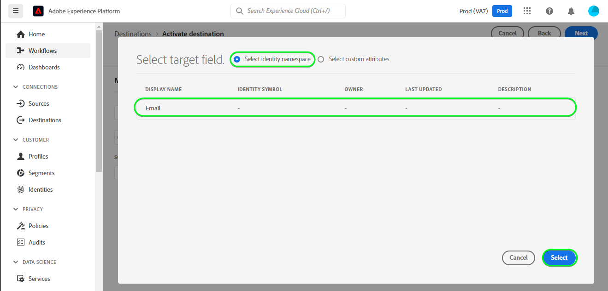

# [!DNL Mailchimp Tags] 연결

[[!DNL Mailchimp]](https://mailchimp.com) *([!DNL Intuit Mailchimp]이라고도 함)*&#x200B;은(는) 기업에서 메일링 목록 및 이메일 마케팅 캠페인을 사용하여 연락처 *(클라이언트, 고객 또는 기타 이해 당사자)을 관리하고 연락하는 데 사용하는 인기 있는 마케팅 자동화 플랫폼 및 이메일 마케팅 서비스입니다*.

[!DNL Mailchimp Tags]은(는) [대상](https://mailchimp.com/help/getting-started-audience/) 및 [태그](https://mailchimp.com/help/getting-started-tags/)를 사용하여 연락처 정보를 관리합니다. 태그는 연락처를 구성하고 [!DNL Mailchimp] 내에서 내부 분류에 대해 레이블을 지정할 수 있는 레이블입니다.

관심사 및 환경 설정에 따라 연락처를 정렬하는 데 사용하는 [!DNL Mailchimp Interest Categories]과(와) 비교하여 [!DNL Mailchimp Tags]은(는) 연락처가 관심을 가질 수 있는 관심 항목에 대한 구독을 관리하기 위한 것입니다. *참고: Experience Platform에 [!DNL Mailchimp Interest Categories]에 대한 연결도 있습니다. [[!DNL Mailchimp Interest Categories]](/help/destinations/catalog/email-marketing/mailchimp-interest-categories.md) 페이지에서 확인할 수 있습니다.*

이 [!DNL Adobe Experience Platform] [대상](/help/destinations/home.md)은(는) [[!DNL Mailchimp batch subscribe or unsubscribe API]](https://mailchimp.com/developer/marketing/api/lists/batch-subscribe-or-unsubscribe/) 끝점을 활용합니다. 새 대상 내에서 활성화한 후 기존 [!DNL Mailchimp] 대상 내에서 **새 연락처를 추가**&#x200B;하거나 **기존 [!DNL Mailchimp] 연락처의 태그를 업데이트**&#x200B;할 수 있습니다. [!DNL Mailchimp Tags]은(는) 플랫폼에서 선택한 대상 이름을 [!DNL Mailchimp] 내의 태그 이름으로 사용합니다.

## 사용 사례 {#use-cases}

[!DNL Mailchimp Tags] 대상을 사용하는 방법과 시기를 더 잘 이해할 수 있도록 Adobe Experience Platform 고객이 이 대상을 사용하여 해결할 수 있는 샘플 사용 사례를 소개합니다.

### 마케팅 캠페인을 위해 연락처에 이메일 보내기 {#use-case-send-emails}

조직의 영업 부서에서 이메일 기반 마케팅 캠페인을 선별된 연락처 목록에 브로드캐스트하려고 합니다. 연락처 목록은 다른 오프라인 출처에서 일괄적으로 수신되므로 추적해야 합니다. 팀은 기존 [!DNL Mailchimp]명의 대상을 식별하고 각 목록의 연락처가 추가되는 Experience Platform 대상을 빌드하기 시작합니다. 이 대상자를 [!DNL Mailchimp Tags](으)로 보낸 후 선택한 [!DNL Mailchimp] 대상자에 없는 연락처가 있으면 연락처가 속한 대상자 이름을 포함하는 연결된 태그와 함께 추가됩니다. [!DNL Mailchimp] 대상에 이미 연락처가 있는 경우 대상자의 이름을 가진 새 태그가 추가됩니다. 레이블이 [!DNL Mailchimp]에 표시되므로 오프라인 소스를 쉽게 식별할 수 있습니다. 데이터를 [!DNL Mailchimp](으)로 보낸 후 마케팅 캠페인 이메일을 대상자에게 보냅니다.

## 전제 조건 {#prerequisites}

Experience Platform 및 [!DNL Mailchimp]에서 설정해야 하는 필수 구성 요소와 [!DNL Mailchimp Tags] 대상으로 작업하기 전에 수집해야 하는 정보는 아래 섹션을 참조하십시오.

### Experience Platform의 사전 요구 사항 {#prerequisites-in-experience-platform}

[!DNL Mailchimp Tags] 대상에 대한 데이터를 활성화하기 전에 [!DNL Experience Platform]에서 만든 [스키마](/help/xdm/schema/composition.md), [데이터 세트](https://experienceleague.adobe.com/docs/platform-learn/tutorials/data-ingestion/create-datasets-and-ingest-data.html?lang=en) 및 [대상](https://experienceleague.adobe.com/docs/platform-learn/tutorials/audiences/create-audiences.html)이 있어야 합니다.

### [!DNL Mailchimp Tags] 대상에 대한 필수 구성 요소 {#prerequisites-destination}

Platform에서 [!DNL Mailchimp Tags] 계정으로 데이터를 내보내려면 다음 전제 조건을 참고하십시오.

#### [!DNL Mailchimp] 계정이 있어야 합니다. {#prerequisites-account}

[!DNL Mailchimp Tags] 대상을 만들려면 먼저 [!DNL Mailchimp] 계정이 있는지 확인해야 합니다. 아직 등록하지 않은 경우 [[!DNL Mailchimp] 등록 페이지](https://login.mailchimp.com/signup/)를 방문하여 계정을 등록하고 만드십시오.

#### [!DNL Mailchimp] API 키 수집 {#gather-credentials}

[!DNL Mailchimp] 계정에 대해 [!DNL Mailchimp Interest Categories] 대상을 인증하려면 [!DNL Mailchimp] **API 키**&#x200B;가 필요합니다. [대상을 인증](#authenticate)할 때 **API 키**&#x200B;이(가) **암호** 역할을 합니다.

**API 키**&#x200B;가 없는 경우 [!DNL Mailchimp] 계정에 로그인하고 [API 키 생성 방법](https://mailchimp.com/developer/marketing/guides/quick-start/#generate-your-api-key)에 대한 [!DNL Mailchimp] 설명서를 참조하십시오.

API 키의 예는 `0123456789abcdef0123456789abcde-us14`입니다.

>[!IMPORTANT]
>
>**API 키**&#x200B;를 생성하는 경우 생성 후에는 액세스할 수 없으므로 기록하십시오.

#### [!DNL Mailchimp] 데이터 센터 식별 {#identify-data-center}

다음으로 [!DNL Mailchimp] 데이터 센터를 식별해야 합니다. 이렇게 하려면 [!DNL Mailchimp] 계정에 로그인하고 계정의 **API 키 섹션**(으)로 이동합니다.

데이터 센터 ID는 브라우저에 표시되는 URL의 첫 번째 섹션입니다. URL이 *https://`us14`.mailchimp.com/account/api/*&#x200B;인 경우 데이터 센터는 `us14`입니다.

데이터 센터 ID는 *key-dc* 형식의 API 키에도 추가됩니다. 예를 들어 API 키가 `0123456789abcdef0123456789abcde-us14`이면 데이터 센터는 `us14`입니다.

데이터 센터 값 *(이 예제에서는 `us14`)*&#x200B;을(를) 기록하십시오. [대상 세부 정보를 입력](#destination-details)할 때 이 값이 필요합니다.

추가 지침이 필요한 경우 [[!DNL Mailchimp] 기본 사항 설명서](https://mailchimp.com/developer/marketing/docs/fundamentals/#api-structure)를 참조하세요.

### 가드레일 {#guardrails}

[!DNL Mailchimp] API에 의해 적용되는 제한에 대한 자세한 내용은 [!DNL Mailchimp] [등급 제한](https://mailchimp.com/developer/marketing/docs/fundamentals/#api-limits)을(를) 참조하십시오.

## 지원되는 ID {#supported-identities}

[!DNL Mailchimp]은(는) 아래 표에 설명된 ID 활성화를 지원합니다. [ID](/help/identity-service/features/namespaces.md)에 대해 자세히 알아보세요.

| 대상 ID | 설명 | 고려 사항 |
|---|---|---|
| 이메일 | 연락처의 이메일 주소입니다. | 필수 |

{style="table-layout:auto"}

## 지원되는 대상자 {#supported-audiences}

이 섹션에서는 이 대상으로 내보낼 수 있는 대상자 유형을 설명합니다.

| 대상자 원본 | 지원됨 | 설명 |
|---------|----------|----------|
| [!DNL Segmentation Service] | ✓ 덧신 | Experience Platform [세그먼테이션 서비스](../../../segmentation/home.md)를 통해 생성된 대상입니다. |
| 사용자 정의 업로드 | ✓ 덧신 | CSV 파일에서 Experience Platform으로 대상 [가져옴](../../../segmentation/ui/audience-portal.md#import-audience). |

{style="table-layout:auto"}

## 내보내기 유형 및 빈도 {#export-type-frequency}

대상 내보내기 유형 및 빈도에 대한 자세한 내용은 아래 표를 참조하십시오.

| 항목 | 유형 | 참고 |
---------|----------|---------|
| 내보내기 유형 | **[!UICONTROL 프로필 기반]** | <ul><li>필드 매핑에 따라 원하는 스키마 필드 *(예: 이메일 주소, 전화번호, 성)*&#x200B;과(와) 함께 대상자의 모든 구성원을 내보냅니다.</li><li> 플랫폼에서 선택한 각 대상에 대해 해당 [!DNL Mailchimp Tags] 세그먼트 상태가 플랫폼의 대상 상태로 업데이트됩니다.</li></ul> |
| 내보내기 빈도 | **[!UICONTROL 스트리밍]** | 스트리밍 대상은 &quot;항상&quot; API 기반 연결입니다. 대상자 평가를 기반으로 Experience Platform에서 프로필이 업데이트되는 즉시 커넥터가 업데이트 다운스트림을 대상 플랫폼으로 전송합니다. [스트리밍 대상](/help/destinations/destination-types.md#streaming-destinations)에 대해 자세히 알아보세요. |

{style="table-layout:auto"}

## 대상에 연결 {#connect}

>[!IMPORTANT]
>
>대상에 연결하려면 **[!UICONTROL 대상 관리]** [액세스 제어 권한](/help/access-control/home.md#permissions)이 필요합니다. [액세스 제어 개요](/help/access-control/ui/overview.md)를 읽거나 제품 관리자에게 문의하여 필요한 권한을 받으십시오.

이 대상에 연결하려면 [대상 구성 자습서](../../ui/connect-destination.md)에 설명된 단계를 따르십시오. 대상 구성 워크플로에서 아래 두 섹션에 나열된 필드를 채웁니다.

**[!UICONTROL 대상]** > **[!UICONTROL 카탈로그]** 내에서 [!DNL Mailchimp Tags]을(를) 검색합니다. 또는 **[!UICONTROL 이메일 마케팅]** 범주에서 찾을 수 있습니다.

### 대상으로 인증 {#authenticate}

대상에 인증하려면 아래의 필수 필드를 입력한 다음 **[!UICONTROL 대상에 연결]**&#x200B;을(를) 선택하십시오.

| 필드 | 설명 |
| --- | --- |
| **[!UICONTROL 사용자 이름]** | [!DNL Mailchimp] 사용자 이름입니다. |
| **[!UICONTROL 암호]** | [수집 [!DNL Mailchimp] 자격 증명](#gather-credentials) 섹션에서 기록한 [!DNL Mailchimp] **API 키**.  API 키는 `{KEY}-{DC}` 형식을 사용합니다. 여기서 `{KEY}` 부분은 [[!DNL Mailchimp] API 키](#gather-credentials) 섹션에 언급된 값을 참조하고 `{DC}` 부분은 [[!DNL Mailchimp] 데이터 센터](#identify-data-center)를 참조합니다.  `{KEY}` 부분 또는 전체 양식을 제공할 수 있습니다.  예를 들어 API 키가  *`0123456789abcdef0123456789abcde-us14`*, 인 경우&#x200B;*`0123456789abcdef0123456789abcde`*또는&#x200B;*`0123456789abcdef0123456789abcde-us14`*을(를) 값으로 제공할 수 있습니다. |

{style="table-layout:auto"}

인증 방법을 보여 주는 

제공된 세부 정보가 유효하면 UI에 녹색 확인 표시와 함께 **[!UICONTROL 연결됨]** 상태가 표시됩니다. 그런 다음 다음 다음 단계로 진행할 수 있습니다.

### 대상 세부 정보 입력 {#destination-details}

대상에 대한 세부 정보를 구성하려면 아래의 필수 및 선택 필드를 채우십시오. UI에서 필드 옆에 있는 별표는 필드가 필수임을 나타냅니다.

| 필드 | 설명 |
| --- | --- |
| **[!UICONTROL 이름]** | 나중에 이 대상을 인식할 수 있는 이름입니다. |
| **[!UICONTROL 설명]** | 나중에 이 대상을 식별하는 데 도움이 되는 설명입니다. |
| **[!UICONTROL 데이터 센터]** | [!DNL Mailchimp] 계정 `data center`입니다. 자세한 내용은 [데이터 센터 식별 [!DNL Mailchimp] 섹션](#identify-data-center)을 참조하세요. |
| **[!UICONTROL 대상 이름(먼저 데이터 센터를 입력하십시오)]** | **[!UICONTROL 데이터 센터]**&#x200B;를 입력하면 이 드롭다운이 [!DNL Mailchimp] 계정의 대상 이름으로 자동으로 채워집니다. Platform의 데이터로 업데이트할 대상을 선택합니다. |

{style="table-layout:auto"}

### 경고 활성화 {#enable-alerts}

경고를 활성화하여 대상에 대한 데이터 흐름 상태에 대한 알림을 받을 수 있습니다. 목록에서 경고를 선택하여 데이터 흐름 상태에 대한 알림을 수신합니다. 경고에 대한 자세한 내용은 [UI를 사용하여 대상 경고 구독](../../ui/alerts.md)에 대한 안내서를 참조하십시오.

대상 연결에 대한 세부 정보를 모두 제공했으면 **[!UICONTROL 다음]**&#x200B;을 선택합니다.

## 이 대상으로 대상자 활성화 {#activate}

>[!IMPORTANT]
> 
>* 데이터를 활성화하려면 **[!UICONTROL 대상 보기]**, **[!UICONTROL 대상 활성화]**, **[!UICONTROL 프로필 보기]** 및 **[!UICONTROL 세그먼트 보기]** [액세스 제어 권한](/help/access-control/home.md#permissions)이 필요합니다. [액세스 제어 개요](/help/access-control/ui/overview.md)를 읽거나 제품 관리자에게 문의하여 필요한 권한을 받으십시오.
>* *ID*&#x200B;을(를) 내보내려면 **[!UICONTROL ID 그래프 보기]** [액세스 제어 권한](/help/access-control/home.md#permissions)이 필요합니다.   {width="100" zoomable="yes"}

이 대상에 대한 대상 활성화에 대한 지침은 [스트리밍 대상에 대상 활성화](/help/destinations/ui/activate-segment-streaming-destinations.md)를 참조하십시오.

### 매핑 고려 사항 및 예제 {#mapping-considerations-example}

대상 데이터를 Adobe Experience Platform에서 [!DNL Mailchimp Tags] 대상으로 올바르게 보내려면 필드 매핑 단계를 거쳐야합니다. 매핑은 Platform 계정의 XDM(Experience Data Model) 스키마 필드와 대상 대상의 해당 필드 간에 링크를 만드는 것으로 구성됩니다.

XDM 필드를 [!DNL Mailchimp Tags] 대상 필드에 올바르게 매핑하려면 아래 단계를 따르십시오.

1. **[!UICONTROL 매핑]** 단계에서 **[!UICONTROL 새 매핑 추가]**&#x200B;를 선택합니다. 화면에 새 매핑 행이 표시됩니다.
1. **[!UICONTROL 원본 필드 선택]** 창에서 **[!UICONTROL ID 네임스페이스 선택]**&#x200B;을(를) 선택하고 `Email` ID 네임스페이스를 선택합니다.

   

1. **[!UICONTROL 대상 필드 선택]** 창에서 **[!UICONTROL ID 네임스페이스 선택]**&#x200B;을(를) 선택하고 `Email` ID 네임스페이스를 선택합니다.

   

   XDM 프로필 스키마와 [!DNL Mailchimp Tags] 간의 매핑은 다음과 같습니다.
| Source 필드 | 대상 필드 | 필수 |
| — | — | — |
|`IdentityMap: Email`|`Identity: Email`| 예 |

   완료된 매핑의 예가 아래에 나와 있습니다.
   

대상 연결에 대한 매핑을 제공했으면 **[!UICONTROL 다음]**&#x200B;을 선택합니다.

## 데이터 내보내기 유효성 검사 {#exported-data}

대상을 올바르게 설정했는지 확인하려면 아래 단계를 수행하십시오.

1. [[!DNL Mailchimp]](https://login.mailchimp.com/) 계정에 로그인합니다. 그런 다음 **[!DNL Audience]** > **[!DNL All Contacts]** 페이지로 이동하여 대상자의 연락처가 추가되고 대상자 내의 연락처가 대상자 이름으로 업데이트되었는지 확인합니다.
   대상 페이지를 표시하는 

## 데이터 사용 및 관리 {#data-usage-governance}

데이터를 처리할 때 모든 [!DNL Adobe Experience Platform] 대상이 데이터 사용 정책을 준수합니다. [!DNL Adobe Experience Platform]에서 데이터 거버넌스를 적용하는 방법에 대한 자세한 내용은 [데이터 거버넌스 개요](/help/data-governance/home.md)를 참조하십시오.

## 오류 및 문제 해결 {#errors-and-troubleshooting}

설명과 함께 상태 및 오류 코드의 전체 목록을 보려면 [[!DNL Mailchimp] 오류 페이지](https://mailchimp.com/developer/marketing/docs/errors/)를 참조하세요.

## 추가 리소스 {#additional-resources}

[!DNL Mailchimp] 설명서의 추가 유용한 정보는 다음과 같습니다.
* [시작하기 [!DNL Mailchimp]](https://mailchimp.com/help/getting-started-with-mailchimp/)
* [대상자 시작](https://mailchimp.com/help/getting-started-audience/)
* [대상자 만들기](https://mailchimp.com/help/create-audience/)
* [태그 시작](https://mailchimp.com/help/getting-started-tags/)
* [마케팅 API](https://mailchimp.com/developer/marketing/api/)
