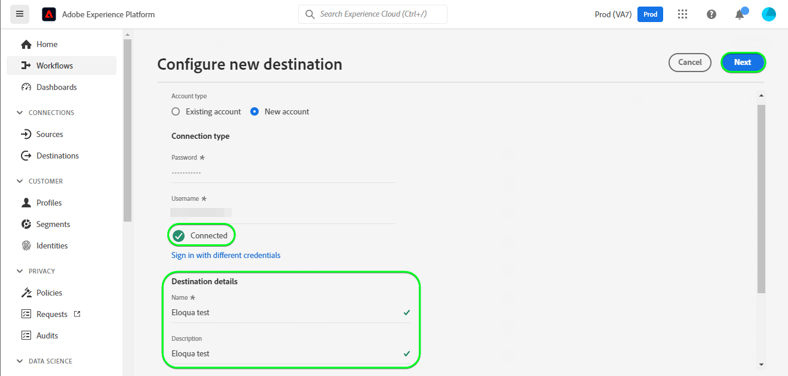

# [!DNL (API) Oracle Eloqua] 연결

[[!DNL Oracle Eloqua]](https://www.oracle.com/cx/marketing/automation/) 을 통해 마케터는 캠페인을 계획 및 실행하면서 잠재 고객을 위한 개인화된 고객 경험을 제공할 수 있습니다. 통합된 리드 관리와 손쉬운 캠페인 생성을 통해 마케터는 구매자의 여정에서 적시에 적절한 대상자를 참여시킬 수 있도록 지원하고 이메일, 디스플레이 검색, 비디오 및 모바일을 비롯한 다양한 채널에서 대상자에게 도달하도록 우아하게 확장할 수 있습니다. 영업 팀은 더 많은 거래를 더 빠른 속도로 마감할 수 있으므로 실시간 통찰력을 통해 마케팅 ROI를 높일 수 있습니다.

이 [!DNL Adobe Experience Platform] [대상](/help/destinations/home.md) 을 활용합니다. [연락처 업데이트](https://docs.oracle.com/en/cloud/saas/marketing/eloqua-rest-api/op-api-rest-1.0-data-contact-id-put.html) 에서 작업 [!DNL Oracle Eloqua] 다음을 수행할 수 있는 REST API **id 업데이트** 대상 내에서으로 [!DNL Oracle Eloqua].

[!DNL Oracle Eloqua] 사용 [기본 인증](https://docs.oracle.com/en/cloud/saas/marketing/eloqua-rest-api/Authentication_Basic.html) 을(를) 통해 [!DNL Oracle Eloqua] REST API. 에 대한 인증 지침 [!DNL Oracle Eloqua] 인스턴스는 다음보다 아래에 있습니다. [대상에 인증](#authenticate) 섹션.

## 사용 사례 {#use-cases}

온라인 플랫폼의 마케팅 부서에서 이메일 기반 마케팅 캠페인을 선별된 잠재 고객에게 브로드캐스트하려고 합니다. 플랫폼의 마케팅 팀은 Adobe Experience Platform을 통해 기존 잠재 고객 정보를 업데이트하고, 자체 오프라인 데이터에서 대상을 구축, 이러한 대상을 (으)로 보낼 수 있습니다. [!DNL Oracle Eloqua]그런 다음 마케팅 캠페인 이메일을 보내는 데 사용할 수 있습니다.

## 전제 조건 {#prerequisites}

### Experience Platform 사전 요구 사항 {#prerequisites-in-experience-platform}

에 대한 데이터를 활성화하기 전에 [!DNL Oracle Eloqua] 대상, 다음 항목이 있어야 합니다. [스키마](/help/xdm/schema/composition.md), a [데이터 세트](https://experienceleague.adobe.com/docs/platform-learn/tutorials/data-ingestion/create-datasets-and-ingest-data.html), 및 [세그먼트](https://experienceleague.adobe.com/docs/platform-learn/tutorials/segments/create-segments.html) 생성 위치 [!DNL Experience Platform].

다음에 대한 Experience Platform 설명서 참조: [대상자 멤버십 세부 정보 스키마 필드 그룹](/help/xdm/field-groups/profile/segmentation.md) 대상 상태에 대한 지침이 필요한 경우.

### [!DNL Oracle Eloqua] 전제 조건 {#prerequisites-destination}

Platform에서 로 데이터를 내보내려면 [!DNL Oracle Eloqua] 계정 이(가) 있어야 함 [!DNL Oracle Eloqua] 계정입니다.

또한 최소한 *&quot;고급 사용자 - 마케팅 권한&quot;* 에 대한 [!DNL Oracle Eloqua] 인스턴스. 다음을 참조하십시오. *&quot;보안 그룹&quot;* 다음에 대한 섹션 [보안 사용자 액세스](https://docs.oracle.com/en/cloud/saas/marketing/eloqua-user/Help/SecurityOverview/SecuredUserAccess.htm) 페이지 를 참조하십시오. 프로그래밍 방식으로 액세스하려면 대상에서 액세스 권한이 필요합니다. [기본 URL 확인](https://docs.oracle.com/en/cloud/saas/marketing/eloqua-rest-api/DeterminingBaseURL.html) 을(를) 호출할 때 [!DNL Oracle Eloqua] API.

#### 수집 [!DNL Oracle Eloqua] 자격 증명 {#gather-credentials}

에 인증하기 전에 아래 항목을 적어 두십시오. [!DNL Oracle Eloqua] 대상:

| 자격 증명 | 설명 |
| --- | --- |
| `Company Name` | 와(과) 연결된 회사 이름 [!DNL Oracle Eloqua] 계정입니다. <br>나중에 다음을 사용합니다. `Company Name` 및 [!DNL Oracle Eloqua] `Username` 를 로 사용할 연결된 문자열로 **[!UICONTROL 사용자 이름]** 조건 [대상에 대한 인증](#authenticate). |
| `Username` | 의 사용자 이름 [!DNL Oracle Eloqua] 계정입니다. |
| `Password` | 의 암호 [!DNL Oracle Eloqua] 계정입니다. |
| `Pod` | [!DNL Oracle Eloqua] 는 각각 고유한 도메인 이름을 가진 여러 데이터 센터를 지원합니다. [!DNL Oracle Eloqua] 이들을 &quot;pod&quot;라고 부르며, 현재 p01, p02, p03, p04, p06, p07, p08 총 7개가 있습니다. POD를 얻으려면 다음에 로그인합니다. [!DNL Oracle Eloqua] 에 로그인하고 나면 브라우저의 URL을 확인합니다. 예를 들어 브라우저 URL이 `secure.p01.eloqua.com` 본인 `pod` 은(는) `p01`. 다음을 참조하십시오. [pod 확인](https://community.oracle.com/topliners/discussion/4470225/determining-your-pod-number-for-oracle-eloqua) 추가 지침을 보려면 페이지를 참조하십시오. |

다음을 참조하십시오. [에 로그인 [!DNL Oracle Eloqua]](https://docs.oracle.com/en/cloud/saas/marketing/eloqua-user/Help/Administration/Tasks/SigningInToEloqua.htm#Signing) 지침을 참조하십시오.

## 가드레일 {#guardrails}

>[!NOTE]
>
>* [!DNL Oracle Eloqua] 사용자 지정 연락처 필드는 다음 작업 중에 선택한 대상자의 이름을 사용하여 자동으로 만들어집니다. **[!UICONTROL 세그먼트 선택]** 단계.

* [!DNL Oracle Eloqua] 에는 최대 250개의 사용자 지정 연락처 필드 제한이 있습니다.
* 새 대상을 내보내기 전에 Platform 대상의 수와 내의 기존 대상의 수를 확인해야 합니다 [!DNL Oracle Eloqua] 이 한도를 초과하지 마십시오.
* 이 한도를 초과하면 Experience Platform 시 오류가 발생합니다. 이유는 다음과 같습니다. [!DNL Oracle Eloqua] API가 요청의 유효성을 검사하지 못하고 -으로 응답합니다. *400: 유효성 검사 오류가 있습니다.* - 문제를 설명하는 오류 메시지.
* 위에서 지정한 제한에 도달한 경우 대상에서 기존 매핑을 제거하고 의 해당 사용자 지정 연락처 필드를 삭제해야 합니다 [!DNL Oracle Eloqua] 계정을 만든 후에 더 많은 세그먼트를 내보낼 수 있습니다.

* 다음을 참조하십시오. [[!DNL Oracle Eloqua] 연락처 필드 만들기](https://docs.oracle.com/en/cloud/saas/marketing/eloqua-user/Help/ContactFields/Tasks/CreatingContactFields.htm) 추가 제한에 대한 자세한 내용은 페이지를 참조하십시오.

## 지원되는 ID {#supported-identities}

[!DNL Oracle Eloqua] 는 아래 표에 설명된 id 업데이트를 지원합니다. 자세히 알아보기 [id](/help/identity-service/namespaces.md).

| 대상 ID | 설명 | 필수 |
|---|---|---|
| `EloquaId` | 연락처에 대한 고유 식별자. | 예 |

## 내보내기 유형 및 빈도 {#export-type-frequency}

대상 내보내기 유형 및 빈도에 대한 자세한 내용은 아래 표를 참조하십시오.

| 항목 | 유형 | 참고 |
---------|----------|---------|
| 내보내기 유형 | **[!UICONTROL 프로필 기반]** | <ul><li>원하는 스키마 필드와 함께 세그먼트의 모든 멤버를 내보냅니다 *(예: 이메일 주소, 전화번호, 성)*&#x200B;를 입력합니다.</li><li> 플랫폼에서 선택한 각 대상에 대해 [!DNL Oracle Eloqua] 세그먼트 상태가 플랫폼의 대상자 상태로 업데이트됩니다.</li></ul> |
| 내보내기 빈도 | **[!UICONTROL 스트리밍]** | <ul><li>스트리밍 대상은 &quot;항상&quot; API 기반 연결입니다. 대상자 평가를 기반으로 Experience Platform에서 프로필이 업데이트되는 즉시 커넥터가 업데이트 다운스트림을 대상 플랫폼으로 전송합니다. 자세한 내용 [스트리밍 대상](/help/destinations/destination-types.md#streaming-destinations).</li></ul> |

{style="table-layout:auto"}

## 대상에 연결 {#connect}

>[!IMPORTANT]
>
>대상에 연결하려면 다음이 필요합니다. **[!UICONTROL 대상 보기]** 및 **[!UICONTROL 대상 관리]** [액세스 제어 권한](/help/access-control/home.md#permissions). 읽기 [액세스 제어 개요](/help/access-control/ui/overview.md) 필요한 권한을 얻으려면 제품 관리자에게 문의하십시오.

이 대상에 연결하려면 다음과같이 하십시오. [대상 구성 자습서](../../ui/connect-destination.md). 대상 구성 워크플로에서 아래 두 섹션에 나열된 필드를 채웁니다.

다음 범위 내 **[!UICONTROL 대상]** > **[!UICONTROL 카탈로그]** 검색 대상 [!DNL (API) Oracle Eloqua]. 또는 아래에서 찾을 수 있습니다 **[!UICONTROL 이메일 마케팅]** 범주.

### 대상으로 인증 {#authenticate}

>[!CONTEXTUALHELP]
>id="platform_destinations_apioracleeloqua_companyname_username"
>title="회사 이름\사용자 이름"
>abstract="이 필드에 `{COMPANY_NAME}\{USERNAME}` 양식으로 Oracle Eloqua의 회사 이름과 사용자 이름을 입력합니다."

아래의 필수 필드를 입력하십시오. 다음을 참조하십시오. [수집 [!DNL Oracle Eloqua] 자격 증명](#gather-credentials) 섹션에 자세히 설명되어 있습니다.
* **[!UICONTROL 암호]**: 의 암호 [!DNL Oracle Eloqua] 계정입니다.
* **[!UICONTROL 사용자 이름]**: 다음으로 구성된 연결된 문자열 [!DNL Oracle Eloqua] 회사 이름 및 [!DNL Oracle Eloqua] 사용자 이름.<br>연결된 값은 다음 형식을 갖습니다. `{COMPANY_NAME}\{USERNAME}`.<br> 참고: 중괄호나 공백을 사용하지 말고 `\`. <br>예를 들어 [!DNL Oracle Eloqua] 회사 이름: `MyCompany` 및 [!DNL Oracle Eloqua] 사용자 이름: `Username`에서 사용할 연결된 값 **[!UICONTROL 사용자 이름]** 필드는 입니다. `MyCompany\Username`.

대상에 인증하려면 다음을 선택합니다. **[!UICONTROL 대상에 연결]**.


제공된 세부 정보가 유효한 경우 UI에 **[!UICONTROL 연결됨]** 녹색 확인 표시가 있는 상태. 그런 다음 다음 다음 단계로 진행할 수 있습니다.

### 대상 세부 정보 입력 {#destination-details}

>[!CONTEXTUALHELP]
>id="platform_destinations_apioracleeloqua_pod"
>title="Pod"
>abstract="Pod 번호를 찾으려면 Oracle Eloqua에 로그인하십시오. 정상적으로 로그인하고 나면 브라우저의 URL을 기록해 둡니다. "
>additional-url="https://support.oracle.com/knowledge/Oracle%20Cloud/2307176_1.html" text="Oracle 기술 자료 - Pod 번호 찾기"

대상에 대한 세부 정보를 구성하려면 아래의 필수 및 선택 필드를 채우십시오. UI에서 필드 옆에 있는 별표는 필드가 필수임을 나타냅니다.


* **[!UICONTROL 이름]**: 나중에 이 대상을 인식할 수 있는 이름입니다.
* **[!UICONTROL 설명]**: 나중에 이 대상을 식별하는 데 도움이 되는 설명입니다.
* **[!UICONTROL Pod]**: 가져올 항목 `pod` 을(를) 켜고 (으)로 로그인했습니다. [!DNL Oracle Eloqua] 에 로그인하고 나면 브라우저의 URL을 확인합니다. 예를 들어 브라우저 URL이 `secure.p01.eloqua.com` 다음 `pod` 선택해야 하는 값은 다음과 같습니다. `p01`. 다음을 참조하십시오. [수집 [!DNL Oracle Eloqua] 자격 증명](#gather-credentials) 섹션에 자세히 설명되어 있습니다.

### 경고 활성화 {#enable-alerts}

경고를 활성화하여 대상에 대한 데이터 흐름 상태에 대한 알림을 받을 수 있습니다. 목록에서 경고를 선택하여 데이터 흐름 상태에 대한 알림을 수신합니다. 경고에 대한 자세한 내용은 다음 안내서를 참조하십시오. [UI를 사용하여 대상 경고 구독](../../ui/alerts.md).

대상 연결에 대한 세부 정보를 제공했으면 을 선택합니다. **[!UICONTROL 다음]**.

## 이 대상으로 대상자 활성화 {#activate}

>[!IMPORTANT]
> 
>* 데이터를 활성화하려면 **[!UICONTROL 대상 보기]**, **[!UICONTROL 대상 활성화]**, **[!UICONTROL 프로필 보기]**, 및 **[!UICONTROL 세그먼트 보기]** [액세스 제어 권한](/help/access-control/home.md#permissions). 읽기 [액세스 제어 개요](/help/access-control/ui/overview.md) 필요한 권한을 얻으려면 제품 관리자에게 문의하십시오.
>* 내보내려면 *id*, 다음이 필요합니다. **[!UICONTROL ID 그래프 보기]** [액세스 제어 권한](/help/access-control/home.md#permissions). <br> {width="100" zoomable="yes"}

읽기 [스트리밍 대상자 내보내기 대상으로 프로필 및 대상자 활성화](/help/destinations/ui/activate-segment-streaming-destinations.md) 이 대상에 대한 대상자 활성화에 대한 지침을 참조하십시오.

### 매핑 고려 사항 및 예제 {#mapping-considerations-example}

대상 데이터를 Adobe Experience Platform에서 로 올바르게 보내려면 [!DNL Oracle Eloqua] 대상, 필드 매핑 단계를 거쳐야 합니다. 매핑은 Platform 계정의 XDM(Experience Data Model) 스키마 필드와 대상 대상의 해당 필드 간에 링크를 만드는 것으로 구성됩니다.

XDM 필드를 매핑하려면 [!DNL Oracle Eloqua] 대상 필드에서 다음 단계를 수행합니다.

1. 다음에서 **[!UICONTROL 매핑]** 단계, 선택 **[!UICONTROL 새 매핑 추가]**. 화면에 새 매핑 행이 표시됩니다.
1. 다음에서 **[!UICONTROL 소스 필드 선택]** 창에서 다음을 선택합니다. **[!UICONTROL 속성 선택]** 범주를 선택한 다음 XDM 속성을 선택하거나 **[!UICONTROL ID 네임스페이스 선택]** id를 선택합니다.
1. 다음에서 **[!UICONTROL 대상 필드 선택]** 창, 선택 **[!UICONTROL ID 네임스페이스 선택]** id를 선택하거나 **[!UICONTROL 사용자 지정 속성 선택]** 에서 원하는 속성 이름을 입력합니다 **[!UICONTROL 속성 이름]** 필드. 제공하는 속성 이름은 의 기존 연락처 속성과 일치해야 합니다. [!DNL Oracle Eloqua]. 다음을 참조하십시오 [[!DNL create a contact]](https://docs.oracle.com/en/cloud/saas/marketing/eloqua-rest-api/op-api-rest-1.0-data-contact-post.html) 에서 사용할 수 있는 정확한 속성 이름 [!DNL Oracle Eloqua].
   * 다음 단계를 반복하여 XDM 프로필 스키마와 간에 필요한 속성 매핑과 원하는 속성 매핑을 모두 추가합니다. [!DNL Oracle Eloqua]: | 소스 필드 | 대상 필드 | 필수 | |—|—| |`IdentityMap: Eid`|`Identity: EloquaId`| 예 | |`xdm: personalEmail.address`|`Attribute: emailAddress`| 예 | |`xdm: personName.firstName`|`Attribute: firstName`| | |`xdm: personName.lastName`|`Attribute: lastName`| | |`xdm: workAddress.street1`|`Attribute: address1`| | |`xdm: workAddress.street2`|`Attribute: address2`| | |`xdm: workAddress.street3`|`Attribute: address3`| | |`xdm: workAddress.postalCode`|`Attribute: postalCode`| | |`xdm: workAddress.country`|`Attribute: country`| | |`xdm: workAddress.city`|`Attribute: city`| |

   * 위 매핑의 예가 아래에 나와 있습니다.
     

>[!IMPORTANT]
>
>* 에 지정된 속성 **[!UICONTROL 대상 필드]** 는에 지정된 것과 정확히 동일하게 이름이 지정되어야 합니다. [[!DNL Create a contact]](https://docs.oracle.com/en/cloud/saas/marketing/eloqua-rest-api/op-api-rest-1.0-data-contact-post.html) 이 속성은 요청 본문을 형성합니다.
>* 에 지정된 속성 **[!UICONTROL 소스 필드]** 이러한 제한 사항을 따르지 마십시오. 필요에 따라 매핑할 수 있지만 로 푸시할 때 데이터 형식이 올바르지 않은 경우 [!DNL Oracle Eloqua] 그러면 오류가 발생합니다. 예를 들어 를 매핑할 수 있습니다 **[!UICONTROL 소스 필드]** id 네임스페이스 `contact key`, `ABC ID` 등 끝 **[!UICONTROL 대상 필드]** : `EloquaId` 에서 허용하는 형식과 ID 값이 일치하는지 확인한 후 [!DNL Oracle Eloqua].
>* 다음 `EloquaID` 매핑은 id에 해당하는 속성을 업데이트하는 데 필수입니다.
>* 다음 `emailAddress` 매핑이 필요합니다. 이 옵션이 없으면 API에 아래와 같이 오류가 발생합니다.
>
>```json
>{
>     "type":"ObjectValidationError",
>     "container":{
>           "type":"ObjectKey",
>           "objectType":"Contact"
>     },
>     "property":"emailAddress",
>     "requirement":{
>           "type":"EmailAddressRequirement"
>     },
>     "value":"<null>"
>}
>```

대상 연결에 대한 매핑 제공을 마치면 을(를) 선택합니다 **[!UICONTROL 다음]**.

>[!NOTE]
>
>연락처 필드 정보를에 보낼 때 대상은 각 실행 시 선택한 대상 이름에 자동으로 고유 식별자를 제공합니다 [!DNL Oracle Eloqua]. 이렇게 하면 대상자 이름에 해당하는 연락처 필드 이름이 겹치지 않습니다. 다음을 참조하십시오. [데이터 내보내기 유효성 검사](#exported-data) 섹션 스크린샷의 예 [!DNL Oracle Eloqua] 대상자 이름을 사용하여 생성된 사용자 지정 연락처 필드가 있는 연락처 세부 정보 페이지.

## 데이터 내보내기 유효성 검사 {#exported-data}

대상을 올바르게 설정했는지 확인하려면 아래 단계를 수행하십시오.

1. 선택 **[!UICONTROL 대상]** > **[!UICONTROL 찾아보기]** 대상 목록으로 이동합니다.
1. 그런 다음 대상을 선택하고 **[!UICONTROL 활성화 데이터]** 탭을 누른 다음 대상 이름을 선택합니다.
   

1. 대상자 요약을 모니터링하고 프로필 수가 세그먼트 내의 수와 일치하는지 확인합니다.
   

1. 에 로그인합니다 [!DNL Oracle Eloqua] 웹 사이트를 방문한 다음 **[!UICONTROL 연락처 개요]** 대상자의 프로필이 추가되었는지 확인할 페이지입니다. 대상자 상태를 보려면 **[!UICONTROL 연락처 세부 정보]** 을(를) 페이징하고 선택한 대상자 이름을 접두사로 하는 연락처 필드가 만들어졌는지 확인합니다.


## 데이터 사용 및 관리 {#data-usage-governance}

모두 [!DNL Adobe Experience Platform] 대상은 데이터를 처리할 때 데이터 사용 정책을 준수합니다. 방법에 대한 자세한 정보 [!DNL Adobe Experience Platform] 데이터 거버넌스 시행, 다음을 참조하십시오. [데이터 거버넌스 개요](/help/data-governance/home.md).

## 오류 및 문제 해결 {#errors-and-troubleshooting}

대상을 만들 때 다음 오류 메시지 중 하나를 받을 수 있습니다. `400: There was a validation error` 또는 `400 BAD_REQUEST`. 이 문제는 다음에 설명된 대로 250개의 사용자 정의 연락처 필드 제한을 초과할 때 발생합니다. [보호 기능](#guardrails) 섹션. 이 오류를 수정하려면 의 사용자 정의 연락처 필드 제한을 초과하지 않도록 하십시오. [!DNL Oracle Eloqua].


다음을 참조하십시오. [[!DNL Oracle Eloqua] HTTP 상태 코드](https://docs.oracle.com/en/cloud/saas/marketing/eloqua-rest-api/APIRequests_HTTPStatusCodes.html) 및 [[!DNL Oracle Eloqua] 유효성 검사 오류](https://docs.oracle.com/en/cloud/saas/marketing/eloqua-rest-api/APIRequests_HTTPValidationErrors.html) 설명이 포함된 상태 및 오류 코드의 전체 목록을 보여 주는 페이지입니다.

## 추가 리소스 {#additional-resources}

자세한 내용은 [!DNL Oracle Eloqua] 설명서:

* [Oracle Eloqua 마케팅 자동화](https://docs.oracle.com/en/cloud/saas/marketing/eloqua.html)
* [oracle Eloqua Marketing Cloud 서비스를 위한 REST API](https://docs.oracle.com/en/cloud/saas/marketing/eloqua-rest-api/rest-endpoints.html)

### 변경 로그

이 섹션에서는 이 대상 커넥터에 대한 기능 및 중요 설명서 업데이트를 캡처합니다.

+++ 변경 로그 보기

| 릴리스 월 | 업데이트 유형 | 설명 |
|---|---|---|
| 2023년 4월 | 설명서 업데이트 | <ul><li>다음을 업데이트했습니다. [사용 사례](#use-cases) 고객이 이 대상을 사용하면 언제 이점이 있는지 더 명확하게 설명하는 섹션입니다.</li> <li>다음을 업데이트했습니다. [매핑](#mapping-considerations-example) 필수 매핑과 선택적 매핑에 대한 명확한 예가 있는 섹션입니다.</li> <li>다음을 업데이트했습니다. [대상에 연결](#connect) 에 대해 연결된 값을 구성하는 방법에 대한 예를 보여 주는 섹션 **[!UICONTROL 사용자 이름]** 를 사용하는 필드 [!DNL Oracle Eloqua] 회사 이름 및 [!DNL Oracle Eloqua] 사용자 이름. (PLATIR-28343)</li><li>다음을 업데이트했습니다. [수집 [!DNL Oracle Eloqua] 자격 증명](#gather-credentials) 및 [대상 세부 정보 입력](#destination-details) 다음에 대한 지침이 있는 섹션 [!DNL Oracle Eloqua] **[!UICONTROL Pod]** 선택 항목. 다음 *&quot;Pod&quot;* 값은 대상에서 API 호출에 대한 기본 URL을 구성하는 데 사용됩니다. 다음 [[!DNL Oracle Eloqua] 전제 조건](#prerequisites-destination) 섹션 또한 지정에 대한 지침과 함께 업데이트되었습니다 *&quot;고급 사용자 - 마케팅 권한&quot;* 필수로 *&quot;보안 그룹&quot;* 에 대한 [!DNL Oracle Eloqua] 인스턴스.</li></ul> |
| 2023년 3월 | 초기 릴리스 | 초기 대상 릴리스 및 설명서 게시. |

{style="table-layout:auto"}

+++