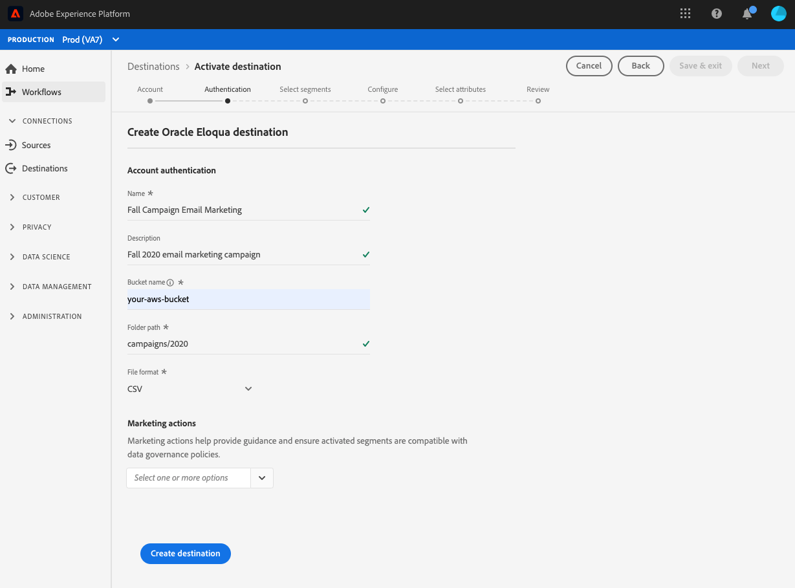

# [!DNL Oracle Eloqua] 연결

[[!DNL Oracle Eloqua]](https://www.oracle.com/cx/marketing/automation/) 는 B2B 마케터 및 조직이 마케팅 캠페인 및 영업 리드 생성을 관리하는 데 도움이  [!DNL Oracle] 되는 마케팅 자동화를 위한 서비스(SaaS) 플랫폼입니다.

세그먼트 데이터를 [!DNL Oracle Eloqua]에 보내려면 먼저 Adobe Experience Platform에서 [대상](#connect-destination)을 연결한 다음 [저장소 위치에서 ](#import-data-into-eloqua)로 데이터 가져오기[!DNL Oracle Eloqua]를 설정해야 합니다.

## 내보내기 유형 {#export-type}

**프로필 기반**  - 원하는 스키마 필드와 함께 세그먼트의 모든 구성원을 내보냅니다(예:이메일 주소, 전화 번호, 성)을  [대상 활성화 워크플로의 속성 선택 화면에서 선택합니다](../../ui/activate-destinations.md#select-attributes).

## IP 주소 허용 목록 {#allow-list}

SFTP 저장소를 사용하여 이메일 마케팅 대상을 설정할 때 Adobe에서는 특정 IP 범위를 허용 목록에 추가하는 것이 좋습니다.

Adobe IP를 허용 목록에 추가해야 하는 경우 클라우드 스토리지 대상 [IP 주소 허용 목록을 참조하십시오.](../cloud-storage/ip-address-allow-list.md)

## 대상 {#connect-destination}에 연결

**[!UICONTROL Connections]** > **[!UICONTROL Destinations]**&#x200B;에서 [!DNL Oracle Eloqua]를 선택한 다음 **[!UICONTROL Configure]**&#x200B;을 선택합니다.

>[!NOTE]
>
>이 대상과의 연결이 이미 있는 경우 대상 카드에 **[!UICONTROL Activate]** 단추가 표시될 수 있습니다. [!UICONTROL Activate]과 [!UICONTROL Configure] 사이의 차이에 대한 자세한 내용은 대상 작업 공간 설명서의 [카탈로그](../../ui/destinations-workspace.md#catalog) 섹션을 참조하십시오.

**[!UICONTROL Account]** 단계에서 이전에 클라우드 스토리지 대상에 대한 연결을 설정한 경우 **[!UICONTROL Existing Account]**&#x200B;을 선택하고 기존 연결 중 하나를 선택합니다. 또는 **[!UICONTROL New Account]**&#x200B;을 선택하여 새 연결을 설정할 수 있습니다. 계정 인증 자격 증명을 입력하고 **[!UICONTROL Connect to destination]**&#x200B;을 선택합니다. [!DNL Oracle Eloqua]의 경우 **[!UICONTROL SFTP with Password]**&#x200B;과 **[!UICONTROL SFTP with SSH Key]** 중에서 선택할 수 있습니다.

연결 유형에 따라 아래 정보를 입력하고 **[!UICONTROL Connect to destination]**&#x200B;을 선택합니다.

- **[!UICONTROL SFTP with Password]** 연결의 경우 [!UICONTROL Domain], [!UICONTROL Port], [!UICONTROL Username] 및 [!UICONTROL Password]를 제공해야 합니다.
- **[!UICONTROL SFTP with SSH Key]** 연결의 경우 [!UICONTROL Domain], [!UICONTROL Port], [!UICONTROL Username] 및 [!UICONTROL SSH Key]를 제공해야 합니다.

원하는 경우, RSA 형식 공개 키를 첨부하여 PGP/GPG를 사용하여 암호화를 **[!UICONTROL Key]** 섹션 아래의 내보낸 파일에 추가할 수 있습니다. 공개 키는 [!DNL Base64] 인코딩 문자열로 작성해야 합니다.

**[!UICONTROL Authentication]** 단계에서 아래와 같이 대상에 대한 관련 정보를 입력합니다.
- **[!UICONTROL Name]**:대상의 관련 이름을 선택합니다.
- **[!UICONTROL Description]**:대상에 대한 설명을 입력합니다.
- **[!UICONTROL Folder Path]**:Platform에서 내보내기 데이터를 CSV 또는 탭으로 구분된 파일로 저장할 스토리지 위치에 경로를 제공합니다.
- **[!UICONTROL File Format]**: **CSV** 또는  **TAB_DIPORTED**. 저장소 위치로 내보낼 파일 형식을 선택합니다.
- **[!UICONTROL Marketing actions]**:마케팅 작업은 데이터를 대상에 내보내려는 의도를 나타냅니다. Adobe 정의 마케팅 작업 중에서 선택하거나 자신의 마케팅 작업을 만들 수 있습니다. 마케팅 작업에 대한 자세한 내용은 [데이터 사용 정책 개요](../../../data-governance/policies/overview.md)를 참조하십시오.

<!--

Commenting out Amazon S3 bucket part for now until support is clarified

- **[!UICONTROL Bucket name]**: Your Amazon S3 bucket, where Platform will deposit the data export. Your input must be between 3 and 63 characters long. Must begin and end with a letter or number. Must contain only lowercase letters, numbers, or hyphens ( - ). Must not be formatted as an IP address (for example, 192.100.1.1).

-->

위의 필드를 채운 후 **[!UICONTROL Create destination]**&#x200B;을 클릭합니다. 이제 대상이 만들어지고 대상에 대한 세그먼트](../../ui/activate-destinations.md)를 활성화할 수 있습니다.[

## 세그먼트 활성화 {#activate-segments}

세그먼트 활성화 작업 과정에 대한 자세한 내용은 [프로필 및 세그먼트를 대상](../../ui/activate-destinations.md)에 활성화를 참조하십시오.

## 대상 특성 {#destination-attributes}

[세그먼트](../../ui/activate-destinations.md)를 [!DNL Oracle Eloqua] 대상에 활성화할 경우 Adobe은 [union schema](../../../profile/home.md#profile-fragments-and-union-schemas)에서 고유한 식별자를 선택하는 것이 좋습니다. 대상으로 내보낼 고유 식별자 및 기타 XDM 필드를 선택합니다. 자세한 내용은 [내보낸 파일에서 대상 특성으로 사용할 스키마 필드 선택](./overview.md#destination-attributes)을 참조하십시오.

## 내보낸 데이터 {#exported-data}

[!DNL Oracle Eloqua] 대상의 경우 Platform은 사용자가 제공한 저장 위치에 탭으로 구분된 `.txt` 또는 `.csv` 파일을 만듭니다. 파일에 대한 자세한 내용은 세그먼트 활성화 자습서에서 [이메일 마케팅 대상 및 클라우드 스토리지 대상](../../ui/activate-destinations.md#esp-and-cloud-storage)을 참조하십시오.

## 데이터 가져오기를 [!DNL Oracle Eloqua] {#import-data-into-eloqua}에 설정

[!DNL Platform]을(를) SFTP 저장소에 연결한 후 저장소 위치에서 [!DNL Oracle Eloqua]으로 데이터 가져오기를 설정해야 합니다. 이를 수행하는 방법에 대한 자세한 내용은 [!DNL Oracle Eloqua Help Center]의 [연락처 또는 계정 가져오기](https://docs.oracle.com/cloud/latest/marketingcs_gs/OMCAA/Help/DataImportExport/Tasks/ImportingContactsOrAccounts.htm)를 참조하십시오.
