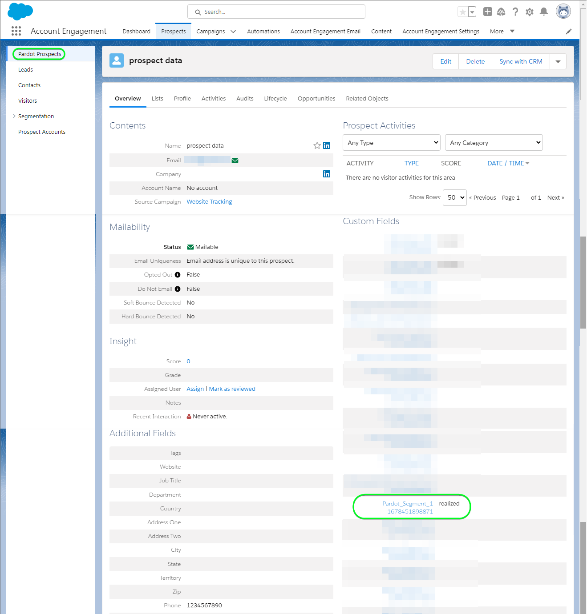

# [!DNL Salesforce Marketing Cloud Account Engagement] 연결

사용 [[!DNL Salesforce Marketing Cloud Account Engagement]](https://www.salesforce.com/products/marketing-cloud/marketing-automation/) *(이전 이름: [!DNL Pardot])* 잠재 고객을 캡처, 추적, 점수 및 등급화하는 대상. 또한 이메일 드립 캠페인 및 육성, 채점 및 캠페인 세분화를 통한 리드 관리를 통해 타겟팅된 시장 대상자 및 고객 그룹에 대한 파이프라인의 모든 단계에 대한 리드 트랙을 디자인할 수 있습니다.

비교 대상 [!DNL Salesforce Marketing Cloud Engagement] 보다 지향적인 것 **B2C** 마케팅, [!DNL Marketing Cloud Account Engagement] 다음에 이상적 **B2B** 영업 및 의사 결정 주기가 더 길어야 하는 여러 부서 및 의사 결정자와 관련된 사용 사례입니다. 또한 CRM과의 긴밀한 근접성과 통합을 유지하여 적절한 판매 및 마케팅 결정을 내릴 수 있습니다. *참고: Experience Platform에 대한 연결도 있습니다 [!DNL Salesforce Marketing Cloud Engagement]에서 확인할 수 있습니다. [[!DNL Salesforce Marketing Cloud]](/help/destinations/catalog/email-marketing/salesforce-marketing-cloud.md) 및 [[!DNL (API) Salesforce Marketing Cloud]](/help/destinations/catalog/email-marketing/salesforce-marketing-cloud-exact-target.md) 페이지.*

이 [!DNL Adobe Experience Platform] [대상](/help/destinations/home.md) 을 활용합니다. [[!DNL Salesforce Account Engagement API > Prospect Upsert by Email]](https://developer.salesforce.com/docs/marketing/pardot/guide/prospect-v5.html#prospect-upsert-by-email) 끝점, 대상 **리드 추가 또는 업데이트** 새 항목 내에서 활성화한 후 [!DNL Marketing Cloud Account Engagement] 세그먼트.

[!DNL Marketing Cloud Account Engagement] 인증 코드 프로토콜과 함께 OAuth 2를 사용하여 [!DNL Account Engagement] API. 에 대한 인증 지침 [!DNL Marketing Cloud Account Engagement] 인스턴스는 다음보다 아래에 있습니다. [대상에 인증](#authenticate) 섹션.

## 사용 사례 {#use-cases}

을(를) 사용하는 방법과 시기를 더 잘 이해할 수 있도록 [!DNL Marketing Cloud Account Engagement] destination은 Adobe Experience Platform 고객이 이 대상을 사용하여 해결할 수 있는 샘플 사용 사례입니다.

### 마케팅 캠페인을 위해 연락처에 이메일 보내기 {#use-case-send-emails}

온라인 플랫폼의 마케팅 부서는 이메일 기반 마케팅 캠페인을 B2B 리드의 엄선된 대상자에게 브로드캐스트하려고 합니다. 플랫폼의 마케팅 팀은 Adobe Experience Platform을 통해 새로운 리드를 추가하거나 기존 리드 정보를 업데이트하고, 자체 오프라인 데이터에서 대상을 작성하고, 이러한 대상을 로 보낼 수 있습니다. [!DNL Marketing Cloud Account Engagement]그런 다음 마케팅 캠페인 이메일을 보내는 데 사용할 수 있습니다.

## 전제 조건 {#prerequisites}

Experience Platform 및 에서 설정해야 하는 사전 요구 사항에 대해서는 아래 섹션을 참조하십시오 [!DNL Salesforce] 및 를 사용하기 전에 수집해야 하는 정보의 경우 [!DNL Marketing Cloud Account Engagement] 대상.

### Experience Platform의 사전 요구 사항 {#prerequisites-in-experience-platform}

에 대한 데이터를 활성화하기 전에 [!DNL Marketing Cloud Account Engagement] 대상, 다음 항목이 있어야 합니다. [스키마](/help/xdm/schema/composition.md), a [데이터 세트](https://experienceleague.adobe.com/docs/platform-learn/tutorials/data-ingestion/create-datasets-and-ingest-data.html), 및 [세그먼트](https://experienceleague.adobe.com/docs/platform-learn/tutorials/segments/create-segments.html) 생성 위치 [!DNL Experience Platform].

### 의 사전 요구 사항 [!DNL Marketing Cloud Account Engagement] {#prerequisites-destination}

Platform에서 로 데이터를 내보내려면 다음 전제 조건을 참고하십시오. [!DNL Marketing Cloud Account Engagement] 계정:

#### 다음을 수행해야 합니다. [!DNL Marketing Cloud Account Engagement] account {#prerequisites-account}

A [!DNL Marketing Cloud Account Engagement] 다음에 대한 구독이 있는 계정 [Marketing Cloud 계정 참여](https://www.salesforce.com/products/marketing-cloud/marketing-automation/) 계속하려면 제품이 필수입니다.

사용자 [!DNL Salesforce] 계정에는 다음 항목이 있어야 합니다. [!DNL Salesforce] `Account Engagement Administrator role`. 다음의 경우 필수입니다. [사용자 정의 잠재 고객 필드 만들기](https://help.salesforce.com/s/articleView?id=sf.pardot_fields_create_custom_field.htm&amp;type=5).

마지막으로, 귀하의 계정에서도 [[!DNL Account Engagement Lightning App]](https://help.salesforce.com/s/articleView?id=sf.pardot_lightning_enable.htm&amp;type=5).

다음 대상에게 연결 [[!DNL Salesforce] 지원](https://www.salesforce.com/company/contact-us/?d=cta-glob-footer-10) 또는 [!DNL Salesforce] 계정이 없거나 계정에 계정이 없는 경우 계정 관리자 [!DNL Marketing Cloud Account Engagement] 구독 또는 [!DNL Account Engagement Administrator role].

#### 수집 [!DNL Marketing Cloud Account Engagement] 자격 증명 {#gather-credentials}

에 인증하기 전에 아래 항목을 적어 두십시오. [!DNL Marketing Cloud Account Engagement] 대상.

| 자격 증명 | 설명 |
| --- | --- |
| `Username` | 사용자 [!DNL Marketing Cloud Account Engagement] 계정 사용자 이름. |
| `Password` | 사용자 [!DNL Marketing Cloud Account Engagement] 계정 암호입니다. |
| `Account Engagement Business Unit ID` | 계정 참여 비즈니스 단위 ID를 찾으려면 다음에서 설정 을 사용합니다. [!DNL Salesforce]. 설정에서 을 입력합니다. *비즈니스 단위 설정* 빠른 찾기 상자에서 참조할 수 있습니다. 계정 참여 비즈니스 단위 ID는 다음으로 시작합니다. `0Uv` 길이가 18자입니다. 사업부 설정 정보에 액세스할 수 없는 경우 [!DNL Salesforce] 다음을 제공하는 계정 관리자 `Account Engagement Business Unit ID`. 추가 지침이 필요한 경우 [[!DNL Salesforce] 인증](https://developer.salesforce.com/docs/marketing/pardot/guide/authentication) 지침 페이지입니다. |

{style="table-layout:auto"}

### 가드레일 {#guardrails}

다음을 참조하십시오. [!DNL Marketing Cloud Account Engagement] [비율 제한](https://developer.salesforce.com/docs/marketing/pardot/guide/overview.html#rate-limits) 플랜에 의해 부과된 제한을 자세히 설명하고 Experience Platform 실행에도 적용됩니다.

>[!IMPORTANT]
>
>다음의 경우 [!DNL Salesforce] 계정 관리자가 신뢰할 수 있는 IP 범위에 대한 액세스를 제한했습니다. 액세스하려면 해당 범위에 문의해야 합니다. [EXPERIENCE PLATFORM IP](/help/destinations/catalog/streaming/ip-address-allow-list.md) 허용 목록에추가된. 다음을 참조하십시오. [!DNL Salesforce] [연결된 앱의 신뢰할 수 있는 IP 범위에 대한 액세스 제한](https://help.salesforce.com/s/articleView?id=sf.connected_app_edit_ip_ranges.htm&amp;type=5) 추가 지침이 필요한 경우 설명서를 참조하십시오.

## 지원되는 ID {#supported-identities}

[!DNL Marketing Cloud Account Engagement] 는 아래 표에 설명된 id 활성화를 지원합니다. 자세히 알아보기 [id](/help/identity-service/namespaces.md).

| 대상 ID | 설명 | 고려 사항 |
|---|---|---|
| 이메일 | 잠재 고객 이메일 주소 | 필수입니다 |

{style="table-layout:auto"}

## 내보내기 유형 및 빈도 {#export-type-frequency}

대상 내보내기 유형 및 빈도에 대한 자세한 내용은 아래 표를 참조하십시오.

| 항목 | 유형 | 참고 |
---------|----------|---------|
| 내보내기 유형 | **[!UICONTROL 프로필 기반]** | <ul><li>원하는 스키마 필드와 함께 세그먼트의 모든 멤버를 내보냅니다 *(예: 이메일 주소, 전화번호, 성)*&#x200B;를 입력합니다.</li><li> 플랫폼에서 선택한 각 대상에 대해 [!DNL Salesforce Marketing Cloud Account Engagement] 세그먼트 상태가 플랫폼의 대상자 상태로 업데이트됩니다.</li></ul> |
| 내보내기 빈도 | **[!UICONTROL 스트리밍]** | 스트리밍 대상은 &quot;항상&quot; API 기반 연결입니다. 대상자 평가를 기반으로 Experience Platform에서 프로필이 업데이트되는 즉시 커넥터가 업데이트 다운스트림을 대상 플랫폼으로 전송합니다. 자세한 내용 [스트리밍 대상](/help/destinations/destination-types.md#streaming-destinations). |

{style="table-layout:auto"}

## 대상에 연결 {#connect}

>[!IMPORTANT]
>
>대상에 연결하려면 다음이 필요합니다. **[!UICONTROL 대상 관리]** [액세스 제어 권한](/help/access-control/home.md#permissions). 읽기 [액세스 제어 개요](/help/access-control/ui/overview.md) 필요한 권한을 얻으려면 제품 관리자에게 문의하십시오.

이 대상에 연결하려면 다음과같이 하십시오. [대상 구성 자습서](../../ui/connect-destination.md). 대상 구성 워크플로에서 아래 두 섹션에 나열된 필드를 채웁니다.

다음 범위 내 **[!UICONTROL 대상]** > **[!UICONTROL 카탈로그]**, 검색 [!DNL Salesforce Marketing Cloud Account Engagement]. 또는 아래에서 찾을 수 있습니다 **[!UICONTROL 이메일 마케팅]** 범주.

### 대상으로 인증 {#authenticate}

대상에 인증하려면 다음을 선택합니다. **[!UICONTROL 대상에 연결]**. 다음으로 이동합니다. [!DNL Salesforce] 로그인 페이지입니다. 다음을 입력하십시오. [!DNL Marketing Cloud Account Engagement] 계정 자격 증명 및 선택 [!DNL Log In].

다음, 선택 [!UICONTROL 허용] 다음에 나타나는 창에서 **Adobe Experience Platform** 앱에서 액세스할 수 있습니다 [!DNL Salesforce Marketing Cloud Account Engagement] 계정입니다. *이 작업은 한 번만 수행하면 됩니다.*.

제공된 세부 정보가 유효한 경우 UI에 다음과 같은 메시지가 표시됩니다. *Salesforce Marketing Cloud 계정 참여 계정에 정상적으로 연결했습니다.* 메시지 및 **[!UICONTROL 연결됨]** 상태가 녹색 확인 표시로 표시되면 다음 단계로 진행할 수 있습니다.

### 대상 세부 정보 입력 {#destination-details}

대상에 대한 세부 정보를 구성하려면 아래의 필수 및 선택 필드를 채우십시오. UI에서 필드 옆에 있는 별표는 필드가 필수임을 나타냅니다. 다음을 참조하십시오. [수집 [!DNL Marketing Cloud Account Engagement] 자격 증명](#gather-credentials) 섹션에 자세히 설명되어 있습니다.

| 필드 | 설명 |
| --- | --- |
| **[!UICONTROL 이름]** | 나중에 이 대상을 인식할 수 있는 이름입니다. |
| **[!UICONTROL 설명]** | 나중에 이 대상을 식별하는 데 도움이 되는 설명입니다. |
| **[!UICONTROL 계정 참여 비즈니스 단위 ID]** | 사용자 [!DNL Salesforce] `Account Engagement Business Unit ID`. |

{style="table-layout:auto"}

### 경고 활성화 {#enable-alerts}

경고를 활성화하여 대상에 대한 데이터 흐름 상태에 대한 알림을 받을 수 있습니다. 목록에서 경고를 선택하여 데이터 흐름 상태에 대한 알림을 수신합니다. 경고에 대한 자세한 내용은 다음 안내서를 참조하십시오. [UI를 사용하여 대상 경고 구독](../../ui/alerts.md).

대상 연결에 대한 세부 정보를 제공했으면 을 선택합니다. **[!UICONTROL 다음]**.

## 이 대상으로 대상자 활성화 {#activate}

>[!IMPORTANT]
> 
>* 데이터를 활성화하려면 **[!UICONTROL 대상 관리]**, **[!UICONTROL 대상 활성화]**, **[!UICONTROL 프로필 보기]**, 및 **[!UICONTROL 세그먼트 보기]** [액세스 제어 권한](/help/access-control/home.md#permissions). 읽기 [액세스 제어 개요](/help/access-control/ui/overview.md) 필요한 권한을 얻으려면 제품 관리자에게 문의하십시오.
>* 내보내려면 *id*, 다음이 필요합니다. **[!UICONTROL ID 그래프 보기]** [액세스 제어 권한](/help/access-control/home.md#permissions).   {width="100" zoomable="yes"}

읽기 [스트리밍 대상자 내보내기 대상으로 프로필 및 대상자 활성화](/help/destinations/ui/activate-segment-streaming-destinations.md) 이 대상에 대한 대상자 활성화에 대한 지침을 참조하십시오.

### 매핑 고려 사항 및 예제 {#mapping-considerations-example}

대상 데이터를 Adobe Experience Platform에서 로 올바르게 보내려면 [!DNL Marketing Cloud Account Engagement] 대상, 필드 매핑 단계를 거쳐야 합니다. 매핑은 Platform 계정의 XDM(Experience Data Model) 스키마 필드와 대상 대상의 해당 필드 간에 링크를 만드는 것으로 구성됩니다.

XDM 필드를 [!DNL Marketing Cloud Account Engagement] 대상 필드에서 아래 단계를 수행합니다.

1. 다음에서 **[!UICONTROL 매핑]** 단계, 선택 **[!UICONTROL 새 매핑 추가]**. 화면에 새 매핑 행이 표시됩니다.
1. 다음에서 **[!UICONTROL 소스 필드 선택]** 창에서 다음을 선택합니다. **[!UICONTROL 속성 선택]** 범주를 선택한 다음 XDM 속성을 선택하거나 **[!UICONTROL ID 네임스페이스 선택]** id를 선택합니다.
1. 다음에서 **[!UICONTROL 대상 필드 선택]** 창에서 다음을 선택합니다. **[!UICONTROL ID 네임스페이스 선택]** id를 선택하거나 **[!UICONTROL 사용자 지정 속성 선택]** 범주 및 다음 목록에서 지정 [[!DNL Prospect API fields]](https://developer.salesforce.com/docs/marketing/pardot/guide/prospect-v5.html#fields) 사용 가능한 스키마에서

   * XDM 프로필 스키마와 간에 매핑을 추가하려면 다음 단계를 반복합니다 [!DNL Marketing Cloud Account Engagement]: | 소스 필드 | 대상 필드 | 필수 | | — | — | — | |`IdentityMap: Email`|`Identity: email`| 예 | |`xdm: MailingAddress.city`|`xdm: city`| | |`xdm: person.name.firstName`|`Attribute: firstName`| |

   * 위 매핑의 예가 아래에 나와 있습니다.
     

대상 연결에 대한 매핑 제공을 마쳤으면 다음을 선택합니다. **[!UICONTROL 다음]**.

## 데이터 내보내기 유효성 검사 {#exported-data}

대상을 올바르게 설정했는지 확인하려면 아래 단계를 수행하십시오.

1. 선택한 대상 중 하나로 이동합니다. **[!DNL Activation data]** 탭을 선택합니다. 다음 **[!UICONTROL 매핑 ID]** 열에는 내에서 생성된 사용자 정의 필드의 이름이 표시됩니다. [!DNL Marketing Cloud Account Engagement Prospects] 페이지를 가리키도록 업데이트하는 중입니다.
   

1. 에 로그인합니다 [[!DNL Salesforce]](https://login.salesforce.com/) 웹 사이트입니다. 그런 다음 로 이동합니다 **[!DNL Account Engagement]** > **[!DNL Prospects]** > **[!DNL Pardot Prospects]** 대상자의 잠재 고객이 추가/업데이트되었는지 확인합니다. 또는 다음에 액세스할 수도 있습니다 [[!DNL Salesforce Pardot]](https://pi.pardot.com/) 및 액세스 **[!DNL Prospects]** 페이지를 가리키도록 업데이트하는 중입니다.
   

1. 잠재 고객이 업데이트되었는지 확인하려면 잠재 고객을 선택하고 사용자 지정 잠재 고객 필드가 Experience Platform 대상 상태로 업데이트되었는지 확인합니다.
   

## 데이터 사용 및 관리 {#data-usage-governance}

모두 [!DNL Adobe Experience Platform] 대상은 데이터를 처리할 때 데이터 사용 정책을 준수합니다. 방법에 대한 자세한 정보 [!DNL Adobe Experience Platform] 데이터 거버넌스 시행, 다음을 참조하십시오. [데이터 거버넌스 개요](/help/data-governance/home.md).

## 추가 리소스 {#additional-resources}

* [!DNL Marketing Cloud Account Engagement] [API 설명서](https://developer.salesforce.com/docs/marketing/pardot/guide/overview.html).
