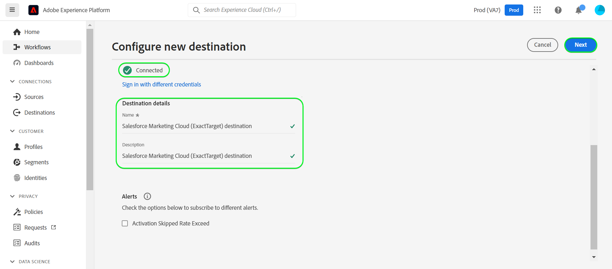
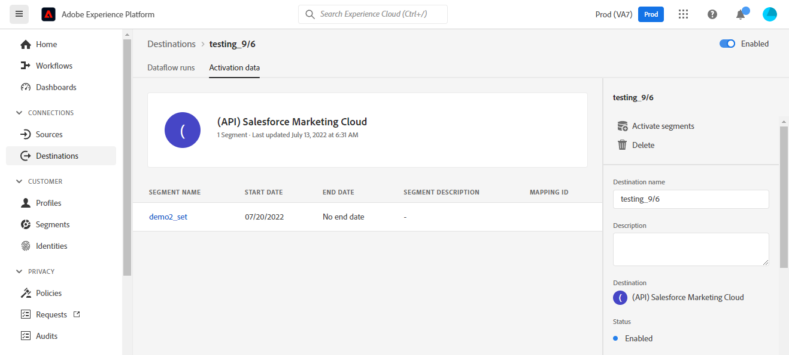
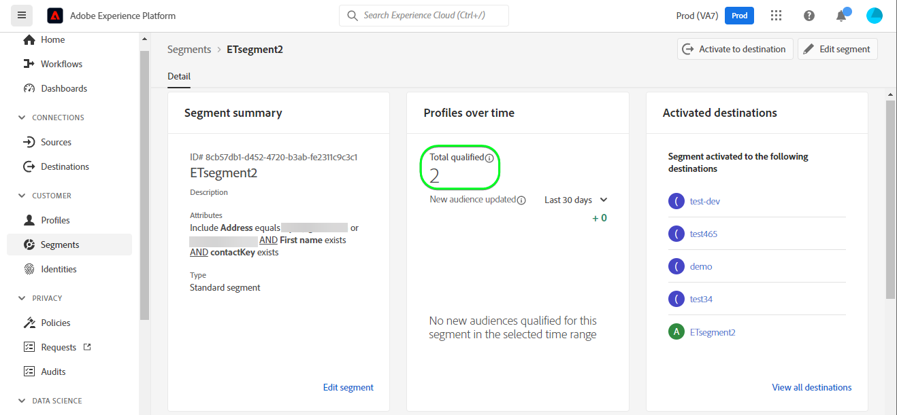

# [!DNL (API) Salesforce Marketing Cloud] 연결

## 개요 {#overview}

[[!DNL (API) Salesforce Marketing Cloud]](https://www.salesforce.com/products/marketing-cloud/engagement/) (이전 이름: [!DNL ExactTarget])은 방문자와 고객이 자신의 경험을 개인화할 수 있도록 여정을 구축하고 맞춤화할 수 있는 디지털 마케팅 제품군입니다.

>[!IMPORTANT]
>
>이 연결과 다른 연결의 차이점을 참고하십시오. [[!DNL Salesforce Marketing Cloud] 연결](/help/destinations/catalog/email-marketing/salesforce-marketing-cloud.md) 이메일 마케팅 카탈로그 섹션에 있습니다. API 기반 스트리밍 연결인 반면, 다른 Salesforce Marketing Cloud 연결에서는 지정된 저장소 위치로 파일을 내보낼 수 있습니다.

비교 대상 [!DNL Salesforce Marketing Cloud Account Engagement] 보다 지향적인 것 **B2B** 마케팅, [!DNL (API) Salesforce Marketing Cloud] destination은 다음에 이상적입니다. **B2C** 트랜잭션 의사 결정 주기가 짧은 사용 사례입니다. 타겟 대상의 행동을 나타내는 더 큰 데이터 세트를 통합하여 연락처, 특히 외부의 데이터 세트에서 우선 순위를 지정하고 세그먼트화하여 마케팅 캠페인을 조정하고 개선할 수 있습니다 [!DNL Salesforce]. *참고: Experience Platform은 [[!DNL Salesforce Marketing Cloud Account Engagement]](/help/destinations/catalog/email-marketing/salesforce-marketing-cloud-account-engagement.md).*

이 [!DNL Adobe Experience Platform] [대상](/help/destinations/home.md) 을 활용합니다. [!DNL Salesforce Marketing Cloud] [연락처 업데이트](https://developer.salesforce.com/docs/marketing/marketing-cloud/guide/updateContacts.html) API를 통해 다음을 수행할 수 있습니다. **연락처 추가 및 연락처 데이터 업데이트** 새 항목 내에서 활성화한 후 비즈니스 요구 사항 [!DNL Salesforce Marketing Cloud] 세그먼트.

[!DNL Salesforce Marketing Cloud] 클라이언트 자격 증명이 포함된 OAuth 2를 인증 메커니즘으로 사용하여 [!DNL Salesforce Marketing Cloud] API. 에 대한 인증 지침 [!DNL Salesforce Marketing Cloud] 인스턴스는 다음보다 아래에 있습니다. [대상에 인증](#authenticate) 섹션.

## 사용 사례 {#use-cases}

을(를) 사용하는 방법과 시기를 더 잘 이해할 수 있도록 [!DNL (API) Salesforce Marketing Cloud] destination은 Adobe Experience Platform 고객이 이 대상을 사용하여 해결할 수 있는 샘플 사용 사례입니다.

### 마케팅 캠페인을 위해 연락처에 이메일 보내기 {#use-case-send-emails}

홈 임대 플랫폼의 판매 부서에서 마케팅 이메일을 타겟팅된 고객 대상자에게 브로드캐스트하려고 합니다. 플랫폼의 마케팅 팀이 새 연락처를 추가하거나 기존 연락처를 업데이트할 수 있습니다. *(및 해당 이메일 주소)* Adobe Experience Platform을 통해 자신의 오프라인 데이터에서 대상을 작성하고 이러한 대상을 로 보냅니다. [!DNL Salesforce Marketing Cloud]그런 다음 마케팅 캠페인 이메일을 보내는 데 사용할 수 있습니다.

## 사전 요구 사항 {#prerequisites}

### Experience Platform의 사전 요구 사항 {#prerequisites-in-experience-platform}

에 대한 데이터를 활성화하기 전에 [!DNL (API) Salesforce Marketing Cloud] 대상, 다음 항목이 있어야 합니다. [스키마](/help/xdm/schema/composition.md), a [데이터 세트](https://experienceleague.adobe.com/docs/platform-learn/tutorials/data-ingestion/create-datasets-and-ingest-data.html?lang=en), 및 [세그먼트](https://experienceleague.adobe.com/docs/platform-learn/tutorials/segments/create-segments.html?lang=en) 생성 위치 [!DNL Experience Platform].

### 의 사전 요구 사항 [!DNL (API) Salesforce Marketing Cloud] {#prerequisites-destination}

Platform에서 로 데이터를 내보내려면 다음 전제 조건을 참고하십시오. [!DNL Salesforce Marketing Cloud] 계정:

#### 다음을 수행해야 합니다. [!DNL Salesforce Marketing Cloud] account {#prerequisites-account}

A [!DNL Salesforce Marketing Cloud] 다음에 대한 구독이 있는 계정 [[!DNL Marketing Cloud Engagement]](https://www.salesforce.com/products/marketing-cloud/engagement/) 계속하려면 제품이 필수입니다.

다음 대상에게 연결 [[!DNL Salesforce] 지원](https://www.salesforce.com/company/contact-us/?d=cta-glob-footer-10) 이 없는 경우 [!DNL Salesforce Marketing Cloud] 계정 또는 계정에 다음 항목이 없습니다. [!DNL Marketing Cloud Engagement] 제품 구독.

#### 다음 내에서 속성 만들기 [!DNL Salesforce Marketing Cloud] {#prerequisites-attribute}

대상자를 활성화할 때 [!DNL (API) Salesforce Marketing Cloud] 대상, 다음에 값을 입력해야 합니다. **[!UICONTROL 매핑 ID]** 에서 활성화된 각 대상자에 대한 필드 **[대상자 일정](#schedule-segment-export-example)** 단계.

[!DNL Salesforce] Experience Platform에서 들어오는 대상을 올바르게 읽고 해석하고 내에서 대상 상태를 업데이트하려면 이 값이 필요합니다. [!DNL Salesforce Marketing Cloud]. 다음에 대한 Experience Platform 설명서 참조: [대상자 멤버십 세부 정보 스키마 필드 그룹](/help/xdm/field-groups/profile/segmentation.md) 대상 상태에 대한 지침이 필요한 경우.

Platform에서 로 활성화하는 각 대상에 대해 [!DNL Salesforce Marketing Cloud], 유형의 속성을 만들어야 합니다. `Text` 다음 범위 내 [!DNL Salesforce]. 사용 [!DNL Salesforce Marketing Cloud] [!DNL Contact Builder] 속성을 만듭니다. 속성 필드 이름은 [!DNL (API) Salesforce Marketing Cloud] 다음 기간 동안 타겟 필드: **[!UICONTROL 매핑]** 단계. 비즈니스 요구 사항에 따라 최대 4000자로 필드 문자를 정의할 수 있습니다. 다음을 참조하십시오. [!DNL Salesforce Marketing Cloud] [데이터 확장 데이터 유형](https://help.salesforce.com/s/articleView?id=sf.mc_es_data_extension_data_types.htm&amp;type=5) 속성 유형에 대한 추가 정보는 설명서 페이지를 참조하십시오.

다음을 참조하십시오. [!DNL Salesforce Marketing Cloud] 에 대한 설명서 [속성 만들기](https://help.salesforce.com/s/articleView?id=mc_cab_create_an_attribute.htm&amp;type=5&amp;language=en_US) 속성 만들기에 대한 지침이 필요한 경우.

의 데이터 디자이너 화면의 예 [!DNL Salesforce Marketing Cloud]속성을 추가할 가 아래에 표시되어 있습니다.

의 보기 [!DNL Salesforce Marketing Cloud] [!DNL Email Demographics] 속성 세트는 다음과 같습니다.

다음 [!DNL (API) Salesforce Marketing Cloud] 대상이 을 사용합니다. [!DNL Salesforce Marketing Cloud] [!DNL Search Attribute-Set Definitions REST] [API](https://developer.salesforce.com/docs/marketing/marketing-cloud/guide/retrieveAttributeSetDefinitions.html) 내에서 정의된 속성 및 해당 속성 세트를 동적으로 읽어들이기 [!DNL Salesforce Marketing Cloud].

다음 위치에 표시됩니다. **[!UICONTROL Target 필드]** 다음을 설정할 때 선택 창 [매핑](#mapping-considerations-example) (으)로 이동하는 워크플로우 [대상에 대상 활성화](#activate).

>[!IMPORTANT]
>
>다음 범위 내 [!DNL Salesforce Marketing Cloud]를 사용하여 속성을 만들어야 합니다. **[!UICONTROL 필드 이름]** 내에 지정된 값과 정확히 일치하는 **[!UICONTROL 매핑 ID]** 활성화된 각 플랫폼 세그먼트에 대해. 예를 들어 아래 스크린샷에는 라는 속성이 표시됩니다 `salesforce_mc_segment_1`. 이 대상에 대한 대상자를 활성화할 때 다음을 추가합니다. `salesforce_mc_segment_1` 다음으로: **[!UICONTROL 매핑 ID]** Experience Platform의 대상자 대상자를 이 속성으로 채우기 위한 것입니다.

의 속성 작성 예 [!DNL Salesforce Marketing Cloud]이 아래에 표시되어 있습니다.

>[!TIP]
>
>* 속성을 만들 때 필드 이름에 공백 문자를 포함하지 마십시오. 대신 밑줄을 사용하십시오 `(_)` 문자를 구분 기호로 사용했습니다.
>* Platform 대상에 사용되는 속성과 내의 다른 속성을 구분하려면 다음 작업을 수행하십시오 [!DNL Salesforce Marketing Cloud], Adobe 세그먼트에 사용되는 속성에 인식 가능한 접두어 또는 접미어를 포함할 수 있습니다. 예를 들어, 대신 `test_segment`, 사용 `Adobe_test_segment` 또는 `test_segment_Adobe`.
>* 다른 속성을에 이미 만든 경우 [!DNL Salesforce Marketing Cloud], 플랫폼 세그먼트와 동일한 이름을 사용하여 대상자를 쉽게 식별할 수 있습니다. [!DNL Salesforce Marketing Cloud].

#### 내에서 사용자 역할 및 권한 할당 [!DNL Salesforce Marketing Cloud] {#prerequisites-roles-permissions}

다음으로: [!DNL Salesforce Marketing Cloud] 은(는) 사용자 정의 역할을 지원합니다. 사용 사례에 따라 사용자는 관련 역할을 할당하여에서 속성을 업데이트해야 합니다. [!DNL Salesforce Marketing Cloud] attribute-sets. 사용자에게 할당된 역할의 예는 다음과 같습니다.

의 역할에 따라 [!DNL Salesforce Marketing Cloud] 사용자가 할당되었으므로 [!DNL Salesforce Marketing Cloud] 업데이트하려는 필드가 포함된 속성 세트입니다.

이 대상에 대한 액세스 권한이 필요하므로 `[!DNL attribute-set]`, 허용해야 합니다. 예: `Email` [!DNL attribute-set] 아래와 같이 허용해야 합니다.

액세스 수준을 제한하려면 세분화된 권한을 사용하여 개별 액세스를 재정의할 수도 있습니다.

다음을 참조하십시오. [[!DNL Marketing Cloud Roles]](https://help.salesforce.com/s/articleView?language=en_US&amp;id=sf.mc_overview_marketing_cloud_roles.htm&amp;type=5) 및 [[!DNL Marketing Cloud Roles and Permissions]](https://help.salesforce.com/s/articleView?language=en_US&amp;id=sf.mc_overview_roles.htm&amp;type=5) 페이지 를 참조하십시오.

#### 수집 [!DNL Salesforce Marketing Cloud] 자격 증명 {#gather-credentials}

에 인증하기 전에 아래 항목을 적어 두십시오. [!DNL (API) Salesforce Marketing Cloud] 대상.

| 자격 증명 | 설명 | 예 |
| --- | --- | --- |
| 하위 도메인 | 다음을 참조하십시오 [[!DNL Salesforce Marketing Cloud domain prefix]](https://developer.salesforce.com/docs/marketing/marketing-cloud/guide/your-subdomain-tenant-specific-endpoints.html) 에서 이 값을 가져오는 방법을 알아보려면 [!DNL Salesforce Marketing Cloud] 인터페이스. | 다음의 경우 [!DNL Salesforce Marketing Cloud] 도메인:  *`mcq4jrssqdlyc4lph19nnqgzzs84`.login.exacttarget.com*,  다음을 제공해야 합니다. `mcq4jrssqdlyc4lph19nnqgzzs84` 을 값으로 추가합니다. |
| 클라이언트 ID | 다음을 참조하십시오. [!DNL Salesforce Marketing Cloud] [설명서](https://developer.salesforce.com/docs/marketing/marketing-cloud/guide/access-token-s2s.html) 에서 이 값을 가져오는 방법을 알아보려면 [!DNL Salesforce Marketing Cloud] 인터페이스. | r23kxxxxxxxx0z05xxxxxx |
| 클라이언트 암호 | 다음을 참조하십시오. [!DNL Salesforce Marketing Cloud] [설명서](https://developer.salesforce.com/docs/marketing/marketing-cloud/guide/access-token-s2s.html) 에서 이 값을 가져오는 방법을 알아보려면 [!DNL Salesforce Marketing Cloud] 인터페이스. | ipxxxxxxxxxxT4xxxxxxxxxx |

{style="table-layout:auto"}

### 가드레일 {#guardrails}

* Salesforce는 다음을 수행합니다. [비율 제한](https://developer.salesforce.com/docs/marketing/marketing-cloud/guide/rate-limiting.html).
   * 다음을 참조하십시오. [!DNL Salesforce Marketing Cloud] [설명서](https://developer.salesforce.com/docs/marketing/marketing-cloud/guide/rate-limiting-errors.html) 실행 중에 발생할 수 있는 가능한 제한을 해결하고 오류를 줄이려면
   * 다음을 참조하십시오. [[!DNL Salesforce Marketing Cloud] 참여 가격 책정](https://www.salesforce.com/editions-pricing/marketing-cloud/email/) 페이지 대상 *전체 버전 비교 차트 다운로드* 플랜에 따라 적용되는 제한을 자세히 설명하는 pdf입니다.
   * 다음 [API 개요](https://developer.salesforce.com/docs/marketing/marketing-cloud/guide/apis-overview.html) 페이지 세부 정보 추가 제한.
   * 참조 [여기](https://salesforce.stackexchange.com/questions/205898/marketing-cloud-api-limits) 이러한 세부 정보를 대조하는 페이지용입니다.
* 의 수 *오브젝트당 허용되는 사용자 정의 필드* 는 Salesforce 버전에 따라 다릅니다.
   * 다음을 참조하십시오. [!DNL Salesforce] [설명서](https://help.salesforce.com/s/articleView?id=sf.custom_field_allocations.htm&amp;type=5) 추가 지침을 참조하십시오.
   * 다음에 대해 정의된 제한에 도달한 경우 *오브젝트당 허용되는 사용자 정의 필드* 다음 범위 내 [!DNL Salesforce Marketing Cloud] 다음을 수행해야 합니다
      * 에서 새 속성을 추가하기 전에 이전 속성을 제거합니다. [!DNL Salesforce Marketing Cloud].
      * 제공된 값으로 이러한 이전 속성 이름을 사용하는 Platform 대상에서 활성화된 모든 대상을 업데이트하거나 제거합니다 **[!UICONTROL 매핑 ID]** 다음 기간 동안 [대상자 예약](#schedule-segment-export-example) 단계.

## 지원되는 ID {#supported-identities}

[!DNL (API) Salesforce Marketing Cloud] 는 아래 표에 설명된 id 활성화를 지원합니다. 자세히 알아보기 [id](/help/identity-service/namespaces.md).

| TARGET ID | 설명 | 고려 사항 |
|---|---|---|
| contactKey | [!DNL Salesforce Marketing Cloud] 연락처 키. 다음을 참조하십시오. [!DNL Salesforce Marketing Cloud] [설명서](https://help.salesforce.com/s/articleView?id=sf.mc_cab_contact_builder_best_practices.htm&amp;type=5) 추가 지침이 필요한 경우. | 필수입니다 |

## 내보내기 유형 및 빈도 {#export-type-frequency}

대상 내보내기 유형 및 빈도에 대한 자세한 내용은 아래 표를 참조하십시오.

| 항목 | 유형 | 참고 |
---------|----------|---------|
| 내보내기 유형 | **[!UICONTROL 프로필 기반]** | <ul><li>원하는 스키마 필드와 함께 세그먼트의 모든 멤버를 내보냅니다 *(예: 이메일 주소, 전화번호, 성)*&#x200B;를 입력합니다.</li><li> 의 각 세그먼트 상태 [!DNL Salesforce Marketing Cloud] 는 을 기반으로 플랫폼에서 해당 대상 상태로 업데이트됩니다. **[!UICONTROL 매핑 ID]** 다음 기간 동안 제공된 값: [대상자 예약](#schedule-segment-export-example) 단계.</li></ul> |
| 내보내기 빈도 | **[!UICONTROL 스트리밍]** | 스트리밍 대상은 &quot;항상&quot; API 기반 연결입니다. 대상자 평가를 기반으로 Experience Platform에서 프로필이 업데이트되는 즉시 커넥터가 업데이트 다운스트림을 대상 플랫폼으로 전송합니다. 자세한 내용 [스트리밍 대상](/help/destinations/destination-types.md#streaming-destinations). |

{style="table-layout:auto"}

## 대상에 연결 {#connect}

>[!IMPORTANT]
>
>대상에 연결하려면 다음이 필요합니다. **[!UICONTROL 대상 관리]** [액세스 제어 권한](/help/access-control/home.md#permissions). 읽기 [액세스 제어 개요](/help/access-control/ui/overview.md) 필요한 권한을 얻으려면 제품 관리자에게 문의하십시오.

이 대상에 연결하려면 다음과같이 하십시오. [대상 구성 자습서](../../ui/connect-destination.md). 대상 구성 워크플로에서 아래 두 섹션에 나열된 필드를 채웁니다.

다음 범위 내 **[!UICONTROL 대상]** > **[!UICONTROL 카탈로그]**, 검색 [!DNL (API) Salesforce Marketing Cloud]. 또는 아래에서 찾을 수 있습니다 **[!UICONTROL 이메일 마케팅]** 범주.

### 대상에 인증 {#authenticate}

대상에 인증하려면 아래의 필수 필드를 입력한 다음 을(를) 선택합니다. **[!UICONTROL 대상에 연결]**. 다음을 참조하십시오. [수집 [!DNL Salesforce Marketing Cloud] 자격 증명](#gather-credentials) 섹션에 자세히 설명되어 있습니다.

| [!DNL (API) Salesforce Marketing Cloud] 대상 | [!DNL Salesforce Marketing Cloud] |
| --- | --- |
| **[!UICONTROL 하위 도메인]** | 사용자 [!DNL Salesforce Marketing Cloud] 도메인 접두사입니다.  예를 들어 도메인이 입니다.   *`mcq4jrssqdlyc4lph19nnqgzzs84`.login.exacttarget.com*,   다음을 제공해야 합니다. `mcq4jrssqdlyc4lph19nnqgzzs84` 을 값으로 추가합니다. |
| **[!UICONTROL 클라이언트 ID]** | 사용자 [!DNL Salesforce Marketing Cloud] `Client ID`. |
| **[!UICONTROL 클라이언트 암호]** | 사용자 [!DNL Salesforce Marketing Cloud] `Client Secret`. |

제공된 세부 정보가 유효한 경우 UI에 **[!UICONTROL 연결됨]** 상태가 녹색 확인 표시로 표시되면 다음 단계로 진행할 수 있습니다.

### 대상 세부 정보 입력 {#destination-details}

대상에 대한 세부 정보를 구성하려면 아래의 필수 및 선택 필드를 채우십시오. UI에서 필드 옆에 있는 별표는 필드가 필수임을 나타냅니다.

* **[!UICONTROL 이름]**: 나중에 이 대상을 인식할 수 있는 이름입니다.
* **[!UICONTROL 설명]**: 나중에 이 대상을 식별하는 데 도움이 되는 설명입니다.

### 경고 활성화 {#enable-alerts}

경고를 활성화하여 대상에 대한 데이터 흐름 상태에 대한 알림을 받을 수 있습니다. 목록에서 경고를 선택하여 데이터 흐름 상태에 대한 알림을 수신합니다. 경고에 대한 자세한 내용은 다음 안내서를 참조하십시오. [UI를 사용하여 대상 경고 구독](../../ui/alerts.md).

대상 연결에 대한 세부 정보를 제공했으면 을 선택합니다. **[!UICONTROL 다음]**.

## 이 대상에 대상자 활성화 {#activate}

>[!IMPORTANT]
>
>데이터를 활성화하려면 **[!UICONTROL 대상 관리]**, **[!UICONTROL 대상 활성화]**, **[!UICONTROL 프로필 보기]**, 및 **[!UICONTROL 세그먼트 보기]** [액세스 제어 권한](/help/access-control/home.md#permissions). 읽기 [액세스 제어 개요](/help/access-control/ui/overview.md) 필요한 권한을 얻으려면 제품 관리자에게 문의하십시오.

읽기 [스트리밍 대상자 내보내기 대상으로 프로필 및 대상자 활성화](/help/destinations/ui/activate-segment-streaming-destinations.md) 이 대상에 대한 대상자 활성화에 대한 지침을 참조하십시오.

### 매핑 고려 사항 및 예제 {#mapping-considerations-example}

대상 데이터를 Adobe Experience Platform에서 로 올바르게 보내려면 [!DNL (API) Salesforce Marketing Cloud] 대상, 필드 매핑 단계를 거쳐야 합니다. 매핑은 Platform 계정의 XDM(Experience Data Model) 스키마 필드와 대상 대상의 해당 필드 간에 링크를 만드는 것으로 구성됩니다.

XDM 필드를 [!DNL (API) Salesforce Marketing Cloud] 대상 필드에서 아래 단계를 수행합니다.

>[!IMPORTANT]
>
>* 속성 이름은 인 경우와 같습니다. [!DNL Salesforce Marketing Cloud] 계정, 두 항목에 대한 매핑 `contactKey` 및 `personalEmail.address` 필수 항목입니다.
>
>* 와 통합 [!DNL Salesforce Marketing Cloud] API는 Experience Platform이 Salesforce에서 검색할 수 있는 속성 수의 페이지 매김 제한을 받습니다. 다음 기간 동안 **[!UICONTROL 매핑]** 단계: target 필드 스키마는 Salesforce 계정에서 최대 2000개의 속성을 표시할 수 있습니다.

1. 다음에서 **[!UICONTROL 매핑]** 단계, 선택 **[!UICONTROL 새 매핑 추가]**. 화면에 새 매핑 행이 표시됩니다.
   
1. 다음에서 **[!UICONTROL 소스 필드 선택]** 창에서 다음을 선택합니다. **[!UICONTROL 속성 선택]** 범주를 선택한 다음 XDM 속성을 선택하거나 **[!UICONTROL ID 네임스페이스 선택]** id를 선택합니다.
1. 다음에서 **[!UICONTROL 대상 필드 선택]** 창에서 다음을 선택합니다. **[!UICONTROL ID 네임스페이스 선택]** id를 선택하거나 **[!UICONTROL 속성 선택]** 필요에 따라 표시되는 속성 세트에서 속성을 선택하고 범주화합니다. 다음 [!DNL (API) Salesforce Marketing Cloud] 대상이 을 사용합니다. [!DNL Salesforce Marketing Cloud] [!DNL Search Attribute-Set Definitions REST] [API](https://developer.salesforce.com/docs/marketing/marketing-cloud/guide/retrieveAttributeSetDefinitions.html) 내에서 정의된 속성 및 해당 속성 세트를 동적으로 읽어들이기 [!DNL Salesforce Marketing Cloud]. 다음 위치에 표시됩니다. **[!UICONTROL Target 필드]** 팝업 을 사용하여 [매핑](#mapping-considerations-example) 다음에서 [대상자 활성화 워크플로](#activate).

   * XDM 프로필 스키마와 간에 다음 매핑을 추가하려면 이 단계를 반복합니다 [!DNL (API) Salesforce Marketing Cloud]:

     | 소스 필드 | Target 필드 | 필수입니다 |
     |---|---|---|
     | `IdentityMap: contactKey` | `Identity: salesforceContactKey` | `Mandatory` |
     | `xdm: person.name.firstName` | `Attribute: First Name` 원하는 속성 세트에서 | - |
     | `xdm: personalEmail.address` | `Attribute: Email Address` 원하는 속성 세트에서 | - |

   * 이러한 매핑을 사용하는 예는 다음과 같습니다.
     

대상 연결에 대한 매핑 제공을 마쳤으면 다음을 선택합니다. **[!UICONTROL 다음]**.

### 대상자 내보내기 예약 및 예제 {#schedule-segment-export-example}

다음을 수행할 때 [대상자 내보내기 예약](/help/destinations/ui/activate-segment-streaming-destinations.md#scheduling) 단계: 플랫폼 대상자를 [속성](#prerequisites-attribute) 위치: [!DNL Salesforce Marketing Cloud].

이렇게 하려면 각 세그먼트를 선택한 다음 속성 이름을 입력합니다. [!DNL Salesforce Marketing Cloud] 다음에서 [!DNL (API) Salesforce Marketing Cloud] **[!UICONTROL 매핑 ID]** 필드. 다음을 참조하십시오. [다음 범위 내에서 속성 만들기 [!DNL Salesforce Marketing Cloud]](#prerequisites-custom-field) 속성 만들기에 대한 지침 및 모범 사례에 대한 섹션 [!DNL Salesforce Marketing Cloud].

예를 들어 [!DNL Salesforce Marketing Cloud] 속성은 입니다. `salesforce_mc_segment_1`에서 이 값을 지정합니다. [!DNL (API) Salesforce Marketing Cloud] **[!UICONTROL 매핑 ID]** Experience Platform의 대상자 대상자를 이 속성으로 채우기 위한 것입니다.

의 예제 속성 [!DNL Salesforce Marketing Cloud] 다음이 표시됩니다.

의 위치를 나타내는 예 [!DNL (API) Salesforce Marketing Cloud] **[!UICONTROL 매핑 ID]** 다음이 표시됩니다.

표시된 대로 [!DNL (API) Salesforce Marketing Cloud] **[!UICONTROL 매핑 ID]** 은(는) 내에 지정된 값과 정확히 일치해야 합니다. [!DNL Salesforce Marketing Cloud] **[!UICONTROL 필드 이름]**.

활성화된 각 플랫폼 세그먼트에 대해 이 섹션을 반복합니다.

사용 사례에 따라 활성화된 모든 대상을 동일한 대상에 매핑할 수 있습니다 [!DNL Salesforce Marketing Cloud] **[!UICONTROL 필드 이름]** 또는 다름 **[!UICONTROL 필드 이름]** 위치: [!DNL (API) Salesforce Marketing Cloud]. 위에 표시된 이미지를 기반으로 한 일반적인 예는 다음과 같을 수 있습니다.
| [!DNL (API) Salesforce Marketing Cloud] 세그먼트 이름 | [!DNL Salesforce Marketing Cloud] **[!UICONTROL 필드 이름]** | [!DNL (API) Salesforce Marketing Cloud] **[!UICONTROL 매핑 ID]** | | — | — | — | | salesforce mc 대상 1 | `salesforce_mc_segment_1` | `salesforce_mc_segment_1` | | salesforce mc 대상 2 | `salesforce_mc_segment_2` | `salesforce_mc_segment_2` |

## 데이터 내보내기 유효성 검사 {#exported-data}

대상을 올바르게 설정했는지 확인하려면 아래 단계를 수행하십시오.

1. 선택 **[!UICONTROL 대상]** > **[!UICONTROL 찾아보기]** 대상 목록으로 이동합니다.
   

1. 대상을 선택하고 상태가 다음과 같은지 확인합니다. **[!UICONTROL 활성화됨]**.
   

1. 다음으로 전환 **[!DNL Activation data]** 탭을 누른 다음 대상 이름을 선택합니다.
   

1. 대상자 요약을 모니터링하고 프로필 수가 세그먼트 내에서 만든 수에 해당하는지 확인합니다.
   

1. 에 로그인합니다 [[!DNL Salesforce Marketing Cloud]](https://mc.exacttarget.com/) 웹 사이트입니다. 그런 다음 로 이동합니다 **[!DNL Audience Builder]** > **[!DNL Contact Builder]** > **[!DNL All contacts]** > **[!DNL Email]** 페이지를 만들고 대상자의 프로필이 추가되었는지 확인합니다.
   

1. 프로필이 업데이트되었는지 확인하려면 **[!UICONTROL 이메일]** 을(를) 페이지를 만들고 대상의 프로필 속성 값이 업데이트되었는지 확인합니다. 성공하면 각 대상자 상태가에서 확인할 수 있습니다. [!DNL Salesforce Marketing Cloud] 이(가) 다음을 기반으로 플랫폼에서 해당 대상 상태로 업데이트되었습니다. **[!UICONTROL 매핑 ID]** 에 제공된 값 [대상자 예약](#schedule-segment-export-example) 단계.
   

## 데이터 사용 및 관리 {#data-usage-governance}

모두 [!DNL Adobe Experience Platform] 대상은 데이터를 처리할 때 데이터 사용 정책을 준수합니다. 방법에 대한 자세한 정보 [!DNL Adobe Experience Platform] 데이터 거버넌스 시행, 다음을 참조하십시오. [데이터 거버넌스 개요](/help/data-governance/home.md).

## 오류 및 문제 해결 {#errors-and-troubleshooting}

### 이벤트를 Salesforce Marketing Cloud에 푸시하는 동안 알 수 없는 오류 발생 {#unknown-errors}

* 데이터 흐름 실행을 확인할 때 다음 오류 메시지가 표시될 수 있습니다. `Unknown errors encountered while pushing events to the destination. Please contact the administrator and try again.`
  

   * 이 오류를 수정하려면 다음을 확인하십시오. **[!UICONTROL 매핑 ID]** 활성화 워크플로에서 제공한 [!DNL (API) Salesforce Marketing Cloud] 대상이 사용자가 만든 속성의 이름과 정확히 일치합니다. [!DNL Salesforce Marketing Cloud]. 다음을 참조하십시오. [다음 범위 내에서 속성 만들기 [!DNL Salesforce Marketing Cloud]](#prerequisites-custom-field) 섹션을 참조하십시오.

* 세그먼트를 활성화할 때 다음과 같은 오류 메시지가 표시될 수 있습니다. `The client's IP address is unauthorized for this account. Allowlist the client's IP address...`
   * 이 오류를 수정하려면 다음 연락처로 문의하십시오. [!DNL Salesforce Marketing Cloud] 추가할 계정 관리자 [Experience Platform IP 주소](/help/destinations/catalog/streaming/ip-address-allow-list.md) (으)로 [!DNL Salesforce Marketing Cloud] 계정의 신뢰할 수 있는 IP 범위입니다. 다음을 참조하십시오. [!DNL Salesforce Marketing Cloud] [Marketing Cloud에 허용 목록에 포함할 IP 주소](https://help.salesforce.com/s/articleView?id=sf.mc_es_ip_addresses_for_inclusion.htm&amp;type=5) 추가 지침이 필요한 경우 설명서를 참조하십시오.

## 추가 리소스 {#additional-resources}

* [!DNL Salesforce Marketing Cloud] [API](https://developer.salesforce.com/docs/marketing/marketing-cloud/guide/apis-overview.html)
* [!DNL Salesforce Marketing Cloud] [설명서](https://developer.salesforce.com/docs/marketing/marketing-cloud/guide/updateContacts.html) 지정된 속성 그룹의 지정된 정보로 연락처가 업데이트되는 방법을 설명합니다.

### 변경 로그 {#changelog}

이 섹션에서는 이 대상 커넥터에 대한 기능 및 중요 설명서 업데이트를 캡처합니다.

+++ 변경 로그 보기

| 릴리스 월 | 업데이트 유형 | 설명 |
|---|---|---|
| 2023년 4월 | 설명서 업데이트 | <ul><li>에서 문 및 참조 링크를 수정했습니다. [(API) Salesforce Marketing Cloud의 사전 요구 사항](#prerequisites-destination) 섹션 을 참조하십시오 [!DNL Salesforce Marketing Cloud Engagement] 은(는) 이 대상을 사용하기 위한 필수 구독입니다. 이전에 호출한 섹션은 사용자가 Marketing Cloud에 대한 구독이 필요하다는 잘못된 정보를 제공했습니다 **계정** 계속 진행할 참여</li> <li>아래에 섹션을 추가했습니다. [전제 조건](#prerequisites) 대상 [역할 및 권한](#prerequisites-roles-permissions) 에 할당됨 [!DNL Salesforce] 이 대상에 대한 사용자가 작동합니다. (PLATIR-26299)</li></ul> |
| 2023년 2월 | 설명서 업데이트 | 다음을 업데이트했습니다. [(API) Salesforce Marketing Cloud의 사전 요구 사항](#prerequisites-destination) 다음을 호출하는 참조 링크를 포함하는 섹션 [!DNL Salesforce Marketing Cloud Engagement] 은(는) 이 대상을 사용하기 위한 필수 구독입니다. |
| 2023년 2월 | 기능 업데이트 | 대상에서 잘못된 구성으로 인해 잘못된 포맷의 JSON이 Salesforce로 전송되는 문제가 해결되었습니다. 이로 인해 일부 사용자는 활성화 시 많은 ID가 실패했음을 보게 되었습니다. (PLATIR-26299) |
| 2023년 1월 | 설명서 업데이트 | <ul><li>다음을 업데이트했습니다. [의 사전 요구 사항 [!DNL Salesforce]](#prerequisites-destination) 을(를) 호출하기 위한 섹션은에 속성을 만들어야 합니다. [!DNL Salesforce] 옆이요. 이제 이 섹션에는에서 속성 이름을 지정하는 방법에 대한 자세한 지침과 모범 사례가 포함되어 있습니다. [!DNL Salesforce]. (PLATIR-25602)</li><li>에서 활성화된 각 대상에 대해 매핑 ID를 사용하는 방법에 대한 명확한 지침을 추가했습니다 [대상자 예약](#schedule-segment-export-example) 단계. (PLATIR-25602)</li></ul> |
| 2022년 10월 | 초기 릴리스 | 초기 대상 릴리스 및 설명서 게시. |

{style="table-layout:auto"}

+++
