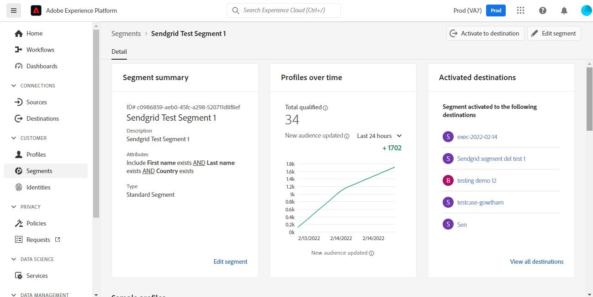

# [!DNL SendGrid] 연결

## 개요 {#overview}

[SendGrid](https://www.sendgrid.com) 는 트랜잭션 및 마케팅 이메일에 대해 인기 있는 고객 커뮤니케이션 플랫폼입니다.

이 [!DNL Adobe Experience Platform] [대상](/help/destinations/home.md) 을 활용합니다. [[!DNL SendGrid Marketing Contacts API]](https://api.sendgrid.com/v3/marketing/contacts)을(를) 사용하면 자사 이메일 프로필을 내보내고 비즈니스 요구 사항에 맞는 새로운 SendGrid 대상 내에서 활성화할 수 있습니다.

SendGrid는 API 전달자 토큰을 인증 메커니즘으로 사용하여 SendGrid API와 통신합니다.

## 전제 조건 {#prerequisites}

대상 구성을 시작하기 전에 다음 항목이 필요합니다.

1. SendGrid 계정이 있어야 합니다.
   * SendGrid로 이동 [등록](https://signup.sendgrid.com/) 아직 SendGrid 계정이 없는 경우 등록하고 만들 페이지입니다.
1. SendGrid 포털에 로그인한 후 API 토큰도 생성해야 합니다.
1. SendGrid 웹 사이트로 이동하여 **[!DNL Settings]** > **[!DNL API Keys]** 페이지를 가리키도록 업데이트하는 중입니다. 또는 다음을 참조하십시오 [SendGrid 설명서](https://app.sendgrid.com/settings/api_keys) 를 클릭하여 SendGrid 앱의 해당 섹션에 액세스합니다.
1. 마지막으로 **[!DNL Create API Key]** 단추를 클릭합니다.
   * 다음을 참조하십시오. [SendGrid 설명서](https://docs.sendgrid.com/ui/account-and-settings/api-keys#creating-an-api-key)수행할 작업에 대한 지침이 필요한 경우.
   * API 키를 프로그래밍 방식으로 생성하려면 다음을 참조하십시오. [SendGrid 설명서](https://docs.sendgrid.com/api-reference/api-keys/create-api-keys).

SendGrid 대상으로 데이터를 활성화하기 전에 [스키마](https://experienceleague.adobe.com/docs/experience-platform/xdm/schema/composition.html?lang=ko-KR), a [데이터 세트](https://experienceleague.adobe.com/docs/platform-learn/tutorials/data-ingestion/create-datasets-and-ingest-data.html?lang=en), 및 [세그먼트](https://experienceleague.adobe.com/docs/platform-learn/tutorials/segments/create-segments.html?lang=en) 생성 위치 [!DNL Experience Platform]. 또한 다음을 참조하십시오 [제한](#limits) 이 페이지의 아래 섹션에 자세히 설명되어 있습니다.

>[!IMPORTANT]
>
>* 이메일 프로필에서 메일링 목록을 만드는 데 사용되는 SendGrid API를 사용하려면 각 프로필 내에 고유한 이메일 주소를 제공해야 합니다. 이것은 값으로 사용되는지의 여부와 관계없습니다 *이메일* 또는 *대체 이메일*. SendGrid 연결은 이메일과 대체 이메일 값 모두에 대한 매핑을 지원하므로 사용된 모든 이메일 주소가 의 각 프로필 내에서 고유해야 합니다. *데이터 세트*. 그렇지 않으면 이메일 프로필이 SendGrid로 전송될 때 오류가 발생하고 이메일 프로필이 데이터 내보내기에 표시되지 않습니다.
>
>* 현재 Experience Platform의 대상에서 프로필을 제거할 때 SendGrid에서 프로필을 제거하는 기능이 없습니다.

## 지원되는 ID {#supported-identities}

SendGrid는 아래 표에 설명된 ID 활성화를 지원합니다. 자세히 알아보기 [id](/help/identity-service/namespaces.md).

| 대상 ID | 설명 | 고려 사항 |
|---|---|---|
| 이메일 | 이메일 주소 | 일반 텍스트 및 SHA256 해시된 이메일 주소 모두 다음에서 지원됩니다. [!DNL Adobe Experience Platform]. Experience platform 소스 필드에 해시되지 않은 속성이 포함된 경우 **[!UICONTROL 변환 적용]** 옵션, 보유 [!DNL Platform] 활성화 시 데이터를 자동으로 해시합니다.   참고: **SendGrid** 는 해시된 이메일 주소를 지원하지 않으므로 변환하지 않은 일반 텍스트 데이터만 대상으로 전송됩니다. |

{style="table-layout:auto"}

## 내보내기 유형 및 빈도 {#export-type-frequency}

대상 내보내기 유형 및 빈도에 대한 자세한 내용은 아래 표를 참조하십시오.

| 항목 | 유형 | 참고 |
---------|----------|---------|
| 내보내기 유형 | **[!UICONTROL 프로필 기반]** | 의 프로필 속성 선택 화면에서 선택한 대로 원하는 스키마 필드(예: 이메일 주소, 전화번호, 성)와 함께 세그먼트의 모든 멤버를 내보냅니다. [대상 활성화 워크플로](/help/destinations/ui/activate-batch-profile-destinations.md#select-attributes). |
| 내보내기 빈도 | **[!UICONTROL 스트리밍]** | 스트리밍 대상은 &quot;항상&quot; API 기반 연결입니다. 대상자 평가를 기반으로 Experience Platform에서 프로필이 업데이트되는 즉시 커넥터가 업데이트 다운스트림을 대상 플랫폼으로 전송합니다. 자세한 내용 [스트리밍 대상](/help/destinations/destination-types.md#streaming-destinations). |

{style="table-layout:auto"}

## 사용 사례 {#use-cases}

SendGrid 대상을 사용하는 방법과 시기를 더 잘 이해할 수 있도록 다음과 같은 샘플 사용 사례를 소개합니다. [!DNL Experience Platform] 고객은 이 대상을 사용하여 해결할 수 있습니다.

### 여러 마케팅 활동에 대한 마케팅 목록 만들기

SendGrid를 사용하는 마케팅 팀은 SendGrid 내에서 메일링 목록을 만들고 이를 이메일 주소로 채울 수 있습니다. 이제 SendGrid 내에서 만든 메일링 목록은 나중에 여러 마케팅 활동에 사용할 수 있습니다.

## 대상에 연결 {#connect}

>[!IMPORTANT]
> 
>대상에 연결하려면 다음이 필요합니다. **[!UICONTROL 대상 관리]** [액세스 제어 권한](/help/access-control/home.md#permissions). 읽기 [액세스 제어 개요](/help/access-control/ui/overview.md) 필요한 권한을 얻으려면 제품 관리자에게 문의하십시오.

이 대상에 연결하려면 다음과같이 하십시오. [대상 구성 자습서](../../ui/connect-destination.md). 대상 구성 워크플로에서 아래 두 섹션에 나열된 필드를 채웁니다.

### 대상에 인증 {#authenticate}

1. 다음 범위 내 [!DNL Adobe Experience Platform] 콘솔, 다음으로 이동 **대상**.

1. 다음 항목 선택 **카탈로그** 탭 및 검색 *SendGrid*. 그런 다음 을 선택합니다 **설정**. 대상에 대한 연결을 설정하면 UI 레이블이 로 변경됩니다. **세그먼트 활성화**.
   

1. SendGrid 대상을 구성하는 데 도움이 되는 마법사가 표시됩니다. 을(를) 선택하여 새 대상을 만듭니다. **새 대상 구성**.
   

1. 다음 항목 선택 **새 계정** 옵션 및 다음을 입력합니다. **전달자 토큰** 값. 이 값은 SendGrid입니다 *API 키* 에 이전에 언급됨 [사전 요구 사항 섹션](#prerequisites).
   

1. 선택 **대상에 연결**. SendGrid가 *API 키* 입력한 내용이 유효하면 UI에 **연결됨** 녹색 확인 표시가 있는 상태에서 다음 단계로 이동하여 추가 정보 필드를 채울 수 있습니다.

### 대상 세부 정보 입력 {#destination-details}

While [설정 중](https://experienceleague.adobe.com/docs/experience-platform/destinations/ui/connect-destination.html?lang=en) 이 대상에는 다음 정보를 제공해야 합니다.

* **[!UICONTROL 이름]**: 나중에 이 대상을 인식할 수 있는 이름입니다.
* **[!UICONTROL 설명]**: 나중에 이 대상을 식별하는 데 도움이 되는 선택적 설명입니다.

### 경고 활성화 {#enable-alerts}

경고를 활성화하여 대상에 대한 데이터 흐름 상태에 대한 알림을 받을 수 있습니다. 목록에서 경고를 선택하여 데이터 흐름 상태에 대한 알림을 수신합니다. 경고에 대한 자세한 내용은 다음 안내서를 참조하십시오. [UI를 사용하여 대상 경고 구독](../../ui/alerts.md).

대상 연결에 대한 세부 정보를 제공했으면 을 선택합니다. **[!UICONTROL 다음]**.

## 이 대상에 대상자 활성화 {#activate}

>[!IMPORTANT]
> 
>* 데이터를 활성화하려면 **[!UICONTROL 대상 관리]**, **[!UICONTROL 대상 활성화]**, **[!UICONTROL 프로필 보기]**, 및 **[!UICONTROL 세그먼트 보기]** [액세스 제어 권한](/help/access-control/home.md#permissions). 읽기 [액세스 제어 개요](/help/access-control/ui/overview.md) 필요한 권한을 얻으려면 제품 관리자에게 문의하십시오.
>* 내보내려면 *id*, 다음이 필요합니다. **[!UICONTROL ID 그래프 보기]** [액세스 제어 권한](/help/access-control/home.md#permissions).   {width="100" zoomable="yes"}

읽기 [스트리밍 대상자 내보내기 대상으로 프로필 및 대상자 활성화](/help/destinations/ui/activate-segment-streaming-destinations.md) 이 대상에 대한 대상자 활성화에 대한 지침을 참조하십시오.

이 대상에 대한 자세한 내용은 아래 이미지를 참조하십시오.

1. SendGrid로 내보낼 대상을 한 개 이상 선택합니다.
   

1. 다음에서 **[!UICONTROL 매핑]** 단계, 선택 후 **[!UICONTROL 새 매핑 추가]**&#x200B;소스 XDM 필드를 SendGrid API 대상 필드에 매핑하는 매핑 페이지가 표시됩니다. 아래 이미지는 Experience Platform과 SendGrid 간에 ID 네임스페이스를 매핑하는 방법을 보여 줍니다. 다음을 확인하십시오. **[!UICONTROL 소스 필드]** *이메일* 을(를) 다음에 매핑해야 합니다. **[!UICONTROL 대상 필드]** *external_id* 아래와 같이 표시됩니다.
   
   
   
   

1. 마찬가지로 원하는 을 매핑합니다 [!DNL Adobe Experience Platform] SendGrid 대상으로 내보낼 특성입니다.
   
   

1. 매핑을 완료한 후 다음을 선택합니다 **[!UICONTROL 다음]** 리뷰 화면으로 이동합니다.
   

1. 선택 **[!UICONTROL 완료]** 설치를 완료합니다.
   

지원되는 속성 매핑에 대해 설정할 수 있는 포괄적인 목록 [SendGrid 마케팅 연락처 > 연락처 API 추가 또는 업데이트](https://docs.sendgrid.com/api-reference/contacts/add-or-update-a-contact) 은(는) 아래에 있습니다.

| 소스 필드 | 대상 필드 | 유형 | 설명 | 제한 |
|---|---|---|---|---|
| xdm:  homeAddress.street1 | xdm:  address_line_1 | 문자열 | 주소의 첫 번째 줄입니다. | 최대 길이:  100자 |
| xdm:  homeAddress.street2 | xdm:  address_line_2 | 문자열 | 주소의 두 번째 줄(선택 사항)입니다. | 최대 길이:  100자 |
| xdm:  _extcondev.alternate_emails | xdm:  alternate_email | 문자열의 배열 | 연락처와 연결된 추가 이메일입니다. | <ul><li>최대: 5개 항목</li><li>최소: 0개 항목</li></ul> |
| xdm:  homeAddress.city | xdm:  도시 | 문자열 | 연락처의 도시입니다. | 최대 길이:  60자 |
| xdm:  homeAddress.country | xdm:  국가 | 문자열 | 연락처의 국가입니다. 전체 이름 또는 약어일 수 있습니다. | 최대 길이:  50자 |
| identityMap:  이메일 | 신원:  external_id | 문자열 | 연락처의 기본 이메일입니다. 유효한 이메일이어야 합니다. | 최대 길이:  254자 |
| xdm:  person.name.firstName | xdm:  first_name | 문자열 | 연락처 이름 | 최대 길이:  50자 |
| xdm:  person.name.lastName | xdm:  last_name | 문자열 | 연락처의 성 | 최대 길이:  50자 |
| xdm:  homeAddress.postalCode | xdm:  postal_code | 문자열 | 연락처의 우편 번호 또는 기타 우편 번호입니다. | |
| xdm:  homeAddress.stateProvince | xdm:  state_province_region | 문자열 | 연락처의 주, 시/도 또는 지역입니다. | 최대 길이:  50자 |

## SendGrid 내에서 데이터 내보내기 유효성 검사 {#validate}

대상을 올바르게 설정했는지 확인하려면 아래 단계를 수행하십시오.

1. 선택 **[!UICONTROL 대상]** > **[!UICONTROL 찾아보기]** 대상 목록으로 이동합니다.
   

1. 대상을 선택하고 상태가 다음과 같은지 확인합니다. **[!UICONTROL 활성화됨]**.
   

1. 다음으로 전환 **[!DNL Activation data]** 탭을 누른 다음 대상 이름을 선택합니다.
   

1. 대상자 요약을 모니터링하고 프로필 수가 데이터 세트 내에서 생성된 수에 해당하는지 확인합니다.
   

1. 다음 [SendGrid 마케팅 목록 > 목록 API 만들기](https://docs.sendgrid.com/api-reference/lists/create-list) 의 값을 조인하여 SendGrid 내에서 고유한 연락처 목록을 만드는 데 사용됩니다. *list_name* 속성 및 데이터 내보내기의 타임스탬프입니다. SendGrid 사이트로 이동하여 이름 패턴을 따르는 새 연락처 목록이 만들어졌는지 확인합니다.
   
   

1. 새로 만든 연락처 목록을 선택하고 만든 데이터 세트에서 새 이메일 레코드가 새 연락처 목록 내에 채워지고 있는지 확인합니다.

1. 또한 이메일 두 개를 확인하여 필드 매핑이 올바른지 확인하십시오.
   
   

## 데이터 사용 및 관리 {#data-usage-governance}

모두 [!DNL Adobe Experience Platform] 대상은 데이터를 처리할 때 데이터 사용 정책을 준수합니다. 방법에 대한 자세한 정보 [!DNL Adobe Experience Platform] 데이터 거버넌스 시행, 다음을 참조하십시오. [데이터 거버넌스 개요](/help/data-governance/home.md).

## 추가 리소스 {#additional-resources}

이 SendGrid 대상은 아래 API를 활용합니다.
* [SendGrid 마케팅 목록 > 목록 API 만들기](https://docs.sendgrid.com/api-reference/lists/create-list)
* [SendGrid 마케팅 연락처 > 연락처 API 추가 또는 업데이트](https://docs.sendgrid.com/api-reference/contacts/add-or-update-a-contact)

### 제한 {#limits}

* 다음 [SendGrid 마케팅 연락처 > 연락처 API 추가 또는 업데이트](https://api.sendgrid.com/v3/marketing/contacts) 30,000개의 연락처 또는 6MB의 데이터 중 더 낮은 데이터를 수락할 수 있습니다.
