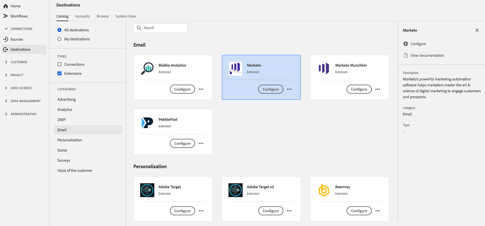

# [!DNL Marketo] 확장 {#marketo-extension}

## 개요 {#overview}

[!DNL Marketo]의 강력한 마케팅 자동화 소프트웨어는 마케터가 고객 및 잠재 고객의 참여를 유도하기 위해 디지털 마케팅의 기술과 과학을 숙달하도록 도와줍니다.

[!DNL Marketo] 는 Adobe Experience Platform의 이메일 확장입니다. 확장 기능에 대한 자세한 내용은 [Adobe Exchange의 확장 페이지](https://exchange.adobe.com/experiencecloud.details.106250.bounteous-extension-for-adobe-launch-and-marketo.html).

이 대상은 태그 확장입니다. Platform에서 태그 확장이 작동하는 방식에 대한 자세한 내용은 [태그 확장 개요](../launch-extensions/overview.md).

## 사전 요구 사항 {#prerequisites}

이 확장 프로그램은 다음에서 사용할 수 있습니다. [!DNL Destinations] Platform을 구입한 모든 고객을 위한 카탈로그.

이 확장을 사용하려면 Adobe Experience Platform의 태그에 액세스해야 합니다. 태그는 부가가치 기능으로 포함되어 Adobe Experience Cloud 고객에게 제공됩니다. 태그에 대한 액세스 권한을 얻으려면 조직 관리자에게 연락하여 권한을 부여하도록 요청하십시오. **[!UICONTROL manage_properties]** 확장을 설치할 수 있는 권한.

## 확장 설치 {#install-extension}

을(를) 설치하려면 [!DNL Marketo] 확장:

1. 다음에서 [플랫폼 인터페이스](https://platform.adobe.com/)로 이동합니다. **[!UICONTROL 대상]** > **[!UICONTROL 카탈로그]**.
2. 카탈로그에서 확장을 선택하거나 검색 창을 사용합니다.
3. 대상을 클릭하여 강조 표시한 다음 을(를) 선택합니다 **[!UICONTROL 구성]** 오른쪽 레일에서. 다음과 같은 경우 **[!UICONTROL 구성]** 컨트롤이 회색으로 표시되어 있습니다. **[!UICONTROL manage_properties]** 권한. 다음을 참조하십시오 [전제 조건](#prerequisites).
4. 확장을 설치할 속성을 선택합니다. 새 속성을 만들 수도 있습니다. 속성은 규칙, 데이터 요소, 구성된 확장, 환경 및 라이브러리의 컬렉션입니다. 의 속성에 대해 알아보기 [속성 페이지 섹션](../../../tags/ui/administration/companies-and-properties.md#properties-page) 태그 설명서의
5. 워크플로는 설치를 완료하는 단계를 안내합니다.

확장 구성 옵션 및 설치 지원에 대한 자세한 내용은 [Adobe Exchange의 Marketo 페이지](https://exchange.adobe.com/experiencecloud.details.106250.bounteous-extension-for-adobe-launch-and-marketo.html).

에서 바로 확장을 설치할 수도 있습니다. [데이터 수집 UI](https://experience.adobe.com/#/data-collection/). 자세한 내용은 다음 섹션 을 참조하십시오 [새 확장 추가](../../../tags/ui/managing-resources/extensions/overview.md#add-a-new-extension) 를 참조하십시오.

## 확장 사용 방법 {#how-to-use}

확장을 설치하면 규칙 설정을 시작할 수 있습니다.

설치된 확장에 대한 규칙을 설정하여 이벤트 데이터를 특정 상황에서만 확장 대상으로 보낼 수 있습니다. 확장에 대한 규칙 설정에 대한 자세한 내용은 [태그 설명서](../../../tags/ui/managing-resources/rules.md).

## 확장 구성, 업그레이드 및 삭제 {#configure-upgrade-delete}

데이터 수집 UI에서 확장을 구성, 업그레이드 및 삭제할 수 있습니다.

>[!TIP]
>
>확장이 속성 중 하나에 이미 설치된 경우에도 Platform UI가 표시됩니다 **[!UICONTROL 설치]** 확장용. 에 설명된 대로 설치 워크플로우 시작 [확장 설치](#install-extension) 확장을 구성하거나 삭제합니다.

확장을 업그레이드하려면 [확장 업그레이드 프로세스](../../../tags/ui/managing-resources/extensions/extension-upgrade.md) 를 참조하십시오.
