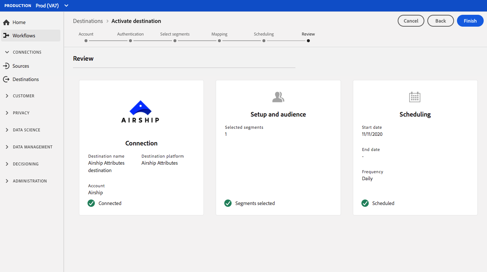

# (베타) [!DNL Airship Attributes] 연결 {#airship-attributes-destination}

>[!IMPORTANT]
>
>Adobe Experience Platform의 [!DNL Airship Attributes] 대상이 현재 베타 상태입니다. 설명서 및 기능은 변경될 수 있습니다.

[!DNL Airship] 선도적인 고객 참여 플랫폼으로 고객 라이프사이클의 모든 단계에서 사용자에게 의미 있고 개인화된 옴니채널 메시지를 제공할 수 있습니다.

이 통합은 타깃팅 또는 트리거를 위해 Adobe 프로필 데이터를 [!DNL Airship]Attributes](https://docs.airship.com/guides/audience/attributes/)로 [에 전달합니다.

[!DNL Airship]에 대한 자세한 내용은 [Airship Docs](https://docs.airship.com)을 참조하십시오.

>[!TIP]
>
>이 설명서 페이지는 [!DNL Airship] 팀에 의해 만들어졌습니다. 문의 또는 업데이트 요청은 [support.airship.com](https://support.airship.com/)에서 직접 문의하십시오.

## 전제 조건 {#prerequisites}

대상 세그먼트를 [!DNL Airship]에 보내려면 먼저 다음을 수행해야 합니다.

* [!DNL Airship] 프로젝트에서 속성을 활성화합니다.
* 인증에 사용할 베어러 토큰을 생성합니다.

>[!TIP]
>
>아직 계정이 없는 경우 [이 등록 링크](https://go.airship.eu/accounts/register/plan/starter/)를 통해 [!DNL Airship] 계정을 만듭니다.

## {#enable-attributes} 특성 사용

Adobe Experience Platform 프로필 속성은 [!DNL Airship] 속성과 유사하며 이 페이지에서 아래에 자세히 설명된 매핑 도구를 사용하여 플랫폼의 다른 사람과 쉽게 매핑할 수 있습니다.

[!DNL Airship] 프로젝트에는 여러 개의 사전 정의된 기본 속성이 있습니다. 사용자 지정 특성이 있는 경우 먼저 [!DNL Airship]에서 정의해야 합니다. 자세한 내용은 [특성 설정 및 관리](https://docs.airship.com/tutorials/audience/attributes/)를 참조하십시오.

## 베어러 토큰 {#bearer-token} 생성

[Airship 대시보드](https://go.airship.com)의 **[!UICONTROL Settings]**&quot; **[!UICONTROL APIs & Integrations]**&#x200B;으로 이동하고 왼쪽 메뉴에서 **[!UICONTROL Tokens]**&#x200B;을 선택합니다.

**[!UICONTROL Create Token]**&#x200B;을 클릭합니다.

토큰에 대해 사용자에게 친근한 이름을 입력하고(예: &quot;Adobe 속성 대상&quot;) 역할에 대해 &quot;모든 액세스&quot;를 선택합니다.

**[!UICONTROL Create Token]**&#x200B;을 클릭하고 세부 정보를 기밀로 저장합니다.

## 사용 사례 {#use-cases}

[!DNL Airship Attributes] 대상을 사용하는 방법과 시기를 더 잘 이해할 수 있도록 Adobe Experience Platform 고객이 이 대상을 사용하여 해결할 수 있는 샘플 사용 사례를 소개합니다.

### 사용 사례 #1

Adobe Experience Platform에서 수집한 프로필 데이터를 활용하여 메시지를 개인화하고 [!DNL Airship] 채널 내의 다양한 컨텐츠를 활용할 수 있습니다. 예를 들어 [!DNL Experience Platform] 프로필 데이터를 활용하여 [!DNL Airship] 내에 위치 속성을 설정합니다. 이렇게 하면 호텔 브랜드에 각 사용자에 가장 가까운 호텔 위치의 이미지가 표시됩니다.

### 사용 사례 #2

Adobe Experience Platform의 속성을 활용하여 [!DNL Airship] 프로파일을 더 보완하고 SDK 또는 [!DNL Airship] 예측 데이터와 결합합니다. 예를 들어 소매업체는 충성도 상태 및 위치 데이터(플랫폼의 특성)가 포함된 세그먼트를 만들 수 있으며, [!DNL Airship] 데이터를 대량 구매하여 Las Vegas, NV에 거주하고 있으며 대량 구매 가능성이 높은 골드 로열티 상태의 사용자에게 고도로 타깃팅된 메시지를 전송할 수 있습니다.

## [!DNL Airship Attributes] {#connect-airship-attributes}에 연결

**[!UICONTROL Destinations]** > **[!UICONTROL Catalog]**&#x200B;에서 **[!UICONTROL Mobile Engagement]** 범주로 스크롤합니다. **[!DNL Airship Attributes]**&#x200B;을 선택하고 **[!UICONTROL Configure]**&#x200B;을 선택합니다.

>[!NOTE]
>
>이 대상과의 연결이 이미 있는 경우 대상 카드에 **[!UICONTROL Activate]** 단추가 표시될 수 있습니다. **[!UICONTROL Activate]**&#x200B;과 **[!UICONTROL Configure]** 사이의 차이에 대한 자세한 내용은 대상 작업 공간 설명서의 [카탈로그](../../ui/destinations-workspace.md#catalog) 섹션을 참조하십시오.

**계정** 단계에서 이전에 [!DNL Airship Attributes] 대상에 대한 연결을 설정한 경우 **[!UICONTROL Existing Account]**&#x200B;을 선택하고 기존 연결을 선택합니다. 또는 **[!UICONTROL New Account]**&#x200B;을 선택하여 [!DNL Airship Attributes]에 대한 새 연결을 설정할 수 있습니다. **[!UICONTROL Connect to destination]**&#x200B;을 선택하여 [!DNL Airship] 대시보드에서 생성한 베어러 토큰을 사용하여 Adobe Experience Platform을 [!DNL Airship] 프로젝트에 연결합니다.

>[!NOTE]
>
>Adobe Experience Platform은 인증 프로세스의 자격 증명 유효성 검사를 지원하며 [!DNL Airship] 계정에 잘못된 자격 증명을 입력하는 경우 오류 메시지를 표시합니다. 이렇게 하면 자격 증명이 잘못된 작업 흐름을 완료하지 못합니다.

자격 증명이 확인되고 Adobe Experience Platform이 [!DNL Airship] 프로젝트에 연결되면 **[!UICONTROL Next]**&#x200B;을 선택하여 **[!UICONTROL Setup]** 단계로 진행할 수 있습니다.

**[!UICONTROL Authentication]** 단계에서 활성화 과정에 대해 **[!UICONTROL Name]** 및 **[!UICONTROL Description]**&#x200B;를 입력합니다.

또한 이 단계에서는 이 대상에 적용되는 [!DNL Airship] 데이터 센터에 따라 미국 또는 EU 데이터 센터를 선택할 수 있습니다. 마지막으로 대상으로 내보낼 데이터를 하나 이상 **[!UICONTROL Marketing Actions]**&#x200B;으로 선택합니다. Adobe 정의 마케팅 작업 중에서 선택하거나 직접 만들 수 있습니다. 마케팅 작업에 대한 자세한 내용은 [데이터 사용 정책 개요](../../../data-governance/policies/overview.md)를 참조하십시오.

위의 필드를 채운 후 **[!UICONTROL Create Destination]**&#x200B;을 선택합니다.

이제 대상이 만들어집니다. 나중에 세그먼트를 활성화하거나 **[!UICONTROL Next]**&#x200B;을 선택하여 워크플로우를 계속 진행하고 활성화할 세그먼트를 선택할 수 있습니다. **[!UICONTROL Save & Exit]** 이 두 경우 모두 나머지 워크플로에 대해 다음 섹션 [세그먼트 활성화](#activate-segments)를 참조하십시오.

## 세그먼트 활성화 {#activate-segments}

세그먼트를 [!DNL Airship Attributes]에 활성화하려면 아래 절차를 따르십시오.

**[!UICONTROL Destinations > Browse]**&#x200B;에서 세그먼트를 활성화할 [!DNL Airship Attributes] 대상을 선택합니다.

대상의 이름을 클릭합니다. 활성화 흐름으로 이동합니다.

대상에 대한 활성화 흐름이 이미 있는 경우 대상으로 현재 전송되고 있는 세그먼트를 볼 수 있습니다. 오른쪽 레일에서 **[!UICONTROL Edit activation]**&#x200B;을 선택하고 아래 단계에 따라 정품 인증 세부 사항을 수정합니다.

**[!UICONTROL Activate]**&#x200B;를 선택합니다. **[!UICONTROL Activate destination]** 작업 과정의 **[!UICONTROL Select Segments]** 페이지에서 [!DNL Airship Attributes]에 보낼 세그먼트를 선택합니다.

**[!UICONTROL Mapping]** 단계에서 대상 스키마에 매핑할 [XDM](../../../xdm/home.md) 스키마에서 특성 및 ID를 선택합니다. **[!UICONTROL Add new mapping]**&#x200B;을 선택하여 스키마를 검색하고 해당 대상 ID에 매핑합니다.

[!DNL Airship] 속성은 모든 사용자의 장치를 고객 ID와 같은 일반적인 식별자에 매핑하는 장치 인스턴스(예: iPhone 또는 지정된 사용자)를 나타내는 채널에서 설정할 수 있습니다. 스키마에 기본 ID로 일반 텍스트(해시되지 않은) 이메일 주소가 있는 경우 **[!UICONTROL Source Attributes]**&#x200B;에서 이메일 필드를 선택하고 아래 표시된 대로 오른쪽 열에 있는 [!DNL Airship] 지정된 사용자에게 매핑합니다.**[!UICONTROL Target Identities]**

채널(예: 장치)에 매핑해야 하는 식별자의 경우 소스를 기반으로 적절한 채널에 매핑합니다. 다음 이미지는 두 가지 매핑이 만들어지는 방식을 보여줍니다.

* [!DNL Airship] iOS 채널에 대한 IDFA iOS 광고 ID
* [!DNL Airship] &quot;전체 이름&quot; 속성에 대한 Adobe `fullName` 속성

>[!NOTE]
>
>속성 매핑에 대한 대상 필드를 선택할 때 [!DNL Airship] 대시보드에 나타나는 사용자에게 친숙한 이름을 사용합니다.

**ID 매핑**

소스 필드 선택:

대상 필드 선택:

**맵 속성**

소스 속성 선택:

타겟 속성 선택:

매핑 확인:

**[!UICONTROL Segment schedule]** 페이지에서 예약은 현재 비활성화되어 있습니다. 검토 단계를 계속하려면 **[!UICONTROL Next]**&#x200B;을 클릭합니다.

**[!UICONTROL Review]** 페이지에서 선택 사항의 요약을 볼 수 있습니다. 흐름을 구분하려면 **[!UICONTROL Cancel]**, 설정을 수정하려면 **[!UICONTROL Back]**, 선택을 확인하고 대상에 데이터를 보내기 시작하려면 **[!UICONTROL Finish]**&#x200B;를 선택합니다.

>[!IMPORTANT]
>
>이 단계에서 Adobe Experience Platform은 데이터 사용 정책 위반을 확인합니다. 다음은 정책을 위반하는 예입니다. 위반이 해결되기 전에는 세그먼트 활성화 워크플로우를 완료할 수 없습니다. 정책 위반을 해결하는 방법에 대한 자세한 내용은 데이터 거버넌스 문서 섹션의 [정책 적용](../../../data-governance/enforcement/auto-enforcement.md)을 참조하십시오.

정책 위반이 감지되지 않은 경우 **[!UICONTROL Finish]**&#x200B;을 선택하여 선택을 확인하고 대상으로 데이터 전송을 시작합니다.

## 데이터 사용 및 거버넌스 {#data-usage-governance}

모든 [!DNL Adobe Experience Platform] 대상은 데이터를 처리할 때 데이터 사용 정책을 준수합니다. [!DNL Adobe Experience Platform]이(가) 데이터 거버넌스를 적용하는 방법에 대한 자세한 내용은 [데이터 거버넌스 개요](../../../data-governance/home.md)를 참조하십시오.
