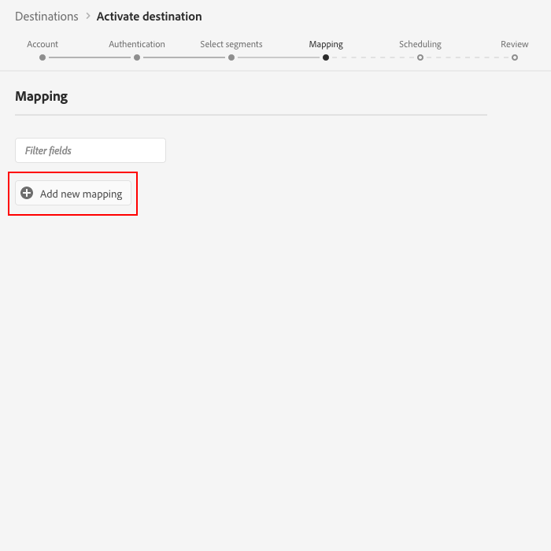
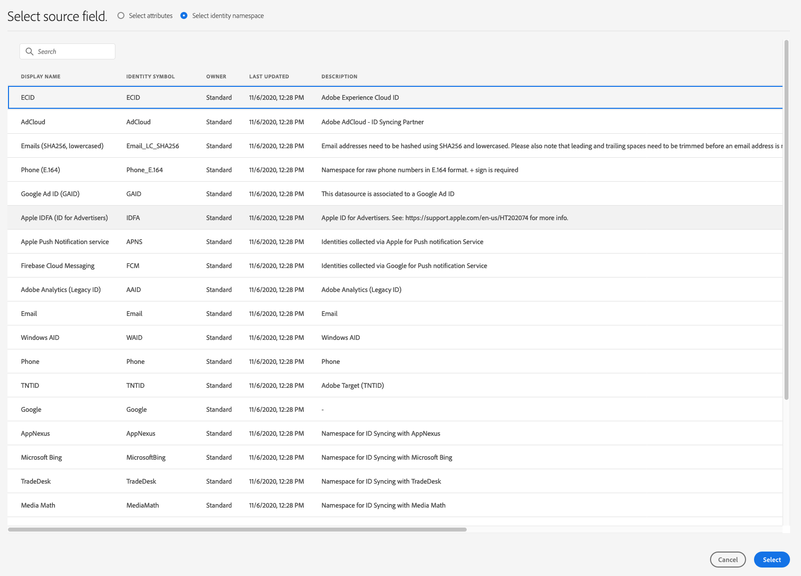

# (베타) [!DNL Braze] 연결

>[!IMPORTANT]
>
>Adobe Experience Platform의 Braze 대상은 현재 베타에 있습니다. 설명서 및 기능은 변경될 수 있습니다.

## 개요 {#overview}

[!DNL Braze] 대상은 프로필 데이터를 [!DNL Braze]에 보내는 데 도움이 됩니다.

[!DNL Braze] 고객과 고객이 선호하는 브랜드 간의 연관성 있고 탁월한 경험을 제공하는 포괄적인 고객 참여 플랫폼입니다.

프로필 데이터를 [!DNL Braze]에 보내려면 먼저 대상에 연결해야 합니다.

## 대상 세부 사항 {#specifics}

[!DNL Braze] 대상에 대한 다음 세부 사항을 참조하십시오.

* [!DNL Adobe Experience Platform] 세그먼트는 특성  [!DNL Braze] 아래에  `AdobeExperiencePlatformSegments` 내보내집니다.

>[!NOTE]
>
>추가 사용자 지정 특성을 [!DNL Braze]에 보내면 [!DNL Braze] 데이터 포인트 소비가 증가할 수 있습니다. 추가 사용자 지정 특성을 보내기 전에 [!DNL Braze] 계정 관리자에게 문의하십시오.

## 사용 사례 {#use-cases}

마케터는 [!DNL Adobe Experience Platform]에 내장된 세그먼트로 모바일 참여 대상의 사용자를 타깃팅하고자 합니다. 또한 세그먼트와 프로필이 [!DNL Adobe Experience Platform]에서 업데이트되는 즉시, [!DNL Adobe Experience Platform] 프로필의 특성에 따라 개인화된 경험을 전달하려고 합니다.

## 지원되는 ID {#supported-identities}

[!DNL Google Ad Manager] 에서는 아래 표에 설명된 ID 활성화를 지원합니다.

| Target ID | 설명 | 고려 사항 |
|---|---|---|
| external_id | 모든 ID 매핑을 지원하는 사용자 지정 [!DNL Braze] 식별자. | [!DNL Braze] [`external_id`](https://www.braze.com/docs/api/basics/#external-user-id-explanation)에 매핑하는 한 [ID](../../../identity-service/namespaces.md)를 [!DNL Braze] 대상으로 보낼 수 있습니다. |

## 내보내기 유형 {#export-type}

**[!DNL Profile-based]** - 원하는 스키마 필드와 함께 세그먼트의 모든 구성원을 내보낼 것입니다(예:필드 매핑에 따라 이메일 주소, 전화 번호, 성) 및/또는 ID를 지정합니다.
[!DNL Adobe Experience Platform] 세그먼트는 특성  [!DNL Braze] 아래에  `AdobeExperiencePlatformSegments` 내보내집니다.

## 대상 {#connect-destination}에 연결

**[!UICONTROL Connections]** > **[!UICONTROL Destinations]**&#x200B;에서 [!DNL Braze]를 선택하고 **[!UICONTROL Configure]**&#x200B;을 선택합니다.

>[!NOTE]
>
>이 대상과의 연결이 이미 있는 경우 대상 카드에 **[!UICONTROL Activate]** 단추가 표시될 수 있습니다. **[!UICONTROL Activate]**&#x200B;과 **[!UICONTROL Configure]** 사이의 차이에 대한 자세한 내용은 대상 작업 공간 설명서의 [카탈로그](../../ui/destinations-workspace.md#catalog) 섹션을 참조하십시오.
>
>

[!UICONTROL Account] 단계에서 [!DNL Braze] 계정 토큰을 제공해야 합니다. 이것은 [!DNL Braze] [!DNL API] 키입니다. 다음 링크를 통해 [!DNL API] 키를 얻는 방법에 대한 자세한 지침을 확인할 수 있습니다.[REST API 키 개요](https://www.braze.com/docs/api/api_key/). 토큰을 입력하고 **[!UICONTROL Connect to destination]**&#x200B;을 클릭합니다.

**[!UICONTROL Next]**&#x200B;을 클릭합니다. [!UICONTROL Authentication] 단계에서 [!DNL Braze] 연결 세부 정보를 입력해야 합니다.
* **[!UICONTROL Name]**:나중에 이 대상을 인식할 이름을 입력합니다.
* **[!UICONTROL Description]**:나중에 이 대상을 식별하는 데 도움이 되는 설명을 입력합니다.
* **[!UICONTROL Endpoint Instance]**:사용해야 하는 끝점 인스턴스를 담당자에게  [!DNL Braze] 요청하십시오.
* **[!UICONTROL Marketing action]**:마케팅 작업은 대상으로 데이터를 내보낼 의도를 나타냅니다. Adobe 정의 마케팅 작업 중에서 선택하거나 자신의 마케팅 작업을 만들 수 있습니다. 마케팅 작업에 대한 자세한 내용은 Adobe Experience Platform](../../../data-governance/policies/overview.md) 페이지의 [데이터 거버넌스 페이지를 참조하십시오. 개별 Adobe 정의 마케팅 작업에 대한 자세한 내용은 [데이터 사용 정책 개요](../../../data-governance/policies/overview.md)를 참조하십시오.

**[!UICONTROL Create destination]**&#x200B;을 클릭합니다. 이제 대상이 만들어집니다. 나중에 세그먼트를 활성화하려면 **[!UICONTROL Save & Exit]**&#x200B;을(를) 클릭하거나 **[!UICONTROL Next]**&#x200B;을(를) 선택하여 워크플로우를 계속하고 활성화할 세그먼트를 선택할 수 있습니다. 이 두 경우 모두 나머지 워크플로에 대해 다음 섹션 [세그먼트 활성화](#activate-segments)를 참조하십시오.

## 세그먼트 활성화 {#activate-segments}

세그먼트 활성화 작업 과정에 대한 자세한 내용은 [프로필 및 세그먼트를 대상](../../ui/activate-destinations.md#select-attributes)에 활성화를 참조하십시오.

## 필드 매핑 {#field-mapping}

대상 데이터를 [!DNL Adobe Experience Platform]에서 [!DNL Braze] 대상으로 올바르게 보내려면 필드 매핑 단계를 진행해야 합니다.

매핑은 [!DNL Platform] 계정의 [!DNL Experience Data Model](XDM) 스키마 필드와 대상 대상의 해당 필드 사이에 링크를 만드는 작업으로 이루어집니다.

XDM 필드를 [!DNL Braze] 대상 필드에 올바르게 매핑하려면 다음 단계를 수행합니다.

[!UICONTROL Mapping] 단계에서 **[!UICONTROL Add new mapping]**&#x200B;을 클릭합니다.

[!UICONTROL Source Field] 섹션에서 빈 필드 옆에 있는 화살표 단추를 클릭합니다.

[!UICONTROL Select source field] 창에서는 XDM 필드의 두 카테고리 중에서 선택할 수 있습니다.
* [!UICONTROL Select attributes]:XDM 스키마의 특정 필드를 특성에 매핑하려면 이 옵션을  [!DNL Braze] 사용합니다.

* [!UICONTROL Select identity namespace]:ID 네임스페이스를 네임스페이스에  [!DNL Platform] 매핑하려면 이 옵션을  [!DNL Braze] 사용합니다.

소스 필드를 선택한 다음 **[!UICONTROL Select]**&#x200B;을 클릭합니다.

[!UICONTROL Target Field] 섹션에서 필드 오른쪽의 매핑 아이콘을 클릭합니다.

[!UICONTROL Select target field] 창에서 대상 필드의 세 가지 카테고리 중에서 선택할 수 있습니다.
* [!UICONTROL Select attributes]:XDM 속성을 표준 속성에 매핑하려면 이 옵션을  [!DNL Braze] 사용합니다.
* [!UICONTROL Select identity namespace]:ID 네임스페이스를  [!DNL Platform] ID 네임스페이스에  [!DNL Braze] 매핑하려면 이 옵션을 사용합니다.
* [!UICONTROL Select custom attributes]:XDM 속성을 계정에 정의한 사용자 지정  [!DNL Braze] 속성에 매핑하려면 이 옵션을  [!DNL Braze] 사용합니다.
* 이 옵션을 사용하여 기존 XDM 속성의 이름을 [!DNL Braze]으로 바꿀 수도 있습니다. 예를 들어 `lastName` XDM 속성을 [!DNL Braze]의 사용자 지정 `Last_Name` 속성에 매핑하면 [!DNL Braze]에 `Last_Name` 속성이 만들어지고 `lastName` XDM 속성이 해당 속성에 매핑됩니다.

대상 필드를 선택한 다음 **[!UICONTROL Select]**&#x200B;을 클릭합니다.

이제 목록에 필드 매핑이 표시됩니다.

매핑을 더 추가하려면 이전 단계를 반복합니다.

## 매핑 예 {#mapping-example}

XDM 프로필 스키마와 [!DNL Braze] 인스턴스에 다음 특성 및 ID가 포함되어 있다고 가정합니다.

|  | XDM 프로필 스키마 | [!DNL Braze] 인스턴스 |
|---|---|---|
| 속성 | <ul><li>person.name.firstName</code></li><li>person.name.lastName</code></li><li>mobilePhone.number</code></li></ul> | <ul><li>FirstName</code></li><li>LastName</code></li><li>전화 번호</code></li></ul> |
| ID | <ul><li>이메일</code></li><li>Google 광고 ID(GAID)</code></li><li>광고주용 Apple ID(IDFA)</code></li></ul> | <ul><li>external_id</code></li></ul> |

올바른 매핑은 다음과 같습니다.

## 내보낸 데이터 {#exported-data}

데이터를 [!DNL Braze] 대상으로 성공적으로 내보냈는지 확인하려면 [!DNL Braze] 계정을 확인하십시오. [!DNL Adobe Experience Platform] 세그먼트는 특성  [!DNL Braze] 아래에  `AdobeExperiencePlatformSegments` 내보내집니다.

## 데이터 사용 및 거버넌스 {#data-usage-governance}

모든 [!DNL Adobe Experience Platform] 대상은 데이터를 처리할 때 데이터 사용 정책을 준수합니다. [!DNL Adobe Experience Platform]이(가) 데이터 거버넌스를 적용하는 방법에 대한 자세한 내용은 [데이터 거버넌스 개요](../../../data-governance/home.md)를 참조하십시오.

