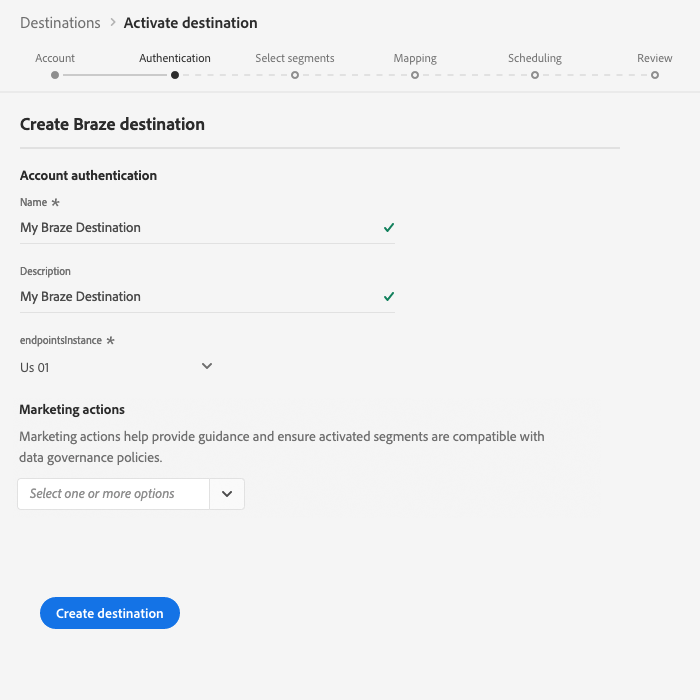

# (베타) [!DNL Braze] 대상

>[!IMPORTANT]
>
>Adobe Experience Platform의 Braze 대상은 현재 베타 버전입니다. 설명서 및 기능은 변경될 수 있습니다.

## 개요 {#overview}

대상은 프로필 데이터를 보낼 때 도움이 됩니다 [!DNL Braze] [!DNL Braze].

[!DNL Braze] 고객과 브랜드 간의 연관성 있고 인상적인 경험을 제공하는 포괄적인 고객 참여 플랫폼입니다.

프로필 데이터를 대상 [!DNL Braze]으로 보내려면 먼저 대상에 연결해야 합니다.

## 대상 사양 {#destination-specs}

대상에 대한 다음 세부 사항을 [!DNL Braze] 참고하십시오.

* ID를 대상에 매핑하는 한 [ID를](../../../identity-service/namespaces.md) [!DNL Braze] 대상에 보낼 수 [!DNL Braze] 있습니다 [`external_id`](https://www.braze.com/docs/api/basics/#external-user-id-explanation).
* [!DNL Adobe Experience Platform] 세그먼트는 속성 [!DNL Braze] 아래에 `AdobeExperiencePlatformSegments` 내보내집니다.

## 사용 사례 {#use-cases}

마케터로서, 세그먼트를 만든 모바일 참여 대상의 사용자를 타깃팅하고자 합니다 [!DNL Adobe Experience Platform]. 또한 세그먼트와 프로필이 업데이트되는 즉시, 프로필의 속성을 기반으로 개인화된 경험을 [!DNL Adobe Experience Platform] 제공해야 합니다 [!DNL Adobe Experience Platform].

## 내보내기 유형 {#export-type}

**[!DNL Profile-based]** - 원하는 스키마 필드와 함께 세그먼트의 모든 멤버를 내보낼 것입니다(예:필드 매핑에 따라 이메일 주소, 전화 번호, 성) 및/또는 ID를 지정합니다.
[!DNL Adobe Experience Platform] 세그먼트는 속성 [!DNL Braze] 아래에 `AdobeExperiencePlatformSegments` 내보내집니다.

## 대상에 연결 {#connect-destination}

[ **[!UICONTROL 연결]** ] > **[!UICONTROL 대상]**&#x200B;에서 [!DNL Braze]를 선택하고 구성을 **[!UICONTROL 선택합니다]**.

>[!NOTE]
>
>이 대상과의 연결이 이미 있는 경우 대상 카드에 **[!UICONTROL 활성화]** 단추가 표시됩니다. 활성화 및 구성 **[!UICONTROL 의 차이에 대한 자세한]****[!UICONTROL 내용은 대상 작업 공간 설명서의]**&#x200B;카탈로그 [섹션을](../../ui/destinations-workspace.md#catalog) 참조하십시오.
>
>

계정  단계에서 [!DNL Braze] 계정 토큰을 제공해야 합니다. 이게 네 [!DNL Braze] [!DNL API] 열쇠야 아래 URL에서 [!DNL API] 키를 얻는 방법에 대한 자세한 지침을 확인할 수 있습니다. [REST API 키 개요](https://www.braze.com/docs/api/api_key/). 토큰을 입력하고 대상에 **[!UICONTROL 연결을 클릭합니다]**.

**[!UICONTROL 다음]**&#x200B;을 클릭합니다. 인증  단계에서 [!DNL Braze] 연결 세부 사항을 입력해야 합니다.
* **[!UICONTROL 이름]**:나중에 이 대상을 인식할 이름을 입력합니다.
* **[!UICONTROL 설명]**:나중에 이 대상을 식별하는 데 도움이 되는 설명을 입력합니다.
* **[!UICONTROL 끝점 인스턴스]**:사용해야 하는 끝점 인스턴스를 담당자에게 [!DNL Braze] 요청하십시오.
* **[!UICONTROL 마케팅 활용 사례]**:마케팅 사용 사례에서는 데이터를 대상으로 내보내려는 의도를 나타냅니다. Adobe에서 정의한 마케팅 사용 사례에서 선택하거나 고유한 마케팅 사용 사례를 만들 수 있습니다. 마케팅 사용 사례에 대한 자세한 내용은 Adobe Experience Platform의 [데이터 거버넌스](../../../rtcdp/privacy/data-governance-overview.md#destinations) 페이지를 참조하십시오. 개별 Adobe에서 정의한 마케팅 사용 사례에 대한 자세한 내용은 [데이터 사용 정책 개요를 참조하십시오](../../../data-governance/policies/overview.md#core-actions).

대상 **[!UICONTROL 만들기를 클릭합니다]**. 이제 대상이 만들어집니다. 나중에 세그먼트를 **[!UICONTROL 활성화하려면 저장]** 및 종료를 **[!UICONTROL 클릭하거나]** 다음을 선택하여 워크플로우를 계속하고 활성화할 세그먼트를 선택할 수 있습니다. 두 경우 모두 워크플로우의 나머지 [에 대해 다음 섹션, 세그먼트](#activate-segments)활성화를 참조하십시오.

## 세그먼트 활성화 {#activate-segments}

세그먼트 [활성화 워크플로에 대한 자세한 내용은 대상에](../../ui/activate-destinations.md#select-attributes) 프로필 및 세그먼트 활성화를 참조하십시오.

## 필드 매핑 {#field-mapping}

대상 데이터를 대상에서 [!DNL Adobe Experience Platform] [!DNL Braze] 대상으로 올바르게 전송하려면 필드 매핑 단계를 거쳐야 합니다.

매핑은 계정의 [!DNL Experience Data Model] (XDM) 스키마 필드 및 대상 대상의 해당 필드 간에 링크를 만드는 [!DNL Platform] 것으로 구성됩니다.

XDM 필드를 [!DNL Braze] 대상 필드에 올바르게 매핑하려면 다음 단계를 수행하십시오.

매핑 [!UICONTROL 단계에서] 새 매핑 **[!UICONTROL 추가를 클릭합니다]**.

소스 [!UICONTROL 필드] 섹션에서 빈 필드 옆에 있는 화살표 단추를 클릭합니다.

소스 [!UICONTROL 선택 필드] 창에서 XDM 필드의 두 범주 중에서 선택할 수 있습니다.
* [!UICONTROL 속성 선택]:XDM 스키마의 특정 필드를 특성에 매핑하려면 이 옵션을 [!DNL Braze] 사용합니다.

* [!UICONTROL ID 네임스페이스 선택]:ID 네임스페이스를 네임스페이스에 매핑하려면 이 옵션을 [!DNL Platform] [!DNL Braze] 사용합니다.

소스 필드를 선택한 다음 **[!UICONTROL 선택을 클릭합니다]**.

[ [!UICONTROL Target 필드] ] 섹션에서 필드 오른쪽의 매핑 아이콘을 클릭합니다.

대상 [!UICONTROL 필드] 선택 창에서 세 가지 대상 필드 카테고리 중에서 선택할 수 있습니다.
* [!UICONTROL 속성 선택]:XDM 속성을 표준 속성에 매핑하려면 이 옵션을 [!DNL Braze] 사용합니다.
* [!UICONTROL ID 네임스페이스 선택]:ID 네임스페이스를 ID 네임스페이스에 매핑하려면 이 옵션을 [!DNL Platform] [!DNL Braze] 사용합니다.
* [!UICONTROL 사용자 지정 속성 선택]:이 옵션을 사용하여 계정에서 정의한 사용자 지정 [!DNL Braze] 속성에 XDM 속성을 [!DNL Braze] 매핑하십시오.
* 이 옵션을 사용하여 기존 XDM 속성의 이름을 바꿀 수도 있습니다 [!DNL Braze]. 예를 들어, XDM 속성을 사용자 지정 `lastName` 속성에 매핑하면 `Last_Name` , 속성이 없는 경우 [!DNL Braze]속성 `Last_Name` 을 만들고, XDM 속성을 [!DNL Braze]`lastName` 매핑합니다.

대상 필드를 선택한 다음 **[!UICONTROL 선택을 클릭합니다]**.

이제 목록에 필드 매핑이 표시됩니다.

매핑을 더 추가하려면 이전 단계를 반복합니다.

### 예 {#mapping-example}

XDM 프로필 스키마 및 인스턴스에 다음과 같은 속성과 ID가 [!DNL Braze] 포함되어 있다고 가정합니다.

|  | XDM 프로필 스키마 | [!DNL Braze] 인스턴스 |
|---|---|---|
| 속성 | <ul><li>person.name.firstName</code></li><li>person.name.lastName</code></li><li>mobilePhone.number</code></li></ul> | <ul><li>이름</code></li><li>성</code></li><li>전화 번호</code></li></ul> |
| ID | <ul><li>이메일</code></li><li>Google 광고 ID(GAID)</code></li><li>광고주용 Apple ID(IDFA)</code></li></ul> | <ul><li>external_id</code></li></ul> |

올바른 매핑은 다음과 같습니다.

## 내보낸 데이터 {#exported-data}

데이터를 대상으로 성공적으로 내보냈는지 확인하려면 [!DNL Braze] [!DNL Braze] 계정을 확인하십시오. [!DNL Adobe Experience Platform] 세그먼트는 속성 [!DNL Braze] 아래에 `AdobeExperiencePlatformSegments` 내보내집니다.

## 데이터 사용 및 관리 {#data-usage-governance}

모든 [!DNL Adobe Experience Platform] 대상은 데이터를 처리할 때 데이터 사용 정책을 준수합니다. 데이터 거버넌스 [!DNL Adobe Experience Platform] 를 적용하는 방법에 대한 자세한 내용은 실시간 CDP의 [데이터 거버넌스를 참조하십시오](../../../rtcdp/privacy/data-governance-overview.md).

