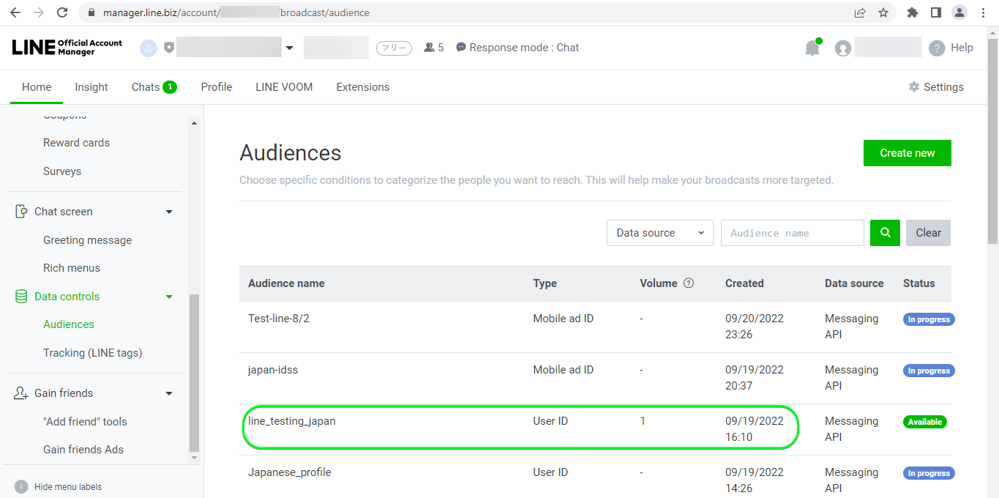

# [!DNL LINE] 연결

## 개요 {#overview}

[[!DNL LINE]](https://line.me/en/) 은 사람, 서비스 및 정보를 연결하고 채팅 앱에서 오락, 소셜 및 일상적인 활동을 위한 허브로 성장된 인기 있는 통신 플랫폼입니다.

이 [!DNL Adobe Experience Platform] [대상](/help/destinations/home.md) 활용 [[!DNL LINE] 메시징 API](https://developers.line.biz/en/reference/messaging-api/). Experience Platform 세그먼트에서 프로필을 내 연결로 활성화할 수 있습니다 [!DNL LINE] 비즈니스 요구 사항

[!DNL LINE] 는 bearer 토큰을 인증 메커니즘으로 사용하여 와 통신합니다 [!DNL LINE] 메시징 API. 인증 지침 [!DNL LINE] 인스턴스는 아래의, 내에서 [대상에 인증](#authenticate) 섹션을 참조하십시오.

## 사용 사례 {#use-cases}

마케터는 세그먼트가 내장된 모바일 참여 대상의 사용자를 타깃팅할 수 있습니다 [!DNL Adobe Experience Platform]. 또한 해당 경험의 속성에 따라 개인화된 경험을 제공할 수 있습니다 [!DNL Adobe Experience Platform] 세그먼트와 프로필이 업데이트되는 즉시 프로필 [!DNL Adobe Experience Platform].

## 전제 조건 {#prerequisites}

### [!DNL LINE] 전제 조건 {#prerequisites-destination}

에서 다음 전제 조건을 확인합니다. [!DNL LINE]를 입력하여 Platform에서 로 데이터를 [!DNL LINE] 계정:

#### 다음을 수행해야 합니다 [!DNL LINE] account {#prerequisites-account}

로 이동합니다. [!DNL LINE] [등록](https://account.line.biz/signup) 계정을 아직 등록하지 않은 경우 페이지를 만들어 계정을 만듭니다.

#### 를 수집합니다 [!DNL LINE channel access token (long-lived)] 에서 [!DNL LINE] 개발자 콘솔 {#gather-credentials}

Platform이 액세스할 수 있도록 허용하려면 [!DNL LINE] 리소스, *[!DNL Channel access token (long-lived)]* 원하는 위치에서 [!DNL LINE] *메시징 API* 채널.

1. 로 로그인 [!DNL LINE] 계정 [[!DNL LINE] 개발자 콘솔](https://developers.line.biz/console).
1. 다음으로, *[!DNL Providers]* list를 선택한 다음 *[!DNL Provider]* 관심 영역을 선택하고 *메시징 API* 채널에서 해당 설정에 액세스할 수 있습니다. 처음으로 개발자 콘솔에 액세스하는 경우 [[!DNL LINE] 설명서](https://developers.line.biz/en/docs/messaging-api/getting-started/) 공급자를 만드는 데 필요한 단계를 완료하려면
1. 마지막으로, ***[!DNL Channel access token]*** 섹션 및 복사 ***[!DNL Channel access token (long-lived)]*** 에 필요한 값 [대상에 인증](#authenticate) 단계.

| 자격 증명 | 설명 | 예 |
| --- | --- | --- |
| `[!DNL Channel access token (long-lived)]` | 사용자 [!DNL LINE Channel access token (long-lived)]. | `aaa2112XSMWqLXR7..........nyilFU=` |

자세한 내용은 [[!DNL LINE] 설명서](https://developers.line.biz/en/docs/messaging-api/getting-started/) 채널 생성 또는 기존 채널에 채널 추가에 대한 지침 [!DNL LINE] 계정 [!DNL LINE] 개발자 콘솔.

## 지원되는 ID {#supported-identities}

[!DNL LINE] 은 아래 표에 설명된 id의 업데이트 및 내보내기를 지원합니다. 추가 정보 [id](/help/identity-service/namespaces.md).

| Target ID | 설명 |
|---|---|
| IFA(광고주)에 대한 ID | 소스 ID가 IFA인 경우 IFA(Advertiser) 타겟 ID를 선택합니다 *(광고주용 Apple ID)* 또는 GAID *(Google Advertising ID) 네임스페이스입니다. |
| LINE 사용자 ID | 소스 ID가 LINE 사용자 ID인 경우 UserID 대상 ID를 선택합니다. |

## 내보내기 유형 및 빈도 {#export-type-frequency}

대상 내보내기 유형 및 빈도에 대한 자세한 내용은 아래 표를 참조하십시오.

| 항목 | 유형 | 참고 |
---------|----------|---------|
| 내보내기 유형 | **[!UICONTROL 프로필 기반]** | 에서 사용되는 식별자(이름, 전화 번호 또는 기타 식별자)로 세그먼트의 모든 멤버(대상)를 내보내고 있습니다 [!DNL LINE] 대상. |
| 내보내기 빈도 | **[!UICONTROL 스트리밍]** | 스트리밍 대상은 &quot;항상 설정&quot; API 기반 연결입니다. 세그먼트 평가를 기반으로 Experience Platform에서 프로필이 업데이트되는 즉시 커넥터는 업데이트 다운스트림을 대상 플랫폼으로 보냅니다. 자세한 내용 [스트리밍 대상](/help/destinations/destination-types.md#streaming-destinations). |

{style=&quot;table-layout:auto&quot;}

## 대상에 연결 {#connect}

>[!IMPORTANT]
>
>대상에 연결하려면 **[!UICONTROL 대상 관리]** [액세스 제어 권한](/help/access-control/home.md#permissions). 다음 문서를 참조하십시오. [액세스 제어 개요](/help/access-control/ui/overview.md) 또는 제품 관리자에게 문의하여 필요한 권한을 얻으십시오.

이 대상에 연결하려면 [대상 구성 자습서](../../ui/connect-destination.md). 대상 구성 워크플로우에서 아래 두 섹션에 나열된 필드를 채웁니다.

내 **[!UICONTROL 대상]** > **[!UICONTROL 카탈로그]** 검색 대상 [!DNL LINE]. 또는 **[!UICONTROL 모바일 참여]** 카테고리.

### 대상에 인증 {#authenticate}

대상을 인증하려면 **[!UICONTROL 대상에 연결]**.

아래 필수 필드를 입력합니다.
* **[!UICONTROL 베어러 토큰]**: 사용자 [!DNL LINE Channel access token (long-lived)] 에서 [!DNL LINE] 개발자 콘솔. 자세한 내용은 [자격 증명 수집](#gather-credentials) 섹션을 참조하십시오.

제공된 세부 정보가 유효한 경우 UI에 **[!UICONTROL 연결됨]** 녹색 확인 표시가 있는 상태 그런 다음 다음 다음 단계로 진행할 수 있습니다.

### 대상 세부 사항 채우기 {#destination-details}

대상에 대한 세부 사항을 구성하려면 아래 필수 및 선택적 필드를 입력합니다. UI에서 필드 옆에 있는 별표는 필드가 필수임을 나타냅니다.

* **[!UICONTROL 이름]**: 나중에 이 대상을 인식하는 이름입니다.
* **[!UICONTROL 설명]**: 나중에 이 대상을 식별하는 데 도움이 되는 설명입니다.
* **[!UICONTROL 대상 유형]**: 선택 **[!UICONTROL IFA(광고주)에 대한 ID]** 내보내려는 ID가 유형인 경우 *IFA(광고주)에 대한 ID*. 선택 **[!UICONTROL LINE 사용자 ID]** 내보내려는 ID가 유형인 경우 *LINE 사용자 ID*. 자세한 내용은 [지원되는 ID](#supported-identities) 섹션에 자세히 설명되어 있습니다.

### 경고 활성화 {#enable-alerts}

경고를 활성화하여 대상으로 데이터 흐름 상태에 대한 알림을 받을 수 있습니다. 목록에서 경고를 선택하여 데이터 흐름 상태에 대한 알림을 수신합니다. 경고에 대한 자세한 내용은 [UI를 사용하여 대상 경고 구독](../../ui/alerts.md).

대상 연결에 대한 세부 정보 제공을 마치면 를 선택합니다 **[!UICONTROL 다음]**.

## 세그먼트를 이 대상에 활성화 {#activate}

>[!IMPORTANT]
>
>데이터를 활성화하려면 **[!UICONTROL 대상 관리]**, **[!UICONTROL 대상 활성화]**, **[!UICONTROL 프로필 보기]**, 및 **[!UICONTROL 세그먼트 보기]** [액세스 제어 권한](/help/access-control/home.md#permissions). 다음 문서를 참조하십시오. [액세스 제어 개요](/help/access-control/ui/overview.md) 또는 제품 관리자에게 문의하여 필요한 권한을 얻으십시오.

읽기 [스트리밍 세그먼트 내보내기 대상으로 프로필 및 세그먼트를 활성화합니다](/help/destinations/ui/activate-segment-streaming-destinations.md) 대상 세그먼트를 이 대상으로 활성화하는 방법에 대한 지침입니다.

### 특성 및 ID 매핑 {#map}

대상 데이터를 Adobe Experience Platform에서 로 올바로 보내려면 [!DNL LINE] 대상, 필드 매핑 단계를 거쳐야 합니다. 매핑은 플랫폼 계정의 Experience Data Model(XDM) 스키마 필드와 대상 대상의 해당 상당 요소 간에 링크를 만드는 작업으로 이루어집니다. XDM 필드를 [!DNL LINE] 대상 필드: 다음 단계를 수행합니다.

소스 ID에 따라 다음 대상 ID 네임스페이스를 매핑해야 합니다. | Target ID | 소스 필드 | Target 필드 | | — | — | — | | IFA(광고주)에 대한 ID | `IDFA` 또는 `GAID` | `LineId` | | LINE 사용자 ID | `UserID` | `LineId` |

타겟 ID가 *LINE 사용자 ID* 아래 항목이 필요합니다.

타겟 ID가 *IFA(광고주)에 대한 ID* 아래 항목이 필요합니다.

## 데이터 내보내기의 유효성 검사 {#exported-data}

Experience Platform에서 성공적으로 데이터를 내보내면 [!DNL LINE] 대상에 새 대상 만들기 [!DNL LINE] 선택한 세그먼트 이름 사용.

대상을 올바르게 설정했는지 확인하려면 아래 단계를 수행하십시오.

1. in [!DNL LINE]에 로그인합니다. [Manager 콘솔](https://manager.line.biz/).

1. 다음으로 이동합니다. **[!UICONTROL 데이터 컨트롤]** > **[!UICONTROL 대상]** 그리고 내에서 선택한 세그먼트와 일치하는 이름을 선택합니다 **[!UICONTROL 대상 이름]** 열.

1. 업데이트된 볼륨이 세그먼트 내의 카운트와 일치합니다.

1. 다음 *유형* 열 언급 **[!UICONTROL UserID]** 내보낸 ID가 유형인 경우 *UserID*. 마찬가지로 *유형* 열 언급 **[!UICONTROL 모바일 광고 Id]** 내보낸 ID가 유형인 경우 *IDFA*.

내의 예제 설정 [!DNL LINE] 아래와 같이 표시됩니다.

## 데이터 사용 및 거버넌스 {#data-usage-governance}

모두 [!DNL Adobe Experience Platform] 대상은 데이터를 처리할 때 데이터 사용 정책을 준수합니다. 방법에 대한 자세한 정보 [!DNL Adobe Experience Platform] 데이터 거버넌스를 적용하는 경우 다음을 참조하십시오. [데이터 거버넌스 개요](/help/data-governance/home.md).