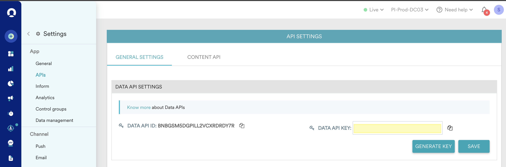

# [!DNL Moengage] 연결

## 개요 {#overview}

[!DNL Moengage] 대상을 사용하여 Adobe 데이터(사용자 특성, 세그먼트 및 이벤트)를 MoEngage에 실시간으로 연결하고 매핑합니다. 그런 다음 고객은 이 데이터에 따라 행동하여 개인화되고 타겟팅된 경험을 제공할 수 있습니다.

Adobe을 사용하면 통합이 매우 간단하고 직관적입니다. Adobe 사용자 프로필을 가져와 MoEngage 사용자 속성에 매핑하기만 하면 됩니다.

>[!IMPORTANT]
>
>이 대상 커넥터 및 설명서 페이지는 *Moengage* 팀에서 만들고 유지 관리합니다. 문의 사항이나 업데이트 요청은 *`https://help.moengage.com/hc/en-us`.*&#x200B;에서 직접 문의하십시오.

## 사용 사례 {#use-cases}

마케터는 [!DNL Moengage] 캠페인을 통해 사용자 세그먼트(Adobe Experience Platform에 내장되어 있음)를 타깃팅하려고 합니다. 또한 Adobe Experience Platform 프로필의 속성을 기반으로 캠페인 컨텐츠를 개인화하려고 합니다. 이 통합을 통해 Adobe Experience Platform에서 세그먼트 및 프로필이 업데이트되는 즉시 사용자 및 속성이 MoEngage에서 업데이트됩니다.

## 전제 조건 {#prerequisites}

Adobe Experience Platform 데이터를 [!DNL Moengage]&#x200B;(으)로 보내려면 먼저 다음 전제 조건을 참고하십시오.

* Adobe Experience Platform에서 MoEngage 대상을 사용하려면 먼저 사용자가 [!DNL Moengage] 계정에 액세스할 수 있어야 합니다. MoEngage 계정에 등록하거나 로그인하려면 다음 페이지를 방문하십시오. https://app.moengage.com

## 지원되는 ID {#supported-identities}

[!DNL Moengage]은(는) 아래 표에 설명된 ID 활성화를 지원합니다.

| 대상 ID | 설명 | 고려 사항 |
|---|------------------------------------------------------------------------------------------|----------------------------------------------------------------------------------------|
| user_id | [!DNL Moengage] 시스템에서 사용자 프로필을 고유하게 식별하는 고유 식별자입니다. | 이 식별자는 문자열 유형을 지원합니다. user_id 또는 anonymous_id 중 하나가 필요합니다. |
| anonymous_id | 알 수 없는 사용자 프로필에 대한 다른 식별자 - 시스템에 존재하지 않는 프로필을 의미합니다. | 이 식별자는 문자열 유형을 지원합니다. user_id 또는 anonymous_id 중 하나가 필요합니다. |

{style="table-layout:auto"}

## 내보내기 유형 및 빈도 {#export-type-frequency}

대상 내보내기 유형 및 빈도에 대한 자세한 내용은 아래 표를 참조하십시오.

| 항목 | 유형 | 참고 |
---------|----------|------------------------------------------------------------------------------------------------------------------------------------------------------------------------------------------------------------------------------------------------------------------------------------------------------------------------------------|
| 내보내기 유형 | **[!UICONTROL 프로필 기반]** | [!DNL Moengage]&#x200B;(으)로 내보낸 사용자 지정 특성과 함께 식별자(user_id, anonymous_id)로 세그먼트(대상자)의 모든 멤버를 내보냅니다. |
| 내보내기 빈도 | **[!UICONTROL 스트리밍]** | 스트리밍 대상은 &quot;항상&quot; API 기반 연결입니다. 세그먼트 평가를 기반으로 Experience Platform에서 프로필이 업데이트되는 즉시 커넥터가 업데이트 다운스트림을 대상 플랫폼으로 보냅니다. [스트리밍 대상](/help/destinations/destination-types.md#streaming-destinations)에 대해 자세히 알아보세요. |

{style="table-layout:auto"}

## 대상에 연결 {#connect}

>[!IMPORTANT]
> 
>대상에 연결하려면 **[!UICONTROL 대상 보기]** 및 **[!UICONTROL 대상 관리]** [액세스 제어 권한](/help/access-control/home.md#permissions)이 필요합니다. [액세스 제어 개요](/help/access-control/ui/overview.md)를 읽거나 제품 관리자에게 문의하여 필요한 권한을 받으십시오.

이 대상에 연결하려면 [대상 구성 자습서](../../ui/connect-destination.md)에 설명된 단계를 따르십시오. 대상 구성 워크플로에서 아래 두 섹션에 나열된 필드를 채웁니다.

### 대상으로 인증 {#authenticate}

대상에 인증하려면 필수 필드를 입력한 다음 **[!UICONTROL 대상에 연결]**&#x200B;을(를) 선택하십시오.

### 대상 세부 정보 입력 {#destination-details}

대상에 대한 세부 정보를 구성하려면 아래의 필수 및 선택 필드를 채우십시오. UI에서 필드 옆에 있는 별표는 필드가 필수임을 나타냅니다.

* **[!UICONTROL 사용자 이름]**: [!DNL Moengage] 대시보드의 설정 페이지의 데이터 앱 ID.
* **[!UICONTROL 암호]**: [!DNL Moengage] 대시보드의 설정 페이지에 있는 데이터 앱 키입니다.

* **[!UICONTROL 이름]**: 나중에 이 대상을 인식할 수 있는 이름입니다.
* **[!UICONTROL 설명]**: 나중에 이 대상을 식별하는 데 도움이 되는 설명입니다.
* **[!UICONTROL 지역]**: 앱 *데이터 센터*.

### 경고 활성화 {#enable-alerts}

경고를 활성화하여 대상에 대한 데이터 흐름 상태에 대한 알림을 받을 수 있습니다. 목록에서 경고를 선택하여 데이터 흐름 상태에 대한 알림을 수신합니다. 경고에 대한 자세한 내용은 [UI를 사용하여 대상 경고 구독](../../ui/alerts.md)에 대한 안내서를 참조하십시오.

대상 연결에 대한 세부 정보를 모두 제공했으면 **[!UICONTROL 다음]**&#x200B;을 선택합니다.

## 이 대상에 대한 세그먼트 활성화 {#activate}

>[!IMPORTANT]
> 
>데이터를 활성화하려면 **[!UICONTROL 대상 보기]**, **[!UICONTROL 대상 활성화]**, **[!UICONTROL 프로필 보기]** 및 **[!UICONTROL 세그먼트 보기]** [액세스 제어 권한](/help/access-control/home.md#permissions)이 필요합니다. [액세스 제어 개요](/help/access-control/ui/overview.md)를 읽거나 제품 관리자에게 문의하여 필요한 권한을 받으십시오.

이 대상에 대상 세그먼트를 활성화하는 방법에 대한 지침은 [스트리밍 세그먼트 내보내기 대상에 대상 데이터 활성화](../../ui/activate-segment-streaming-destinations.md)를 참조하십시오.

### 속성 및 ID 매핑 {#map}

대상 데이터를 [!DNL Adobe Experience Platform]에서 [!DNL Moengage] 대상으로 올바르게 보내려면 필드 매핑 단계를 거쳐야 합니다.

매핑은 [!DNL Platform] 계정의 [!DNL Experience Data Model]&#x200B;(XDM) 스키마 필드와 대상 대상의 해당 필드 필드 사이에 링크를 만드는 것으로 구성됩니다.

XDM 필드를 [!DNL Moengage] 대상 필드에 올바르게 매핑하려면 다음 단계를 따르십시오.

[!UICONTROL 매핑] 단계에서 **[!UICONTROL 확인란]**&#x200B;을 선택합니다.

[!UICONTROL 매핑] 단계에서 **[!UICONTROL 새 매핑 추가]**&#x200B;를 선택합니다.

[!UICONTROL Source 필드] 섹션에서 빈 필드 옆에 있는 화살표 단추를 선택합니다.

[!UICONTROL 소스 필드 선택] 창에서 다음 두 범주의 XDM 필드 중 하나를 선택할 수 있습니다.
* [!UICONTROL 특성 선택]: 이 옵션을 사용하여 XDM 스키마의 특정 필드를 [!DNL Moengage] 특성에 매핑합니다.

소스 필드를 선택한 다음 **[!UICONTROL 선택]**&#x200B;을 선택합니다.

[!UICONTROL 대상 필드] 섹션에서 필드 오른쪽에 있는 매핑 아이콘을 선택합니다.

[!UICONTROL 대상 필드 선택] 창에서 다음 두 범주의 대상 필드 중에서 선택할 수 있습니다.
* [!UICONTROL ID 네임스페이스 선택]: 이 옵션을 사용하여 [!DNL Platform] ID 네임스페이스를 [!DNL Moengage] ID 네임스페이스에 매핑합니다.
* [!UICONTROL 사용자 지정 특성 선택]: 이 옵션을 사용하여 XDM 특성을 [!DNL Moengage] 계정에 정의한 사용자 지정 [!DNL Moengage] 특성에 매핑합니다.   이 옵션을 사용하여 기존 XDM 특성의 이름을 [!DNL Moengage]&#x200B;(으)로 바꿀 수도 있습니다. 예를 들어 `lastName` XDM 특성을 [!DNL Moengage]의 사용자 지정 `Last_Name` 특성에 매핑하면 [!DNL Moengage]에 `Last_Name` 특성이 아직 존재하지 않는 경우 이 특성을 만들고 `lastName` XDM 특성을 매핑합니다.

대상 필드를 선택한 다음 **[!UICONTROL 선택]**&#x200B;을 선택합니다.

이제 목록에 필드 매핑이 표시됩니다.

매핑을 더 추가하려면 이전 단계를 반복합니다.

## 내보낸 데이터/데이터 내보내기 유효성 검사 {#exported-data}

데이터를 [!DNL Moengage] 대상으로 내보냈는지 확인하려면 [!DNL Moengage] 계정의 사용자 프로필로 이동하십시오. 여기서는 자동으로 만들어진 `AEPSegments` 사용자 특성과 Adobe Experience Platform의 이전 단계에서 매핑된 다른 사용자 지정 특성을 찾아야 합니다.

`AEPSegments`은(는) [!DNL Moengage]의 배열 형식 특성입니다. 이 목록에는 사용자가 Experience Platform에서 연결된 모든 Adobe 대상 이름이 나열됩니다.

## 데이터 사용 및 관리 {#data-usage-governance}

데이터를 처리할 때 모든 [!DNL Adobe Experience Platform] 대상이 데이터 사용 정책을 준수합니다. [!DNL Adobe Experience Platform]에서 데이터 거버넌스를 적용하는 방법에 대한 자세한 내용은 [데이터 거버넌스 개요](/help/data-governance/home.md)를 참조하십시오.
