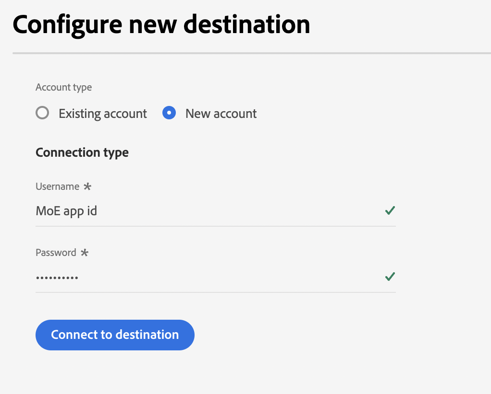
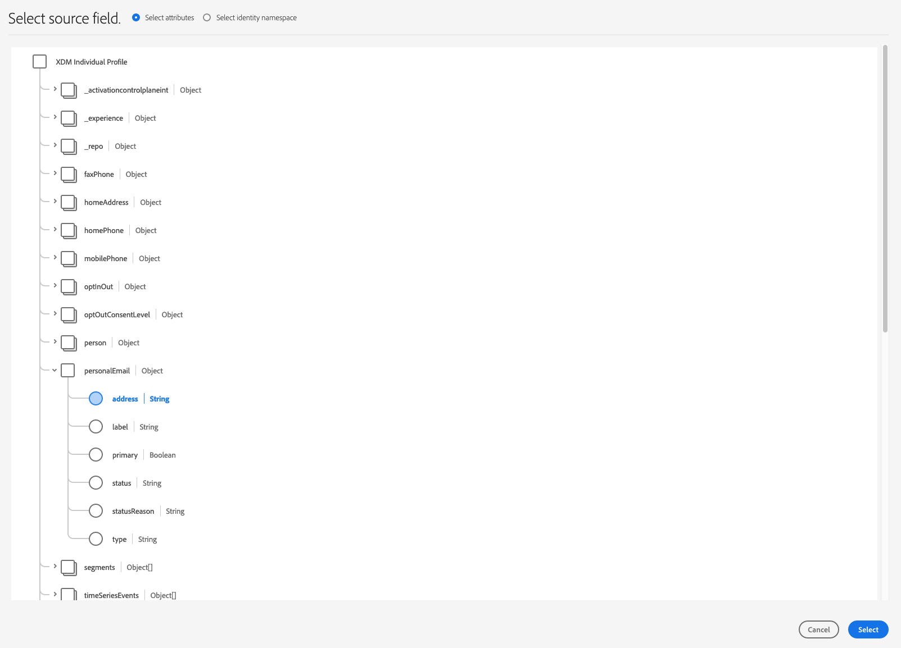

# [!DNL Moengage] 연결

## 개요 {#overview}

사용 [!DNL Moengage] 대상 : Adobe 데이터(사용자 특성, 세그먼트 및 이벤트)를 실시간으로 MoEngage에 연결하고 매핑합니다. 그런 다음 고객은 이 데이터에 따라 행동하여 개인화되고 타겟팅된 경험을 제공할 수 있습니다.

Adobe을 사용하면 통합이 매우 간단하고 직관적입니다. Adobe 사용자 프로필을 가져와 MoEngage 사용자 속성에 매핑하기만 하면 됩니다.

>[!IMPORTANT]
>
>이 대상 커넥터 및 설명서 페이지는 *Moengage* 팀. 문의 사항이나 업데이트 요청은 다음 주소로 직접 문의하십시오. *`https://help.moengage.com/hc/en-us`.*

## 사용 사례 {#use-cases}

마케터는 를 통해 사용자 세그먼트(Adobe Experience Platform에 내장되어 있음)를 타겟팅하려고 합니다. [!DNL Moengage] 캠페인. 또한 Adobe Experience Platform 프로필의 속성을 기반으로 캠페인 컨텐츠를 개인화하려고 합니다. 이 통합을 통해 Adobe Experience Platform에서 세그먼트 및 프로필이 업데이트되는 즉시 사용자 및 속성이 MoEngage에서 업데이트됩니다.

## 전제 조건 {#prerequisites}

Adobe Experience Platform 데이터를 다음으로 보내기 전에 [!DNL Moengage], 다음 전제 조건을 참고하십시오.

* Adobe Experience Platform에서 MoEngage 대상을 사용하려면 먼저 사용자에게 다음에 대한 액세스 권한이 있어야 합니다 [!DNL Moengage] 계정. MoEngage 계정에 등록하거나 로그인하려면 다음 페이지를 방문하십시오. https://app.moengage.com

## 지원되는 ID {#supported-identities}

[!DNL Moengage] 는 아래 표에 설명된 id 활성화를 지원합니다.

| 대상 ID | 설명 | 고려 사항 |
|---|------------------------------------------------------------------------------------------|----------------------------------------------------------------------------------------|
| user_id | 에서 사용자 프로필을 고유하게 식별하는 고유 식별자 [!DNL Moengage] 시스템. | 이 식별자는 문자열 유형을 지원합니다. user_id 또는 anonymous_id 중 하나가 필요합니다. |
| anonymous_id | 알 수 없는 사용자 프로필에 대한 다른 식별자 - 시스템에 존재하지 않는 프로필을 의미합니다. | 이 식별자는 문자열 유형을 지원합니다. user_id 또는 anonymous_id 중 하나가 필요합니다. |

{style="table-layout:auto"}

## 내보내기 유형 및 빈도 {#export-type-frequency}

대상 내보내기 유형 및 빈도에 대한 자세한 내용은 아래 표를 참조하십시오.

| 항목 | 유형 | 참고 |
---------|----------|------------------------------------------------------------------------------------------------------------------------------------------------------------------------------------------------------------------------------------------------------------------------------------------------------------------------------------|
| 내보내기 유형 | **[!UICONTROL 프로필 기반]** | 에 내보낸 사용자 정의 속성과 함께 식별자(user_id, anonymous_id)를 사용하여 세그먼트(대상자)의 모든 멤버를 내보냅니다. [!DNL Moengage]. |
| 내보내기 빈도 | **[!UICONTROL 스트리밍]** | 스트리밍 대상은 &quot;항상&quot; API 기반 연결입니다. Experience Platform 평가를 기반으로 프로필이 세그먼트에서 업데이트되는 즉시 커넥터가 업데이트 다운스트림을 대상 플랫폼으로 전송합니다. 자세한 내용 [스트리밍 대상](/help/destinations/destination-types.md#streaming-destinations). |

{style="table-layout:auto"}

## 대상에 연결 {#connect}

>[!IMPORTANT]
> 
>대상에 연결하려면 다음이 필요합니다. **[!UICONTROL 대상 관리]** [액세스 제어 권한](/help/access-control/home.md#permissions). 읽기 [액세스 제어 개요](/help/access-control/ui/overview.md) 필요한 권한을 얻으려면 제품 관리자에게 문의하십시오.

이 대상에 연결하려면 다음과같이 하십시오. [대상 구성 자습서](../../ui/connect-destination.md). 대상 구성 워크플로에서 아래 두 섹션에 나열된 필드를 채웁니다.

### 대상에 인증 {#authenticate}

대상에 인증하려면 필수 필드를 입력한 다음 을(를) 선택합니다. **[!UICONTROL 대상에 연결]**.

### 대상 세부 정보 입력 {#destination-details}

대상에 대한 세부 정보를 구성하려면 아래의 필수 및 선택 필드를 채우십시오. UI에서 필드 옆에 있는 별표는 필드가 필수임을 나타냅니다.

* **[!UICONTROL 사용자 이름]**: 설정 페이지의 데이터 앱 ID [!DNL Moengage] 대시보드입니다.
* **[!UICONTROL 암호]**: 의 설정 페이지에 있는 데이터 앱 키 [!DNL Moengage] 대시보드입니다.

* **[!UICONTROL 이름]**: 나중에 이 대상을 인식할 수 있는 이름입니다.
* **[!UICONTROL 설명]**: 나중에 이 대상을 식별하는 데 도움이 되는 설명입니다.
* **[!UICONTROL 지역]**: 앱 *데이터 센터*.

### 경고 활성화 {#enable-alerts}

경고를 활성화하여 대상에 대한 데이터 흐름 상태에 대한 알림을 받을 수 있습니다. 목록에서 경고를 선택하여 데이터 흐름 상태에 대한 알림을 수신합니다. 경고에 대한 자세한 내용은 다음 안내서를 참조하십시오. [UI를 사용하여 대상 경고 구독](../../ui/alerts.md).

대상 연결에 대한 세부 정보를 제공했으면 을 선택합니다. **[!UICONTROL 다음]**.

## 이 대상에 대한 세그먼트 활성화 {#activate}

>[!IMPORTANT]
> 
>데이터를 활성화하려면 **[!UICONTROL 대상 관리]**, **[!UICONTROL 대상 활성화]**, **[!UICONTROL 프로필 보기]**, 및 **[!UICONTROL 세그먼트 보기]** [액세스 제어 권한](/help/access-control/home.md#permissions). 읽기 [액세스 제어 개요](/help/access-control/ui/overview.md) 필요한 권한을 얻으려면 제품 관리자에게 문의하십시오.

다음을 참조하십시오 [대상 데이터를 스트리밍 세그먼트 내보내기 대상으로 활성화](../../ui/activate-segment-streaming-destinations.md) 대상 세그먼트를 이 대상으로 활성화하는 방법에 대한 지침

### 속성 및 ID 매핑 {#map}

대상 데이터를에서 올바로 보내려면 [!DNL Adobe Experience Platform] (으)로 [!DNL Moengage] 대상, 필드 매핑 단계를 거쳐야 합니다.

매핑은 와(과) 사이에 링크 만들기로 구성됩니다. [!DNL Experience Data Model] 의 (XDM) 스키마 필드 [!DNL Platform] account 및 대상 항목의 해당 등가물

XDM 필드를 [!DNL Moengage] 대상 필드에서 다음 단계를 수행합니다.

다음에서 [!UICONTROL 매핑] 단계, 선택 **[!UICONTROL 확인란]**.

다음에서 [!UICONTROL 매핑] 단계, 선택 **[!UICONTROL 새 매핑 추가]**.

다음에서 [!UICONTROL 소스 필드] 섹션에서 빈 필드 옆에 있는 화살표 버튼을 선택합니다.

다음에서 [!UICONTROL 소스 필드 선택] 창에서 다음 두 범주의 XDM 필드 중에서 선택할 수 있습니다.
* [!UICONTROL 속성 선택]: 이 옵션을 사용하여 XDM 스키마의 특정 필드를 [!DNL Moengage] 특성.

소스 필드를 선택한 다음 을(를) 선택합니다 **[!UICONTROL 선택]**.

다음에서 [!UICONTROL 대상 필드] 섹션에서 필드 오른쪽에 있는 매핑 아이콘을 선택합니다.

다음에서 [!UICONTROL 대상 필드 선택] 창에서 다음 두 범주의 대상 필드 중에서 선택할 수 있습니다.
* [!UICONTROL ID 네임스페이스 선택]: 이 옵션을 사용하여 매핑합니다. [!DNL Platform] 네임스페이스 식별 [!DNL Moengage] id 네임스페이스.
* [!UICONTROL 사용자 지정 속성 선택]: 이 옵션을 사용하여 XDM 속성을 사용자 지정에 매핑합니다 [!DNL Moengage] 에서 정의한 속성 [!DNL Moengage] 계정입니다.   이 옵션을 사용하여 기존 XDM 속성의 이름을으로 바꿀 수도 있습니다 [!DNL Moengage]. 예를 들어 를 매핑합니다. `lastName` 사용자 지정에 대한 XDM 속성 `Last_Name` 의 속성 [!DNL Moengage]을(를) 통해 `Last_Name` 의 속성 [!DNL Moengage]가 없는 경우 매핑합니다. `lastName` XDM 속성입니다.

대상 필드를 선택한 다음 을(를) 선택합니다 **[!UICONTROL 선택]**.

이제 목록에 필드 매핑이 표시됩니다.

매핑을 더 추가하려면 이전 단계를 반복합니다.

## 내보낸 데이터/데이터 내보내기 유효성 검사 {#exported-data}

데이터가 성공적으로 로 내보내졌는지 확인하려면 [!DNL Moengage] 대상, 의 사용자 프로필로 이동 [!DNL Moengage] 계정입니다. AEP Segment 라는 사용자 속성이 표시됩니다.

## 데이터 사용 및 관리 {#data-usage-governance}

모두 [!DNL Adobe Experience Platform] 대상은 데이터를 처리할 때 데이터 사용 정책을 준수합니다. 방법에 대한 자세한 정보 [!DNL Adobe Experience Platform] 데이터 거버넌스 적용, 다음을 읽습니다. [데이터 거버넌스 개요](/help/data-governance/home.md).

