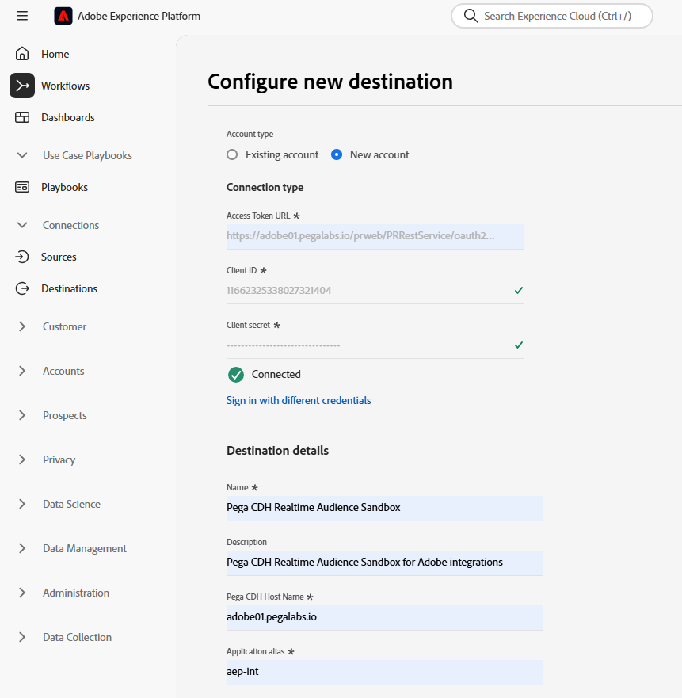

# (V2) 페가 CDH 실시간 대상 연결

## 개요 {#overview}

Adobe Experience Platform의 (V2) [!DNL Pega CDH Realtime Audience] 대상을 사용하여 프로필 특성 및 대상자 멤버십 데이터를 [!DNL Pega Customer Decision Hub]&#x200B;(으)로 보내 다음 모범 사례를 결정하십시오.

Adobe Experience Platform의 프로필 대상 멤버십이 [!DNL Pega Customer Decision Hub]에 로드되면 적응형 모델의 예측 변수로 사용할 수 있으며, 최적의 다음 작업 결정을 위해 올바른 컨텍스트 및 행동 데이터를 제공하는 데 도움이 됩니다.

>[!IMPORTANT]
>
>이 대상 커넥터 및 설명서 페이지는 Pegasystem에서 만들고 유지 관리합니다. 문의 사항이나 업데이트 요청은 Pega에게 직접 [여기](mailto:support@pega.com)로 문의하십시오.

## 사용 사례 {#use-cases}

[!DNL Customer Decision Hub] 대상을 사용하는 방법과 시기를 더 잘 이해할 수 있도록 Adobe Experience Platform 고객이 이 대상을 사용하여 해결할 수 있는 사용 사례를 소개합니다.

### 통신 {#telecommunications}

마케터는 고객 참여를 위해 [!DNL Pega Customer Decision Hub]이(가) 제공한 데이터 과학 모델 기반 다음 모범 사례의 인사이트를 활용하려고 합니다. [!DNL Pega Customer Decision Hub]은(는) 아웃바운드 채널의 다음 최적 작업(NBA) 결정을 결정하기 위해 &quot;Interest_In_5G&quot;, &quot;Interest_in_Unlimited_Dataplan&quot; 또는 &quot;Interest_in_iPhone_accessories&quot;와 같이 고객 의도에 크게 의존합니다.

### 금융 서비스 {#financial-services}

마케터는 연금 제도 또는 퇴직 연금 제도 뉴스레터를 구독하거나 구독 취소한 고객을 위해 오퍼를 최적화하려고 합니다. 금융 서비스 회사는 자체 CRM에서 여러 고객 ID를 Adobe Experience Platform으로 수집하고, 자체 오프라인 데이터에서 대상을 작성하고, 대상을 입력하거나 종료하는 프로필을 [!DNL Pega Customer Decision Hub]&#x200B;(으)로 전송하여 아웃바운드 채널에서 다음 최적 작업(NBA) 결정을 내릴 수 있습니다.

## 전제 조건 {#prerequisites}

이 대상을 사용하여 Adobe Experience Platform에서 데이터를 내보내려면 먼저 [!DNL Pega Customer Decision Hub]에서 다음 사전 요구 사항을 완료하십시오.

* [!DNL Pega Customer Decision Hub] 인스턴스에서 [Adobe Experience Platform 프로필 및 대상 멤버십 통합 구성 요소](https://docs.pega.com/bundle/components/page/customer-decision-hub/components/adobe-membership-component.html)를 구성합니다.
* [!DNL Pega Customer Decision Hub] 인스턴스에서 클라이언트 자격 증명을 사용하여 OAuth 2.0 [클라이언트 등록](https://docs.pega.com/bundle/platform/page/platform/security/configure-oauth-2-client-registration.html) 부여 유형을 구성합니다.
* [!DNL Pega Customer Decision Hub] 인스턴스에서 Adobe 대상 멤버십 데이터 흐름에 대한 [실시간 실행 데이터 흐름](https://docs.pega.com/bundle/platform/page/platform/decision-management/data-flow-run-real-time-create.html)을 구성하십시오.

## 지원되는 ID {#supported-identities}

[!DNL Pega Customer Decision Hub]은(는) 아래 표에 설명된 사용자 지정 사용자 ID의 활성화를 지원합니다. 자세한 내용은 [ID](/help/identity-service/features/namespaces.md)를 참조하세요.

| 대상 ID | 설명 | 고려 사항 |
|---|---|---|
| `CustomerID` | 고객 ID | [!DNL Pega Customer Decision Hub] 및 Adobe Experience Platform에서 프로필을 고유하게 식별하는 일반 사용자 식별자입니다. |

{style="table-layout:auto"}

## 내보내기 유형 및 빈도 {#export-type-frequency}

대상 내보내기 유형 및 빈도에 대한 자세한 내용은 아래 표를 참조하십시오.

| 항목 | 유형 | 참고 |
---------|----------|---------|
| 내보내기 유형 | **[!UICONTROL 프로필 기반]** | 식별자(*CustomerID*), 특성(성, 이름, 위치 등) 및 대상 멤버십 데이터를 사용하여 대상의 모든 구성원을 내보냅니다. |
| 내보내기 빈도 | **[!UICONTROL 스트리밍]** | 스트리밍 대상은 항상 API 기반 연결입니다. 대상 평가를 기반으로 Experience Platform에서 프로필이 업데이트되는 즉시 커넥터가 업데이트 다운스트림을 대상 플랫폼으로 전송합니다. 자세한 내용은 [스트리밍 대상](/help/destinations/destination-types.md#streaming-destinations)을 참조하세요. |

{style="table-layout:auto"}

## 대상에 연결 {#connect}

이 대상에 연결하려면 [대상 구성 자습서](../../ui/connect-destination.md)에 설명된 단계를 따르십시오. 대상 구성 워크플로에서 아래 두 섹션에 나열된 필드를 채웁니다.

### 대상으로 인증 {#authenticate}

#### OAuth 2 클라이언트 자격 증명 인증 {#oauth-2-client-credentials-authentication}

아래 필드를 입력한 다음 **[!UICONTROL 대상에 연결]**&#x200B;을(를) 선택하십시오.

* **[!UICONTROL 액세스 토큰 URL]**: [!DNL Pega Customer Decision Hub] 인스턴스의 OAuth 2 액세스 토큰 URL.
* **[!UICONTROL 클라이언트 ID]**: [!DNL Pega Customer Decision Hub] 인스턴스에서 생성한 OAuth 2 [!DNL client ID]입니다.
* **[!UICONTROL 클라이언트 암호]**: [!DNL Pega Customer Decision Hub] 인스턴스에서 생성한 OAuth 2 [!DNL client secret]입니다.

### 대상 세부 정보 입력 {#destination-details}

[!DNL Pega Customer Decision Hub]에 대한 인증 연결을 설정한 후 대상에 대해 다음 정보를 제공하십시오.

대상에 대한 세부 정보를 구성하려면 필수 필드를 입력하고 **[!UICONTROL 다음]**&#x200B;을(를) 선택하십시오.

* **[!UICONTROL 이름]**: 나중에 이 대상을 인식할 수 있는 이름입니다.
* **[!UICONTROL 설명]**: 나중에 이 대상을 식별하는 데 도움이 되는 설명입니다.
* **[!UICONTROL Pega CDH 호스트 이름]**: 프로필을 JSON 데이터로 내보내는 Pega 고객 의사 결정 허브 호스트 이름입니다.
* **[!UICONTROL 응용 프로그램 별칭]**: Customer Decision Hub 계정에 대해 구성한 응용 프로그램 별칭입니다. 자세한 내용은 [!DNL Pega Customer Decision Hub] 인스턴스에서 [응용 프로그램 URL 별칭 추가](https://docs.pega.com/bundle/platform/page/platform/user-experience/adding-application-url-alias.html)를 참조하십시오.

## 이 대상으로 대상자 활성화 {#activate}

>[!IMPORTANT]
> 
>* 데이터를 활성화하려면 **[!UICONTROL 대상 보기]**, **[!UICONTROL 대상 활성화]**, **[!UICONTROL 프로필 보기]** 및 **[!UICONTROL 세그먼트 보기]** [액세스 제어 권한](/help/access-control/home.md#permissions)이 필요합니다. [액세스 제어 개요](/help/access-control/ui/overview.md)를 읽거나 제품 관리자에게 문의하여 필요한 권한을 받으십시오.
>* *ID*&#x200B;을(를) 내보내려면 **[!UICONTROL ID 그래프 보기]** [액세스 제어 권한](/help/access-control/home.md#permissions)이 필요합니다.   {width="100" zoomable="yes"}

이 대상으로 대상을 활성화하는 방법에 대한 지침은 [스트리밍 프로필 내보내기 대상으로 대상 데이터 활성화](../../ui/activate-streaming-profile-destinations.md)를 참조하십시오.

### 매핑 {#mapping}

[!UICONTROL 매핑] 단계에서 유니온 스키마 및 대상으로 내보낼 다른 XDM 필드에서 고유 식별자를 선택합니다.

### 매핑 예: [!DNL Pega Customer Decision Hub]에서 프로필 업데이트 활성화 {#mapping-example}

다음은 프로필을 [!DNL Pega Customer Decision Hub]&#x200B;(으)로 내보낼 때 올바른 ID 매핑의 예입니다.

* Adobe Experience Platform 및 [!DNL Pega Customer Decision Hub]에서 프로필을 고유하게 식별하는 원본 ID를 선택하십시오. 예: `CustomerID`.
* 선택한 소스 프로필 속성을 매핑할 대상 프로필 속성을 선택합니다.

## 내보낸 데이터/데이터 내보내기 유효성 검사 {#exported-data}

프로필에 대한 대상 멤버십을 성공적으로 업데이트하면 페가 마케팅 대상 멤버십 데이터 저장소에 대상 식별자, 이름 및 상태가 삽입됩니다. 멤버 자격 데이터는 아래와 같이 [!DNL Pega Customer Decision Hub]에서 Customer Profile Designer을 사용하는 고객과 연결되어 있습니다.

대상 멤버십 데이터는 아래와 같이 다음으로 가장 적합한 작업을 결정하기 위해 Pega 다음으로 적합한 작업 Designer 참여 정책에서 사용됩니다.

고객 대상 멤버십 데이터 필드는 아래와 같이 적응형 모델에 예측 변수로 추가됩니다.

## 추가 리소스 {#additional-resources}

자세한 내용은 다음 [!DNL Pega] 설명서를 참조하십시오.
* [OAuth 2.0 클라이언트 등록 설정](https://docs.pega.com/bundle/platform/page/platform/security/configure-oauth-2-client-registration.html)
* [데이터 흐름에 대한 실시간 실행 만들기](https://docs.pega.com/bundle/platform/page/platform/decision-management/data-flow-run-real-time-create.html)
* [고객 프로필 Designer에서 고객 레코드 관리](https://docs.pega.com/bundle/customer-decision-hub/page/customer-decision-hub/implement/profile-designer-data-management.html)

## 데이터 사용 및 관리 {#data-usage-governance}

데이터를 처리할 때 모든 [!DNL Adobe Experience Platform] 대상이 데이터 사용 정책을 준수합니다. [!DNL Adobe Experience Platform]에서 데이터 거버넌스를 적용하는 방법에 대한 자세한 내용은 [데이터 거버넌스 개요](/help/data-governance/home.md)를 참조하십시오.
