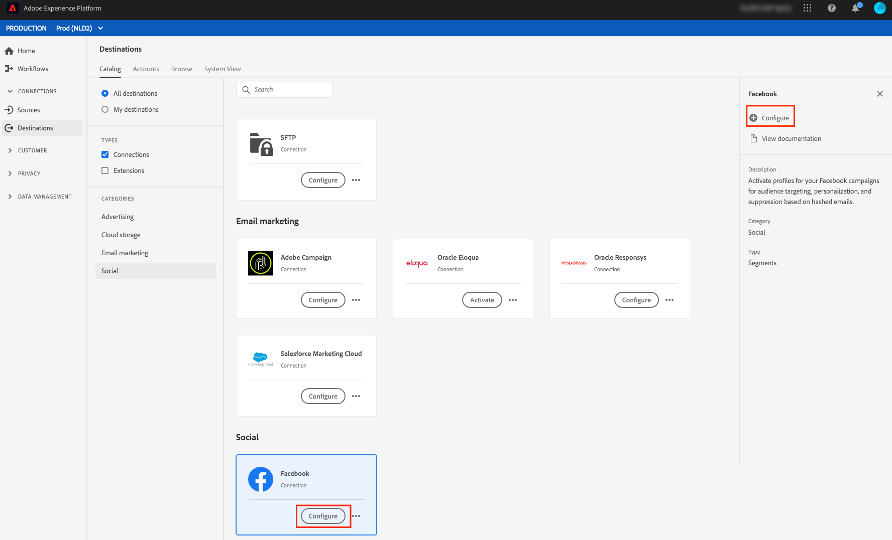
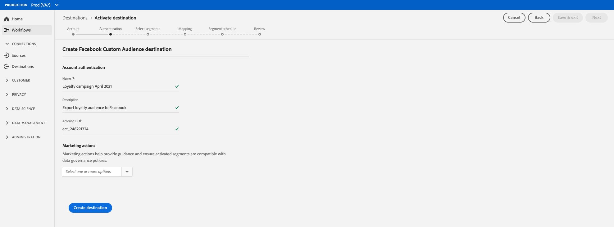

# 소셜 대상 {#social-network-destinations-workflow} 만들기

## 개요 {#overview}

이 자습서에서는 [!DNL Facebook]을(를) 예로 사용하지만 Adobe Experience Platform 워크플로우는 모든 소셜 대상에 대해 동일합니다.

## 소셜 대상 구성 - 비디오 연습 {#video}

아래 비디오에서는 Adobe Experience Platform에서 소셜 대상을 구성하고 세그먼트를 활성화하는 방법을 보여 줍니다. 이 단계는 다음 섹션에도 순차적으로 배치됩니다.

>[!VIDEO](https://video.tv.adobe.com/v/332599/?quality=12&learn=on&captions=eng)

## 소셜 대상 {#select-destination} 선택

**[!UICONTROL Destinations]** > **[!UICONTROL Catalog]**&#x200B;에서 **[!UICONTROL Social]** 범주로 스크롤합니다. 원하는 소셜 대상을 선택한 다음 **[!UICONTROL Configure]**&#x200B;을 선택합니다.

>[!NOTE]
>
>이 대상과의 연결이 이미 있는 경우 대상 카드에 **[!UICONTROL Activate]** 단추가 표시될 수 있습니다. **[!UICONTROL Activate]**&#x200B;과 **[!UICONTROL Configure]** 사이의 차이에 대한 자세한 내용은 대상 작업 공간 설명서의 [카탈로그](../../ui/destinations-workspace.md#catalog) 섹션을 참조하십시오.

## 계정 단계 {#account}

**계정** 단계에서 이전에 소셜 대상에 대한 연결을 설정한 경우 **[!UICONTROL Existing Account]**&#x200B;를 선택하고 기존 연결을 선택합니다. 또는 **[!UICONTROL New Account]**&#x200B;을 선택하여 소셜 대상에 대한 새 연결을 설정할 수 있습니다. **[!UICONTROL Connect to destination]**&#x200B;을 선택하면 선택한 소셜 대상으로 이동하여 로그인하고 Adobe Experience Cloud을 소셜 광고 계정에 연결합니다.

>[!NOTE]
>
>플랫폼은 인증 프로세스의 자격 증명 유효성 검사를 지원하고 소셜 계정 ID에 잘못된 자격 증명을 입력하는 경우 오류 메시지를 표시합니다. 이렇게 하면 자격 증명이 잘못된 작업 흐름을 완료하지 못합니다.

자격 증명이 확인되고 Adobe Experience Cloud이 소셜 네트워크에 연결되면 **[!UICONTROL Next]**&#x200B;을 선택하여 **[!UICONTROL Authentication]** 단계로 진행할 수 있습니다.

## 인증 단계 {#authentication}

**[!UICONTROL Authentication]** 단계에서 활성화 흐름에 [!UICONTROL Name] 및 [!UICONTROL Description]를 입력하고 소셜 네트워크 광고 계정의 [!UICONTROL Account ID]을 입력합니다.

>[!IMPORTANT]
>
> * [!DNL Facebook] 대상의 경우 **[!UICONTROL Account ID]**&#x200B;은 [!DNL Facebook Ad Account ID]입니다. 이 ID는 [!DNL Facebook Ads Manager]에서 찾을 수 있습니다. 아래 이미지에 표시된 대로 ID에 `act_`을(를) 접두사로 추가합니다.
> * [!DNL LinkedIn] 대상의 경우 **[!UICONTROL Account ID]**&#x200B;은 [!DNL LinkedIn Campaign Manager Account ID]입니다. 이 ID는 [!DNL LinkedIn Campaign Manager]에서 찾을 수 있습니다.

이 단계에서 이 대상에 적용할 **[!UICONTROL Marketing action]**&#x200B;을 선택할 수도 있습니다. 마케팅 작업은 데이터를 대상에 내보내려는 의도를 나타냅니다. Adobe 정의 마케팅 작업 중에서 선택하거나 자신의 마케팅 작업을 만들 수 있습니다. 마케팅 작업에 대한 자세한 내용은 [데이터 사용 정책 개요](../../../data-governance/policies/overview.md)를 참조하십시오.

위의 필드를 채운 후 **[!UICONTROL Create Destination]**&#x200B;을 선택합니다.

이제 대상이 만들어집니다. 나중에 세그먼트를 활성화하거나 **[!UICONTROL Next]**&#x200B;을 선택하여 워크플로우를 계속 진행하고 활성화할 세그먼트를 선택할 수 있습니다. **[!UICONTROL Save & Exit]** 이 두 경우 모두 워크플로우의 나머지 부분에 대해서는 다음 섹션 [소셜 네트워크에 세그먼트 활성화](#activate-segments)를 참조하십시오.

## 세그먼트를 소셜 네트워크에 활성화 {#activate-segments}

소셜 네트워크에 세그먼트를 활성화하는 방법에 대한 지침은 [대상에 데이터 활성화](../../ui/activate-destinations.md)를 참조하십시오.
