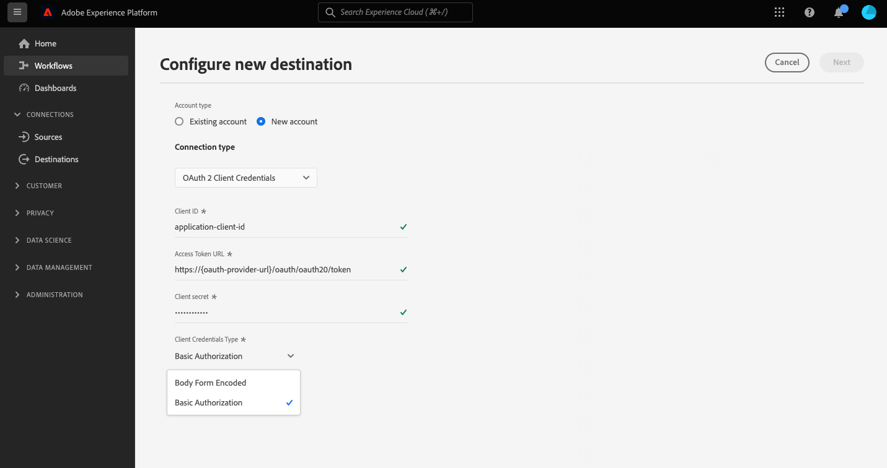

# HTTP API 연결

## 개요 {#overview}

>[!IMPORTANT]
>
> 이 대상은 다음 작업에만 사용할 수 있습니다 [Adobe Real-time Customer Data Platform Ultimate](https://helpx.adobe.com/legal/product-descriptions/real-time-customer-data-platform.html) 고객.

HTTP API 대상은 [!DNL Adobe Experience Platform] 프로필 데이터를 타사 HTTP 종단점으로 보내는 데 도움이 되는 스트리밍 대상입니다.

프로필 데이터를 HTTP 끝점으로 보내려면 먼저 해야 합니다 [대상에 연결](#connect-destination) in [!DNL Adobe Experience Platform].

## 사용 사례 {#use-cases}

HTTP API 대상을 사용하면 XDM 프로필 데이터 및 대상 세그먼트를 일반 HTTP 종단점으로 내보낼 수 있습니다. 여기에서 자체 분석을 실행하거나 Experience Platform 외부로 내보낸 프로필 데이터에 필요한 다른 작업을 수행할 수 있습니다.

HTTP 엔드포인트는 고객의 시스템 또는 타사 솔루션일 수 있습니다.

## 내보내기 유형 및 빈도 {#export-type-frequency}

대상 내보내기 유형 및 빈도에 대한 자세한 내용은 아래 표를 참조하십시오.

| 항목 | 유형 | 참고 |
---------|----------|---------|
| 내보내기 유형 | **[!UICONTROL 프로필 기반]** | 원하는 스키마 필드와 함께 세그먼트의 모든 구성원을 내보냅니다(예: 전자 메일 주소, 전화 번호, 성)을 [대상 활성화 워크플로우](../../ui/activate-segment-streaming-destinations.md#mapping). |
| 내보내기 빈도 | **[!UICONTROL 스트리밍]** | 스트리밍 대상은 &quot;항상 설정&quot; API 기반 연결입니다. 세그먼트 평가를 기반으로 Experience Platform에서 프로필이 업데이트되는 즉시 커넥터는 업데이트 다운스트림을 대상 플랫폼으로 보냅니다. 자세한 내용 [스트리밍 대상](/help/destinations/destination-types.md#streaming-destinations). |

{style="table-layout:auto"}

## 사전 요구 사항 {#prerequisites}

HTTP API 대상을 사용하여 Experience Platform에서 데이터를 내보내려면 다음 사전 요구 사항을 충족해야 합니다.

* REST API를 지원하는 HTTP 엔드포인트가 있어야 합니다.
* HTTP 종단점은 Experience Platform 프로필 스키마를 지원해야 합니다. HTTP API 대상에서 타사 페이로드 스키마에 대한 변환이 지원되지 않습니다. 자세한 내용은 [내보낸 데이터](#exported-data) Experience Platform 출력 스키마의 예를 보려면 섹션을 참조하십시오.
* HTTP 끝점은 헤더를 지원해야 합니다.

>[!TIP]
>
> 를 사용할 수도 있습니다 [Adobe Experience Platform Destination SDK](/help/destinations/destination-sdk/overview.md) 통합을 설정하고 Experience Platform 프로필 데이터를 HTTP 엔드포인트로 보냅니다.

## IP 주소 허용 목록에 추가하다 {#ip-address-allowlist}

고객의 보안 및 규정 준수 요구 사항을 충족하기 위해 Experience Platform은 HTTP API 대상에 대해 검색할 수 허용 목록에 추가하다 있는 정적 IP 목록을 제공합니다. 을(를) 참조하십시오. [스트리밍 대상을 위한 IP 주소 허용 목록](/help/destinations/catalog/streaming/ip-address-allow-list.md) 을 클릭하여 검색할 IP의 전체 목록을 허용 목록에 추가하다 확인합니다.

## 지원되는 인증 유형 {#supported-authentication-types}

HTTP API 대상은 HTTP 종단점에 대한 몇 가지 인증 유형을 지원합니다.

* 인증이 없는 HTTP 끝점
* 베어러 토큰 인증;
* [OAuth 2.0 클라이언트 자격 증명](https://www.oauth.com/oauth2-servers/access-tokens/client-credentials/) 본문 양식을 사용한 인증, [!DNL client ID], [!DNL client secret] 및 [!DNL grant type] 아래 예와 같이 HTTP 요청 본문에 를 사용하십시오.

```shell
curl --location --request POST '<YOUR_API_ENDPOINT>' \
--header 'Content-Type: application/x-www-form-urlencoded' \
--data-urlencode 'grant_type=client_credentials' \
--data-urlencode 'client_id=<CLIENT_ID>' \
--data-urlencode 'client_secret=<CLIENT_SECRET>'
```

* [OAuth 2.0 클라이언트 자격 증명](https://www.oauth.com/oauth2-servers/access-tokens/client-credentials/) 기본 권한 부여, URL이 인코딩된 인증 헤더 사용 [!DNL client ID] 및 [!DNL client secret].

```shell
curl --location --request POST 'https://some-api.com/token' \
--header 'Authorization: Basic base64(clientId:clientSecret)' \
--header 'Content-type: application/x-www-form-urlencoded; charset=UTF-8' \
--data-urlencode 'grant_type=client_credentials'
```

* [OAuth 2.0 암호 부여](https://www.oauth.com/oauth2-servers/access-tokens/password-grant/).

## 대상에 연결 {#connect-destination}

>[!IMPORTANT]
> 
>대상에 연결하려면 **[!UICONTROL 대상 관리]** [액세스 제어 권한](/help/access-control/home.md#permissions). 다음 문서를 참조하십시오. [액세스 제어 개요](/help/access-control/ui/overview.md) 또는 제품 관리자에게 문의하여 필요한 권한을 얻으십시오.

이 대상에 연결하려면 [대상 구성 자습서](../../ui/connect-destination.md). 이 대상에 연결할 때 다음 정보를 제공해야 합니다.

### 인증 정보 {#authentication-information}

>[!CONTEXTUALHELP]
>id="platform_destinations_connect_http_clientcredentialstype"
>title="클라이언트 자격 증명 유형"
>abstract="선택 **본문 양식 인코딩됨** 클라이언트 ID 및 클라이언트 암호를 요청 본문에 포함하려면 **기본 인증** 인증 헤더에 클라이언트 ID 및 클라이언트 암호를 포함하기 위해 설명서에서 예를 봅니다."

#### 베어러 토큰 인증 {#bearer-token-authentication}

을(를) 선택하는 경우 **[!UICONTROL 베어러 토큰]** HTTP 종단점에 연결할 인증 유형입니다. 아래 필드를 입력하고 을(를) 선택합니다 **[!UICONTROL 대상에 연결]**:


* **[!UICONTROL 베어러 토큰]**: bearer 토큰을 삽입하여 HTTP 위치를 인증합니다.

#### 인증 없음 {#no-authentication}

을(를) 선택하는 경우 **[!UICONTROL 없음]** HTTP 끝점에 연결할 인증 유형:


이 인증을 연 상태로 선택하는 경우 **[!UICONTROL 대상에 연결]** 엔드포인트에 대한 연결이 설정되었습니다.

#### OAuth 2 암호 인증 {#oauth-2-password-authentication}

을(를) 선택하는 경우 **[!UICONTROL OAuth 2 암호]** HTTP 종단점에 연결할 인증 유형입니다. 아래 필드를 입력하고 을(를) 선택합니다 **[!UICONTROL 대상에 연결]**:


* **[!UICONTROL 액세스 토큰 URL]**: 액세스 토큰을 발급하고, 원할 경우 토큰을 새로 고치는 URL입니다.
* **[!UICONTROL 클라이언트 ID]**: 다음 [!DNL client ID] 시스템이 Adobe Experience Platform에 할당하는 것입니다.
* **[!UICONTROL 클라이언트 암호]**: 다음 [!DNL client secret] 시스템이 Adobe Experience Platform에 할당하는 것입니다.
* **[!UICONTROL 사용자 이름]**: HTTP 종단점에 액세스할 사용자 이름입니다.
* **[!UICONTROL 암호]**: HTTP 종단점에 액세스하기 위한 암호입니다.

#### OAuth 2 클라이언트 자격 증명 인증 {#oauth-2-client-credentials-authentication}

을(를) 선택하는 경우 **[!UICONTROL OAuth 2 클라이언트 자격 증명]** HTTP 종단점에 연결할 인증 유형입니다. 아래 필드를 입력하고 을(를) 선택합니다 **[!UICONTROL 대상에 연결]**:



* **[!UICONTROL 액세스 토큰 URL]**: 액세스 토큰을 발급하고, 원할 경우 토큰을 새로 고치는 URL입니다.
* **[!UICONTROL 클라이언트 ID]**: 다음 [!DNL client ID] 시스템이 Adobe Experience Platform에 할당하는 것입니다.
* **[!UICONTROL 클라이언트 암호]**: 다음 [!DNL client secret] 시스템이 Adobe Experience Platform에 할당하는 것입니다.
* **[!UICONTROL 클라이언트 자격 증명 유형]**: 끝점에서 지원하는 OAuth2 클라이언트 자격 증명 부여 유형을 선택합니다.
   * **[!UICONTROL 본문 양식 인코딩됨]**: 이 경우 [!DNL client ID] 및 [!DNL client secret] 포함 *요청 본문에* 가 대상에 전송되었습니다. 예를 보려면 [지원되는 인증 유형](#supported-authentication-types) 섹션을 참조하십시오.
   * **[!UICONTROL 기본 인증]**: 이 경우 [!DNL client ID] 및 [!DNL client secret] 포함 *에서 `Authorization` 헤더* base64로 인코딩되어 대상으로 보낸 후 예를 보려면 [지원되는 인증 유형](#supported-authentication-types) 섹션을 참조하십시오.

### 대상 세부 사항 채우기 {#destination-details}

>[!CONTEXTUALHELP]
>id="platform_destinations_connect_http_headers"
>title="헤더"
>abstract="다음 형식을 사용하여 대상 호출에 포함할 사용자 지정 헤더를 입력합니다. `header1:value1,header2:value2,...headerN:valueN`"

>[!CONTEXTUALHELP]
>id="platform_destinations_connect_http_endpoint"
>title="HTTP 끝점"
>abstract="프로필 데이터를 보낼 HTTP 끝점의 URL입니다."

>[!CONTEXTUALHELP]
>id="platform_destinations_connect_http_includesegmentnames"
>title="세그먼트 이름 포함"
>abstract="데이터 내보내기에 내보낼 세그먼트의 이름이 포함되도록 하려면 전환합니다. 이 옵션을 선택한 상태로 데이터 내보내기 예제에 대한 설명서를 봅니다."

>[!CONTEXTUALHELP]
>id="platform_destinations_connect_http_includesegmenttimestamps"
>title="세그먼트 타임스탬프 포함"
>abstract="세그먼트가 생성 및 업데이트될 때 데이터 내보내기에 UNIX 타임스탬프와 세그먼트가 활성화 대상에 매핑될 때 UNIX 타임스탬프를 포함하려면 을 전환합니다. 이 옵션을 선택한 상태로 데이터 내보내기 예제에 대한 설명서를 봅니다."

>[!CONTEXTUALHELP]
>id="platform_destinations_connect_http_queryparameters"
>title="쿼리 매개 변수"
>abstract="선택적으로 HTTP 엔드포인트 URL에 쿼리 매개 변수를 추가할 수 있습니다. 다음과 같이 사용하는 쿼리 매개 변수의 형식을 지정합니다. `parameter1=value&parameter2=value`."

대상에 대한 세부 사항을 구성하려면 아래 필수 및 선택적 필드를 입력합니다. UI에서 필드 옆에 있는 별표는 필드가 필수임을 나타냅니다.


* **[!UICONTROL 이름]**: 나중에 이 대상을 인식할 이름을 입력하십시오.
* **[!UICONTROL 설명]**: 나중에 이 대상을 식별하는 데 도움이 되는 설명을 입력합니다.
* **[!UICONTROL 머리글]**: 다음 형식을 사용하여 대상 호출에 포함할 사용자 지정 헤더를 입력합니다. `header1:value1,header2:value2,...headerN:valueN`.
* **[!UICONTROL HTTP 끝점]**: 프로필 데이터를 보낼 HTTP 끝점의 URL입니다.
* **[!UICONTROL 쿼리 매개 변수]**: 선택적으로 HTTP 엔드포인트 URL에 쿼리 매개 변수를 추가할 수 있습니다. 다음과 같이 사용하는 쿼리 매개 변수의 형식을 지정합니다. `parameter1=value&parameter2=value`.
* **[!UICONTROL 세그먼트 이름 포함]**: 데이터 내보내기에 내보낼 세그먼트의 이름이 포함되도록 하려면 전환합니다. 이 옵션을 선택한 데이터 내보내기의 예는 를 참조하십시오. [내보낸 데이터](#exported-data) 섹션을 참조하십시오.
* **[!UICONTROL 세그먼트 타임스탬프 포함]**: 세그먼트가 생성 및 업데이트될 때 데이터 내보내기에 UNIX 타임스탬프와 세그먼트가 활성화 대상에 매핑될 때 UNIX 타임스탬프를 포함하려면 을 전환합니다. 이 옵션을 선택한 데이터 내보내기의 예는 를 참조하십시오. [내보낸 데이터](#exported-data) 섹션을 참조하십시오.

### 경고 활성화 {#enable-alerts}

경고를 활성화하여 대상으로 데이터 흐름 상태에 대한 알림을 받을 수 있습니다. 목록에서 경고를 선택하여 데이터 흐름 상태에 대한 알림을 수신합니다. 경고에 대한 자세한 내용은 [UI를 사용하여 대상 경고 구독](../../ui/alerts.md).

대상 연결에 대한 세부 정보 제공을 마치면 를 선택합니다 **[!UICONTROL 다음]**.

## 세그먼트를 이 대상에 활성화 {#activate}

>[!IMPORTANT]
> 
>데이터를 활성화하려면 **[!UICONTROL 대상 관리]**, **[!UICONTROL 대상 활성화]**, **[!UICONTROL 프로필 보기]**, 및 **[!UICONTROL 세그먼트 보기]** [액세스 제어 권한](/help/access-control/home.md#permissions). 다음 문서를 참조하십시오. [액세스 제어 개요](/help/access-control/ui/overview.md) 또는 제품 관리자에게 문의하여 필요한 권한을 얻으십시오.

자세한 내용은 [스트리밍 프로필 내보내기 대상으로 대상 데이터 활성화](../../ui/activate-streaming-profile-destinations.md) 대상 세그먼트를 이 대상으로 활성화하는 방법에 대한 지침입니다.

### 대상 속성 {#attributes}

에서 [[!UICONTROL 속성 선택]](../../ui/activate-streaming-profile-destinations.md#select-attributes) Adobe은 사용자 지정 페이지에서 고유 식별자를 선택할 것을 권장합니다 [조합 스키마](../../../profile/home.md#profile-fragments-and-union-schemas). 대상으로 내보낼 고유 식별자 및 기타 모든 XDM 필드를 선택합니다.

## 프로필 내보내기 동작 {#profile-export-behavior}

Experience Platform은 세그먼트 자격 또는 기타 중요한 이벤트 후에 프로필에 대한 관련 업데이트가 발생한 경우에만 데이터를 API 종단점으로 내보내도록 프로필 내보내기 동작을 HTTP API 대상에 최적화합니다. 프로필은 다음과 같은 상황에서 대상에 내보내집니다.

* 프로필 업데이트는 대상에 매핑된 세그먼트 중 하나 이상에 대한 세그먼트 멤버십 변경에 의해 결정됩니다. 예를 들어 프로필이 대상에 매핑된 세그먼트 중 하나에 적격이거나 대상에 매핑된 세그먼트 중 하나를 끝냈습니다.
* 프로필 업데이트는 [id 맵](/help/xdm/field-groups/profile/identitymap.md). 예를 들어 대상에 매핑된 세그먼트 중 하나에 대해 이미 자격이 있는 프로필이 ID 맵 속성에 새 ID를 추가했습니다.
* 프로필 업데이트는 대상에 매핑된 특성 중 하나 이상에 대한 특성 변경에 의해 결정됩니다. 예를 들어 매핑 단계에서 대상에 매핑된 속성 중 하나가 프로필에 추가됩니다.

위에 설명된 모든 경우 관련 업데이트가 발생한 프로필만 대상으로 내보내집니다. 예를 들어 대상 플로우에 매핑된 세그먼트에 100개의 멤버가 있고 5개의 새 프로필이 세그먼트에 대한 자격이 있는 경우 대상에 내보내기는 증분 결과이며 5개의 새 프로필만 포함합니다.

변경 사항이 있는 위치에 상관없이 모든 매핑된 속성이 프로필에 대해 내보내집니다. 따라서 위의 예에서 이러한 5개의 새 프로필에 대해 매핑된 속성은 속성 자체가 변경되지 않았더라도 내보내집니다.

### 데이터 내보내기와 내보내기에 포함된 내용을 결정하는 것은 무엇입니까? {#what-determines-export-what-is-included}

주어진 프로필에 대해 내보낸 데이터에 대해서는 의 두 가지 개념을 이해하는 것이 중요합니다 *http API 대상에 대한 데이터 내보내기를 결정하는 것은 무엇입니까?* 및 *내보내기에 포함된 데이터*.

| 대상 내보내기를 결정하는 것은 무엇입니까? | 대상 내보내기에 포함된 항목 |
|---------|----------|
| <ul><li>매핑된 속성 및 세그먼트는 대상 내보내기의 단서로 사용됩니다. 즉, 매핑된 세그먼트가 상태(null에서 실현됨 또는 실현됨/존재에서 종료로)를 변경하거나 매핑된 속성을 업데이트하면 대상 내보내기가 해제됩니다.</li><li>현재 ID를 HTTP API 대상에 매핑할 수 없으므로 주어진 프로필의 ID를 변경하면 대상 내보내기도 결정됩니다.</li><li>속성 변경은 속성이 동일한 값이든 간에 속성에 대한 업데이트로 정의됩니다. 즉, 값 자체가 변경되지 않았더라도 속성에 대한 덮어쓰기는 변경 사항으로 간주됩니다.</li></ul> | <ul><li>다음 `segmentMembership` 개체에는 활성화 데이터 플로우에 매핑된 세그먼트가 포함되어 있습니다. 이 세그먼트는 자격 또는 세그먼트 종료 이벤트 후 프로필 상태가 변경되었습니다. 자격이 있는 프로파일이 동일한 세그먼트에 속하는 경우 매핑되지 않은 다른 세그먼트는 대상 내보내기의 일부일 수 있습니다 [병합 정책](/help/profile/merge-policies/overview.md) 를 활성화 데이터 플로우에 매핑된 세그먼트로 사용합니다. </li><li>의 모든 ID `identityMap` 개체도 포함됩니다(Experience Platform은 현재 HTTP API 대상에서 ID 매핑을 지원하지 않습니다).</li><li>매핑된 속성만 대상 내보내기에 포함됩니다.</li></ul> |

{style="table-layout:fixed"}

예를 들어 이 데이터 흐름을 데이터 플로우에서 세 개의 세그먼트를 선택하고 네 개의 속성이 대상에 매핑되는 HTTP 대상으로 간주합니다.


대상에 대한 프로필 내보내기는 하나 또는 둘 중 하나에 대해 자격이 있는 프로필로 결정할 수 있습니다 *3개의 매핑된 세그먼트*. 그러나 데이터 내보내기에서 `segmentMembership` 개체(참조 [내보낸 데이터](#exported-data) 아래 섹션)에서 매핑되지 않은 다른 세그먼트가 표시될 수 있습니다. 해당 특정 프로필이 해당 세그먼트의 구성원이고, 해당 세그먼트가 내보내기를 트리거한 세그먼트와 동일한 병합 정책을 공유하는 경우 말입니다. 프로필이 **데로리안 차종 고객** 세그먼트이지만 **&quot;미래로 돌아가기&quot;를 시청했습니다** 영화 및 **SF 팬** 세그먼트를 만들면 이러한 다른 두 세그먼트가 `segmentMembership` 동일한 병합 정책을 공유하면 데이터 내보내기의 개체가 데이터 흐름에서 매핑되지 않더라도 데이터 내보내기의 개체입니다 **데로리안 차종 고객** 세그먼트.

프로필 속성 POV에서 위에 매핑된 4개의 속성에 대한 변경 사항이 대상 내보내기를 결정하며 프로필에 있는 4개의 매핑된 속성이 데이터 내보내기에 표시됩니다.

## 내역 데이터 채우기 {#historical-data-backfill}

기존 대상에 새 세그먼트를 추가하거나 새 대상을 만들고 세그먼트를 대상에 매핑하면 Experience Platform이 내역 세그먼트 자격 데이터를 대상으로 내보냅니다. 세그먼트에 적합한 프로필 *이전* 대상에 추가된 세그먼트는 약 1시간 이내에 대상에 내보내집니다.

## 내보낸 데이터 {#exported-data}

내보낸 [!DNL Experience Platform] 데이터가 [!DNL HTTP] JSON 형식으로 대상을 타깃팅합니다. 예를 들어 아래 내보내기에는 특정 세그먼트에 대해 자격이 있고 다른 두 세그먼트의 구성원이며 다른 세그먼트를 종료한 프로필이 포함되어 있습니다. 내보내기에는 프로필 속성 이름, 성, 생년월일 및 개인 이메일 주소도 포함됩니다. 이 프로필의 ID는 ECID 및 이메일입니다.

```json
{
  "person": {
    "birthDate": "YYYY-MM-DD",
    "name": {
      "firstName": "John",
      "lastName": "Doe"
    }
  },
  "personalEmail": {
    "address": "john.doe@acme.com"
  },
  "segmentMembership": {
   "ups":{
      "7841ba61-23c1-4bb3-a495-00d3g5fe1e93":{
         "lastQualificationTime":"2022-01-11T21:24:39Z",
         "status":"exited"
      },
      "59bd2fkd-3c48-4b18-bf56-4f5c5e6967ae":{
         "lastQualificationTime":"2022-01-02T23:37:33Z",
         "status":"existing"
      },
      "947c1c46-008d-40b0-92ec-3af86eaf41c1":{
         "lastQualificationTime":"2021-08-25T23:37:33Z",
         "status":"existing"
      },
      "5114d758-ce71-43ba-b53e-e2a91d67b67f":{
         "lastQualificationTime":"2022-01-11T23:37:33Z",
         "status":"realized"
      }
   }
},
  "identityMap": {
    "ecid": [
      {
        "id": "14575006536349286404619648085736425115"
      },
      {
        "id": "66478888669296734530114754794777368480"
      }
    ],
    "email_lc_sha256": [
      {
        "id": "655332b5fa2aea4498bf7a290cff017cb4"
      },
      {
        "id": "66baf76ef9de8b42df8903f00e0e3dc0b7"
      }
    ]
  }
}
```

아래는 의 연결 대상 플로우에서 선택한 UI 설정에 따라 내보낸 데이터의 추가 예입니다 **[!UICONTROL 세그먼트 이름 포함]** 및 **[!UICONTROL 세그먼트 타임스탬프 포함]** 옵션:

+++ 아래 데이터 내보내기 샘플에는 `segmentMembership` 섹션

```json
"segmentMembership": {
        "ups": {
          "5b998cb9-9488-4ec3-8d95-fa8338ced490": {
            "lastQualificationTime": "2019-04-15T02:41:50+0000",
            "status": "existing",
            "createdAt": 1648553325000,
            "updatedAt": 1648553330000,
            "mappingCreatedAt": 1649856570000,
            "mappingUpdatedAt": 1649856570000,
            "name": "First name equals John"
          }
        }
      }
```

+++

+++ 아래 데이터 내보내기 샘플에는 `segmentMembership` 섹션

```json
"segmentMembership": {
        "ups": {
          "5b998cb9-9488-4ec3-8d95-fa8338ced490": {
            "lastQualificationTime": "2019-04-15T02:41:50+0000",
            "status": "existing",
            "createdAt": 1648553325000,
            "updatedAt": 1648553330000,
            "mappingCreatedAt": 1649856570000,
            "mappingUpdatedAt": 1649856570000,
          }
        }
      }
```

+++

## 제한 및 다시 시도 정책 {#limits-retry-policy}

시간의 95% 동안 Experience Platform은 각 데이터 플로우에 대해 초당 10,000개 미만의 요청과 함께 성공적으로 전송된 메시지에 대해 10분 미만의 처리량 지연을 제공하기 위해 시도합니다.

HTTP API 대상에 대한 요청이 실패한 경우 Experience Platform은 실패한 요청을 저장하고 엔드포인트로 요청을 다시 두 번 전송합니다.