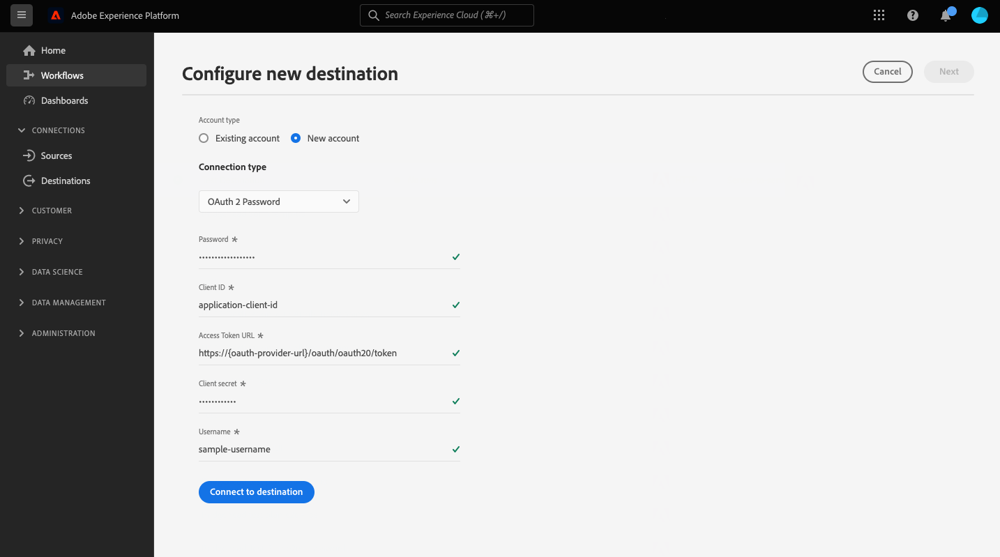

# HTTP API 연결

## 개요 {#overview}

>[!IMPORTANT]
>
> 이 대상은 [Adobe Real-Time Customer Data Platform Ultimate](https://helpx.adobe.com/legal/product-descriptions/real-time-customer-data-platform.html) 고객에게만 제공됩니다.

HTTP API 대상은 프로필 데이터를 타사 HTTP 끝점으로 보내는 데 도움이 되는 [!DNL Adobe Experience Platform] 스트리밍 대상입니다.

프로필 데이터를 HTTP 끝점으로 보내려면 먼저 [!DNL Adobe Experience Platform]에서 [대상에 연결](#connect-destination)해야 합니다.

## 사용 사례 {#use-cases}

HTTP API 대상을 사용하면 XDM 프로필 데이터 및 대상을 일반 HTTP 종단점으로 내보낼 수 있습니다. 여기에서 자체 분석을 실행하거나 Experience Platform에서 내보낸 프로필 데이터에 대해 필요할 수 있는 다른 작업을 수행할 수 있습니다.

HTTP 끝점은 고객의 자체 시스템 또는 타사 솔루션이 될 수 있습니다.

## 지원되는 대상자 {#supported-audiences}

이 섹션에서는 이 대상으로 내보낼 수 있는 대상자 유형을 설명합니다.

| 대상자 원본 | 지원됨 | 설명 |
|---------|----------|----------|
| [!DNL Segmentation Service] | ✓ | Experience Platform [세그먼테이션 서비스](../../../segmentation/home.md)를 통해 생성된 대상입니다. |
| 사용자 정의 업로드 | ✓ | CSV 파일에서 Experience Platform으로 대상 [가져옴](../../../segmentation/ui/audience-portal.md#import-audience). |

{style="table-layout:auto"}

## 내보내기 유형 및 빈도 {#export-type-frequency}

대상 내보내기 유형 및 빈도에 대한 자세한 내용은 아래 표를 참조하십시오.

| 항목 | 유형 | 참고 |
---------|----------|---------|
| 내보내기 유형 | **[!UICONTROL 프로필 기반]** | [대상 활성화 워크플로](../../ui/activate-segment-streaming-destinations.md#mapping)의 매핑 화면에서 선택한 대로 원하는 스키마 필드(예: 이메일 주소, 전화번호, 성)와 함께 세그먼트의 모든 구성원을 내보냅니다. |
| 내보내기 빈도 | **[!UICONTROL 스트리밍]** | 스트리밍 대상은 &quot;항상&quot; API 기반 연결입니다. 대상자 평가를 기반으로 Experience Platform에서 프로필이 업데이트되는 즉시 커넥터가 업데이트 다운스트림을 대상 플랫폼으로 전송합니다. [스트리밍 대상](/help/destinations/destination-types.md#streaming-destinations)에 대해 자세히 알아보세요. |

{style="table-layout:auto"}

## 전제 조건 {#prerequisites}

HTTP API 대상을 사용하여 Experience Platform에서 데이터를 내보내려면 다음 사전 요구 사항을 충족해야 합니다.

* REST API를 지원하는 HTTP 끝점이 있어야 합니다.
* HTTP 끝점은 Experience Platform 프로필 스키마를 지원해야 합니다. HTTP API 대상에서는 서드파티 페이로드 스키마로의 변환이 지원되지 않습니다. Experience Platform 출력 스키마의 예는 [내보낸 데이터](#exported-data) 섹션을 참조하십시오.
* HTTP 끝점은 헤더를 지원해야 합니다.

>[!TIP]
>
> [Adobe Experience Platform Destination SDK](/help/destinations/destination-sdk/overview.md)을(를) 사용하여 통합을 설정하고 Experience Platform 프로필 데이터를 HTTP 끝점으로 보낼 수도 있습니다.

## mTLS 프로토콜 지원 및 인증서 {#mtls-protocol-support}

[!DNL Mutual Transport Layer Security]&#x200B;([!DNL mTLS])을(를) 사용하여 HTTP API 대상 연결에 대한 아웃바운드 연결에서 보안을 강화할 수 있습니다.

[!DNL mTLS]은(는) 정보를 공유하는 두 당사자가 데이터를 공유하기 전에 자신의 소유자임을 확인하는 상호 인증을 위한 종단간 보안 방법입니다. [!DNL mTLS]은(는) [!DNL TLS]과(와) 비교하여 추가 단계를 포함합니다. 이 단계에서 서버는 클라이언트의 인증서를 요청하고 마지막에 확인합니다.

[!DNL HTTP API] 대상에 [!DNL mTLS]을(를) 사용하려면 [대상 세부 정보](#destination-details) 페이지에 입력한 서버 주소에 [!DNL TLS] 프로토콜이 비활성화되어 있어야 하며 [!DNL mTLS]만 활성화되어야 합니다. 끝점에서 [!DNL TLS] 1.2 프로토콜이 여전히 활성화되어 있으면 클라이언트 인증을 위한 인증서가 전송되지 않습니다. 즉, [!DNL HTTP API] 대상에 [!DNL mTLS]을(를) 사용하려면 &quot;받는 중&quot; 서버 끝점이 [!DNL mTLS] 전용 연결 끝점이어야 합니다.

### 인증서 다운로드 {#certificate}

[!DNL Common Name]&#x200B;(CN) 및 [!DNL Subject Alternative Names]&#x200B;(SAN)을 확인하여 추가 타사 유효성 검사를 수행하려면 아래 인증서를 다운로드할 수 있습니다.

* [HTTP API mTLS 공개 인증서](../../../landing/images/governance-privacy-security/encryption/destinations-public-certificate.zip)

MTLS 끝점에 GET 요청을 하여 공개 인증서를 안전하게 검색할 수도 있습니다. 자세한 내용은 [공개 인증서 끝점 설명서](../../../data-governance/mtls-api/public-certificate-endpoint.md)를 참조하세요.

## 허용 목록에 추가하다 IP 주소 {#ip-address-allowlist}

고객 보안 및 규정 준수 요구 사항을 충족하기 위해 Experience Platform에서는 HTTP API 대상에 대해 허용 목록에 추가하다할 수 있는 정적 IP 목록을 제공합니다. 허용 목록에 추가하다 허용 목록에 추가하다 스트리밍 대상에 대한 [IP 주소](/help/destinations/catalog/streaming/ip-address-allow-list.md)에서 IP에 대한 전체 목록을 참조하십시오.

## 지원되는 인증 유형 {#supported-authentication-types}

HTTP API 대상은 HTTP 끝점에 대한 여러 인증 유형을 지원합니다.

* 인증이 없는 HTTP 끝점;
* 전달자 토큰 인증;
* 아래 예와 같이 HTTP 요청의 본문에 [!DNL client ID], [!DNL client secret] 및 [!DNL grant type]이(가) 있는 본문 형식의 [OAuth 2.0 클라이언트 자격 증명](https://www.oauth.com/oauth2-servers/access-tokens/client-credentials/) 인증.

```shell
curl --location --request POST '<YOUR_API_ENDPOINT>' \
--header 'Content-Type: application/x-www-form-urlencoded' \
--data-urlencode 'grant_type=client_credentials' \
--data-urlencode 'client_id=<CLIENT_ID>' \
--data-urlencode 'client_secret=<CLIENT_SECRET>'
```

* URL로 인코딩된 [!DNL client ID] 및 [!DNL client secret]이(가) 포함된 권한 부여 헤더가 있는 기본 권한 부여가 있는 [OAuth 2.0 클라이언트 자격 증명](https://www.oauth.com/oauth2-servers/access-tokens/client-credentials/).

```shell
curl --location --request POST 'https://some-api.com/token' \
--header 'Authorization: Basic base64(clientId:clientSecret)' \
--header 'Content-type: application/x-www-form-urlencoded; charset=UTF-8' \
--data-urlencode 'grant_type=client_credentials'
```

* [OAuth 2.0 암호 부여](https://www.oauth.com/oauth2-servers/access-tokens/password-grant/).

## 대상에 연결 {#connect-destination}

>[!IMPORTANT]
> 
>대상에 연결하려면 **[!UICONTROL 대상 보기]** 및 **[!UICONTROL 대상 관리]** [액세스 제어 권한](/help/access-control/home.md#permissions)이 필요합니다. [액세스 제어 개요](/help/access-control/ui/overview.md)를 읽거나 제품 관리자에게 문의하여 필요한 권한을 받으십시오.

이 대상에 연결하려면 [대상 구성 자습서](../../ui/connect-destination.md)에 설명된 단계를 따르십시오. 이 대상에 연결할 때 다음 정보를 제공해야 합니다.

### 인증 정보 {#authentication-information}

>[!CONTEXTUALHELP]
>id="platform_destinations_connect_http_clientcredentialstype"
>title="클라이언트 자격 증명 유형"
>abstract="**인코딩된 본문 형식**&#x200B;을 선택하여 요청 본문에 클라이언트 ID와 클라이언트 암호를 포함하거나 **기본 인증**&#x200B;을 선택하여 인증 헤더에 클라이언트 ID와 클라이언트 암호를 포함할 수 있습니다. 설명서의 예 보기"

#### 전달자 토큰 인증 {#bearer-token-authentication}

HTTP 끝점에 연결할 **[!UICONTROL 전달자 토큰]** 인증 유형을 선택한 경우 아래 필드를 입력하고 **[!UICONTROL 대상에 연결]**&#x200B;을 선택하십시오.


* **[!UICONTROL 전달자 토큰]**: HTTP 위치에 인증할 전달자 토큰을 삽입합니다.

#### 인증 없음 {#no-authentication}

**[!UICONTROL 없음]** 인증 유형을 선택하여 HTTP 끝점에 연결하는 경우:


이 인증 열기를 선택하면 **[!UICONTROL 대상에 연결]**&#x200B;만 선택하면 끝점에 연결됩니다.

#### OAuth 2 암호 인증 {#oauth-2-password-authentication}

HTTP 끝점에 연결할 **[!UICONTROL OAuth 2 암호]** 인증 유형을 선택한 경우 아래 필드를 입력하고 **[!UICONTROL 대상에 연결]**&#x200B;을(를) 선택하십시오.



* **[!UICONTROL 액세스 토큰 URL]**: 액세스 토큰을 발행하고 선택적으로 토큰을 새로 고치는 사용자 측의 URL입니다.
* **[!UICONTROL 클라이언트 ID]**: 시스템이 Adobe Experience Platform에 할당하는 [!DNL client ID].
* **[!UICONTROL 클라이언트 암호]**: 시스템이 Adobe Experience Platform에 할당하는 [!DNL client secret].
* **[!UICONTROL 사용자 이름]**: HTTP 끝점에 액세스할 수 있는 사용자 이름입니다.
* **[!UICONTROL 암호]**: HTTP 끝점에 액세스하기 위한 암호입니다.

#### OAuth 2 클라이언트 자격 증명 인증 {#oauth-2-client-credentials-authentication}

HTTP 끝점에 연결할 **[!UICONTROL OAuth 2 클라이언트 자격 증명]** 인증 유형을 선택한 경우 아래 필드를 입력하고 **[!UICONTROL 대상에 연결]**&#x200B;을(를) 선택하십시오.


>[!WARNING]
> 
>[!UICONTROL OAuth 2 클라이언트 자격 증명] 인증을 사용할 때 [!UICONTROL 액세스 토큰 URL]에는 최대 하나의 쿼리 매개 변수를 사용할 수 있습니다. 쿼리 매개 변수가 더 많은 [!UICONTROL 액세스 토큰 URL]을(를) 추가하면 끝점에 연결할 때 문제가 발생할 수 있습니다.

* **[!UICONTROL 액세스 토큰 URL]**: 액세스 토큰을 발행하고 선택적으로 토큰을 새로 고치는 사용자 측의 URL입니다.
* **[!UICONTROL 클라이언트 ID]**: 시스템이 Adobe Experience Platform에 할당하는 [!DNL client ID].
* **[!UICONTROL 클라이언트 암호]**: 시스템이 Adobe Experience Platform에 할당하는 [!DNL client secret].
* **[!UICONTROL 클라이언트 자격 증명 유형]**: 끝점에서 지원하는 OAuth2 클라이언트 자격 증명 부여 유형을 선택하십시오.
   * **[!UICONTROL 본문이 인코딩됨]**: 이 경우 [!DNL client ID] 및 [!DNL client secret]은(는) 대상으로 전송된 *요청의 본문에 포함됨*. 예를들어 [지원되는 인증 형식](#supported-authentication-types) 섹션을 참조하십시오.
   * **[!UICONTROL 기본 권한 부여]**: 이 경우 [!DNL client ID] 및 [!DNL client secret]은(는) base64로 인코딩되어 대상으로 전송된 후 `Authorization` 헤더에 *포함됩니다*. 예를들어 [지원되는 인증 형식](#supported-authentication-types) 섹션을 참조하십시오.

### 대상 세부 정보 입력 {#destination-details}

>[!CONTEXTUALHELP]
>id="platform_destinations_connect_http_headers"
>title="헤더"
>abstract="이 형식(예: `header1:value1,header2:value2,...headerN:valueN`)에 따라 대상 호출에 포함될 사용자 정의 헤더를 입력합니다."

>[!CONTEXTUALHELP]
>id="platform_destinations_connect_http_endpoint"
>title="HTTP 엔드포인트"
>abstract="프로필 데이터를 전송할 HTTP 엔드포인트의 URL입니다."

>[!CONTEXTUALHELP]
>id="platform_destinations_connect_http_includesegmentnames"
>title="세그먼트 이름 포함"
>abstract="데이터 내보내기에 내보내는 대상자 이름이 포함되도록 하려면 전환하십시오. 이 옵션을 선택한 경우 데이터 내보내기 예는 설명서를 참조하십시오."

>[!CONTEXTUALHELP]
>id="platform_destinations_connect_http_includesegmenttimestamps"
>title="세그먼트 타임스탬프 포함"
>abstract="대상자를 생성 및 업데이트하거나 대상자를 대상에 매핑하여 활성화하는 경우 데이터 내보내기에 Unix 타임스탬프가 포함되도록 하려면 전환하십시오. 이 옵션을 선택한 경우 데이터 내보내기 예는 설명서를 참조하십시오."

>[!CONTEXTUALHELP]
>id="platform_destinations_connect_http_queryparameters"
>title="쿼리 매개변수"
>abstract="필요한 경우 쿼리 매개변수를 HTTP 엔드포인트의 URL에 추가할 수 있습니다. 사용하는 쿼리 매개변수 형식(예: `parameter1=value&parameter2=value`)을 지정합니다."

대상에 대한 세부 정보를 구성하려면 아래의 필수 및 선택 필드를 채우십시오. UI에서 필드 옆에 있는 별표는 필드가 필수임을 나타냅니다.


* **[!UICONTROL 이름]**: 나중에 이 대상을 인식할 이름을 입력하십시오.
* **[!UICONTROL 설명]**: 나중에 이 대상을 식별하는 데 도움이 되는 설명을 입력하십시오.
* **[!UICONTROL 헤더]**: 대상 호출에 포함할 사용자 지정 헤더를 다음 형식으로 입력하십시오. `header1:value1,header2:value2,...headerN:valueN`.
* **[!UICONTROL HTTP 끝점]**: 프로필 데이터를 보낼 HTTP 끝점의 URL.
* **[!UICONTROL 쿼리 매개 변수]**: HTTP 끝점 URL에 쿼리 매개 변수를 추가할 수 있습니다(선택 사항). 사용하는 쿼리 매개변수 형식(예: `parameter1=value&parameter2=value`)을 지정합니다.
* **[!UICONTROL 세그먼트 이름 포함]**: 내보내는 대상의 이름을 데이터 내보내기에 포함하려면 전환합니다. 이 옵션을 선택한 데이터 내보내기의 예는 아래의 [내보낸 데이터](#exported-data) 섹션을 참조하십시오.
* **[!UICONTROL 세그먼트 타임스탬프 포함]**: 대상을 만들고 업데이트할 때 데이터 내보내기에 UNIX 타임스탬프와 활성화를 위해 대상을 대상에 매핑할 때 UNIX 타임스탬프를 포함하도록 전환합니다. 이 옵션을 선택한 데이터 내보내기의 예는 아래의 [내보낸 데이터](#exported-data) 섹션을 참조하십시오.

### 경고 활성화 {#enable-alerts}

경고를 활성화하여 대상에 대한 데이터 흐름 상태에 대한 알림을 받을 수 있습니다. 목록에서 경고를 선택하여 데이터 흐름 상태에 대한 알림을 수신합니다. 경고에 대한 자세한 내용은 [UI를 사용하여 대상 경고 구독](../../ui/alerts.md)에 대한 안내서를 참조하십시오.

대상 연결에 대한 세부 정보를 모두 제공했으면 **[!UICONTROL 다음]**&#x200B;을 선택합니다.

## 이 대상으로 대상자 활성화 {#activate}

>[!IMPORTANT]
> 
>* 데이터를 활성화하려면 **[!UICONTROL 대상 보기]**, **[!UICONTROL 대상 활성화]**, **[!UICONTROL 프로필 보기]** 및 **[!UICONTROL 세그먼트 보기]** [액세스 제어 권한](/help/access-control/home.md#permissions)이 필요합니다. [액세스 제어 개요](/help/access-control/ui/overview.md)를 읽거나 제품 관리자에게 문의하여 필요한 권한을 받으십시오.
>* [동의 정책 평가](/help/data-governance/enforcement/auto-enforcement.md#consent-policy-evaluation)는 현재 HTTP API 대상으로 내보내기에서 지원되지 않습니다. [자세히 보기](/help/destinations/ui/activate-streaming-profile-destinations.md#consent-policy-evaluation).

이 대상으로 대상을 활성화하는 방법에 대한 지침은 [스트리밍 프로필 내보내기 대상으로 대상 데이터 활성화](../../ui/activate-streaming-profile-destinations.md)를 참조하십시오.

### 대상 속성 {#attributes}

Adobe [[!UICONTROL 특성 선택]](../../ui/activate-streaming-profile-destinations.md#select-attributes) 단계에서는 [유니온 스키마](../../../profile/home.md#profile-fragments-and-union-schemas)에서 고유 식별자를 선택하는 것이 좋습니다. 대상으로 내보낼 고유 식별자 및 기타 XDM 필드를 선택합니다.

## 프로필 내보내기 동작 {#profile-export-behavior}

Experience Platform은 대상 자격 또는 기타 중요한 이벤트 후에 프로필에 대한 관련 업데이트가 발생한 경우에만 데이터를 API 종단점으로 내보내도록 HTTP API 대상에 대한 프로필 내보내기 동작을 최적화합니다. 프로필은 다음과 같은 경우 대상으로 내보내집니다.

* 프로필 업데이트는 대상에 매핑된 대상자 중 하나 이상에 대한 대상자 멤버십 변경에 따라 결정되었습니다. 예를 들어 프로필이 대상에 매핑된 대상자 중 하나에 대해 자격이 있거나 대상에 매핑된 대상자 중 하나를 종료했습니다.
* 프로필 업데이트는 [ID 맵](/help/xdm/field-groups/profile/identitymap.md)의 변경 내용으로 결정됩니다. 예를 들어 대상에 매핑된 대상자 중 하나에 대해 이미 자격이 있는 프로필이 ID 맵 특성에 새 ID를 추가했습니다.
* 프로필 업데이트는 대상에 매핑된 속성 중 하나 이상에 대한 속성 변경에 의해 결정되었습니다. 예를 들어 매핑 단계에서 대상에 매핑된 속성 중 하나가 프로필에 추가됩니다.

위에서 설명한 모든 경우에 관련 업데이트가 발생한 프로필만 대상으로 내보냅니다. 예를 들어 대상 흐름에 매핑된 대상자에 100명의 멤버가 있고 5개의 새 프로필이 세그먼트에 해당하는 경우 대상으로 내보내는 것은 증분 것이며 5개의 새 프로필만 포함합니다.

변경 내용이 있는 위치에 관계없이 매핑된 모든 속성을 프로파일에 대해 내보냅니다. 따라서 위의 예에서는 속성 자체가 변경되지 않았더라도 이러한 5개의 새 프로필에 대해 매핑된 모든 속성을 내보냅니다.

### 데이터 내보내기를 결정하는 사항 및 내보내기에 포함되는 사항 {#what-determines-export-what-is-included}

지정된 프로필에 대해 내보내는 데이터와 관련하여 *HTTP API 대상으로 데이터 내보내기를 결정하는 요소* 및 *내보내기에 포함되는 데이터*&#x200B;의 두 가지 다른 개념을 이해하는 것이 중요합니다.

| 대상 내보내기를 결정하는 사항 | 대상 내보내기에 포함된 사항 |
|---------|----------|
| <ul><li>매핑된 속성 및 대상은 대상 내보내기에 대한 큐 역할을 합니다. 즉, 매핑된 대상이 상태를 `null`에서 `realized`(으)로 또는 `realized`에서 `exiting`(으)로 변경하거나 매핑된 특성을 업데이트하면 대상 내보내기가 시작됩니다.</li><li>ID는 현재 HTTP API 대상에 매핑될 수 없으므로 주어진 프로필의 ID를 변경하면 대상 내보내기도 결정됩니다.</li><li>속성에 대한 변경 사항은 동일한 값인지 여부에 관계없이 속성에 대한 모든 업데이트로 정의됩니다. 즉, 값 자체가 변경되지 않았더라도 속성에 대한 덮어쓰기를 변경 사항으로 간주합니다.</li></ul> | <ul><li>`segmentMembership` 개체에는 활성화 데이터 흐름에서 매핑된 대상이 포함되어 있습니다. 이 경우 자격 또는 대상 종료 이벤트 후 프로필의 상태가 변경되었습니다. 프로필이 자격을 갖춘 매핑되지 않은 다른 대상자가 활성화 데이터 흐름에서 매핑된 대상자와 동일한 [병합 정책](/help/profile/merge-policies/overview.md)에 속하는 경우 대상 내보내기의 일부가 될 수 있습니다. </li><li>`identityMap` 개체의 모든 ID도 포함됩니다. 현재 Experience Platform에서는 HTTP API 대상에서 ID 매핑을 지원하지 않습니다.</li><li>매핑된 속성만 대상 내보내기에 포함됩니다.</li></ul> |

{style="table-layout:fixed"}

예를 들어 데이터 흐름에서 3개의 대상이 선택되고 대상에 4개의 속성이 매핑되는 HTTP 대상에 대한 이 데이터 흐름을 고려해 보십시오.


대상으로의 프로필 내보내기는 *3개의 매핑된 세그먼트 중 하나를 사용하거나 종료하는 프로필에 의해 결정됩니다*. 그러나 데이터 내보내기에서 `segmentMembership` 개체(아래 [내보낸 데이터](#exported-data) 섹션 참조)에 매핑되지 않은 다른 대상이 나타날 수 있습니다. 해당 프로필이 해당 대상의 구성원이고 이러한 대상이 내보내기를 트리거한 대상과 동일한 병합 정책을 공유하는 경우. 프로필이 **Customer with DeLorean Cars** 세그먼트에 적합하지만 **Watched &quot;Back to the Future&quot;** movie 및 **Science fans** 세그먼트에 속하는 경우 **Customer with DeLorean Cars** 세그먼트와 동일한 병합 정책을 공유하는 경우 데이터 흐름에서 매핑되지 않았더라도 이 두 대상이 데이터 내보내기의 `segmentMembership` 개체에도 표시됩니다.

프로필 속성 관점에서 위에 매핑된 네 개의 속성에 대한 변경 사항은 대상 내보내기를 결정하고 프로필에 있는 네 개의 매핑된 속성 중 하나는 데이터 내보내기에 표시됩니다.

## 내역 데이터 채우기 {#historical-data-backfill}

기존 대상에 새 대상을 추가하거나 새 대상을 만들고 대상에 대상을 매핑하면 Experience Platform에서 이전 대상 자격 데이터를 대상으로 내보냅니다. 대상에 대상을 추가하기 전에 대상 *이전*&#x200B;에 대해 자격이 있는 프로필은 약 1시간 내에 대상으로 내보냅니다.

## 내보낸 데이터 {#exported-data}

내보낸 [!DNL Experience Platform] 데이터가 [!DNL HTTP] 대상에 JSON 형식으로 도착합니다. 예를 들어, 아래 내보내기에는 특정 세그먼트에 대해 자격이 있고 다른 두 세그먼트의 구성원이며 다른 세그먼트를 종료한 프로필이 포함됩니다. 내보내기에는 프로필 속성 이름, 성, 생년월일 및 개인 이메일 주소도 포함됩니다. 이 프로필의 ID는 ECID와 이메일입니다.

```json
{
  "person": {
    "birthDate": "YYYY-MM-DD",
    "name": {
      "firstName": "John",
      "lastName": "Doe"
    }
  },
  "personalEmail": {
    "address": "john.doe@acme.com"
  },
  "segmentMembership": {
   "ups":{
      "7841ba61-23c1-4bb3-a495-00d3g5fe1e93":{
         "lastQualificationTime":"2022-01-11T21:24:39Z",
         "status":"exited"
      },
      "59bd2fkd-3c48-4b18-bf56-4f5c5e6967ae":{
         "lastQualificationTime":"2022-01-02T23:37:33Z",
         "status":"realized"
      },
      "947c1c46-008d-40b0-92ec-3af86eaf41c1":{
         "lastQualificationTime":"2021-08-25T23:37:33Z",
         "status":"realized"
      },
      "5114d758-ce71-43ba-b53e-e2a91d67b67f":{
         "lastQualificationTime":"2022-01-11T23:37:33Z",
         "status":"realized"
      }
   }
},
  "identityMap": {
    "ecid": [
      {
        "id": "14575006536349286404619648085736425115"
      },
      {
        "id": "66478888669296734530114754794777368480"
      }
    ],
    "email_lc_sha256": [
      {
        "id": "655332b5fa2aea4498bf7a290cff017cb4"
      },
      {
        "id": "66baf76ef9de8b42df8903f00e0e3dc0b7"
      }
    ]
  }
}
```

다음은 **[!UICONTROL 세그먼트 이름 포함]** 및 **[!UICONTROL 세그먼트 타임스탬프 포함]** 옵션에 대한 연결 대상 흐름에서 선택한 UI 설정에 따라 내보낸 데이터의 추가 예입니다.

+++ 아래 데이터 내보내기 샘플에는 `segmentMembership` 섹션의 대상 이름이 포함되어 있습니다

```json
"segmentMembership": {
        "ups": {
          "5b998cb9-9488-4ec3-8d95-fa8338ced490": {
            "lastQualificationTime": "2019-04-15T02:41:50+0000",
            "status": "realized",
            "createdAt": 1648553325000,
            "updatedAt": 1648553330000,
            "mappingCreatedAt": 1649856570000,
            "mappingUpdatedAt": 1649856570000,
            "name": "First name equals John"
          }
        }
      }
```

+++

+++ 아래 데이터 내보내기 샘플에는 `segmentMembership` 섹션의 대상 타임스탬프가 포함되어 있습니다

```json
"segmentMembership": {
        "ups": {
          "5b998cb9-9488-4ec3-8d95-fa8338ced490": {
            "lastQualificationTime": "2019-04-15T02:41:50+0000",
            "status": "realized",
            "createdAt": 1648553325000,
            "updatedAt": 1648553330000,
            "mappingCreatedAt": 1649856570000,
            "mappingUpdatedAt": 1649856570000,
          }
        }
      }
```

+++

## 제한 및 재시도 정책 {#limits-retry-policy}

그 중 95% 동안 Experience Platform은 HTTP 대상에 대한 각 데이터 흐름의 초당 요청 수가 10,000개 미만인 상태로 성공적으로 전송된 메시지에 대해 10분 미만의 처리량 지연 시간을 제공하려고 합니다.

HTTP API 대상에 대한 요청이 실패한 경우 Experience Platform은 실패한 요청을 저장하고 두 번 재시도하여 요청을 엔드포인트에 전송합니다.