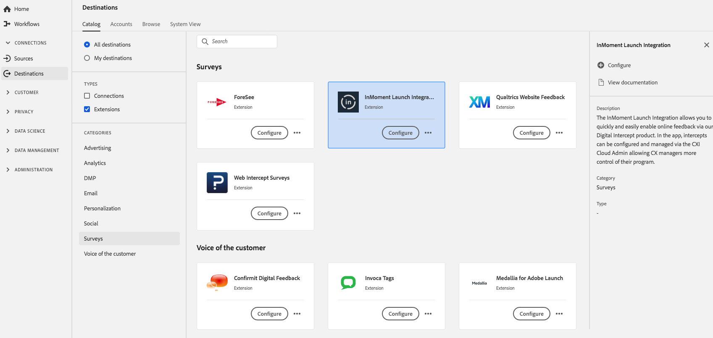

# [!DNL InMoment] 확장 {#inmoment-extension}

[!DNL InMoment] Launch Integration을 사용하면 디지털 출구 제품을 통해 온라인 피드백을 빠르고 쉽게 활성화할 수 있습니다. 앱에서는 CX 관리자가 프로그램의 제어권을 더 쉽게 제어할 수 있도록 CXI Cloud 관리자를 통해 가로채기를 구성 및 관리할 수 있습니다.

[!DNL InMoment] 는 Adobe Experience Platform의 설문 조사 확장입니다. 확장 기능에 대한 자세한 내용은 [Adobe Exchange](https://exchange.adobe.com/experiencecloud.details.100847.html)의 확장 페이지를 참조하십시오.

이 대상은 Adobe Experience Platform Launch 확장자입니다. 플랫폼 시작 확장 기능이 플랫폼에서 작동하는 방법에 대한 자세한 내용은 [Adobe Experience Platform Launch 확장 개요](../launch-extensions/overview.md)를 참조하십시오.

## 전제 조건 {#prerequisites}

이 확장 프로그램은 Platform을 구입한 모든 고객의 [!DNL Destinations] 카탈로그에서 사용할 수 있습니다.

이 확장을 사용하려면 Adobe Experience Platform Launch에 액세스해야 합니다. Platform Launch는 Adobe Experience Cloud 고객에게 부가 가치 기능으로 제공됩니다. Platform Launch에 대한 액세스 권한을 받으려면 조직 관리자에게 문의하여 Extension을 설치할 수 있도록 **[!UICONTROL manage_properties]** 권한을 요청하십시오.

## 확장 설치 {#install-extension}

[!DNL InMoment] 확장을 설치하려면:

[플랫폼 인터페이스](http://platform.adobe.com/)에서 **[!UICONTROL 대상]** > **[!UICONTROL 카탈로그]**&#x200B;로 이동합니다.

카탈로그에서 확장을 선택하거나 검색 막대를 사용합니다.

대상을 클릭하여 강조 표시한 다음 오른쪽 레일에서 **[!UICONTROL 구성]**&#x200B;을 선택합니다. **[!UICONTROL 구성]** 컨트롤이 회색으로 표시되면 **[!UICONTROL manage_properties]** 권한이 없습니다. [사전 요구 사항](#prerequisites)을 참조하십시오.

**[!UICONTROL 사용 가능한 플랫폼 시작 속성 선택]** 창에서 확장을 설치할 플랫폼 시작 속성을 선택합니다. 플랫폼 론치에서 새 속성을 만들 수도 있습니다. 속성은 규칙, 데이터 요소, 구성된 확장, 환경 및 라이브러리의 컬렉션입니다. 플랫폼 시작 설명서의 [속성 페이지 섹션](https://experienceleague.adobe.com/docs/launch/using/reference/admin/companies-and-properties.html#properties-page)에서 속성에 대해 알아봅니다.

이 워크플로우에서는 Platform Launch로 이동하여 설치를 완료합니다.

확장 구성 옵션에 대한 자세한 내용은 Adobe Exchange의 [Google Universal Analytics 확장 페이지](https://exchange.adobe.com/experiencecloud.details.100847.html)를 참조하십시오.

또한 [Adobe Experience Platform Launch 인터페이스](https://launch.adobe.com/)에 직접 확장을 설치할 수도 있습니다. 플랫폼 시작 설명서에서 [새 확장](https://experienceleague.adobe.com/docs/launch/using/reference/manage-resources/extensions/overview.html?lang=en#add-a-new-extension) 추가를 참조하십시오.

## 확장 {#how-to-use} 사용 방법

확장을 설치한 후에는 플랫폼 론치에서 바로 해당 확장 기능에 대한 규칙을 설정할 수 있습니다.

플랫폼 론치에서 특정 상황에서만 이벤트 데이터를 확장 대상에 전송하도록 설치된 확장의 규칙을 설정할 수 있습니다. 확장 규칙 설정에 대한 자세한 내용은 [규칙 설명서](https://experienceleague.adobe.com/docs/launch/using/reference/manage-resources/rules.html)를 참조하십시오.

## 확장 {#configure-upgrade-delete} 구성, 업그레이드 및 삭제

플랫폼 시작 인터페이스에서 확장을 구성, 업그레이드 및 삭제할 수 있습니다.

>[!TIP]
>
>확장이 이미 속성 중 하나에 설치되어 있는 경우 플랫폼 UI에 확장명에 대해 **[!UICONTROL 설치]**&#x200B;가 여전히 표시됩니다. [Install extension](#install-extension)에 설명된 대로 설치 작업 과정을 시작하고 Platform Launch에 도달하고 확장을 구성하거나 삭제합니다.

확장을 업그레이드하려면 플랫폼 시작 설명서의 [확장 업그레이드](https://experienceleague.adobe.com/docs/launch/using/reference/manage-resources/extensions/extension-upgrade.html)를 참조하십시오.
