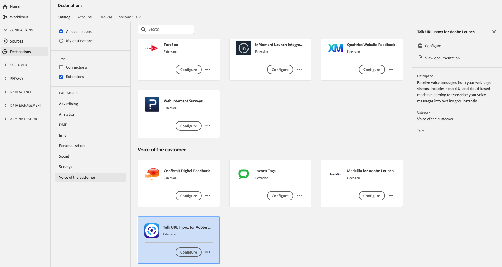

# [!DNL Talk URL Inbox] 확장 {#talk-url-extension}

웹 페이지 방문자로부터 음성 메시지를 받습니다. 음성 메시지를 즉시 텍스트 인사이트로 전달하는 호스팅된 UI 및 클라우드 기반 기계 학습을 포함합니다.

[!DNL Talk URL Inbox] 는 Adobe Experience Platform에서 고객 확장의 음성입니다. 확장 기능에 대한 자세한 내용은 [Adobe Exchange](https://exchange.adobe.com/experiencecloud.details.100583.html)에서 확장 페이지를 참조하십시오.

이 대상은 Adobe Experience Platform Launch 확장입니다. Platform에서 Platform launch 확장이 작동하는 방법에 대한 자세한 내용은 [Adobe Experience Platform Launch 확장 개요](../launch-extensions/overview.md)를 참조하십시오.

## 전제 조건 {#prerequisites}

이 확장은 Platform을 구입한 모든 고객의 [!DNL Destinations] 카탈로그에서 사용할 수 있습니다.

이 확장을 사용하려면 Adobe Experience Platform Launch에 액세스해야 합니다. platform launch은 부가가치 기능으로 포함되어 Adobe Experience Cloud 고객에게 제공됩니다. 확장을 설치할 수 있도록 **[!UICONTROL manage_properties]** 권한을 부여하도록 조직 관리자에게 문의 하여 Platform launch에 대한 액세스 권한을 받습니다.

## 확장 설치 {#install-extension}

[!DNL Talk URL Inbox] 확장을 설치하려면 다음을 수행하십시오.

[플랫폼 인터페이스](http://platform.adobe.com/)에서 **[!UICONTROL 대상]** > **[!UICONTROL 카탈로그]**&#x200B;로 이동합니다.

카탈로그에서 확장을 선택하거나 검색 창을 사용합니다.

대상을 클릭하여 강조 표시한 다음, 오른쪽 레일에서 **[!UICONTROL 구성]**&#x200B;을 선택합니다. **[!UICONTROL 구성]** 컨트롤이 회색으로 표시되면 **[!UICONTROL manage_properties]** 권한이 없는 것입니다. [사전 요구 사항](#prerequisites)을 참조하십시오.

**[!UICONTROL 사용 가능한 Platform launch 속성 선택]** 창에서 확장을 설치할 Platform launch 속성을 선택합니다. platform launch에서 새 속성을 만들 수도 있습니다. 속성은 규칙, 데이터 요소, 구성된 확장, 환경 및 라이브러리의 컬렉션입니다. platform launch 설명서의 [속성 페이지 섹션](../../../tags/ui/administration/companies-and-properties.md#properties-page)에 있는 속성에 대해 알아봅니다.

워크플로우를 통해 Platform launch으로 이동하여 설치를 완료합니다.

확장 구성 옵션 및 설치 지원에 대한 자세한 내용은 Exchange](https://exchange.adobe.com/experiencecloud.details.100583.html)Adobe의 [Talk URL 받은 편지함 페이지를 참조하십시오.

[Adobe Experience Platform Launch 인터페이스](https://launch.adobe.com/)에 직접 확장을 설치할 수도 있습니다. platform launch 설명서에서 [새 확장 추가](../../../tags/ui/managing-resources/extensions/overview.md#add-a-new-extension)를 참조하십시오.

## 확장 사용 방법 {#how-to-use}

확장을 설치하면 Platform launch에서 직접 확장에 대한 규칙 설정을 시작할 수 있습니다.

platform launch에서 설치된 확장에 대한 규칙을 설정하여 이벤트 데이터를 특정 경우에만 확장 대상에 보낼 수 있습니다. 확장의 규칙 설정에 대한 자세한 내용은 [규칙 설명서](../../../tags/ui/managing-resources/rules.md)를 참조하십시오.

## 확장 구성, 업그레이드 및 삭제 {#configure-upgrade-delete}

platform launch 인터페이스에서 확장을 구성, 업그레이드 및 삭제할 수 있습니다.

>[!TIP]
>
>확장이 속성 중 하나에 이미 설치되어 있는 경우 Platform UI에는 여전히 확장용 **[!UICONTROL Install]**&#x200B;이 표시됩니다. [Install extension](#install-extension)에 설명된 대로 설치 워크플로우를 시작하여 확장을 Platform launch 및 구성 또는 삭제합니다.

확장을 업그레이드하려면 Platform launch 설명서에서 [확장 업그레이드](../../../tags/ui/managing-resources/extensions/extension-upgrade.md)를 참조하십시오.
