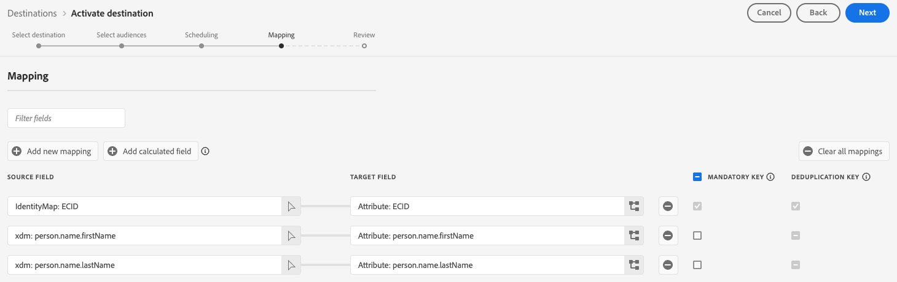

# Snowflake 배치 연결 {#snowflake-destination}

>[!AVAILABILITY]
>
>이 대상 커넥터는 제한된 가용성이며 [VA7 지역](/help/landing/multi-cloud.md#azure-regions)에 프로비저닝된 Real-Time CDP Ultimate 고객만 사용할 수 있습니다.

## 개요 {#overview}

이 대상을 사용하여 대상 데이터를 Snowflake 계정의 동적 표로 보냅니다. 동적 테이블은 물리적 데이터 사본 없이도 데이터에 액세스할 수 있습니다.

Snowflake 대상의 작동 방식과 Adobe과 Snowflake 간에 데이터가 전송되는 방법을 이해하려면 다음 섹션을 참조하십시오.

### Snowflake 데이터 공유 작동 방식 {#data-sharing}

이 대상은 [!DNL Snowflake] 데이터 공유를 사용합니다. 즉, 물리적으로 내보낸 데이터나 자신의 Snowflake 인스턴스로 전송된 데이터가 없습니다. 대신 Adobe은 Adobe의 Snowflake 환경 내에서 호스팅되는 라이브 테이블에 대한 읽기 전용 액세스 권한을 부여합니다. Snowflake 계정에서 직접 이 공유 테이블을 쿼리할 수 있지만 테이블을 소유하지는 않으며 지정된 보존 기간 이후에 수정하거나 유지할 수 없습니다. Adobe은 공유 테이블의 수명 주기와 구조를 완전히 관리합니다.

Adobe에서 Snowflake 계정으로의 데이터 흐름을 처음 설정한 후에는 Adobe의 비공개 목록을 수락하라는 메시지가 표시됩니다.

### 데이터 유지 및 TTL(Time-to-Live) {#ttl}

이 통합을 통해 공유되는 모든 데이터의 고정 TTL(Time-to-Live)은 7일입니다. 마지막 내보내기 후 7일이 지나면 데이터 흐름이 여전히 활성 상태인지 여부에 관계없이 다이내믹 테이블이 자동으로 만료되어 액세스할 수 없게 됩니다. 7일 이상 데이터를 유지해야 하는 경우 TTL이 만료되기 전에 콘텐츠를 자체 Snowflake 인스턴스에서 소유한 테이블로 복사해야 합니다.

>[!IMPORTANT]
>
>Experience Platform에서 데이터 흐름을 삭제하면 동적 테이블이 Snowflake 계정에서 사라집니다.

### 대상자 업데이트 동작 {#audience-update-behavior}

대상을 [일괄 처리 모드](../../../segmentation/methods/batch-segmentation.md)에서 평가하면 공유 테이블의 데이터가 24시간마다 새로 고쳐집니다. 즉, 대상 멤버십의 변경 사항과 이러한 변경 사항이 공유 테이블에 반영되는 시간 사이에 최대 24시간이 지연될 수 있습니다.

### 일괄 데이터 공유 논리 {#batch-data-sharing}

대상에 대해 데이터 흐름이 처음 실행되면 다시 채우기를 수행하고 현재 자격이 있는 모든 프로필을 공유합니다. 이 초기 채우기 이후 대상은 전체 대상 멤버십에 대한 정기적인 스냅샷을 제공합니다. 각 스냅샷은 공유 테이블의 이전 데이터를 대체하므로 내역 데이터 없이 항상 대상에 대한 최신 전체 보기를 볼 수 있습니다.

## 스트리밍과 일괄 데이터 공유 {#batch-vs-streaming}

Experience Platform은 두 가지 유형의 Snowflake 대상을 제공합니다. [Snowflake 스트리밍](snowflake.md) 및 [Snowflake 일괄 처리](snowflake-batch.md).

두 대상 모두 Snowflake의 데이터에 복사 없는 방식으로 액세스할 수 있지만 각 커넥터의 사용 사례 측면에서 권장되는 몇 가지 모범 사례가 있습니다.

아래 표는 각 데이터 공유 방법이 가장 적합한 시나리오를 요약하여 사용할 커넥터를 결정하는 데 도움이 됩니다.

|  | 필요한 경우 [Snowflake 일괄 처리](snowflake-batch.md) 선택 | 필요할 때 [Snowflake 스트리밍](snowflake.md)을 선택하세요. |
|--------|-------------------|----------------------|
| **업데이트 주기** | 주기적 스냅샷 | 실시간 연속 업데이트 |
| **데이터 프레젠테이션** | 이전 데이터를 대체하는 전체 대상 스냅샷 | 프로필 변경 사항을 기반으로 한 증분 업데이트 |
| **사용 사례 포커스** | 지연 시간이 중요하지 않은 분석/ML 워크로드 | 실시간 업데이트가 필요한 즉각적인 조치 시나리오 |
| **데이터 관리** | 항상 최신 전체 스냅샷 보기 | 대상자 멤버십 변경 사항을 기반으로 한 증분 업데이트 |
| **예제 시나리오** | 비즈니스 보고, 데이터 분석, ML 모델 교육 | 마케팅 캠페인 억제, 실시간 개인화 |

스트리밍 데이터 공유에 대한 자세한 내용은 [Snowflake 스트리밍 연결](snowflake.md) 설명서를 참조하십시오.

## 사용 사례 {#use-cases}

일괄 데이터 공유는 대상자에 대한 전체 스냅숏이 필요하고 실시간 업데이트가 필요하지 않은 시나리오에 이상적입니다. 예를 들면 다음과 같습니다.

* **분석 작업 부하**: 대상 멤버십을 완전히 확인해야 하는 데이터 분석, 보고 또는 비즈니스 인텔리전스 작업을 수행할 때
* **머신 러닝 워크플로**: ML 모델 교육 또는 전체 대상 스냅숏의 이점을 제공하는 예측 분석 실행
* **데이터 웨어하우징**: 자신의 Snowflake 인스턴스에서 대상 데이터의 현재 복사본을 유지 관리해야 하는 경우
* **정기 보고**: 이전 변경 내용 추적 없이 최신 대상 상태가 필요한 일반 비즈니스 보고의 경우
* **ETL 프로세스**: 대상 데이터를 배치로 변환하거나 처리해야 하는 경우

일괄 데이터 공유는 전체 스냅샷을 제공하여 데이터 관리를 간소화하므로 증분 업데이트나 변경 사항 병합을 수동으로 관리할 필요가 없습니다.

## 전제 조건 {#prerequisites}

Snowflake 연결을 구성하기 전에 다음 전제 조건을 충족하는지 확인하십시오.

* [!DNL Snowflake] 계정에 액세스할 수 있습니다.
* Snowflake 계정이 비공개 목록을 구독하고 있습니다. 귀하 또는 Snowflake에 대한 계정 관리자 권한이 있는 회사에서 이 구성을 할 수 있습니다.

필요한 권한에 대한 자세한 내용은 [[!DNL Snowflake] 설명서](https://docs.snowflake.com/en/collaboration/consumer-listings-access#access-a-private-listing)를 참조하십시오.

## 지원되는 대상자 {#supported-audiences}

이 섹션에서는 이 대상으로 내보낼 수 있는 대상자 유형을 설명합니다. 아래 두 표는 이 커넥터가 지원하는 대상을 _대상 원본_ 및 _대상에 포함된 프로필 유형_&#x200B;별로 나타냅니다.

| 대상자 원본 | 지원됨 | 설명 |
|---------|----------|----------|
| [!DNL Segmentation Service] | ✓ | Experience Platform [세그먼테이션 서비스](../../../segmentation/home.md)를 통해 생성된 대상입니다. |
| 기타 모든 대상 원본 | ✓ | 이 범주에는 [!DNL Segmentation Service]을(를) 통해 생성된 대상 외부의 모든 대상 출처가 포함됩니다. [다양한 대상 원본](/help/segmentation/ui/audience-portal.md#customize)에 대해 읽어 보십시오. 예를 들면 다음과 같습니다. <ul><li> CSV 파일에서 Experience Platform으로 사용자 지정 업로드 대상 [가져옴](../../../segmentation/ui/audience-portal.md#import-audience),</li><li> 유사 대상, </li><li> 페더레이션 대상, </li><li> Adobe Journey Optimizer과 같은 다른 Experience Platform 앱에서 생성된 대상자 </li><li> 등. </li></ul> |

{style="table-layout:auto"}

대상 데이터 유형별 지원되는 대상:

| 대상 데이터 유형 | 지원됨 | 설명 | 사용 사례 |
|--------------------|-----------|-------------|-----------|
| [사람 대상](/help/segmentation/types/people-audiences.md) | ✓ | 고객 프로필을 기반으로 마케팅 캠페인을 위해 특정 사용자 그룹을 타깃팅할 수 있습니다. | 빈번한 구매자, 장바구니 포기 |
| [계정 대상자](/help/segmentation/types/account-audiences.md) | 아니요 | 계정 기반 마케팅 전략을 위해 특정 조직 내의 개인을 타깃팅합니다. | B2B 마케팅 |
| [잠재 고객](/help/segmentation/types/prospect-audiences.md) | 아니요 | 아직 고객이 아니지만 타겟 대상자와 특성을 공유하는 개인을 타겟팅합니다. | 타사 데이터를 이용한 잠재 고객 확보 |
| [데이터 집합 내보내기](/help/catalog/datasets/overview.md) | 아니요 | Adobe Experience Platform 데이터 레이크에 저장된 구조화된 데이터의 컬렉션입니다. | 보고, 데이터 과학 워크플로 |

{style="table-layout:auto"}

## 내보내기 유형 및 빈도 {#export-type-frequency}

대상 내보내기 유형 및 빈도에 대한 자세한 내용은 아래 표를 참조하십시오.

| 항목 | 유형 | 참고 |
|---------|----------|---------|
| 내보내기 유형 | **[!UICONTROL Audience export]** | [!DNL Snowflake] 대상에 사용된 식별자(이름, 전화번호 또는 기타)를 사용하여 대상자의 모든 구성원을 내보내고 있습니다. |
| 내보내기 빈도 | **[!UICONTROL Batch]** | 이 대상은 Snowflake 데이터 공유를 통해 전체 대상 멤버십에 대한 정기적인 스냅샷을 제공합니다. 각 스냅샷은 이전 데이터를 대체하므로 항상 대상에 대한 최신 전체 보기를 확인할 수 있습니다. |

{style="table-layout:auto"}

## 대상에 연결 {#connect}

>[!IMPORTANT]
> 
>대상에 연결하려면 **[!UICONTROL View Destinations]** 및 **[!UICONTROL Manage Destinations]** [액세스 제어 권한](/help/access-control/home.md#permissions)이 필요합니다. [액세스 제어 개요](/help/access-control/ui/overview.md)를 읽거나 제품 관리자에게 문의하여 필요한 권한을 받으십시오.

이 대상에 연결하려면 [대상 구성 자습서](../../ui/connect-destination.md)에 설명된 단계를 따르십시오. 대상 구성 워크플로에서 아래 두 섹션에 나열된 필드를 채웁니다.

### 대상으로 인증 {#authenticate}

대상에 인증하려면 **[!UICONTROL Connect to destination]**&#x200B;을(를) 선택하고 계정 이름과 필요한 경우 계정 설명을 제공하십시오.

### 대상 세부 정보 입력 {#destination-details}

>[!CONTEXTUALHELP]
>id="platform_destinations_snowflake_batch_accountID"
>title="Snowflake 계정 ID 입력"
>abstract="계정이 조직에 연결되어 있는 경우 다음 형식을 사용합니다. `OrganizationName.AccountName`   계정이 조직에 연결되어 있지 않은 경우 다음 형식을 사용합니다. `AccountName`"

대상에 대한 세부 정보를 구성하려면 아래의 필수 및 선택 필드를 채우십시오. UI에서 필드 옆에 있는 별표는 필드가 필수임을 나타냅니다.

* **[!UICONTROL Name]**: 나중에 이 대상을 인식할 수 있는 이름입니다.
* **[!UICONTROL Description]**: 나중에 이 대상을 식별하는 데 도움이 되는 설명입니다.
* **[!UICONTROL Snowflake Account ID]**: Snowflake 계정 ID입니다. 계정이 조직에 연결되어 있는지 여부에 따라 다음 계정 ID 형식을 사용하십시오.
   * 계정이 조직에 연결되어 있는 경우: `OrganizationName.AccountName`.
   * 계정이 조직에 연결되어 있지 않은 경우: `AccountName`.
* **[!UICONTROL Account acknowledgment]**: Snowflake 계정 ID 승인을 전환하여 계정 ID가 올바르고 사용자가 소유하고 있는지 확인합니다.

>[!IMPORTANT]
>
> 대상 이름 및 Experience Platform 샌드박스 이름에 사용된 특수 문자는 Snowflake에서 밑줄(`_`)로 자동 변환됩니다. 혼동을 피하기 위해 대상 및 샌드박스 이름에 특수 문자를 사용하지 마십시오.

### 경고 활성화 {#enable-alerts}

경고를 활성화하여 대상에 대한 데이터 흐름 상태에 대한 알림을 받을 수 있습니다. 목록에서 경고를 선택하여 데이터 흐름 상태에 대한 알림을 수신합니다. 경고에 대한 자세한 내용은 [UI를 사용하여 대상 경고 구독](../../ui/alerts.md)에 대한 안내서를 참조하십시오.

대상 연결에 대한 세부 정보를 제공했으면 **[!UICONTROL Next]**&#x200B;을(를) 선택합니다.

## 이 대상으로 대상자 활성화 {#activate}

>[!IMPORTANT]
> 
>* 데이터를 활성화하려면 **[!UICONTROL View Destinations]**, **[!UICONTROL Activate Destinations]**, **[!UICONTROL View Profiles]** 및 **[!UICONTROL View Segments]** [액세스 제어 권한](/help/access-control/home.md#permissions)이 필요합니다. [액세스 제어 개요](/help/access-control/ui/overview.md)를 읽거나 제품 관리자에게 문의하여 필요한 권한을 받으십시오.
>* *ID*&#x200B;을(를) 내보내려면 **[!UICONTROL View Identity Graph]** [액세스 제어 권한](/help/access-control/home.md#permissions)이 필요합니다.   {width="100" zoomable="yes"}

이 대상으로 대상을 활성화하는 방법에 대한 지침은 [대상 데이터를 일괄 프로필 내보내기 대상으로 활성화](/help/destinations/ui/activate-batch-profile-destinations.md)를 참조하십시오.

### 속성 매핑 {#map}

ID 및 프로필 속성을 이 대상으로 내보낼 수 있습니다.

[계산된 필드 컨트롤](../../ui/data-transformations-calculated-fields.md)을 사용하여 배열에서 내보내고 작업을 수행할 수 있습니다.

대상 특성은 **[!UICONTROL Attribute name]** 필드에 입력한 특성 이름을 사용하여 Snowflake에서 자동으로 만들어집니다.

## 내보낸 데이터/데이터 내보내기 유효성 검사 {#exported-data}

데이터는 동적 테이블을 통해 Snowflake 계정에 스테이징됩니다. Snowflake 계정을 확인하여 데이터가 올바르게 내보내졌는지 확인하십시오.

### 데이터 구조 {#data-structure}

동적 테이블에는 다음 열이 포함되어 있습니다.

* **TS**: 각 행이 마지막으로 업데이트된 시기를 나타내는 타임스탬프 열입니다.
* **매핑 특성**: 활성화 워크플로 중에 선택한 모든 매핑 특성은 Snowflake에서 열 헤더로 표시됩니다
* **대상 멤버십**: 데이터 흐름에 매핑된 모든 대상에 대한 멤버십은 해당 셀의 `active` 항목을 통해 표시됩니다

## 알려진 제한 사항 {#known-limitations}

### 기본 병합 정책 제한 {#default-merge-policy-restriction}

현재 기본 병합 정책에 매핑된 대상자만 내보낼 수 있습니다.

### 지역 가용성 {#regional-availability}

[!DNL Snowflake] 일괄 처리 대상은 현재 Experience Platform VA7 지역에서 프로비저닝된 Real-Time CDP 고객만 사용할 수 있습니다.

## 데이터 사용 및 관리 {#data-usage-governance}

데이터를 처리할 때 모든 [!DNL Adobe Experience Platform] 대상이 데이터 사용 정책을 준수합니다. [!DNL Adobe Experience Platform]에서 데이터 거버넌스를 적용하는 방법에 대한 자세한 내용은 [데이터 거버넌스 개요](/help/data-governance/home.md)를 참조하십시오.
