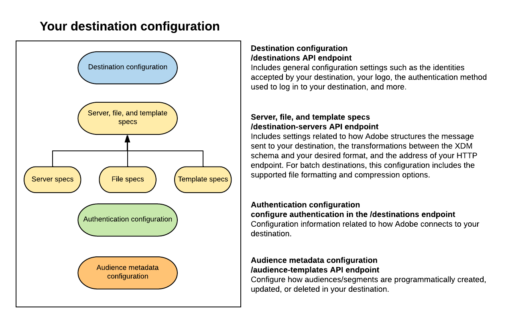

# Destination SDK의 구성 옵션

## 개요 {#overview}

Adobe Experience Platform의 대상 서비스는 대상 기능을 빌드하는 여러 구성 요소에 대한 구성 끝점을 사용합니다. 이러한 구성 요소를 결합하면 Experience Platform이 대상 플랫폼에 연결하고, 사용자 지정 메시지를 보내고, 사용자 지정 파일을 내보내고, 디지털 에코시스템에서 프로필 데이터를 활성화할 수 있습니다. Adobe Experience Platform Destination SDK에 사용되는 구성은 다음과 같습니다.

* **대상 구성**: 대상에 대한 기본 정보가 포함되어 있습니다. 이 구성에는 대상이 지원할 수 있는 ID 유형, 내보낸 파일의 원하는 형식(파일 기반 대상의 경우) 및 Adobe Experience Platform 사용자 인터페이스의 대상 카드에 대한 다양한 UI 속성이 포함됩니다.
* **서버, 파일 및 템플릿 사양**: 서버 사양 및 페이로드를 대상에 전달하기 위해 Adobe에서 사용하는 템플릿에 대한 정보를 함께 연결합니다. 파일 기반 대상의 경우 이 구성에는 대상에 대해 지원되는 파일 형식 및 압축 형식도 포함됩니다.
   * **서버 사양**: 데이터가 전송되는 저장소 위치 또는 HTTP 끝점에 대한 정보가 포함된 구성 템플릿입니다.&quot;
   * **파일 사양**: 배치 대상의 파일 형식 지정 및 압축 옵션이 포함된 구성 템플릿입니다.
   * **템플릿 사양**: 이 템플릿에서 XDM 스키마와 플랫폼에서 지원하는 형식 간에 프로필 속성 필드를 변환하는 방법을 정의할 수 있습니다. 지원되는 템플릿 언어, 메시지 형식 및 플랫폼과의 통합을 설정하는 데 필요한 Adobe에 대한 자세한 내용은 다음을 참조하십시오. [메시지 포맷](./message-format.md).
* **인증 구성**: 이러한 설정은 Adobe Experience Platform 사용자가 대상에 연결하는 방법을 정의합니다.
* **대상 메타데이터 구성**: 이 구성 끝점을 사용하면 대상에서 대상/세그먼트를 프로그래밍 방식으로 생성, 업데이트 또는 삭제하는 방법을 구성할 수 있습니다. 배치 대상의 경우, 파일이 대상에 성공적으로 전달될 때마다 알림을 설정할 수 있습니다.

## 관련 링크 {#related-links}

아래 페이지에서는 Destination SDK에서 사용할 수 있는 기능 및 구성 옵션과 수행할 수 있는 해당 API 작업에 대해 자세히 설명합니다.

| 기능 설명(스트리밍 대상) | 기능 설명(배치 대상) | API 참조 |
|--- |--- |--- |
| [대상 구성 옵션](./destination-configuration.md) | [파일 기반 대상 구성 옵션](/help/destinations/destination-sdk/file-based-destination-configuration.md) | [대상 API 엔드포인트 작업](./destination-configuration-api.md) |
| [서버 및 템플릿 사양](./server-and-template-configuration.md) | [서버 및 파일 구성 사양](/help/destinations/destination-sdk/server-and-file-configuration.md) | [대상 서버 API 끝점 작업](./destination-server-api.md) |
| [인증 구성](./authentication-configuration.md) | 스트리밍 대상과 동일합니다. | 다음을 통해 대상에 대한 인증 정보를 구성할 수 있습니다. `customerAuthenticationConfigurations` 매개 변수 `/destinations` 엔드포인트. 추가 정보 [스트리밍](/help/destinations/destination-sdk/destination-configuration.md#customer-authentication-configurations) 및 [일괄 처리](/help/destinations/destination-sdk/file-based-destination-configuration.md#customer-authentication-configurations) 대상. |
| [대상자 메타데이터 관리](./audience-metadata-management.md) | 스트리밍과 동일합니다. 다음을 참조하십시오 [파일 기반 예제](/help/destinations/destination-sdk/audience-metadata-management.md#example-file-based) 배치 대상 컨텍스트에서 대상 메타데이터를 사용할 수 있는 방법을 이해합니다. | [대상 메타데이터 끝점 API 작업](./audience-metadata-api.md) |
| [OAuth 2 구성](./oauth2-authentication.md) | 스트리밍 대상과 동일 | 를 사용하여 구성 `customerAuthenticationConfigurations` 의 매개 변수 [/destinations API 끝점](./destination-configuration-api.md). |
| [메시지 포맷](./message-format.md) | - | - |
| [스트리밍 대상을 위한 테스트 도구](./test-destination.md) | [파일 기반 대상용 테스트 도구](/help/destinations/destination-sdk/file-based-destination-testing-overview.md) | [대상 테스트 API 작업](./destination-testing-api.md) |
| [대상 게시](./configure-destination-instructions.md#publish-destination) | 스트리밍 대상과 동일 | [대상 게시 API 작업](./destination-publish-api.md) |

{style="table-layout:auto"}

## 다음 단계 {#next-steps}

이 문서를 읽으면 이제 Destination SDK에서 제공하는 기능에 대한 일반적인 개요와 특정 구성에 대한 자세한 내용을 보기 위해 읽을 페이지를 얻을 수 있습니다. 다음으로, 다음의 모든 단계를 포함하는 안내서를 읽을 수 있습니다. [스트리밍 구성](/help/destinations/destination-sdk/configure-destination-instructions.md) 또는 [파일 기반 대상](/help/destinations/destination-sdk/configure-file-based-destination-instructions.md) Destination SDK 사용.
