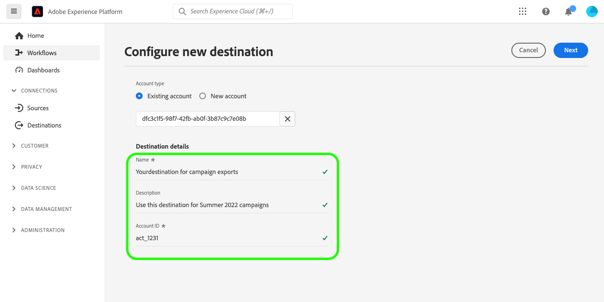

# 대상 연결 {#your-destination}

*이 템플릿을 진행할 때 이탤릭체로 된 모든 단락을 바꾸거나 삭제합니다(이 단락부터 시작).*

*페이지 상단에 있는 메타데이터(제목 및 설명)를 업데이트하여 시작합니다. 이 페이지에서 UICONTROL의 모든 인스턴스를 무시하십시오. 이것은 기계 번역 프로세스가 페이지를 지원하는 여러 언어로 올바르게 번역할 수 있도록 도와주는 태그입니다. 문서를 제출하면 문서에 태그를 추가하겠습니다.*

>[!IMPORTANT]
>
>* 이 템플릿의 모든 섹션을 템플릿에 요약된 순서로 채웁니다.
>* 이 템플릿은 파트너 피드백을 기반으로 자주 업데이트되지 않습니다. 대상에 대한 설명서 작성을 시작하기 전에 [템플릿의 최신 버전](../assets/docs-framework/yourdestination-template.zip).

## 개요 {#overview}

*고객에게 제공하는 가치를 포함하여 회사에 대한 간략한 개요를 제공하십시오. 자세히 알아보려면 제품 설명서 홈페이지에 대한 링크를 포함하십시오.*

>[!IMPORTANT]
>
>이 대상 커넥터 및 설명서 페이지는 *Yourdestination* 팀. 문의 사항이나 업데이트 요청은 다음 주소로 직접 문의하십시오. *예를 들어 업데이트에 대해 연락할 수 있는 링크 또는 이메일 주소를 삽입합니다. `support@YourDestination.com`.*

## 사용 사례 {#use-cases}

을(를) 사용하는 방법과 시기를 더 잘 이해할 수 있도록 *Yourdestination* 대상: 다음은 Adobe Experience Platform 고객이 이 대상을 사용하여 해결할 수 있는 샘플 사용 사례입니다.

### 사용 사례 #1 {#use-case-1}

*모바일 메시징 플랫폼의 경우:*

*한 주택 임대 및 판매 플랫폼은 고객이 이전에 임대를 검색한 지역에 100개의 업데이트된 목록이 있음을 알리기 위해 고객의 Android 및 iOS 디바이스에 모바일 알림을 푸시하려고 합니다.*

### 사용 사례 #2 {#use-case-2}

*소셜 네트워크 플랫폼의 경우:*

*한 스포츠 의류 브랜드는 자신의 소셜 미디어 계정을 통해 기존 고객에게 도달하기를 원합니다. 의류 브랜드는 자체 CRM에서 Adobe Experience Platform으로 이메일 주소를 수집하고, 자체 오프라인 데이터에서 대상을 작성하고, 이러한 대상을 YourDestination으로 전송하여 고객의 소셜 미디어 피드에 광고를 표시할 수 있습니다.*

## 전제 조건 {#prerequisites}

*이 섹션에서 Adobe Experience Platform 사용자 인터페이스에서 대상 설정을 시작하기 전에 고객이 알아야 할 사항에 대한 정보를 추가합니다. 이 작업은 다음에 대해 수행할 수 있습니다.*

* *허용 목록에 추가 필요*
* *이메일 해시 요구 사항*
* *귀하 측의 계정 세부 사항*
* *플랫폼에 연결하기 위한 API 키를 얻는 방법*

*고객에게 유용한 경우 관련 설명서에 연결할 수 있습니다.*

## 지원되는 ID {#supported-identities}

*이 섹션에서 대상에서 지원하는 ID에 대한 정보를 추가합니다. 우리는 몇 가지 표준 값으로 표를 미리 채웠다. 대상에 적용되지 않는 값과 미리 채워지지 않은 값을 삭제합니다.*

*Yourdestination* 는 아래 표에 설명된 id 활성화를 지원합니다. 자세히 알아보기 [id](/help/identity-service/namespaces.md).

| 대상 ID | 설명 | 고려 사항 |
|---|---|---|
| GAID | Google 광고 ID | 소스 ID가 GAID 네임스페이스인 경우 GAID 대상 ID를 선택합니다. |
| IDFA | 광고주용 Apple ID | 소스 ID가 IDFA 네임스페이스인 경우 IDFA 대상 ID를 선택합니다. |
| ECID | Experience Cloud ID | ECID를 나타내는 네임스페이스입니다. 이 네임스페이스는 &quot;Adobe Marketing Cloud ID&quot;, &quot;Adobe Experience Cloud ID&quot;, &quot;Adobe Experience Platform ID&quot; 별칭으로도 참조할 수 있습니다. 다음 문서를에서 읽으십시오. [ECID](/help/identity-service/ecid.md) 추가 정보. |
| phone_sha256 | SHA256 알고리즘으로 해시된 전화번호 | 일반 텍스트와 SHA256 해시 전화 번호는 모두 Adobe Experience Platform에서 지원됩니다. 소스 필드에 해시되지 않은 속성이 포함된 경우 **[!UICONTROL 변환 적용]** 옵션, 보유 [!DNL Platform] 활성화 시 데이터를 자동으로 해시합니다. |
| email_lc_sha256 | SHA256 알고리즘으로 해시된 이메일 주소 | Adobe Experience Platform은 일반 텍스트와 SHA256 해시 이메일 주소를 모두 지원합니다. 소스 필드에 해시되지 않은 속성이 포함된 경우 **[!UICONTROL 변환 적용]** 옵션, 보유 [!DNL Platform] 활성화 시 데이터를 자동으로 해시합니다. |
| extern_id | 사용자 지정 사용자 ID | 소스 ID가 사용자 지정 네임스페이스인 경우 이 대상 ID를 선택합니다. |

{style="table-layout:auto"}

## 지원되는 대상자 {#supported-audiences}

*이 섹션에서 대상에서 지원하는 대상에 대한 정보를 추가합니다. 우리는 몇 가지 표준 값으로 표를 미리 채웠다. 사용 `✓` 및 `X` 대상 유형이 이 대상에서 지원되는지 여부를 표시하는 문자입니다.*

이 섹션에서는 이 대상으로 내보낼 수 있는 대상자 유형을 설명합니다.

| 대상자 원본 | 지원됨 | 설명 |
---------|----------|----------|
| [!DNL Segmentation Service] | ✓ 덧신 | Experience Platform을 통해 생성된 대상자 [세분화 서비스](../../../segmentation/home.md). |
| 사용자 정의 업로드 | X | 대상 [가져옴](../../../segmentation/ui/overview.md#import-audience) csv 파일에서 Experience Platform으로 변환했습니다. |

{style="table-layout:auto"}

## 내보내기 유형 및 빈도 {#export-type-frequency}

*표에서 대상에 해당하는 행만 유지합니다. 내보내기 유형에 한 줄, 내보내기 빈도에 한 줄이 있어야 합니다. 대상에 적용되지 않는 값을 삭제합니다.*

대상 내보내기 유형 및 빈도에 대한 자세한 내용은 아래 표를 참조하십시오.

| 항목 | 유형 | 참고 |
---------|----------|---------|
| 내보내기 유형 | **[!UICONTROL 대상자 내보내기]** | 에 사용된 식별자(이름, 전화번호 또는 기타)를 사용하여 대상자의 모든 구성원을 내보냅니다. *Yourdestination* 대상. |
| 내보내기 유형 | **[!UICONTROL 프로필 기반]** | 의 프로필 속성 선택 화면에서 선택한 대로 원하는 스키마 필드(예: 이메일 주소, 전화번호, 성)와 함께 세그먼트의 모든 멤버를 내보냅니다. [대상 활성화 워크플로](/help/destinations/ui/activate-batch-profile-destinations.md#select-attributes). |
| 내보내기 유형 | **[!UICONTROL 데이터 세트 내보내기]** | 대상자 관심사나 자격에 따라 그룹화되거나 구조화되지 않은 원시 데이터 세트를 내보내는 경우 |
| 내보내기 빈도 | **[!UICONTROL 스트리밍]** | 스트리밍 대상은 &quot;항상&quot; API 기반 연결입니다. 대상자 평가를 기반으로 Experience Platform에서 프로필이 업데이트되는 즉시 커넥터가 업데이트 다운스트림을 대상 플랫폼으로 전송합니다. 자세한 내용 [스트리밍 대상](/help/destinations/destination-types.md#streaming-destinations). |
| 내보내기 빈도 | **[!UICONTROL 일괄 처리]** | 배치 대상은 파일을 3, 6, 8, 12 또는 24시간 단위로 다운스트림 플랫폼으로 내보냅니다. 자세한 내용 [배치 파일 기반 대상](/help/destinations/destination-types.md#file-based). |

{style="table-layout:auto"}

## 대상에 연결 {#connect}

>[!IMPORTANT]
> 
>대상에 연결하려면 다음이 필요합니다. **[!UICONTROL 대상 관리]** [액세스 제어 권한](/help/access-control/home.md#permissions). 읽기 [액세스 제어 개요](/help/access-control/ui/overview.md) 필요한 권한을 얻으려면 제품 관리자에게 문의하십시오.

이 대상에 연결하려면 다음과같이 하십시오. [대상 구성 자습서](../../ui/connect-destination.md). 대상 구성 워크플로에서 아래 두 섹션에 나열된 필드를 채웁니다.

### 대상으로 인증 {#authenticate}

*고객이 대상에 인증할 때 채워야 하는 필드를 추가합니다. 이러한 필드는 대상별로 다르며 Destination SDK의 구성에 따라 다릅니다. 대상의 필드가 아래 나열된 필드와 동일하지 않을 수 있습니다. 또한 아래 샘플 스크린샷과 유사한 스크린샷도 포함해 주세요.*

대상에 인증하려면 필수 필드를 입력한 다음 을(를) 선택합니다. **[!UICONTROL 대상에 연결]**.


* **[!UICONTROL 전달자 토큰]**: 대상에 인증할 전달자 토큰을 입력합니다.

### 대상 세부 정보 입력 {#destination-details}

*고객이 새 대상을 구성할 때 채워야 하는 필드를 추가합니다. 이러한 필드는 대상별로 다르며 Destination SDK의 구성에 따라 다릅니다. 대상의 필드가 아래 나열된 필드와 동일하지 않을 수 있습니다. 또한 아래 샘플 스크린샷과 유사한 스크린샷도 포함해 주세요.*

대상에 대한 세부 정보를 구성하려면 아래의 필수 및 선택 필드를 채우십시오. UI에서 필드 옆에 있는 별표는 필드가 필수임을 나타냅니다.



* **[!UICONTROL 이름]**: 나중에 이 대상을 인식할 수 있는 이름입니다.
* **[!UICONTROL 설명]**: 나중에 이 대상을 식별하는 데 도움이 되는 설명입니다.
* **[!UICONTROL 계정 ID]**: 사용자 *Yourdestination* 계정 ID.

### 경고 활성화 {#enable-alerts}

경고를 활성화하여 대상에 대한 데이터 흐름 상태에 대한 알림을 받을 수 있습니다. 목록에서 경고를 선택하여 데이터 흐름 상태에 대한 알림을 수신합니다. 경고에 대한 자세한 내용은 의 안내서를 참조하십시오 [UI를 사용하여 대상 경고 구독](../../ui/alerts.md).

대상 연결에 대한 세부 정보를 제공했으면 을 선택합니다. **[!UICONTROL 다음]**.

## 이 대상으로 대상자 활성화 {#activate}

>[!IMPORTANT]
> 
>* 데이터를 활성화하려면 **[!UICONTROL 대상 관리]**, **[!UICONTROL 대상 활성화]**, **[!UICONTROL 프로필 보기]**, 및 **[!UICONTROL 세그먼트 보기]** [액세스 제어 권한](/help/access-control/home.md#permissions). 읽기 [액세스 제어 개요](/help/access-control/ui/overview.md) 필요한 권한을 얻으려면 제품 관리자에게 문의하십시오.
>* 내보내려면 *id*, 다음이 필요합니다. **[!UICONTROL ID 그래프 보기]** [액세스 제어 권한](/help/access-control/home.md#permissions). <br> {width="100" zoomable="yes"}

*적절히 삭제 - 새 스트리밍 대상을 문서화하는 경우 아래의 첫 번째 단락을 유지합니다. 새 파일 기반 대상을 문서화하는 경우 두 번째 단락을 유지합니다. 데이터 세트를 내보내는 대상을 문서화하는 경우 세 번째 단락을 유지합니다.*

읽기 [스트리밍 대상자 내보내기 대상으로 프로필 및 대상자 활성화](/help/destinations/ui/activate-segment-streaming-destinations.md) 이 대상에 대한 대상자 활성화에 대한 지침을 참조하십시오.

읽기 [대상자 데이터를 활성화하여 프로필 내보내기 대상 일괄 처리](/help/destinations/ui/activate-batch-profile-destinations.md) 이 대상에 대한 대상자 활성화에 대한 지침을 참조하십시오.

읽기 [(베타) 데이터 세트 내보내기](/help/destinations/ui/export-datasets.md) 이 대상으로 데이터 세트를 내보내는 방법에 대한 광범위한 지침.

### 속성 및 ID 매핑 {#map}

*활성화 워크플로의 매핑 단계에서 소스 필드와 대상 필드 간에 지원되는 매핑에 대한 정보를 추가합니다. 대상은 프로필 속성, ID 네임스페이스 또는 둘 다 내보내기를 지원할 수 있습니다. 일부 필드는 필수일 수 있습니다. 타겟 속성은 사전 정의되거나 사용자 지정될 수 있습니다. 중요한 주의 사항을 호출하고 예를 들어 스크린샷을 사용하는 것이 좋습니다. 참조로 사용할 수 있는 대상 페이지의 두 가지 예는 다음과 같습니다.*

* *[페가](/help/destinations/catalog/personalization/pega.md#mapping-example)*
* *[메달리아](/help/destinations/catalog/voice/medallia-connector.md#map)*

## 내보낸 데이터/데이터 내보내기 유효성 검사 {#exported-data}

*데이터를 대상으로 내보내는 방법에 대한 단락을 추가합니다. 이렇게 하면 고객이 대상과 올바르게 통합되었는지 확인하는 데 도움이 됩니다. 예를 들어 아래 샘플과 같은 샘플 JSON을 제공할 수 있습니다. 또는 고객이 대상 플랫폼에서 대상을 채울 것으로 예상해야 하는 방법을 보여 주는 대상 인터페이스의 스크린샷과 정보를 제공할 수 있습니다.*

```
{
  "person": {
    "email": "yourstruly@adobe.com"
  },
  "segmentMembership": {
    "ups": {
      "7841ba61-23c1-4bb3-a495-00d3g5fe1e93": {
        "lastQualificationTime": "2020-05-25T21:24:39Z",
        "status": "exited"
      },
      "59bd2fkd-3c48-4b18-bf56-4f5c5e6967ae": {
        "lastQualificationTime": "2020-05-25T23:37:33Z",
        "status": "realized"
      }
    }
  },
  "identityMap": {
    "ecid": [
      {
        "id": "14575006536349286404619648085736425115"
      },
      {
        "id": "66478888669296734530114754794777368480"
      }
    ],
    "email_lc_sha256": [
      {
        "id": "655332b5fa2aea4498bf7a290cff017cb4"
      },
      {
        "id": "66baf76ef9de8b42df8903f00e0e3dc0b7"
      }
    ]
  }
}
```

## 데이터 사용 및 관리 {#data-usage-governance}

모두 [!DNL Adobe Experience Platform] 대상은 데이터를 처리할 때 데이터 사용 정책을 준수합니다. 방법에 대한 자세한 정보 [!DNL Adobe Experience Platform] 데이터 거버넌스 적용, 다음을 읽습니다. [데이터 거버넌스 개요](/help/data-governance/home.md).

## 추가 리소스 {#additional-resources}

*제품 설명서나 고객이 성공하기 위해 중요하다고 생각하는 다른 리소스에 대한 추가 링크를 제공할 수 있습니다.*