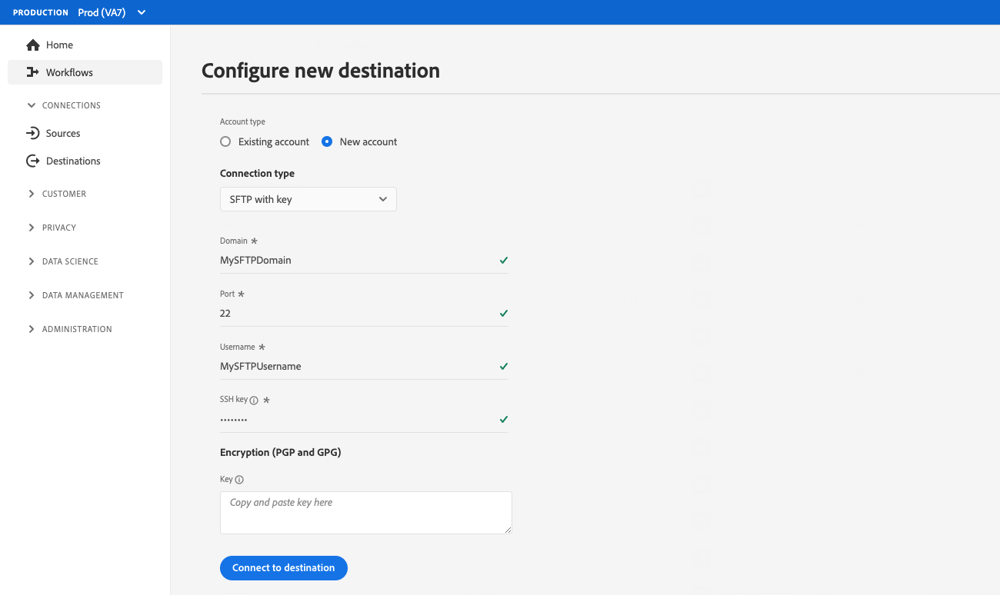

# 파일 기반 대상 구성 {#destination-configuration}

## 개요 {#overview}

이 구성을 통해 대상 이름, 카테고리, 설명 등과 같은 파일 기반 대상에 대한 필수 정보를 나타낼 수 있습니다. 또한 이 구성의 설정은 Experience Platform 사용자가 대상에 인증하는 방법, Experience Platform 사용자 인터페이스에 표시되는 방법 및 대상으로 내보낼 수 있는 ID를 결정합니다. 또한 이 구성을 사용하여 내보낸 파일의 파일 유형, 파일 형식 또는 압축 설정과 관련된 옵션을 표시할 수도 있습니다.

이 구성은 또한 대상이 작동하는 데 필요한 다른 구성(대상 서버 및 대상 메타데이터)을 이 구성에 연결합니다. 의 두 구성을 참조하는 방법 읽기 [추가 하위 섹션](./file-based-destination-configuration.md#connecting-all-configurations).

다음을 사용하여 이 문서에 설명된 기능을 구성할 수 있습니다. `/authoring/destinations` API 엔드포인트. 읽기 [대상 API 엔드포인트 작업](./destination-configuration-api.md) 엔드포인트에서 수행할 수 있는 전체 작업 목록입니다.

## Amazon S3 대상 구성 예 {#batch-example-configuration}

다음은 를 통해 만든 개인 사용자 지정 Amazon S3 대상의 예입니다. `/destinations` 구성 끝점입니다.

```json
{
   "name":"S3 Destination with CSV Options",
   "description":"S3 Destination with CSV Options",
   "status":"TEST",
   "maxProfileAttributes":"2000",
   "maxIdentityAttributes":"10",
   "customerAuthenticationConfigurations":[
      {
         "authType":"S3"
      }
   ],
   "customerEncryptionConfigurations":[
      
   ],
   "customerDataFields":[
      {
         "name":"bucketName",
         "title":"Amazon S3 bucket name",
         "description":"Enter your Amazon S3 bucket name",
         "type":"string",
         "isRequired":true,
         "pattern": "(?=^.{3,63}$)(?!^(\\d+\\.)+\\d+$)(^(([a-z0-9]|[a-z0-9][a-z0-9\\-]*[a-z0-9])\\.)*([a-z0-9]|[a-z0-9][a-z0-9\\-]*[a-z0-9])$)",
         "readOnly":false,
         "hidden":false
      },
      {
         "name":"path",
         "title":"Amazon S3 bucket path",
         "description":"Enter your S3 bucket path",
         "type":"string",
         "isRequired":true,
         "pattern": "^[0-9a-zA-Z\\/\\!\\-_\\.\\*\\''\\(\\)]*((\\%SEGMENT_(NAME|ID)\\%)?\\/?)+$",
         "readOnly":false,
         "hidden":false
      },
      {
         "name":"sep",
         "title":"Enter a separator for each field and value",
         "description":"Enter a separator character for each field and value",
         "type":"string",
         "isRequired":false,
         "readOnly":false,
         "hidden":false
      },
      {
         "name":"encoding",
         "title":"Specify encoding (charset) of saved CSV files",
         "description":"Select encoding of csv files",
         "type":"string",
         "enum":[
            "UTF-8",
            "UTF-16"
         ],
         "isRequired":false,
         "readOnly":false,
         "hidden":false
      },
      {
         "name":"quote",
         "title":"Select a single character used for escaping quoted values",
         "description":"Select single charachter for escaping quoted values",
         "type":"string",
         "isRequired":false,
         "readOnly":false,
         "hidden":false
      },
      {
         "name":"quoteAll",
         "title":"Escape all quoted values",
         "description":"Select whether to escape all quoted values",
         "type":"string",
         "enum":[
            "true",
            "false"
         ],
         "default":"true",
         "isRequired":true,
         "readOnly":false,
         "hidden":false
      },
      {
         "name":"escape",
         "title":"Select a single character used for escaping quotes",
         "description":"Select a single character used for escaping quotes inside an already quoted value",
         "type":"string",
         "isRequired":false,
         "readOnly":false,
         "hidden":false
      },
      {
         "name":"escapeQuotes",
         "title":"Escape quotes",
         "description":"A flag indicating whether values containing quotes should always be enclosed in quotes",
         "type":"string",
         "enum":[
            "true",
            "false"
         ],
         "isRequired":false,
         "default":"true",
         "readOnly":false,
         "hidden":false
      },
      {
         "name":"header",
         "title":"header",
         "description":"Writes the names of columns as the first line.",
         "type":"string",
         "isRequired":false,
         "enum":[
            "true",
            "false"
         ],
         "readOnly":false,
         "default":"true",
         "hidden":false
      },
      {
         "name":"ignoreLeadingWhiteSpace",
         "title":"Ignore leading white space",
         "description":"A flag indicating whether or not leading whitespaces from values being written should be skipped.",
         "type":"string",
         "isRequired":false,
         "enum":[
            "true",
            "false"
         ],
         "readOnly":false,
         "default":"true",
         "hidden":false
      },
      {
         "name":"nullValue",
         "title":"Select the string representation of a null value",
         "description":"Sets the string representation of a null value. ",
         "type":"string",
         "isRequired":false,
         "readOnly":false,
         "hidden":false
      },
      {
         "name":"dateFormat",
         "title":"Date format",
         "description":"Select the string that indicates a date format. ",
         "type":"string",
         "default":"yyyy-MM-dd",
         "isRequired":false,
         "readOnly":false,
         "hidden":false
      },
      {
         "name":"charToEscapeQuoteEscaping",
         "title":"Char to escape quote escaping",
         "description":"Sets a single character used for escaping the escape for the quote character",
         "type":"string",
         "isRequired":false,
         "readOnly":false,
         "hidden":false
      },
      {
         "name":"emptyValue",
         "title":"Select the string representation of an empty value",
         "description":"Select the string representation of an empty value",
         "type":"string",
         "isRequired":false,
         "readOnly":false,
         "default":"",
         "hidden":false
      },
      {
         "name":"compression",
         "title":"Select compression",
         "description":"Select compressiont",
         "type":"string",
         "isRequired":true,
         "readOnly":false,
         "enum":[
            "SNAPPY",
            "GZIP",
            "DEFLATE",
            "NONE"
         ]
      },
      {
         "name":"fileType",
         "title":"Select a fileType",
         "description":"Select fileType",
         "type":"string",
         "isRequired":true,
         "readOnly":false,
         "hidden":false,
         "enum":[
            "csv",
            "json",
            "parquet"
         ],
         "default":"csv"
      }
   ],
   "uiAttributes":{
      "documentationLink":"http://www.adobe.com/go/YOURDESTINATION-en",
      "category":"S3",
      "iconUrl":"https://dc5tqsrhldvnl.cloudfront.net/2/90048/da276e30c730ce6cd666c8ca78360df21.png",
      "connectionType":"S3",
      "flowRunsSupported":true,
      "monitoringSupported":true,
      "frequency":"Batch"
   },
   "destinationDelivery":[
      {
         "deliveryMatchers":[
            {
               "type":"SOURCE",
               "value":[
                  "batch"
               ]
            }
         ],
         "authenticationRule":"CUSTOMER_AUTHENTICATION",
         "destinationServerId":"{{destinationServerId}}"
      }
   ],
   "identityNamespaces":{
      "adobe_id":{
         "acceptsAttributes":true,
         "acceptsCustomNamespaces":true
      },
      "mobile_id":{
         "acceptsAttributes":true,
         "acceptsCustomNamespaces":true
      }
   },
   "segmentMappingConfig":{
      "mapExperiencePlatformSegmentName":false,
      "mapExperiencePlatformSegmentId":false,
      "mapUserInput":false,
      "audienceTemplateId":"cbf90a70-96b4-437b-86be-522fbdaabe9c"
   },
   "schemaConfig":{
      "profileFields":[
         {
            "name":"phoneNo",
            "title":"phoneNo",
            "description":"This is a fixed attribute on your destination side that customers can map profile attributes to. For example, the phoneNumber value in Experience Platform could be phoneNo on your side.",
            "type":"string",
            "isRequired":false,
            "readOnly":false,
            "hidden":false
         }
      ],
      "profileRequired":true,
      "segmentRequired":true,
      "identityRequired":true
   },
   "batchConfig":{
      "allowMandatoryFieldSelection":true,
      "allowDedupeKeyFieldSelection":true,
      "defaultExportMode":"DAILY_FULL_EXPORT",
      "allowedExportMode":[
         "DAILY_FULL_EXPORT",
         "FIRST_FULL_THEN_INCREMENTAL"
      ],
      "allowedScheduleFrequency":[
         "DAILY",
         "EVERY_3_HOURS",
         "EVERY_6_HOURS",
         "EVERY_8_HOURS",
         "EVERY_12_HOURS",
         "ONCE"
      ],
      "defaultFrequency":"DAILY",
      "defaultStartTime":"00:00",
      "filenameConfig":{
         "allowedFilenameAppendOptions":[
            "SEGMENT_NAME",
            "DESTINATION_INSTANCE_ID",
            "DESTINATION_INSTANCE_NAME",
            "ORGANIZATION_NAME",
            "SANDBOX_NAME",
            "DATETIME",
            "CUSTOM_TEXT"
         ],
         "defaultFilenameAppendOptions":[
            "DATETIME"
         ],
         "defaultFilename":"%DESTINATION%_%SEGMENT_ID%"
      },
      "backfillHistoricalProfileData":true
   }
```

| 매개 변수 | 유형 | 설명 |
|---------|----------|------|
| `name` | 문자열 | Experience Platform 카탈로그에서 대상의 제목을 나타냅니다. |
| `description` | 문자열 | Experience Platform 대상 카탈로그에 대상 카드에 대한 설명을 입력합니다. 4-5개 이하의 문장을 목표로 하라. |
| `status` | 문자열 | 대상 카드의 라이프사이클 상태를 나타냅니다. 허용되는 값은 `TEST`, `PUBLISHED` 및 `DELETED`입니다. 사용 `TEST` 대상을 처음 구성할 때. |
| `maxProfileAttributes` | 문자열 | 고객이 대상으로 내보낼 수 있는 최대 프로필 속성 수를 나타냅니다. 기본값은 `2000`입니다. |
| `maxIdentityAttributes` | 문자열 | 고객이 대상으로 내보낼 수 있는 최대 ID 네임스페이스 수를 나타냅니다. 기본값은 `10`입니다. |

{style="table-layout:auto"}

## 고객 인증 구성 {#customer-authentication-configurations}

대상 구성의 이 섹션에서는 [새 대상 구성](/help/destinations/ui/connect-destination.md) Experience Platform을 대상이 있는 계정에 연결하는 Experience Platform 사용자 인터페이스의 페이지입니다.

```json
"customerAuthenticationConfigurations": [
        {
            "authType": "S3"
        }
    ],
```

다음에 따라 [인증 옵션](authentication-configuration.md##supported-authentication-types) 에 을(를) 지정합니다. `authType` 필드에서는 다음과 같이 사용자에 대한 Experience Platform 페이지가 생성됩니다.

### Amazon S3 인증 {#s3}

Amazon S3 인증 유형을 구성할 때 사용자는 S3 자격 증명을 입력해야 합니다.


### Azure Blob 인증  {#blob}

Azure Blob 인증 유형을 구성할 때 사용자가 연결 문자열을 입력해야 합니다.


### 암호 인증이 있는 SFTP

암호 인증 유형으로 SFTP를 구성할 때 사용자는 SFTP 사용자 이름과 암호와 SFTP 도메인 및 포트(기본 포트: 22)를 입력해야 합니다.


### SSH 키 인증이 있는 SFTP

SSH 키 인증 유형으로 SFTP를 구성할 경우 사용자는 SFTP 사용자 이름과 SSH 키, SFTP 도메인 및 포트(기본 포트: 22)를 입력해야 합니다.



## 고객 데이터 필드 {#customer-data-fields}

이 섹션을 사용하여 Experience Platform UI에서 대상에 연결할 때 사용자에게 대상에 대한 사용자 정의 필드를 입력하도록 요청합니다.

아래 예에서는 `customerDataFields` 을(를) 사용하려면 사용자가 대상의 이름을 입력하고 [!DNL Amazon S3] 버킷 이름 및 폴더 경로와 압축 유형, 파일 형식 및 기타 여러 파일 형식 옵션.

템플릿에서 고객 데이터 필드의 고객 입력에 액세스하고 사용할 수 있습니다. 매크로 사용 `{{customerData.exampleName}}`. 예를 들어, 사용자에게 이름이 인 Amazon S3 버킷 필드를 입력하도록 하는 경우 `bucket`를 설정하는 경우 매크로를 사용하여 템플릿에서 액세스할 수 있습니다 `{{customerData.bucket}}`. 에서 고객 데이터 필드를 사용하는 방법의 예를 봅니다. [대상 서버 구성](/help/destinations/destination-sdk/server-and-file-configuration.md#s3-example).

```json
 "customerDataFields":[
      {
         "name":"bucket",
         "title":"Amazon S3 bucket name",
         "description":"Enter your Amazon S3 bucket name",
         "type":"string",
         "isRequired":true,
         "readOnly":false,
         "hidden":false
      },
      {
         "name":"path",
         "title":"Amazon S3 bucket path",
         "description":"Enter your S3 bucket path",
         "type":"string",
         "isRequired":true,
         "pattern":"^[A-Za-z]+$",
         "readOnly":false,
         "hidden":false
      },
      {
         "name":"sep",
         "title":"Enter a separator for each field and value",
         "description":"Enter a separator character for each field and value",
         "type":"string",
         "isRequired":false,
         "readOnly":false,
         "hidden":false
      },
      {
         "name":"encoding",
         "title":"Specify encoding (charset) of saved CSV files",
         "description":"Select encoding of csv files",
         "type":"string",
         "enum":[
            "UTF-8",
            "UTF-16"
         ],
         "isRequired":false,
         "readOnly":false,
         "hidden":false
      },
      {
         "name":"quote",
         "title":"Select a single character used for escaping quoted values",
         "description":"Select single charachter for escaping quoted values",
         "type":"string",
         "isRequired":false,
         "readOnly":false,
         "hidden":false
      },
      {
         "name":"quoteAll",
         "title":"Escape all quoted values",
         "description":"Select whether to escape all quoted values",
         "type":"string",
         "enum":[
            "true",
            "false"
         ],
         "default":"true",
         "isRequired":true,
         "readOnly":false,
         "hidden":false
      },
      {
         "name":"escape",
         "title":"Select a single character used for escaping quotes",
         "description":"Select a single character used for escaping quotes inside an already quoted value",
         "type":"string",
         "isRequired":false,
         "readOnly":false,
         "hidden":false
      },
      {
         "name":"escapeQuotes",
         "title":"Escape quotes",
         "description":"A flag indicating whether values containing quotes should always be enclosed in quotes",
         "type":"string",
         "enum":[
            "true",
            "false"
         ],
         "isRequired":false,
         "default":"true",
         "readOnly":false,
         "hidden":false
      },
      {
         "name":"header",
         "title":"header",
         "description":"Writes the names of columns as the first line.",
         "type":"string",
         "isRequired":false,
         "enum":[
            "true",
            "false"
         ],
         "readOnly":false,
         "default":"true",
         "hidden":false
      },
      {
         "name":"ignoreLeadingWhiteSpace",
         "title":"Ignore leading white space",
         "description":"A flag indicating whether or not leading whitespaces from values being written should be skipped.",
         "type":"string",
         "isRequired":false,
         "enum":[
            "true",
            "false"
         ],
         "readOnly":false,
         "default":"true",
         "hidden":false
      },
      {
         "name":"nullValue",
         "title":"Select the string representation of a null value",
         "description":"Sets the string representation of a null value. ",
         "type":"string",
         "isRequired":false,
         "readOnly":false,
         "hidden":false
      },
      {
         "name":"dateFormat",
         "title":"Date format",
         "description":"Select the string that indicates a date format. ",
         "type":"string",
         "default":"yyyy-MM-dd",
         "isRequired":false,
         "readOnly":false,
         "hidden":false
      },
      {
         "name":"charToEscapeQuoteEscaping",
         "title":"Char to escape quote escaping",
         "description":"Sets a single character used for escaping the escape for the quote character",
         "type":"string",
         "isRequired":false,
         "readOnly":false,
         "hidden":false
      },
      {
         "name":"emptyValue",
         "title":"Select the string representation of an empty value",
         "description":"Select the string representation of an empty value",
         "type":"string",
         "isRequired":false,
         "readOnly":false,
         "default":"",
         "hidden":false
      },
      {
         "name":"compression",
         "title":"Select compression",
         "description":"Select compressiont",
         "type":"string",
         "isRequired":true,
         "readOnly":false,
         "enum":[
            "SNAPPY",
            "GZIP",
            "DEFLATE",
            "NONE"
         ]
      },
      {
         "name":"fileType",
         "title":"Select a fileType",
         "description":"Select fileType",
         "type":"string",
         "isRequired":true,
         "readOnly":false,
         "hidden":false,
         "enum":[
            "csv",
            "json",
            "parquet"
         ],
         "default":"csv"
      }
```

>[!TIP]
>
>위의 예제에 나열된 모든 파일 형식 구성은 [파일 포맷 구성](/help/destinations/destination-sdk/server-and-file-configuration.md#file-configuration) 섹션.

| 매개 변수 | 유형 | 설명 |
|---------|----------|------|
| `name` | 문자열 | 도입 중인 사용자 정의 필드의 이름을 입력합니다. |
| `title` | 문자열 | Experience Platform 사용자 인터페이스에서 고객에게 표시되는 필드의 이름을 나타냅니다. |
| `description` | 문자열 | 사용자 정의 필드에 대한 설명을 입력합니다. |
| `type` | 문자열 | 도입 중인 사용자 정의 필드 유형을 나타냅니다. 허용되는 값은 다음과 같습니다 `string`, `object`, `integer`. |
| `isRequired` | 부울 | 대상 설정 워크플로에서 이 필드가 필요한지 여부를 나타냅니다. |
| `pattern` | 문자열 | 필요한 경우 사용자 정의 필드에 패턴을 적용합니다. 패턴을 적용하려면 정규 표현식을 사용하십시오. 예를 들어 고객 ID에 숫자나 밑줄이 포함되지 않은 경우 을 입력합니다 `^[A-Za-z]+$` 이 필드에서 을(를) 참조하십시오. |
| `enum` | 문자열 | 사용자 정의 필드를 드롭다운 메뉴로 렌더링하고 사용자가 사용할 수 있는 옵션을 나열합니다. |
| `default` | 문자열 | 에서 기본값 정의 `enum` 목록을 표시합니다. |

{style="table-layout:auto"}

## UI 속성 {#ui-attributes}

이 섹션은 위의 구성에서 Adobe이 Adobe Experience Platform 사용자 인터페이스에서 대상에 사용해야 하는 UI 요소를 나타냅니다.

```json
"uiAttributes":{
      "documentationLink":"http://www.adobe.com/go/YOURDESTINATION-en",
      "category":"cloudStorage",
      "iconUrl":"https://dc5tqsrhldvnl.cloudfront.net/2/90048/da276e30c730ce6cd666c8ca78360df21.png",
      "connectionType":"S3",
      "flowRunsSupported":true,
      "monitoringSupported":true,
      "frequency":"Batch"
   }
```

| 매개 변수 | 유형 | 설명 |
|---------|----------|------|
| `documentationLink` | 문자열 | 에서 설명서 페이지를 참조하십시오. [대상 카탈로그](https://experienceleague.adobe.com/docs/experience-platform/destinations/catalog/overview.html?lang=en#catalog) 목적지로요 사용 `http://www.adobe.com/go/destinations-YOURDESTINATION-en`, 여기서 `YOURDESTINATION` 는 대상 이름입니다. Moviestar라는 대상의 경우 `http://www.adobe.com/go/destinations-moviestar-en`. 이 링크는 Adobe이 대상을 라이브로 설정하고 설명서가 게시된 후에만 작동합니다. |
| `category` | 문자열 | Adobe Experience Platform에서 대상에 할당된 카테고리를 나타냅니다. 자세한 내용은 다음을 참조하십시오 [대상 범주](https://experienceleague.adobe.com/docs/experience-platform/destinations/destination-types.html). 다음 값 중 하나를 사용합니다. `adobeSolutions, advertising, analytics, cdp, cloudStorage, crm, customerSuccess, database, dmp, ecommerce, email, emailMarketing, enrichment, livechat, marketingAutomation, mobile, personalization, protocols, social, streaming, subscriptions, surveys, tagManagers, voc, warehouses, payments`. |
| `iconUrl` | 문자열 | 대상 카탈로그 카드에 표시할 아이콘을 호스팅한 URL입니다. 비공개 사용자 정의 통합의 경우 이 작업이 필요하지 않습니다. 제품화된 구성의 경우 다음과 같이 Adobe 팀과 아이콘을 공유해야 합니다. [검토할 대상 제출](/help/destinations/destination-sdk/submit-destination.md#logo). |
| `connectionType` | 문자열 | 대상에 따른 연결 유형입니다. 지원되는 값: <ul><li>`Azure Blob`</li><li>`Azure Data Lake Storage`</li><li>`S3`</li><li>`SFTP`</li></ul> |
| `flowRunsSupported` | 부울 | 대상 연결이 [플로우 실행 UI](../../dataflows/ui/monitor-destinations.md#monitoring-destinations-dashboard). 이 을(를) (으)로 설정할 때 `true`: <ul><li>다음 **[!UICONTROL 마지막 데이터 흐름 실행 일자]** 및 **[!UICONTROL 마지막 데이터 흐름 실행 상태]** 대상 찾아보기 페이지에 표시됩니다.</li><li>다음 **[!UICONTROL 데이터 흐름 실행]** 및 **[!UICONTROL 활성화 데이터]** 탭은 대상 보기 페이지에 표시됩니다.</li></ul> |
| `monitoringSupported` | 부울 | 대상 연결이 [모니터링 UI](../ui/destinations-workspace.md#browse). 이 을(를) (으)로 설정할 때 `true`, **[!UICONTROL 모니터링에서 보기]** [대상 찾아보기] 페이지에 옵션이 표시됩니다. |
| `frequency` | 문자열 | 대상에서 지원하는 데이터 내보내기 유형을 나타냅니다. 다음으로 설정 `Batch` 파일 기반 대상. |

{style="table-layout:auto"}

## 대상 게재 {#destination-delivery}

대상 게재 섹션은 내보낸 데이터의 위치와 데이터가 도착하는 위치에서 사용되는 인증 규칙을 나타냅니다. 하나 이상을 지정해야 합니다. `destinationServerId`는 데이터가 전달될 위치와 인증 규칙 대부분의 경우 사용해야 하는 인증 규칙은 입니다. `CUSTOMER_AUTHENTICATION`.

다음 `deliveryMatchers` 섹션은 선택 사항이며 여러 을 지정하는 경우 사용할 수 있습니다 `destinationServerId`s. 이 경우 `deliveryMatchers` 섹션은 내보낸 데이터를 다양한 대상 서버 간에 분할하는 방법을 나타냅니다.

```json
 "destinationDelivery":[
      {
         "deliveryMatchers":[
            {
               "type":"SOURCE",
               "value":[
                  "batch"
               ]
            }
         ],
         "authenticationRule":"CUSTOMER_AUTHENTICATION",
         "destinationServerId":"{{destinationServerId}}"
      }
   ]
```

| 매개 변수 | 유형 | 설명 |
|---------|----------|------|
| `authenticationRule` | 문자열 | 방법을 나타냅니다. [!DNL Platform] 고객이 대상에 연결합니다. 허용되는 값은 다음과 같습니다 `CUSTOMER_AUTHENTICATION`, `PLATFORM_AUTHENTICATION`, `NONE`. <br> <ul><li>사용 `CUSTOMER_AUTHENTICATION` platform 고객이 다음 방법 중 하나를 통해 시스템에 로그인하는 경우: <ul><li>`"authType": "S3"`</li><li>`"authType":"AZURE_CONNECTION_STRING"`</li><li>`"authType":"AZURE_SERVICE_PRINCIPAL"`</li><li>`"authType":"SFTP_WITH_SSH_KEY"`</li><li>`"authType":"SFTP_WITH_PASSWORD"`</li></ul> </li><li> 사용 `PLATFORM_AUTHENTICATION` Adobe과 대상 및 간에 글로벌 인증 시스템이 있는 경우 [!DNL Platform] 고객은 대상에 연결하기 위해 인증 자격 증명을 제공할 필요가 없습니다. 이 경우 다음을 사용하여 자격 증명 개체를 만들어야 합니다 [자격 증명](./credentials-configuration-api.md) 구성. </li><li>사용 `NONE` 대상 플랫폼으로 데이터를 전송하는 데 인증이 필요하지 않은 경우 </li></ul> |
| `destinationServerId` | 문자열 | 다음 `instanceId` / [대상 서버 구성](./server-and-file-configuration.md) 본인 [생성됨](/help/destinations/destination-sdk/destination-server-api.md#create-file-based) 대상. |

{style="table-layout:auto"}

## 세그먼트 매핑 구성 {#segment-mapping}

대상 구성의 이 섹션은 Experience Platform 이름 또는 ID와 같은 세그먼트 메타데이터를 세그먼트와 대상 간에 공유하는 방식과 관련이 있습니다.

다음을 통해 `audienceTemplateId`, 이 섹션은 또한 이 구성을 [대상 메타데이터 구성](./audience-metadata-management.md).

```json
   "segmentMappingConfig":{
       "mapExperiencePlatformSegmentName":false,
       "mapExperiencePlatformSegmentId":false,
       "mapUserInput":false,
       "audienceTemplateId":"cbf90a70-96b4-437b-86be-522fbdaabe9c"
   },
```

| 매개 변수 | 유형 | 설명 |
|---------|----------|------|
| `mapExperiencePlatformSegmentName` | 부울 | 대상 활성화 워크플로의 세그먼트 매핑 ID가 Experience Platform 세그먼트 이름인지 여부를 제어합니다. |
| `mapExperiencePlatformSegmentId` | 부울 | 대상 활성화 워크플로의 세그먼트 매핑 ID가 Experience Platform 세그먼트 ID인지 여부를 제어합니다. |
| `mapUserInput` | 부울 | 대상 활성화 워크플로의 세그먼트 매핑 ID가 사용자에 의해 입력되는지 여부를 제어합니다. |
| `audienceTemplateId` | 부울 | 다음 `instanceId` / [대상 메타데이터 템플릿](./audience-metadata-management.md) 이 대상에 사용됩니다. 대상 메타데이터 템플릿을 설정하려면 다음을 참조하십시오. [audience metadata API 참조](./audience-metadata-api.md). |

## 매핑 단계의 스키마 구성 {#schema-configuration}

Adobe Experience Platform Destination SDK은 파트너 정의 스키마를 지원합니다. 파트너 정의 스키마를 사용하면 다음과 유사하게, 프로필 속성 및 ID를 대상 파트너가 정의한 사용자 정의 스키마에 매핑할 수 있습니다. [스트리밍 대상](destination-configuration.md#schema-configuration) 워크플로입니다.

에서 매개 변수 사용 `schemaConfig` 대상 활성화 워크플로의 매핑 단계를 활성화합니다. 아래에 설명된 매개 변수를 사용하여 Experience Platform 사용자가 프로필 속성 및/또는 ID를 파일 기반 대상에 매핑할 수 있는지 여부를 결정할 수 있습니다.

정적 하드 코딩된 스키마 필드를 만들거나 매핑 워크플로의 대상 스키마에서 필드를 동적으로 검색하고 채우기 위해 Experience Platform이 연결해야 하는 동적 스키마를 지정할 수 있습니다. 대상 스키마는 아래 스크린샷에 나와 있습니다.


### 정적 하드 코딩된 스키마 필드 구성

```json
"schemaConfig":{
      "profileFields":[
           {
              "name":"phoneNo",
              "title":"phoneNo",
              "description":"This is a fixed attribute on your destination side that customers can map profile attributes to. For example, the phoneNumber value in Experience Platform could be phoneNo on your side.",
              "type":"string",
              "isRequired":false,
              "readOnly":false,
              "hidden":false
           }
        ],
      "profileRequired":true,
      "segmentRequired":true,
      "identityRequired":true
}
```

| 매개 변수 | 유형 | 설명 |
|---------|----------|------|
| `profileFields` | 배열 | 사전 정의된 항목을 추가할 때 `profileFields`, Experience Platform 사용자는 Platform 속성을 대상에 사전 정의된 속성에 매핑할 수 있는 옵션이 있습니다. |
| `profileRequired` | 부울 | 사용 `true` 위의 예제 구성에 표시된 대로 사용자가 Experience Platform의 프로필 속성을 대상 측의 사용자 지정 속성에 매핑할 수 있어야 하는 경우입니다. |
| `segmentRequired` | 부울 | 항상 사용 `segmentRequired:true`. |
| `identityRequired` | 부울 | 사용 `true` 사용자가 Experience Platform의 id 네임스페이스를 원하는 스키마에 매핑할 수 있어야 하는 경우. |

{style="table-layout:auto"}

### 매핑 단계의 동적 스키마 구성 {#dynamic-schema-configuration}

에서 매개 변수 사용  `dynamicSchemaConfig` Platform 프로필 속성 및/또는 ID를 매핑할 수 있는 자체 스키마를 동적으로 검색합니다.

```json
"schemaConfig":{
   "dynamicSchemaConfig":{
      "dynamicEnum": {
         "authenticationRule":"CUSTOMER_AUTHENTICATION",
         "destinationServerId":"2aa8a809-c4ae-4f66-bb02-12df2e0a2279",
         "value": "Schema Name",
         "responseFormat": "SCHEMA"
      }
   },
   "profileRequired":true,
   "segmentRequired":true,
   "identityRequired":true
}
```

| 매개 변수 | 유형 | 설명 |
|---------|----------|------|
| `profileRequired` | 부울 | 사용 `true` 위의 예제 구성에 표시된 대로 사용자가 Experience Platform의 프로필 속성을 대상 측의 사용자 지정 속성에 매핑할 수 있어야 하는 경우입니다. |
| `segmentRequired` | 부울 | 항상 사용 `segmentRequired:true`. |
| `identityRequired` | 부울 | 사용 `true` 사용자가 Experience Platform의 id 네임스페이스를 원하는 스키마에 매핑할 수 있어야 하는 경우. |
| `destinationServerId` | 문자열 | 다음 `instanceId` / [대상 서버 구성](./destination-server-api.md) 동적 스키마에 대해 생성한 것입니다. 이 대상 서버에는 Experience Platform이 대상 필드를 채우는 데 사용되는 동적 스키마를 검색하기 위해 호출할 HTTP 끝점이 포함됩니다. |
| `authenticationRule` | 문자열 | 방법을 나타냅니다. [!DNL Platform] 고객이 대상에 연결합니다. 허용되는 값은 다음과 같습니다 `CUSTOMER_AUTHENTICATION`, `PLATFORM_AUTHENTICATION`, `NONE`. <br> <ul><li>사용 `CUSTOMER_AUTHENTICATION` platform 고객이 다음 방법 중 하나를 통해 시스템에 로그인하는 경우: <ul><li>`"authType": "S3"`</li><li>`"authType":"AZURE_CONNECTION_STRING"`</li><li>`"authType":"AZURE_SERVICE_PRINCIPAL"`</li><li>`"authType":"SFTP_WITH_SSH_KEY"`</li><li>`"authType":"SFTP_WITH_PASSWORD"`</li></ul> </li><li> 사용 `PLATFORM_AUTHENTICATION` Adobe과 대상 및 간에 글로벌 인증 시스템이 있는 경우 [!DNL Platform] 고객은 대상에 연결하기 위해 인증 자격 증명을 제공할 필요가 없습니다. 이 경우 다음을 사용하여 자격 증명 개체를 만들어야 합니다 [자격 증명](./credentials-configuration-api.md) 구성. </li><li>사용 `NONE` 대상 플랫폼으로 데이터를 전송하는 데 인증이 필요하지 않은 경우 </li></ul> |
| `value` | 문자열 | 매핑 단계에서 Experience Platform 사용자 인터페이스에 표시될 스키마의 이름입니다. |
| `responseFormat` | 문자열 | 항상 로 설정 `SCHEMA` 사용자 지정 스키마를 정의할 때. |

{style="table-layout:auto"}

### 필수 매핑 {#required-mappings}

스키마 구성 내에는 필수(또는 사전 정의된) 매핑을 추가할 수 있는 옵션이 있습니다. 이는 사용자가 대상에 대한 연결을 설정할 때 볼 수는 있지만 수정할 수는 없는 매핑입니다. 예를 들어 이메일 주소 필드를 내보낸 파일의 대상으로 항상 전송하도록 적용할 수 있습니다. 필요한 매핑이 포함된 스키마 구성의 두 가지 예제와 의 매핑 단계에서 표시되는 내용을 참조하십시오. [데이터를 배치 대상으로 활성화 워크플로](/help/destinations/ui/activate-batch-profile-destinations.md).

```json
    "requiredMappingsOnly": true, // when this is selected true , users cannot map other attributes and identities in the activation flow, apart from the required mappings that you define.
    "requiredMappings": [
      {
        "destination": "identityMap.ExamplePartner_ID", //if only the destination field is specified, then the user is able to select a source field to map to the destination.
        "mandatoryRequired": true,
        "primaryKeyRequired": true
      }
    ] 
```


```json
    "requiredMappingsOnly": true, // when this is selected true , users cannot map other attributes and identities in the activation flow, apart from the required mappings that you define.
    "requiredMappings": [
      {
        "sourceType": "text/x.schema-path",
        "source": "personalEmail.address",
        "destination": "personalEmail.address" //when both source and destination fields are specified as required mappings, then the user can not select or edit any of the two fields and can only view the selection.
      }
    ] 
```


>[!NOTE]
>
>현재 지원되는 필수 매핑 조합은 다음과 같습니다.
>* 필수 소스 필드와 필수 대상 필드를 구성할 수 있습니다. 이 경우 사용자는 두 필드 중 하나를 편집하거나 선택할 수 없으며 선택 사항만 볼 수 있습니다.
>* 필수 대상 필드만 구성할 수 있습니다. 이 경우 사용자는 대상에 매핑할 소스 필드를 선택할 수 있습니다.
>
> 필수 소스 필드만 현재 구성하는 중 *아님* 지원됨.

대상의 활성화 워크플로에서 필요한 매핑을 추가하려면 아래 표에 설명된 매개 변수를 사용하십시오.

| 매개 변수 | 유형 | 설명 |
|---------|----------|------|
| `requiredMappingsOnly` | 부울 | 사용자가 활성화 플로우에서 다른 속성 및 ID를 매핑할 수 있는지 여부를 나타냅니다. *은 제외하고* 정의하는 필수 매핑입니다. |
| `requiredMappings.mandatoryRequired` | 부울 | 이 필드가 대상으로의 파일 내보내기에 항상 존재해야 하는 필수 속성이어야 하는 경우 true로 설정합니다. 자세한 내용 [필수 속성](/help/destinations/ui/activate-batch-profile-destinations.md#mandatory-attributes). |
| `requiredMappings.primaryKeyRequired` | 부울 | 이 필드를 대상으로 파일 내보내기에서 중복 제거 키로 사용해야 하는 경우 true로 설정합니다. 자세한 내용 [중복 제거 키](/help/destinations/ui/activate-batch-profile-destinations.md#deduplication-keys). |
| `requiredMappings.sourceType` | 문자열 | 필요에 따라 소스 필드를 구성할 때 사용됩니다. 사용 `"text/x.schema-path"`: 소스 필드가 사전 정의된 XDM 속성임을 나타냅니다. |
| `requiredMappings.source` | 문자열 | 필수 소스 필드가 무엇이어야 하는지 나타냅니다. |
| `requiredMappings.destination` | 문자열 | 필수 대상 필드가 무엇이어야 하는지 나타냅니다. |

{style="table-layout:auto"}

## ID 및 속성 {#identities-and-attributes}

이 섹션의 매개 변수는 대상이 허용하는 ID를 결정합니다. 이 구성은 또한 의 타겟 ID 및 속성을 채웁니다. [매핑 단계](/help/destinations/ui/activate-segment-streaming-destinations.md#mapping) XDM 스키마의 ID 및 속성을 대상의 스키마에 매핑하는 Experience Platform 사용자 인터페이스의 .


```json
"identityNamespaces": {
        "crm_id": {
            "acceptsAttributes": true,
            "acceptsCustomNamespaces": true
        },
        "mobile_id": {
            "acceptsAttributes": true,
            "acceptsCustomNamespaces": true
        }
    },
```

다음을 나타내야 합니다. [!DNL Platform] id 고객은 대상으로 내보낼 수 있습니다. 몇 가지 예는 다음과 같습니다 [!DNL Experience Cloud ID], 해시된 이메일, 장치 ID([!DNL IDFA], [!DNL GAID]). 이 값은 다음과 같습니다 [!DNL Platform] 고객이 대상에서 id 네임스페이스에 매핑할 수 있는 id 네임스페이스. 또한 고객이 사용자 정의 네임스페이스를 대상에서 지원하는 ID에 매핑할 수 있는지 여부를 나타낼 수도 있습니다(`acceptsCustomNamespaces: true`) 및 고객이 표준 XDM 속성을 대상에서 지원하는 ID에 매핑할 수 있는 경우(`acceptsAttributes: true`).

ID 네임스페이스는 다음 사이에 1:1 대응이 필요하지 않습니다. [!DNL Platform] 목적지도요
예를 들어 고객은 를 매핑할 수 있습니다. [!DNL Platform] [!DNL IDFA] 네임스페이스를 다음에 추가 [!DNL IDFA] 대상에서 네임스페이스를 매핑하거나 동일한 네임스페이스를 [!DNL Platform] [!DNL IDFA] 네임스페이스 대상 [!DNL Customer ID] 네임스페이스를 대상에 추가합니다.

에서 ID에 대해 자세히 알아보기 [ID 네임스페이스 개요](/help/identity-service/namespaces.md).


## 배치 구성 - 파일 이름 지정 및 내보내기 예약 {#batch-configuration}

이 섹션은 Adobe Experience Platform 사용자 인터페이스에 대상에 대해 표시되는 파일 이름 지정 및 내보내기 예약 설정을 참조합니다. 여기서 설정한 값은 [세그먼트 내보내기 예약](/help/destinations/ui/activate-batch-profile-destinations.md#scheduling) 파일 기반 대상 활성화 워크플로의 단계입니다.

```json
"batchConfig":{
   "allowMandatoryFieldSelection":true,
   "allowDedupeKeyFieldSelection":true,
   "defaultExportMode":"DAILY_FULL_EXPORT",
   "allowedExportMode":[
      "DAILY_FULL_EXPORT",
      "FIRST_FULL_THEN_INCREMENTAL"
   ],
   "allowedScheduleFrequency":[
      "DAILY",
      "EVERY_3_HOURS",
      "EVERY_6_HOURS",
      "EVERY_8_HOURS",
      "EVERY_12_HOURS",
      "ONCE"
   ],
   "defaultFrequency":"DAILY",
   "defaultStartTime":"00:00",
   "filenameConfig":{
         "allowedFilenameAppendOptions":[
            "SEGMENT_NAME",
            "DESTINATION_INSTANCE_ID",
            "DESTINATION_INSTANCE_NAME",
            "ORGANIZATION_NAME",
            "SANDBOX_NAME",
            "DATETIME",
            "CUSTOM_TEXT"
         ],
         "defaultFilenameAppendOptions":[
            "DATETIME"
         ],
         "defaultFilename":"%DESTINATION%_%SEGMENT_ID%"
      },
   }
```

| 매개 변수 | 유형 | 설명 |
|---------|----------|------|
| `allowMandatoryFieldSelection` | 부울 | 다음으로 설정 `true` 고객이 필수 프로필 속성을 지정할 수 있도록 하기 위함입니다. 기본값은 `false`입니다. 다음을 참조하십시오 [필수 속성](../ui/activate-batch-profile-destinations.md#mandatory-attributes) 추가 정보. |
| `allowDedupeKeyFieldSelection` | 부울 | 다음으로 설정 `true` 고객이 중복 제거 키를 지정할 수 있도록 허용합니다. 기본값은 `false`입니다.  다음을 참조하십시오 [중복 제거 키](../ui/activate-batch-profile-destinations.md#deduplication-keys) 추가 정보. |
| `defaultExportMode` | 열거형 | 기본 파일 내보내기 모드를 정의합니다. 지원되는 값:<ul><li>`DAILY_FULL_EXPORT`</li><li>`FIRST_FULL_THEN_INCREMENTAL`</li></ul> 기본값은 `DAILY_FULL_EXPORT`입니다. 다음을 참조하십시오. [일괄 활성화 설명서](../ui/activate-batch-profile-destinations.md#scheduling) 파일 내보내기 예약에 대한 자세한 내용. |
| `allowedExportModes` | 목록 | 고객이 사용할 수 있는 파일 내보내기 모드를 정의합니다. 지원되는 값:<ul><li>`DAILY_FULL_EXPORT`</li><li>`FIRST_FULL_THEN_INCREMENTAL`</li></ul> |
| `allowedScheduleFrequency` | 목록 | 고객이 사용할 수 있는 파일 내보내기 빈도를 정의합니다. 지원되는 값:<ul><li>`ONCE`</li><li>`EVERY_3_HOURS`</li><li>`EVERY_6_HOURS`</li><li>`EVERY_8_HOURS`</li><li>`EVERY_12_HOURS`</li><li>`DAILY`</li></ul> |
| `defaultFrequency` | 열거형 | 기본 파일 내보내기 빈도를 정의합니다.지원되는 값:<ul><li>`ONCE`</li><li>`EVERY_3_HOURS`</li><li>`EVERY_6_HOURS`</li><li>`EVERY_8_HOURS`</li><li>`EVERY_12_HOURS`</li><li>`DAILY`</li></ul> 기본값은 `DAILY`입니다. |
| `defaultStartTime` | 문자열 | 파일 내보내기의 기본 시작 시간을 정의합니다. 24시간 파일 형식을 사용합니다. 기본값은 &quot;00:00&quot;입니다. |
| `filenameConfig.allowedFilenameAppendOptions` | 문자열 | *필수 여부*. 사용자가 선택할 수 있는 사용 가능한 파일 이름 매크로 목록입니다. 내보낸 파일 이름(세그먼트 ID, 조직 이름, 내보내기 날짜 및 시간 등)에 추가될 항목을 결정합니다. 설정 시 `defaultFilename`매크로를 복제하지 않도록 하십시오. <br><br>지원되는 값: <ul><li>`DESTINATION`</li><li>`SEGMENT_ID`</li><li>`SEGMENT_NAME`</li><li>`DESTINATION_INSTANCE_ID`</li><li>`DESTINATION_INSTANCE_NAME`</li><li>`ORGANIZATION_NAME`</li><li>`SANDBOX_NAME`</li><li>`DATETIME`</li><li>`CUSTOM_TEXT`</li></ul>매크로를 정의하는 순서에 관계없이 Experience Platform UI에 항상 여기에 표시된 순서대로 표시됩니다. <br><br> If `defaultFilename` 은(는) 비어 있습니다. `allowedFilenameAppendOptions` 목록에는 하나 이상의 매크로가 있어야 합니다. |
| `filenameConfig.defaultFilenameAppendOptions` | 문자열 | *필수 여부*. 사용자가 선택 취소할 수 있는 기본 파일 이름 매크로가 미리 선택되었습니다.<br><br> 이 목록에 있는 매크로는에 정의된 매크로의 하위 집합입니다. `allowedFilenameAppendOptions`. |
| `filenameConfig.defaultFilename` | 문자열 | *선택 사항입니다*. 내보낸 파일의 기본 파일 이름 매크로를 정의합니다. 사용자가 덮어쓸 수 없습니다. <br><br>에 의해 정의된 모든 매크로 `allowedFilenameAppendOptions` 다음 뒤에 추가됩니다. `defaultFilename` 매크로. <br><br>If `defaultFilename` 은(는) 비어 있으므로 다음에 하나 이상의 매크로를 정의해야 합니다. `allowedFilenameAppendOptions`. |

{style="table-layout:auto"}

### 파일 이름 구성 {#file-name-configuration}

파일 이름 구성 매크로를 사용하여 내보낸 파일 이름에 포함되어야 하는 내용을 정의합니다. 아래 표의 매크로는 의 UI에 있는 요소를 [파일 이름 구성](../ui/activate-batch-profile-destinations.md#file-names) 화면.


>[!TIP]
> 
>가장 좋은 방법은 `SEGMENT_ID` 내보낸 파일 이름의 매크로. 세그먼트 ID는 고유하므로 파일 이름에 이러한 ID를 포함하는 것이 파일 이름도 고유하도록 하는 가장 좋은 방법입니다.

| 매크로 | UI 레이블 | 설명 | 예 |
|---|---|---|---|
| `DESTINATION` | [!UICONTROL 대상] | UI의 대상 이름입니다. | Amazon S3 |
| `SEGMENT_ID` | [!UICONTROL 세그먼트 ID] | 플랫폼에서 생성한 고유 세그먼트 ID | ce5c5482-2813-4a80-99bc-57113f6acde2 |
| `SEGMENT_NAME` | [!UICONTROL 세그먼트 이름] | 사용자 정의 세그먼트 이름 | VIP 구독자 |
| `DESTINATION_INSTANCE_ID` | [!UICONTROL 대상 ID] | 대상 인스턴스에 대한 플랫폼이 생성한 고유 ID | 7b891e5f-025a-4f0d-9e73-1919e71da3b0 |
| `DESTINATION_INSTANCE_NAME` | [!UICONTROL 대상 이름] | 대상 인스턴스의 사용자 정의 이름입니다. | 내 2022 광고 대상 |
| `ORGANIZATION_NAME` | [!UICONTROL 조직 이름] | Adobe Experience Platform에 있는 고객 조직의 이름입니다. | 내 조직 이름 |
| `SANDBOX_NAME` | [!UICONTROL 샌드박스 이름] | 고객이 사용하는 샌드박스의 이름. | prod |
| `DATETIME` / `TIMESTAMP` | [!UICONTROL 날짜 및 시간] | `DATETIME` 및 `TIMESTAMP` 둘 다 파일 생성 시기를 정의하지만, 서로 다른 형식으로 정의됩니다. <br><br><ul><li>`DATETIME` 는 YYYYMMDD_HHMMSS 형식을 사용합니다.</li><li>`TIMESTAMP` 는 10자리 Unix 형식을 사용합니다. </li></ul> `DATETIME` 및 `TIMESTAMP` 는 함께 사용할 수 없으며 동시에 사용할 수 없습니다. | <ul><li>`DATETIME`: 20220509_210543</li><li>`TIMESTAMP`: 1652131584</li></ul> |
| `CUSTOM_TEXT` | [!UICONTROL 사용자 정의 텍스트] | 파일 이름에 포함할 사용자 정의 사용자 정의 텍스트입니다. 에서 사용할 수 없음 `defaultFilename`. | My_Custom_Text |
| `TIMESTAMP` | [!UICONTROL 날짜 및 시간] | 파일이 생성된 시간의 10자리 타임스탬프(Unix 형식)입니다. | 1652131584 |

{style="table-layout:auto"}


위의 이미지에 표시된 예제에서는 다음 파일 이름 매크로 구성을 사용합니다.

```json
"filenameConfig":{
   "allowedFilenameAppendOptions":[
      "CUSTOM_TEXT",
      "SEGMENT_ID",
      "DATETIME"
   ],
   "defaultFilenameAppendOptions":[
      "SEGMENT_ID",
      "DATETIME"
   ],
   "defaultFilename": "%DESTINATION%"
}
```


## 과거 프로필 자격 요건 {#profile-backfill}

다음을 사용할 수 있습니다. `backfillHistoricalProfileData` 대상 구성의 매개 변수를 사용하여 이전 프로필 자격을 대상으로 내보내야 하는지 여부를 결정합니다.

```json
   "backfillHistoricalProfileData":true
```

| 매개 변수 | 유형 | 설명 |
|---------|----------|------|
| `backfillHistoricalProfileData` | 부울 | 세그먼트가 대상으로 활성화될 때 내역 프로필 데이터를 내보내는지 여부를 제어합니다. <br> <ul><li> `true`: [!DNL Platform] 세그먼트가 활성화되기 전에 세그먼트에 적합한 내역 사용자 프로필을 보냅니다. </li><li> `false`: [!DNL Platform] 는 세그먼트가 활성화된 후에만 해당 세그먼트에 적합한 사용자 프로필을 포함합니다. </li></ul> |

{style="table-layout:auto"}

## 이 구성이 대상에 필요한 모든 정보를 연결하는 방법 {#connecting-all-configurations}

일부 대상 설정은 다음을 통해 구성해야 합니다. [대상 서버](./server-and-file-configuration.md) 또는 [대상 메타데이터 구성](./audience-metadata-management.md) 엔드포인트. 여기에 설명된 대상 구성은 다음과 같이 다른 두 구성을 참조하여 이러한 모든 설정을 연결합니다.

* 사용 `destinationServerId` 대상에 대해 설정된 대상 서버 및 파일 템플릿 구성을 참조합니다.
* 사용 `audienceMetadataId` 대상에 대해 설정된 대상 메타데이터 구성을 참조합니다.
