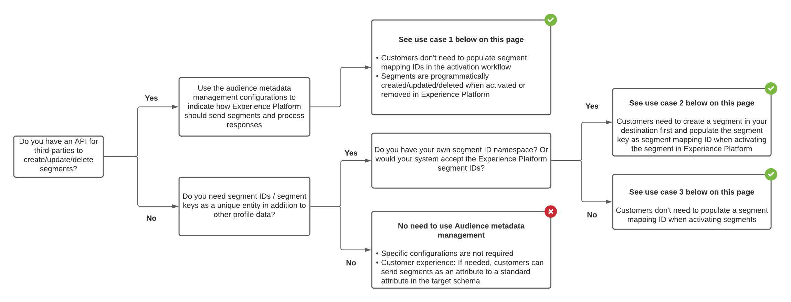

# 대상 메타데이터 관리

대상 메타데이터 템플릿을 사용하여 대상에서 대상을 프로그래밍 방식으로 만들기, 업데이트 또는 삭제합니다. Adobe은 마케팅 API의 사양에 따라 구성할 수 있는 확장 가능한 대상 메타데이터 템플릿을 제공합니다. 구성을 정의, 테스트 및 제출하면 Adobe이 이 구성을 사용하여 대상에 API 호출을 구조화합니다.

이 문서에 설명된 기능을 `/authoring/audience-templates` API 엔드포인트. 읽기 [메타데이터 템플릿 만들기](../metadata-api/create-audience-template.md) 전체 작업 목록을 보려면 종단점에서 수행할 수 있습니다.

## 대상 메타데이터 관리 엔드포인트를 사용해야 하는 경우 {#when-to-use}

API 구성에 따라 Experience Platform에서 대상을 구성할 때 대상 메타데이터 관리 엔드포인트를 사용할 필요가 없거나 사용할 필요가 없을 수 있습니다. 아래 의사 결정 트리 다이어그램을 사용하여 대상 메타데이터 종단점을 사용할 시점과 대상에 대한 대상 메타데이터 템플릿을 구성하는 방법을 이해합니다.



## 대상 메타데이터 관리에서 지원하는 사용 사례 {#use-cases}

Destination SDK의 대상 메타데이터 지원을 통해 Experience Platform 대상을 구성할 때 Platform 사용자에게 세그먼트를 대상에 매핑하고 활성화할 때 몇 가지 옵션 중 하나를 지정할 수 있습니다. 의 매개 변수를 통해 사용자가 사용할 수 있는 옵션을 제어할 수 있습니다 [대상 메타데이터 구성](../functionality/destination-configuration/audience-metadata-configuration.md) 대상 구성의 섹션.

### 사용 사례 1 - 타사 API가 있으며 사용자가 매핑 ID를 입력할 필요가 없습니다

세그먼트나 대상을 생성/업데이트/삭제하는 API 종단점이 있는 경우 대상 메타데이터 템플릿을 사용하여 세그먼트 만들기/업데이트/삭제 종단점의 사양과 일치하도록 Destination SDK을 구성할 수 있습니다. Experience Platform은 프로그래밍 방식으로 세그먼트를 생성/업데이트/삭제하고 메타데이터를 Experience Platform에 다시 동기화할 수 있습니다.

UI(Experience Platform 사용자 인터페이스)에서 세그먼트를 대상에 활성화할 때 활성화 워크플로우의 세그먼트 매핑 ID 필드를 수동으로 채울 필요가 없습니다.

### 사용 사례 2 - 사용자는 먼저 대상에서 세그먼트를 만들어야 하며 수동으로 매핑 ID를 입력해야 합니다

파트너나 사용자가 대상에 수동으로 세그먼트 및 기타 메타데이터를 만들어야 하는 경우, 사용자는 대상 및 Experience Platform 간에 세그먼트 메타데이터를 동기화하려면 활성화 워크플로우의 세그먼트 매핑 ID 필드를 수동으로 입력해야 합니다.


### 사용 사례 3 - 대상이 Experience Platform 세그먼트 ID를 수락하므로 사용자가 매핑 ID를 수동으로 입력할 필요가 없습니다

대상 시스템에서 Experience Platform 세그먼트 ID를 수락하는 경우 대상 메타데이터 템플릿에서 구성할 수 있습니다. 세그먼트를 활성화할 때 세그먼트 매핑 ID를 채우지 않아도 됩니다.

## 범용 및 확장 가능한 대상 템플릿 {#generic-and-extensible}

위에 나열된 사용 사례를 지원하기 위해 Adobe은 API 사양에 맞게 사용자 지정할 수 있는 일반 템플릿을 제공합니다.

일반 템플릿을 사용하여 다음을 수행할 수 있습니다 [새 대상 템플릿 만들기](../metadata-api/create-audience-template.md) api에서 를 지원하는 경우:

* HTTP 메서드: POST, GET, PUT, DELETE, PATCH
* 인증 유형: OAuth 1, OAuth 2(새로 고침 토큰 포함), OAuth 2(베어러 토큰 포함)
* 함수는 대상자 만들기, 대상자 업데이트, 대상자 가져오기, 대상자 삭제, 자격 증명 확인

사용 사례에 필요한 경우 Adobe 엔지니어링 팀은 사용자와 협력하여 사용자 지정 필드로 일반 템플릿을 확장할 수 있습니다.

## 구성 예 {#configuration-examples}

이 섹션에는 구성에 대한 기본 섹션에 대한 설명과 함께 참조를 위한 일반 대상 메타데이터 구성의 세 가지 예가 포함되어 있습니다. URL, 헤더, 요청 및 응답 본문이 세 가지 예제 구성 간에 어떻게 다른지 확인합니다. 이는 세 샘플 플랫폼의 마케팅 API에 대한 서로 다른 사양 때문입니다.

일부 예제의 경우 다음과 같은 매크로 필드가 `{{authData.accessToken}}` 또는 `{{segment.name}}` 는 URL에서 사용되고, 다른 예제는 헤더 또는 요청 본문에서 사용됩니다. 마케팅 API 사양에 따라 다릅니다.

| 템플릿 섹션 | 설명 |
|--- |--- |
| `create` | 플랫폼에서 세그먼트/대상을 프로그래밍 방식으로 만들고 정보를 다시 Adobe Experience Platform에 동기화하기 위해 API에 HTTP를 호출하기 위한 모든 필수 구성 요소(URL, HTTP 메서드, 헤더, 요청 및 응답 본문)를 포함합니다. |
| `update` | Api에 HTTP를 호출하고 플랫폼에서 세그먼트/대상을 프로그래밍 방식으로 업데이트하여 정보를 다시 Adobe Experience Platform에 동기화하기 위해 필요한 모든 구성 요소(URL, HTTP 메서드, 헤더, 요청 및 응답 본문)를 포함합니다. |
| `delete` | API를 프로그래밍 방식으로 호출하여 플랫폼에서 세그먼트/대상을 삭제할 수 있는 모든 필수 구성 요소(URL, HTTP 메서드, 헤더, 요청 및 응답 본문)를 포함합니다. |
| `validate` | 파트너 API를 호출하기 전에 템플릿 구성의 모든 필드에 대한 유효성 검사를 실행합니다. 예를 들어 사용자의 계정 ID가 올바르게 입력되었는지 확인할 수 있습니다. |
| `notify` | 파일 기반 대상에만 적용됩니다. 성공적인 파일 내보내기를 알리는 API를 HTTP로 호출하기 위한 모든 필수 구성 요소(URL, HTTP 메서드, 헤더, 요청 및 응답 본문)를 포함합니다. |

{style="table-layout:auto"}

### 스트리밍 예 1 {#example-1}

```json
{
   "instanceId":"34ab9cc2-2536-44a5-9dc5-b2fea60b3bd6",
   "createdDate":"2021-07-26T19:30:52.012490Z",
   "lastModifiedDate":"2021-07-27T21:25:42.763478Z",
   "metadataTemplate":{
      "create":{
         "url":"https://adsapi.moviestar.com/v1/adaccounts/{{customerData.accountId}}/segments",
         "httpMethod":"POST",
         "headers":[
            {
               "value":"application/json",
               "header":"Content-Type"
            },
            {
               "value":"Bearer {{oauth2ServiceAccessToken}}",
               "header":"Authorization"
            }
         ],
         "requestBody":{
            "json":{
               "segments":[
                  {
                     "name":"{{segment.name}}",
                     "description":"{{segment.description}}",
                     "source_type":"FIRST_PARTY",
                     "ad_account_id":"{{customerData.accountId}}",
                     "retention_in_days":180
                  }
               ]
            }
         },
         "responseFields":[
            {
               "value":"{{body.segments[0].segment.id}}",
               "name":"externalAudienceId"
            }
         ],
         "responseErrorFields":[
            {
               "value":"{{root}}",
               "name":"message"
            }
         ]
      },
      "update":{
         "url":"https://adsapi.moviestar.com/v1/adaccounts/{{customerData.accountId}}/segments/{{segment.alias}}",
         "httpMethod":"PUT",
         "headers":[
            {
               "value":"application/json",
               "header":"Content-Type"
            },
            {
               "value":"Bearer {{oauth2ServiceAccessToken}}",
               "header":"Authorization"
            }
         ],
         "requestBody":{
            "json":{
               "segments":[
                  {
                     "id":"{{segment.alias}}",
                     "name":"{{segment.name}}",
                     "description":"{{segment.description}}"
                  }
               ]
            }
         },
         "responseFields":[
            {
               "value":"{{body.segments[0].segment.id}}",
               "name":"externalAudienceId"
            }
         ],
         "responseErrorFields":[
            {
               "value":"{{root}}",
               "name":"message"
            }
         ]
      },
      "delete":{
         "url":"https://adsapi.moviestar.com/v1/adaccounts/{{customerData.accountId}}/segments/{{segment.alias}}",
         "httpMethod":"DELETE",
         "headers":[
            {
               "value":"application/json",
               "header":"Content-Type"
            },
            {
               "value":"Bearer {{oauth2ServiceAccessToken}}",
               "header":"Authorization"
            }
         ],
         "responseErrorFields":[
            {
               "value":"{{root}}",
               "name":"message"
            }
         ]
      },
      "name":"Moviestar destination audience template - Example 1"
   }
}
```

### 스트리밍 예 2 {#example-2}

```json
{
   "instanceId":"12c78017-5af3-4d4e-8f9c-d330c547c482",
   "createdDate":"2021-07-20T13:27:37.029490Z",
   "lastModifiedDate":"2021-07-20T18:53:03.622306Z",
   "metadataTemplate":{
      "create":{
         "url":"https://api.moviestar.com/v1.0/{{customerData.accountId}}/customaudiences?fields=name,description,account_id&subtype=CUSTOM&name={{segment.name}}&customer_file_source={{segment.metadata.customer_file_source}}&access_token={{authData.accessToken}}",
         "httpMethod":"POST",
         "headers":[
            {
               "value":"application/x-www-form-urlencoded",
               "header":"Content-Type"
            }
         ],
         "responseFields":[
            {
               "value":"{{response.id}}",
               "name":"externalAudienceId"
            }
         ],
         "responseErrorFields":[
            {
               "value":"{{error.message}}",
               "name":"message"
            }
         ]
      },
      "update":{
         "url":"https://api.moviestar.com/v1.0/{{segment.alias}}?field=name,description,account_id&access_token={{authData.accessToken}}&customerAudienceId={{segment.alias}}&&name={{segment.name}}&description={{segment.description}}&customer_file_source={{segment.metadata.customer_file_source}}",
         "httpMethod":"POST",
         "headers":[
            {
               "value":"application/x-www-form-urlencoded",
               "header":"Content-Type"
            }
         ],
         "responseFields":[
            {
               "value":"{{response.id}}",
               "name":"externalAudienceId"
            }
         ],
         "responseErrorFields":[
            {
               "value":"{{error.message}}",
               "name":"message"
            }
         ]
      },
      "delete":{
         "url":"https://api.moviestar.com/v1.0/{{segment.alias}}?fields=name,description,account_id&access_token={{authData.accessToken}}&customerAudienceId={{segment.alias}}",
         "httpMethod":"DELETE",
         "headers":[
            {
               "value":"application/x-www-form-urlencoded",
               "header":"Content-Type"
            }
         ],
         "responseErrorFields":[
            {
               "value":"{{error.message}}",
               "name":"message"
            }
         ]
      },
      "validate":{
         "url":"https://api.moviestar.com/v1.0/permissions?access_token={{authData.accessToken}}",
         "httpMethod":"GET",
         "headers":[
            {
               "value":"application/x-www-form-urlencoded",
               "header":"Content-Type"
            }
         ],
         "responseFields":[
            {
               "value":"{{response.data[0].permission}}",
               "name":"Id"
            }
         ],
         "responseErrorFields":[
            {
               "value":"{{error.message}}",
               "name":"message"
            }
         ]
      }
   }
}
```

### 스트리밍 예 3 {#example-3}

```json
{
   "instanceId":"12a3238f-b509-4a40-b8fb-0a5006e7901d",
   "createdDate":"2021-07-20T13:30:30.843054Z",
   "lastModifiedDate":"2021-07-21T16:33:05.787472Z",
   "metadataTemplate":{
      "create":{
         "url":"https://api.moviestar.com/v2/dmpSegments",
         "httpMethod":"POST",
         "headers":[
            {
               "value":"application/json",
               "header":"Content-Type"
            },
            {
               "value":"Bearer {{authData.accessToken}}",
               "header":"Authorization"
            }
         ],
         "requestBody":{
            "json":{
               "name":"{{segment.name}}",
               "type":"USER",
               "account":"{{customerData.accountId}}",
               "accessPolicy":"PRIVATE",
               "destinations":[
                  {
                     "destination":"MOVIESTAR"
                  }
               ],
               "sourcePlatform":"ADOBE"
            }
         },
         "responseFields":[
            {
               "value":"{{headers.x-moviestar-id}}",
               "name":"externalAudienceId"
            }
         ],
         "responseErrorFields":[
            {
               "value":"{{message}}",
               "name":"message"
            }
         ]
      },
      "update":{
         "url":"https://api.moviestar.com/v2/dmpSegments/{{segment.alias}}",
         "httpMethod":"POST",
         "headers":[
            {
               "value":"application/json",
               "header":"Content-Type"
            },
            {
               "value":"Bearer {{authData.accessToken}}",
               "header":"Authorization"
            }
         ],
         "requestBody":{
            "json":{
               "patch":{
                  "$set":{
                     "name":"{{segment.name}}"
                  }
               }
            }
         },
         "responseErrorFields":[
            {
               "value":"{{message}}",
               "name":"message"
            }
         ]
      },
      "delete":{
         "url":"https://api.moviestar.com/v2/dmpSegments/{{segment.alias}}",
         "httpMethod":"DELETE",
         "headers":[
            {
               "value":"application/json",
               "header":"Content-Type"
            },
            {
               "value":"Bearer {{authData.accessToken}}",
               "header":"Authorization"
            }
         ],
         "responseErrorFields":[
            {
               "value":"{{message}}",
               "name":"message"
            }
         ]
      },
      "name":"Moviestar audience template - Third example"
   }
}
```


### 파일 기반 예 {#example-file-based}

```json
{
   "instanceId":"34ab9cc2-2536-44a5-9dc5-b2fea60b3bd6",
   "createdDate":"2021-07-26T19:30:52.012490Z",
   "lastModifiedDate":"2021-07-27T21:25:42.763478Z",
   "metadataTemplate":{
      "create":{
         "url":"https://adsapi.moviestar.com/v1/adaccounts/{{customerData.accountId}}/segments",
         "httpMethod":"POST",
         "headers":[
            {
               "value":"application/json",
               "header":"Content-Type"
            },
            {
               "value":"Bearer {{oauth2ServiceAccessToken}}",
               "header":"Authorization"
            }
         ],
         "requestBody":{
            "json":{
               "segments":[
                  {
                     "name":"{{segment.name}}",
                     "description":"{{segment.description}}",
                     "source_type":"FIRST_PARTY",
                     "ad_account_id":"{{customerData.accountId}}",
                     "retention_in_days":180
                  }
               ]
            }
         },
         "responseFields":[
            {
               "value":"{{body.segments[0].segment.id}}",
               "name":"externalAudienceId"
            }
         ],
         "responseErrorFields":[
            {
               "value":"{{root}}",
               "name":"message"
            }
         ]
      },
      "update":{
         "url":"https://adsapi.moviestar.com/v1/adaccounts/{{customerData.accountId}}/segments/{{segment.alias}}",
         "httpMethod":"PUT",
         "headers":[
            {
               "value":"application/json",
               "header":"Content-Type"
            },
            {
               "value":"Bearer {{oauth2ServiceAccessToken}}",
               "header":"Authorization"
            }
         ],
         "requestBody":{
            "json":{
               "segments":[
                  {
                     "id":"{{segment.alias}}",
                     "name":"{{segment.name}}",
                     "description":"{{segment.description}}"
                  }
               ]
            }
         },
         "responseFields":[
            {
               "value":"{{body.segments[0].segment.id}}",
               "name":"externalAudienceId"
            }
         ],
         "responseErrorFields":[
            {
               "value":"{{root}}",
               "name":"message"
            }
         ]
      },
      "notify":{
         "url":"https://adsapi.moviestar.com/v1/adaccounts/{{customerData.accountId}}/segments/{{segment.alias}}",
         "httpMethod":"PUT",
         "headers":[
            {
               "value":"application/json",
               "header":"Content-Type"
            },
            {
               "value":"Bearer {{oauth2ServiceAccessToken}}",
               "header":"Authorization"
            }
         ],
         "requestBody":{
            "json":{
               "segments":[
                  {
                     "id":"{{segment.alias}}",
                     "name":"{{segment.name}}",
                     "description":"{{segment.description}}"
                  }
               ]
            }
         },
         "responseFields":[
            {
               "value":"{{body.segments[0].segment.id}}",
               "name":"externalAudienceId"
            }
         ],
         "responseErrorFields":[
            {
               "value":"{{root}}",
               "name":"message"
            }
         ]
      },
      "delete":{
         "url":"https://adsapi.moviestar.com/v1/adaccounts/{{customerData.accountId}}/segments/{{segment.alias}}",
         "httpMethod":"DELETE",
         "headers":[
            {
               "value":"application/json",
               "header":"Content-Type"
            },
            {
               "value":"Bearer {{oauth2ServiceAccessToken}}",
               "header":"Authorization"
            }
         ],
         "responseErrorFields":[
            {
               "value":"{{root}}",
               "name":"message"
            }
         ]
      },
      "name":"Moviestar destination audience template - Example 1"
   }
}
```

템플릿에서 모든 매개 변수에 대한 설명을 찾습니다. [대상 템플릿 만들기](../metadata-api/create-audience-template.md) API 참조.

## 대상 메타데이터 템플릿에 사용된 매크로

세그먼트 ID, 액세스 토큰, 오류 메시지 등과 같은 정보를 Experience Platform과 API 간에 전달하기 위해 대상 템플릿에는 사용할 수 있는 매크로가 포함됩니다. 이 페이지의 세 가지 구성 예에서 사용되는 매크로에 대한 설명은 아래 참조 하십시오.

| 매크로 | 설명 |
|--- |--- |
| `{{segment.alias}}` | Experience Platform에서 세그먼트 별칭에 액세스할 수 있습니다. |
| `{{segment.name}}` | Experience Platform에서 세그먼트 이름에 액세스할 수 있습니다. |
| `{{segment.id}}` | Experience Platform에서 세그먼트 ID에 액세스할 수 있습니다. |
| `{{customerData.accountId}}` | 대상 구성에서 설정한 계정 ID 필드에 액세스할 수 있습니다. |
| `{{oauth2ServiceAccessToken}}` | OAuth 2 구성을 기반으로 액세스 토큰을 동적으로 생성할 수 있습니다. |
| `{{authData.accessToken}}` | 액세스 토큰을 API 엔드포인트에 전달할 수 있습니다. 사용 `{{authData.accessToken}}` Experience Platform이 만료되지 않은 토큰을 사용하여 대상에 연결해야 하는 경우, 그렇지 않으면 `{{oauth2ServiceAccessToken}}` 액세스 토큰을 생성합니다. |
| `{{body.segments[0].segment.id}}` | 생성된 대상자의 고유 식별자를 키 값으로 반환합니다 `externalAudienceId`. |
| `{{error.message}}` | Experience Platform UI에서 사용자에게 표시될 오류 메시지를 반환합니다. |

{style="table-layout:auto"}
