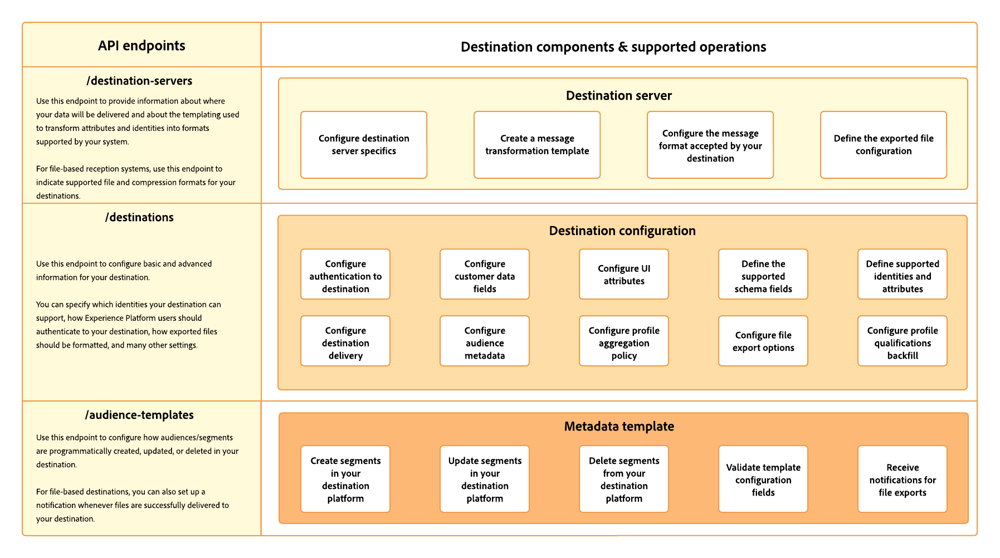

# Destination SDK의 구성 옵션

Adobe Experience Platform의 대상 서비스는 대상 기능을 빌드하는 여러 구성 요소에 대한 구성 끝점을 사용합니다.

이러한 구성 요소를 결합하면 Experience Platform이 대상 플랫폼에 연결하고, 사용자 지정 메시지를 보내고, 사용자 지정 파일을 내보내고, 디지털 에코시스템에서 프로필 데이터를 활성화할 수 있습니다.

아래 다이어그램은 Destination SDK을 통해 구성하여 고유한 대상을 구축할 수 있는 구성 요소에 대한 높은 수준의 개요를 보여 줍니다. 이러한 구성 요소에 대해서는 아래에서 자세히 설명합니다.

## 서버 구성 {#server-configuration}

대상 서버 구성은 서버 사양 및 대상에 페이로드를 전달하기 위해 Adobe에서 사용하는 템플릿에 대한 정보를 결합합니다.

예를 들어 여기에서 Experience Platform이 연결해야 하는 사용자 측의 API 엔드포인트, 플랫폼이 수행할 API 호출의 헤더 및 형식을 지정할 수 있습니다.

파일 기반 대상의 경우 이 구성에는 대상에 대해 지원되는 파일 형식 및 압축 형식도 포함됩니다. 다음을 통해 아래에 설명된 기능을 구성할 수 있습니다 [destination-servers 끝점](../authoring-api/destination-server/create-destination-server.md).

* [서버 사양](destination-server/server-specs.md): 데이터가 전송되는 저장소 위치 또는 HTTP 끝점에 대한 정보가 포함된 구성 템플릿입니다.
* [템플릿 사양](destination-server/templating-specs.md): 이 템플릿에서는 XDM 스키마와 플랫폼이 지원하는 형식 간에 프로필 속성 필드를 변환하는 방법을 포함하여 엔드포인트에 대한 HTTP API 요청을 구조화하는 방법을 정의할 수 있습니다. 이 정보를 [메시지 포맷](destination-server/message-format.md) 설명서를 참조하십시오.
* [메시지 포맷](destination-server/message-format.md): 이 섹션에서는 지원되는 템플릿 언어, 메시지 형식 및 플랫폼과의 통합을 설정하는 데 필요한 Adobe에 대한 심층적인 정보를 다룹니다. 이 정보를 [템플릿 사양](destination-server/templating-specs.md) 설명서를 참조하십시오.
* [파일 사양](destination-server/file-formatting.md): 배치 대상의 파일 형식 지정 및 압축 옵션이 포함된 구성 템플릿입니다.

## 대상 구성 {#destination-configuration}

이 구성 끝점에는 대상에 대한 기본 정보와 고급 정보가 포함되어 있습니다. 예를 들어, Adobe Experience Platform 사용자 인터페이스에서 대상이 지원할 수 있는 ID 유형, 내보낸 파일의 원하는 형식(파일 기반 대상의 경우) 및 대상 카드에 대한 다양한 UI 속성을 지정할 수 있습니다.

각 대상 구성 요소에 대한 자세한 내용은 아래 설명서를 참조하십시오. 다음을 통해 아래에 설명된 기능을 구성할 수 있습니다 [대상 엔드포인트](../authoring-api/destination-configuration/create-destination-configuration.md).

* [고객 인증 구성](destination-configuration/customer-authentication.md): Experience Platform이 대상에 연결하는 데 사용해야 하는 인증 메커니즘을 선택합니다. 이 구성은 [새 대상 구성](../../ui/connect-destination.md) Experience Platform을 대상이 있는 계정에 연결하는 Experience Platform 사용자 인터페이스의 페이지입니다.
* [OAuth2 인증](destination-configuration/oauth2-authentication.md): 모든 항목에 대해 알아보기 [!DNL OAuth2] Destination SDK에서 지원하는 인증 흐름 및 설정에 대한 지침 받기 [!DNL OAuth2] 대상에 대한 인증..
* [고객 데이터 필드](destination-configuration/customer-data-fields.md): 사용자가 대상에 데이터를 연결하고 내보내는 방법과 관련된 다양한 정보를 지정할 수 있도록 Experience Platform UI에서 입력 필드를 만드는 방법을 알아봅니다.
* [UI 속성](destination-configuration/ui-attributes.md): Destination SDK으로 빌드된 대상의 설명서 링크, 대상 카드 카테고리, 대상 연결 유형 및 빈도와 같은 UI 속성을 구성하는 방법을 알아봅니다.
* [스키마 구성](destination-configuration/schema-configuration.md): 사용자가 프로필 속성 및 ID를 매핑할 수 있는 대상의 타겟 스키마를 정의하는 방법을 알아봅니다.
* [ID 네임스페이스 구성](destination-configuration/identity-namespace-configuration.md): 대상에서 지원하는 ID를 구성하는 방법을 알아봅니다. 이 구성은 의 타겟 ID를 채웁니다. [매핑 단계](../../ui/activate-segment-streaming-destinations.md#mapping) XDM 스키마의 ID 및 속성을 대상의 스키마에 매핑하는 Experience Platform 사용자 인터페이스의 .
* [대상 게재](destination-configuration/destination-delivery.md): 내보낸 데이터의 정확한 위치와 데이터가 도착하는 위치에서 사용되는 인증 규칙을 구성하는 방법을 알아봅니다.
* [대상 메타데이터 구성](destination-configuration/audience-metadata-configuration.md): 세그먼트 이름 또는 ID와 같은 Experience Platform 메타데이터를 세그먼트와 대상 간에 공유하는 방법에 대해 알아봅니다.
* [집계 정책](destination-configuration/aggregation-policy.md): 대상에 대한 HTTP 요청을 그룹화하고 일괄 처리하는 방법을 결정하는 집계 정책을 설정하는 방법에 대해 알아봅니다.
* [일괄 처리 구성](destination-configuration/batch-configuration.md): Experience Platform 사용자 인터페이스에서 대상에 연결할 때 사용자가 사용할 수 있는 다양한 파일 이름 지정 및 내보내기 예약 설정을 구성합니다.
* [과거 프로필 자격 요건](destination-configuration/historical-profile-qualifications.md): Destination SDK으로 빌드된 대상에서 지원하는 내역 프로필 자격에 대해 알아봅니다.

## 대상 메타데이터 구성 {#audience-metadata-configuration}

이 구성 요소를 사용하여 대상에서 대상/세그먼트를 프로그래밍 방식으로 생성, 업데이트 또는 삭제하는 방법을 구성할 수 있습니다. 파일 기반 대상의 경우 파일이 대상에 성공적으로 전달될 때마다 알림을 설정할 수 있습니다. 다음을 통해 이 기능을 구성할 수 있습니다. [대상 템플릿 끝점](../metadata-api/create-audience-template.md).

## 다음 단계 {#next-steps}

이 문서를 읽으면 이제 Destination SDK에서 제공하는 기능에 대한 일반적인 개요와 특정 구성에 대한 자세한 내용을 보기 위해 읽을 페이지를 얻을 수 있습니다. 다음으로, 다음의 모든 단계를 포함하는 안내서를 읽을 수 있습니다. [스트리밍 구성](../guides/configure-destination-instructions.md) 또는 [파일 기반 대상](../guides/configure-file-based-destination-instructions.md) Destination SDK 사용.
