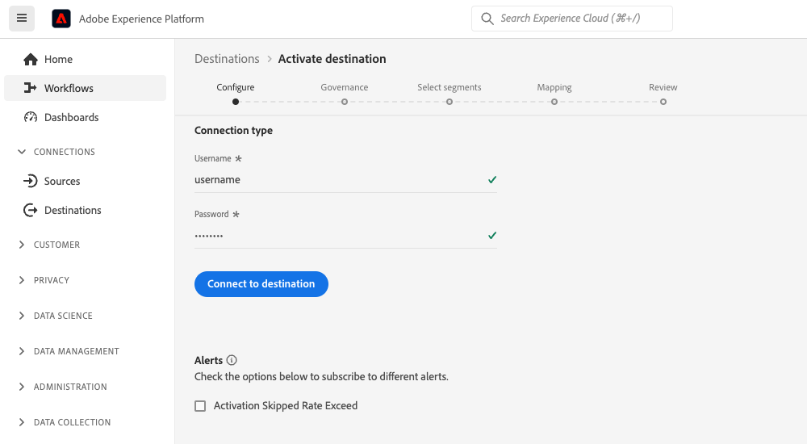
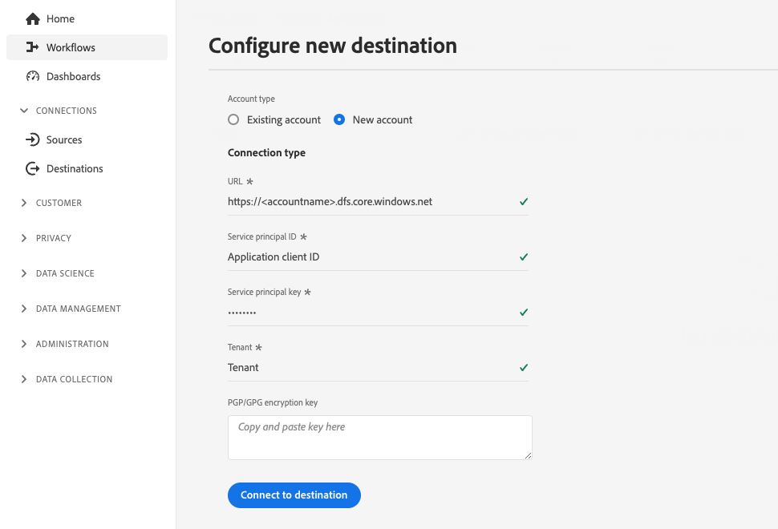

# 고객 인증 구성

Experience Platform은 파트너와 고객이 사용할 수 있는 인증 프로토콜을 유연하게 제공합니다. [!DNL OAuth2], 전달자 토큰 인증, 암호 인증 등과 같은 업계 표준 인증 방법을 지원하도록 대상을 구성할 수 있습니다.

이 페이지에서는 기본 설정 인증 방법을 사용하여 대상을 설정하는 방법을 설명합니다. 대상을 만들 때 사용하는 인증 구성에 따라 Experience Platform UI에서 대상에 연결할 때 고객에게 다른 유형의 인증 페이지가 표시됩니다.

이 구성 요소가 Destination SDK으로 만든 통합에 어디에 맞는지 이해하려면 [구성 옵션](../configuration-options.md) 설명서의 다이어그램을 참조하거나 다음 대상 구성 개요 페이지를 참조하십시오.

* [Destination SDK을 사용하여 스트리밍 대상 구성](../../guides/configure-destination-instructions.md#create-destination-configuration)
* [Destination SDK을 사용하여 파일 기반 대상 구성](../../guides/configure-file-based-destination-instructions.md#create-destination-configuration)

고객이 플랫폼에서 대상으로 데이터를 내보내려면 먼저 [대상 연결](../../../ui/connect-destination.md) 자습서에 설명된 단계를 따라 Experience Platform과 대상 간에 새로운 연결을 만들어야 합니다.

Destination SDK을 통해 [대상을 만들기](../../authoring-api/destination-configuration/create-destination-configuration.md)할 때 `customerAuthenticationConfigurations` 섹션은 고객이 [인증 화면](../../../ui/connect-destination.md#authenticate)에서 보는 항목을 정의합니다. 대상 인증 유형에 따라 고객은 다음과 같은 다양한 인증 세부 정보를 제공해야 합니다.

* [기본 인증](#basic)을 사용하는 대상의 경우 Experience Platform UI 인증 페이지에서 사용자 이름과 암호를 직접 제공해야 합니다.
* [전달자 인증](#bearer)을 사용하는 대상의 경우 사용자는 전달자 토큰을 제공해야 합니다.
* [OAuth2 인증](#oauth2)을 사용하는 대상의 경우 사용자는 자격 증명으로 로그인할 수 있는 대상의 로그인 페이지로 리디렉션됩니다.
* [Amazon S3](#s3) 대상의 경우 사용자는 [!DNL Amazon S3] 액세스 키와 비밀 키를 제공해야 합니다.
* [Azure Blob](#blob) 대상의 경우 사용자가 [!DNL Azure Blob] 연결 문자열을 제공해야 합니다.

`/authoring/destinations` 끝점을 통해 고객 인증 세부 정보를 구성할 수 있습니다. 이 페이지에 표시된 구성 요소를 구성할 수 있는 자세한 API 호출 예는 다음 API 참조 페이지를 참조하십시오.

* [대상 구성 만들기](../../authoring-api/destination-configuration/create-destination-configuration.md)
* [대상 구성 업데이트](../../authoring-api/destination-configuration/update-destination-configuration.md)

이 문서에서는 대상에 사용할 수 있는 지원되는 모든 고객 인증 구성에 대해 설명하고 대상에 대해 설정한 인증 방법을 기반으로 Experience Platform UI에서 고객이 보게 되는 내용을 보여줍니다.

>[!IMPORTANT]
>
>고객 인증 구성에서는 매개 변수를 구성할 필요가 없습니다. 대상 구성을 [생성](../../authoring-api/destination-configuration/create-destination-configuration.md) 또는 [업데이트](../../authoring-api/destination-configuration/update-destination-configuration.md)할 때 API 호출에서 이 페이지에 표시된 코드 조각을 복사하여 붙여 넣을 수 있으며 사용자가 Platform UI에서 해당 인증 화면을 보게 됩니다.

>[!IMPORTANT]
>
>Destination SDK에서 지원하는 모든 매개 변수 이름과 값은 **대/소문자를 구분합니다**. 대소문자 구분 오류를 방지하려면 설명서에 표시된 대로 매개 변수 이름과 값을 정확히 사용하십시오.

## 지원되는 통합 유형 {#supported-integration-types}

이 페이지에 설명된 기능을 지원하는 통합 유형에 대한 자세한 내용은 아래 표를 참조하십시오.

| 통합 유형 | 기능 지원 |
|---|---|
| 실시간(스트리밍) 통합 | 예 |
| 파일 기반 (일괄 처리) 통합 | 예 |

## 인증 규칙 구성 {#authentication-rule}

이 페이지에 설명된 고객 인증 구성을 사용하는 경우 항상 아래와 같이 [대상 게재](destination-delivery.md)의 `authenticationRule` 매개 변수를 `"CUSTOMER_AUTHENTICATION"`(으)로 설정하십시오.

```json {line-numbers="true" highlight="4"
{
   "destinationDelivery":[
      {
         "authenticationRule":"CUSTOMER_AUTHENTICATION",
         "destinationServerId":"{{destinationServerId}}"
      }
   ]
}
```

## 기본 인증 {#basic}

Experience Platform에서의 실시간(스트리밍) 통합에 대해 기본 인증이 지원됩니다.

기본 인증 유형을 구성할 때 사용자는 대상에 연결하기 위해 사용자 이름과 암호를 입력해야 합니다.



대상에 대한 기본 인증을 설정하려면 아래와 같이 `/destinations` 끝점을 통해 `customerAuthenticationConfigurations` 섹션을 구성하십시오.

```json
"customerAuthenticationConfigurations":[
   {
      "authType":"BASIC"
   }
]
```

## 전달자 인증 {#bearer}

전달자 인증 유형을 구성할 때 사용자는 대상에서 얻은 전달자 토큰을 입력해야 합니다.


대상에 대한 전달자 유형 인증을 설정하려면 아래와 같이 `/destinations` 끝점을 통해 `customerAuthenticationConfigurations` 섹션을 구성하십시오.

```json
"customerAuthenticationConfigurations":[
   {
      "authType":"BEARER"
   }
]
```

## OAuth 2 인증 {#oauth2}

twitter 사용자 지정 대상 대상에 대해 아래 예와 같이 대상에 대한 OAuth 2 인증 흐름을 트리거하려면 **[!UICONTROL 대상에 연결]**&#x200B;을 선택합니다. 대상 끝점에 대한 OAuth 2 인증 구성에 대한 자세한 내용은 전용 [Destination SDK OAuth 2 인증 페이지](oauth2-authorization.md)를 참조하십시오.


대상에 대해 [!DNL OAuth2] 인증을 설정하려면 아래와 같이 `/destinations` 끝점을 통해 `customerAuthenticationConfigurations` 섹션을 구성하십시오.

```json
"customerAuthenticationConfigurations":[
   {
      "authType":"OAUTH2"
   }
]
```

## Amazon S3 인증 {#s3}

Experience Platform의 파일 기반 대상에 대해 [!DNL Amazon S3] 인증이 지원됩니다.

Amazon S3 인증 유형을 구성할 때 사용자는 S3 자격 증명을 입력해야 합니다.


대상에 대해 [!DNL Amazon S3] 인증을 설정하려면 아래와 같이 `/destinations` 끝점을 통해 `customerAuthenticationConfigurations` 섹션을 구성하십시오.

```json
"customerAuthenticationConfigurations":[
   {
      "authType":"S3"
   }
]
```

## Azure Blob 인증  {#blob}

Experience Platform의 파일 기반 대상에 대해 [!DNL Azure Blob Storage] 인증이 지원됩니다.

Azure Blob 인증 유형을 구성할 때 사용자가 연결 문자열을 입력해야 합니다.

Blob 인증을 사용하여 

대상에 대한 [!DNL Azure Blob] 인증을 설정하려면 아래와 같이 `/destinations` 끝점에서 `customerAuthenticationConfigurations` 매개 변수를 구성하십시오.

```json
"customerAuthenticationConfigurations":[
   {
      "authType":"AZURE_CONNECTION_STRING"
   }
]
```

## [!DNL Azure Data Lake Storage] 인증 {#adls}

Experience Platform의 파일 기반 대상에 대해 [!DNL Azure Data Lake Storage] 인증이 지원됩니다.

[!DNL Azure Data Lake Storage] 인증 유형을 구성할 때 사용자는 Azure Service Principal 자격 증명과 테넌트 정보를 입력해야 합니다.

[!DNL Azure Data Lake Storage] 인증을 사용하여 

대상에 대한 [!DNL Azure Data Lake Storage](ADLS) 인증을 설정하려면 아래와 같이 `/destinations` 끝점에서 `customerAuthenticationConfigurations` 매개 변수를 구성하십시오.

```json
"customerAuthenticationConfigurations":[
   {
      "authType":"AZURE_SERVICE_PRINCIPAL"
   }
]
```

## 암호 인증이 있는 SFTP

Experience Platform의 파일 기반 대상에 대해 암호가 포함된 [!DNL SFTP] 인증이 지원됩니다.

암호 인증 유형으로 SFTP를 구성할 때 사용자는 SFTP 사용자 이름과 암호와 SFTP 도메인 및 포트(기본 포트: 22)를 입력해야 합니다.

암호 인증을 통해 SFTP를 통해 

대상에 대해 암호를 사용하여 SFTP 인증을 설정하려면 아래와 같이 `/destinations` 끝점에서 `customerAuthenticationConfigurations` 매개 변수를 구성하십시오.

```json
"customerAuthenticationConfigurations":[
   {
      "authType":"SFTP_WITH_PASSWORD"
   }
]
```

## SSH 키 인증이 있는 SFTP

Experience Platform의 파일 기반 대상에 대해 [!DNL SSH] 키를 사용하는 [!DNL SFTP] 인증이 지원됩니다.

SSH 키 인증 유형으로 SFTP를 구성할 경우 사용자는 SFTP 사용자 이름과 SSH 키, SFTP 도메인 및 포트(기본 포트: 22)를 입력해야 합니다.


대상에 대해 SSH 키를 사용하여 SFTP 인증을 설정하려면 아래와 같이 `/destinations` 끝점에서 `customerAuthenticationConfigurations` 매개 변수를 구성하십시오.

```json
"customerAuthenticationConfigurations":[
   {
      "authType":"SFTP_WITH_SSH_KEY"
   }
]
```

## [!DNL Google Cloud Storage] 인증 {#gcs}

Experience Platform의 파일 기반 대상에 대해 [!DNL Google Cloud Storage] 인증이 지원됩니다.

[!DNL Google Cloud Storage] 인증 유형을 구성할 때 사용자는 [!DNL Google Cloud Storage] [!UICONTROL 액세스 키 ID] 및 [!UICONTROL 비밀 액세스 키]를 입력해야 합니다.


대상에 대한 [!DNL Google Cloud Storage] 인증을 설정하려면 아래와 같이 `/destinations` 끝점에서 `customerAuthenticationConfigurations` 매개 변수를 구성하십시오.

```json
"customerAuthenticationConfigurations":[
   {
      "authType":"GOOGLE_CLOUD_STORAGE"
   }
]
```

## 다음 단계 {#next-steps}

이 문서를 읽은 후에는 대상 플랫폼에 사용자 인증을 구성하는 방법을 더 잘 이해할 수 있어야 합니다.

다른 대상 구성 요소에 대한 자세한 내용은 다음 문서를 참조하십시오.

* [OAuth2 인증](oauth2-authorization.md)
* [고객 데이터 필드](customer-data-fields.md)
* [UI 속성](ui-attributes.md)
* [스키마 구성](schema-configuration.md)
* [ID 네임스페이스 구성](identity-namespace-configuration.md)
* [지원되는 매핑 구성](supported-mapping-configurations.md)
* [대상 게재](destination-delivery.md)
* [대상 메타데이터 구성](audience-metadata-configuration.md)
* [집계 정책](aggregation-policy.md)
* [일괄 처리 구성](batch-configuration.md)
* [과거 프로필 자격 요건](historical-profile-qualifications.md)
