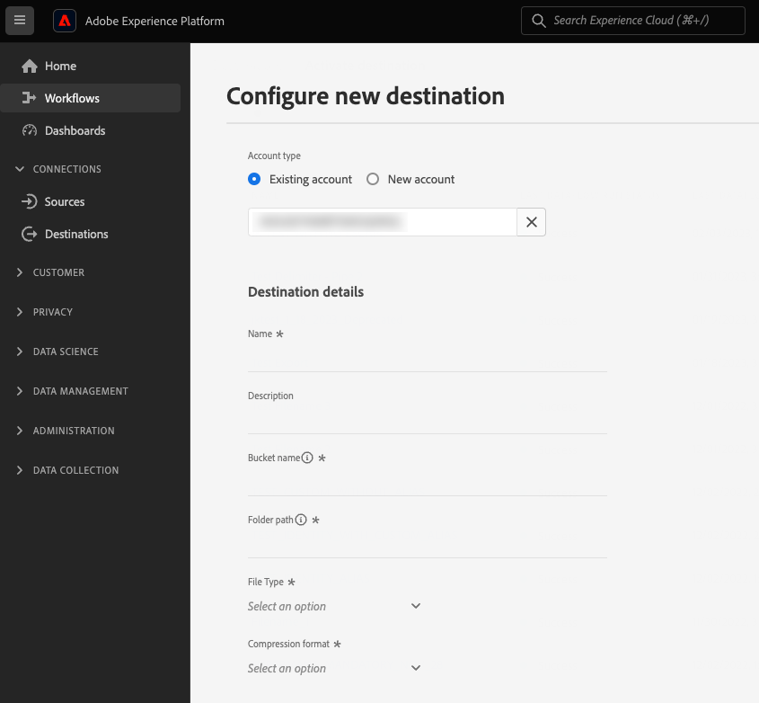

# 고객 데이터 필드를 통해 사용자 입력 구성

Experience Platform UI에서 대상에 연결할 때 사용자가 특정 구성 세부 정보를 제공하거나 사용할 수 있는 특정 옵션을 선택해야 할 수 있습니다. Destination SDK에서 이러한 옵션을 고객 데이터 필드라고 합니다.

이 구성 요소가 Destination SDK으로 만든 통합에 어디에 맞는지 이해하려면 의 다이어그램을 참조하십시오. [구성 옵션](../configuration-options.md) 설명서 또는 다음 대상 구성 개요 페이지를 참조하십시오.

* [Destination SDK을 사용하여 스트리밍 대상 구성](../../guides/configure-destination-instructions.md#create-destination-configuration)
* [Destination SDK을 사용하여 파일 기반 대상 구성](../../guides/configure-file-based-destination-instructions.md#create-destination-configuration)

## 고객 데이터 필드에 대한 사용 사례 {#use-cases}

사용자가 Experience Platform UI에 데이터를 입력해야 하는 다양한 사용 사례에 대해 고객 데이터 필드를 사용하십시오. 예를 들어, 사용자가 다음을 제공해야 하는 경우 고객 데이터 필드를 사용하십시오.

* 파일 기반 대상을 위한 클라우드 스토리지 버킷 이름 및 경로.
* 고객 데이터 필드에서 허용하는 형식입니다.
* 사용자가 선택할 수 있는 사용 가능한 파일 압축 유형입니다.
* 실시간(스트리밍) 통합을 위해 사용 가능한 엔드포인트 목록입니다.

다음을 통해 고객 데이터 필드를 구성할 수 있습니다. `/authoring/destinations` 엔드포인트. 이 페이지에 표시된 구성 요소를 구성할 수 있는 자세한 API 호출 예는 다음 API 참조 페이지를 참조하십시오.

* [대상 구성 만들기](../../authoring-api/destination-configuration/create-destination-configuration.md)
* [대상 구성 업데이트](../../authoring-api/destination-configuration/update-destination-configuration.md)

이 문서에서는 대상에 사용할 수 있는 지원되는 모든 고객 데이터 필드 구성 유형에 대해 설명하고 고객이 Experience Platform UI에서 보게 되는 내용을 보여줍니다.

>[!IMPORTANT]
>
>Destination SDK에서 지원하는 모든 매개변수 이름 및 값은 다음과 같습니다. **대소문자 구분**. 대소문자 구분 오류를 방지하려면 설명서에 표시된 대로 매개 변수 이름과 값을 정확히 사용하십시오.

## 지원되는 통합 유형 {#supported-integration-types}

이 페이지에 설명된 기능을 지원하는 통합 유형에 대한 자세한 내용은 아래 표를 참조하십시오.

| 통합 유형 | 기능 지원 |
|---|---|
| 실시간(스트리밍) 통합 | 예 |
| 파일 기반 (일괄 처리) 통합 | 예 |

## 지원되는 매개 변수 {#supported-parameters}

고유한 고객 데이터 필드를 만들 때 아래 표에 설명된 매개 변수를 사용하여 해당 동작을 구성할 수 있습니다.

| 매개변수 | 유형 | 필수/선택적 | 설명 |
|---------|----------|------|---|
| `name` | 문자열 | 필수 여부 | 도입 중인 사용자 정의 필드의 이름을 입력합니다. 이 이름은 `title` 필드가 비어 있거나 누락되었습니다. |
| `type` | 문자열 | 필수 여부 | 도입 중인 사용자 정의 필드의 유형을 나타냅니다. 허용된 값: <ul><li>`string`</li><li>`object`</li><li>`integer`</li></ul> |
| `title` | 문자열 | 선택 사항입니다 | Platform UI에서 고객에게 표시되는 필드의 이름을 나타냅니다. 이 필드가 비어 있거나 누락된 경우 UI는에서 필드 이름을 상속합니다. `name` 값. |
| `description` | 문자열 | 선택 사항입니다 | 사용자 정의 필드에 대한 설명을 입력합니다. 이 설명은 Platform UI에 표시되지 않습니다. |
| `isRequired` | 부울 | 선택 사항입니다 | 사용자가 대상 구성 워크플로우에서 이 필드에 대한 값을 제공해야 하는지 여부를 나타냅니다. |
| `pattern` | 문자열 | 선택 사항입니다 | 필요한 경우 사용자 정의 필드에 패턴을 적용합니다. 패턴을 적용하려면 정규 표현식을 사용하십시오. 예를 들어 고객 ID에 숫자나 밑줄이 포함되지 않은 경우 을 입력합니다 `^[A-Za-z]+$` 이 필드에서. |
| `enum` | 문자열 | 선택 사항입니다 | 사용자 정의 필드를 드롭다운 메뉴로 렌더링하고 사용자가 사용할 수 있는 옵션을 나열합니다. |
| `default` | 문자열 | 선택 사항입니다 | 에서 기본값 정의 `enum` 목록을 표시합니다. |
| `hidden` | 부울 | 선택 사항입니다 | 고객 데이터 필드를 UI에 표시할지 여부를 나타냅니다. |
| `unique` | 부울 | 선택 사항입니다 | 사용자 조직에서 설정한 모든 대상 데이터 흐름에서 값이 고유한 고객 데이터 필드를 생성해야 하는 경우 이 매개변수를 사용합니다. 예를 들면 **[!UICONTROL 사용자 정의 개인 설정]** 대상의 [통합 별칭](../../../catalog/personalization/custom-personalization.md) 필드는 고유해야 하며, 이 대상으로 전송되는 두 개의 개별 데이터 흐름은 이 필드에 대해 동일한 값을 가질 수 없습니다. |
| `readOnly` | 부울 | 선택 사항입니다 | 고객이 필드의 값을 변경할 수 있는지 여부를 나타냅니다. |

{style="table-layout:auto"}

아래 예에서는 `customerDataFields` 섹션은 사용자가 대상에 연결할 때 Platform UI에 입력해야 하는 두 개의 필드를 정의합니다.

* `Account ID`: 대상 플랫폼에 대한 사용자 계정 ID입니다.
* `Endpoint region`: 연결할 API의 지역 종단점입니다. 다음 `enum` 섹션은 사용자가 선택할 수 있는 내에 정의된 값으로 드롭다운 메뉴를 만듭니다.

```json
"customerDataFields":[
   {
      "name":"accountID",
      "title":"User account ID",
      "description":"User account ID for the destination platform.",
      "type":"string",
      "isRequired":true
   },
   {
      "name":"region",
      "title":"API endpoint region",
      "description":"The API endpoint region that the user should connect to.",
      "type":"string",
      "isRequired":true,
      "enum":[
         "EU"
         "US",
      ],
      "readOnly":false,
      "hidden":false
   }
]
```

결과 UI 경험이 아래 이미지에 표시됩니다.


## 대상 연결 이름 및 설명 {#names-description}

새 대상을 만들 때 Destination SDK이 자동으로 을 추가합니다 **[!UICONTROL 이름]** 및 **[!UICONTROL 설명]** 플랫폼 UI의 대상 연결 화면에 대한 필드입니다. 위의 예에서 볼 수 있듯이 **[!UICONTROL 이름]** 및 **[!UICONTROL 설명]** 필드는 고객 데이터 필드 구성에 포함되지 않고 UI에서 렌더링됩니다.

>[!IMPORTANT]
>
>을(를) 추가하면 **[!UICONTROL 이름]** 및 **[!UICONTROL 설명]** 고객 데이터 필드 구성의 필드에는 UI에 중복되는 필드가 표시됩니다.

## 고객 데이터 필드 주문 {#ordering}

대상 구성에서 고객 데이터 필드를 추가하는 순서는 Platform UI에 반영됩니다.

예를 들어 아래 구성은 옵션이 순서대로 표시되는 UI에 그에 따라 반영됩니다 **[!UICONTROL 이름]**, **[!UICONTROL 설명]**, **[!UICONTROL 버킷 이름]**, **[!UICONTROL 폴더 경로]**, **[!UICONTROL 파일 유형]**, **[!UICONTROL 압축 포맷]**.

```json
"customerDataFields":[
{
   "name":"bucketName",
   "title":"Bucket name",
   "description":"Amazon S3 bucket name",
   "type":"string",
   "isRequired":true,
   "pattern":"(?=^.{3,63}$)(?!^(\\d+\\.)+\\d+$)(^(([a-z0-9]|[a-z0-9][a-z0-9\\-]*[a-z0-9])\\.)*([a-z0-9]|[a-z0-9][a-z0-9\\-]*[a-z0-9])$)",
   "readOnly":false,
   "hidden":false
},
{
   "name":"path",
   "title":"Folder path",
   "description":"Enter the path to your S3 bucket folder",
   "type":"string",
   "isRequired":true,
   "pattern":"^[0-9a-zA-Z\\/\\!\\-_\\.\\*\\''\\(\\)]*((\\%SEGMENT_(NAME|ID)\\%)?\\/?)+$",
   "readOnly":false,
   "hidden":false
},
{
   "name":"fileType",
   "title":"File Type",
   "description":"Select the exported file type.",
   "type":"string",
   "isRequired":true,
   "readOnly":false,
   "hidden":false,
   "enum":[
      "csv",
      "json",
      "parquet"
   ],
   "default":"csv"
},
{
   "name":"compression",
   "title":"Compression format",
   "description":"Select the desired file compression format.",
   "type":"string",
   "isRequired":true,
   "readOnly":false,
   "enum":[
      "SNAPPY",
      "GZIP",
      "DEFLATE",
      "NONE"
   ]
}
]
```



## 그룹 고객 데이터 필드 {#grouping}

한 섹션 내에서 여러 고객 데이터 필드를 그룹화할 수 있습니다. UI에서 대상에 대한 연결을 설정할 때 사용자는 유사한 필드를 시각적으로 그룹화할 수 있습니다.

이렇게 하려면 다음을 사용합니다. `"type": "object"` 그룹을 만들고 내에서 원하는 고객 데이터 필드를 수집하려면 `properties` 아래 이미지에 표시된 대로, 여기서 그룹화는 **[!UICONTROL CSV 옵션]** 강조 표시됩니다.

```json {line-numbers="true" highlight="6-28"}
"customerDataFields":[
   {
      "name":"csvOptions",
      "title":"CSV Options",
      "description":"Select your CSV options",
      "type":"object",
      "properties":[
         {
            "name":"delimiter",
            "title":"Delimiter",
            "description":"Select your Delimiter",
            "type":"string",
            "isRequired":false,
            "default":",",
            "namedEnum":[
               {
                  "name":"Comma (,)",
                  "value":","
               },
               {
                  "name":"Tab (\\t)",
                  "value":"\t"
               }
            ],
            "readOnly":false,
            "hidden":false
         }
      ]
   }
]
```


## 고객 데이터 필드에 대한 드롭다운 선택기 만들기 {#dropdown-selectors}

사용자가 여러 옵션(예: CSV 파일의 필드를 구분하는 데 사용해야 하는 문자) 중에서 선택할 수 있도록 하려는 경우, 드롭다운 필드를 UI에 추가할 수 있습니다.

이렇게 하려면 `namedEnum` 아래 표시된 대로 개체 및 구성 `default` 사용자가 선택할 수 있는 옵션의 값입니다.

```json {line-numbers="true" highlight="15-24"}
"customerDataFields":[
   {
      "name":"csvOptions",
      "title":"CSV Options",
      "description":"Select your CSV options",
      "type":"object",
      "properties":[
         {
            "name":"delimiter",
            "title":"Delimiter",
            "description":"Select your Delimiter",
            "type":"string",
            "isRequired":false,
            "default":",",
            "namedEnum":[
               {
                  "name":"Comma (,)",
                  "value":","
               },
               {
                  "name":"Tab (\\t)",
                  "value":"\t"
               }
            ],
            "readOnly":false,
            "hidden":false
         }
      ]
   }
]
```


## 고객 데이터 필드에 대한 동적 드롭다운 선택기 만들기 {#dynamic-dropdown-selectors}

API를 동적으로 호출하고 응답을 사용하여 드롭다운 메뉴의 옵션을 동적으로 채우는 상황의 경우 동적 드롭다운 선택기를 사용할 수 있습니다.

동적 드롭다운 선택기는 다음과 동일하게 표시됩니다. [일반 드롭다운 선택기](#dropdown-selectors) UI에서 유일한 차이점은 값이 API에서 동적으로 검색된다는 것입니다.

동적 드롭다운 선택기를 만들려면 다음 두 가지 구성 요소를 구성해야 합니다.

**1단계.** [대상 서버 만들기](../../authoring-api/destination-server/create-destination-server.md#dynamic-dropdown-servers) 포함 `responseFields` 아래 표시된 대로 동적 API 호출용 템플릿입니다.

```json
{
   "name":"Server for dynamic dropdown",
   "destinationServerType":"URL_BASED",
   "urlBasedDestination":{
      "url":{
         "templatingStrategy":"PEBBLE_V1",
         "value":" <--YOUR-API-ENDPOINT-PATH--> "
      }
   },
   "httpTemplate":{
      "httpMethod":"GET",
      "headers":[
         {
            "header":"Authorization",
            "value":{
               "templatingStrategy":"PEBBLE_V1",
               "value":"My Bearer Token"
            }
         },
         {
            "header":"x-integration",
            "value":{
               "templatingStrategy":"PEBBLE_V1",
               "value":"{{customerData.integrationId}}"
            }
         },
         {
            "header":"Accept",
            "value":{
               "templatingStrategy":"NONE",
               "value":"application/json"
            }
         }
      ]
   },
   "responseFields":[
      {
         "templatingStrategy":"PEBBLE_V1",
         "value":"   {{ {'list': list} | toJson | raw }}",
         "name":"list"
      }
   ]
}
```

**2단계.** 사용 `dynamicEnum` 개체(아래 참조)를 참조하십시오. 아래 예에서는 `User` 동적 서버를 사용하여 드롭다운을 검색합니다.


```json {line-numbers="true" highlight="13-21"}
"customerDataFields": [
  {
    "name": "integrationId",
    "title": "Integration ID",
    "type": "string",
    "isRequired": true
  },
  {
    "name": "userId",
    "title": "User",
    "type": "string",
    "isRequired": true,
    "dynamicEnum": {
      "queryParams": [
        "integrationId"
      ],
      "destinationServerId": "<~dynamic-field-server-id~>",
      "authenticationRule": "CUSTOMER_AUTHENTICATION",
      "value": "$.list",
      "responseFormat": "NAME_VALUE"
    }
  }
]
```

설정 `destinationServerId` 1단계에서 만든 대상 서버의 ID에 대한 매개 변수입니다. 의 응답에서 대상 서버 ID를 볼 수 있습니다. [대상 서버 구성 검색](../../authoring-api/destination-server/retrieve-destination-server.md) API 호출.

## 조건부 고객 데이터 필드 만들기 {#conditional-options}

사용자가 특정 옵션을 선택하는 경우에만 활성화 워크플로에 표시되는 조건부 고객 데이터 필드를 만들 수 있습니다.

예를 들어, 사용자가 특정 파일 내보내기 유형을 선택한 경우에만 표시되는 조건부 파일 서식 옵션을 만들 수 있습니다.

아래 구성은 CSV 파일 형식 옵션에 대한 조건부 그룹화를 만듭니다. CSV 파일 옵션은 사용자가 내보내기에 원하는 파일 유형으로 CSV를 선택할 때만 표시됩니다.

필드를 조건부로 설정하려면 `conditional` 아래와 같은 매개 변수:

```json
"conditional": {
   "field": "fileType",
   "operator": "EQUALS",
   "value": "CSV"
}
```

더 넓은 맥락에서 다음을 볼 수 있습니다. `conditional` 아래 대상 구성에서 사용할 필드 및 `fileType` 문자열 및 `csvOptions` 개체가 정의된 개체입니다.

```json {line-numbers="true" highlight="3-15, 21-25"}
"customerDataFields":[
   {
      "name":"fileType",
      "title":"File Type",
      "description":"Select your file type",
      "type":"string",
      "isRequired":true,
      "enum":[
         "PARQUET",
         "CSV",
         "JSON"
      ],
      "readOnly":false,
      "hidden":false
   },
   {
      "name":"csvOptions",
      "title":"CSV Options",
      "description":"Select your CSV options",
      "type":"object",
      "conditional":{
         "field":"fileType",
         "operator":"EQUALS",
         "value":"CSV"
      },
      "properties":[
         {
            "name":"delimiter",
            "title":"Delimiter",
            "description":"Select your Delimiter",
            "type":"string",
            "isRequired":false,
            "default":",",
            "namedEnum":[
               {
                  "name":"Comma (,)",
                  "value":","
               },
               {
                  "name":"Tab (\\t)",
                  "value":"\t"
               }
            ],
            "readOnly":false,
            "hidden":false
         },
         {
            "name":"quote",
            "title":"Quote Character",
            "description":"Select your Quote character",
            "type":"string",
            "isRequired":false,
            "default":"",
            "namedEnum":[
               {
                  "name":"Double Quotes (\")",
                  "value":"\""
               },
               {
                  "name":"Null Character (\u0000)",
                  "value":"\u0000"
               }
            ],
            "readOnly":false,
            "hidden":false
         },
         {
            "name":"escape",
            "title":"Escape Character",
            "description":"Select your Escape character",
            "type":"string",
            "isRequired":false,
            "default":"\\",
            "namedEnum":[
               {
                  "name":"Back Slash (\\)",
                  "value":"\\"
               },
               {
                  "name":"Single Quote (')",
                  "value":"'"
               }
            ],
            "readOnly":false,
            "hidden":false
         },
         {
            "name":"emptyValue",
            "title":"Empty Value",
            "description":"Select the output value of blank fields",
            "type":"string",
            "isRequired":false,
            "default":"",
            "namedEnum":[
               {
                  "name":"Empty String",
                  "value":""
               },
               {
                  "name":"\"\"",
                  "value":"\"\""
               },
               {
                  "name":"null",
                  "value":"null"
               }
            ],
            "readOnly":false,
            "hidden":false
         },
         {
            "name":"nullValue",
            "title":"Null Value",
            "description":"Select the output value of 'null' fields",
            "type":"string",
            "isRequired":false,
            "default":"null",
            "namedEnum":[
               {
                  "name":"Empty String",
                  "value":""
               },
               {
                  "name":"\"\"",
                  "value":"\"\""
               },
               {
                  "name":"null",
                  "value":"null"
               }
            ],
            "readOnly":false,
            "hidden":false
         }
      ],
      "isRequired":false,
      "readOnly":false,
      "hidden":false
   }
]
```

위의 구성을 기반으로 하는 결과 UI 화면을 아래에서 확인할 수 있습니다. 사용자가 파일 유형 CSV를 선택하면 CSV 파일 유형을 참조하는 추가 파일 형식 옵션이 UI에 표시됩니다.


## 템플릿화된 고객 데이터 필드 액세스 {#accessing-templatized-fields}

대상에 사용자 입력이 필요한 경우 사용자가 Platform UI를 통해 입력할 수 있는 고객 데이터 필드 선택을 제공해야 합니다. 그런 다음 고객 데이터 필드의 사용자 입력을 올바르게 읽도록 대상 서버를 구성해야 합니다. 이 작업은 템플릿화된 필드를 통해 수행됩니다.

템플릿화된 필드는 형식을 사용합니다. `{{customerData.fieldName}}`, 여기서 `fieldName` 는 정보를 읽고 있는 고객 데이터 필드의 이름입니다. 템플릿화된 모든 고객 데이터 필드 앞에는 `customerData.` double brace로 둘러싸인 것 `{{ }}`.

예를 들어 다음 Amazon S3 대상 구성을 고려해 보겠습니다.

```json
"customerDataFields":[
   {
      "name":"bucketName",
      "title":"Enter the name of your Amazon S3 bucket",
      "description":"Amazon S3 bucket name",
      "type":"string",
      "isRequired":true,
      "pattern":"(?=^.{3,63}$)(?!^(\\d+\\.)+\\d+$)(^(([a-z0-9]|[a-z0-9][a-z0-9\\-]*[a-z0-9])\\.)*([a-z0-9]|[a-z0-9][a-z0-9\\-]*[a-z0-9])$)",
      "readOnly":false,
      "hidden":false
   },
   {
      "name":"path",
      "title":"Enter the path to your S3 bucket folder",
      "description":"Enter the path to your S3 bucket folder",
      "type":"string",
      "isRequired":true,
      "pattern":"^[0-9a-zA-Z\\/\\!\\-_\\.\\*\\''\\(\\)]*((\\%SEGMENT_(NAME|ID)\\%)?\\/?)+$",
      "readOnly":false,
      "hidden":false
   }
]
```

이 구성은 사용자에게 다음을 입력하라는 메시지를 표시합니다. [!DNL Amazon S3] 해당 고객 데이터 필드에 대한 버킷 이름 및 폴더 경로.

Experience Platform이에 올바로 연결용 [!DNL Amazon S3]와 같은 두 고객 데이터 필드의 값을 읽도록 대상 서버를 구성해야 합니다. 이렇게 하면 다음과 같습니다.

```json
 "fileBasedS3Destination":{
      "bucketName":{
         "templatingStrategy":"PEBBLE_V1",
         "value":"{{customerData.bucketName}}"
      },
      "path":{
         "templatingStrategy":"PEBBLE_V1",
         "value":"{{customerData.path}}"
      }
   }
```

템플릿화된 값 `{{customerData.bucketName}}` 및 `{{customerData.path}}` Experience Platform이 대상 플랫폼에 성공적으로 연결할 수 있도록 사용자가 제공한 값을 읽으십시오.

서식 있는 필드를 읽도록 대상 서버를 구성하는 방법에 대한 자세한 내용은 [하드 코딩된 필드와 템플릿화된 필드](../destination-server/server-specs.md#templatized-fields).

## 다음 단계 {#next-steps}

이 문서를 읽은 후에는 사용자가 고객 데이터 필드를 통해 Experience Platform UI에서 정보를 입력할 수 있도록 허용하는 방법을 보다 잘 이해할 수 있어야 합니다. 이제 사용 사례에 적합한 고객 데이터 필드를 선택하고 Platform UI에서 고객 데이터 필드를 구성, 주문 및 그룹화하는 방법도 알아봅니다.

다른 대상 구성 요소에 대한 자세한 내용은 다음 문서를 참조하십시오.

* [고객 인증](customer-authentication.md)
* [OAuth2 인증](oauth2-authorization.md)
* [UI 속성](ui-attributes.md)
* [스키마 구성](schema-configuration.md)
* [ID 네임스페이스 구성](identity-namespace-configuration.md)
* [지원되는 매핑 구성](supported-mapping-configurations.md)
* [대상 게재](destination-delivery.md)
* [대상 메타데이터 구성](audience-metadata-configuration.md)
* [집계 정책](aggregation-policy.md)
* [일괄 처리 구성](batch-configuration.md)
* [과거 프로필 자격 요건](historical-profile-qualifications.md)
