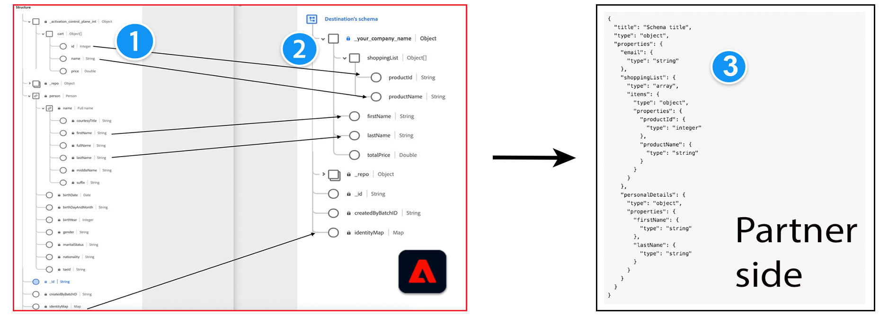

# 메시지 포맷

## 사전 요구 사항 - Adobe Experience Platform 개념 {#prerequisites}

Adobe 측의 메시지 포맷 및 프로필 구성 및 변환 프로세스를 이해하려면 다음 Experience Platform 개념을 숙지하십시오.

* **경험 데이터 모델(XDM)**. [XDM 개요](../../../../xdm/home.md) 및  [Adobe Experience Platform에서 XDM 스키마를 만드는 방법](../../../../xdm/tutorials/create-schema-ui.md).
* **클래스**. [UI에서 클래스 만들기 및 편집](../../../../xdm/ui/resources/classes.md).
* **IdentityMap**. ID 맵은 Adobe Experience Platform의 모든 최종 사용자 ID의 맵을 나타냅니다. 을(를) 참조하십시오 `xdm:identityMap` 다음에서 [XDM 필드 사전](../../../../xdm/schema/field-dictionary.md).
* **SegmentMembership**. 다음 [segmentMembership](../../../../xdm/schema/field-dictionary.md) XDM 속성은 프로필이 멤버인 세그먼트를 알려줍니다. 의 세 가지 다른 값에 대해 `status` 필드,에서 설명서 읽기 [세그먼트 멤버십 세부 정보 스키마 필드 그룹](../../../../xdm/field-groups/profile/segmentation.md).

>[!IMPORTANT]
>
>Destination SDK에서 지원하는 모든 매개변수 이름 및 값은 다음과 같습니다. **대소문자 구분**. 대소문자 구분 오류를 방지하려면 설명서에 표시된 대로 매개 변수 이름과 값을 정확히 사용하십시오.

## 지원되는 통합 유형 {#supported-integration-types}

이 페이지에 설명된 기능을 지원하는 통합 유형에 대한 자세한 내용은 아래 표를 참조하십시오.

| 통합 유형 | 기능 지원 |
|---|---|
| 실시간(스트리밍) 통합 | 예 |
| 파일 기반 (일괄 처리) 통합 | 예(아래 다이어그램에서 1단계와 2단계만 해당) |

## 개요 {#overview}

이 페이지에서는 Adobe Experience Platform에서 대상으로 내보낸 데이터의 메시지 형식 및 프로필 변형을 다룹니다.

Adobe Experience Platform은 데이터를 다양한 데이터 형식으로 상당한 수의 대상으로 내보냅니다. 대상 유형의 몇 가지 예로는 광고 플랫폼(Google), 소셜 네트워크(Facebook) 및 클라우드 스토리지 위치(Amazon S3, Azure 이벤트 허브)가 있습니다.

Experience Platform은 측면에서 예상되는 포맷과 일치하도록 내보낸 프로필의 메시지 포맷을 조정할 수 있습니다. 이 사용자 지정을 이해하기 위해서는 다음 개념이 중요합니다.

* Adobe Experience Platform의 소스 (1) 및 타겟 (2) XDM 스키마
* 파트너측의 예상 메시지 형식(3) 및
* XDM 스키마와 예상 메시지 형식 간의 변환 계층. [메시지 변환 템플릿](#using-templating).



Experience Platform은 XDM 스키마를 사용하여 데이터의 구조를 일관되고 재사용 가능한 방식으로 설명합니다.

<!--

Users who want to activate data to your destination need to map the fields in their Experience Platform datasets to a schema that translates to your destination's expected format. Adobe will create a custom field group for your company to add to the target schema. The fields in the field group depend on the profile attribute fields that you can receive.

-->

**소스 XDM 스키마 (1)**: 이 항목은 고객이 Experience Platform에서 사용하는 스키마를 참조합니다. Experience Platform에서 [매핑 단계](../../../ui/activate-segment-streaming-destinations.md#mapping) 활성화 대상 워크플로 중 고객은 XDM 스키마의 필드를 대상의 대상 스키마에 매핑합니다(2).

**Target XDM 스키마 (2)**: 대상에서 예상되는 포맷의 JSON 표준 스키마(3)와 대상에서 해석할 수 있는 속성에 따라 대상 XDM 스키마에서 프로필 속성 및 ID를 정의할 수 있습니다. 대상 구성에서 이 작업을 수행할 수 있습니다. [schemaConfig](../../functionality/destination-configuration/schema-configuration.md) 및 [identityNamespaces](../../functionality/destination-configuration/identity-namespace-configuration.md) 개체.

**대상 프로필 속성의 JSON 표준 스키마 (3)**: 이 예는 를 나타냅니다. [JSON 스키마](https://json-schema.org/learn/miscellaneous-examples.html) 사용 가능한 모든 프로필 속성 및 해당 유형(예: object, string, array). 대상이 지원할 수 있는 필드 예는 다음과 같습니다. `firstName`, `lastName`, `gender`, `email`, `phone`, `productId`, `productName`등. 다음이 필요합니다. [메시지 변환 템플릿](#using-templating) Experience Platform에서 내보낸 데이터를 예상 형식으로 사용자 지정합니다.

위에서 설명한 스키마 변환을 기반으로 소스 XDM 스키마와 파트너 측의 샘플 스키마 간에 프로필 구성이 변경되는 방법은 다음과 같습니다.


## 시작하기 - 세 가지 기본 특성 변환 {#getting-started}

프로필 변환 프로세스를 보여주기 위해 아래 예제에서는 Adobe Experience Platform의 세 가지 공통 프로필 속성을 사용합니다. **이름**, **성**, 및 **이메일 주소**.

>[!NOTE]
>
>고객은 소스 XDM 스키마의 속성을 Adobe Experience Platform UI의 파트너 XDM 스키마와 매핑합니다. **매핑** 의 단계 [대상 워크플로우 활성화](../../../ui/activate-segment-streaming-destinations.md#mapping).

플랫폼이 다음과 같은 메시지 형식을 수신할 수 있다고 가정해 보겠습니다.

```shell
POST https://YOUR_REST_API_URL/users/
Content-Type: application/json
Authorization: Bearer YOUR_REST_API_KEY

{
  "attributes":
    {
      "first_name": "Yours",
      "last_name": "Truly",
      "external_id": "yourstruly@adobe.com"
    }
}
```

메시지 형식을 고려하여 해당 변환은 다음과 같습니다.

| Adobe 측의 파트너 XDM 스키마의 속성 | 변환 | 사용자 측의 HTTP 메시지에 있는 속성 |
|---------|----------|---------|
| `_your_custom_schema.firstName` | ` attributes.first_name` | `first_name` |
| `_your_custom_schema.lastName` | `attributes.last_name` | `last_name` |
| `personalEmail.address` | `attributes.external_id` | `external_id` |

{style="table-layout:auto"}

## Experience Platform의 프로필 구조 {#profile-structure}

페이지의 아래 예를 더 이해하려면 Experience Platform 내 프로필의 구조를 아는 것이 중요합니다.

프로필에는 다음 3개의 섹션이 있습니다.

* `segmentMembership` (항상 프로필에 있음)
   * 이 섹션에는 프로필에 있는 모든 세그먼트가 포함되어 있습니다. 세그먼트는 다음 두 상태 중 하나를 가질 수 있습니다. `realized` 또는 `exited`.
* `identityMap` (항상 프로필에 있음)
   * 이 섹션에는 프로필에 있는 모든 ID(이메일, Google GAID, Apple IDFA 등)와 활성화 워크플로에서 내보내기를 위해 매핑된 사용자가 포함됩니다.
* 속성(대상 구성에 따라 프로필에 표시될 수 있음) 미리 정의된 속성과 자유 형식 속성 간에는 약간의 차이가 있습니다.
   * 대상 *자유 형식 속성*, 여기에는 `.value` 속성이 프로필에 있는 경우 경로를 입력합니다( `lastName` 예제 1)의 속성입니다. 프로필에 없으면 다음을 포함하지 않습니다. `.value` 경로(참조) `firstName` 예제 1)의 속성입니다.
   * 대상 *사전 정의된 속성*, 여기에는 `.value` 경로. 프로필에 있는 모든 매핑된 속성은 속성 맵에 표시됩니다. 없는 항목은 표시되지 않습니다( 예 2 - `firstName` 프로필에 속성이 없습니다.)

Experience Platform의 두 가지 프로필 예를 참조하십시오.

### 가 있는 예 1 `segmentMembership`, `identityMap` 자유 형식 속성에 대한 및 속성 {#example-1}

```json
{
  "segmentMembership": {
    "ups": {
      "11111111-1111-1111-1111-111111111111": {
        "lastQualificationTime": "2019-04-15T02:41:50.000+0000",
        "status": "realized"
      }
    }
  },
  "identityMap": {
    "mobileIds": [
      {
        "id": "e86fb215-0921-4537-bc77-969ff775752c"
      }
    ]
  },
  "attributes": {
    "firstName": {
    },
    "lastName": {
      "value": "lastName"
    }
  }
}
```

### 가 있는 예 2 `segmentMembership`, `identityMap` 사전 정의된 속성에 대한 및 속성 {#example-2}

```json
{
  "segmentMembership": {
    "ups": {
      "11111111-1111-1111-1111-111111111111": {
        "lastQualificationTime": "2019-04-15T02:41:50.000+0000",
        "status": "realized"
      }
    }
  },
  "identityMap": {
    "mobileIds": [
      {
        "id": "e86fb215-0921-4537-bc77-969ff775752c"
      }
    ]
  },
  "attributes": {
    "lastName": "lastName"
  }
}
```

## ID, 속성 및 세그먼트 멤버십 변환에 템플릿 언어 사용 {#using-templating}

Adobe 사용 [조약돌 틀](https://pebbletemplates.io/), 와 유사한 템플릿 언어 [진자](https://jinja.palletsprojects.com/en/2.11.x/)를 클릭하여 Experience Platform XDM 스키마의 필드를 대상에서 지원하는 형식으로 변환합니다.

이 섹션에서는 입력 XDM 스키마에서 템플릿을 통해 그리고 대상에서 허용하는 페이로드 형식으로 출력하면서 이러한 변환을 수행하는 방법에 대한 몇 가지 예를 제공합니다. 아래 예제는 다음과 같이 복잡성을 증가시켜 제공됩니다.

1. 간단한 변형 예. 다음에 대한 간단한 변형을 통해 템플릿화가 작동하는 방식을 알아봅니다. [프로필 속성](#attributes), [세그먼트 멤버십](#segment-membership), 및 [신원](#identities) 필드.
2. 위의 필드를 결합하는 템플릿의 복잡성 증가 예: [세그먼트 및 ID를 전송하는 템플릿 만들기](./message-format.md#segments-and-identities) 및 [세그먼트, ID 및 프로필 속성을 보내는 템플릿 만들기](#segments-identities-attributes).
3. 집계 키를 포함하는 템플릿. 를 사용할 때 [구성 가능한 집계](../../functionality/destination-configuration/aggregation-policy.md#configurable-aggregation) 대상 구성에서 Experience Platform은 세그먼트 ID, 세그먼트 상태 또는 ID 네임스페이스 등의 기준을 기반으로 대상으로 내보낸 프로필을 그룹화합니다.

### 프로필 속성 {#attributes}

대상으로 내보낸 프로필 속성을 변형하려면 아래 JSON 및 코드 샘플을 참조하십시오.

>[!IMPORTANT]
>
>Adobe Experience Platform에서 사용 가능한 모든 프로필 속성 목록은 다음을 참조하십시오. [XDM 필드 사전](../../../../xdm/schema/field-dictionary.md).


**입력**

프로필 1:

```json
{
    "attributes": {
        "firstName": {
            "value": "Hermione"
    },
    "birthDate": {}
  }
}
```

프로필 2:

```json
{
  "attributes": {
    "firstName": {
      "value": "Harry"
    },
    "birthDate": {
        "value": "1980/07/31"
    }
  }
}
```

**템플릿**

>[!IMPORTANT]
>
>사용하는 모든 템플릿의 경우 큰따옴표와 같은 잘못된 문자를 이스케이프 처리해야 합니다 `""` 를 삽입하기 전에 [템플릿](../../functionality/destination-server/templating-specs.md) 다음에서 [대상 서버 구성](../../authoring-api/destination-server/create-destination-server.md). 큰따옴표 이스케이프에 대한 자세한 내용은 [JSON 표준](https://www.ecma-international.org/publications-and-standards/standards/ecma-404/).

```python
{
    "profiles": [
        
        {
            
            "{{ attribute.key }}":
                
                    null
                
                    "{{ attribute.value.value }}"
                
            ,
            
        },
        
    ]
}
```

**결과**


```json
{
    "profiles": [
        {
            "firstName": "Hermione",
            "birthDate": null
        },
        {
            "firstName": "Harry",
            "birthDate": "1980/07/31"
        }
    ]
}
```

### 세그먼트 멤버십 {#segment-membership}

다음 [segmentMembership](../../../../xdm/schema/field-dictionary.md) XDM 속성은 프로필이 멤버인 세그먼트를 알려줍니다.
의 세 가지 다른 값에 대해 `status` 필드,에서 설명서 읽기 [세그먼트 멤버십 세부 정보 스키마 필드 그룹](../../../../xdm/field-groups/profile/segmentation.md).

**입력**

프로필 1:

```json
{
  "segmentMembership": {
    "ups": {
      "36a51c13-9dd6-4d2c-8aa3-07d785ea5075": {
        "lastQualificationTime": "2019-11-20T13:15:49Z",
        "status": "realized"
      },
      "788d8874-8007-4253-92b7-ee6b6c20c6f3": {
        "lastQualificationTime": "2019-11-20T13:15:49Z",
        "status": "realized"
      },
      "8f812592-3f06-416b-bd50-e7831848a31a": {
        "lastQualificationTime": "2019-11-20T13:15:49Z",
        "status": "exited"
      }
    }
  }
}
```

프로필 2:

```json
{
  "segmentMembership": {
    "ups": {
      "32396e4b-16f6-4033-9702-fc69b5e24e7c": {
        "lastQualificationTime": "2021-08-20T17:23:04Z",
        "status": "realized"
      },
      "af854278-894a-4192-a96b-320fbf2623fd": {
        "lastQualificationTime": "2021-08-20T16:44:37Z",
        "status": "realized"
      },
      "66505bf9-bc08-4bac-afbc-8b6706650ea4": {
        "lastQualificationTime": "2019-08-20T17:23:04Z",
        "status": "realized"
      }
    }
  }
}
```

**템플릿**

>[!IMPORTANT]
>
>사용하는 모든 템플릿의 경우 큰따옴표와 같은 잘못된 문자를 이스케이프 처리해야 합니다 `""` 를 삽입하기 전에 [템플릿](../../functionality/destination-server/templating-specs.md) 다음에서 [대상 서버 구성](../../authoring-api/destination-server/create-destination-server.md). 큰따옴표 이스케이프에 대한 자세한 내용은 [JSON 표준](https://www.ecma-international.org/publications-and-standards/standards/ecma-404/).


```python
{
    "profiles": [
        
        {
            "AdobeExperiencePlatformSegments": {
                "add": [
                
                "{{ segment.key }}",
                
                ],
                "remove": [
                {# Alternative syntax for filtering segments by status: #}
                
                "{{ segment.key }}",
                
                ]
            }
        },
        
    ]
}
```

**결과**

```json
{
    "profiles": [
        {
            "AdobeExperiencePlatformSegments": {
                "add": [
                    "36a51c13-9dd6-4d2c-8aa3-07d785ea5075",
                    "788d8874-8007-4253-92b7-ee6b6c20c6f3"
                ],
                "remove": [
                    "8f812592-3f06-416b-bd50-e7831848a31a"
                ]
            }
        },
        {
            "AdobeExperiencePlatformSegments": {
                "add": [
                    "32396e4b-16f6-4033-9702-fc69b5e24e7c",
                    "af854278-894a-4192-a96b-320fbf2623fd",
                    "66505bf9-bc08-4bac-afbc-8b6706650ea4"
                ],
                "remove": [
                ]
            }
        }
    ]
}
```

### ID {#identities}

Experience Platform의 ID에 대한 자세한 내용은 [ID 네임스페이스 개요](../../../../identity-service/namespaces.md).

**입력**

프로필 1:

```json
{
    "identityMap": {
        "email": [
            {
                "id": "johndoe@example.com"
            },
            {
                "id": "jd@example.com"
            }
        ],
        "external_id": [
            {
                "id": "123456"
            }
        ]
    }
}
```

프로필 2:

```json
{
    "identityMap": {
        "email": [
            {
                "id": "jane.doe@example.com"
            }
        ]
    }
}
```

**템플릿**

>[!IMPORTANT]
>
>사용하는 모든 템플릿의 경우 큰따옴표와 같은 잘못된 문자를 이스케이프 처리해야 합니다 `""` 를 삽입하기 전에 [템플릿](../../functionality/destination-server/templating-specs.md) 다음에서 [대상 서버 구성](../../authoring-api/destination-server/create-destination-server.md). 큰따옴표 이스케이프에 대한 자세한 내용은 [JSON 표준](https://www.ecma-international.org/publications-and-standards/standards/ecma-404/).

```python
{
    "profiles": [
        
        {
            "identities": [
                
                {
                    "type": "email",
                    "id": "{{ email.id }}"
                },
                

                {# Add a comma only if you have both emails and external_ids. #}
                
                    ,
                

                
                {
                    "type": "external_id",
                    "id": "{{ external.id }}"
                },
                
            ]
        },
        
    ]
}
```

**결과**

```json
{
    "profiles": [
        {
            "identities": [
                {
                    "type": "email",
                    "id": "johndoe@example.com"
                },
                {
                    "type": "email",
                    "id": "jd@example.com"
                },
                {
                    "type": "external_id",
                    "id": "123456"
                }
            ]
        },
        {
            "identities": [
                {
                    "type": "email",
                    "id": "jane.doe@example.com"
                }
            ]
        }
    ]
}
```

### 세그먼트 및 ID를 전송하는 템플릿 만들기 {#segments-and-identities}

이 섹션에서는 Adobe XDM 스키마와 파트너 대상 스키마 간에 일반적으로 사용되는 변환의 예를 제공합니다.
아래 예제는 세그먼트 멤버십 및 ID 형식을 변환하여 대상에 출력하는 방법을 보여 줍니다.

**입력**

프로필 1:

```json
{
    "identityMap": {
        "email": [
            {
                "id": "johndoe@example.com"
            },
            {
                "id": "jd@example.com"
            }
        ],
        "external_id": [
            {
                "id": "123456"
            }
        ]
    },
    "segmentMembership": {
        "ups": {
            "36a51c13-9dd6-4d2c-8aa3-07d785ea5075": {
                "lastQualificationTime": "2019-11-20T13:15:49Z",
                "status": "realized"
            },
            "788d8874-8007-4253-92b7-ee6b6c20c6f3": {
              "lastQualificationTime": "2019-11-20T13:15:49Z",
              "status": "realized"
            },
            "8f812592-3f06-416b-bd50-e7831848a31a": {
                "lastQualificationTime": "2019-11-20T13:15:49Z",
                "status": "exited"
            }
        }
    }
}
```

프로필 2:

```json
{
    "identityMap": {
        "email": [
            {
                "id": "jane.doe@example.com"
            }
        ]
    },
    "segmentMembership": {
        "ups": {
            "36a51c13-9dd6-4d2c-8aa3-07d785ea5075": {
                "lastQualificationTime": "2021-08-31T10:01:42Z",
                "status": "realized"
            }
        }
    }
}
```

**템플릿**

>[!IMPORTANT]
>
>사용하는 모든 템플릿의 경우 큰따옴표와 같은 잘못된 문자를 이스케이프 처리해야 합니다 `""` 를 삽입하기 전에 [템플릿](../../functionality/destination-server/templating-specs.md) 다음에서 [대상 서버 구성](../../authoring-api/destination-server/create-destination-server.md). 큰따옴표 이스케이프에 대한 자세한 내용은 [JSON 표준](https://www.ecma-international.org/publications-and-standards/standards/ecma-404/).

```python
{
    "profiles": [
        
        {
            "identities": [
                
                {
                    "type": "email",
                    "id": "{{ email.id }}"
                },
                
                
                {# Add a comma only if you have both emails and external_ids. #}
                
                    ,
                
                
                
                {
                    "type": "external_id",
                    "id": "{{ external.id }}"
                },
                
            ],
            "AdobeExperiencePlatformSegments": {
                "add": [
                    
                    "{{ segment.key }}",
                    
                ],
                "remove": [
                    {# Alternative syntax for filtering segments by status: #}
                    
                    "{{ segment.key }}",
                    
                ]
            }
        },
        
    ]
}
```

**결과**

다음 `json` 아래는 Adobe Experience Platform에서 내보낸 데이터를 나타냅니다.

```json
{
    "profiles": [
        {
            "identities": [
                {
                    "type": "email",
                    "id": "johndoe@example.com"
                },
                {
                    "type": "email",
                    "id": "jd@example.com"
                },
                {
                    "type": "external_id",
                    "id": "123456"
                }
            ],
            "AdobeExperiencePlatformSegments": {
                "add": [
                    "36a51c13-9dd6-4d2c-8aa3-07d785ea5075",
                    "788d8874-8007-4253-92b7-ee6b6c20c6f3"
                ],
                "remove": [
                    "8f812592-3f06-416b-bd50-e7831848a31a"
                ]
            }
        },
        {
            "identities": [
                {
                    "type": "email",
                    "id": "jane.doe@example.com"
                }
            ],
            "AdobeExperiencePlatformSegments": {
                "add": [
                    "36a51c13-9dd6-4d2c-8aa3-07d785ea5075"
                ],
                "remove": []
            }
        }
    ]
}
```

### 세그먼트, ID 및 프로필 속성을 보내는 템플릿 만들기 {#segments-identities-attributes}

이 섹션에서는 Adobe XDM 스키마와 파트너 대상 스키마 간에 일반적으로 사용되는 변환의 예를 제공합니다.

또 다른 일반적인 사용 사례는 세그먼트 멤버십, ID(예: 이메일 주소, 전화 번호, 광고 ID) 및 프로필 속성이 포함된 데이터를 내보내는 것입니다. 이러한 방식으로 데이터를 내보내려면 아래 예를 참조하십시오.

**입력**

프로필 1:

```json
{
    "attributes": {
        "firstName": {
            "value": "Hermione"
        },
        "birthDate": {}
    },
    "identityMap": {
        "email": [
            {
                "id": "johndoe@example.com"
            },
            {
                "id": "jd@example.com"
            }
        ],
        "external_id": [
            {
                "id": "123456"
            }
        ]
    },
    "segmentMembership": {
        "ups": {
            "36a51c13-9dd6-4d2c-8aa3-07d785ea5075": {
                "lastQualificationTime": "2019-11-20T13:15:49Z",
                "status": "realized"
            },
            "788d8874-8007-4253-92b7-ee6b6c20c6f3": {
              "lastQualificationTime": "2019-11-20T13:15:49Z",
              "status": "realized"
            },
            "8f812592-3f06-416b-bd50-e7831848a31a": {
                "lastQualificationTime": "2019-11-20T13:15:49Z",
                "status": "exited"
            }
        }
    }
}
```

프로필 2:

```json
{
    "attributes": {
        "firstName": {
            "value": "Harry"
        },
        "birthDate": {
            "value": "1980/07/31"
        }
    },
    "identityMap": {
        "email": [
            {
                "id": "harry.p@example.com"
            }
        ]
    },
    "segmentMembership": {
        "ups": {
            "36a51c13-9dd6-4d2c-8aa3-07d785ea5075": {
                "lastQualificationTime": "2019-11-20T13:15:49Z",
                "status": "realized"
            }
        }
    }
}
```

**템플릿**

>[!IMPORTANT]
>
>사용하는 모든 템플릿의 경우 큰따옴표와 같은 잘못된 문자를 이스케이프 처리해야 합니다 `""` 를 삽입하기 전에 [템플릿](../../functionality/destination-server/templating-specs.md) 다음에서 [대상 서버 구성](../../authoring-api/destination-server/create-destination-server.md). 큰따옴표 이스케이프에 대한 자세한 내용은 [JSON 표준](https://www.ecma-international.org/publications-and-standards/standards/ecma-404/).

```python
{
    "profiles": [
        
        {
            "attributes": {
            
                "{{ attribute.key }}":
                    
                        null
                    
                        "{{ attribute.value.value }}"
                    
                ,
            
            },
            "identities": [
                
                {
                    "type": "email",
                    "id": "{{ email.id }}"
                },
                

                {# Add a comma only if we have both emails and external_ids. #}
                
                    ,
                

                
                {
                    "type": "external_id",
                    "id": "{{ external.id }}"
                },
                
            ],
            "AdobeExperiencePlatformSegments": {
                "add": [
                
                    "{{ segment.key }}",
                
                ],
                "remove": [
                {# Alternative syntax for filtering segments by status: #}
                
                    "{{ segment.key }}",
                
                ]
            }
        }
    ]
}
```

**결과**

다음 `json` 아래는 Adobe Experience Platform에서 내보낸 데이터를 나타냅니다.

```json
{
    "profiles": [
        {
            "attributes": {
                "firstName": "Hermione",
                "birthDate": null
            },
            "identities": [
                {
                    "type": "email",
                    "id": "johndoe@example.com"
                },
                {
                    "type": "email",
                    "id": "jd@example.com"
                },
                {
                    "type": "external_id",
                    "id": "123456"
                }
            ],
            "AdobeExperiencePlatformSegments": {
                "add": [
                    "36a51c13-9dd6-4d2c-8aa3-07d785ea5075",
                    "788d8874-8007-4253-92b7-ee6b6c20c6f3"
                ],
                "remove": [
                    "8f812592-3f06-416b-bd50-e7831848a31a"
                ]
            }
        },
        {
            "attributes": {
                "firstName": "Harry",
                "birthDate": "1980/07/21"
            },
            "identities": [
                {
                    "type": "email",
                    "id": "harry.p@example.com"
                }
            ],
            "AdobeExperiencePlatformSegments": {
                "add": [
                    "36a51c13-9dd6-4d2c-8aa3-07d785ea5075"
                ],
                "remove": []
            }
        }
    ]
}
```

### 템플릿에 집계 키를 포함하여 다양한 기준으로 그룹화된 내보낸 프로필에 액세스합니다 {#template-aggregation-key}

를 사용할 때 [구성 가능한 집계](../../functionality/destination-configuration/aggregation-policy.md#configurable-aggregation) 대상 구성에서 세그먼트 ID, 세그먼트 별칭, 세그먼트 멤버십 또는 id 네임스페이스 등의 기준에 따라 대상으로 내보낸 프로필을 그룹화할 수 있습니다.

메시지 변환 템플릿에서 다음 섹션의 예에 표시된 대로 위에 언급된 합계 키에 액세스할 수 있습니다. 집계 키를 사용하여 Experience Platform에서 내보낸 HTTP 메시지를 대상에 필요한 형식 및 속도 제한과 일치하도록 구성합니다.

#### 템플릿에서 세그먼트 ID 집계 키 사용 {#aggregation-key-segment-id}

를 사용하는 경우 [구성 가능한 집계](../../functionality/destination-configuration/aggregation-policy.md#configurable-aggregation) 및 설정 `includeSegmentId` true로 설정하면 대상으로 내보낸 HTTP 메시지의 프로필이 세그먼트 ID별로 그룹화됩니다. 템플릿에서 세그먼트 ID에 액세스하는 방법은 아래를 참조하십시오.

**입력**

아래의 네 가지 프로필을 고려하십시오. 여기서

* 처음 두 개는 세그먼트 ID가 있는 세그먼트의 일부입니다 `788d8874-8007-4253-92b7-ee6b6c20c6f3`
* 세 번째 프로필은 세그먼트 ID가 있는 세그먼트의 일부입니다 `8f812592-3f06-416b-bd50-e7831848a31a`
* 네 번째 프로필은 위의 두 세그먼트 중 일부입니다.

프로필 1:

```json
{
   "attributes":{
      "firstName":{
         "value":"Hermione"
      }
   },
   "segmentMembership":{
      "ups":{
         "788d8874-8007-4253-92b7-ee6b6c20c6f3":{
            "lastQualificationTime":"2020-11-20T13:15:49Z",
            "status":"realized"
         }
      }
   }
}
```

프로필 2:

```json
{
   "attributes":{
      "firstName":{
         "value":"Harry"
      }
   },
   "segmentMembership":{
      "ups":{
         "788d8874-8007-4253-92b7-ee6b6c20c6f3":{
            "lastQualificationTime":"2020-11-20T13:15:49Z",
            "status":"realized"
         }
      }
   }
}
```

프로필 3:

```json
{
   "attributes":{
      "firstName":{
         "value":"Tom"
      }
   },
   "segmentMembership":{
      "ups":{
         "8f812592-3f06-416b-bd50-e7831848a31a":{
            "lastQualificationTime":"2021-02-20T12:00:00Z",
            "status":"realized"
         }
      }
   }
}
```

프로필 4:

```json
{
   "attributes":{
      "firstName":{
         "value":"Jerry"
      }
   },
   "segmentMembership":{
      "ups":{
         "8f812592-3f06-416b-bd50-e7831848a31a":{
            "lastQualificationTime":"2021-02-20T12:00:00Z",
            "status":"realized"
         },
         "788d8874-8007-4253-92b7-ee6b6c20c6f3":{
            "lastQualificationTime":"2020-11-20T13:15:49Z",
            "status":"realized"
         }
      }
   }
}
```

**템플릿**

>[!IMPORTANT]
>
>사용하는 모든 템플릿의 경우 큰따옴표와 같은 잘못된 문자를 이스케이프 처리해야 합니다 `""` 를 삽입하기 전에 [템플릿](../../functionality/destination-server/templating-specs.md) 다음에서 [대상 서버 구성](../../authoring-api/destination-server/create-destination-server.md). 큰따옴표 이스케이프에 대한 자세한 내용은 [JSON 표준](https://www.ecma-international.org/publications-and-standards/standards/ecma-404/).

아래 방법 알림 `audienceId` 템플릿에서 세그먼트 ID에 액세스하는 데 사용됩니다. 이 예에서는 다음을 사용한다고 가정합니다. `audienceId` 대상 분류의 세그먼트 멤버십에 사용됩니다. 자체 분류법에 따라 다른 필드 이름을 대신 사용할 수 있습니다.

```python
{
    "audienceId": "{{ input.aggregationKey.segmentId }}",
    "profiles": [
        
        {
            "first_name": "{{ profile.attributes.firstName.value }}"
        },
        
    ]
}
```

**결과**

프로필은 대상으로 내보낼 때 세그먼트 ID를 기준으로 두 개의 그룹으로 분할됩니다.

```json
{
   "audienceId":"788d8874-8007-4253-92b7-ee6b6c20c6f3",
   "profiles":[
      {
         "firstName":"Hermione"
      },
      {
         "firstName":"Harry"
      },
      {
         "firstName":"Jerry"
      }
   ]
}
```

```json
{
   "audienceId":"8f812592-3f06-416b-bd50-e7831848a31a",
   "profiles":[
      {
         "firstName":"Tom"
      },
      {
         "firstName":"Jerry"
      }
   ]
}
```

#### 템플릿에서 세그먼트 별칭 집계 키 사용 {#aggregation-key-segment-alias}

를 사용하는 경우 [구성 가능한 집계](../../functionality/destination-configuration/aggregation-policy.md#configurable-aggregation) 및 설정 `includeSegmentId` true로 설정하려면 템플릿의 세그먼트 별칭에 액세스할 수도 있습니다.

아래 줄을 템플릿에 추가하여 세그먼트 별칭으로 그룹화된 내보낸 프로필에 액세스합니다.

```python
customerList={{input.aggregationKey.segmentAlias}}
```

#### 템플릿에서 세그먼트 상태 집계 키 사용 {#aggregation-key-segment-status}

를 사용하는 경우 [구성 가능한 집계](../../functionality/destination-configuration/aggregation-policy.md#configurable-aggregation) 및 설정 `includeSegmentId` 및 `includeSegmentStatus` true로 설정하려면 템플릿의 세그먼트 상태에 액세스할 수 있습니다. 이렇게 하면 프로필이 세그먼트에서 추가되어야 하는지 또는 제거되어야 하는지에 따라 대상으로 내보낸 HTTP 메시지에서 프로필을 그룹화할 수 있습니다.

가능한 값:

* 실현됨
* 기존
* 종료됨

위의 값을 기준으로 아래 줄을 템플릿에 추가하여 세그먼트에서 프로필을 추가하거나 제거합니다.

```python
action=REMOVEADD
```

#### 템플릿에서 ID 네임스페이스 집계 키 사용 {#aggregation-key-identity}

다음은 인 예제입니다. [구성 가능한 집계](../../functionality/destination-configuration/aggregation-policy.md#configurable-aggregation) 대상 구성에서 양식의 id 네임스페이스별로 내보낸 프로필을 집계하도록 설정됩니다 `"namespaces": ["email", "phone"]` 및 `"namespaces": ["GAID", "IDFA"]`. 다음을 참조하십시오. `groups` 의 매개 변수 [대상 구성 만들기](../../authoring-api/destination-configuration/create-destination-configuration.md) 그룹화에 대한 자세한 내용은 설명서를 참조하십시오.

**입력**

프로필 1:

```json
{
   "identityMap":{
      "email":[
         {
            "id":"e1@example.com"
         },
         {
            "id":"e2@example.com"
         }
      ],
      "phone":[
         {
            "id":"+40744111222"
         }
      ],
      "IDFA":[
         {
            "id":"AEBE52E7-03EE-455A-B3C4-E57283966239"
         }
      ],
      "GAID":[
         {
            "id":"e4fe9bde-caa0-47b6-908d-ffba3fa184f2"
         }
      ]
   }
}
```

프로필 2:

```json
{
   "identityMap":{
      "email":[
         {
            "id":"e3@example.com"
         }
      ],
      "phone":[
         {
            "id":"+40744333444"
         },
         {
            "id":"+40744555666"
         }
      ],
      "IDFA":[
         {
            "id":"134GHU45-34HH-GHJ7-K0H8-LHN665998NN0"
         }
      ],
      "GAID":[
         {
            "id":"47bh00i9-8jv6-334n-lll8-nb7f24sghg76"
         }
      ]
   }
}
```

**템플릿**

>[!IMPORTANT]
>
>사용하는 모든 템플릿의 경우 큰따옴표와 같은 잘못된 문자를 이스케이프 처리해야 합니다 `""` 를 삽입하기 전에 [템플릿](../../functionality/destination-server/templating-specs.md) 다음에서 [대상 서버 구성](../../authoring-api/destination-server/create-destination-server.md). 큰따옴표 이스케이프에 대한 자세한 내용은 [JSON 표준](https://www.ecma-international.org/publications-and-standards/standards/ecma-404/).

주의: `input.aggregationKey.identityNamespaces` 아래 템플릿에서 사용됩니다.

```python
{
            "profiles": [
            
            {
                
                "{{ns}}": [
                    
                    "{{id.id}}",
                    
                ],
                
            },
            
        ]
}
```

**결과**

프로필은 대상으로 내보낼 때 ID 네임스페이스에 따라 두 개의 그룹으로 분할됩니다. 이메일과 전화기는 한 그룹에 있고 GAID와 IDFA는 다른 그룹에 있습니다.

```json
{
   "profiles":[
      {
         "email":[
            "e1@example.com",
            "e2@example.com"
         ],
         "phone":[
            "+40744111222"
         ]
      },
      {
         "email":[
            "e3@example.com"
         ],
         "phone":[
            "+40744333444",
            "+40744555666"
         ]
      }
   ]
}
```

```json
{
   "profiles":[
      {
         "IDFA":[
            "AEBE52E7-03EE-455A-B3C4-E57283966239"
         ],
         "GAID":[
            "e4fe9bde-caa0-47b6-908d-ffba3fa184f2"
         ]
      },
      {
         "IDFA":[
            "134GHU45-34HH-GHJ7-K0H8-LHN665998NN0"
         ],
         "GAID":[
            "47bh00i9-8jv6-334n-lll8-nb7f24sghg76"
         ]
      }
   ]
}
```

#### URL 템플릿에서 집계 키 사용 {#aggregation-key-url-template}

사용 사례에 따라 아래와 같이 URL에 여기에 설명된 집계 키를 사용할 수도 있습니다.

```python
https://api.example.com/audience/{{input.aggregationKey.segmentId}}
```

### 참조: 변환 템플릿에 사용되는 컨텍스트 및 함수 {#reference}

템플릿에 제공되는 컨텍스트에는 다음 항목이 포함됩니다. `input`  (이 호출에서 내보낸 프로필/데이터) 및 `destination` (Adobe이 데이터를 보내는 대상에 대한 데이터로, 모든 프로필에 대해 유효합니다.)

아래 표는 위의 예에서 함수에 대한 설명을 제공합니다.

| 함수 | 설명 |
|---------|----------|
| `input.profile` | 프로필로 표시됩니다. [JsonNode](https://fasterxml.github.io/jackson-databind/javadoc/2.11/com/fasterxml/jackson/databind/node/JsonNodeType.html). 이 페이지에서 위에 언급된 파트너 XDM 스키마를 따릅니다. |
| `destination.segmentAliases` | Adobe Experience Platform 네임스페이스의 세그먼트 ID에서 파트너 시스템의 세그먼트 별칭으로 매핑합니다. |
| `destination.segmentNames` | Adobe Experience Platform 네임스페이스의 세그먼트 이름에서 파트너 시스템의 세그먼트 이름으로 매핑합니다. |
| `addedSegments(listOfSegments)` | 상태가 있는 세그먼트만 반환합니다. `realized`. |
| `removedSegments(listOfSegments)` | 상태가 있는 세그먼트만 반환합니다. `exited`. |

{style="table-layout:auto"}

## 다음 단계 {#next-steps}

이 문서를 읽고 나면 이제 Experience Platform에서 내보낸 데이터가 어떻게 변환되는지 알 수 있습니다. 다음으로 다음 페이지를 읽고 대상에 대한 메시지 변환 템플릿 생성에 대한 지식을 완료하십시오.

* [메시지 변형 템플릿 만들기 및 테스트](../../testing-api/streaming-destinations/create-template.md)
* [템플릿 API 작업 렌더링](../../testing-api/streaming-destinations/render-template-api.md)
* [Destination SDK에서 지원되는 변환 함수](../destination-server/supported-functions.md)

다른 대상 서버 구성 요소에 대한 자세한 내용은 다음 문서를 참조하십시오.

* [Destination SDK으로 생성된 대상의 서버 사양](server-specs.md)
* [사양 템플릿](templating-specs.md)
* [파일 서식 구성](file-formatting.md)