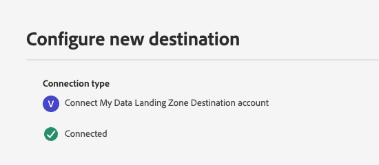
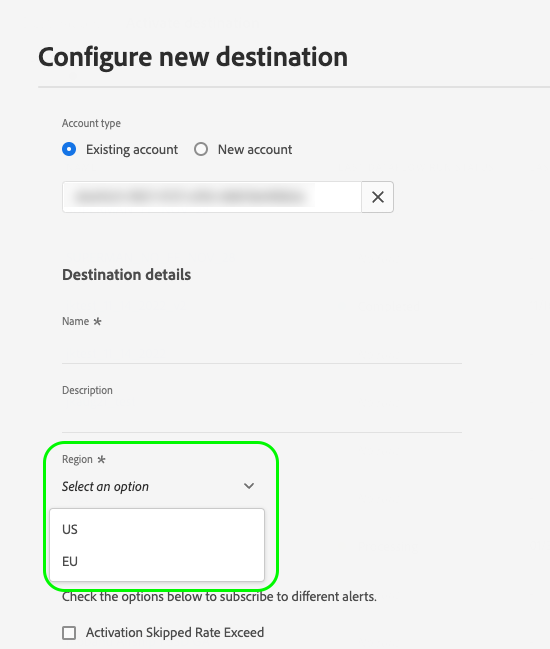

# Destination SDK으로 만든 대상의 서버 사양

대상 서버 사양은 Adobe Experience Platform에서 데이터를 수신할 대상 플랫폼의 유형 및 Experience Platform과 대상 간의 통신 매개 변수를 정의합니다. 예:

* [스트리밍](#streaming-example) 대상 서버 사양은 Experience Platform에서 HTTP 메시지를 받을 HTTP 서버 끝점을 정의합니다. 끝점에 대한 HTTP 호출의 형식을 구성하는 방법을 알아보려면 [템플릿 사양](templating-specs.md) 페이지를 참조하십시오.
* [Amazon S3](#s3-example) 대상 서버 사양은 Experience Platform에서 파일을 내보낼 [!DNL S3] 버킷 이름 및 경로를 정의합니다.
* [SFTP](#sftp-example) 대상 서버 사양은 Experience Platform이 파일을 내보낼 SFTP 서버의 호스트 이름, 루트 디렉터리, 통신 포트 및 암호화 유형을 정의합니다.

이 구성 요소가 Destination SDK으로 만든 통합에 어디에 맞는지 이해하려면 [구성 옵션](../configuration-options.md) 설명서의 다이어그램을 참조하거나 다음 대상 구성 개요 페이지를 참조하십시오.

* [Destination SDK을 사용하여 스트리밍 대상 구성](../../guides/configure-destination-instructions.md#create-server-template-configuratiom)
* [Destination SDK을 사용하여 파일 기반 대상 구성](../../guides/configure-file-based-destination-instructions.md#create-server-file-configuration)

`/authoring/destination-servers` 끝점을 통해 대상 서버 사양을 구성할 수 있습니다. 이 페이지에 표시된 구성 요소를 구성할 수 있는 자세한 API 호출 예는 다음 API 참조 페이지를 참조하십시오.

* [대상 서버 구성 만들기](../../authoring-api/destination-server/create-destination-server.md)
* [대상 서버 구성 업데이트](../../authoring-api/destination-server/update-destination-server.md)

이 페이지에는 Destination SDK에서 지원하는 모든 대상 서버 유형과 모든 구성 매개 변수가 표시됩니다. 대상을 만들 때 매개 변수 값을 자신의 매개 변수 값으로 바꿉니다.

>[!IMPORTANT]
>
>Destination SDK에서 지원하는 모든 매개 변수 이름과 값은 **대/소문자를 구분합니다**. 대소문자 구분 오류를 방지하려면 설명서에 표시된 대로 매개 변수 이름과 값을 정확히 사용하십시오.

## 지원되는 통합 유형 {#supported-integration-types}

이 페이지에 설명된 기능을 지원하는 통합 유형에 대한 자세한 내용은 아래 표를 참조하십시오.

| 통합 유형 | 기능 지원 |
|---|---|
| 실시간(스트리밍) 통합 | 예 |
| 파일 기반 (일괄 처리) 통합 | 예 |

대상 서버를 [생성](../../authoring-api/destination-server/create-destination-server.md) 또는 [업데이트](../../authoring-api/destination-server/update-destination-server.md)할 때 이 페이지에 설명된 서버 유형 구성 중 하나를 사용하십시오. 통합 요구 사항에 따라 이러한 예제의 샘플 매개 변수 값을 자신의 매개 변수로 교체해야 합니다.

## 하드 코딩된 필드와 템플릿화된 필드 {#templatized-fields}

Destination SDK을 통해 대상 서버를 만들 때 구성 매개 변수 값을 구성에 하드 코딩하거나 템플릿 필드를 사용하여 정의할 수 있습니다. 템플릿화된 필드를 사용하면 Experience Platform UI에서 사용자가 제공한 값을 읽을 수 있습니다.

대상 서버 매개 변수에는 구성 가능한 필드가 두 개 있습니다. 이러한 옵션은 하드 코딩된 값을 사용할지 또는 템플릿화된 값을 사용할지 여부를 지정합니다.

| 매개변수 | 유형 | 설명 |
|---|---|---|
| `templatingStrategy` | 문자열 | *필수.* `value` 필드를 통해 하드 코딩된 값이 제공되는지 또는 UI에 사용자가 구성할 수 있는 값이 있는지 정의합니다. 지원되는 값: <ul><li>`NONE`: `value` 매개 변수를 통해 매개 변수 값을 하드 코딩하는 경우 이 값을 사용하십시오(다음 행 참조). 예: `"value": "my-storage-bucket"`.</li><li>`PEBBLE_V1`: 사용자가 UI에서 매개 변수 값을 제공하도록 할 때 이 값을 사용합니다. 예: `"value": "{{customerData.bucket}}"`. </li></ul> |
| `value` | 문자열 | *필수*. 매개 변수 값을 정의합니다. 지원되는 값 유형: <ul><li>**하드 코딩된 값**: 사용자가 UI에 매개 변수 값을 입력할 필요가 없는 경우 하드 코딩된 값(예: `"value": "my-storage-bucket"`)을 사용합니다. 값을 하드 코딩하는 경우 `templatingStrategy`은(는) 항상 `NONE`(으)로 설정되어야 합니다.</li><li>**템플릿화된 값**: 사용자가 UI에서 매개 변수 값을 제공하도록 할 때 템플릿화된 값(예: `"value": "{{customerData.bucket}}"`)을 사용하십시오. 템플릿화된 값을 사용할 때는 `templatingStrategy`을(를) 항상 `PEBBLE_V1`(으)로 설정해야 합니다.</li></ul> |

{style="table-layout:auto"}

### 하드 코딩된 필드와 템플릿화된 필드를 사용해야 하는 경우

하드 코딩된 필드와 템플릿화된 필드는 만드는 통합 유형에 따라 Destination SDK에서 각각 고유한 용도가 있습니다.

**사용자 입력 없이 대상에 연결**

사용자가 Experience Platform UI에서 [대상에 연결](../../../ui/connect-destination.md)할 때 입력 없이 대상 연결 프로세스를 처리할 수 있습니다.

이를 위해 서버 사양에서 대상 플랫폼 연결 매개변수를 하드 코딩할 수 있습니다. 대상 서버 구성에서 하드 코딩된 매개 변수 값을 사용하면 사용자의 입력 없이 Adobe Experience Platform과 대상 플랫폼 간의 연결이 처리됩니다.

아래 예에서 파트너는 `path.value` 필드가 하드코딩된 데이터 랜딩 영역 대상 서버를 만듭니다.

```json
{
   "name":"Data Landing Zone destination server",
   "destinationServerType":"FILE_BASED_DLZ",
   "fileBasedDlzDestination":{
      "path":{
         "templatingStrategy":"NONE",
         "value":"Your/hardcoded/path/here"
      },
      "useCase": "Your use case"
   }
}
```

따라서 사용자가 [대상 연결 자습서](../../../ui/connect-destination.md)를 진행할 때 [인증 단계](../../../ui/connect-destination.md#authenticate)가 표시되지 않습니다. 대신 아래 이미지에 표시된 대로 Experience Platform에서 인증을 처리합니다.



**사용자 입력으로 대상에 연결**

API 엔드포인트 선택 또는 필드 값 제공과 같이, Experience Platform UI의 특정 사용자 입력 후 Experience Platform과 대상 간 연결을 설정해야 하는 경우 서버 사양의 템플릿화된 필드를 사용하여 사용자 입력을 읽고 대상 플랫폼에 연결할 수 있습니다.

아래 예에서 파트너는 [실시간(스트리밍)](#streaming-example) 통합을 만들고 `url.value` 필드는 템플릿화된 매개 변수 `{{customerData.region}}`을(를) 사용하여 사용자 입력을 기반으로 API 끝점의 일부를 개인화합니다.

```json
{
   "name":"Templatized API endpoint example",
   "destinationServerType":"URL_BASED",
   "urlBasedDestination":{
      "url":{
         "templatingStrategy":"PEBBLE_V1",
         "value":"https://api.yourcompany.com/data/{{customerData.region}}/items"
      }
   }
}
```

사용자에게 Experience Platform UI에서 값을 선택할 수 있는 옵션을 제공하려면 `region` 매개 변수도 아래와 같이 [대상 구성](../../authoring-api/destination-configuration/create-destination-configuration.md)에서 고객 데이터 필드로 정의해야 합니다.

```json
"customerDataFields":[
   {
      "name":"region",
      "title":"Region",
      "description":"Select an option",
      "type":"string",
      "isRequired":true,
      "readOnly":false,
      "enum":[
         "US",
         "EU"
      ]
   }
```

따라서 사용자가 [대상 연결 자습서](../../../ui/connect-destination.md)를 진행할 때 대상 플랫폼에 연결하려면 먼저 지역을 선택해야 합니다. 대상이 대상에 연결되면 아래 그림과 같이 템플릿화된 필드 `{{customerData.region}}`이(가) 사용자가 UI에서 선택한 값으로 바뀝니다.



## 실시간(스트리밍) 대상 서버 {#streaming-example}

이 대상 서버 유형을 사용하면 HTTP 요청을 통해 Adobe Experience Platform의 데이터를 대상으로 내보낼 수 있습니다. 서버 구성에는 메시지를 받는 서버(사용자 측 서버)에 대한 정보가 포함되어 있습니다.

이 프로세스는 사용자 데이터를 일련의 HTTP 메시지로 대상 플랫폼에 전달합니다. 아래의 매개 변수는 HTTP 서버 사양 템플릿을 형성합니다.

아래 샘플은 실시간(스트리밍) 대상에 대한 대상 서버 구성의 예를 보여줍니다.

```json
{
   "name":"Your destination server name",
   "destinationServerType":"URL_BASED",
   "urlBasedDestination":{
      "url":{
         "templatingStrategy":"PEBBLE_V1",
         "value":"{YOUR_API_ENDPOINT}"
      }
   }
}
```

| 매개변수 | 유형 | 설명 |
|---|---|---|
| `name` | 문자열 | *필수.* Adobe에만 표시되는 서버의 알기 쉬운 이름을 나타냅니다. 이 이름은 파트너나 고객에게 표시되지 않습니다. 예: `Moviestar destination server`. |
| `destinationServerType` | 문자열 | *필수.* 스트리밍 대상에 대해 `URL_BASED`(으)로 설정합니다. |
| `templatingStrategy` | 문자열 | *필수.* <ul><li>`value` 필드에서 하드 코딩된 값 대신 템플릿화된 필드를 사용하는 경우 `PEBBLE_V1`을(를) 사용합니다. 사용자가 Experience Platform UI에서 끝점 영역을 선택해야 하는 `https://api.moviestar.com/data/{{customerData.region}}/items`과(와) 같은 끝점이 있는 경우 이 옵션을 사용합니다. </li><li> Adobe 측에 템플릿 변환이 필요하지 않은 경우(예: `https://api.moviestar.com/data/items`과 같은 끝점이 있는 경우) `NONE`을(를) 사용하십시오. </li></ul> |
| `value` | 문자열 | *필수.* Experience Platform에서 연결할 API 끝점의 주소를 입력합니다. |

{style="table-layout:auto"}

## [!DNL Amazon S3] 대상 서버 {#s3-example}

이 대상 서버를 사용하면 Adobe Experience Platform 데이터가 포함된 파일을 Amazon S3 스토리지로 내보낼 수 있습니다.

아래 샘플은 Amazon S3 대상에 대한 대상 서버 구성의 예를 보여줍니다.

```json
{
   "name":"Amazon S3 destination",
   "destinationServerType":"FILE_BASED_S3",
   "fileBasedS3Destination":{
      "bucket":{
         "templatingStrategy":"PEBBLE_V1",
         "value":"{{customerData.bucket}}"
      },
      "path":{
         "templatingStrategy":"PEBBLE_V1",
         "value":"{{customerData.path}}"
      }
   }
}
```

| 매개변수 | 유형 | 설명 |
|---|---|---|
| `name` | 문자열 | 대상 서버의 이름입니다. |
| `destinationServerType` | 문자열 | 대상 플랫폼에 따라 이 값을 설정하십시오. 파일을 [!DNL Amazon S3] 버킷으로 내보내려면 `FILE_BASED_S3`(으)로 설정하십시오. |
| `fileBasedS3Destination.bucket.templatingStrategy` | 문자열 | *필수*. `bucket.value` 필드에 사용된 값의 유형에 따라 이 값을 설정하십시오.<ul><li>사용자가 Experience Platform UI에서 자신의 버킷 이름을 입력하도록 하려면 이 값을 `PEBBLE_V1`(으)로 설정하십시오. 이 경우 사용자가 입력한 [고객 데이터 필드](../destination-configuration/customer-data-fields.md)의 값을 읽으려면 `value` 필드를 템플릿으로 만들어야 합니다. 이 사용 사례는 위의 예제에 나와 있습니다.</li><li>통합에 `"bucket.value":"MyBucket"`과(와) 같이 하드 코딩된 버킷 이름을 사용하는 경우 이 값을 `NONE`(으)로 설정하십시오.</li></ul> |
| `fileBasedS3Destination.bucket.value` | 문자열 | 이 대상에서 사용할 [!DNL Amazon S3] 버킷의 이름입니다. 이는 사용자가 채운 [고객 데이터 필드](../destination-configuration/customer-data-fields.md)의 값을 읽는 서식 있는 필드이거나(위의 예에서 보듯이) `"value":"MyBucket"`과(와) 같이 하드 코딩된 값일 수 있습니다. |
| `fileBasedS3Destination.path.templatingStrategy` | 문자열 | *필수*. `path.value` 필드에 사용된 값의 유형에 따라 이 값을 설정하십시오.<ul><li>사용자가 Experience Platform UI에서 자신의 경로를 입력하도록 하려면 이 값을 `PEBBLE_V1`(으)로 설정하십시오. 이 경우 사용자가 입력한 [고객 데이터 필드](../destination-configuration/customer-data-fields.md)의 값을 읽으려면 `path.value` 필드를 템플릿으로 만들어야 합니다. 이 사용 사례는 위의 예제에 나와 있습니다.</li><li>`"bucket.value":"/path/to/MyBucket"`과(와) 같이 통합에 하드 코딩된 경로를 사용하는 경우 이 값을 `NONE`(으)로 설정하십시오.</li></ul> |
| `fileBasedS3Destination.path.value` | 문자열 | 이 대상에서 사용할 [!DNL Amazon S3] 버킷의 경로입니다. 이는 사용자가 채운 [고객 데이터 필드](../destination-configuration/customer-data-fields.md)의 값을 읽는 서식 있는 필드이거나(위의 예에서 보듯이) `"value":"/path/to/MyBucket"`과(와) 같이 하드 코딩된 값일 수 있습니다. |

{style="table-layout:auto"}

## [!DNL SFTP] 대상 서버 {#sftp-example}

이 대상 서버를 사용하면 Adobe Experience Platform 데이터가 포함된 파일을 [!DNL SFTP] 저장소 서버로 내보낼 수 있습니다.

아래 샘플은 SFTP 대상에 대한 대상 서버 구성의 예를 보여 줍니다.

```json
{
   "name":"File-based SFTP destination server",
   "destinationServerType":"FILE_BASED_SFTP",
   "fileBasedSFTPDestination":{
      "rootDirectory":{
         "templatingStrategy":"PEBBLE_V1",
         "value":"{{customerData.rootDirectory}}"
      },
      "hostName":{
         "templatingStrategy":"PEBBLE_V1",
         "value":"{{customerData.hostName}}"
      },
      "port":22,
      "encryptionMode":"PGP"
   }
}
```

| 매개변수 | 유형 | 설명 |
|---|---|---|
| `name` | 문자열 | 대상 서버의 이름입니다. |
| `destinationServerType` | 문자열 | 대상 플랫폼에 따라 이 값을 설정하십시오. 파일을 [!DNL SFTP] 대상으로 내보내려면 `FILE_BASED_SFTP`(으)로 설정하십시오. |
| `fileBasedSFTPDestination.rootDirectory.templatingStrategy` | 문자열 | *필수*. `rootDirectory.value` 필드에 사용된 값의 유형에 따라 이 값을 설정하십시오.<ul><li>사용자가 Experience Platform UI에서 자신의 루트 디렉터리 경로를 입력하도록 하려면 이 값을 `PEBBLE_V1`(으)로 설정합니다. 이 경우 사용자가 입력한 [고객 데이터 필드](../destination-configuration/customer-data-fields.md)에서 사용자가 제공한 값을 읽으려면 `rootDirectory.value` 필드를 템플릿으로 만들어야 합니다. 이 사용 사례는 위의 예제에 나와 있습니다.</li><li>`"rootDirectory.value":"Storage/MyDirectory"`과(와) 같이 통합에 하드 코딩된 루트 디렉터리 경로를 사용하는 경우 이 값을 `NONE`(으)로 설정하십시오.</li></ul> |
| `fileBasedSFTPDestination.rootDirectory.value` | 문자열 | 내보낸 파일을 호스팅할 디렉토리의 경로입니다. 이는 사용자가 채운 [고객 데이터 필드](../destination-configuration/customer-data-fields.md)의 값을 읽는 서식 있는 필드이거나(위의 예에서 보듯이) `"value":"Storage/MyDirectory"`과(와) 같이 하드 코딩된 값일 수 있습니다. |
| `fileBasedSFTPDestination.hostName.templatingStrategy` | 문자열 | *필수*. `hostName.value` 필드에 사용된 값의 유형에 따라 이 값을 설정하십시오.<ul><li>사용자가 Experience Platform UI에서 자신의 호스트 이름을 입력하도록 하려면 이 값을 `PEBBLE_V1`(으)로 설정하십시오. 이 경우 사용자가 입력한 [고객 데이터 필드](../destination-configuration/customer-data-fields.md)에서 사용자가 제공한 값을 읽으려면 `hostName.value` 필드를 템플릿으로 만들어야 합니다. 이 사용 사례는 위의 예제에 나와 있습니다.</li><li>통합에 하드 코딩된 호스트 이름(예: `"hostName.value":"my.hostname.com"`)을 사용하는 경우 이 값을 `NONE`(으)로 설정하십시오.</li></ul> |
| `fileBasedSFTPDestination.hostName.value` | 문자열 | SFTP 서버의 호스트 이름입니다. 이는 사용자가 채운 [고객 데이터 필드](../destination-configuration/customer-data-fields.md)의 값을 읽는 서식 있는 필드이거나(위의 예에서 보듯이) `"hostName.value":"my.hostname.com"`과(와) 같이 하드 코딩된 값일 수 있습니다. |
| `port` | 정수 | SFTP 파일 서버 포트입니다. |
| `encryptionMode` | 문자열 | 파일 암호화를 사용할지 여부를 나타냅니다. 지원되는 값: <ul><li>PGP</li><li>None</li></ul> |

{style="table-layout:auto"}

## [!DNL Azure Data Lake Storage]&#x200B;([!DNL ADLS]) 대상 서버 {#adls-example}

이 대상 서버를 사용하면 Adobe Experience Platform 데이터가 포함된 파일을 [!DNL Azure Data Lake Storage] 계정으로 내보낼 수 있습니다.

아래 샘플은 [!DNL Azure Data Lake Storage] 대상에 대한 대상 서버 구성의 예를 보여 줍니다.

```json
{
   "name":"ADLS destination server",
   "destinationServerType":"FILE_BASED_ADLS_GEN2",
   "fileBasedAdlsGen2Destination":{
      "path":{
         "templatingStrategy":"PEBBLE_V1",
         "value":"{{customerData.path}}"
      }
   }
}
```

| 매개변수 | 유형 | 설명 |
|---|---|---|
| `name` | 문자열 | 대상 연결의 이름입니다. |
| `destinationServerType` | 문자열 | 대상 플랫폼에 따라 이 값을 설정하십시오. [!DNL Azure Data Lake Storage] 대상의 경우 `FILE_BASED_ADLS_GEN2`(으)로 설정하십시오. |
| `fileBasedAdlsGen2Destination.path.templatingStrategy` | 문자열 | *필수*. `path.value` 필드에 사용된 값의 유형에 따라 이 값을 설정하십시오.<ul><li>사용자가 Experience Platform UI에서 자신의 [!DNL ADLS] 폴더 경로를 입력하도록 하려면 이 값을 `PEBBLE_V1`(으)로 설정하십시오. 이 경우 사용자가 입력한 [고객 데이터 필드](../destination-configuration/customer-data-fields.md)의 값을 읽으려면 `path.value` 필드를 템플릿으로 만들어야 합니다. 이 사용 사례는 위의 예제에 나와 있습니다.</li><li>`"abfs://<file_system>@<account_name>.dfs.core.windows.net/<path>/"`과(와) 같이 통합에 하드 코딩된 경로를 사용하는 경우 이 값을 `NONE`(으)로 설정하십시오.</li></ul> |
| `fileBasedAdlsGen2Destination.path.value` | 문자열 | [!DNL ADLS] 저장소 폴더의 경로입니다. 이는 사용자가 채운 [고객 데이터 필드](../destination-configuration/customer-data-fields.md)의 값을 읽는 서식 있는 필드이거나(위의 예에서 보듯이) `abfs://<file_system>@<account_name>.dfs.core.windows.net/<path>/`과(와) 같이 하드 코딩된 값일 수 있습니다. |

{style="table-layout:auto"}

## [!DNL Azure Blob Storage] 대상 서버 {#blob-example}

이 대상 서버를 사용하면 Adobe Experience Platform 데이터가 포함된 파일을 [!DNL Azure Blob Storage] 컨테이너로 내보낼 수 있습니다.

아래 샘플은 [!DNL Azure Blob Storage] 대상에 대한 대상 서버 구성의 예를 보여 줍니다.

```json
{
   "name":"Blob destination server",
   "destinationServerType":"FILE_BASED_AZURE_BLOB",
   "fileBasedAzureBlobDestination":{
      "path":{
         "templatingStrategy":"PEBBLE_V1",
         "value":"{{customerData.path}}"
      },
      "container":{
         "templatingStrategy":"PEBBLE_V1",
         "value":"{{customerData.container}}"
      }
   }
}
```

| 매개변수 | 유형 | 설명 |
|---|---|---|
| `name` | 문자열 | 대상 연결의 이름입니다. |
| `destinationServerType` | 문자열 | 대상 플랫폼에 따라 이 값을 설정하십시오. [!DNL Azure Blob Storage] 대상의 경우 `FILE_BASED_AZURE_BLOB`(으)로 설정하십시오. |
| `fileBasedAzureBlobDestination.path.templatingStrategy` | 문자열 | *필수*. `path.value` 필드에 사용된 값의 유형에 따라 이 값을 설정하십시오.<ul><li>사용자가 Experience Platform UI에서 자신의 [!DNL Azure Blob] [저장소 계정 URI](https://learn.microsoft.com/en-us/azure/storage/blobs/storage-blobs-introduction)를 입력하도록 하려면 이 값을 `PEBBLE_V1`(으)로 설정하십시오. 이 경우 `path.value` 필드를 템플릿으로 만들어 사용자가 입력한 [고객 데이터 필드](../destination-configuration/customer-data-fields.md)의 값을 읽어야 합니다. 이 사용 사례는 위의 예제에 나와 있습니다.</li><li>`"path.value": "https://myaccount.blob.core.windows.net/"`과(와) 같이 통합에 하드 코딩된 경로를 사용하는 경우 이 값을 `NONE`(으)로 설정하십시오. |
| `fileBasedAzureBlobDestination.path.value` | 문자열 | [!DNL Azure Blob] 저장소의 경로입니다. 이는 사용자가 채운 [고객 데이터 필드](../destination-configuration/customer-data-fields.md)의 값을 읽는 서식 있는 필드이거나(위의 예에서 보듯이) `https://myaccount.blob.core.windows.net/`과(와) 같이 하드 코딩된 값일 수 있습니다. |
| `fileBasedAzureBlobDestination.container.templatingStrategy` | 문자열 | *필수*. `container.value` 필드에 사용된 값의 유형에 따라 이 값을 설정하십시오.<ul><li>사용자가 Experience Platform UI에 자신의 [!DNL Azure Blob] [컨테이너 이름](https://learn.microsoft.com/en-us/azure/storage/blobs/storage-blobs-introduction)을(를) 입력하도록 하려면 이 값을 `PEBBLE_V1`(으)로 설정하십시오. 이 경우 `container.value` 필드를 템플릿으로 만들어 사용자가 입력한 [고객 데이터 필드](../destination-configuration/customer-data-fields.md)의 값을 읽어야 합니다. 이 사용 사례는 위의 예제에 나와 있습니다.</li><li>통합에 `"path.value: myContainer"`과(와) 같이 하드 코딩된 컨테이너 이름을 사용하는 경우 이 값을 `NONE`(으)로 설정하십시오. |
| `fileBasedAzureBlobDestination.container.value` | 문자열 | 이 대상에 사용할 Azure Blob 저장소 컨테이너의 이름입니다. 이는 사용자가 채운 [고객 데이터 필드](../destination-configuration/customer-data-fields.md)의 값을 읽는 서식 있는 필드이거나(위의 예에서 보듯이) `myContainer`과(와) 같이 하드 코딩된 값일 수 있습니다. |

{style="table-layout:auto"}

## [!DNL Data Landing Zone]&#x200B;([!DNL DLZ]) 대상 서버 {#dlz-example}

이 대상 서버를 사용하면 Experience Platform 데이터가 포함된 파일을 [[!DNL Data Landing Zone]](../../../catalog/cloud-storage/data-landing-zone.md) 저장소로 내보낼 수 있습니다.

아래 샘플은 [!DNL Data Landing Zone]&#x200B;([!DNL DLZ]) 대상에 대한 대상 서버 구성의 예입니다.

```json
{
   "name":"Data Landing Zone destination server",
   "destinationServerType":"FILE_BASED_DLZ",
   "fileBasedDlzDestination":{
      "path":{
         "templatingStrategy":"PEBBLE_V1",
         "value":"{{customerData.path}}"
      },
      "useCase": "Your use case"
   }
}
```

| 매개변수 | 유형 | 설명 |
|---|---|---|
| `name` | 문자열 | 대상 연결의 이름입니다. |
| `destinationServerType` | 문자열 | 대상 플랫폼에 따라 이 값을 설정하십시오. [!DNL Data Landing Zone] 대상의 경우 `FILE_BASED_DLZ`(으)로 설정하십시오. |
| `fileBasedDlzDestination.path.templatingStrategy` | 문자열 | *필수*. `path.value` 필드에 사용된 값의 유형에 따라 이 값을 설정하십시오.<ul><li>사용자가 Experience Platform UI에서 자신의 [!DNL Data Landing Zone] 계정을 입력하도록 하려면 이 값을 `PEBBLE_V1`(으)로 설정하십시오. 이 경우 사용자가 입력한 [고객 데이터 필드](../destination-configuration/customer-data-fields.md)의 값을 읽으려면 `path.value` 필드를 템플릿으로 만들어야 합니다. 이 사용 사례는 위의 예제에 나와 있습니다.</li><li>`"path.value": "https://myaccount.blob.core.windows.net/"`과(와) 같이 통합에 하드 코딩된 경로를 사용하는 경우 이 값을 `NONE`(으)로 설정하십시오. |
| `fileBasedDlzDestination.path.value` | 문자열 | 내보낸 파일을 호스팅할 대상 폴더의 경로입니다. |

{style="table-layout:auto"}

## [!DNL Google Cloud Storage] 대상 서버 {#gcs-example}

이 대상 서버를 사용하면 Experience Platform 데이터가 포함된 파일을 [!DNL Google Cloud Storage] 계정으로 내보낼 수 있습니다.

아래 샘플은 [!DNL Google Cloud Storage] 대상에 대한 대상 서버 구성의 예를 보여 줍니다.

```json
{
   "name":"Google Cloud Storage Server",
   "destinationServerType":"FILE_BASED_GOOGLE_CLOUD",
   "fileBasedGoogleCloudStorageDestination":{
      "bucket":{
         "templatingStrategy":"PEBBLE_V1",
         "value":"{{customerData.bucket}}"
      },
      "path":{
         "templatingStrategy":"PEBBLE_V1",
         "value":"{{customerData.path}}"
      }
   }
}
```

| 매개변수 | 유형 | 설명 |
|---|---|---|
| `name` | 문자열 | 대상 연결의 이름입니다. |
| `destinationServerType` | 문자열 | 대상 플랫폼에 따라 이 값을 설정하십시오. [!DNL Google Cloud Storage] 대상의 경우 `FILE_BASED_GOOGLE_CLOUD`(으)로 설정하십시오. |
| `fileBasedGoogleCloudStorageDestination.bucket.templatingStrategy` | 문자열 | *필수*. `bucket.value` 필드에 사용된 값의 유형에 따라 이 값을 설정하십시오.<ul><li>사용자가 Experience Platform UI에 자신의 [!DNL Google Cloud Storage] 버킷 이름을 입력하도록 하려면 이 값을 `PEBBLE_V1`(으)로 설정하십시오. 이 경우 사용자가 입력한 [고객 데이터 필드](../destination-configuration/customer-data-fields.md)의 값을 읽으려면 `bucket.value` 필드를 템플릿으로 만들어야 합니다. 이 사용 사례는 위의 예제에 나와 있습니다.</li><li>통합에 `"bucket.value": "my-bucket"`과(와) 같이 하드 코딩된 버킷 이름을 사용하는 경우 이 값을 `NONE`(으)로 설정하십시오. |
| `fileBasedGoogleCloudStorageDestination.bucket.value` | 문자열 | 이 대상에서 사용할 [!DNL Google Cloud Storage] 버킷의 이름입니다. 이는 사용자가 채운 [고객 데이터 필드](../destination-configuration/customer-data-fields.md)의 값을 읽는 서식 있는 필드이거나(위의 예에서 보듯이) `"value": "my-bucket"`과(와) 같이 하드 코딩된 값일 수 있습니다. |
| `fileBasedGoogleCloudStorageDestination.path.templatingStrategy` | 문자열 | *필수*. `path.value` 필드에 사용된 값의 유형에 따라 이 값을 설정하십시오.<ul><li>사용자가 Experience Platform UI에 자신의 [!DNL Google Cloud Storage] 버킷 경로를 입력하도록 하려면 이 값을 `PEBBLE_V1`(으)로 설정하십시오. 이 경우 사용자가 입력한 [고객 데이터 필드](../destination-configuration/customer-data-fields.md)의 값을 읽으려면 `path.value` 필드를 템플릿으로 만들어야 합니다. 이 사용 사례는 위의 예제에 나와 있습니다.</li><li>`"path.value": "/path/to/my-bucket"`과(와) 같이 통합에 하드 코딩된 경로를 사용하는 경우 이 값을 `NONE`(으)로 설정하십시오.</li></ul> |
| `fileBasedGoogleCloudStorageDestination.path.value` | 문자열 | 이 대상에서 사용할 [!DNL Google Cloud Storage] 폴더의 경로입니다. 이는 사용자가 채운 [고객 데이터 필드](../destination-configuration/customer-data-fields.md)의 값을 읽는 서식 있는 필드이거나(위의 예에서 보듯이) `"value": "/path/to/my-bucket"`과(와) 같이 하드 코딩된 값일 수 있습니다. |

{style="table-layout:auto"}

## 다음 단계 {#next-steps}

이 문서를 읽고 나면 대상 서버 사양의 의미와 대상 서버 사양을 구성하는 방법을 보다 잘 이해할 수 있습니다.

다른 대상 서버 구성 요소에 대한 자세한 내용은 다음 문서를 참조하십시오.

* [사양 템플릿](templating-specs.md)
* [메시지 포맷](message-format.md)
* [파일 서식 구성](file-formatting.md)
