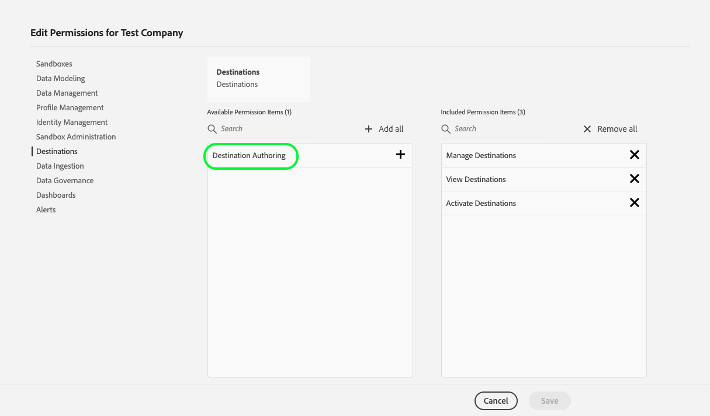

# 시작하기

## 개요 {#overview}

이 페이지에서는 Adobe Experience Platform Destination SDK 사용을 인증하고 시작하는 방법에 대해 설명합니다. 여기에는 Adobe I/O 인증 자격 증명, 샌드박스 이름 및 대상 작성 액세스 제어 권한을 얻는 방법에 대한 지침이 포함되어 있습니다.

## 용어 {#terminology}

이 안내서에서는 조직, 샌드박스 등 플랫폼별 개념을 사용합니다. 이러한 용어에 대한 정의는 [Experience Platform 용어집](https://experienceleague.adobe.com/docs/experience-platform/landing/glossary.html)을 참조하세요. 이 기능과 직접 관련된 용어는 [Destination SDK 용어집](/help/destinations/destination-sdk/glossary.md)을 참조하세요.

## 필요한 인증 자격 증명 가져오기 {#obtain-authentication-credentials}

Destination SDK은 인증을 위해 [Adobe I/O](https://www.adobe.io/) 게이트웨이를 사용합니다. Destination SDK 종단점에 대한 API를 호출하려면 API 호출에 특정 헤더를 제공해야 합니다. Adobe Exchange 팀과 함께 [Adobe Developer Console](https://developer.adobe.com/console)에 대한 인증을 설정합니다.

Destination SDK API 끝점을 정상적으로 호출하려면 [Experience Platform 인증 자습서](https://experienceleague.adobe.com/docs/experience-platform/landing/platform-apis/api-authentication.html?lang=ko)를 따르십시오. &quot;[API 키, 조직 ID 및 클라이언트 암호 생성](https://experienceleague.adobe.com/docs/experience-platform/landing/platform-apis/api-authentication.html#api-ims-secret)&quot; 단계에서 자습서를 시작합니다. Adobe Exchange 팀이 이전 단계를 처리합니다. 인증 자습서를 완료하면 아래와 같이 Destination SDK API 호출에서 필요한 각 헤더에 대한 값이 제공됩니다.

* `x-api-key: {API_KEY}`(클라이언트 ID라고도 함)
* `x-gw-ims-org-id: {ORG_ID}`(조직 ID라고도 함)
* `Authorization: Bearer {ACCESS_TOKEN}` 질문에 답합니다. 액세스 토큰의 만료 시간은 밀리초 단위로 표시되는 24시간이므로 새로 고쳐야 합니다. 액세스 토큰을 새로 고치려면 인증 자습서에 설명된 단계를 반복합니다.

<!--

### Obtain `Authorization: Bearer {ACCESS_TOKEN}`

To obtain the `{ACCESS_TOKEN}`, you must generate a JWT token and exchange it for the access token. Follow the steps below:

1. Follow the instructions in the [Generate JWT section](https://www.adobe.io/apis/experienceplatform/console/docs.html#!AdobeDocs/adobeio-console/master/credentials.md) in the credentials guide.
2. Follow the instructions in [Step 3: try it](https://www.adobe.io/authentication/auth-methods.html#!AdobeDocs/adobeio-auth/master/AuthenticationOverview/ServiceAccountIntegration.md) in the Service account connection guide.

You now have the required authentication headers `x-api-key: {API_KEY}`, `x-gw-ims-org-id: {ORG_ID}`, and `Authorization: Bearer {ACCESS_TOKEN}`.

>[!NOTE]
>
>The access token has an expiration time of 24 hours, expressed in milliseconds, so you will have to refresh it. To refresh the access token, repeat the steps outlined in this section.

-->

## 대상 소유권 및 샌드박스 {#destination-ownership}

Experience Platform의 모든 리소스는 특정 가상 샌드박스로 분리됩니다. Destination SDK 요청에는 작업이 수행되는 샌드박스의 이름을 지정하는 헤더가 필요합니다.

* `x-sandbox-name: {SANDBOX_NAME}`

Adobe Exchange 팀은 Destination SDK API 엔드포인트 호출에 사용해야 하는 샌드박스 이름을 제공합니다.

## RBAC(역할 기반 액세스 제어) {#rbac}

[참조 설명서](functionality/configuration-options.md)에 설명된 Destination SDK API 끝점을 사용하려면 **[!UICONTROL 대상 작성]** 액세스 제어 권한이 필요합니다. Adobe Exchange 팀과 함께 [Adobe Admin Console](https://adminconsole.adobe.com/)에서 이 권한을 귀하에게 할당해 보세요.

자세한 내용은 다음 Experience Platform 액세스 제어 문서를 참조하십시오.

* [제품 프로필에 대한 권한 관리](/help/access-control/ui/permissions.md)
* [Experience Platform에 사용 가능한 권한](/help/access-control/home.md#permissions)
* [Adobe Admin Console 설명서](https://helpx.adobe.com/enterprise/using/admin-console.html)

## 추가 고려 사항 {#additional-considerations}

* 제품화된/공개 대상의 경우 대상 구성을 만들거나 편집하든 대상 구성에 대한 모든 변경 사항은 Adobe의 검토 및 승인을 받아야 합니다. 변경 사항은 검토가 완료된 후에만 대상에 반영됩니다. 자신만 사용할 수 있는 개인 대상에는 적용되지 않습니다.
* 동일한 조직에 속하고 샌드박스에 액세스할 수 있는 사용자만 대상 구성을 편집할 수 있습니다.

## 다음 단계 {#next-steps}

이 문서의 단계에 따라 Adobe I/O을 위한 인증 자격 증명, 샌드박스 이름 및 대상 작성 액세스 제어 권한을 획득했습니다. 다음으로, Destination SDK을 사용하여 대상을 설정할 수 있습니다.

* 대상 유형에 따라 다음 구성 안내서를 참조하십시오.

   * [Destination SDK을 사용하여 스트리밍 대상 구성](guides/configure-destination-instructions.md)
   * [Destination SDK을 사용하여 파일 기반 대상 구성](guides/configure-file-based-destination-instructions.md)

* 모든 작업에 대해서는 [대상 작성 API 설명서](https://www.adobe.io/experience-platform-apis/references/destination-authoring/)를 참조하십시오.
* [대상 작성 API Postman 컬렉션](https://github.com/adobe/experience-platform-postman-samples/blob/master/apis/experience-platform/Destination%20Authoring%20API.postman_collection.json)을(를) 사용하여 Destination SDK API 끝점을 사용하여 대상을 구성합니다. Postman을 시작하려면 환경 및 컬렉션을 가져오는 [단계](https://learning.postman.com/docs/getting-started/importing-and-exporting-data/) 및 Postman 환경을 만드는 [비디오 안내서](https://video.tv.adobe.com/v/28832)를 참조하세요.
