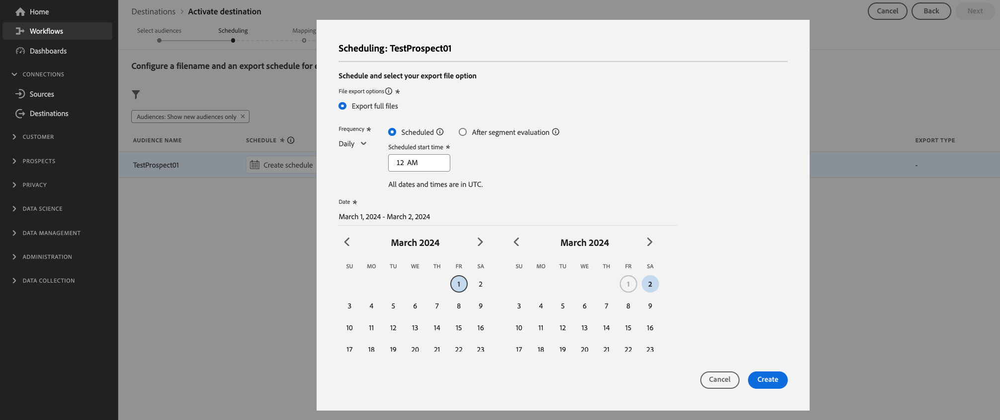

# 잠재 고객을 스토리지 위치로 내보내도록 파일 기반 대상 구성

## 개요 {#overview}

이 페이지에서는 [잠재 고객](/help/destinations/ui/activate-prospect-audiences.md)을(를) 내보내기 위해 Destination SDK을 사용하여 사용자 지정 [파일 형식 옵션](configure-file-formatting-options.md) 및 사용자 지정 [파일 이름 구성](../../functionality/destination-configuration/batch-configuration.md#file-name-configuration)으로 파일 기반 대상을 구성하는 방법에 대해 설명합니다. 이 안내서의 예제에서는 잠재 고객 프로필 대상을 Amazon S3 위치로 내보내는 방법을 설명합니다.

STFP 또는 기타 스토리지 위치를 설정하여 잠재 고객을 내보낼 수도 있습니다. 기억해야 할 중요한 부분은 [2](#create-destination-configuration)단계에서 대상 구성에 아래 코드 조각을 추가하여 [워크플로에서 잠재 고객 대상 내보내기](/help/destinations/ui/activate-prospect-audiences.md)를 사용하도록 설정하는 것입니다.

```json
  "sources": [
    "UNIFIED_PROFILE_PROSPECTS"
  ],
```

아래에 사용된 매개 변수에 대한 자세한 설명은 대상 SDK의 [구성 옵션](../../functionality/configuration-options.md)을 참조하세요.

## 전제 조건 {#prerequisites}

아래 설명된 단계로 진행하기 전에 [Destination SDK 시작](../../getting-started.md) 페이지에서 Destination SDK API를 사용하는 데 필요한 인증 자격 증명 및 기타 필수 구성 요소를 가져오는 방법에 대한 정보를 참조하십시오.

## 1단계: 서버 및 파일 구성 만들기 {#create-server-file-configuration}

`/destination-server` 끝점을 사용하여 [서버 및 파일 구성을 만듭니다](../../authoring-api/destination-server/create-destination-server.md).

**API 형식**

```http
POST platform.adobe.io/data/core/activation/authoring/destination-servers
```

**요청**

다음 요청은 페이로드에 제공된 매개 변수로 구성된 새 대상 서버 구성을 만듭니다.
아래 페이로드에는 사용자가 Experience Platform UI에서 정의할 수 있는 사용자 지정 [CSV 파일 형식 지정](../../functionality/destination-server/file-formatting.md) 구성 매개 변수와 함께 일반 Amazon S3 구성이 포함되어 있습니다.

```shell
curl -X POST https://platform.adobe.io/data/core/activation/authoring/destination-server \
 -H 'Authorization: Bearer {ACCESS_TOKEN}' \
 -H 'Content-Type: application/json' \
 -H 'x-gw-ims-org-id: {ORG_ID}' \
 -H 'x-api-key: {API_KEY}' \
 -H 'x-sandbox-name: {SANDBOX_NAME}' \
 -d ' {
   "name":"Amazon S3 destination server with custom file formatting options",
   "destinationServerType":"FILE_BASED_S3",
   "fileBasedS3Destination":{
      "bucket":{
         "templatingStrategy":"PEBBLE_V1",
         "value":"{{customerData.bucketName}}"
      },
      "path":{
         "templatingStrategy":"PEBBLE_V1",
         "value":"{{customerData.path}}"
      }
   },
   "fileConfigurations":{
      "compression":{
         "templatingStrategy":"PEBBLE_V1",
         "value":"{{customerData.compression}}"
      },
      "fileType":{
         "templatingStrategy":"PEBBLE_V1",
         "value":"{{customerData.fileType}}"
      },
      "csvOptions":{
         "sep":{
            "templatingStrategy":"PEBBLE_V1",
            "value":"{{customerData.sep}}"
         },
         "encoding":{
            "templatingStrategy":"PEBBLE_V1",
            "value":"{{customerData.encoding}}"
         },
         "quote":{
            "templatingStrategy":"PEBBLE_V1",
            "value":"{{customerData.quote}}"
         },
         "quoteAll":{
            "templatingStrategy":"PEBBLE_V1",
            "value":"{{customerData.quoteAll}}"
         },
         "escape":{
            "templatingStrategy":"PEBBLE_V1",
            "value":"{{customerData.escape}}"
         },
         "escapeQuotes":{
            "templatingStrategy":"PEBBLE_V1",
            "value":"{{customerData.escapeQuotes}}"
         },
         "header":{
            "templatingStrategy":"PEBBLE_V1",
            "value":"{{customerData.header}}"
         },
         "ignoreLeadingWhiteSpace":{
            "templatingStrategy":"PEBBLE_V1",
            "value":"{{customerData.ignoreLeadingWhiteSpace}}"
         },
         "nullValue":{
            "templatingStrategy":"PEBBLE_V1",
            "value":"{{customerData.nullValue}}"
         },
         "dateFormat":{
            "templatingStrategy":"PEBBLE_V1",
            "value":"{{customerData.dateFormat}}"
         },
         "charToEscapeQuoteEscaping":{
            "templatingStrategy":"PEBBLE_V1",
            "value":"{{customerData.charToEscapeQuoteEscaping}}"
         },
         "emptyValue":{
            "templatingStrategy":"PEBBLE_V1",
            "value":"{{customerData.dateFormat}}"
         }
      }
   }
}'
```

성공한 응답은 구성의 고유 식별자(`instanceId`)를 포함하여 새 대상 서버 구성을 반환합니다. 다음 단계에서 필요한 대로 이 값을 저장합니다.

## 2단계: 대상 구성 만들기 {#create-destination-configuration}

이전 단계에서 대상 서버 및 파일 형식 지정 구성을 만든 후 이제 `/destinations` API 끝점을 사용하여 대상 구성을 만들 수 있습니다.

[1단계](#create-server-file-configuration)의 서버 구성을 이 대상 구성에 연결하려면 아래 API 요청의 `destinationServerId` 값을 [1단계](#create-server-file-configuration)에서 대상 서버를 만들 때 얻은 값으로 바꾸십시오.

**API 형식**

```http
POST platform.adobe.io/data/core/activation/authoring/destinations
```

**요청**

```shell
curl -X POST https://platform.adobe.io/data/core/activation/authoring/destinations \
 -H 'Authorization: Bearer {ACCESS_TOKEN}' \
 -H 'Content-Type: application/json' \
 -H 'x-gw-ims-org-id: {ORG_ID}' \
 -H 'x-api-key: {API_KEY}' \
 -H 'x-sandbox-name: {SANDBOX_NAME}' \
 -d '
{
   "name":"Amazon S3 destination to export prospect audiences",
   "description":"Amazon S3 destination to export prospect audiences",
   "status":"TEST",
   "sources": [
    "UNIFIED_PROFILE_PROSPECTS"
   ],
   "customerAuthenticationConfigurations":[
      {
         "authType":"S3"
      }
   ],
   "customerEncryptionConfigurations":[
      
   ],
   "customerDataFields":[
      {
         "name":"bucketName",
         "title":"Enter the name of your Amazon S3 bucket",
         "description":"Amazon S3 bucket name",
         "type":"string",
         "isRequired":true,
         "pattern": "(?=^.{3,63}$)(?!^(\\d+\\.)+\\d+$)(^(([a-z0-9]|[a-z0-9][a-z0-9\\-]*[a-z0-9])\\.)*([a-z0-9]|[a-z0-9][a-z0-9\\-]*[a-z0-9])$)",
         "readOnly":false,
         "hidden":false
      },
      {
         "name":"path",
         "title":"Enter the path to your S3 bucket folder",
         "description":"Enter the path to your S3 bucket folder",
         "type":"string",
         "isRequired":true,
         "pattern": "^[0-9a-zA-Z\\/\\!\\-_\\.\\*\\''\\(\\)]*((\\%SEGMENT_(NAME|ID)\\%)?\\/?)+$",
         "readOnly":false,
         "hidden":false
      },
      {
         "name":"sep",
         "title":"Enter your desired separator for each field and value",
         "description":"Enter your desired separator for each field and value",
         "type":"string",
         "isRequired":false,
         "readOnly":false,
         "hidden":false
      },
      {
         "name":"encoding",
         "title":"Select the desired CSV file encoding",
         "description":"Select the desired CSV file encoding",
         "type":"string",
         "enum":[
            "UTF-8",
            "UTF-16"
         ],
         "isRequired":false,
         "readOnly":false,
         "hidden":false
      },
      {
         "name":"quote",
         "title":"Quoted values escape character",
         "description":"Enter the desired character to be used for escaping quoted values.",
         "type":"string",
         "isRequired":false,
         "readOnly":false,
         "hidden":false
      },
      {
         "name":"quoteAll",
         "title":"Escape all quoted values",
         "description":"Select whether to escape all quoted values.",
         "type":"string",
         "enum":[
            "true",
            "false"
         ],
         "default":"true",
         "isRequired":true,
         "readOnly":false,
         "hidden":false
      },
      {
         "name":"escape",
         "title":"Quote escaping character",
         "description":"Enter the desired character to be used for escaping quotes inside an already quoted value.",
         "type":"string",
         "isRequired":false,
         "readOnly":false,
         "hidden":false
      },
      {
         "name":"escapeQuotes",
         "title":"Enclose quoted values within quotes",
         "description":"Select whether values containing quotes should always be enclosed in quotes.",
         "type":"string",
         "enum":[
            "true",
            "false"
         ],
         "isRequired":false,
         "default":"true",
         "readOnly":false,
         "hidden":false
      },
      {
         "name":"header",
         "title":"Generate file header.",
         "description":"Select whether to write the names of columns as the first line of the exported files.",
         "type":"string",
         "isRequired":false,
         "enum":[
            "true",
            "false"
         ],
         "readOnly":false,
         "default":"true",
         "hidden":false
      },
      {
         "name":"ignoreLeadingWhiteSpace",
         "title":"Ignore leading white space",
         "description":"Select whether leading whitespaces should be trimmed from exported values.",
         "type":"string",
         "isRequired":false,
         "enum":[
            "true",
            "false"
         ],
         "readOnly":false,
         "default":"true",
         "hidden":false
      },
      {
         "name":"nullValue",
         "title":"NULL value string format",
         "description":"Enter the string representation of a NULL value. ",
         "type":"string",
         "isRequired":false,
         "readOnly":false,
         "hidden":false
      },
      {
         "name":"dateFormat",
         "title":"Date format",
         "description":"Enter the desired date format. ",
         "type":"string",
         "default":"yyyy-MM-dd",
         "isRequired":false,
         "readOnly":false,
         "hidden":false
      },
      {
         "name":"charToEscapeQuoteEscaping",
         "title":"Quote escaping escape character",
         "description":"Enter the desired character to be used for escaping the escaping of a quote character.",
         "type":"string",
         "isRequired":false,
         "readOnly":false,
         "hidden":false
      },
      {
         "name":"emptyValue",
         "title":"Empty value string format",
         "description":"Enter the string representation of an empty value.",
         "type":"string",
         "isRequired":false,
         "readOnly":false,
         "default":"",
         "hidden":false
      },
      {
         "name":"compression",
         "title":"Compression format",
         "description":"Select the desired file compression format.",
         "type":"string",
         "isRequired":true,
         "readOnly":false,
         "enum":[
            "SNAPPY",
            "GZIP",
            "DEFLATE",
            "NONE"
         ]
      },
      {
         "name":"fileType",
         "title":"File type",
         "description":"Select the exported file type.",
         "type":"string",
         "isRequired":true,
         "readOnly":false,
         "hidden":false,
         "enum":[
            "csv",
            "json",
            "parquet"
         ],
         "default":"csv"
      }
   ],
   "uiAttributes":{
      "documentationLink":"https://www.adobe.com/go/destinations-amazon-s3-en",
      "category":"cloudStorage",
      "connectionType":"S3",
      "flowRunsSupported":true,
      "monitoringSupported":true,
      "frequency":"Batch"
   },
   "destinationDelivery":[
      {
         "deliveryMatchers":[
            {
               "type":"SOURCE",
               "value":[
                  "batch"
               ]
            }
         ],
         "authenticationRule":"CUSTOMER_AUTHENTICATION",
         "destinationServerId":"{{destinationServerId}}"
      }
   ],
   "schemaConfig":{
      "profileRequired":true,
      "segmentRequired":true,
      "identityRequired":true
   },
   "batchConfig":{
      "allowMandatoryFieldSelection":true,
      "allowDedupeKeyFieldSelection":true,
      "defaultExportMode":"DAILY_FULL_EXPORT",
      "allowedExportMode":[
         "DAILY_FULL_EXPORT"
      ],
      "allowedScheduleFrequency":[
         "DAILY",
         "ONCE"
      ],
      "defaultFrequency":"DAILY",
      "defaultStartTime":"00:00",
      "filenameConfig":{
         "allowedFilenameAppendOptions":[
            "SEGMENT_NAME",
            "DESTINATION_INSTANCE_ID",
            "DESTINATION_INSTANCE_NAME",
            "ORGANIZATION_NAME",
            "SANDBOX_NAME",
            "DATETIME",
            "CUSTOM_TEXT"
         ],
         "defaultFilenameAppendOptions":[
            "DATETIME"
         ],
         "defaultFilename":"%DESTINATION%_%SEGMENT_ID%"
      },
      "backfillHistoricalProfileData":true
   }
}'
```

성공한 응답은 구성의 고유 식별자(`instanceId`)를 포함하여 새 대상 구성을 반환합니다. 대상 구성을 업데이트하기 위해 추가 HTTP 요청을 수행해야 하는 경우 이 값을 필요에 따라 저장합니다.

## 3단계: Experience Platform UI 확인 {#verify-ui}

위의 구성에 따라 이제 Experience Platform 카탈로그에 사용할 새 개인 대상 카드가 표시됩니다.


아래 이미지 및 녹화에서 파일 기반 대상에 대한 [활성화 워크플로](../../../ui/activate-batch-profile-destinations.md)의 옵션이 대상 구성에서 선택한 옵션과 어떻게 일치하는지 확인하십시오.

대상에 대한 세부 정보를 입력할 때 필드가 구성에서 설정한 사용자 정의 데이터 필드인지 확인합니다.

>[!TIP]
>
>사용자 지정 데이터 필드를 대상 구성에 추가하는 순서는 UI에 반영되지 않습니다. 사용자 지정 데이터 필드는 항상 아래 화면 녹화에 표시된 순서로 표시됩니다.


내보내기 간격을 예약할 때 `batchConfig` 구성에서 설정한 필드가 어떻게 표시되는지 확인합니다.


파일 이름 구성 옵션을 볼 때 표시된 필드가 구성에서 설정한 `filenameConfig` 옵션을 어떻게 나타내는지 확인합니다.


위에 언급된 필드를 조정하려면 [단계 1](#create-server-file-configuration)과 [단계 2](#create-destination-configuration)을(를) 반복하여 필요에 따라 구성을 수정하십시오.

## 4단계: (선택 사항) 대상 Publish {#publish-destination}

>[!NOTE]
>
>이 단계는 직접 사용할 개인 대상을 만들고 다른 고객이 사용할 대상 카탈로그에 게시하려고 하지 않는 경우에는 필요하지 않습니다.

대상을 구성한 후 [대상 게시 API](../../publishing-api/create-publishing-request.md)를 사용하여 검토를 위해 Adobe에 구성을 제출합니다.

## 5단계: (선택 사항) 대상 문서화 {#document-destination}

>[!NOTE]
>
>이 단계는 직접 사용할 개인 대상을 만들고 다른 고객이 사용할 대상 카탈로그에 게시하려고 하지 않는 경우에는 필요하지 않습니다.

[제품화된 통합을 만드는 ISV(독립 소프트웨어 공급업체) 또는 SI(시스템 통합자)인 경우](../../overview.md#productized-custom-integrations) [셀프서비스 설명서 프로세스](../../docs-framework/documentation-instructions.md)를 사용하여 [Experience Platform 대상 카탈로그](../../../catalog/overview.md)에서 대상에 대한 제품 설명서 페이지를 만드십시오.

## 다음 단계 {#next-steps}

이 문서를 읽으면 이제 Destination SDK을 사용하여 사용자 지정 [!DNL Amazon S3] 대상을 작성하여 잠재 고객을 내보내는 방법을 이해할 수 있습니다.
