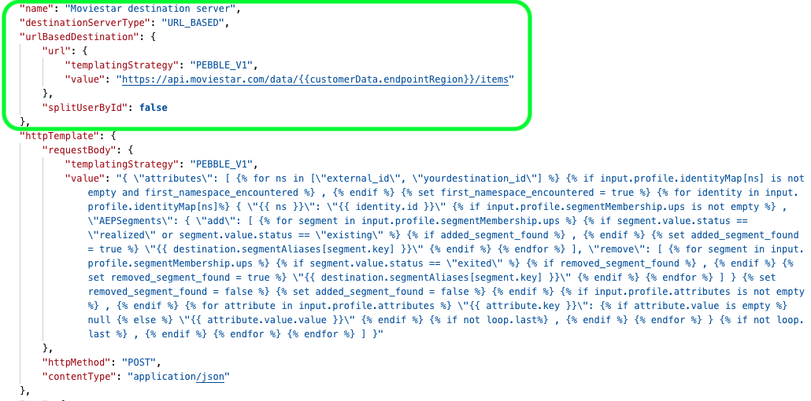

# 스트리밍 대상 서버 및 템플릿 사양에 대한 구성 옵션

## 개요 {#overview}

공통 끝점을 통해 Adobe Experience Platform Destination SDK에서 서버 및 템플릿 사양을 구성할 수 있습니다. `/authoring/destination-servers`. 읽기 [대상 API 엔드포인트 작업](./destination-server-api.md) 엔드포인트에서 수행할 수 있는 전체 작업 목록입니다.

## 서버 사양 {#server-specs}



고객은 HTTP 내보내기를 통해 Adobe Experience Platform에서 대상으로 데이터를 활성화할 수 있습니다. 서버 구성에는 메시지를 받는 서버(사용자 측 서버)에 대한 정보가 포함되어 있습니다.

이 프로세스는 사용자 데이터를 일련의 HTTP 메시지로 대상 플랫폼에 전달합니다. 아래의 매개 변수는 HTTP 서버 사양 템플릿을 형성합니다.

| 매개 변수 | 유형 | 설명 |
|---|---|---|
| `name` | 문자열 | *필수 여부.* Adobe 시에만 표시되는 서버의 친숙한 이름을 나타냅니다. 이 이름은 파트너나 고객에게 표시되지 않습니다. 예 `Moviestar destination server`. |
| `destinationServerType` | 문자열 | *필수 여부.* 다음으로 설정 `URL_BASED` 스트리밍 대상용입니다. |
| `templatingStrategy` | 문자열 | *필수 여부.* <ul><li>사용 `PEBBLE_V1` 에서 고정 값 대신 매크로를 사용하는 경우 `value` 필드. 다음과 같은 엔드포인트가 있는 경우 이 옵션을 사용합니다. `https://api.moviestar.com/data/{{customerData.region}}/items` </li><li> 사용 `NONE` Adobe 측에 변환이 필요하지 않은 경우, 예를 들어 다음과 같은 엔드포인트가 있는 경우: `https://api.moviestar.com/data/items` </li></ul> |
| `value` | 문자열 | *필수 여부.* Experience Platform이 연결해야 하는 API 끝점의 주소를 입력합니다. |

{style="table-layout:auto"}

## 템플릿 사양 {#template-specs}


템플릿 사양을 사용하면 내보낸 메시지의 서식을 대상으로 지정하는 방법을 구성할 수 있습니다. Adobe은 다음과 유사한 템플릿 언어를 사용합니다. [진자](https://jinja.palletsprojects.com/en/2.11.x/) 를 클릭하여 XDM 스키마의 필드를 대상에서 지원하는 형식으로 변환합니다. 변환에 대한 자세한 내용은 아래 링크를 참조하십시오.

* [메시지 포맷](./message-format.md)
* [ID, 속성 및 세그먼트 멤버십 변환에 템플릿 언어 사용 ](./message-format.md#using-templating)

>[!TIP]
>
>Adobe 오퍼 [개발자 도구](./create-template.md) 이렇게 하면 메시지 변환 템플릿을 만들고 테스트하는 데 도움이 됩니다.

## 스트리밍 대상 예제 구성  {#example-configuration}

```json
{
   "name":"Moviestar destination server",
   "destinationServerType":"URL_BASED",
   "urlBasedDestination":{
      "url":{
         "templatingStrategy":"PEBBLE_V1",
         "value":"https://api.moviestar.com/data/{{customerData.endpointRegion}}/items"
      }
   },
   "httpTemplate":{
      "httpMethod":"POST",
      "requestBody":{
         "templatingStrategy":"PEBBLE_V1",
         "value":"{ \"attributes\": [   ,    { \"{{ ns }}\": \"{{ identity.id }}\"  , \"AEPSegments\": { \"add\": [    ,   \"{{ destination.segmentAliases[segment.key] }}\"   ], \"remove\": [    ,   \"{{ destination.segmentAliases[segment.key] }}\"   ] }     ,   \"{{ attribute.key }}\":  null  \"{{ attribute.value.value }}\"   ,   }  ,    ] }"
      },
      "contentType":"application/json"
   }
}
```

| 매개 변수 | 유형 | 설명 |
|---|---|---|
| `httpMethod` | 문자열 | *필수 여부.* Adobe이 서버 호출에 사용할 메서드입니다. 옵션은 다음과 같습니다 `GET`, `PUT`, `POST`, `DELETE`, `PATCH`. |
| `templatingStrategy` | 문자열 | *필수 여부.*`PEBBLE_V1` 사용. |
| `value` | 문자열 | *필수 여부.* 이 문자열은 Platform 고객의 데이터를 서비스가 기대하는 형식으로 변환하는 문자 이스케이프 처리된 버전입니다. <br> 템플릿 작성 방법에 대한 자세한 내용은 [템플릿 섹션 사용](./message-format.md#using-templating). <br> 문자 이스케이프에 대한 자세한 내용은 [RFC JSON 표준, 섹션 7](https://tools.ietf.org/html/rfc8259#section-7). <br> 간단한 변환의 예를 보려면 [프로필 속성](./message-format.md#attributes) 변환. |
| `contentType` | 문자열 | *필수 여부.* 서버가 허용하는 콘텐츠 유형입니다. 이 값은 다음과 같을 수 있습니다. `application/json`. |

{style="table-layout:auto"}