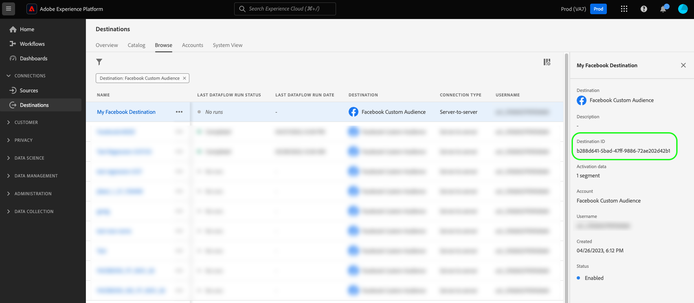

# 샘플 프로필을 사용하여 파일 기반 대상 테스트

## 개요 {#overview}

이 페이지에서는 `/testing/destinationInstance` API 끝점을 사용하여 파일 기반 대상이 올바르게 구성되었는지 테스트하고 구성된 대상에 대한 데이터 흐름의 무결성을 확인하는 방법에 대해 설명합니다.

호출에 [샘플 프로필](file-based-sample-profile-generation-api.md)을(를) 추가하거나 추가하지 않고 테스트 끝점을 요청할 수 있습니다. 요청에 프로필을 보내지 않는 경우 API는 샘플 프로필을 자동으로 생성하여 요청에 추가합니다.

자동 생성된 샘플 프로필에는 일반 데이터가 포함되어 있습니다. 보다 직관적인 사용자 지정 프로필 데이터로 대상을 테스트하려면 [샘플 프로필 생성 API](file-based-sample-profile-generation-api.md)를 사용하여 샘플 프로필을 생성한 다음 응답을 사용자 지정하고 `/testing/destinationInstance` 끝점에 대한 요청에 포함하십시오.

## 시작하기 {#getting-started}

계속하기 전에 [시작 안내서](../../getting-started.md)에서 필요한 대상 작성 권한 및 필수 헤더를 얻는 방법을 포함하여 API를 성공적으로 호출하기 위해 알아야 하는 중요한 정보를 검토하십시오.

## 전제 조건 {#prerequisites}

`/testing/destinationInstance` 끝점을 사용하기 전에 다음 조건을 충족하는지 확인하십시오.

* Destination SDK을 통해 만든 기존 파일 기반 대상이 있으며 [대상 카탈로그](../../../ui/destinations-workspace.md)에서 볼 수 있습니다.
* Experience Platform UI에서 대상에 대한 활성화 플로우를 하나 이상 만들었습니다.
* API 요청을 성공적으로 수행하려면 테스트할 대상 인스턴스에 해당하는 대상 인스턴스 ID가 필요합니다. Experience Platform UI에서 대상과의 연결을 검색할 때 API 호출에 사용해야 하는 대상 인스턴스 ID를 URL에서 가져옵니다.

  URL에서 대상 인스턴스 ID를 가져오는 방법을 보여 주는 
* *선택 사항*: API 호출에 추가된 샘플 프로필로 대상 구성을 테스트하려면 [/sample-profiles](file-based-sample-profile-generation-api.md) 끝점을 사용하여 기존 소스 스키마를 기반으로 샘플 프로필을 생성합니다. 샘플 프로필을 제공하지 않는 경우 API가 샘플 프로필을 생성하고 응답에서 반환합니다.

## 호출에 프로필을 추가하지 않고 대상 구성을 테스트합니다 {#test-without-adding-profiles}

**API 형식**

```http
POST /authoring/testing/destinationInstance/{DESTINATION_INSTANCE_ID}
```

**요청**

```shell
curl -X POST 'https://platform.adobe.io/data/core/activation/authoring/testing/destinationInstance/{DESTINATION_INSTANCE_ID}' \
 -H 'Authorization: Bearer {ACCESS_TOKEN}' \
 -H 'Content-Type: application/json' \
 -H 'x-gw-ims-org-id: {IMS_ORG}' \
 -H 'x-api-key: {API_KEY}' \
 -H 'x-sandbox-name: {SANDBOX_NAME}' \
```

| 경로 매개 변수 | 설명 |
| -------- | ----------- |
| `{DESTINATION_INSTANCE_ID}` | 샘플 프로필을 생성하고 있는 대상 인스턴스의 ID입니다. 이 ID를 얻는 방법에 대한 자세한 내용은 [필수 구성 요소](#prerequisites) 섹션을 참조하십시오. |

**응답**

성공한 응답은 응답 페이로드와 함께 HTTP 상태 200을 반환합니다.

```json
{
   "activations":[
      {
         "segment":"6fa55d3a-18e1-4f65-95ed-ac8fdb03b45b",
         "flowRun":"81150d76-7909-46b6-83f4-fc855a92de07"
      },
      {
         "segment":"5fa55d3a-18e1-4f65-95ed-ac8fdb03b45b",
         "flowRun":"4706780a-2ab3-4d33-8c76-7c87fd318cd8"
      }
   ],
   "results":"/authoring/testing/destinationInstance/fd3449fb-b929-45c8-9f3d-06b9d6aac328/results?flowRunIds=4706780a-2ab3-4d33-8c76-7c87fd318cd8,81150d76-7909-46b6-83f4-fc855a92de07",
   "inputProfiles":[
      {
         "segmentMembership":{
            "ups":{
               "fea8d394-5a8c-4cea-bebc-df020ce37f5c":{
                  "lastQualificationTime":"2022-01-13T11:33:28.211895Z",
                  "status":"realized"
               },
               "5fa55d3a-18e1-4f65-95ed-ac8fdb03b45b":{
                  "lastQualificationTime":"2022-01-13T11:33:28.211893Z",
                  "status":"realized"
               }
            }
         },
         "personalEmail":{
            "address":"john.smith@abc.com"
         },
         "identityMap":{
            "crmid":[
               {
                  "id":"crmid-P1A7l"
               }
            ]
         },
         "person":{
            "name":{
               "firstName":"string",
               "lastName":"string"
            }
         }
      }
   ]
}
```

| 속성 | 설명 |
| -------- | ----------- |
| `activations` | 활성화된 각 대상자에 대한 대상자 ID 및 흐름 실행 ID를 반환합니다. 활성화 항목(및 관련 생성 파일)의 수는 대상 인스턴스에서 매핑된 대상자의 수와 같습니다. <br><br> 예: 두 대상을 대상 인스턴스에 매핑하면 `activations` 배열에 두 항목이 포함됩니다. 활성화된 각 대상자는 내보낸 하나의 파일에 해당합니다. |
| `results` | [결과 API](file-based-destination-results-api.md)를 호출하여 통합을 추가로 테스트하는 데 사용할 수 있는 대상 인스턴스 ID와 흐름 실행 ID를 반환합니다. |
| `inputProfiles` | API에서 자동으로 생성된 샘플 프로필을 반환합니다. |

{style="table-layout:auto"}

## 호출에 추가된 프로필을 사용하여 대상 구성 테스트 {#test-with-added-profiles}

보다 직관적인 사용자 지정 프로필 데이터로 대상을 테스트하려면 [/sample-profiles](file-based-sample-profile-generation-api.md) 끝점에서 얻은 응답을 선택한 값으로 사용자 지정하고 `/testing/destinationInstance` 끝점에 대한 요청에 사용자 지정 프로필을 포함할 수 있습니다.

**API 형식**

```http
POST  /testing/destinationInstance/{DESTINATION_INSTANCE_ID}
```

**요청**

```shell
curl -X POST 'https://platform.adobe.io/data/core/activation/authoring/testing/destinationInstance/{DESTINATION_INSTANCE_ID}' 
 -H 'Authorization: Bearer {ACCESS_TOKEN}' \
 -H 'Content-Type: application/json' \
 -H 'x-gw-ims-org-id: {IMS_ORG}' \
 -H 'x-api-key: {API_KEY}' \
 -H 'x-sandbox-name: {SANDBOX_NAME}' \
 -d '
 {
   "profiles":[
      {
         "segmentMembership":{
            "ups":{
               "fea8d394-5a8c-4cea-bebc-df020ce37f5c":{
                  "lastQualificationTime":"2022-01-13T11:33:28.211895Z",
                  "status":"realized"
               },
               "5fa55d3a-18e1-4f65-95ed-ac8fdb03b45b":{
                  "lastQualificationTime":"2022-01-13T11:33:28.211893Z",
                  "status":"realized"
               }
            }
         },
         "personalEmail":{
            "address":"michaelsmith@example.com"
         },
         "identityMap":{
            "crmid":[
               {
                  "id":"Custom CRM ID"
               }
            ]
         },
         "person":{
            "name":{
               "firstName":"Michael",
               "lastName":"Smith"
            }
         }
      }
   ]
}'
```

| 매개변수 | 설명 |
| -------- | ----------- |
| `{DESTINATION_INSTANCE_ID}` | 테스트 중인 대상의 대상 인스턴스 ID입니다.  샘플 프로필을 생성하고 있는 대상 인스턴스의 ID입니다. 이 ID를 얻는 방법에 대한 자세한 내용은 [필수 구성 요소](#prerequisites) 섹션을 참조하십시오. |
| `profiles` | 하나 이상의 프로필을 포함할 수 있는 배열입니다. [샘플 프로필 API 끝점](file-based-sample-profile-generation-api.md)을 사용하여 이 API 호출에 사용할 프로필을 생성합니다. |

**응답**

성공한 응답은 응답 페이로드와 함께 HTTP 상태 200을 반환합니다.

```json
{
   "activations":[
      {
         "segment":"6fa55d3a-18e1-4f65-95ed-ac8fdb03b45b",
         "flowRun":"81150d76-7909-46b6-83f4-fc855a92de07"
      },
      {
         "segment":"5fa55d3a-18e1-4f65-95ed-ac8fdb03b45b",
         "flowRun":"4706780a-2ab3-4d33-8c76-7c87fd318cd8"
      }
   ],
   "results":"/authoring/testing/destinationInstance/fd3449fb-b929-45c8-9f3d-06b9d6aac328/results?flowRunIds=4706780a-2ab3-4d33-8c76-7c87fd318cd8,81150d76-7909-46b6-83f4-fc855a92de07",
   "inputProfiles":[
      {
         "segmentMembership":{
            "ups":{
               "fea8d394-5a8c-4cea-bebc-df020ce37f5c":{
                  "lastQualificationTime":"2022-01-13T11:33:28.211895Z",
                  "status":"realized"
               },
               "5fa55d3a-18e1-4f65-95ed-ac8fdb03b45b":{
                  "lastQualificationTime":"2022-01-13T11:33:28.211893Z",
                  "status":"realized"
               }
            }
         },
         "personalEmail":{
            "address":"michaelsmith@example.com"
         },
         "identityMap":{
            "crmid":[
               {
                  "id":"Custom CRM ID"
               }
            ]
         },
         "person":{
            "name":{
               "firstName":"Michael",
               "lastName":"Smith"
            }
         }
      }
   ]
}
```

| 속성 | 설명 |
| -------- | ----------- |
| `activations` | 활성화된 각 대상자에 대한 대상자 ID 및 흐름 실행 ID를 반환합니다. 활성화 항목(및 관련 생성 파일)의 수는 대상 인스턴스에서 매핑된 대상자의 수와 같습니다. <br><br> 예: 두 대상을 대상 인스턴스에 매핑하면 `activations` 배열에 두 항목이 포함됩니다. 활성화된 각 대상자는 내보낸 하나의 파일에 해당합니다. |
| `results` | [결과 API](file-based-destination-results-api.md)를 호출하여 통합을 추가로 테스트하는 데 사용할 수 있는 대상 인스턴스 ID와 흐름 실행 ID를 반환합니다. |
| `inputProfiles` | API 요청에서 전달한 사용자 지정 샘플 프로필을 반환합니다. |

## API 오류 처리 {#api-error-handling}

Destination SDK API 엔드포인트는 일반적인 Experience Platform API 오류 메시지 원칙을 따릅니다. Experience Platform 문제 해결 안내서에서 [API 상태 코드](../../../../landing/troubleshooting.md#api-status-codes) 및 [요청 헤더 오류](../../../../landing/troubleshooting.md#request-header-errors)를 참조하십시오.

## 다음 단계

이제 이 문서를 읽고 파일 기반 대상 구성을 테스트하는 방법을 이해할 수 있습니다.

유효한 API 응답을 받은 경우 대상이 올바르게 작동합니다. 활성화 흐름에 대한 자세한 정보를 보려면 [자세한 활성화 결과 보기](file-based-destination-results-api.md)에 대한 응답에서 `results` 속성을 사용할 수 있습니다.

공개 대상을 만드는 경우 이제 [대상 구성을 제출](../../guides/submit-destination.md)하여 검토할 수 있습니다. Adobe
