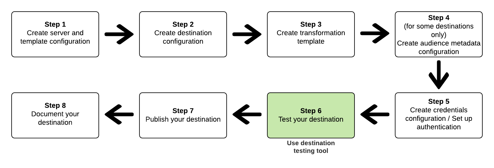

# 스트리밍 대상 테스트 API 개요

Adobe은 Destination SDK의 일부로서 대상을 구성하고 테스트하는 데 도움이 되는 개발자 도구를 제공합니다. 이 페이지에서는 대상 구성을 테스트하는 방법을 설명합니다. 메시지 변환 템플릿을 만드는 방법에 대한 자세한 내용은 [메시지 변환 템플릿 만들기 및 테스트](../../testing-api/streaming-destinations/create-template.md).

종료 **대상이 올바르게 구성되었는지 테스트하고 구성된 대상에 데이터 흐름의 무결성을 확인합니다.**&#x200B;를 사용하려면 *대상 테스트 도구*. 이 도구를 사용하여 REST API 엔드포인트로 메시지를 보내 대상 구성을 테스트할 수 있습니다.

아래에 나와 있는 그림은 대상에 맞는 테스트를 [대상 구성 워크플로우](../../guides/configure-destination-instructions.md) Destination SDK:



## 대상 테스트 도구 - 목적 및 사전 요구 사항 {#destination-testing-tool}

대상 테스트 도구를 사용하여 [서버 구성](../../authoring-api/destination-server/create-destination-server.md).

도구를 사용하기 전에 다음을 확인하십시오.
* 에 요약된 단계에 따라 대상을 구성합니다. [대상 구성 워크플로우](../../authoring-api/destination-configuration/create-destination-configuration.md) 및
* 에 자세히 설명된 대로 대상에 연결을 설정합니다. [대상 인스턴스 ID를 가져오는 방법](../../testing-api/streaming-destinations/destination-testing-api.md#get-destination-instance-id).

이 도구를 사용하여 대상을 구성한 후 다음을 수행할 수 있습니다.
* 대상이 올바르게 구성되었는지 테스트합니다;
* 구성된 대상으로 데이터 흐름의 무결성을 확인합니다.

### 사용 방법 {#how-to-use}

>[!NOTE]
>
>전체 API 참조 설명서는 다음을 참조하십시오. [대상 테스트 API 작업](../../testing-api/streaming-destinations/destination-testing-api.md).

요청에 프로필을 추가하거나 사용하지 않고 대상 테스트 API 엔드포인트를 호출할 수 있습니다.

요청에 프로필을 추가하지 않으면 Adobe에서 내부적으로 해당 프로필을 생성하여 요청에 추가합니다. 이 요청에서 사용할 프로필을 생성하려면 다음을 참조하십시오. [샘플 프로필 생성 API 참조](../../testing-api/streaming-destinations/sample-profile-generation-api.md). 에 표시된 대로 소스 XDM 스키마를 기반으로 프로필을 생성해야 합니다 [API 참조](../../testing-api/streaming-destinations/sample-profile-generation-api.md#generate-sample-profiles-source-schema). 소스 스키마는 [조합 스키마](../../../../profile/ui/union-schema.md) 사용 중인 샌드박스의 예입니다.

응답에는 대상 요청 처리 결과가 포함됩니다. 요청에는 다음과 같은 세 가지 주요 섹션이 포함됩니다.
* 대상에 대한 Adobe에 의해 생성된 요청입니다.
* 대상에서 받은 응답입니다.
* 요청에서 보낸 프로필 목록, 프로필이 [요청에 사용자가 추가](../../testing-api/streaming-destinations/destination-testing-api.md#test-with-added-profiles), 또는 Adobe이 생성하는 경우 [대상 테스트 요청의 본문이 비어 있습니다.](../../testing-api/streaming-destinations/destination-testing-api.md#test-without-adding-profiles).

>[!NOTE]
>
>Adobe은 여러 요청 및 응답 쌍을 생성할 수 있습니다. 예를 들어 프로필이 있는 대상으로 10개의 프로필을 보내는 경우 `maxUsersPerRequest` 값이 7이면 7개의 프로필과 3개의 프로필이 있는 또 다른 요청이 있습니다.

**본문에 프로필 매개 변수가 있는 샘플 요청**

```shell
curl --location --request POST 'https://platform.adobe.io/data/core/activation/authoring/testing/destinationInstance/3e0ac39c-ef14-4101-9fd9-cf0909814510' \
--header 'Content-Type: application/json' \
--header 'Accept: application/json' \
--header 'x-api-key: {API_KEY}' \
--header 'Authorization: Bearer {ACCESS_TOKEN}' \
--header 'x-gw-ims-org-id: {ORG_ID}' \
--header 'x-sandbox-name: {SANDBOX_NAME}' \
--data-raw '{
   "profiles":[
      {
         "segmentMembership":{
            "ups":{
               "374a9a6c-c719-4cdb-a660-155a2838e6d6":{
                  "lastQualificationTime":"2021-05-13T12:16:27.248585Z",
                  "status":"realized"
               },
               "896f8776-9498-47b4-b994-51cb3f61c2c5":{
                  "lastQualificationTime":"2021-05-13T12:16:27.248605Z",
                  "status":"realized"
               }
            }
         },
         "identityMap":{
            "Email":[
               {
                  "id":"Email-iIyJc"
               }
            ],
            "IDFA":[
               {
                  "id":"IDFA-viPAW"
               }
            ],
            "GAID":[
               {
                  "id":"GAID-Bc6LE"
               }
            ],
            "Email_LC_SHA256":[
               {
                  "id":"Email_LC_SHA256-gEOdj"
               }
            ]
         },
         "attributes":{
            "key":{
               "value":"string"
            }
         }
      }
   ]
}'
```

**본문에 프로필 매개 변수가 없는 샘플 요청**


```shell
curl --location --request POST 'https://platform.adobe.io/data/core/activation/authoring/testing/destinationInstance/3e0ac39c-ef14-4101-9fd9-cf0909814510' \
--header 'Content-Type: application/json' \
--header 'Accept: application/json' \
--header 'x-api-key: {API_KEY}' \
--header 'Authorization: Bearer {ACCESS_TOKEN}' \
--header 'x-gw-ims-org-id: {ORG_ID}' \
--header 'x-sandbox-name: {SANDBOX_NAME}' \
--data-raw ''
```

**샘플 응답**

컨텐츠는 `results.httpCalls` 매개 변수는 REST API에 따라 다릅니다.

```json
{
   "results":[
      {
         "aggregationKey":{
            "destinationInstanceId":"string",
            "segmentId":"string",
            "segmentStatus":"realized",
            "identityNamespaces":[
               [
                  "email",
                  "phone"
               ]
            ]
         },
         "httpCalls":[
            {
               "traceId":"a06fec2d-a886-4219-8975-4e4b7ed26539",
               "request":{
                  "body":"{ \"attributes\": [  { \"external_id\": \"external_id-h29Fq\"  , \"AdobeExperiencePlatformSegments\": { \"add\": [  \"Nirvana fans\" ,  \"RHCP fans\"   ], \"remove\": [  ] }  ,  \"key\":  \"string\"    }  ] }",
                  "headers":[
                     {
                        "Content-Type":"application/json"
                     }
                  ],
                  "method":"POST",
                  "uri":"https://api.moviestar.com/users/track"
               },
               "response":{
                  "body":"{\"status\": \"success\"}",
                  "code":"200",
                  "headers":[
                     {
                        "Connection":"keep-alive"
                     },
                     {
                        "Content-Type":"application/json"
                     },
                     {
                        "Server":"nginx"
                     },
                     {
                        "Vary":"Origin,Accept-Encoding"
                     },
                     {
                        "transfer-encoding":"chunked"
                     }
                  ]
               }
            }
         ]
      }
   ],
   "inputProfiles":[
      {
         "segmentMembership":{
            "ups":{
               "03fb9938-8537-4b4c-87f9-9c4d413a0ee5":{
                  "lastQualificationTime":"2021-06-17T12:25:12.872039Z",
                  "status":"realized"
               },
               "27e05542-d6a3-46c7-9c8e-d59d50229530":{
                  "lastQualificationTime":"2021-06-17T12:25:12.872042Z",
                  "status":"realized"
               }
            }
         },
         "personalEmail":{
            "address":"john.smith@abc.com"
         },
         "identityMap":{
            "Email":[
               {
                  "id":"Email-iIyJc"
               }
            ],
            "IDFA":[
               {
                  "id":"IDFA-viPAW"
               }
            ],
            "GAID":[
               {
                  "id":"GAID-Bc6LE"
               }
            ],
            "Email_LC_SHA256":[
               {
                  "id":"Email_LC_SHA256-gEOdj"
               }
            ]
         },
         "person":{
            "name":{
               "firstName":"string"
            }
         }
      }
   ]
}
```

요청 및 응답 매개 변수에 대한 설명은 다음을 참조하십시오 [대상 테스트 API 작업](../../testing-api/streaming-destinations/destination-testing-api.md).

## 다음 단계

대상을 테스트하고 올바르게 구성되었는지 확인한 후 [대상 게시 API](../../publishing-api/create-publishing-request.md) 검토를 위해 Adobe에 구성을 제출합니다.
