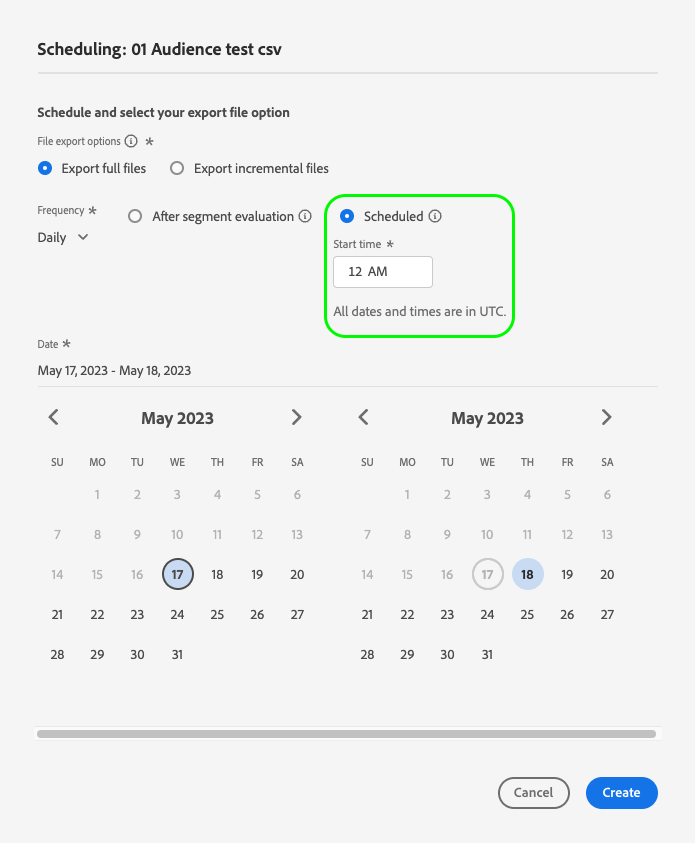

# 대상자 데이터를 활성화하여 묶음 프로필 내보내기 대상 활성화

>[!IMPORTANT]
> 
>데이터를 활성화하려면 **[!UICONTROL 대상 관리]**, **[!UICONTROL 대상 활성화]**, **[!UICONTROL 프로필 보기]**, 및 **[!UICONTROL 세그먼트 보기]** [액세스 제어 권한](/help/access-control/home.md#permissions). 다음 문서를 참조하십시오. [액세스 제어 개요](/help/access-control/ui/overview.md) 또는 제품 관리자에게 문의하여 필요한 권한을 얻으십시오.
>
>향상된 파일 내보내기 기능 베타 프로그램에 참여하는 일부 고객이 새로운 기능을 살펴보고 있습니다 **[!UICONTROL 매핑]** 활성화 워크플로우에서 의 일부로 단계 [새로운 베타 클라우드 스토리지 대상](/help/release-notes/2022/october-2022.md#destinations). 또한 [알려진 제한 사항](#known-limitations) 릴리스의 일부로 사용됩니다.

## 개요 {#overview}

이 문서에서는 클라우드 스토리지 및 이메일 마케팅 대상과 같은 Adobe Experience Platform 배치 프로필 기반 대상에서 대상 데이터를 활성화하는 데 필요한 워크플로우를 설명합니다.

## 사전 요구 사항 {#prerequisites}

대상에 데이터를 활성화하려면 [대상에 연결](./connect-destination.md). 아직 하지 않았다면 을(를) 참조하십시오. [대상 카탈로그](../catalog/overview.md)를 클릭하고 지원되는 대상을 탐색하고 사용할 대상을 구성합니다.

## 대상을 선택합니다 {#select-destination}

1. 이동 **[!UICONTROL 연결 > 대상]**, 을(를) 선택하고 을(를) 선택합니다. **[!UICONTROL 카탈로그]** 탭.

   

1. 선택 **[!UICONTROL 세그먼트 활성화]** 세그먼트를 활성화할 대상에 해당하는 카드에서 아래 그림과 같이 세그먼트를 활성화하십시오.

   

1. 세그먼트를 활성화하는 데 사용할 대상 연결을 선택한 다음 을 선택합니다 **[!UICONTROL 다음]**.

   

1. 다음 섹션으로 이동 [세그먼트 선택](#select-segments).

## 세그먼트 선택 {#select-segments}

세그먼트 이름 왼쪽에 있는 확인란을 사용하여 대상으로 활성화할 세그먼트를 선택한 다음 선택합니다 **[!UICONTROL 다음]**.


## 세그먼트 내보내기 예약 {#scheduling}

>[!CONTEXTUALHELP]
>id="platform_destinations_activate_schedule"
>title="예약"
>abstract="연필 아이콘을 사용하여 파일 내보내기 유형(전체 파일 또는 증분 파일)과 내보내기 빈도를 설정합니다."

[!DNL Adobe Experience Platform] 이메일 마케팅 및 클라우드 스토리지 대상의 데이터를 다음과 같은 형태로 내보냅니다. [!DNL CSV] 파일. 에서 **[!UICONTROL 예약]** 페이지에서 내보낼 각 세그먼트의 일정 및 파일 이름을 구성할 수 있습니다. 예약을 구성해야 하지만 파일 이름을 구성하는 것은 선택 사항입니다.

>[!IMPORTANT]
> 
>[!DNL Adobe Experience Platform] 에서는 내보내기 파일을 파일당 500만 개의 레코드(행)로 자동 분할합니다. 각 행은 하나의 프로필을 나타냅니다.
>
>파일 이름을 분할하면 파일이 더 큰 내보내기의 일부임을 나타내는 숫자가 추가됩니다. `filename.csv`, `filename_2.csv`, `filename_3.csv`.

을(를) 선택합니다 **[!UICONTROL 예약 만들기]** 목적지로 전송할 세그먼트에 해당하는 단추.


### 전체 파일 내보내기 {#export-full-files}

>[!CONTEXTUALHELP]
>id="platform_destinations_activate_exportoptions"
>title="파일 내보내기 옵션"
>abstract="선택 **전체 파일 내보내기** 세그먼트를 사용할 수 있는 모든 프로필의 전체 스냅샷을 내보내려면 선택 **증분 파일 내보내기** 를 입력하여 마지막 내보내기 이후 세그먼트에 적합한 프로필만 내보냅니다. <br> 첫 번째 증분 파일 내보내기에는 세그먼트에 적합한 모든 프로필이 포함되어 있으며 채우기 역할을 합니다. 향후 증분 파일에는 첫 번째 증분 파일 내보내기 이후 세그먼트에 적합한 프로필만 포함됩니다."
>additional-url="https://experienceleague.adobe.com/docs/experience-platform/destinations/ui/activate/activate-batch-profile-destinations.html#export-incremental-files" text="증분 파일 내보내기"

>[!CONTEXTUALHELP]
>id="platform_destinations_activationchaining_aftersegmentevaluation"
>title="세그먼트 평가 후 활성화"
>abstract="활성화는 일별 세그먼테이션 작업이 완료된 후 즉시 실행됩니다. 이렇게 하면 최신 프로필을 내보낼 수 있습니다."

>[!CONTEXTUALHELP]
>id="platform_destinations_activationchaining_scheduled"
>title="예약된 활성화"
>abstract="활성화는 하루 중 고정된 시간에 실행됩니다."

선택 **[!UICONTROL 전체 파일 내보내기]** 을(를) 사용하여 선택한 세그먼트에 대한 모든 프로필 자격에 대한 전체 스냅숏이 포함된 파일 내보내기를 트리거합니다.


1. 를 사용하십시오 **[!UICONTROL 빈도]** 선택기를 사용하여 내보내기 빈도를 선택합니다.

   * **[!UICONTROL 한 번]**: 한 번의 온디맨드 전체 파일 내보내기를 예약합니다.
   * **[!UICONTROL 일별]**: 전체 파일 내보내기를 지정하는 시간에 매일 한 번 예약합니다.

1. 를 사용하십시오 **[!UICONTROL 시간]** 세그먼트 평가 후 즉시 또는 지정된 시간에 예약된 기준으로 내보내기가 수행되는지 여부를 선택하려면 토글하십시오. 을(를) 선택할 때 **[!UICONTROL 예약됨]** 선택 사항을 사용하여 선택기에서 하루 중 시간을 선택할 수 있습니다. [!DNL UTC] 형식을 지정할 수도 있습니다.

   >[!NOTE]
   >
   >다음 **[!UICONTROL 세그먼트 평가 후]** 아래 설명된 옵션은 현재 베타 고객을 선택하는 경우에만 사용할 수 있습니다.

   를 사용하십시오 **[!UICONTROL 세그먼트 평가 후]** 일별 플랫폼 일괄 처리 세그먼테이션 작업이 완료된 후 즉시 활성화 작업을 실행하는 옵션. 이렇게 하면 활성화 작업이 실행될 때 최신 프로필을 대상으로 내보낼 수 있습니다.

   <!-- Batch segmentation currently runs at {{insert time of day}} and lasts for an average {{x hours}}. Adobe reserves the right to modify this schedule. -->

   
를 사용하십시오 **[!UICONTROL 예약됨]** 옵션을 선택합니다. 이렇게 하면 Experience Platform 프로필 데이터를 매일 동시에 내보낼 수 있지만, 내보내는 프로필은 활성화 작업이 시작되기 전에 배치 세분화 작업이 완료되었는지 여부에 따라 최신 프로필이 아닐 수 있습니다.

   

   >[!IMPORTANT]
   >
   >내부 Experience Platform 프로세스가 구성되는 방식 때문에 첫 번째 증분 또는 전체 파일 내보내기에 모든 채우기 데이터가 포함되지 않을 수 있습니다. <br> <br> 전체 파일과 증분 파일 모두에 대해 가장 최신의 채우기 데이터를 전체적으로 내보내려면 다음 날 오후 12시 GMT 이후에 첫 번째 파일 내보내기 시간을 설정하는 것이 좋습니다. 이 제한은 향후 릴리스에서 해결될 예정입니다.

1. 를 사용하십시오 **[!UICONTROL 날짜]** 선택기를 사용하여 내보내기를 수행할 날짜 또는 간격을 선택합니다. 일별 내보내기의 경우 가장 좋은 방법은 다운스트림 플랫폼에서 캠페인의 지속 시간에 맞춰 시작 및 종료 날짜를 설정하는 것입니다.

   >[!IMPORTANT]
   >
   > 내보내기 간격을 선택할 때 간격의 마지막 날이 내보내기에 포함되지 않습니다. 예를 들어, 1월 4일 - 11일 간격을 선택하는 경우 마지막 파일 내보내기는 1월 10일에 수행됩니다.

1. 선택 **[!UICONTROL 만들기]** 일정을 저장합니다.

### 증분 파일 내보내기 {#export-incremental-files}

선택 **[!UICONTROL 증분 파일 내보내기]** 첫 번째 파일이 선택한 세그먼트에 대한 모든 프로필 자격에 대한 전체 스냅샷이고 그 다음 파일은 이전 내보내기 이후의 증분 프로필 자격인 내보내기를 트리거합니다.

>[!IMPORTANT]
>
>처음 내보낸 증분 파일에는 세그먼트를 사용할 수 있는 모든 프로필이 포함되어 있으며 채우기 역할을 합니다.


1. 를 사용하십시오 **[!UICONTROL 빈도]** 선택기를 사용하여 내보내기 빈도를 선택합니다.

   * **[!UICONTROL 일별]**: 증분 파일 내보내기를 지정하는 시간에 매일 예약합니다.
   * **[!UICONTROL 시간별]**: 3, 6, 8 또는 12시간마다 증분 파일 내보내기 예약

1. 를 사용하십시오 **[!UICONTROL 시간]** 선택기를 사용하여 시간 선택, 위치 [!DNL UTC] 형식을 지정할 수도 있습니다.

   >[!IMPORTANT]
   >
   >내부 Experience Platform 프로세스가 구성되는 방식 때문에 첫 번째 증분 또는 전체 파일 내보내기에 모든 채우기 데이터가 포함되지 않을 수 있습니다. <br> <br> 전체 파일과 증분 파일 모두에 대해 가장 최신의 채우기 데이터를 전체적으로 내보내려면 다음 날 오후 12시 GMT 이후에 첫 번째 파일 내보내기 시간을 설정하는 것이 좋습니다. 이 제한은 향후 릴리스에서 해결될 예정입니다.

1. 를 사용하십시오 **[!UICONTROL 날짜]** 선택기를 사용하여 내보낼 간격을 선택합니다. 가장 좋은 방법은 다운스트림 플랫폼에서 캠페인의 지속 시간을 정렬하기 위해 시작 및 종료 날짜를 설정하는 것입니다.

   >[!IMPORTANT]
   >
   >간격의 마지막 날은 내보내기에 포함되지 않습니다. 예를 들어, 1월 4일 - 11일 간격을 선택하는 경우 마지막 파일 내보내기는 1월 10일에 수행됩니다.

1. 선택 **[!UICONTROL 만들기]** 일정을 저장합니다.

### 파일 이름 구성 {#file-names}

>[!CONTEXTUALHELP]
>id="platform_destinations_activate_filename"
>title="파일 이름 구성"
>abstract="파일 기반 대상의 경우 세그먼트별로 고유한 파일 이름이 생성됩니다. 파일 이름 편집기를 사용하여 고유한 파일 이름을 만들고 편집하거나 기본 이름을 유지합니다."

대부분의 대상의 경우, 기본 파일 이름은 대상 이름, 세그먼트 ID, 날짜 및 시간 표시기로 구성됩니다. 예를 들어 내보낸 파일 이름을 편집하여 서로 다른 캠페인을 구분하거나 데이터 내보내기 시간을 파일에 추가할 수 있습니다. 일부 대상 개발자는 대상에 대해 다른 기본 파일 이름 추가 옵션이 표시되도록 선택할 수 있습니다.

연필 아이콘을 선택하여 모달 창을 열고 파일 이름을 편집합니다. 파일 이름은 255자로 제한됩니다.

>[!NOTE]
>
>아래 이미지는 파일 이름을 편집할 수 있는 방법을 보여줍니다 [!DNL Amazon S3] 대상이 되지만 프로세스는 모든 배치 대상(예: SFTP, [!DNL Azure Blob Storage], 또는 [!DNL Google Cloud Storage]).


파일 이름 편집기에서 파일 이름에 추가할 다른 구성 요소를 선택할 수 있습니다.


대상 이름 및 세그먼트 ID는 파일 이름에서 제거할 수 없습니다. 이 외에도 다음을 추가할 수 있습니다.

| 파일 이름 옵션 | 설명 |
|---------|----------|
| **[!UICONTROL 세그먼트 이름]** | 내보낸 세그먼트의 이름입니다. |
| **[!UICONTROL 날짜 및 시간]** | 추가 중 선택 `MMDDYYYY_HHMMSS` 파일이 생성되는 시간의 Unix 10자리 타임스탬프의 형식 또는 형식입니다. 각 증분 내보내기로 생성된 동적 파일 이름을 파일에 포함하려면 다음 옵션 중 하나를 선택합니다. |
| **[!UICONTROL 사용자 정의 텍스트]** | 파일 이름에 추가할 사용자 지정 텍스트입니다. |
| **[!UICONTROL 대상 ID]** | 세그먼트를 내보내는 데 사용하는 대상 데이터 흐름의 ID입니다. <br> **참고**: 이 파일 이름 추가 옵션은 향상된 파일 내보내기 기능 베타 프로그램에 참여하는 베타 고객만 사용할 수 있습니다. 베타 프로그램에 액세스하려면 Adobe 담당자 또는 고객 지원 센터에 문의하십시오. |
| **[!UICONTROL 대상 이름]** | 세그먼트를 내보내는 데 사용하는 대상 데이터 흐름의 이름입니다. <br> **참고**: 이 파일 이름 추가 옵션은 향상된 파일 내보내기 기능 베타 프로그램에 참여하는 베타 고객만 사용할 수 있습니다. 베타 프로그램에 액세스하려면 Adobe 담당자 또는 고객 지원 센터에 문의하십시오. |
| **[!UICONTROL 조직 이름]** | Experience Platform 내의 조직 이름입니다. <br> **참고**: 이 파일 이름 추가 옵션은 향상된 파일 내보내기 기능 베타 프로그램에 참여하는 베타 고객만 사용할 수 있습니다. 베타 프로그램에 액세스하려면 Adobe 담당자 또는 고객 지원 센터에 문의하십시오. |
| **[!UICONTROL 샌드박스 이름]** | 세그먼트를 내보내는 데 사용하는 샌드박스의 ID입니다. <br> **참고**: 이 파일 이름 추가 옵션은 향상된 파일 내보내기 기능 베타 프로그램에 참여하는 베타 고객만 사용할 수 있습니다. 베타 프로그램에 액세스하려면 Adobe 담당자 또는 고객 지원 센터에 문의하십시오. |

{style="table-layout:auto"}

선택 **[!UICONTROL 변경 사항 적용]** 을 클릭하여 선택 항목을 확인합니다.

>[!IMPORTANT]
> 
>을(를) 선택하지 않으면 **[!UICONTROL 날짜 및 시간]** 구성 요소이면 파일 이름이 고정되고 새로 내보낸 파일은 각 내보내기로 저장소 위치에 있는 이전 파일을 덮어씁니다. 저장소 위치에서 이메일 마케팅 플랫폼으로 반복 가져오기 작업을 실행할 때 권장되는 옵션입니다.

모든 세그먼트 구성을 마치면 를 선택합니다 **[!UICONTROL 다음]** 계속하십시오.

## 프로필 속성 선택 {#select-attributes}

프로필 기반 대상의 경우 대상 대상으로 전송할 프로필 속성을 선택해야 합니다.

1. 에서 **[!UICONTROL 속성 선택]** 페이지를 선택하고 **[!UICONTROL 새 필드 추가]**.

   

1. 오른쪽 화살표를 선택합니다 **[!UICONTROL 스키마 필드]** 을 입력합니다.

   

1. 에서 **[!UICONTROL 필드 선택]** 페이지에서 대상으로 보낼 XDM 특성 또는 ID 네임스페이스를 선택한 다음 **[!UICONTROL 선택]**.

   

1. 매핑을 더 추가하려면 1~3단계를 반복합니다.

>[!NOTE]
>
> Adobe Experience Platform은 스키마에서 일반적으로 사용되는 4가지 권장 속성으로 선택 사항을 미리 채웁니다. `person.name.firstName`, `person.name.lastName`, `personalEmail.address`, `segmentMembership.status`.

>[!IMPORTANT]
>
>알려진 제한 사항으로 인해 현재 **[!UICONTROL 필드 선택]** 추가할 창 `segmentMembership.status` 로 내보내기 대신 값을 수동으로 붙여넣어야 합니다 `xdm: segmentMembership.status` 아래와 같이 스키마 필드에 추가합니다.
>
>

파일 내보내기는 여부에 따라 다음과 같은 방식으로 달라집니다 `segmentMembership.status` 이(가) 선택되어 있습니다.
* 만약 `segmentMembership.status` 필드를 선택하면 내보낸 파일이 포함됩니다. **[!UICONTROL 활성]** 초기 전체 스냅샷의 멤버 및 **[!UICONTROL 활성]** 및 **[!UICONTROL 만료됨]** 후속 증분 내보내기에 있는 멤버
* 만약 `segmentMembership.status` 필드를 선택하지 않고 내보낸 파일만 포함합니다 **[!UICONTROL 활성]** 초기 전체 스냅샷과 후속 증분 내보내기의 멤버


### 필수 속성 {#mandatory-attributes}

>[!CONTEXTUALHELP]
>id="platform_destinations_activate_mandatorykey"
>title="필수 속성 정보"
>abstract="내보낸 모든 프로필에 포함해야 하는 XDM 스키마 속성을 선택합니다. 필수 키가 없는 프로필은 대상으로 내보내지지 않습니다. 필수 키를 선택하지 않으면 속성과 관계없이 자격이 있는 모든 프로필이 내보내집니다."

필수 속성은 모든 프로필 레코드에 선택한 속성이 포함되도록 하는 사용자 활성화 확인란입니다. 예: 내보낸 모든 프로필에 이메일 주소가 &#x200B; 있습니다.

속성을 필수로 표시하여 [!DNL Platform] 특정 속성을 포함하는 프로필만 내보냅니다. 따라서 추가 필터링 양식으로 사용할 수 있습니다. 속성을 필수로 표시하는 것은 **not** 필수 여부.

필수 속성을 선택하지 않으면 해당 속성과 관계없이 모든 자격이 있는 프로필이 내보내집니다.

속성 중 하나가 [고유 식별자](../../destinations/catalog/email-marketing/overview.md#identity) 스키마에서 확인하십시오. 필수 속성에 대한 자세한 내용은 [이메일 마케팅 대상](../../destinations/catalog/email-marketing/overview.md#identity) 설명서.

### 중복 제거 키 {#deduplication-keys}

>[!CONTEXTUALHELP]
>id="platform_destinations_activate_deduplicationkey"
>title="중복 제거 키 기본 정보"
>abstract="중복 제거 키를 선택하여 내보내기 파일에서 동일한 프로필의 여러 레코드를 제거합니다. 중복 제거 키로 단일 네임스페이스 또는 최대 2개의 XDM 스키마 속성을 선택합니다. 중복 제거 키를 선택하지 않으면 내보내기 파일에서 중복된 프로필 항목이 발생할 수 있습니다."

중복 제거 키는 사용자가 프로필을 중복 제거하려는 ID를 결정하는 사용자 정의 기본 키입니다&#x200B;.

중복 제거 키를 사용하면 한 내보내기 파일에 동일한 프로필의 여러 레코드가 있을 수 없습니다.

에서 중복 제거 키를 사용할 수 있는 방법에는 세 가지가 있습니다 [!DNL Platform]:

* 단일 ID 네임스페이스를 로 사용 [!UICONTROL 중복 제거 키]
* 에서 단일 프로필 속성 사용 [!DNL XDM] 프로필로서의 [!UICONTROL 중복 제거 키]
* 의 두 프로필 속성 조합 사용 [!DNL XDM] 복합 키로서의 프로필

>[!IMPORTANT]
>
> 단일 ID 네임스페이스를 대상으로 내보낼 수 있으며, 네임스페이스가 자동으로 중복 제거 키로 설정됩니다. 여러 네임스페이스를 대상에 보낼 수 없습니다.
> 
> ID 네임스페이스와 프로필 속성의 조합을 중복 제거 키로 사용할 수 없습니다.

### 중복 제거 예 {#deduplication-example}

이 예에서는 선택한 중복 제거 키에 따라 중복 제거가 작동하는 방식을 보여줍니다.

다음 두 프로필을 고려해 보겠습니다.

**프로필 A**

```json
{
  "identityMap": {
    "Email": [
      {
        "id": "johndoe_1@example.com"
      },
      {
        "id": "johndoe_2@example.com"
      }
    ]
  },
  "segmentMembership": {
    "ups": {
      "fa5c4622-6847-4199-8dd4-8b7c7c7ed1d6": {
        "status": "existing",
        "lastQualificationTime": "2021-03-10 10:03:08"
      }
    }
  },
  "person": {
    "name": {
      "lastName": "Doe",
      "firstName": "John"
    }
  },
  "personalEmail": {
    "address": "johndoe@example.com"
  }
}
```

**프로필 B**

```json
{
  "identityMap": {
    "Email": [
      {
        "id": "johndoe_1@example.com"
      },
      {
        "id": "johndoe_2@example.com"
      }
    ]
  },
  "segmentMembership": {
    "ups": {
      "fa5c4622-6847-4199-8dd4-8b7c7c7ed1d6": {
        "status": "existing",
        "lastQualificationTime": "2021-04-10 11:33:28"
      }
    }
  },
  "person": {
    "name": {
      "lastName": "D",
      "firstName": "John"
    }
  },
  "personalEmail": {
    "address": "johndoe@example.com"
  }
}
```

### 중복 제거 사용 사례 1: 중복 제거 없음 {#deduplication-use-case-1}

중복 제거를 사용하지 않는 경우 내보내기 파일에 다음 항목이 포함됩니다.

| personalEmail | firstName | lastName |
|---|---|---|
| johndoe@example.com | 존 | Doe |
| johndoe@example.com | 존 | D |


### 중복 제거 사용 사례 2: id 네임스페이스를 기반으로 데이터 중복 제거 {#deduplication-use-case-2}

중복 제거를 [!DNL Email] 네임스페이스이면 내보내기 파일에 다음 항목이 포함됩니다. 프로필 B는 세그먼트에 대한 자격이 있는 최신 프로필이므로 내보낼 수 있는 유일한 프로필입니다.

| 이메일* | personalEmail | firstName | lastName |
|---|---|---|---|
| johndoe_1@example.com | johndoe@example.com | 존 | D |
| johndoe_2@example.com | johndoe@example.com | 존 | D |

### 중복 제거 사용 사례 3: 단일 프로필 속성을 기반으로 한 중복 제거 {#deduplication-use-case-3}

중복 제거를 `personal Email` 특성으로 내보내기 파일에는 다음 항목이 포함됩니다. 프로필 B는 세그먼트에 대한 자격이 있는 최신 프로필이므로 내보낼 수 있는 유일한 프로필입니다.

| personalEmail* | firstName | lastName |
|---|---|---|
| johndoe@example.com | 존 | D |


### 중복 제거 사용 사례 4: 두 개의 프로필 속성을 기반으로 한 중복 제거 {#deduplication-use-case-4}

복합 키로 중복 제거를 가정합니다. `personalEmail + lastName`로 지정하는 경우 내보내기 파일에는 다음 항목이 포함됩니다.

| personalEmail* | lastName* | firstName |
|---|---|---|
| johndoe@example.com | D | 존 |
| johndoe@example.com | Doe | 존 |


Adobe은 다음과 같은 ID 네임스페이스를 선택할 것을 권장합니다. [!DNL CRM ID] 모든 프로필 레코드가 고유하게 식별되도록 하기 위해 또는 중복 제거 키로 이메일 주소를 사용합니다.

>[!NOTE]
> 
>데이터 사용 레이블이 데이터 세트 전체 데이터 세트가 아닌 데이터 세트 내의 특정 필드에 적용된 경우 활성화 시 해당 필드 수준 레이블의 적용은 다음 조건에서 수행됩니다.
>
>* 필드는 세그먼트 정의에 사용됩니다.
>* 필드는 대상 대상에 대한 예상 속성으로 구성됩니다.
>
> 예를 들어, 필드가 `person.name.firstName` 에는 대상의 마케팅 작업과 충돌하는 특정 데이터 사용 레이블이 있으며, 검토 단계에서 데이터 사용 정책 위반이 표시됩니다. 자세한 내용은 [Adobe Experience Platform의 데이터 거버넌스](../../rtcdp/privacy/data-governance-overview.md#destinations).

## (베타) 매핑 {#mapping}

>[!IMPORTANT]
> 
>베타 고객이 향상된 기능을 볼 수 있음 선택 **[!UICONTROL 매핑]** 대체 단계 [프로필 속성 선택](#select-attributes) 위에 자세히 설명된 단계입니다. 이 새로운 기능 **[!UICONTROL 매핑]** 단계를 사용하면 내보낸 파일의 헤더를 원하는 사용자 지정 이름으로 편집할 수 있습니다.
> 
> 기능 및 설명서는 변경될 수 있습니다. 이 베타 프로그램에 액세스하려면 Adobe 담당자 또는 고객 지원 센터에 문의하십시오.

이 단계에서는 대상 대상으로 내보낸 파일에 추가할 프로필 속성을 선택해야 합니다. 내보낼 프로필 속성 및 ID를 선택하려면 다음을 수행하십시오.

1. 에서 **[!UICONTROL 매핑]** 페이지를 선택하고 **[!UICONTROL 새 필드 추가]**.

   

1. 오른쪽 화살표를 선택합니다 **[!UICONTROL 소스 필드]** 을 입력합니다.

   

1. 에서 **[!UICONTROL 소스 필드 선택]** 페이지에서 내보낸 파일에 포함할 프로필 속성 및 ID를 선택한 다음 대상을 선택합니다 **[!UICONTROL 선택]**.

   >[!TIP]
   > 
   >아래 이미지와 같이 검색 필드를 사용하여 선택 영역의 범위를 좁힐 수 있습니다.

   


1. 이제 내보내도록 선택한 필드가 매핑 보기에 나타납니다. 원할 경우 내보낸 파일에서 헤더의 이름을 편집할 수 있습니다. 이렇게 하려면 대상 필드에서 아이콘을 선택합니다.

   

1. 에서 **[!UICONTROL 대상 필드 선택]** 페이지를 입력한 다음 내보낸 파일에 있는 헤더의 원하는 이름을 입력하고 **[!UICONTROL 선택]**.

   

1. 이제 내보내도록 선택한 필드가 매핑 보기에 나타나고 내보낸 파일에 편집된 헤더를 표시합니다.

   

1. (선택 사항) 내보낸 필드를 선택할 수 있습니다. [필수 키](#mandatory-keys) 또는 [중복 제거 키](#deduplication-keys).

   

1. 내보낼 필드를 더 추가하려면 위의 단계를 반복합니다.

### 알려진 제한 사항 {#known-limitations}

새로운 **[!UICONTROL 매핑]** 페이지에는 다음과 같은 알려진 제한 사항이 있습니다.

#### 매핑 워크플로우를 통해 세그먼트 멤버십 속성을 선택할 수 없습니다

알려진 제한 사항으로 인해 현재 **[!UICONTROL 필드 선택]** 추가할 창 `segmentMembership.status` 로 내보내기 대신 값을 수동으로 붙여넣어야 합니다 `xdm: segmentMembership.status` 아래와 같이 스키마 필드에 추가합니다.


파일 내보내기는 여부에 따라 다음과 같은 방식으로 달라집니다 `segmentMembership.status` 이(가) 선택되어 있습니다.
* 만약 `segmentMembership.status` 필드를 선택하면 내보낸 파일이 포함됩니다. **[!UICONTROL 활성]** 초기 전체 스냅샷의 멤버 및 **[!UICONTROL 활성]** 및 **[!UICONTROL 만료됨]** 후속 증분 내보내기에 있는 멤버
* 만약 `segmentMembership.status` 필드를 선택하지 않고 내보낸 파일만 포함합니다 **[!UICONTROL 활성]** 초기 전체 스냅샷과 후속 증분 내보내기의 멤버

#### 내보내기에 대해 현재 ID 네임스페이스를 선택할 수 없습니다

아래 이미지와 같이 내보낼 ID 네임스페이스를 선택하는 것은 현재 지원되지 않습니다. 내보낼 ID 네임스페이스를 선택하면 **[!UICONTROL 검토]** 단계.


베타 중에 내보낸 파일에 ID 네임스페이스를 추가해야 하는 경우 임시 해결 방법으로 다음 중 하나를 수행할 수 있습니다.
* 내보내기에 ID 네임스페이스를 포함하려는 데이터 흐름의 기존 클라우드 저장소 대상을 사용합니다
* ID를 속성으로 Experience Platform에 업로드한 다음 클라우드 스토리지 대상으로 내보냅니다.

## 검토 {#review}

설정 **[!UICONTROL 검토]** 페이지에서 선택 사항에 대한 요약을 볼 수 있습니다. 선택 **[!UICONTROL 취소]** 흐름을 분해하려면 **[!UICONTROL 뒤로]** 설정을 수정하려면 **[!UICONTROL 완료]** 을(를) 클릭하여 선택 내용을 확인하고 데이터를 대상으로 보내기 시작합니다.


### 동의 정책 평가 {#consent-policy-evaluation}

>[!CONTEXTUALHELP]
>id="platform_governance_policies_viewApplicableConsentPolicies"
>title="적용 가능한 동의 정책 보기"
>abstract="조직에서 구입한 경우 **Adobe 의료 보호** 또는 **Adobe 개인 정보 보호 및 보안 차단**, 선택 **[!UICONTROL 적용 가능한 동의 정책 보기]** 적용된 동의 정책 및 그 결과로 활성화에 포함되는 프로필 수를 확인하려면 다음을 수행하십시오. 회사에서 위에 언급된 SKU에 액세스할 수 없는 경우 이 컨트롤을 사용할 수 없습니다."

조직에서 구입한 경우 **Adobe 의료 보호** 또는 **Adobe 개인 정보 보호 및 보안 차단**, 선택 **[!UICONTROL 적용 가능한 동의 정책 보기]** 적용된 동의 정책 및 그 결과로 활성화에 포함되는 프로필 수를 확인하려면 다음을 수행하십시오. 자세한 내용 [동의 정책 평가](/help/data-governance/enforcement/auto-enforcement.md#consent-policy-evaluation) 추가 정보.

### 데이터 사용 정책 검사 {#data-usage-policy-checks}

에서 **[!UICONTROL 검토]** 또한 Experience Platform은 데이터 사용 정책 위반도 확인합니다. 아래는 정책이 위반되는 예입니다. 위반을 해결해야 세그먼트 활성화 워크플로우를 완료할 수 있습니다. 정책 위반을 해결하는 방법에 대한 자세한 내용은 [데이터 사용 정책 위반](/help/data-governance/enforcement/auto-enforcement.md#data-usage-violation) ( 데이터 거버넌스 설명서 섹션) 을 참조하십시오.


### 세그먼트 필터링 {#filter-segments}

또한 이 단계에서는 페이지의 사용 가능한 필터를 사용하여 이 워크플로우의 일부로 일정이나 매핑이 업데이트된 세그먼트만 표시할 수 있습니다. 표시할 테이블 열을 전환할 수도 있습니다.


선택한 내용에 만족하고 정책 위반이 감지되지 않은 경우 을(를) 선택합니다 **[!UICONTROL 완료]** 을(를) 클릭하여 선택 내용을 확인하고 데이터를 대상으로 보내기 시작합니다.

## 세그먼트 활성화 확인 {#verify}

이메일 마케팅 대상 및 클라우드 스토리지 대상에 대해 Adobe Experience Platform은 `.csv` 파일을 입력한 저장 위치에 저장합니다. 워크플로우에서 설정한 일정에 따라 스토리지 위치에 새 파일이 생성되기를 기대합니다. 기본 파일 형식은 아래에 표시되어 있지만 다음 작업을 수행할 수 있습니다 [파일 이름의 구성 요소 편집](#file-names):
`<destinationName>_segment<segmentID>_<timestamp-yyyymmddhhmmss>.csv`

예를 들어 일별 내보내기 빈도를 선택한 경우 3일 연속으로 받은 파일은 다음과 같을 수 있습니다.

```console
Salesforce_Marketing_Cloud_segment12341e18-abcd-49c2-836d-123c88e76c39_20200408061804.csv
Salesforce_Marketing_Cloud_segment12341e18-abcd-49c2-836d-123c88e76c39_20200409052200.csv
Salesforce_Marketing_Cloud_segment12341e18-abcd-49c2-836d-123c88e76c39_20200410061130.csv
```

스토리지 위치에 이러한 파일이 있으면 성공적인 활성화를 확인할 수 있습니다. 내보낸 파일의 구조를 이해하기 위해 다음을 수행할 수 있습니다 [샘플 .csv 파일 다운로드](../assets/common/sample_export_file_segment12341e18-abcd-49c2-836d-123c88e76c39_20200408061804.csv). 이 샘플 파일에는 프로필 속성이 포함되어 있습니다 `person.firstname`, `person.lastname`, `person.gender`, `person.birthyear`, 및 `personalEmail.address`.
