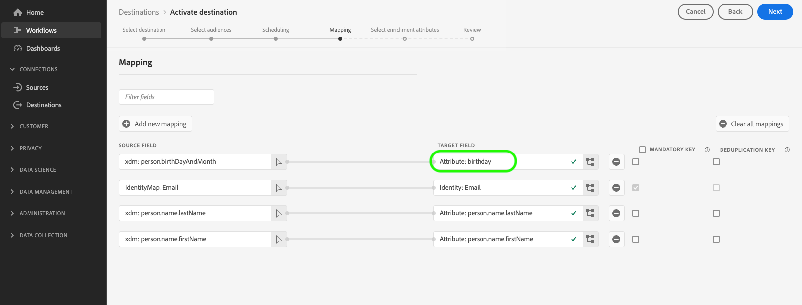

# 프로필 내보내기 대상을 일괄 처리하도록 대상자 활성화

>[!IMPORTANT]
> 
> * 대상을 활성화하고 워크플로우의 [매핑 단계](#mapping)를 활성화하려면 **[!UICONTROL 대상 보기]**, **[!UICONTROL 대상 활성화]**, **[!UICONTROL 프로필 보기]** 및 **[!UICONTROL 세그먼트 보기]** [액세스 제어 권한](/help/access-control/home.md#permissions)이 필요합니다.
> * 워크플로우의 [매핑 단계](#mapping)를 거치지 않고 대상을 활성화하려면 **[!UICONTROL 대상 보기]**, **[!UICONTROL 매핑하지 않고 세그먼트 활성화]**, **[!UICONTROL 프로필 보기]**, **[!UICONTROL 세그먼트 보기]** [액세스 제어 권한](/help/access-control/home.md#permissions)이 필요합니다.
>* *ID*&#x200B;을(를) 내보내려면 **[!UICONTROL ID 그래프 보기]** [액세스 제어 권한](/help/access-control/home.md#permissions)이 필요합니다. <br> {width="100" zoomable="yes"}
> 
> [액세스 제어 개요](/help/access-control/ui/overview.md)를 읽거나 제품 관리자에게 문의하여 필요한 권한을 받으십시오.

## 개요 {#overview}

이 문서에서는 Adobe Experience Platform에서 대상을 활성화하여 클라우드 스토리지 및 이메일 마케팅 대상과 같은 프로필 파일 기반 대상을 일괄 처리하는 데 필요한 워크플로에 대해 설명합니다.

## 전제 조건 {#prerequisites}

대상을 대상으로 활성화하려면 대상에 [연결됨](./connect-destination.md)이(가) 있어야 합니다. 아직 수행하지 않았다면 [대상 카탈로그](../catalog/overview.md)(으)로 이동하여 지원되는 대상을 탐색하고 사용할 대상을 구성합니다.

## 내보내기에 대해 지원되는 파일 포맷 {#supported-file-formats-export}

대상을 내보낼 때 다음 파일 형식이 지원됩니다.

* CSV
* JSON
* 쪽모이 세공

CSV 파일을 내보내면 내보낸 파일을 구성하는 방법 측면에서 유연성이 향상됩니다. CSV 파일에 대한 [파일 서식 구성에 대해 자세히 알아보세요](/help/destinations/ui/batch-destinations-file-formatting-options.md#file-configuration).

[파일 기반 대상에 대한 연결을 만들](/help/destinations/ui/connect-destination.md)때 내보내기를 위해 원하는 파일 형식을 선택하십시오.

## 대상 선택 {#select-destination}

1. **[!UICONTROL 연결 > 대상]**(으)로 이동하여 **[!UICONTROL 카탈로그]** 탭을 선택합니다.

   

1. 아래 그림과 같이 대상을 활성화할 대상에 해당하는 카드에서 **[!UICONTROL 대상 활성화]**&#x200B;를 선택합니다.

   

1. 대상을 활성화하는 데 사용할 대상 연결을 선택한 후 **[!UICONTROL 다음]**&#x200B;을(를) 선택하십시오.

   

1. 다음 섹션으로 이동하여 [대상자를 선택](#select-audiences)하십시오.

## 대상자 선택 {#select-audiences}

대상으로 활성화할 대상을 선택하려면 대상 이름 왼쪽에 있는 확인란을 사용한 다음 **[!UICONTROL 다음]**&#x200B;을 선택합니다.

출처에 따라 여러 유형의 대상 중에서 선택할 수 있습니다.

* **[!UICONTROL 세그먼테이션 서비스]**: 세그먼테이션 서비스에 의해 Experience Platform 내에서 생성된 대상입니다. 자세한 내용은 [세그먼테이션 설명서](../../segmentation/ui/overview.md)를 참조하세요.
* **[!UICONTROL 사용자 지정 업로드]**: Experience Platform 외부에서 생성되어 CSV 파일로 플랫폼에 업로드되는 대상자입니다. 외부 대상자에 대한 자세한 내용은 [대상자 가져오기](../../segmentation/ui/audience-portal.md#import-audience)에 대한 설명서를 참조하십시오.
* 다른 Adobe 솔루션에서 가져온 다른 유형의 대상(예: [!DNL Audience Manager]).


>[!TIP]
>
>**[!UICONTROL 사용자 지정 업로드]**&#x200B;에서 대상을 선택하면 [데이터 보강 특성 선택](#select-enrichment-attributes) 단계가 자동으로 활성화됩니다.

>[!TIP]
>
>**[!UICONTROL 활성화 데이터]** 페이지에서 기존 활성화 흐름에서 대상을 제거할 수 있습니다. 자세한 내용은 [전용 설명서](../ui/destination-details-page.md#bulk-remove)를 참조하세요.

## 대상자 내보내기 예약 {#scheduling}

>[!CONTEXTUALHELP]
>id="platform_destinations_activate_schedule"
>title="예약"
>abstract="연필 아이콘을 사용하여 파일 내보내기 유형(전체 파일 또는 증분 파일)과 내보내기 빈도를 설정합니다."

[!DNL Adobe Experience Platform]은(는) 전자 메일 마케팅 및 클라우드 저장소 대상에 대한 데이터를 [다른 파일 형식](#supported-file-formats-export)(으)로 내보냅니다. **[!UICONTROL 예약]** 페이지에서 내보내는 각 대상에 대해 일정 및 파일 이름을 구성할 수 있습니다.

Experience Platform은 각 파일 내보내기에 대한 기본 일정을 자동으로 설정합니다. 각 일정 옆에 있는 연필 아이콘을 선택하고 사용자 지정 일정을 정의하여 필요에 따라 기본 일정을 수정할 수 있습니다.


여러 일정을 동시에 편집하려면 화면 왼쪽에 있는 확인란을 사용하여 대상자를 선택한 다음 **[!UICONTROL 일정 편집]**&#x200B;을 선택합니다. 그러면 구성한 일정이 선택한 대상에 대해 내보낸 모든 파일에 적용됩니다.


>[!TIP]
>
>**[!UICONTROL 활성화 데이터]** 페이지에서 기존 활성화 흐름에 대한 대상 활성화 일정을 편집할 수 있습니다. 자세한 내용은 [활성화 일정 일괄 편집](../ui/destination-details-page.md#bulk-edit-schedule)에 대한 설명서를 참조하십시오.

>[!IMPORTANT]
>
>[!DNL Adobe Experience Platform]은(는) 내보내기 파일을 파일당 5백만 개의 레코드(행)로 자동으로 분할합니다. 각 행은 하나의 프로필을 나타냅니다.
>
>분할 파일 이름에는 파일이 더 큰 내보내기의 일부임을 나타내는 숫자가 추가됩니다(예: `filename.csv`, `filename_2.csv`, `filename_3.csv`).

### 전체 파일 내보내기 {#export-full-files}

>[!CONTEXTUALHELP]
>id="platform_destinations_activate_exportoptions"
>title="파일 내보내기 옵션"
>abstract="**전체 파일 내보내기**&#x200B;를 선택하여 대상자 조건에 적합한 모든 프로필의 전체 스냅샷을 내보냅니다. **증분 파일 내보내기**&#x200B;를 선택하여 마지막 내보내기 이후 대상자 조건에 적합한 프로필만 내보냅니다. <br>첫 번째 증분 파일 내보내기에는 채우기 역할을 하는 대상자에 적합한 모든 프로필이 포함됩니다. 향후 증분 파일에는 첫 번째 증분 파일 내보내기 이후 대상자 조건에 적합한 프로필만 포함됩니다."
>additional-url="https://experienceleague.adobe.com/docs/experience-platform/destinations/ui/activate/activate-batch-profile-destinations.html#export-incremental-files" text="증분 파일 내보내기"

>[!CONTEXTUALHELP]
>id="platform_destinations_activationchaining_aftersegmentevaluation"
>title="대상자 평가 후 활성화"
>abstract="일별 세분화 작업이 완료되면 활성화가 실행됩니다. 이렇게 하면 최신 프로필을 내보낼 수 있습니다."

>[!CONTEXTUALHELP]
>id="platform_destinations_activationchaining_scheduled"
>title="예약된 활성화"
>abstract="하루 중 고정된 시간에 활성화가 실행됩니다."

**[!UICONTROL 전체 파일 내보내기]**&#x200B;를 선택하여 선택한 대상에 대한 모든 프로필 자격에 대한 전체 스냅숏이 포함된 파일 내보내기를 트리거합니다.


1. **[!UICONTROL 빈도]** 선택기를 사용하여 내보내기 빈도를 선택하십시오.

   * **[!UICONTROL 한 번]**: 온디맨드 전체 파일 내보내기를 한 번 예약합니다.
   * **[!UICONTROL 매일]**: 지정한 시간에 매일 한 번씩 전체 파일 내보내기를 예약합니다.

2. **[!UICONTROL 시간]** 토글을 사용하여 대상 평가 직후에 내보내기를 수행할지 또는 지정된 시간에 예약된 일정에 따라 내보내기를 수행할지 여부를 선택합니다. **[!UICONTROL 예약됨]** 옵션을 선택할 때 선택기를 사용하여 내보내기를 수행할 시간을 [!DNL UTC] 형식으로 선택할 수 있습니다.

   **[!UICONTROL 세그먼트 평가 후]** 옵션을 사용하여 일일 플랫폼 일괄 처리 세분화 작업이 완료된 후 즉시 활성화 작업을 실행합니다. 이 옵션을 사용하면 활성화 작업이 실행될 때 최신 프로필을 대상으로 내보냅니다. 이로 인해 작업에 따라 대상을 하루에 여러 번 내보낼 수 있습니다.

   >[!IMPORTANT]
   >
   >세그먼트 평가 후 이미 활성화되도록 설정된 대상자에 대해 [유연한 대상자 평가](../../segmentation/ui/audience-portal.md#flexible-audience-evaluation)를 실행하는 경우, 이전에 수행한 일일 활성화 작업과 관계없이 유연한 대상자 평가 작업이 완료되는 즉시 대상자가 활성화됩니다. 이로 인해 사용자의 작업에 따라 하루에 여러 번 대상을 내보낼 수 있습니다.

   <!-- Batch segmentation currently runs at {{insert time of day}} and lasts for an average {{x hours}}. Adobe reserves the right to modify this schedule. -->

   
고정된 시간에 활성화 작업을 실행하려면 **[!UICONTROL 예약됨]** 옵션을 사용하십시오. 이 옵션을 사용하면 Experience Platform 프로필 데이터를 매일 같은 시간에 내보낼 수 있습니다. 그러나 활성화 작업이 시작되기 전에 배치 세분화 작업이 완료되었는지 여부에 따라 내보내는 프로필이 최신 상태가 아닐 수 있습니다.

   

3. 내보내기를 수행할 날짜 또는 간격을 선택하려면 **[!UICONTROL 날짜]** 선택기를 사용하십시오. 일별 내보내기의 경우 가장 좋은 방법은 다운스트림 플랫폼의 캠페인 기간에 맞춰 시작 및 종료 날짜를 설정하는 것입니다.

   >[!IMPORTANT]
   >
   > 내보내기 간격을 선택할 때 간격의 마지막 날은 내보내기에 포함되지 않습니다. 예를 들어, 1월 4일 - 11일 간격을 선택하면 마지막 파일 내보내기가 1월 10일에 수행됩니다.

4. **[!UICONTROL 만들기]**&#x200B;를 선택하여 일정을 저장합니다.

### 증분 파일 내보내기

>[!CONTEXTUALHELP]
>id="platform_destinations_activate_something"
>title="파일 이름 구성"
>abstract="파일 기반 대상의 경우 고유 파일 이름이 대상자당 생성됩니다. 파일 이름 편집기를 사용하여 고유 파일 이름을 만들고 편집하거나 기본 이름을 유지할 수 있습니다."

**[!UICONTROL 증분 파일 내보내기]**&#x200B;를 선택하여 내보내기를 트리거합니다. 여기서 첫 번째 파일은 선택한 대상에 대한 모든 프로필 자격의 전체 스냅숏이고 후속 파일은 이전 내보내기 이후 증분 프로필 자격입니다.

>[!IMPORTANT]
>
>첫 번째로 내보낸 증분 파일에는 대상자를 위한 자격이 있고 채우기 역할을 하는 모든 프로필이 포함되어 있습니다.


1. **[!UICONTROL 빈도]** 선택기를 사용하여 내보내기 빈도를 선택하십시오.

   * **[!UICONTROL 매일]**: 매일 지정한 시간에 매일 한 번씩 증분 파일 내보내기를 예약합니다.
   * **[!UICONTROL 시간별]**: 3, 6, 8 또는 12시간마다 증분 파일 내보내기를 예약합니다.

2. 내보내기를 수행할 시간을 **[!UICONTROL 시간]** 선택기에서 [!DNL UTC] 형식으로 선택합니다.

3. **[!UICONTROL 날짜]** 선택기를 사용하여 내보내기를 수행할 간격을 선택하십시오. 가장 좋은 방법은 다운스트림 플랫폼의 캠페인 기간에 맞춰 시작 및 종료 날짜를 설정하는 것입니다.

   >[!IMPORTANT]
   >
   >간격의 마지막 날은 내보내기에 포함되지 않습니다. 예를 들어, 1월 4일 - 11일 간격을 선택하면 마지막 파일 내보내기가 1월 10일에 수행됩니다.

4. **[!UICONTROL 만들기]**&#x200B;를 선택하여 일정을 저장합니다.

### 파일 이름 구성 {#configure-file-names}

>[!CONTEXTUALHELP]
>id="platform_destinations_activate_filename"
>title="파일 이름 구성"
>abstract="파일 기반 대상의 경우 고유 파일 이름이 대상자당 생성됩니다. 파일 이름 편집기를 사용하여 고유 파일 이름을 만들고 편집하거나 기본 이름을 유지할 수 있습니다."

대부분의 대상에 대해 기본 파일 이름은 대상 이름, 대상 ID 및 날짜 및 시간 표시기로 구성됩니다. 예를 들어 내보낸 파일 이름을 편집하여 서로 다른 캠페인을 구별하거나 데이터 내보내기 시간을 파일에 추가할 수 있습니다. 일부 대상 개발자는 대상에 대해 다른 기본 파일 이름 추가 옵션이 표시되도록 선택할 수 있습니다.

모달 창을 열고 파일 이름을 편집하려면 연필 아이콘을 선택합니다. 파일 이름은 255자로 제한됩니다.

>[!NOTE]
>
>아래 이미지는 [!DNL Amazon S3] 대상에 대해 파일 이름을 편집할 수 있는 방법을 보여 주지만 프로세스는 모든 배치 대상(예: SFTP, [!DNL Azure Blob Storage] 또는 [!DNL Google Cloud Storage])에 대해 동일합니다.


파일 이름 편집기에서 파일 이름에 추가할 다른 구성 요소를 선택할 수 있습니다.


파일 이름에서 대상 이름 및 대상 ID를 제거할 수 없습니다. 이러한 옵션 외에 다음 옵션을 추가할 수 있습니다.

| 파일 이름 옵션 | 설명 |
|---------|----------|
| **[!UICONTROL 대상 이름]** | 내보낸 대상자의 이름입니다. |
| **[!UICONTROL 날짜 및 시간]** | 파일이 생성된 시간의 `MMDDYYYY_HHMMSS` 형식 또는 UNIX 10자리 타임스탬프를 추가할 것인지 선택합니다. 증분 내보내기마다 파일에 동적 파일 이름이 생성되도록 하려면 다음 옵션 중 하나를 선택합니다. |
| **[!UICONTROL 사용자 지정 텍스트]** | 파일 이름에 추가할 사용자 지정 텍스트입니다. |
| **[!UICONTROL 대상 ID]** | 대상자를 내보내는 데 사용하는 대상 데이터 흐름의 ID입니다. |
| **[!UICONTROL 대상 이름]** | 대상을 내보내는 데 사용하는 대상 데이터 흐름의 이름입니다. |
| **[!UICONTROL 조직 이름]** | Experience Platform 내의 조직 이름입니다. |
| **[!UICONTROL 샌드박스 이름]** | 대상을 내보내는 데 사용하는 샌드박스의 ID입니다. |

{style="table-layout:auto"}

여러 파일 이름을 동시에 편집하려면 화면 왼쪽에 있는 확인란을 사용하여 대상자를 선택한 다음 **[!UICONTROL 파일 이름 편집]**&#x200B;을 선택합니다. 그러면 사용자가 구성한 파일 이름 옵션이 선택한 대상에 대해 내보낸 모든 파일에 적용됩니다.


**[!UICONTROL 변경 내용 적용]**&#x200B;을 선택하여 선택 내용을 확인합니다.

>[!IMPORTANT]
> 
>**[!UICONTROL 날짜 및 시간]** 구성 요소를 선택하지 않으면 파일 이름은 정적이며 새로 내보낸 파일은 저장소 위치의 이전 파일을 각 내보내기로 덮어씁니다. 저장소 위치에서 이메일 마케팅 플랫폼으로 반복 가져오기 작업을 실행할 때 이 옵션이 권장됩니다.

모든 대상을 구성했으면 **[!UICONTROL 다음]**&#x200B;을(를) 선택하여 계속합니다.

## 매핑 {#mapping}

이 단계에서는 대상 대상으로 내보낸 파일에 추가할 프로필 속성을 선택해야 합니다. 내보낼 프로필 속성 및 ID를 선택하려면 다음을 수행하십시오.

1. **[!UICONTROL 매핑]** 페이지에서 **[!UICONTROL 새 매핑 추가]**&#x200B;를 선택합니다.

   

1. **[!UICONTROL Source 필드]** 항목 오른쪽의 화살표를 선택합니다.

   

1. **[!UICONTROL 소스 필드 선택]** 페이지에서 대상으로 내보낸 파일에 포함할 프로필 특성 및 ID를 선택한 다음 **[!UICONTROL 선택]**&#x200B;을 선택합니다.

   >[!TIP]
   > 
   >아래 이미지에 표시된 대로 검색 필드를 사용하여 선택 항목의 범위를 좁힐 수 있습니다.

   **[!UICONTROL 데이터가 있는 필드만 표시]** 전환을 사용하여 값으로 채워진 스키마 필드만 표시합니다. 기본적으로 채워진 스키마 필드만 표시됩니다.

   


1. 내보내려고 선택한 필드가 매핑 보기에 나타납니다. 원하는 경우 내보낸 파일의 헤더 이름을 편집할 수 있습니다. 이렇게 하려면 대상 필드에서 아이콘을 선택합니다.

   

1. **[!UICONTROL 대상 필드 선택]** 페이지에서 내보낸 파일에 원하는 헤더 이름을 입력한 다음 **[!UICONTROL 선택]**&#x200B;을 선택합니다.

   

1. 내보내기를 위해 선택한 필드가 매핑 보기에 나타나고 내보낸 파일의 편집된 헤더를 표시합니다.

   

1. (선택 사항) UI에 있는 매핑된 필드의 순서는 내보낸 CSV 파일의 열 순서에 따라 위에서 아래로 반영되며, 맨 위 행은 CSV 파일의 가장 왼쪽 열입니다. 아래 표시된 대로 매핑 행을 끌어서 놓아 매핑된 필드를 원하는 방식으로 재정렬할 수 있습니다.

   >[!NOTE]
   >
   >이 기능은 베타 버전이며 일부 고객만 사용할 수 있습니다. 이 기능에 액세스하려면 Adobe 담당자에게 문의하십시오.

   

1. (선택 사항) 내보낸 필드를 [필수 키](#mandatory-keys) 또는 [중복 제거 키](#deduplication-keys)로 선택할 수 있습니다.

   

1. 내보낼 필드를 더 추가하려면 위의 단계를 반복합니다.

### 필수 속성 {#mandatory-attributes}

>[!CONTEXTUALHELP]
>id="platform_destinations_activate_mandatorykey"
>title="필수 속성 정보"
>abstract="내보낸 모든 프로필에 포함되어야 하는 XDM 스키마 속성을 선택합니다. 필수 키가 없는 프로필은 대상으로 내보내지 않습니다. 필수 키를 선택하지 않으면 속성과 관계없이 모든 적격 프로필을 내보냅니다."

필수 속성은 모든 프로필 레코드에 선택한 속성이 포함되도록 하는 사용자가 사용할 수 있는 확인란입니다. 예를 들어 내보낸 모든 프로필에는 이메일 주소가 포함됩니다&#x200B;.

[!DNL Platform]이(가) 특정 특성을 포함하는 프로필만 내보내도록 하려면 특성을 필수 항목으로 표시할 수 있습니다. 그 결과, 추가적인 형태의 필터링으로 사용될 수 있다. 특성을 필수 항목으로 표시하는 것은 **필요 없습니다**.

필수 속성을 선택하지 않으면 속성에 관계없이 모든 적격 프로필을 내보냅니다.

특성 중 하나는 스키마의 [고유 식별자](../../destinations/catalog/email-marketing/overview.md#identity)인 것이 좋습니다. 필수 특성에 대한 자세한 내용은 [전자 메일 마케팅 대상](../../destinations/catalog/email-marketing/overview.md#identity) 설명서의 ID 섹션을 참조하십시오.

### 중복 제거 키 {#deduplication-keys}

>[!CONTEXTUALHELP]
>id="platform_destinations_activate_deduplicationkey"
>title="중복 제거 키 정보"
>abstract="중복 제거 키를 선택하여 내보내기 파일에서 동일한 여러 프로필의 레코드를 제거합니다. 단일 네임스페이스 또는 최대 2개의 XDM 스키마 속성을 중복 제거 키로 선택합니다. 중복 제거 키를 선택하지 않으면 내보내기 파일에서 프로필 항목이 중복될 수 있습니다."

중복 제거 키는 사용자가 프로필을 중복 제거할 ID를 결정하는 사용자 정의 기본 키입니다&#x200B;.

중복 제거 키를 사용하면 하나의 내보내기 파일에 동일한 프로필의 레코드가 여러 개 있을 가능성을 방지할 수 있습니다.

[!DNL Platform]에서 중복 제거 키를 사용하는 방법에는 세 가지가 있습니다.

* 단일 ID 네임스페이스를 [!UICONTROL 중복 제거 키]&#x200B;(으)로 사용
* [!DNL XDM] 프로필의 단일 프로필 특성을 [!UICONTROL 중복 제거 키]&#x200B;(으)로 사용
* [!DNL XDM] 프로필의 두 프로필 특성 조합을 복합 키로 사용

>[!IMPORTANT]
>
> 단일 ID 네임스페이스를 대상으로 내보낼 수 있으며 해당 네임스페이스는 자동으로 중복 제거 키로 설정됩니다. 대상에 여러 네임스페이스를 보낼 수 없습니다.
> 
> ID 네임스페이스와 프로필 속성을 결합하여 중복 제거 키로 사용할 수 없습니다.

### 중복 제거 예 {#deduplication-example}

이 예에서는 선택한 중복 제거 키에 따라 중복 제거가 작동하는 방식을 보여 줍니다.

다음 두 가지 프로필을 생각해 보겠습니다.

**프로필 A**

```json
{
  "identityMap": {
    "Email": [
      {
        "id": "johndoe_1@example.com"
      },
      {
        "id": "doejohn_1@example.com"
      }
    ]
  },
  "segmentMembership": {
    "ups": {
      "fa5c4622-6847-4199-8dd4-8b7c7c7ed1d6": {
        "status": "realized",
        "lastQualificationTime": "2021-03-10 10:03:08"
      }
    }
  },
  "person": {
    "name": {
      "lastName": "Doe",
      "firstName": "John"
    }
  },
  "personalEmail": {
    "address": "johndoe@example.com"
  }
}
```

**프로필 B**

```json
{
  "identityMap": {
    "Email": [
      {
        "id": "johndoe_2@example.com"
      },
      {
        "id": "doejohn_2@example.com"
      }
    ]
  },
  "segmentMembership": {
    "ups": {
      "fa5c4622-6847-4199-8dd4-8b7c7c7ed1d6": {
        "status": "realized",
        "lastQualificationTime": "2021-04-10 11:33:28"
      }
    }
  },
  "person": {
    "name": {
      "lastName": "D",
      "firstName": "John"
    }
  },
  "personalEmail": {
    "address": "johndoe@example.com"
  }
}
```

### 중복 제거 사용 사례 1: 중복 제거 안 함 {#deduplication-use-case-1}

중복 제거를 사용하지 않으면 내보내기 파일에 다음 항목이 포함됩니다.

| personalEmail | 이름 | 성 |
|---|---|---|
| johndoe@example.com | John | Do |
| johndoe@example.com | John | D |


### 중복 제거 사용 사례 2: ID 네임스페이스에 따라 중복 제거 {#deduplication-use-case-2}

[!DNL Email] 네임스페이스에서 중복 제거를 수행한다고 가정할 경우 내보내기 파일에는 다음 항목이 포함됩니다. 프로필 B는 대상자에 적합한 최신 프로필이므로 내보내는 유일한 프로필입니다.

| 이메일* | personalEmail | 이름 | 성 |
|---|---|---|---|
| johndoe_2@example.com | johndoe@example.com | John | D |
| doejohn_2@example.com | johndoe@example.com | John | D |

### 중복 제거 사용 사례 3: 단일 프로필 속성에 따른 중복 제거 {#deduplication-use-case-3}

`personal Email` 특성에 의한 중복 제거를 가정할 경우 내보내기 파일에는 다음 항목이 포함됩니다. 프로필 B는 대상자에 적합한 최신 프로필이므로 내보내는 유일한 프로필입니다.

| personalEmail* | 이름 | 성 |
|---|---|---|
| johndoe@example.com | John | D |


### 중복 제거 사용 사례 4: 두 가지 프로필 속성에 따른 중복 제거 {#deduplication-use-case-4}

복합 키 `personalEmail + lastName`에서 중복 제거를 가정할 경우 내보내기 파일에는 다음 항목이 포함됩니다.

| personalEmail* | 성* | 이름 |
|---|---|---|
| johndoe@example.com | D | John |
| johndoe@example.com | Do | John |

Adobe에서는 모든 프로필 레코드가 고유하게 식별되도록 [!DNL CRM ID] 또는 이메일 주소와 같은 id 네임스페이스를 중복 제거 키로 선택할 것을 권장합니다.

### 타임스탬프가 동일한 프로필에 대한 중복 제거 동작 {#deduplication-same-timestamp}

프로필을 파일 기반 대상으로 내보낼 때 중복 제거는 여러 프로필이 동일한 중복 제거 키와 동일한 참조 타임스탬프를 공유하는 경우 단 하나의 프로필만 내보내도록 할 수 있습니다. 이 타임스탬프는 프로필의 대상 멤버십 또는 ID 그래프가 마지막으로 업데이트된 순간을 나타냅니다. 프로필을 업데이트하고 내보내는 방법에 대한 자세한 내용은 [프로필 내보내기 동작](https://experienceleague.adobe.com/en/docs/experience-platform/destinations/how-destinations-work/profile-export-behavior#what-determines-a-data-export-and-what-is-included-in-the-export-2) 문서를 참조하십시오.

#### 주요 고려 사항

* **결정론적 선택**: 여러 프로필에 동일한 중복 제거 키와 동일한 참조 타임스탬프가 있는 경우 중복 제거 논리에서 선택한 다른 열의 값을 정렬하여 내보낼 프로필을 결정합니다(배열, 맵 또는 개체와 같은 복잡한 형식 제외). 정렬된 값은 사전식 순서로 평가되고, 첫 번째 프로파일이 선택된다.

* **예제 시나리오**

중복 제거 키가 `Email` 열인 다음 데이터를 고려하십시오.

| 이메일* | first_name | last_name | 타임스탬프 |
|---|---|---|---|  
| `test1@test.com` | John | 모리스 | 2024-10-12T09:50 |
| `test1@test.com` | John | Do | 2024-10-12T09:50 |
| `test2@test.com` | 프랭크 | Smith | 2024-10-12T09:50 |

{style="table-layout:auto"}

중복 제거 후 내보내기 파일에는 다음이 포함됩니다.

| 이메일* | first_name | last_name | 타임스탬프 |
|---|---|---|---|  
| `test1@test.com` | John | Do | 2024-10-12T09:50 |
| `test2@test.com` | 프랭크 | Smith | 2024-10-12T09:50 |

{style="table-layout:auto"}

**설명**: `test1@test.com`의 경우 두 프로필이 동일한 중복 제거 키와 타임스탬프를 공유합니다. 알고리즘에서는 `first_name` 및 `last_name` 열 값을 사전순으로 정렬합니다. 이름이 같기 때문에 이 연결은 `last_name` 열을 사용하여 확인됩니다. 여기서 &quot;Doe&quot;는 &quot;Morris&quot; 앞에 옵니다.

**안정성 향상**: 이 업데이트된 중복 제거 프로세스를 통해 좌표가 같은 연속 실행은 항상 동일한 결과를 만들어 일관성을 향상시킬 수 있습니다.

### 계산된 필드를 통해 데이터 변환 수행 {#calculated-fields}

[계산된 필드](/help/destinations/ui/data-transformations-calculated-fields.md) 컨트롤을 사용하여 파일 기반 대상으로 내보낸 데이터에 대해 다양한 데이터 변환을 수행할 수 있습니다.

### 알려진 제한 사항 {#known-limitations}

새 **[!UICONTROL 매핑]** 페이지에 다음과 같은 알려진 제한 사항이 있습니다.

#### 대상 멤버십 속성은 매핑 워크플로를 통해 선택할 수 없습니다.

알려진 제한으로 인해 현재 **[!UICONTROL 필드 선택]** 창을 사용하여 `segmentMembership.seg_namespace.seg_id.status`을(를) 파일 내보내기에 추가할 수 없습니다. 대신 아래와 같이 `xdm: segmentMembership.seg_namespace.seg_id.status` 값을 스키마 필드에 수동으로 붙여넣어야 합니다.


>[!NOTE]
>
>클라우드 스토리지 대상의 경우 기본적으로 다음 속성이 매핑에 추가됩니다.
>
>* `segmentMembership.seg_namespace.seg_id.status`
>* `segmentMembership.seg_namespace.seg_id.lastQualificationTime`

파일 내보내기는 `segmentMembership.seg_namespace.seg_id.status`의 선택 여부에 따라 다음과 같이 달라집니다.

* `segmentMembership.seg_namespace.seg_id.status` 필드를 선택하면 내보낸 파일에는 초기 전체 스냅숏에 있는 **[!UICONTROL Active]** 구성원과 후속 증분 내보내기에 새로 **[!UICONTROL Active]** 및 **[!UICONTROL Expired]** 구성원이 포함됩니다.
* `segmentMembership.seg_namespace.seg_id.status` 필드를 선택하지 않으면 내보낸 파일에는 초기 전체 스냅숏과 이후 증분 내보내기에서 **[!UICONTROL Active]** 멤버만 포함됩니다.

파일 기반 대상에 대한 [프로필 내보내기 동작](/help/destinations/how-destinations-work/profile-export-behavior.md#file-based-destinations)에 대해 자세히 알아보십시오.

#### 내보내기를 위해 현재 ID 네임스페이스를 선택할 수 없습니다.

아래 이미지에 표시된 대로 내보낼 ID 네임스페이스를 선택하는 것은 현재 지원되지 않습니다. 내보낼 ID 네임스페이스를 선택하면 **[!UICONTROL 검토]** 단계에서 오류가 발생합니다.


임시 해결 방법으로 Beta 실행 중에 내보낸 파일에 ID 네임스페이스를 추가해야 하는 경우 다음 중 하나를 수행할 수 있습니다.
* 내보내기에 ID 네임스페이스를 포함하려는 데이터 흐름에 레거시 클라우드 스토리지 대상을 사용합니다
* ID를 속성으로 Experience Platform에 업로드한 다음 클라우드 스토리지 대상으로 내보냅니다.

## 프로필 속성 선택 {#select-attributes}

>[!IMPORTANT]
> 
>카탈로그의 모든 클라우드 저장소 대상은 이 섹션에 설명된 **[!UICONTROL 특성 선택]** 단계를 대체하는 개선된 [[!UICONTROL 매핑] 단계](#mapping)를 볼 수 있습니다.
>
>이 **[!UICONTROL 특성 선택]** 단계는 Adobe Campaign, Oracle Responsys, Oracle Eloqua 및 Salesforce Marketing Cloud 이메일 마케팅 대상에 대해 계속 표시됩니다.

프로필 기반 대상의 경우 대상 대상으로 전송할 프로필 속성을 선택해야 합니다.

1. **[!UICONTROL 특성 선택]** 페이지에서 **[!UICONTROL 새 필드 추가]**&#x200B;를 선택합니다.

   

2. **[!UICONTROL 스키마 필드]** 항목 오른쪽의 화살표를 선택합니다.

   

3. **[!UICONTROL 필드 선택]** 페이지에서 대상으로 보낼 XDM 특성 또는 ID 네임스페이스를 선택한 다음 **[!UICONTROL 선택]**&#x200B;을(를) 선택합니다.

   

4. 매핑을 더 추가하려면 1~3단계를 반복합니다.

>[!NOTE]
>
> Adobe Experience Platform은 스키마에서 일반적으로 사용되는 네 가지 권장 특성으로 선택을 미리 채웁니다. `person.name.firstName`, `person.name.lastName`, `personalEmail.address`, `segmentMembership.seg_namespace.seg_id.status`.


>[!IMPORTANT]
>
>알려진 제한으로 인해 현재 **[!UICONTROL 필드 선택]** 창을 사용하여 `segmentMembership.seg_namespace.seg_id.status`을(를) 파일 내보내기에 추가할 수 없습니다. 대신 아래와 같이 `xdm: segmentMembership.seg_namespace.seg_id.status` 값을 스키마 필드에 수동으로 붙여넣어야 합니다.
>
>

파일 내보내기는 `segmentMembership.seg_namespace.seg_id.status`의 선택 여부에 따라 다음과 같이 달라집니다.
* `segmentMembership.seg_namespace.seg_id.status` 필드를 선택하면 내보낸 파일에는 초기 전체 스냅숏에 **[!UICONTROL Active]** 구성원이 포함되고 후속 증분 내보내기에 **[!UICONTROL Active]** 및 **[!UICONTROL Expired]** 구성원이 포함됩니다.
* `segmentMembership.seg_namespace.seg_id.status` 필드를 선택하지 않으면 내보낸 파일에는 초기 전체 스냅숏과 이후 증분 내보내기에서 **[!UICONTROL Active]** 멤버만 포함됩니다.

## 보강 속성 선택 {#select-enrichment-attributes}

>[!CONTEXTUALHELP]
>id="platform_destinations_activate_exclude_enrichment_attributes"
>title="보강 속성 제외"
>abstract="모든 속성을 제외하고 선택한 사용자 정의 업로드된 대상자의 프로필을 대상으로 내보내려면 이 옵션을 활성화합니다."

>[!IMPORTANT]
>
>이 단계는 [대상자 선택](#select-audiences) 단계 동안 **[!UICONTROL 사용자 지정 업로드]**&#x200B;대상자를 선택한 경우에만 표시됩니다.

데이터 보강 속성은 **[!UICONTROL 사용자 지정 업로드]**(으)로 Experience Platform에서 수집된 사용자 지정 업로드된 대상에 해당합니다. 이 단계에서는 선택한 각 외부 대상에 대해 대상으로 내보낼 속성을 선택할 수 있습니다.

데이터 보강 특성 선택 단계를 보여 주는 

각 외부 대상에 대한 데이터 보강 속성을 선택하려면 아래 단계를 따르십시오.

1. **[!UICONTROL 데이터 보강 특성]** 열에서 (편집) 단추를 선택합니다.
1. **[!UICONTROL 데이터 보강 특성 추가]**를 선택합니다. 새 빈 스키마 필드가 표시됩니다.
   데이터 보강 특성 모달 화면을 표시하는 
1. 빈 필드 오른쪽의 버튼을 선택하여 필드 선택 화면을 엽니다.
1. 대상자를 위해 내보낼 속성을 선택합니다.
   데이터 보강 특성 목록을 표시하는 
1. 내보낼 특성을 모두 추가한 후 **[!UICONTROL 저장 및 닫기]**&#x200B;를 선택합니다.
1. 각 외부 대상에 대해 이 단계를 반복합니다.

특성을 내보내지 않고 대상에 외부 대상을 활성화하려면 **[!UICONTROL 데이터 보강 특성 제외]** 전환을 사용하도록 설정하십시오. 이 옵션을 사용하면 외부 대상에서 프로필을 내보내지만 해당 속성이 대상으로 전송되지 않습니다.


**[!UICONTROL 다음]**&#x200B;을(를) 선택하여 [검토](#review) 단계로 이동합니다.

## 검토 {#review}

>[!NOTE]
> 
>데이터 사용 레이블이 전체 데이터 세트가 아닌 데이터 세트 내의 특정 필드에 적용된 경우 다음 조건에서 활성화에 대한 해당 필드 수준 레이블을 적용합니다.
>
>* 필드는 대상 정의에 사용됩니다.
>* 필드는 대상 대상에 대한 예상 속성으로 구성됩니다.
>
> 예를 들어 `person.name.firstName` 필드에 대상의 마케팅 작업과 충돌하는 특정 데이터 사용 레이블이 있는 경우 검토 단계에서 데이터 사용 정책 위반이 표시됩니다. 자세한 내용은 [Adobe Experience Platform의 데이터 거버넌스](../../rtcdp/privacy/data-governance-overview.md#destinations)를 참조하십시오.

**[!UICONTROL 검토]** 페이지에서 선택한 항목에 대한 요약을 볼 수 있습니다. 흐름을 중단하려면 **[!UICONTROL 취소]**&#x200B;를 선택하고, 설정을 수정하려면 **[!UICONTROL 뒤로]**&#x200B;를 선택하고, 선택을 확인하고 데이터를 대상으로 보내려면 **[!UICONTROL 완료]**&#x200B;를 선택하십시오.


### 동의 정책 평가 {#consent-policy-evaluation}

>[!CONTEXTUALHELP]
>id="platform_governance_policies_viewApplicableConsentPolicies"
>title="해당 동의 정책 보기"
>abstract="조직에서 **Adobe Healthcare Shield** 또는 **Adobe Privacy &amp; Security Shield**&#x200B;를 구매한 경우 **[!UICONTROL 해당 동의 정책 보기]**&#x200B;를 선택하여 적용된 동의 정책을 조회하고 그 결과로 활성화에 포함된 프로필 수를 확인합니다. 기업이 위에서 언급한 SKU에 액세스할 수 없는 경우 이 컨트롤은 비활성화됩니다."

조직에서 **Adobe Healthcare Shield** 또는 **Adobe Privacy &amp; Security Shield**&#x200B;를 구매한 경우 **[!UICONTROL 해당 동의 정책 보기]**&#x200B;를 선택하여 적용된 동의 정책을 조회하고 그 결과로 활성화에 포함된 프로필 수를 확인합니다. 자세한 내용은 [동의 정책 평가](/help/data-governance/enforcement/auto-enforcement.md#consent-policy-evaluation)를 참조하세요.

### 데이터 사용 정책 확인 {#data-usage-policy-checks}

**[!UICONTROL 검토]** 단계에서 Experience Platform은 데이터 사용 정책 위반도 확인합니다. 다음은 정책이 위반되는 예입니다. 위반을 해결할 때까지 대상 활성화 워크플로우를 완료할 수 없습니다. 정책 위반을 해결하는 방법에 대한 자세한 내용은 데이터 거버넌스 설명서 섹션에서 [데이터 사용 정책 위반](/help/data-governance/enforcement/auto-enforcement.md#data-usage-violation)을 읽어 보십시오.


### 대상자 필터링 {#filter-audiences}

또한 이 단계에서는 페이지에서 사용 가능한 필터를 사용하여 이 워크플로우의 일부로 일정이나 매핑이 업데이트된 대상자만 표시할 수 있습니다. 보려는 테이블 열을 전환할 수도 있습니다.


선택에 만족하고 정책 위반이 발견되지 않은 경우 **[!UICONTROL 완료]**&#x200B;를 선택하여 선택을 확인하고 데이터를 대상으로 보내기 시작합니다.

## 대상자 활성화 확인 {#verify}

대상을 클라우드 저장소 대상으로 내보낼 때 Adobe Experience Platform은 사용자가 제공한 저장소 위치에 `.csv`, `.json` 또는 `.parquet` 파일을 만듭니다. 워크플로우에서 설정한 일정에 따라 스토리지 위치에 새 파일이 생성됩니다. 기본 파일 형식은 아래에 표시되어 있지만 [파일 이름의 구성 요소를 편집](#file-names)할 수 있습니다.
`<destinationName>_segment<segmentID>_<timestamp-yyyymmddhhmmss>.csv`

예를 들어 일별 내보내기 빈도를 선택한 경우 연속 3일에 받게 되는 파일은 다음과 같습니다.

```console
Salesforce_Marketing_Cloud_segment12341e18-abcd-49c2-836d-123c88e76c39_20200408061804.csv
Salesforce_Marketing_Cloud_segment12341e18-abcd-49c2-836d-123c88e76c39_20200409052200.csv
Salesforce_Marketing_Cloud_segment12341e18-abcd-49c2-836d-123c88e76c39_20200410061130.csv
```

스토리지 위치에 이러한 파일이 있으면 활성화가 성공적으로 수행되었는지 확인합니다. 내보낸 파일의 구조를 이해하기 위해 [샘플 .csv 파일을 다운로드](../assets/common/sample_export_file_segment12341e18-abcd-49c2-836d-123c88e76c39_20200408061804.csv)할 수 있습니다. 이 샘플 파일에는 프로필 특성 `person.firstname`, `person.lastname`, `person.gender`, `person.birthyear` 및 `personalEmail.address`이(가) 포함되어 있습니다.
