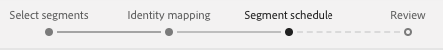
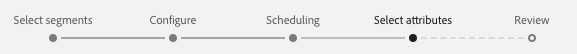

# 대상에 프로필 및 세그먼트 활성화

## 개요 {#overview}

세그먼트를 대상에 매핑하여 [!DNL Adobe Experience Platform]에 있는 데이터를 활성화합니다. 이를 수행하려면 아래 단계를 수행하십시오.

## 전제 조건 {#prerequisites}

대상에 데이터를 활성화하려면 [이(가) 대상](./connect-destination.md)에 연결되어야 합니다. 아직 수행하지 않았다면 [대상 카탈로그](../catalog/overview.md)로 이동하여 지원되는 대상을 탐색하고 하나 이상의 대상을 설정합니다.

## 데이터 활성화 {#activate-data}

활성화 워크플로우의 단계는 대상 유형에 따라 약간 다릅니다. 모든 대상 유형에 대한 전체 워크플로우는 아래에 요약되어 있습니다.

## 데이터를 활성화할 대상을 선택합니다 {#select-destination}

적용 대상:모든 대상

Adobe Experience Platform 사용자 인터페이스에서 **[!UICONTROL 대상]** > **[!UICONTROL 찾아보기]**&#x200B;로 이동한 다음 아래 이미지와 같이 세그먼트를 활성화할 대상에 해당하는 **[!UICONTROL 활성화]** 단추를 클릭하십시오.


다음 섹션의 단계에 따라 활성화할 세그먼트를 선택합니다.

## [!UICONTROL 세그먼트 ] 선택 단계 {#select-segments}

적용 대상:모든 대상


**[!UICONTROL 대상 활성화]** 워크플로우의 **[!UICONTROL 세그먼트 선택]** 페이지에서 대상으로 활성화할 세그먼트를 하나 이상 선택합니다. **[!UICONTROL 다음]**&#x200B;을 선택하여 다음 단계로 진행합니다.


##  매핑 단계 {#mapping}

>[!CONTEXTUALHELP]
>id="platform_destinations_activate_applytransformation"
>title="변형 적용"
>abstract="해시되지 않은 소스 필드를 사용할 때 이 옵션을 선택하여 Adobe Experience Platform에서 활성화 시 자동으로 해시하도록 합니다."

적용 대상:소셜 대상 및 Google Customer Match 광고 대상


소셜 대상의 경우, 대상에서 타겟 ID로 매핑하려면 소스 특성 또는 ID 네임스페이스를 선택해야 합니다.

## 예:[!DNL Facebook Custom Audience]에서 대상 데이터 활성화 {#example-facebook}

다음은 [!DNL Facebook]에서 대상 데이터를 활성화할 때 올바른 ID 매핑의 예입니다.

소스 필드 선택:

* 사용 중인 전자 메일 주소가 해시되지 않은 경우 `Email` 네임스페이스를 소스 ID로 선택합니다.
* [!DNL Facebook] [이메일 해싱 요구 사항](../catalog/social/facebook.md#email-hashing-requirements)에 따라 [!DNL Platform]로 데이터 처리에 대한 고객 이메일 주소를 해시한 경우 `Email_LC_SHA256` 네임스페이스를 소스 ID로 선택합니다.
* 데이터가 해시되지 않은 전화 번호로 구성된 경우 `PHONE_E.164` 네임스페이스를 소스 ID로 선택합니다. [!DNL Platform] 은 요구 사항을 준수하도록 전화 번호를 해시합니다 [!DNL Facebook] .
* [!DNL Facebook] [전화 번호 해싱 요구 사항](../catalog/social/facebook.md#phone-number-hashing-requirements)에 따라 데이터 처리에 대한 전화 번호를 해시하면 `Phone_SHA256` 네임스페이스를 소스 ID로 선택합니다.[!DNL Platform]
* 데이터가 [!DNL Apple] 장치 ID로 구성된 경우 `IDFA` 네임스페이스를 소스 ID로 선택합니다.
* 데이터가 [!DNL Android] 장치 ID로 구성된 경우 `GAID` 네임스페이스를 소스 ID로 선택합니다.
* 데이터가 다른 유형의 식별자로 구성된 경우 `Custom` 네임스페이스를 소스 ID로 선택합니다.

대상 필드 선택:

* 소스 네임스페이스가 `Email` 또는 `Email_LC_SHA256`인 경우 `Email_LC_SHA256` 네임스페이스를 대상 ID로 선택합니다.
* 소스 네임스페이스가 `PHONE_E.164` 또는 `Phone_SHA256`인 경우 `Phone_SHA256` 네임스페이스를 대상 ID로 선택합니다.
* 소스 네임스페이스가 `IDFA` 또는 `GAID`인 경우 `IDFA` 또는 `GAID` 네임스페이스를 대상 ID로 선택합니다.
* 소스 네임스페이스가 사용자 지정 네임스페이스일 때 `Extern_ID` 네임스페이스를 대상 ID로 선택합니다.


해시되지 않은 네임스페이스의 데이터는 활성화 시 [!DNL Platform]에 의해 자동으로 해시됩니다.

속성 소스 데이터는 자동으로 해시되지 않습니다. 소스 필드에 해시되지 않은 특성이 들어 있는 경우 **[!UICONTROL 변환]** 적용 옵션을 선택하여 [!DNL Platform]에서 활성화 시 데이터를 자동으로 해시하도록 하십시오.


 

## 예:[!DNL Google Customer Match]에서 대상 데이터 활성화 {#example-gcm}

이는 [!DNL Google Customer Match]에서 대상 데이터를 활성화할 때 올바른 ID 매핑의 예입니다.

소스 필드 선택:

* 사용 중인 전자 메일 주소가 해시되지 않은 경우 `Email` 네임스페이스를 소스 ID로 선택합니다.
* [!DNL Google Customer Match] [이메일 해싱 요구 사항](../catalog/social/../advertising/google-customer-match.md)에 따라 [!DNL Platform]로 데이터 처리에 대한 고객 이메일 주소를 해시한 경우 `Email_LC_SHA256` 네임스페이스를 소스 ID로 선택합니다.
* 데이터가 해시되지 않은 전화 번호로 구성된 경우 `PHONE_E.164` 네임스페이스를 소스 ID로 선택합니다. [!DNL Platform] 은 요구 사항을 준수하도록 전화 번호를 해시합니다 [!DNL Google Customer Match] .
* [!DNL Facebook] [전화 번호 해싱 요구 사항](../catalog/social/../advertising/google-customer-match.md)에 따라 데이터 처리에 대한 전화 번호를 해시하면 `Phone_SHA256_E.164` 네임스페이스를 소스 ID로 선택합니다.[!DNL Platform]
* 데이터가 [!DNL Apple] 장치 ID로 구성된 경우 `IDFA` 네임스페이스를 소스 ID로 선택합니다.
* 데이터가 [!DNL Android] 장치 ID로 구성된 경우 `GAID` 네임스페이스를 소스 ID로 선택합니다.
* 데이터가 다른 유형의 식별자로 구성된 경우 `Custom` 네임스페이스를 소스 ID로 선택합니다.

대상 필드 선택:

* 소스 네임스페이스가 `Email` 또는 `Email_LC_SHA256`인 경우 `Email_LC_SHA256` 네임스페이스를 대상 ID로 선택합니다.
* 소스 네임스페이스가 `PHONE_E.164` 또는 `Phone_SHA256_E.164`인 경우 `Phone_SHA256_E.164` 네임스페이스를 대상 ID로 선택합니다.
* 소스 네임스페이스가 `IDFA` 또는 `GAID`인 경우 `IDFA` 또는 `GAID` 네임스페이스를 대상 ID로 선택합니다.
* 소스 네임스페이스가 사용자 지정 네임스페이스일 때 `User_ID` 네임스페이스를 대상 ID로 선택합니다.


해시되지 않은 네임스페이스의 데이터는 활성화 시 [!DNL Platform]에 의해 자동으로 해시됩니다.

속성 소스 데이터는 자동으로 해시되지 않습니다. 소스 필드에 해시되지 않은 특성이 들어 있는 경우 **[!UICONTROL 변환]** 적용 옵션을 선택하여 [!DNL Platform]에서 활성화 시 데이터를 자동으로 해시하도록 하십시오.


## **** 예약 단계 {#scheduling}

적용 대상:이메일 마케팅 대상 및 클라우드 스토리지 대상


[!DNL Adobe Experience Platform] 이메일 마케팅 및 클라우드 스토리지 대상에 대한 데이터를  [!DNL CSV] 파일 형태로 내보냅니다. **[!UICONTROL 예약]** 단계에서는 내보내려는 각 세그먼트에 대한 일정과 파일 이름을 구성할 수 있습니다. 예약을 구성해야 하지만 파일 이름을 구성하는 것은 선택 사항입니다.

>[!IMPORTANT]
> 
>[!DNL Adobe Experience Platform] 에서는 내보내기 파일을 파일당 500만 개의 레코드(행)로 자동 분할합니다. 각 행은 하나의 프로필을 나타냅니다.
>
>파일 이름을 분할하면 파일이 더 큰 내보내기의 일부임을 나타내는 숫자가 추가됩니다.`filename.csv`, `filename_2.csv`, `filename_3.csv`.

대상으로 전송할 세그먼트에 해당하는 **[!UICONTROL 예약 만들기]** 단추를 선택합니다.


### 전체 파일 내보내기 {#export-full-files}

내보낸 파일에 해당 세그먼트에 적합한 모든 프로필의 전체 스냅숏이 포함되도록 하려면 **[!UICONTROL 전체 파일 내보내기]**&#x200B;를 선택합니다.


1. **[!UICONTROL 빈도]** 선택기를 사용하여 한 번(**[!UICONTROL Once]**) 또는 **[!UICONTROL 일별]** 내보내기 중에서 선택합니다. 전체 파일 **[!UICONTROL Daily]**&#x200B;을 내보내면 시작 날짜에서 종료 날짜까지 매일 파일을 오전 12:00 AM UTC(오후 7:00 EST)에 내보냅니다.
2. **[!UICONTROL 시간]** 선택기를 사용하여 내보내기가 발생할 때 [!DNL UTC] 형식으로 하루 중 시간을 선택합니다. 파일 **[!UICONTROL Daily]**&#x200B;을 내보내면 파일을 시작 날짜에서 선택한 종료 날짜까지 매일 내보냅니다.

   >[!IMPORTANT]
   >
   >특정 시간에 파일을 내보내는 옵션이 현재 베타 버전이며 선택한 수의 고객에게만 제공됩니다.<br> <br> 내부 Experience Platform 프로세스가 구성되는 방식 때문에 첫 번째 증분 또는 전체 파일 내보내기에 모든 채우기 데이터가 포함되지 않을 수 있습니다.  <br> <br> 전체 파일과 증분 파일 모두에 대해 가장 최신의 채우기 데이터를 전체적으로 내보내려면 다음 날 오후 12시 GMT 이후에 첫 번째 파일 내보내기 시간을 설정하는 것이 좋습니다. 이는 향후 릴리스에서 해결될 수 있는 제한 사항입니다.

3. **[!UICONTROL 날짜]** 선택기를 사용하여 내보내기가 발생할 날짜 또는 간격을 선택합니다.
4. **[!UICONTROL 만들기]**&#x200B;를 선택하여 일정을 저장합니다.


### 증분 파일 내보내기 {#export-incremental-files}

**[!UICONTROL 증분 파일 내보내기]**&#x200B;를 선택하여 내보낸 파일에 마지막 내보내기 이후 해당 세그먼트에 적합한 프로필만 포함되도록 합니다.

>[!IMPORTANT]
>
>처음 내보낸 증분 파일에는 세그먼트를 사용할 수 있는 모든 프로필이 포함되어 있으며 채우기 역할을 합니다.


1. **[!UICONTROL 빈도]** 선택기를 사용하여 **[!UICONTROL 일별]** 또는 **[!UICONTROL 시간별]** 내보내기 중에서 선택합니다. 증분 파일 **[!UICONTROL Daily]**&#x200B;을 내보내면 시작 날짜에서 종료 날짜까지 매일 파일을 오후 12:00 PM UTC(오전 7:00 EST)에 내보냅니다.
   * **[!UICONTROL 시간별]**&#x200B;을 선택하는 경우 **[!UICONTROL Every]** 선택기를 사용하여 **[!UICONTROL 3]**, **[!UICONTROL 6]**, **[!UICONTROL 8]** 및 **[!UICONTROL 12]** 시간 옵션 중에서 선택합니다.

      >[!IMPORTANT]
      >
      >3시간, 6시간, 8시간 또는 12시간마다 증분 파일을 내보내는 옵션은 현재 베타 버전이며 일부 고객만 사용할 수 있습니다. 베타가 아닌 고객은 하루에 한 번 증분 파일을 내보낼 수 있습니다.

2. **[!UICONTROL 시간]** 선택기를 사용하여 내보내기가 발생할 때 [!DNL UTC] 형식으로 하루 중 시간을 선택합니다.

   >[!IMPORTANT]
   >
   >내보낼 시간을 선택하는 옵션은 선택한 고객 수만 사용할 수 있습니다.<br> <br> 내부 Experience Platform 프로세스가 구성되는 방식 때문에 첫 번째 증분 또는 전체 파일 내보내기에 모든 채우기 데이터가 포함되지 않을 수 있습니다.  <br> <br> 전체 파일과 증분 파일 모두에 대해 가장 최신의 채우기 데이터를 전체적으로 내보내려면 다음 날 오후 12시 GMT 이후에 첫 번째 파일 내보내기 시간을 설정하는 것이 좋습니다. 이는 향후 릴리스에서 해결될 수 있는 제한 사항입니다.

3. **[!UICONTROL 날짜]** 선택기를 사용하여 내보내기가 발생할 날짜 또는 간격을 선택합니다.
4. **[!UICONTROL 만들기]**&#x200B;를 선택하여 일정을 저장합니다.

### 파일 이름 구성 {#file-names}

기본 파일 이름은 대상 이름, 세그먼트 ID, 날짜 및 시간 표시기로 구성됩니다. 예를 들어 내보낸 파일 이름을 편집하여 서로 다른 캠페인을 구분하거나 데이터 내보내기 시간을 파일에 추가할 수 있습니다.

연필 아이콘을 선택하여 모달 창을 열고 파일 이름을 편집합니다. 파일 이름은 255자로 제한됩니다.


파일 이름 편집기에서 파일 이름에 추가할 다른 구성 요소를 선택할 수 있습니다.


대상 이름 및 세그먼트 ID는 파일 이름에서 제거할 수 없습니다. 이 외에도 다음을 추가할 수 있습니다.

* **[!UICONTROL 세그먼트 이름]**:세그먼트 이름을 파일 이름에 추가할 수 있습니다.
* **[!UICONTROL 날짜 및 시간]**:파일이  `MMDDYYYY_HHMMSS` 생성되는 시간의 형식 또는 Unix 10자리 타임스탬프를 추가하는 중 선택합니다. 각 증분 내보내기로 생성된 동적 파일 이름을 파일에 포함하려면 다음 옵션 중 하나를 선택합니다.
* **[!UICONTROL 사용자 지정 텍스트]**:파일 이름에 사용자 지정 텍스트를 추가합니다.

**[!UICONTROL 변경 내용 적용]**&#x200B;을 선택하여 선택 내용을 확인합니다.

>[!IMPORTANT]
> 
>**[!UICONTROL 날짜 및 시간]** 구성 요소를 선택하지 않으면 파일 이름이 고정되고 새로 내보낸 파일이 각 내보내기로 저장소 위치에 있는 이전 파일을 덮어씁니다. 저장소 위치에서 이메일 마케팅 플랫폼으로 반복 가져오기 작업을 실행할 때 권장되는 옵션입니다.

모든 세그먼트 구성을 마치면 **[!UICONTROL 다음]**&#x200B;을 선택하여 계속하십시오.

## **[!UICONTROL 세그먼트]** 예약 단계 {#segment-schedule}

적용 대상:광고 대상, 소셜 대상



**[!UICONTROL 세그먼트 일정]** 페이지에서 데이터를 대상에 전송하는 시작 날짜와 데이터를 대상으로 보내는 빈도를 설정할 수 있습니다.

>[!IMPORTANT]
>
>소셜 대상의 경우, 이 단계에서 대상의 출처를 선택해야 합니다. 아래 이미지에서 옵션 중 하나를 선택한 후에만 다음 단계를 진행할 수 있습니다.


>[!IMPORTANT]
>
>Google Customer Match의 경우 [!DNL IDFA] 또는 [!DNL GAID] 세그먼트를 활성화할 때 이 단계에서 [!UICONTROL 앱 ID]를 제공해야 합니다.


## **[!UICONTROL 속성]** 선택 단계 {#select-attributes}

적용 대상:이메일 마케팅 대상 및 클라우드 스토리지 대상



**[!UICONTROL 속성 선택]** 페이지에서 **[!UICONTROL 새 필드 추가]**&#x200B;를 선택하고 대상에 전송할 속성을 선택합니다.

>[!NOTE]
>
> Adobe Experience Platform은 스키마에서 일반적으로 사용되는 4가지 권장 속성으로 선택 사항을 미리 채웁니다.`person.name.firstName`, `person.name.lastName`, `personalEmail.address`, `segmentMembership.status`.

파일 내보내기는 `segmentMembership.status` 선택 여부에 따라 다음과 같은 방식으로 달라집니다.
* `segmentMembership.status` 필드를 선택하면 내보낸 파일에는 초기 전체 스냅샷의 **[!UICONTROL Active]** 멤버와 후속 증분 내보내기의 **[!UICONTROL Active]** 및 **[!UICONTROL Expired]** 멤버가 포함됩니다.
* `segmentMembership.status` 필드를 선택하지 않으면 내보낸 파일에는 초기 전체 스냅샷과 후속 증분 내보내기에 **[!UICONTROL Active]** 멤버만 포함됩니다.


### 필수 속성 {#mandatory-attributes}

>[!CONTEXTUALHELP]
>id="platform_destinations_activate_mandatorykey"
>title="필수 속성 정보"
>abstract="내보낸 모든 프로필에 포함해야 하는 XDM 스키마 속성을 선택합니다. 필수 키가 없는 프로필은 대상으로 내보내지지 않습니다. 필수 키를 선택하지 않으면 속성과 관계없이 자격이 있는 모든 프로필이 내보내집니다."
>additional-url="http://www.adobe.com/go/destinations-mandatory-attributes-en" text="자세한 내용은 문서에서 알아보십시오"

속성을 필수로 표시하여 [!DNL Platform] 특정 속성을 포함하는 프로필만 내보내도록 할 수 있습니다. 따라서 추가 필터링 양식으로 사용할 수 있습니다. 속성을 필수로 표시하는 것은 **필수가 아닙니다**.

필수 속성을 선택하지 않으면 해당 속성과 관계없이 모든 자격이 있는 프로필이 내보내집니다.

특성 중 하나는 스키마의 [고유 식별자](../../destinations/catalog/email-marketing/overview.md#identity)인 것이 좋습니다. 필수 속성에 대한 자세한 내용은 [이메일 마케팅 대상](../../destinations/catalog/email-marketing/overview.md#identity) 설명서에서 ID 섹션을 참조하십시오.

### 중복 제거 키 {#deduplication-keys}

>[!CONTEXTUALHELP]
>id="platform_destinations_activate_deduplicationkey"
>title="중복 제거 키 기본 정보"
>abstract="중복 제거 키를 선택하여 내보내기 파일에서 동일한 프로필의 여러 레코드를 제거합니다. 중복 제거 키로 단일 네임스페이스 또는 최대 2개의 XDM 스키마 속성을 선택합니다. 중복 제거 키를 선택하지 않으면 내보내기 파일에서 중복된 프로필 항목이 발생할 수 있습니다."
>additional-url="http://www.adobe.com/go/destinations-deduplication-keys-en" text="자세한 내용은 문서에서 알아보십시오"

>[!IMPORTANT]
>
>중복 제거 키를 사용하는 옵션은 현재 베타 버전으로 일부 고객만 사용할 수 있습니다.

중복 제거 키를 사용하면 한 내보내기 파일에 동일한 프로필의 여러 레코드가 있을 수 없습니다.

[!DNL Platform]에서 중복 제거 키를 사용할 수 있는 방법에는 세 가지가 있습니다.

* 단일 ID 네임스페이스를 [!UICONTROL 중복 제거 키]로 사용
* [!DNL XDM] 프로필의 단일 프로필 속성을 [!UICONTROL 중복 제거 키]로 사용
* [!DNL XDM] 프로필의 두 프로필 속성의 조합을 복합 키로 사용

>[!IMPORTANT]
>
> 단일 ID 네임스페이스를 대상으로 내보낼 수 있으며, 네임스페이스가 자동으로 중복 제거 키로 설정됩니다. 여러 네임스페이스를 대상에 보낼 수 없습니다.
> 
> ID 네임스페이스와 프로필 속성의 조합을 중복 제거 키로 사용할 수 없습니다.

### 중복 제거 예 {#deduplication-example}

이 예에서는 선택한 중복 제거 키에 따라 중복 제거가 작동하는 방식을 보여줍니다.

다음 두 프로필을 고려해 보겠습니다.

**프로필 A**

```json
{
  "identityMap": {
    "Email": [
      {
        "id": "johndoe_1@example.com"
      },
      {
        "id": "johndoe_2@example.com"
      }
    ]
  },
  "segmentMembership": {
    "ups": {
      "fa5c4622-6847-4199-8dd4-8b7c7c7ed1d6": {
        "status": "existing",
        "lastQualificationTime": "2021-03-10 10:03:08"
      }
    }
  },
  "person": {
    "name": {
      "lastName": "Doe",
      "firstName": "John"
    }
  },
  "personalEmail": {
    "address": "johndoe@example.com"
  }
}
```

**프로필 B**

```json
{
  "identityMap": {
    "Email": [
      {
        "id": "johndoe_1@example.com"
      },
      {
        "id": "johndoe_2@example.com"
      }
    ]
  },
  "segmentMembership": {
    "ups": {
      "fa5c4622-6847-4199-8dd4-8b7c7c7ed1d6": {
        "status": "existing",
        "lastQualificationTime": "2021-04-10 11:33:28"
      }
    }
  },
  "person": {
    "name": {
      "lastName": "D",
      "firstName": "John"
    }
  },
  "personalEmail": {
    "address": "johndoe@example.com"
  }
}
```

### 중복 제거 사용 사례 1:중복 제거 없음

중복 제거를 사용하지 않는 경우 내보내기 파일에 다음 항목이 포함됩니다.

| personalEmail | firstName | lastName |
|---|---|---|
| johndoe@example.com | 존 | Doe |
| johndoe@example.com | 존 | D |


### 중복 제거 사용 사례 2:id 네임스페이스를 기반으로 데이터 중복 제거

중복 제거를 [!DNL Email] 네임스페이스로 가정하면 내보내기 파일에 다음 항목이 포함됩니다. 프로필 B는 세그먼트에 대한 자격이 있는 최신 프로필이므로 내보낼 수 있는 유일한 프로필입니다.

| 이메일* | personalEmail | firstName | lastName |
|---|---|---|---|
| johndoe_1@example.com | johndoe@example.com | 존 | D |
| johndoe_2@example.com | johndoe@example.com | 존 | D |

### 중복 제거 사용 사례 3:단일 프로필 속성을 기반으로 한 중복 제거

`personal Email` 속성으로 중복 제거를 가정하면 내보내기 파일에 다음 항목이 포함됩니다. 프로필 B는 세그먼트에 대한 자격이 있는 최신 프로필이므로 내보낼 수 있는 유일한 프로필입니다.

| personalEmail* | firstName | lastName |
|---|---|---|
| johndoe@example.com | 존 | D |


### 중복 제거 사용 사례 4:두 개의 프로필 속성을 기반으로 한 중복 제거(복합 중복 제거 키)

복합 키 `personalEmail + lastName`에 의해 중복 제거된다고 가정하면 내보내기 파일에 다음 항목이 포함됩니다.

| personalEmail* | lastName* | firstName |
|---|---|---|
| johndoe@example.com | D | 존 |
| johndoe@example.com | Doe | 존 |


Adobe은 모든 프로필 레코드가 고유하게 식별되도록 [!DNL CRM ID] 또는 이메일 주소와 같은 ID 네임스페이스를 중복 제거 키로 선택하는 것이 좋습니다.

>[!NOTE]
> 
>데이터 사용 레이블이 데이터 세트 전체 데이터 세트가 아닌 데이터 세트 내의 특정 필드에 적용된 경우 활성화 시 해당 필드 수준 레이블의 적용은 다음 조건에서 수행됩니다.
>
>* 필드는 세그먼트 정의에 사용됩니다.
>* 필드는 대상 대상에 대한 예상 속성으로 구성됩니다.

>
> 
예를 들어 필드 `person.name.firstName`에 대상의 마케팅 작업과 충돌하는 특정 데이터 사용 레이블이 있는 경우 검토 단계에서 데이터 사용 정책 위반이 표시됩니다. 자세한 내용은 [Adobe Experience Platform의 데이터 거버넌스](../../rtcdp/privacy/data-governance-overview.md#destinations)를 참조하십시오.

## **** 검토 단계 {#review}

적용 대상:모든 대상


**[!UICONTROL 검토]** 페이지에서 선택 요약이 표시됩니다. **[!UICONTROL 취소]**&#x200B;를 선택하여 플로우를 분류하고, 설정을 수정하려면 **[!UICONTROL 뒤로]**&#x200B;를 선택하고, 선택 내용을 확인하고 데이터를 대상에 보내려면 **[!UICONTROL 완료]**&#x200B;를 선택합니다.

>[!IMPORTANT]
>
>이 단계에서 Adobe Experience Platform은 데이터 사용 정책 위반을 확인합니다. 아래는 정책이 위반되는 예입니다. 위반을 해결해야 세그먼트 활성화 워크플로우를 완료할 수 있습니다. 정책 위반을 해결하는 방법에 대한 자세한 내용은 데이터 거버넌스 설명서 섹션의 [정책 적용](../../rtcdp/privacy/data-governance-overview.md#enforcement)을 참조하십시오.


정책 위반이 감지되지 않은 경우 **[!UICONTROL 완료]**&#x200B;를 선택하여 선택 내용을 확인하고 데이터를 대상에 보냅니다.


## 세그먼트 활성화가 성공했는지 확인 {#verify-activation}

### 이메일 마케팅 대상 및 클라우드 스토리지 대상 {#esp-and-cloud-storage}

이메일 마케팅 대상 및 클라우드 스토리지 대상의 경우, Adobe Experience Platform은 제공한 저장소 위치에 탭으로 구분된 `.csv` 파일을 만듭니다. 매일 저장소 위치에 새 파일이 생성될 것으로 예상됩니다. 기본 파일 형식은 다음과 같습니다.
`<destinationName>_segment<segmentID>_<timestamp-yyyymmddhhmmss>.csv`

3일 연속으로 받은 파일은 다음과 같습니다.

```console
Salesforce_Marketing_Cloud_segment12341e18-abcd-49c2-836d-123c88e76c39_20200408061804.csv
Salesforce_Marketing_Cloud_segment12341e18-abcd-49c2-836d-123c88e76c39_20200409052200.csv
Salesforce_Marketing_Cloud_segment12341e18-abcd-49c2-836d-123c88e76c39_20200410061130.csv
```

스토리지 위치에 이러한 파일이 있으면 성공적인 활성화를 확인할 수 있습니다. 내보낸 파일의 구조를 이해하기 위해 [샘플 .csv 파일](../assets/common/sample_export_file_segment12341e18-abcd-49c2-836d-123c88e76c39_20200408061804.csv)을 다운로드할 수 있습니다. 이 샘플 파일에는 프로필 속성 `person.firstname`, `person.lastname`, `person.gender`, `person.birthyear` 및 `personalEmail.address`가 포함되어 있습니다.

## 광고 대상

데이터를 활성화할 각 광고 대상의 계정을 확인합니다. 활성화가 성공하면 대상이 광고 플랫폼에서 채워집니다.

## 소셜 대상

[!DNL Facebook]의 경우 성공적인 활성화는 [!DNL Facebook] 사용자 지정 대상이 [[!UICONTROL Facebook Ads Manager]](https://www.facebook.com/adsmanager/manage/)에서 프로그래밍 방식으로 생성됨을 의미합니다. 사용자가 활성화된 세그먼트에 대한 자격이 있거나 자격 미달되면 대상의 세그먼트 멤버십이 추가 및 제거됩니다.

>[!TIP]
>
>Adobe Experience Platform과 [!DNL Facebook] 간의 통합은 이전 대상 채우기 기능을 지원합니다. 세그먼트를 대상으로 활성화하면 모든 이전 세그먼트 자격이 [!DNL Facebook]으로 전송됩니다.

## 활성화 비활성화 {#disable-activation}

기존 활성화 흐름을 비활성화하려면 아래 단계를 수행하십시오.

1. 왼쪽 탐색 막대에서 **[!UICONTROL 대상]**&#x200B;을 선택하고 **[!UICONTROL 찾아보기]** 탭을 클릭한 다음 대상 이름을 클릭합니다.
2. 활성화 흐름 상태를 변경하려면 오른쪽 레일에서 **[!UICONTROL Enabled]** 컨트롤을 클릭하십시오.
3. **데이터 흐름 상태 업데이트** 창에서 **확인**&#x200B;을 선택하여 활성화 흐름을 비활성화합니다.
