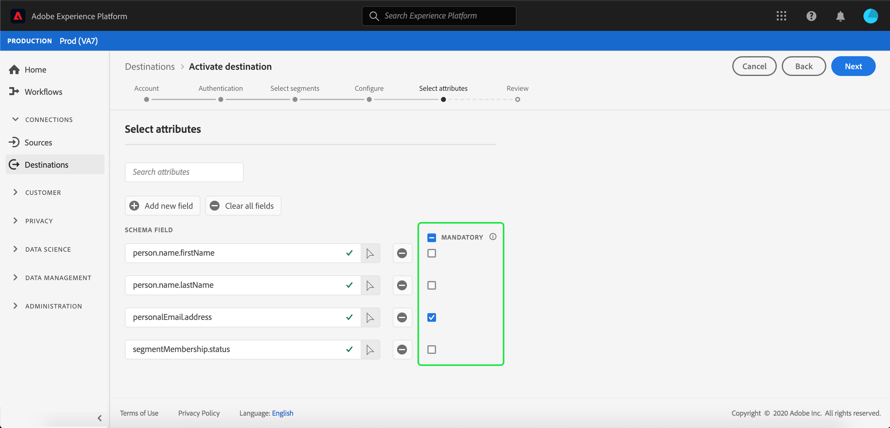

# 대상에 프로필 및 세그먼트 활성화

세그먼트를 대상에 매핑하여 [!DNL Adobe Experience Platform]에 있는 데이터를 활성화합니다. 이를 수행하려면 아래 단계를 따르십시오.

## 전제 조건 {#prerequisites}

대상에 데이터를 활성화하려면 대상](./connect-destination.md)에 [이(가) 연결되어야 합니다. 아직 수행하지 않은 경우 [대상 카탈로그](../catalog/overview.md)로 이동하여 지원되는 대상을 찾아 하나 이상의 대상을 설정합니다.

## 데이터 {#activate-data} 활성화

활성화 작업 과정의 단계는 대상 유형에 따라 약간 다릅니다. 모든 대상 유형에 대한 전체 워크플로우는 아래에 요약되어 있습니다.

### 데이터를 {#select-destination}에 활성화할 대상 선택

적용 대상:모든 대상

Adobe Experience Platform 사용자 인터페이스에서 **[!UICONTROL 대상]** > **[!UICONTROL 찾아보기]**&#x200B;로 이동한 다음 아래 이미지와 같이 세그먼트를 활성화할 대상에 해당하는 **[!UICONTROL 활성화]** 단추를 누릅니다.


다음 섹션의 단계를 따라 활성화할 세그먼트를 선택합니다.

### [!UICONTROL 세그먼트 ] 선택 단계  {#select-segments}

적용 대상:모든 대상


**[!UICONTROL 대상 활성화]** 작업 과정의 **[!UICONTROL 세그먼트 선택]** 페이지에서 대상에 활성화할 세그먼트를 하나 이상 선택합니다. 다음 단계로 진행하려면 **[!UICONTROL 다음]**&#x200B;을 선택합니다.


### [!UICONTROL ID 매핑 ] 단계  {#identity-mapping}

적용 대상:소셜 대상 및 Google 고객 일치 광고 대상


소셜 대상의 경우 소스 특성 또는 ID 네임스페이스를 선택하여 대상의 대상 ID로 매핑해야 합니다.

#### 예:[!DNL Facebook Custom Audience] {#example-facebook}에서 대상 데이터 활성화

다음은 [!DNL Facebook]에서 대상 데이터를 활성화할 때 올바른 ID 매핑의 예입니다.

소스 필드 선택:

* 사용 중인 이메일 주소가 해시되지 않은 경우 `Email` 네임스페이스를 소스 ID로 선택합니다.
* [!DNL Facebook] [이메일 해싱 요구 사항](../catalog/social/facebook.md#email-hashing-requirements)에 따라 [!DNL Platform]에 데이터 인제스트 시 고객 이메일 주소를 해시 처리한 경우 `Email_LC_SHA256` 네임스페이스를 소스 ID로 선택합니다.
* 데이터가 해시되지 않은 전화 번호로 구성된 경우 `PHONE_E.164` 네임스페이스를 소스 ID로 선택합니다. [!DNL Platform] 요구 사항을 준수하기 위해 전화 번호를  [!DNL Facebook] 해시합니다.
* [!DNL Facebook] [전화 번호 해싱 요구 사항](../catalog/social/facebook.md#phone-number-hashing-requirements)에 따라 [!DNL Platform]에 데이터 인제스트 시 전화 번호를 해시 처리한 경우 `Phone_SHA256` 네임스페이스를 소스 ID로 선택합니다.
* 데이터가 [!DNL Apple] 장치 ID로 구성된 경우 `IDFA` 네임스페이스를 소스 ID로 선택합니다.
* 데이터가 [!DNL Android] 장치 ID로 구성된 경우 `GAID` 네임스페이스를 소스 ID로 선택합니다.
* 데이터가 다른 유형의 식별자로 구성된 경우 `Custom` 네임스페이스를 소스 ID로 선택합니다.

대상 필드 선택:

* 소스 네임스페이스가 `Email` 또는 `Email_LC_SHA256`인 경우 `Email_LC_SHA256` 네임스페이스를 대상 ID로 선택합니다.
* 소스 네임스페이스가 `PHONE_E.164` 또는 `Phone_SHA256`인 경우 `Phone_SHA256` 네임스페이스를 대상 ID로 선택합니다.
* 소스 네임스페이스가 `IDFA` 또는 `GAID`인 경우 `IDFA` 또는 `GAID` 네임스페이스를 대상 ID로 선택합니다.
* 소스 네임스페이스가 사용자 지정 네임스페이스인 경우 `Extern_ID` 네임스페이스를 대상 ID로 선택합니다.


해시되지 않은 네임스페이스의 데이터는 활성화 시 [!DNL Platform]에 의해 자동으로 해시됩니다.

속성 소스 데이터가 자동으로 해시되지 않습니다. 소스 필드에 해시되지 않은 특성이 포함된 경우 **[!UICONTROL 변형 적용]** 옵션을 선택하여 [!DNL Platform]에서 활성화 시 데이터를 자동으로 해시하도록 하십시오.


 

#### 예:[!DNL Google Customer Match] {#example-gcm}에서 대상 데이터 활성화

이것은 [!DNL Google Customer Match]에서 대상 데이터를 활성화할 때 올바른 ID 매핑의 예입니다.

소스 필드 선택:

* 사용 중인 이메일 주소가 해시되지 않은 경우 `Email` 네임스페이스를 소스 ID로 선택합니다.
* [!DNL Google Customer Match] [이메일 해싱 요구 사항](../catalog/social/../advertising/google-customer-match.md)에 따라 [!DNL Platform]에 데이터 인제스트 시 고객 이메일 주소를 해시 처리한 경우 `Email_LC_SHA256` 네임스페이스를 소스 ID로 선택합니다.
* 데이터가 해시되지 않은 전화 번호로 구성된 경우 `PHONE_E.164` 네임스페이스를 소스 ID로 선택합니다. [!DNL Platform] 요구 사항을 준수하기 위해 전화 번호를  [!DNL Google Customer Match] 해시합니다.
* [!DNL Facebook] [전화 번호 해싱 요구 사항](../catalog/social/../advertising/google-customer-match.md)에 따라 [!DNL Platform]에 데이터 인제스트 시 전화 번호를 해시 처리한 경우 `Phone_SHA256_E.164` 네임스페이스를 소스 ID로 선택합니다.
* 데이터가 [!DNL Apple] 장치 ID로 구성된 경우 `IDFA` 네임스페이스를 소스 ID로 선택합니다.
* 데이터가 [!DNL Android] 장치 ID로 구성된 경우 `GAID` 네임스페이스를 소스 ID로 선택합니다.
* 데이터가 다른 유형의 식별자로 구성된 경우 `Custom` 네임스페이스를 소스 ID로 선택합니다.

대상 필드 선택:

* 소스 네임스페이스가 `Email` 또는 `Email_LC_SHA256`인 경우 `Email_LC_SHA256` 네임스페이스를 대상 ID로 선택합니다.
* 소스 네임스페이스가 `PHONE_E.164` 또는 `Phone_SHA256_E.164`인 경우 `Phone_SHA256_E.164` 네임스페이스를 대상 ID로 선택합니다.
* 소스 네임스페이스가 `IDFA` 또는 `GAID`인 경우 `IDFA` 또는 `GAID` 네임스페이스를 대상 ID로 선택합니다.
* 소스 네임스페이스가 사용자 지정 네임스페이스인 경우 `User_ID` 네임스페이스를 대상 ID로 선택합니다.


해시되지 않은 네임스페이스의 데이터는 활성화 시 [!DNL Platform]에 의해 자동으로 해시됩니다.

속성 소스 데이터가 자동으로 해시되지 않습니다. 소스 필드에 해시되지 않은 특성이 포함된 경우 **[!UICONTROL 변형 적용]** 옵션을 선택하여 [!DNL Platform]에서 활성화 시 데이터를 자동으로 해시하도록 하십시오.


<!-- 
`IDFA` IDs will be mapped to:

* [MADID](https://developers.facebook.com/docs/marketing-api/audiences/guides/custom-audiences#hash) if you are activating audiences in [[!DNL Facebook]](../../destinations/catalog/social/facebook.md).
* [mobileId](https://developers.google.com/adwords/api/docs/reference/v201809/AdwordsUserListService.Member#mobileid) if you are activating audiences in [[!DNL Google Customer Match]](../../destinations/catalog/advertising/google-customer-match.md).

Select `GAID` as target identity if your data consists of Android device IDs. `GAID` IDs will be mapped to:

* [MADID](https://developers.facebook.com/docs/marketing-api/audiences/guides/custom-audiences#hash) if you are activating audiences in [[!DNL Facebook]](../../destinations/catalog/social/facebook.md).
* [mobileId](https://developers.google.com/adwords/api/docs/reference/v201809/AdwordsUserListService.Member#mobileid) if you are activating audiences in [[!DNL Google Customer Match]](../../destinations/catalog/advertising/google-customer-match.md).

If you are using another ID, such as "Rewards ID" or "Loyalty ID", as primary identity in your schema, you need to map it to the following target identities:

* [EXTERN_ID](https://developers.facebook.com/docs/marketing-api/audiences/guides/custom-audiences#external_identifiers) if you are activating audiences in [[!DNL Facebook]](../../destinations/catalog/social/facebook.md).
* [USER_ID](https://developers.google.com/adwords/api/docs/reference/v201809/AdwordsUserListService.Member#userid) if you are activating audiences in [[!DNL Google Customer Match]](../../destinations/catalog/advertising/google-customer-match.md). -->

### **[!UICONTROL 구성]** 단계  {#configure}

적용 대상:이메일 마케팅 대상 및 클라우드 스토리지 대상


[!DNL Adobe Experience Platform] 이메일 마케팅 및 클라우드 스토리지 대상에 대한 데이터를  [!DNL CSV] 파일 형식으로 내보냅니다. **[!UICONTROL 구성]** 단계에서 내보내려는 각 세그먼트에 대한 일정 및 파일 이름을 구성할 수 있습니다. 일정을 구성하는 것은 필수이지만 파일 이름을 구성하는 것은 선택 사항입니다.

>[!IMPORTANT]
> 
>[!DNL Adobe Experience Platform] 내보내기 파일을 파일당 5백만 개의 레코드(행)로 자동으로 분할합니다. 각 행은 하나의 프로파일을 나타냅니다.
>
>분할된 파일 이름에 파일이 더 큰 내보내기의 일부임을 나타내는 숫자가 추가됩니다.`filename.csv`, `filename_2.csv`, `filename_3.csv`.


세그먼트에 대한 일정을 추가하려면 **[!UICONTROL 일정 만들기]**&#x200B;를 선택합니다.


세그먼트 일정을 만드는 옵션이 표시된 대화 상자가 나타납니다.

* **파일 내보내기**:전체 파일 또는 증분 파일을 내보낼 수 있습니다. 전체 파일을 내보내면 해당 세그먼트에 해당하는 모든 프로파일의 전체 스냅샷이 게시됩니다. 증분 파일을 내보내면 마지막 내보내기 이후 해당 세그먼트를 자격을 갖춘 프로필 델타가 게시됩니다.
* **빈도**:전체 파일  **[!UICONTROL 내보내기]** 를 선택한 경우 Onceor Daily를 내보낼  **** 수  **[!UICONTROL 있습니다]**. **[!UICONTROL 증분 파일 내보내기]**&#x200B;를 선택한 경우 **[!UICONTROL 일별]**&#x200B;만 내보낼 수 있습니다. 파일 **[!UICONTROL 한 번]**&#x200B;을 내보내면 파일이 한 번 내보내집니다. 파일 **[!UICONTROL 매일]**&#x200B;을 내보내면 전체 파일을 선택한 경우 시작 날짜에서 종료 날짜(오전 12:00 UTC(오후 7:00 EST)까지 매일 파일을 내보냅니다. 증분 파일이 선택된 경우 오후 12:00 PM UTC(7:00 AM EST).
* **날짜**:온테일 **** 을 선택한 경우 한 번 내보낼 날짜를 선택할 수 있습니다. **[!UICONTROL 일별]**&#x200B;을 선택한 경우 내보내기에 대한 시작 날짜와 종료 날짜를 선택할 수 있습니다.


기본 파일 이름은 대상 이름, 세그먼트 ID, 날짜 및 시간 표시기로 구성됩니다. 예를 들어 내보낸 파일 이름을 편집하여 다른 캠페인을 구분하거나 데이터 내보내기 시간을 파일에 추가할 수 있습니다.

연필 아이콘을 선택하여 모달 창을 열고 파일 이름을 편집합니다. 파일 이름은 255자로 제한됩니다.


파일 이름 편집기에서 파일 이름에 추가할 여러 구성 요소를 선택할 수 있습니다. 대상 이름 및 세그먼트 ID는 파일 이름에서 제거할 수 없습니다. 이 외에 다음을 추가할 수 있습니다.

* **[!UICONTROL 세그먼트 이름]**:세그먼트 이름을 파일 이름에 추가할 수 있습니다.
* **[!UICONTROL 날짜 및 시간]**:파일이  `MMDDYYYY_HHMMSS` 생성되는 시간의 Unix 10자리 타임스탬프 또는 형식을 추가할 때 선택합니다. 각 증분 내보내기로 동적 파일 이름을 생성하려는 경우 다음 옵션 중 하나를 선택합니다.
* **[!UICONTROL 사용자 정의 텍스트]**:파일 이름에 사용자 정의 텍스트를 추가합니다.

**[!UICONTROL 변경 내용 적용]**&#x200B;을 선택하여 선택을 확인합니다.

>[!IMPORTANT]
> 
>**[!UICONTROL 날짜 및 시간]** 구성 요소를 선택하지 않으면 파일 이름이 고정되고 새로 내보낸 파일이 내보낼 때마다 저장소 위치의 이전 파일을 덮어씁니다. 저장소 위치에서 이메일 마케팅 플랫폼으로 반복 가져오기 작업을 실행할 때 권장되는 옵션입니다.


모든 세그먼트 구성을 완료했으면 **[!UICONTROL 다음]**&#x200B;을 선택하여 계속하십시오.

### **[!UICONTROL 세그먼트]** 예약 단계  {#segment-schedule}

적용 대상:광고 대상, 소셜 대상


**[!UICONTROL 세그먼트 일정]** 페이지에서 데이터를 대상에 보내기 위한 시작 날짜와 대상으로 데이터를 보내는 빈도를 설정할 수 있습니다.

>[!IMPORTANT]
>
>소셜 대상의 경우 이 단계에서 대상의 출처를 선택해야 합니다. 아래 이미지에서 옵션 중 하나를 선택한 후에만 다음 단계로 진행할 수 있습니다.


>[!IMPORTANT]
>
>Google 고객 일치의 경우 [!DNL IDFA] 또는 [!DNL GAID] 세그먼트를 활성화할 때 이 단계에서 [!UICONTROL 앱 ID]을 제공해야 합니다.


### **[!UICONTROL 단계]** 예약  {#scheduling}

적용 대상:이메일 마케팅 대상 및 클라우드 스토리지 대상


**[!UICONTROL 예약]** 페이지에서는 대상으로 데이터를 전송하는 시작 날짜와 대상으로 데이터를 보내는 빈도를 볼 수 있습니다. 이러한 값은 편집할 수 없습니다.

### **[!UICONTROL 속성]** 선택 단계  {#select-attributes}

적용 대상:이메일 마케팅 대상 및 클라우드 스토리지 대상


**[!UICONTROL 특성 선택]** 페이지에서 **[!UICONTROL 새 필드 추가]**&#x200B;를 선택하고 대상에 보낼 특성을 선택합니다.

>[!NOTE]
>
> Adobe Experience Platform에서는 스키마에서 일반적으로 사용되는 4가지 속성을 사용하여 선택 사항을 미리 정의합니다.`person.name.firstName`, `person.name.lastName`, `personalEmail.address`, `segmentMembership.status`.

파일 내보내기 옵션은 `segmentMembership.status`의 선택 여부에 따라 다음과 같이 달라집니다.
* `segmentMembership.status` 필드를 선택한 경우 내보낸 파일에는 초기 전체 스냅샷에 **[!UICONTROL Active]** 구성원과 후속 증분 내보내기에 있는 **[!UICONTROL Active]** 및 **[!UICONTROL Expired]** 구성원이 포함됩니다.
* `segmentMembership.status` 필드를 선택하지 않으면 내보낸 파일에는 초기 전체 스냅샷과 후속 증분 내보내기에 **[!UICONTROL Active]** 멤버만 포함됩니다.



또한 다른 속성을 필수로 표시할 수도 있습니다. 속성을 필수로 표시하면 내보낸 세그먼트에 해당 속성이 포함되어야 합니다. 따라서 추가 필터링 양식으로 사용할 수 있습니다. 속성을 필수로 표시하면 **필수가 아닙니다**.

특성 중 하나가 스키마의 [고유 식별자](../../destinations/catalog/email-marketing/overview.md#identity)인 것이 좋습니다. 필수 속성에 대한 자세한 내용은 [이메일 마케팅 대상](../../destinations/catalog/email-marketing/overview.md#identity) 설명서의 ID 섹션을 참조하십시오.

>[!NOTE]
> 
>데이터 세트 전체 데이터 세트가 아닌 데이터 세트 내의 특정 필드에 데이터 사용 레이블이 적용된 경우 활성화할 때 이러한 필드 수준 레이블을 적용하는 것은 다음 조건에 따릅니다.
>* 이 필드는 세그먼트 정의에 사용됩니다.
>* 이 필드는 대상 대상에 대한 예상 속성으로 구성됩니다.

>
> 
예를 들어 `person.name.firstName` 필드에 대상의 마케팅 작업과 충돌하는 특정 데이터 사용 레이블이 있는 경우 검토 단계에서 데이터 사용 정책 위반이 표시됩니다. 자세한 내용은 Adobe Experience Platform](../../rtcdp/privacy/data-governance-overview.md#destinations)의 데이터 거버넌스를 참조하십시오.[

### **[!UICONTROL 검토]** 단계  {#review}

적용 대상:모든 대상


**[!UICONTROL Review]** 페이지에서 선택 사항의 요약을 볼 수 있습니다. 흐름을 구분하려면 **[!UICONTROL 취소]**, 설정을 수정하려면 **[!UICONTROL 뒤로]**, 선택을 확인하고 대상에 데이터를 보내기 시작하려면 **[!UICONTROL 완료]**&#x200B;를 선택합니다.

>[!IMPORTANT]
>
>이 단계에서 Adobe Experience Platform은 데이터 사용 정책 위반을 확인합니다. 다음은 정책을 위반하는 예입니다. 위반이 해결되기 전에는 세그먼트 활성화 워크플로우를 완료할 수 없습니다. 정책 위반을 해결하는 방법에 대한 자세한 내용은 데이터 거버넌스 문서 섹션의 [정책 적용](../../rtcdp/privacy/data-governance-overview.md#enforcement)을 참조하십시오.


정책 위반이 감지되지 않은 경우 **[!UICONTROL 완료]**&#x200B;를 선택하여 선택한 내용을 확인하고 대상으로 데이터를 보내기 시작합니다.


## 활성화 편집 {#edit-activation}

Adobe Experience Platform에서 기존 활성화 흐름을 편집하려면 아래 절차를 따르십시오.

1. 왼쪽 탐색 막대에서 **[!UICONTROL 대상]**&#x200B;을 선택한 다음 **[!UICONTROL 찾아보기]** 탭을 클릭하고 대상 이름을 클릭합니다.
2. 오른쪽 레일에서 **[!UICONTROL 활성화 편집]**&#x200B;을 선택하여 대상에 보낼 세그먼트를 변경합니다.

## 세그먼트 활성화가 성공했는지 확인 {#verify-activation}

### 이메일 마케팅 대상 및 클라우드 스토리지 대상 {#esp-and-cloud-storage}

이메일 마케팅 대상 및 클라우드 스토리지 대상의 경우 Adobe Experience Platform은 사용자가 제공한 저장 위치에 탭으로 구분된 `.csv` 또는 `.txt` 파일을 만듭니다. 매일 저장 위치에 새 파일이 만들어집니다. 기본 파일 형식은 다음과 같습니다.
`<destinationName>_segment<segmentID>_<timestamp-yyyymmddhhmmss>.csv|txt`

파일 형식을 편집할 수 있습니다. 자세한 내용은 클라우드 스토리지 대상 및 이메일 마케팅 대상을 위한 [구성](#configure) 단계로 이동하십시오.

기본 파일 형식을 사용하면 3일 연속으로 받은 파일은 다음과 같습니다.

```console
Salesforce_Marketing_Cloud_segment12341e18-abcd-49c2-836d-123c88e76c39_20200408061804.csv
Salesforce_Marketing_Cloud_segment12341e18-abcd-49c2-836d-123c88e76c39_20200409052200.csv
Salesforce_Marketing_Cloud_segment12341e18-abcd-49c2-836d-123c88e76c39_20200410061130.csv
```

스토리지 위치에 이러한 파일이 있는 경우 정품 인증이 성공적으로 완료되었음을 확인할 수 있습니다. 내보낸 파일의 구조를 이해하려면 [샘플 .csv 파일](../assets/common/sample_export_file_segment12341e18-abcd-49c2-836d-123c88e76c39_20200408061804.csv)을(를) 다운로드할 수 있습니다. 이 샘플 파일에는 프로필 속성 `person.firstname`, `person.lastname`, `person.gender`, `person.birthyear` 및 `personalEmail.address`이 포함됩니다.

### 광고 대상

데이터를 활성화할 각 광고 대상의 계정을 확인합니다. 정품 인증이 완료되면 대상이 광고 플랫폼에 채워집니다.

### 소셜 네트워크 대상

[!DNL Facebook]의 경우 [!DNL Facebook] 사용자 지정 대상이 [[!UICONTROL Facebook 광고 관리자]](https://www.facebook.com/adsmanager/manage/)에서 프로그래밍 방식으로 작성됨을 의미합니다. 활성화된 세그먼트에 대해 자격이 부여되거나 자격이 부여되지 않으면 대상의 세그먼트 멤버십이 추가 및 제거됩니다.

>[!TIP]
>
>Adobe Experience Platform과 [!DNL Facebook] 간의 통합은 이전 대상 채우기를 지원합니다. 세그먼트를 대상으로 활성화하면 모든 내역 세그먼트 자격 조건은 [!DNL Facebook]으로 전송됩니다.

## 활성화 비활성화 {#disable-activation}

기존 활성화 과정을 비활성화하려면 아래 단계를 따르십시오.

1. 왼쪽 탐색 막대에서 **[!UICONTROL 대상]**&#x200B;을 선택한 다음 **[!UICONTROL 찾아보기]** 탭을 클릭하고 대상 이름을 클릭합니다.
2. 오른쪽 레일에서 **[!UICONTROL 활성화]** 컨트롤을 클릭하여 활성화 흐름 상태를 변경합니다.
3. **데이터 흐름 상태 업데이트** 창에서 **확인**&#x200B;을 선택하여 활성화 흐름을 비활성화합니다.
