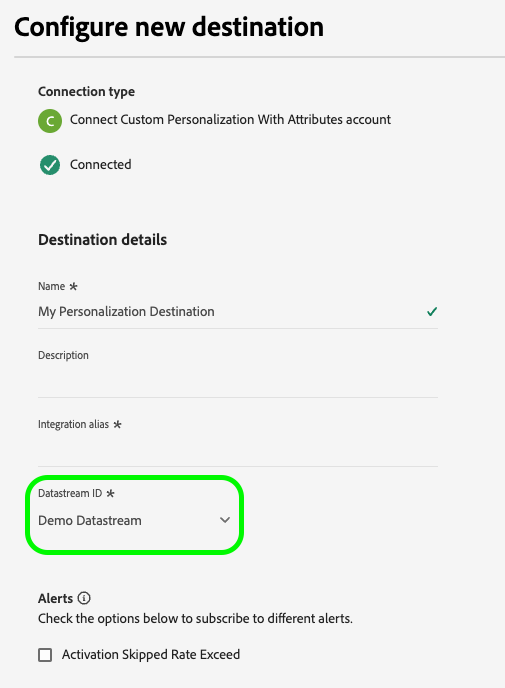

# 에지에서 실시간으로 프로필 속성 조회

Adobe Experience Platform은 [실시간 고객 프로필](../../profile/home.md)을(를) 모든 프로필 데이터에 대한 신뢰할 수 있는 단일 소스로 사용합니다. 빠른 실시간 데이터 검색을 위해 [Edge Network](../../collection/home.md#edge)에 배포되는 간단한 프로필인 [Edge 프로필](../../profile/edge-profiles.md)을 사용합니다. 이를 통해 빠르고 실시간 개인화 사용 사례를 만들 수 있습니다.

## 사용 사례 {#use-cases}

다음은 에지 프로필 조회가 도움이 될 수 있는 두 가지 사용 사례입니다.

* **실시간 Personalization**: Edge 프로필에서 프로필 정보를 빠르게 검색하여 웹 사이트에서 사용자 경험을 개인화합니다.
* **고객 지원**: 고객이 지원 센터 상담원을 호출할 때 실시간으로 프로필 정보를 검색합니다.

이 페이지에서는 개인화 경험을 전달하거나 다운스트림 애플리케이션을 통해 의사 결정 규칙을 알리기 위해 Edge 프로필 데이터를 실시간으로 조회하기 위해 수행해야 하는 단계에 대해 설명합니다.

## 용어 및 사전 요구 사항 {#prerequisites}

이 페이지에 설명된 사용 사례를 구성할 때는 다음 Experience Platform 구성 요소를 사용하게 됩니다.

* [데이터스트림](../../datastreams/overview.md): 데이터스트림은 Web SDK에서 들어오는 이벤트 데이터를 수신하고 에지 프로필 데이터로 응답합니다.
* [병합 정책](../../segmentation/ui/segment-builder.md#merge-policies): Edge 프로필에서 올바른 프로필 데이터를 사용하도록 [!UICONTROL Active-On-Edge] 병합 정책을 만듭니다.
* [사용자 지정 Personalization 연결](../catalog/personalization/custom-personalization.md): 프로필 특성을 Edge Network에 전송하는 새 사용자 지정 개인화 연결을 구성합니다.
* [Edge Network API](https://developer.adobe.com/data-collection-apis/docs/): Edge Network API [대화형 데이터 수집](https://developer.adobe.com/data-collection-apis/docs/endpoints/interact/) 기능을 사용하여 Edge 프로필에서 프로필 특성을 빠르게 검색합니다.

## 성능 가드레일 {#guardrails}

Edge 프로필 조회 사용 사례는 아래 표에 설명된 특정 성능 가드레일의 영향을 받습니다. Edge Network API 보호 기능에 대한 자세한 내용은 보호 기능 [설명서 페이지](https://developer.adobe.com/data-collection-apis/docs/getting-started/guardrails/)를 참조하십시오.

| Edge Network 서비스 | Edge 세그멘테이션 | 초당 요청 수 |
|---------|----------|---------|
| [Edge Network API](https://developer.adobe.com/data-collection-apis/docs/api/)를 통해 [사용자 지정 개인화 대상](../catalog/personalization/custom-personalization.md) | 예 | 1500 |
| [Edge Network API](https://developer.adobe.com/data-collection-apis/docs/api/)를 통해 [사용자 지정 개인화 대상](../catalog/personalization/custom-personalization.md) | 아니요 | 1500 |

## 1단계: 데이터 스트림 만들기 및 구성 {#create-datastream}

[데이터 스트림 구성](../../datastreams/configure.md#create-a-datastream) 설명서의 단계에 따라 다음 **[!UICONTROL 서비스]** 설정으로 새 데이터 스트림을 만드십시오.

* **[!UICONTROL 서비스]**: [!UICONTROL Adobe Experience Platform]
* **[!UICONTROL Personalization 대상]**: 활성화됨
* **[!UICONTROL Edge 세그멘테이션]**: 에지 세그멘테이션이 필요한 경우 이 옵션을 사용하도록 설정하십시오. 에지에서 프로필 속성을 찾는 데만 관심이 있지만 에지 프로필을 기반으로 세분화를 수행하지 않으려면 이 옵션을 비활성화합니다.


  <!-- >[!IMPORTANT]
    >
    >Enabling edge segmentation limits the maximum number of lookup requests to 1500 request per second. If you need a higher request throughput, disable edge segmentation for your datastream. See the [guardrails documentation](../guardrails.md#edge-destinations-activation) for detailed information. -->

  


## 2단계: Edge 평가를 위한 대상 구성 {#audience-edge-evaluation}

Edge에서 프로필 속성을 조회하려면 Edge 평가를 위해 대상을 구성해야 합니다.

활성화하려는 대상에 [Active-on-Edge 병합 정책](../../segmentation/ui/segment-builder.md#merge-policies)이(가) 기본값으로 설정되어 있는지 확인하십시오. [!DNL Active-On-Edge] 병합 정책을 사용하면 대상이 [Edge](../../segmentation/methods/edge-segmentation.md)에서 지속적으로 평가되고 실시간 개인화 사용 사례에 사용할 수 있습니다.

[병합 정책 만들기](../../profile/merge-policies/ui-guide.md#create-a-merge-policy)에 대한 지침을 따르고 **[!UICONTROL Active-On-Edge 병합 정책]** 전환을 사용하도록 설정해야 합니다.

>[!IMPORTANT]
>
>대상이 다른 병합 정책을 사용하는 경우 에지에서 프로필 속성을 검색할 수 없고 에지 프로필 조회를 수행할 수 없습니다.

## 3단계: Edge Network에 프로필 속성 데이터 보내기{#configure-custom-personalization-connection}

속성 및 대상 멤버십 데이터를 포함하여 에지 프로필을 실시간으로 조회하려면 Edge Network에서 데이터를 사용할 수 있도록 해야 합니다. 이를 위해 속성이 있는 **[!UICONTROL 사용자 지정 Personalization]** 대상에 대한 연결을 만들고 Edge 프로필에서 조회할 특성을 포함하여 대상을 활성화해야 합니다.

+++ 특성 연결을 사용하여 사용자 지정 Personalization 구성

새 대상 연결을 만드는 방법에 대한 자세한 지침은 [대상 연결 만들기 자습서](../ui/connect-destination.md)를 따르십시오.

새 대상을 구성할 때는 **[!UICONTROL 데이터 스트림 ID]** 필드의 [단계 1](#create-datastream)에서 만든 데이터 스트림을 선택하십시오. **[!UICONTROL 통합 별칭]**&#x200B;의 경우 대상 이름과 같이 나중에 이 대상 연결을 식별하는 데 도움이 되는 모든 값을 사용할 수 있습니다.



+++

+++속성을 사용하여 사용자 지정 Personalization 연결에 대상 활성화

특성이 있는 **[!UICONTROL 사용자 지정 Personalization]** 연결을 만든 후에는 이제 Edge Network에 프로필 데이터를 보낼 준비가 되었습니다.

>[!IMPORTANT]
> 
> * 데이터를 활성화하고 워크플로우의 [매핑 단계](#mapping)를 활성화하려면 **[!UICONTROL 대상 보기]**, **[!UICONTROL 대상 활성화]**, **[!UICONTROL 프로필 보기]** 및 **[!UICONTROL 세그먼트 보기]** [액세스 제어 권한](/help/access-control/home.md#permissions)이 필요합니다.
> 
> [액세스 제어 개요](/help/access-control/ui/overview.md)를 읽거나 제품 관리자에게 문의하여 필요한 권한을 받으십시오.

1. **[!UICONTROL 연결 > 대상]**(으)로 이동하여 **[!UICONTROL 카탈로그]** 탭을 선택합니다.

   

1. **[!UICONTROL 특성이 있는 사용자 지정 Personalization]** 대상 카드를 찾은 다음 아래 그림과 같이 **[!UICONTROL 대상 활성화]**&#x200B;를 선택합니다.

   

1. 이전에 구성한 대상 연결을 선택한 후 **[!UICONTROL 다음]**&#x200B;을 선택합니다.

   

1. 대상을 선택합니다. 대상 이름 왼쪽에 있는 확인란을 사용하여 대상에 대해 활성화할 대상을 선택한 다음 **[!UICONTROL 다음]**&#x200B;을 선택합니다.

   출처에 따라 여러 유형의 대상 중에서 선택할 수 있습니다.

   * **[!UICONTROL 세그먼테이션 서비스]**: 세그먼테이션 서비스에 의해 Experience Platform 내에서 생성된 대상입니다. 자세한 내용은 [세그먼테이션 설명서](../../segmentation/ui/overview.md)를 참조하세요.
   * **[!UICONTROL 사용자 지정 업로드]**: Experience Platform 외부에서 생성되어 Experience Platform에 CSV 파일로 업로드된 대상자입니다. 외부 대상자에 대한 자세한 내용은 [대상자 가져오기](../../segmentation/ui/overview.md#import-audience)에 대한 설명서를 참조하십시오.
   * 다른 Adobe 솔루션에서 가져온 다른 유형의 대상(예: [!DNL Audience Manager]).

     

1. 모서리 프로파일에 사용할 수 있게 하려는 프로파일 속성을 선택합니다.

   * **원본 특성을 선택하십시오**. 소스 특성을 추가하려면 **[!UICONTROL Source 필드]** 열에서 **[!UICONTROL 새 필드 추가]** 컨트롤을 선택하고 아래와 같이 원하는 XDM 특성 필드를 검색하거나 탐색합니다.

     

   * **대상 특성을 선택하십시오**. 대상 특성을 추가하려면 **[!UICONTROL 대상 필드]** 열에서 **[!UICONTROL 새 필드 추가]** 컨트롤을 선택하고 원본 특성을 매핑할 사용자 지정 특성 이름을 입력하십시오.

     


프로필 특성 매핑을 마치면 **[!UICONTROL 다음]**&#x200B;을(를) 선택합니다.

**[!UICONTROL 검토]** 페이지에서 선택한 항목에 대한 요약을 볼 수 있습니다. 흐름을 중단하려면 **[!UICONTROL 취소]**&#x200B;를 선택하고, 설정을 수정하려면 **[!UICONTROL 뒤로]**&#x200B;를 선택하고, 선택을 확인하고 Edge Network으로 프로필 데이터를 보내려면 **[!UICONTROL 완료]**&#x200B;를 선택하십시오.


+++

+++동의 정책 평가

조직에서 **Adobe Healthcare Shield** 또는 **Adobe Privacy &amp; Security Shield**&#x200B;를 구매한 경우 **[!UICONTROL 해당 동의 정책 보기]**&#x200B;를 선택하여 적용된 동의 정책을 조회하고 그 결과로 활성화에 포함된 프로필 수를 확인합니다. 자세한 내용은 [동의 정책 평가](/help/data-governance/enforcement/auto-enforcement.md#consent-policy-evaluation)를 참조하세요.

**데이터 사용 정책 확인**

**[!UICONTROL 검토]** 단계에서 Experience Platform은 데이터 사용 정책 위반도 확인합니다. 다음은 정책이 위반되는 예입니다. 위반을 해결할 때까지 대상 활성화 워크플로우를 완료할 수 없습니다. 정책 위반을 해결하는 방법에 대한 자세한 내용은 데이터 거버넌스 설명서 섹션에서 [데이터 사용 정책 위반](/help/data-governance/enforcement/auto-enforcement.md#data-usage-violation)을 읽어 보십시오.


+++

+++대상자 필터링

**[!UICONTROL 검토]** 단계에서는 페이지의 사용 가능한 필터를 사용하여 이 워크플로우의 일부로 일정이나 매핑이 업데이트된 대상자만 표시할 수 있습니다. 보려는 테이블 열을 전환할 수도 있습니다.


선택한 내용에 만족하고 정책 위반이 발견되지 않은 경우 **[!UICONTROL 완료]**&#x200B;를 선택하여 선택 내용을 확인합니다.

+++

## 4단계: 모서리에서 프로필 속성 조회 {#configure-edge-profile-lookup}

이제 [데이터 스트림 구성](#create-datastream)을 완료하고 [특성 대상 연결이 있는 새 사용자 지정 Personalization을 만들었습니다](#configure-destination). 그리고 이 연결을 사용하여 [프로필 특성을 보냅니다](#activate-audiences). 그러면 Edge Network을 조회할 수 있습니다.

다음 단계는 Edge 프로필에서 프로필 속성을 검색하도록 개인화 솔루션을 구성하는 것입니다.

>[!IMPORTANT]
>
>프로필 속성에 중요한 데이터가 포함될 수 있습니다. 이 데이터를 보호하려면 [Edge Network API](https://developer.adobe.com/data-collection-apis/docs/getting-started/)를 통해 프로필 특성을 검색해야 합니다. 또한 API 호출을 인증하려면 Edge Network API [대화형 데이터 수집 끝점](https://developer.adobe.com/data-collection-apis/docs/endpoints/interact/)을 통해 프로필 특성을 검색해야 합니다.
><br>위의 요구 사항을 따르지 않는 경우 개인화는 대상 멤버십만을 기반으로 하며 프로필 속성을 사용할 수 없습니다.

[단계 1](#create-datastream)에서 구성한 데이터 스트림이 이제 들어오는 이벤트 데이터를 수락하고 Edge 프로필 정보로 응답할 준비가 되었습니다.

아래 예에 표시된 대로 Edge 프로필 정보를 검색하도록 통합을 구성합니다.

### 요청 {#request}

Edge 프로필 데이터를 검색하려면 아래와 같이 이벤트에 포함된 프로필 특성을 찾는 기본 ID를 사용하여 빈 `POST` 호출을 `/interact` 끝점으로 보냅니다.

```shell
curl -X POST "https://server.adobedc.net/ee/v2/interact?dataStreamId={DATASTREAM_ID}" 
-H "Authorization: Bearer {TOKEN}" 
-H "x-gw-ims-org-id: {ORG_ID}" 
-H "x-api-key: {API_KEY}" 
-H "Content-Type: application/json" 
-d '{
    "event":
    {
        "xdm": {
            "identityMap": {
                "Email": [
                    {  
                        "id":"test123@adobetest.com",
                        "primary":true
                    }
                ]
            }
        }
    }
    
}'
```

| 매개변수 | 유형 | 필수 여부 | 설명 |
| --- | --- | --- | --- |
| `dataStreamId` | `String` | 예. | [단계 1](#create-datastream)에서 만든 데이터 스트림의 데이터 스트림 ID입니다. |

### 응답 {#response}

성공적인 응답은 프로필이 에지에서 발견되었는지 여부에 따라 아래 탭의 예제와 유사한 정보를 포함하는 `Handle` 개체와 함께 HTTP 상태 `200 OK`을(를) 반환합니다.

>[!NOTE]
>
>API 응답은 모듈식이며 `handle` 개체에는 다양한 유형의 여러 `payload` 개체가 포함될 수 있습니다. 에지 프로필 조회와 관련된 정보는 `"type": "activation:pull"`을(를) 사용하여 `payload` 개체 아래에 그룹화됩니다.

>[!BEGINTABS]

>[!TAB 프로필이 가장자리에 있음]

프로필이 Edge에 존재하는 경우 Edge에 대해 활성화된 프로필 속성 및 대상에 따라 아래 속성과 유사한 속성 및 대상 멤버십을 갖는 응답을 기대할 수 있습니다.

```json
{
  "requestId": "3c600138-d785-42ca-a025-bb725f4b5da9",
  "handle": [
    {
      "payload": [
        {
          "type": "profileLookup",
          "destinationId": "9218b727-ec59-4a46-b8b9-05503f138c5d",
          "alias": "rk-demo-custom-personalization-XXXX",
          "attributes": {
            "zip": {
              "value": "19000"
            },
            "firstName": {
              "value": "Test"
            },
            "lastName": {
              "value": "User123"
            },
            "gender": {
              "value": "male"
            },
            "city": {
              "value": "Philadelphia"
            },
            "state": {
              "value": "PA"
            },
            "email": {
              "value": "test123@adobetest.com"
            }
          },
          "segments": [
            {
              "id": "85018bd8-7ad1-4e17-ae30-8389c04bd3c0",
              "namespace": "ups"
            },
            {
              "id": "d09a8159-8b30-4178-b2f2-7a8c5e3168d9",
              "namespace": "ups"
            }
          ]
        }
      ],
      "type": "activation:pull",
      "eventIndex": 0
    }
  ]
}
```

`handle` 개체는 아래 표에 설명된 정보를 제공합니다.

| 매개변수 | 설명 |
|---------|----------|
| `payload` | 에지 조회 정보가 포함된 `payload` 개체입니다. 이 응답에는 에지 조회와 관련 없는 `payload` 개체가 여러 개 더 포함될 수 있습니다. |
| `type` | 페이로드는 응답에서 유형별로 그룹화됩니다. 에지 프로필 조회에 대한 페이로드 유형이 항상 `profileLookup`(으)로 설정되어 있습니다. |
| `destinationId` | [3단계](#configure-custom-personalization-connection)에서 만든 **[!UICONTROL 사용자 지정 Personalization]** 연결 인스턴스의 ID입니다. |
| `alias` | [사용자 지정 Personalization](../catalog/personalization/custom-personalization.md) 대상 연결을 만들 때 사용자가 구성한 대상 연결의 별칭입니다. |
| `attributes` | 이 배열에는 [3단계](#configure-custom-personalization-connection)에서 활성화한 대상자의 Edge 프로필 특성이 포함되어 있습니다. |
| `segments` | 이 배열에는 [3단계](#configure-custom-personalization-connection)에서 활성화한 대상이 포함되어 있습니다. |
| `type` | `handle`개의 개체가 유형별로 그룹화되었습니다. 에지 프로필 조회 사용 사례의 경우 `handle` 개체의 유형은 항상 `activation:pull`입니다. |
| `eventIndex` | Edge Network은 클라이언트로부터 배열 형태로 이벤트를 수신합니다. 배열의 이벤트 순서는 처리 중에 유지되며 이 인덱스에 반영됩니다. 이벤트 인덱싱이 `0`(으)로 시작됩니다. |

>[!TAB 프로필이 가장자리에 없습니다]

프로필이 에지에 존재하지 않으면 아래 응답과 유사한 응답을 예상할 수 있습니다.

```json
{
  "requestId": "531b541a-4541-419e-ac99-fd7e452f0c0f",
  "handle": [
    {
      "payload": [],
      "type": "activation:pull",
      "eventIndex": 0
    }
  ]
}
```

`handle` 개체는 아래 표에 설명된 정보를 제공합니다.

| 매개변수 | 설명 |
|---------|----------|
| `payload` | 프로필이 가장자리에 없으면 `payload` 개체가 비어 있습니다. |
| `type` | `payload`개의 개체가 유형별로 그룹화되었습니다. 에지 프로필 조회 사용 사례의 경우 `payload` 개체의 유형은 항상 `activation:pull`입니다. |
| `eventIndex` | Edge Network은 클라이언트로부터 배열 형식으로 이벤트를 수신합니다. 배열의 이벤트 순서는 처리 중에 유지되며 이 인덱스에 반영됩니다. 이벤트 인덱싱이 `0`(으)로 시작됩니다. |

>[!ENDTABS]

>[!SUCCESS]
>
>통합을 올바로 구성한 경우 이제 Edge 프로필 데이터에 액세스할 수 있으며 Edge 프로필의 속성 및 대상 멤버십을 사용하여 다운스트림 개인화 엔진에서 실시간 개인화를 트리거할 수 있습니다.

## 결론 {#conclusion}

위의 단계를 따라 실시간으로 Edge 프로필 속성을 효율적으로 조회할 수 있으므로 개인화된 경험을 구현하고 다운스트림 애플리케이션을 통해 정보에 기반한 의사 결정을 내릴 수 있습니다.
