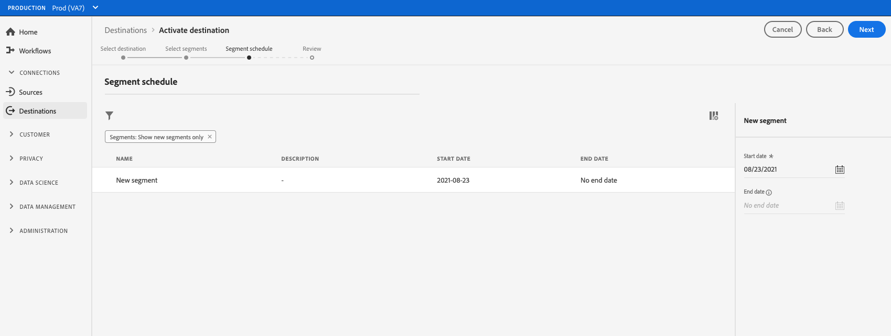

# 프로필 요청 대상에 대상 데이터 활성화

>[!IMPORTANT]
> 
> * 데이터를 활성화하고 활성화하려면 [매핑 단계](#mapping) 워크플로의 경우 **[!UICONTROL 대상 관리]**, **[!UICONTROL 대상 활성화]**, **[!UICONTROL 프로필 보기]**, 및 **[!UICONTROL 세그먼트 보기]** [액세스 제어 권한](/help/access-control/home.md#permissions).
> * 을(를) 거치지 않고 데이터를 활성화하려면 [매핑 단계](#mapping) 워크플로의 경우 **[!UICONTROL 대상 관리]**, **[!UICONTROL 매핑 없이 세그먼트 활성화]**, **[!UICONTROL 프로필 보기]**, 및 **[!UICONTROL 세그먼트 보기]** [액세스 제어 권한](/help/access-control/home.md#permissions).
> 
> 읽기 [액세스 제어 개요](/help/access-control/ui/overview.md) 필요한 권한을 얻으려면 제품 관리자에게 문의하십시오.

## 개요 {#overview}

이 문서에서는 Adobe Experience Platform 프로필 요청 대상에서 대상 데이터를 활성화하는 데 필요한 워크플로우에 대해 설명합니다. 함께 사용되는 경우 [가장자리 세분화](../../segmentation/ui/edge-segmentation.md), 이러한 대상을 사용하면 웹 및 모바일 속성에서 동일한 페이지 및 다음 페이지 개인화 사용 사례를 사용할 수 있습니다. 자세한 내용 [동일 페이지 및 다음 페이지 개인화 사용 사례 활성화](/help/destinations/ui/configure-personalization-destinations.md).

프로필 요청 대상의 예는 다음과 같습니다. [Adobe Target](../../destinations/catalog/personalization/adobe-target-connection.md) 및 [사용자 정의 개인화](../../destinations/catalog/personalization/custom-personalization.md) 연결.

## 사전 요구 사항 {#prerequisites}

대상에 데이터를 활성화하려면 가 정상적으로 작동해야 합니다. [대상에 연결됨](./connect-destination.md). 아직 수행하지 않았다면 [대상 카탈로그](../catalog/overview.md)에서 지원되는 개인화 대상을 탐색하고 사용할 대상을 구성합니다.

### 세그먼트 병합 정책 {#merge-policy}

현재 프로필 요청 대상은 를 사용하는 세그먼트의 활성화만 지원합니다. [Active-On-Edge 병합 정책](../../segmentation/ui/segment-builder.md#merge-policies) 을(를) 기본값으로 설정합니다.

## 대상 선택 {#select-destination}

1. 다음으로 이동 **[!UICONTROL 연결 > 대상]**&#x200B;을(를) 클릭하고 **[!UICONTROL 카탈로그]** 탭.

   

1. 선택 **[!UICONTROL 세그먼트 활성화]** 아래 이미지에 표시된 대로 세그먼트를 활성화할 개인화 대상에 해당하는 카드에.

   

1. 세그먼트를 활성화하는 데 사용할 대상 연결을 선택한 다음 을 선택합니다 **[!UICONTROL 다음]**.

   

1. 다음 섹션으로 이동 [세그먼트 선택](#select-segments).

## 세그먼트 선택 {#select-segments}

세그먼트 이름 왼쪽에 있는 확인란을 사용하여 대상에 활성화할 세그먼트를 선택한 다음 을 선택합니다 **[!UICONTROL 다음]**.

## (Beta) 맵 특성 {#map-attributes}

>[!IMPORTANT]
>
>다음에 대한 속성 기반 개인화를 활성화하는 매핑 단계 [Adobe Target](/help/destinations/catalog/personalization/adobe-target-connection.md) 및 [범용 개인화 대상](/help/destinations/catalog/personalization/custom-personalization.md)은(는) 현재 Beta 상태이며 조직에서 아직 액세스하지 못할 수 있습니다. 이 설명서는 변경될 수 있습니다.

사용자에 대한 개인화 사용 사례를 활성화할 속성을 선택합니다. 즉, 속성 값이 변경되거나 속성이 프로필에 추가되면 해당 프로필이 세그먼트의 멤버가 되어 개인화 대상에 활성화됩니다.

속성 추가는 선택 사항이며 다음 단계로 계속 진행하여 속성을 선택하지 않고 동일한 페이지 및 다음 페이지 개인화를 활성화할 수 있습니다. 이 단계에서 속성을 추가하지 않으면 프로필의 세그먼트 멤버십 및 ID 맵 자격을 기반으로 개인화가 계속 수행됩니다.

### 소스 속성 선택 {#select-source-attributes}

소스 속성을 추가하려면 **[!UICONTROL 새 필드 추가]** 에 대한 제어 **[!UICONTROL 소스 필드]** 아래와 같이 열을 검색하고 원하는 XDM 속성 필드로 이동합니다.

### 대상 속성 선택 {#select-target-attributes}

>[!NOTE]
>
>소스 속성만 선택해야 하는 대상도 있고 소스 및 타겟 속성을 모두 필요로 하는 대상도 있습니다.
>
>현재, [Adobe Target](../catalog/personalization/adobe-target-connection.md) 대상에는 소스 속성만 필요하지만 [속성을 사용한 사용자 지정 개인화](../catalog/personalization/custom-personalization.md) 에는 소스 및 타겟 속성이 모두 필요합니다.

대상 속성을 추가하려면 **[!UICONTROL 새 필드 추가]** 에 대한 제어 **[!UICONTROL Target 필드]** 소스 속성을 매핑할 사용자 지정 속성 이름을 입력하고 열을 선택합니다.

## 세그먼트 내보내기 예약 {#scheduling}

기본적으로 [!UICONTROL 세그먼트 일정] 페이지에는 현재 활성화 플로우에서 선택한 새로 선택한 세그먼트만 표시됩니다.

대상에 대해 활성화된 모든 세그먼트를 보려면 필터링 옵션을 사용하고 을(를) 비활성화합니다. **[!UICONTROL 새 세그먼트만 표시]** 필터.

다음에서 **[!UICONTROL 세그먼트 일정]** 페이지에서 각 세그먼트를 선택한 다음 **[!UICONTROL 시작일]** 및 **[!UICONTROL 종료일]** 선택기를 사용하여 데이터를 대상으로 전송하는 시간 간격을 구성할 수 있습니다.

선택 **[!UICONTROL 다음]** 로 이동 [!UICONTROL 리뷰] 페이지를 가리키도록 업데이트하는 중입니다.

## 검토 {#review}

다음에서 **[!UICONTROL 리뷰]** 페이지에서 선택 사항의 요약을 볼 수 있습니다. 선택 **[!UICONTROL 취소]** 흐름을 끊으려면, **[!UICONTROL 뒤로]** 설정을 수정하려면 **[!UICONTROL 완료]** 을 클릭하여 선택 항목을 확인하고 데이터를 대상으로 보내기 시작합니다.

### 동의 정책 평가 {#consent-policy-evaluation}

조직에서 **Adobe Healthcare Shield** 또는 **Adobe Privacy &amp; Security Shield**&#x200B;를 구매한 경우 **[!UICONTROL 해당 동의 정책 보기]**&#x200B;를 선택하여 적용된 동의 정책을 조회하고 그 결과로 활성화에 포함된 프로필 수를 확인합니다. 읽어보기 [동의 정책 평가](/help/data-governance/enforcement/auto-enforcement.md#consent-policy-evaluation) 추가 정보.

### 데이터 사용 정책 확인 {#data-usage-policy-checks}

다음에서 **[!UICONTROL 리뷰]** 단계, Experience Platform은 데이터 사용 정책 위반도 확인합니다. 다음은 정책이 위반되는 예입니다. 위반 사항을 해결할 때까지 세그먼트 활성화 워크플로우를 완료할 수 없습니다. 정책 위반을 해결하는 방법에 대한 자세한 내용은 다음을 참조하십시오. [데이터 사용 정책 위반](/help/data-governance/enforcement/auto-enforcement.md#data-usage-violation) (데이터 거버넌스 설명서 섹션)

### 세그먼트 필터링 {#filter-segments}

또한 이 단계에서는 페이지에서 사용 가능한 필터를 사용하여 이 워크플로우의 일부로 일정이나 매핑이 업데이트된 세그먼트만 표시할 수 있습니다. 보려는 테이블 열을 전환할 수도 있습니다.

선택에 만족하고 정책 위반이 감지되지 않은 경우 다음을 선택합니다. **[!UICONTROL 완료]** 을 클릭하여 선택 항목을 확인하고 데이터를 대상으로 보내기 시작합니다.

<!--

Commenting out this part since destination monitoring is not available currently for the Adobe Target and Custom Personalization destinations.

## Verify segment activation {#verify}

Check the [destination monitoring documentation](../../dataflows/ui/monitor-destinations.md) for detailed information on how to monitor the flow of data to your destinations.

-->