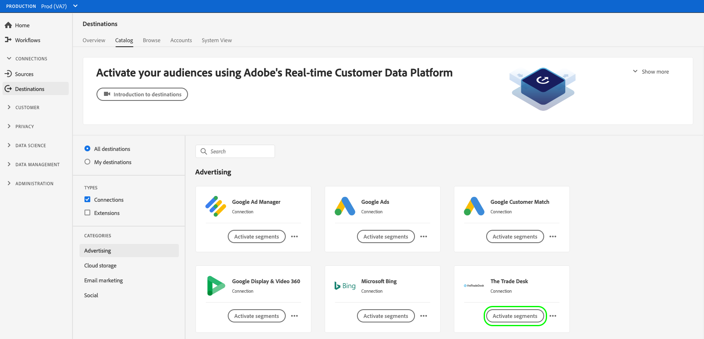

# 대상 데이터를 스트리밍 세그먼트 내보내기 대상으로 활성화

>[!IMPORTANT]
> 
> * 데이터를 활성화하고 활성화하려면 [매핑 단계](#mapping) 워크플로의 경우 **[!UICONTROL 대상 관리]**, **[!UICONTROL 대상 활성화]**, **[!UICONTROL 프로필 보기]**, 및 **[!UICONTROL 세그먼트 보기]** [액세스 제어 권한](/help/access-control/home.md#permissions).
> * 을(를) 거치지 않고 데이터를 활성화하려면 [매핑 단계](#mapping) 워크플로의 경우 **[!UICONTROL 대상 관리]**, **[!UICONTROL 매핑 없이 세그먼트 활성화]**, **[!UICONTROL 프로필 보기]**, 및 **[!UICONTROL 세그먼트 보기]** [액세스 제어 권한](/help/access-control/home.md#permissions).
> 
> 읽기 [액세스 제어 개요](/help/access-control/ui/overview.md) 필요한 권한을 얻으려면 제품 관리자에게 문의하십시오.

## 개요 {#overview}

이 문서에서는 Adobe Experience Platform 세그먼트 스트리밍 대상에서 대상 데이터를 활성화하는 데 필요한 워크플로우에 대해 설명합니다.

## 사전 요구 사항 {#prerequisites}

대상에 데이터를 활성화하려면 가 정상적으로 작동해야 합니다. [대상에 연결됨](./connect-destination.md). 아직 수행하지 않았다면 [대상 카탈로그](../catalog/overview.md)에서 지원되는 대상을 탐색하고 사용할 대상을 구성합니다.

## 대상 선택 {#select-destination}

1. 다음으로 이동 **[!UICONTROL 연결 > 대상]**&#x200B;을(를) 클릭하고 **[!UICONTROL 카탈로그]** 탭.

   

1. 선택 **[!UICONTROL 세그먼트 활성화]** 아래 그림과 같이 세그먼트를 활성화할 대상에 해당하는 카드에.

   

1. 세그먼트를 활성화하는 데 사용할 대상 연결을 선택한 다음 을 선택합니다 **[!UICONTROL 다음]**.

   

1. 다음 섹션으로 이동 [세그먼트 선택](#select-segments).

## 세그먼트 선택 {#select-segments}

세그먼트 이름 왼쪽에 있는 확인란을 사용하여 대상에 활성화할 세그먼트를 선택한 다음 을 선택합니다 **[!UICONTROL 다음]**.

## 속성 및 ID 매핑 {#mapping}

>[!IMPORTANT]
>
>이 단계는 일부 세그먼트 스트리밍 대상에만 적용됩니다. 대상에 이 없는 경우 **[!UICONTROL 매핑]** 단계, 다음으로 건너뛰기 [세그먼트 내보내기 예약](#scheduling).

일부 세그먼트 스트리밍 대상을 사용하려면 대상에서 타겟 ID로 매핑할 소스 속성 또는 ID 네임스페이스를 선택해야 합니다.

1. 다음에서 **[!UICONTROL 매핑]** 페이지, 선택 **[!UICONTROL 새 매핑 추가]**.

   

1. 오른쪽 화살표를 선택합니다. **[!UICONTROL 소스 필드]** 입력.

   

1. 다음에서 **[!UICONTROL 소스 필드 선택]** 페이지, 사용 **[!UICONTROL 속성 선택]** 또는 **[!UICONTROL ID 네임스페이스 선택]** 사용 가능한 두 가지 범주의 소스 필드 사이를 전환하는 옵션. 사용 가능한 날짜부터 [!DNL XDM] 프로필 속성 및 id 네임스페이스를 선택하고 대상에 매핑할 속성을 선택한 다음 을(를) 선택합니다 **[!UICONTROL 선택]**.

   

1. 오른쪽 버튼을 선택합니다. **[!UICONTROL Target 필드]** 입력.

   

1. 다음에서 **[!UICONTROL 대상 필드 선택]** 소스 필드를 매핑할 대상 id 네임스페이스를 선택한 다음 을(를) 선택합니다 **[!UICONTROL 선택]**.

   

1. 매핑을 더 추가하려면 1~5단계를 반복합니다.

### 변환 적용 {#apply-transformation}

>[!CONTEXTUALHELP]
>id="platform_destinations_activate_applytransformation"
>title="변환 적용"
>abstract="해시되지 않은 소스 필드를 사용할 때 이 옵션을 선택하면 Adobe Experience Platform에서 활성화 시 해당 필드를 자동으로 해시할 수 있습니다."

해시되지 않은 소스 속성을 대상이 해시할 것으로 예상하는 타겟 속성에 매핑할 때(예: `email_lc_sha256` 또는 `phone_sha256`), 다음을 확인합니다. **변환 적용** 활성화 시 Adobe Experience Platform이 소스 속성을 자동으로 해시하도록 하는 옵션입니다.

## 세그먼트 내보내기 예약 {#scheduling}

>[!CONTEXTUALHELP]
>id="platform_destinations_activate_enddate"
>title="종료 날짜"
>abstract="세그먼트 예약에 종료 일자를 추가할 수 없습니다."

기본적으로 [!UICONTROL 세그먼트 일정] 페이지에는 현재 활성화 플로우에서 선택한 새로 선택한 세그먼트만 표시됩니다.

대상에 대해 활성화된 모든 세그먼트를 보려면 필터링 옵션을 사용하고 을(를) 비활성화합니다. **[!UICONTROL 새 세그먼트만 표시]** 필터.

1. 다음에서 **[!UICONTROL 세그먼트 일정]** 페이지에서 각 세그먼트를 선택한 다음 **[!UICONTROL 시작일]** 및 **[!UICONTROL 종료일]** 선택기를 사용하여 데이터를 대상으로 전송하는 시간 간격을 구성할 수 있습니다.

   

   * 일부 대상에서는 다음을 선택해야 합니다. **[!UICONTROL 대상자 원본]** 각 세그먼트에 대해 달력 선택기 아래의 드롭다운 메뉴를 사용합니다. 대상에 이 선택기가 포함되지 않은 경우 이 단계를 건너뜁니다.

      

   * 일부 대상에서는 수동으로 매핑해야 합니다. [!DNL Platform] 세그먼트를 대상 대상의 해당 세그먼트와 연결합니다. 이렇게 하려면 각 세그먼트를 선택한 다음 의 대상 플랫폼에서 해당 세그먼트 ID를 입력합니다 **[!UICONTROL 매핑 ID]** 필드. 대상에 이 필드가 포함되지 않은 경우 이 단계를 건너뜁니다.

      

   * 일부 대상에는 다음을 입력해야 합니다. **[!UICONTROL 앱 ID]** 활성화 시 [!DNL IDFA] 또는 [!DNL GAID] 세그먼트. 대상에 이 필드가 포함되지 않은 경우 이 단계를 건너뜁니다.

      

1. 선택 **[!UICONTROL 다음]** 로 이동 [!UICONTROL 리뷰] 페이지를 가리키도록 업데이트하는 중입니다.

## 검토 {#review}

다음에서 **[!UICONTROL 리뷰]** 페이지에서 선택 사항의 요약을 볼 수 있습니다. 선택 **[!UICONTROL 취소]** 흐름을 끊으려면, **[!UICONTROL 뒤로]** 설정을 수정하려면 **[!UICONTROL 완료]** 을 클릭하여 선택 항목을 확인하고 데이터를 대상으로 보내기 시작합니다.

### 동의 정책 평가 {#consent-policy-evaluation}

조직에서 **Adobe Healthcare Shield** 또는 **Adobe Privacy &amp; Security Shield**&#x200B;를 구매한 경우 **[!UICONTROL 해당 동의 정책 보기]**&#x200B;를 선택하여 적용된 동의 정책을 조회하고 그 결과로 활성화에 포함된 프로필 수를 확인합니다. 읽어보기 [동의 정책 평가](/help/data-governance/enforcement/auto-enforcement.md#consent-policy-evaluation) 추가 정보.

### 데이터 사용 정책 확인 {#data-usage-policy-checks}

다음에서 **[!UICONTROL 리뷰]** 단계, Experience Platform은 데이터 사용 정책 위반도 확인합니다. 다음은 정책이 위반되는 예입니다. 위반 사항을 해결할 때까지 세그먼트 활성화 워크플로우를 완료할 수 없습니다. 정책 위반을 해결하는 방법에 대한 자세한 내용은 다음을 참조하십시오. [데이터 사용 정책 위반](/help/data-governance/enforcement/auto-enforcement.md#data-usage-violation) (데이터 거버넌스 설명서 섹션)

### 세그먼트 필터링 {#filter-segments}

또한 이 단계에서는 페이지에서 사용 가능한 필터를 사용하여 이 워크플로우의 일부로 일정이나 매핑이 업데이트된 세그먼트만 표시할 수 있습니다. 보려는 테이블 열을 전환할 수도 있습니다.

선택에 만족하고 정책 위반이 감지되지 않은 경우 다음을 선택합니다. **[!UICONTROL 완료]** 을 클릭하여 선택 항목을 확인하고 데이터를 대상으로 보내기 시작합니다.

## 세그먼트 활성화 확인 {#verify}

다음 확인: [대상 모니터링 설명서](../../dataflows/ui/monitor-destinations.md) 대상으로의 데이터 흐름을 모니터링하는 방법에 대한 자세한 정보.

<!-- 
For [!DNL Facebook Custom Audience], a successful activation means that a [!DNL Facebook] custom audience would be created programmatically in [[!UICONTROL Facebook Ads Manager]](https://www.facebook.com/adsmanager/manage/). Segment membership in the audience would be added and removed as users are qualified or disqualified for the activated segments.

>[!TIP]
>
>The integration between Adobe Experience Platform and [!DNL Facebook] supports historical audience backfills. All historical segment qualifications are sent to [!DNL Facebook] when you activate the segments to the destination.
-->
