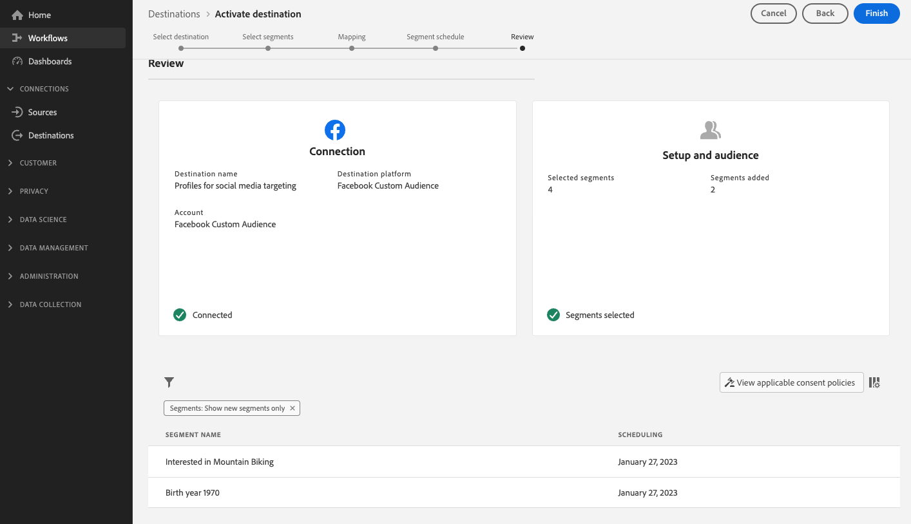

# 스트리밍 대상에 대상 활성화

>[!IMPORTANT]
> 
> * 대상을 활성화하고 워크플로우의 [매핑 단계](#mapping)를 활성화하려면 **[!UICONTROL 대상 보기]**, **[!UICONTROL 대상 활성화]**, **[!UICONTROL 프로필 보기]** 및 **[!UICONTROL 세그먼트 보기]** [액세스 제어 권한](/help/access-control/home.md#permissions)이 필요합니다.
> * 워크플로우의 [매핑 단계](#mapping)를 거치지 않고 대상을 활성화하려면 **[!UICONTROL 대상 보기]**, **[!UICONTROL 매핑하지 않고 세그먼트 활성화]**, **[!UICONTROL 프로필 보기]**, **[!UICONTROL 세그먼트 보기]** [액세스 제어 권한](/help/access-control/home.md#permissions)이 필요합니다.
>* *ID*&#x200B;을(를) 내보내려면 **[!UICONTROL ID 그래프 보기]** [액세스 제어 권한](/help/access-control/home.md#permissions)이 필요합니다.   {width="100" zoomable="yes"}
> 
> [액세스 제어 개요](/help/access-control/ui/overview.md)를 읽거나 제품 관리자에게 문의하여 필요한 권한을 받으십시오.

## 개요 {#overview}

이 문서에서는 Adobe Experience Platform 스트리밍 대상에서 대상을 활성화하는 데 필요한 워크플로에 대해 설명합니다.

## 전제 조건 {#prerequisites}

대상을 대상으로 활성화하려면 대상에 [연결됨](./connect-destination.md)이(가) 있어야 합니다. 아직 수행하지 않았다면 [대상 카탈로그](../catalog/overview.md)(으)로 이동하여 지원되는 대상을 탐색하고 사용할 대상을 구성합니다.

## 대상 선택 {#select-destination}

1. **[!UICONTROL 연결 > 대상]**(으)로 이동하여 **[!UICONTROL 카탈로그]** 탭을 선택합니다.

   

1. 아래 그림과 같이 대상을 활성화할 대상에 해당하는 카드에서 **[!UICONTROL 대상 활성화]**&#x200B;를 선택합니다.

   

1. 대상을 활성화하는 데 사용할 대상 연결을 선택한 후 **[!UICONTROL 다음]**&#x200B;을(를) 선택하십시오.

   

1. 다음 섹션으로 이동하여 [대상자를 선택](#select-audiences)하십시오.

## 대상자 선택 {#select-audiences}

대상으로 활성화할 대상을 선택하려면 대상 이름 왼쪽에 있는 확인란을 사용한 다음 **[!UICONTROL 다음]**&#x200B;을 선택합니다.

출처에 따라 여러 유형의 대상 중에서 선택할 수 있습니다.

* **[!UICONTROL 세그먼테이션 서비스]**: 세그먼테이션 서비스에 의해 Experience Platform 내에서 생성된 대상입니다. 자세한 내용은 [세그먼테이션 설명서](../../segmentation/ui/overview.md)를 참조하세요.
* **[!UICONTROL 사용자 지정 업로드]**: Experience Platform 외부에서 생성되어 Experience Platform에 CSV 파일로 업로드된 대상자입니다. 외부 대상자에 대한 자세한 내용은 [대상자 가져오기](../../segmentation/ui/audience-portal.md#import-audience)에 대한 설명서를 참조하십시오.
* 다른 Adobe 솔루션에서 가져온 다른 유형의 대상(예: [!DNL Audience Manager]).

## 속성 및 ID 매핑 {#mapping}

>[!IMPORTANT]
>
>이 단계는 일부 대상 스트리밍 대상에만 적용됩니다. 대상에 **[!UICONTROL 매핑]** 단계가 없는 경우 [대상 예약](#scheduling)(으)로 건너뛰십시오.
>
>대상을 스트리밍 대상으로 활성화할 때 대상 프로필 특성 외에 *하나 이상의 대상 ID 네임스페이스*도 매핑해야 합니다. 그렇지 않으면 대상자가 대상 플랫폼에 활성화되지 않습니다.
>  {zoomable="yes"}

일부 대상 스트리밍 대상에서는 소스 속성이나 ID 네임스페이스를 선택하여 대상의 타겟 ID로 매핑해야 합니다.

1. **[!UICONTROL 매핑]** 페이지에서 **[!UICONTROL 새 매핑 추가]**&#x200B;를 선택합니다.

   

1. **[!UICONTROL Source 필드]** 항목 오른쪽의 화살표를 선택합니다.

   

1. **[!UICONTROL 소스 필드 선택]** 페이지에서 **[!UICONTROL 특성 선택]** 또는 **[!UICONTROL ID 네임스페이스 선택]** 옵션을 사용하여 사용 가능한 두 범주의 소스 필드 사이를 전환합니다. 사용 가능한 [!DNL XDM] 프로필 특성 및 ID 네임스페이스에서 대상에 매핑할 특성을 선택한 다음 **[!UICONTROL 선택]**&#x200B;을(를) 선택합니다.

   **[!UICONTROL 데이터가 있는 필드만 표시]** 전환을 사용하여 값으로 채워진 스키마 필드만 표시합니다. 기본적으로 채워진 스키마 필드만 표시됩니다.

   

1. **[!UICONTROL 대상 필드]** 항목 오른쪽에 있는 단추를 선택합니다.

   

1. **[!UICONTROL 대상 필드 선택]** 페이지에서 원본 필드를 매핑할 대상 ID 네임스페이스를 선택하고 **[!UICONTROL 선택]**&#x200B;을(를) 선택합니다.

   

1. 매핑을 더 추가하려면 1~5단계를 반복합니다.

### 변환 적용 {#apply-transformation}

>[!CONTEXTUALHELP]
>id="platform_destinations_activate_applytransformation"
>title="변환 적용"
>abstract="해시되지 않은 소스 필드를 사용할 때 이 옵션을 선택하면 Adobe Experience Platform에서 활성화 시 해당 필드를 자동으로 해시할 수 있습니다."

해시되지 않은 소스 특성을 대상이 해시될 것으로 예상하는 대상 특성(예: `email_lc_sha256` 또는 `phone_sha256`)에 매핑할 때 **변환 적용** 옵션을 선택하여 Adobe Experience Platform이 활성화 시 소스 특성을 자동으로 해시하도록 합니다.

## 대상자 내보내기 예약 {#scheduling}

>[!CONTEXTUALHELP]
>id="platform_destinations_activate_enddate"
>title="종료 날짜"
>abstract="대상자 예약에 종료 날짜를 추가할 수 없습니다."

기본적으로 **[!UICONTROL 대상 일정]** 페이지에는 현재 활성화 흐름에서 선택한 새로 선택한 대상만 표시됩니다.

대상에 대해 활성화된 모든 대상을 보려면 필터링 옵션을 사용하고 **[!UICONTROL 새 대상만 표시]** 필터를 비활성화하십시오.

1. **[!UICONTROL 대상 일정]** 페이지에서 각 대상을 선택한 다음 **[!UICONTROL 시작 날짜]** 및 **[!UICONTROL 종료 날짜]** 선택기를 사용하여 데이터를 대상으로 보내는 시간 간격을 구성하십시오.

   

   * 일부 대상에서는 달력 선택기 아래의 드롭다운 메뉴를 사용하여 각 대상자에 대해 **[!UICONTROL 대상자 원본]**&#x200B;을 선택해야 합니다. 대상에 이 선택기가 포함되지 않은 경우 이 단계를 건너뜁니다.

     

   * 일부 대상을 사용하려면 [!DNL Experience Platform] 대상을 대상 대상의 해당 대상에 수동으로 매핑해야 합니다. 이렇게 하려면 각 대상을 선택한 다음 **[!UICONTROL 매핑 ID]** 필드에 대상 플랫폼의 해당 대상 ID를 입력합니다. 대상에 이 필드가 포함되지 않은 경우 이 단계를 건너뜁니다.

     

   * [!DNL IDFA] 또는 [!DNL GAID] 대상을 활성화할 때 일부 대상에 대해 **[!UICONTROL 앱 ID]**&#x200B;를 입력해야 합니다. 대상에 이 필드가 포함되지 않은 경우 이 단계를 건너뜁니다.

     

1. **[!UICONTROL 다음]**&#x200B;을(를) 선택하여 [!UICONTROL 검토] 페이지로 이동합니다.

## 검토 {#review}

**[!UICONTROL 검토]** 페이지에서 선택한 항목에 대한 요약을 볼 수 있습니다. 흐름을 중단하려면 **[!UICONTROL 취소]**&#x200B;를 선택하고, 설정을 수정하려면 **[!UICONTROL 뒤로]**&#x200B;를 선택하고, 선택을 확인하고 데이터를 대상으로 보내려면 **[!UICONTROL 완료]**&#x200B;를 선택하십시오.

### 동의 정책 평가 {#consent-policy-evaluation}

조직에서 **Adobe Healthcare Shield** 또는 **Adobe Privacy &amp; Security Shield**&#x200B;를 구매한 경우 **[!UICONTROL 해당 동의 정책 보기]**&#x200B;를 선택하여 적용된 동의 정책을 조회하고 그 결과로 활성화에 포함된 프로필 수를 확인합니다. 자세한 내용은 [동의 정책 평가](/help/data-governance/enforcement/auto-enforcement.md#consent-policy-evaluation)를 참조하세요.

### 데이터 사용 정책 확인 {#data-usage-policy-checks}

**[!UICONTROL 검토]** 단계에서 Experience Platform은 데이터 사용 정책 위반도 확인합니다. 다음은 정책이 위반되는 예입니다. 위반을 해결할 때까지 대상 활성화 워크플로우를 완료할 수 없습니다. 정책 위반을 해결하는 방법에 대한 자세한 내용은 데이터 거버넌스 설명서 섹션에서 [데이터 사용 정책 위반](/help/data-governance/enforcement/auto-enforcement.md#data-usage-violation)을 읽어 보십시오.

### 대상자 필터링 {#filter-audiences}

또한 이 단계에서는 페이지에서 사용 가능한 필터를 사용하여 이 워크플로우의 일부로 일정이나 매핑이 업데이트된 대상자만 표시할 수 있습니다. 보려는 테이블 열을 전환할 수도 있습니다.

선택에 만족하고 정책 위반이 발견되지 않은 경우 **[!UICONTROL 완료]**&#x200B;를 선택하여 선택을 확인하고 데이터를 대상으로 보내기 시작합니다.

## 대상자 활성화 확인 {#verify}

대상에 대한 데이터 흐름을 모니터링하는 방법에 대한 자세한 내용은 [대상 모니터링 설명서](../../dataflows/ui/monitor-destinations.md)를 참조하세요.

<!-- 
For [!DNL Facebook Custom Audience], a successful activation means that a [!DNL Facebook] custom audience would be created programmatically in [[!UICONTROL Facebook Ads Manager]](https://www.facebook.com/adsmanager/manage/). Audience membership in the audience would be added and removed as users are qualified or disqualified for the activated audiences.

>[!TIP]
>
>The integration between Adobe Experience Platform and [!DNL Facebook] supports historical audience backfills. All historical audience qualifications are sent to [!DNL Facebook] when you activate the audiences to the destination.
-->
