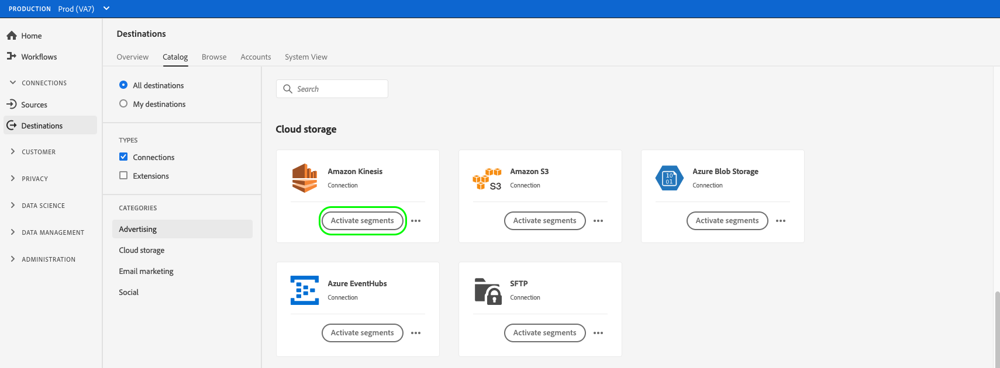

# 스트리밍 프로필 내보내기 대상으로 대상 데이터 활성화

>[!IMPORTANT]
> 
> * 데이터를 활성화하고 를 활성화하려면 [매핑 단계](#mapping) 워크플로우의 경우 **[!UICONTROL 대상 관리]**, **[!UICONTROL 대상 활성화]**, **[!UICONTROL 프로필 보기]**, 및 **[!UICONTROL 세그먼트 보기]** [액세스 제어 권한](/help/access-control/home.md#permissions).
> * 를 거치지 않고 데이터를 활성화하려면 [매핑 단계](#mapping) 워크플로우의 경우 **[!UICONTROL 대상 관리]**, **[!UICONTROL 매핑 없이 세그먼트 활성화]**, **[!UICONTROL 프로필 보기]**, 및 **[!UICONTROL 세그먼트 보기]** [액세스 제어 권한](/help/access-control/home.md#permissions).
> 
> 다음 문서를 참조하십시오. [액세스 제어 개요](/help/access-control/ui/overview.md) 또는 제품 관리자에게 문의하여 필요한 권한을 얻으십시오.

## 개요 {#overview}

이 문서에서는 Amazon Kinesis과 같은 Adobe Experience Platform 스트리밍 프로필 기반 대상에서 대상 데이터를 활성화하는 데 필요한 워크플로우를 설명합니다.

## 사전 요구 사항 {#prerequisites}

대상에 데이터를 활성화하려면 [대상에 연결](./connect-destination.md). 아직 하지 않았다면 을(를) 참조하십시오. [대상 카탈로그](../catalog/overview.md)를 클릭하고 지원되는 대상을 탐색하고 사용할 대상을 구성합니다.

## 대상을 선택합니다 {#select-destination}

1. 이동 **[!UICONTROL 연결 > 대상]**, 을(를) 선택하고 을(를) 선택합니다. **[!UICONTROL 카탈로그]** 탭.

   

1. 선택 **[!UICONTROL 세그먼트 활성화]** 세그먼트를 활성화할 대상에 해당하는 카드에서 아래 그림과 같이 세그먼트를 활성화하십시오.

   

1. 세그먼트를 활성화하는 데 사용할 대상 연결을 선택한 다음 을 선택합니다 **[!UICONTROL 다음]**.

   

1. 다음 섹션으로 이동 [세그먼트 선택](#select-segments).

## 세그먼트 선택 {#select-segments}

세그먼트 이름 왼쪽에 있는 확인란을 사용하여 대상으로 활성화할 세그먼트를 선택한 다음 선택합니다 **[!UICONTROL 다음]**.


## 프로필 속성 선택 {#select-attributes}

에서 **[!UICONTROL 매핑]** 단계에서 대상 대상으로 전송할 프로필 속성을 선택합니다.

>[!NOTE]
>
> Adobe Experience Platform은 스키마에서 일반적으로 사용되는 4가지 권장 속성으로 선택 사항을 미리 채웁니다. `person.name.firstName`, `person.name.lastName`, `personalEmail.address`, `segmentMembership.status`.

파일 내보내기는 여부에 따라 다음과 같은 방식으로 달라집니다 `segmentMembership.status` 이(가) 선택되어 있습니다.
* 만약 `segmentMembership.status` 필드를 선택하면 내보낸 파일이 포함됩니다. **[!UICONTROL 활성]** 초기 전체 스냅샷의 멤버 및 **[!UICONTROL 활성]** 및 **[!UICONTROL 만료됨]** 후속 증분 내보내기에 있는 멤버
* 만약 `segmentMembership.status` 필드를 선택하지 않고 내보낸 파일만 포함합니다 **[!UICONTROL 활성]** 초기 전체 스냅샷과 후속 증분 내보내기의 멤버


1. 에서 **[!UICONTROL 속성 선택]** 페이지를 선택하고 **[!UICONTROL 새 필드 추가]**.

   

1. 오른쪽 화살표를 선택합니다 **[!UICONTROL 스키마 필드]** 을 입력합니다.

   

1. 에서 **[!UICONTROL 필드 선택]** 페이지에서 대상으로 전송할 XDM 속성을 선택한 다음 **[!UICONTROL 선택]**.

   


1. 매핑을 추가하려면 1단계부터 3단계까지 반복한 다음 을 선택합니다 **[!UICONTROL 다음]**.

## 검토 {#review}

설정 **[!UICONTROL 검토]** 페이지에서 선택 사항에 대한 요약을 볼 수 있습니다. 선택 **[!UICONTROL 취소]** 흐름을 분해하려면 **[!UICONTROL 뒤로]** 설정을 수정하려면 **[!UICONTROL 완료]** 을(를) 클릭하여 선택 내용을 확인하고 데이터를 대상으로 보내기 시작합니다.


### 동의 정책 평가 {#consent-policy-evaluation}

조직에서 **Adobe Healthcare Shield** 또는 **Adobe Privacy &amp; Security Shield**&#x200B;를 구매한 경우 **[!UICONTROL 해당 동의 정책 보기]**&#x200B;를 선택하여 적용된 동의 정책을 조회하고 그 결과로 활성화에 포함된 프로필 수를 확인합니다. 자세한 내용 [동의 정책 평가](/help/data-governance/enforcement/auto-enforcement.md#consent-policy-evaluation) 추가 정보.

### 데이터 사용 정책 검사 {#data-usage-policy-checks}

에서 **[!UICONTROL 검토]** 또한 Experience Platform은 데이터 사용 정책 위반도 확인합니다. 아래는 정책이 위반되는 예입니다. 위반을 해결해야 세그먼트 활성화 워크플로우를 완료할 수 있습니다. 정책 위반을 해결하는 방법에 대한 자세한 내용은 [데이터 사용 정책 위반](/help/data-governance/enforcement/auto-enforcement.md#data-usage-violation) ( 데이터 거버넌스 설명서 섹션) 을 참조하십시오.


### 세그먼트 필터링 {#filter-segments}

또한 이 단계에서는 페이지의 사용 가능한 필터를 사용하여 이 워크플로우의 일부로 일정이나 매핑이 업데이트된 세그먼트만 표시할 수 있습니다.


선택한 내용에 만족하고 정책 위반이 감지되지 않은 경우 을(를) 선택합니다 **[!UICONTROL 완료]** 을(를) 클릭하여 선택 내용을 확인하고 데이터를 대상으로 보내기 시작합니다.

## 세그먼트 활성화 확인 {#verify}

내보낸 [!DNL Experience Platform] 데이터가 JSON 형식으로 타겟 대상에 도착합니다. 예를 들어, 아래 이벤트는 특정 세그먼트에 대해 자격이 있고 다른 세그먼트를 종료한 대상의 이메일 주소 프로필 속성을 포함합니다. 이 잠재 고객의 ID는 ECID 및 이메일입니다.

```json
{
  "person": {
    "email": "yourstruly@adobe.com"
  },
  "segmentMembership": {
    "ups": {
      "7841ba61-23c1-4bb3-a495-00d3g5fe1e93": {
        "lastQualificationTime": "2020-05-25T21:24:39Z",
        "status": "exited"
      },
      "59bd2fkd-3c48-4b18-bf56-4f5c5e6967ae": {
        "lastQualificationTime": "2020-05-25T23:37:33Z",
        "status": "realized"
      }
    }
  },
  "identityMap": {
    "ecid": [
      {
        "id": "14575006536349286404619648085736425115"
      },
      {
        "id": "66478888669296734530114754794777368480"
      }
    ],
    "email_lc_sha256": [
      {
        "id": "655332b5fa2aea4498bf7a290cff017cb4"
      },
      {
        "id": "66baf76ef9de8b42df8903f00e0e3dc0b7"
      }
    ]
  }
}
```
