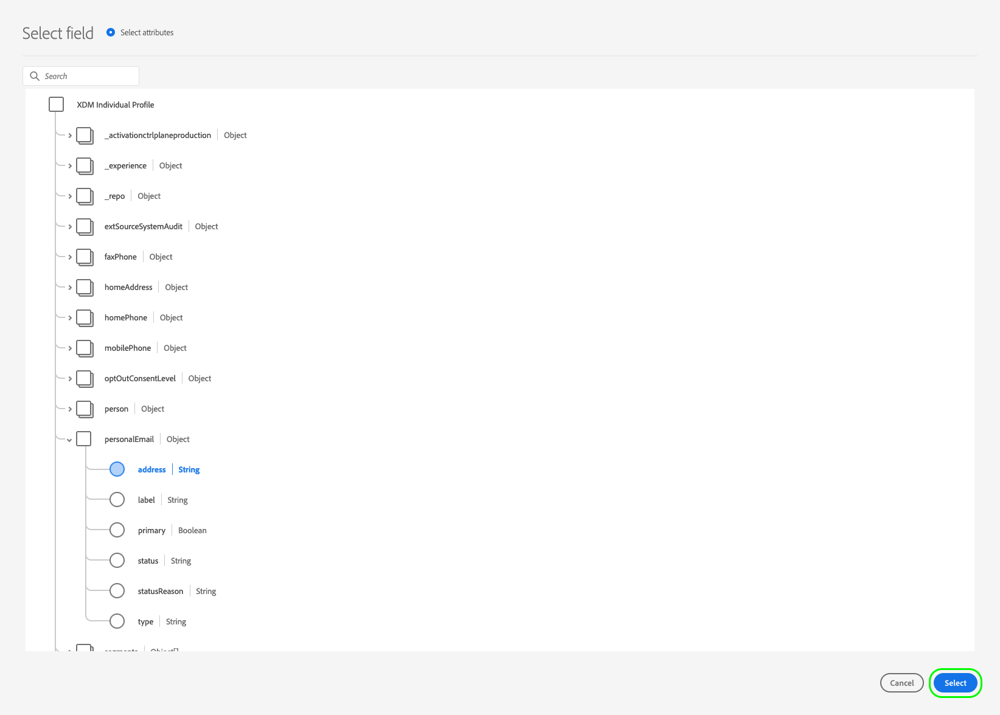

# 스트리밍 프로필 내보내기 대상으로 대상 데이터 활성화

## 개요 {#overview}

이 문서에서는 Amazon Kinesis과 같은 Adobe Experience Platform 스트리밍 프로필 기반 대상에서 대상 데이터를 활성화하는 데 필요한 워크플로우를 설명합니다.

## 전제 조건 {#prerequisites}

대상에 데이터를 활성화하려면 [이(가) 대상](./connect-destination.md)에 연결되어 있어야 합니다. 아직 수행하지 않았다면 [대상 카탈로그](../catalog/overview.md)로 이동하여 지원되는 대상을 탐색하고 사용할 대상을 구성합니다.

## 대상을 선택합니다 {#select-destination}

1. **[!UICONTROL 연결 > 대상]**&#x200B;으로 이동하고 **[!UICONTROL 찾아보기]** 탭을 선택합니다.

   

1. 아래 그림과 같이 세그먼트를 활성화할 대상에 해당하는 **[!UICONTROL 세그먼트 추가]** 단추를 선택하십시오.

   

1. 다음 섹션으로 이동하여 [세그먼트 선택](#select-segments).

## 세그먼트 선택 {#select-segments}

세그먼트 이름의 왼쪽에 있는 확인란을 사용하여 대상으로 활성화할 세그먼트를 선택한 다음 **[!UICONTROL 다음]**&#x200B;을 선택합니다.


## 프로필 속성 선택 {#select-attributes}

대상 대상으로 전송할 프로필 속성을 선택합니다.

>[!NOTE]
>
> Adobe Experience Platform은 스키마에서 일반적으로 사용되는 4가지 권장 속성으로 선택 사항을 미리 채웁니다. `person.name.firstName`, `person.name.lastName`, `personalEmail.address`, `segmentMembership.status`.

파일 내보내기는 `segmentMembership.status` 선택 여부에 따라 다음과 같은 방식으로 달라집니다.
* `segmentMembership.status` 필드를 선택하면 내보낸 파일에는 초기 전체 스냅샷의 **[!UICONTROL Active]** 멤버와 후속 증분 내보내기의 **[!UICONTROL Active]** 및 **[!UICONTROL Expired]** 멤버가 포함됩니다.
* `segmentMembership.status` 필드를 선택하지 않으면 내보낸 파일에는 초기 전체 스냅샷과 후속 증분 내보내기에 **[!UICONTROL Active]** 멤버만 포함됩니다.


1. **[!UICONTROL 속성 선택]** 페이지에서 **[!UICONTROL 새 필드 추가]**&#x200B;를 선택합니다.

   

1. **[!UICONTROL 스키마 필드]** 항목 오른쪽에 있는 화살표를 선택합니다.

   

1. **[!UICONTROL 필드 선택]** 페이지에서 대상으로 전송할 XDM 속성을 선택한 다음 **[!UICONTROL 선택]**&#x200B;을 선택합니다.

   


1. 매핑을 더 추가하려면 1단계부터 3단계까지 반복한 다음 **[!UICONTROL 다음]**&#x200B;을 선택합니다.

## 검토 {#review}

**[!UICONTROL 검토]** 페이지에서 선택 요약이 표시됩니다. **[!UICONTROL 취소]**&#x200B;를 선택하여 플로우를 분류하고, 설정을 수정하려면 **[!UICONTROL 뒤로]**&#x200B;를 선택하고, 선택 내용을 확인하고 데이터를 대상에 보내려면 **[!UICONTROL 완료]**&#x200B;를 선택합니다.

>[!IMPORTANT]
>
>이 단계에서 Adobe Experience Platform은 데이터 사용 정책 위반을 확인합니다. 아래는 정책이 위반되는 예입니다. 위반을 해결해야 세그먼트 활성화 워크플로우를 완료할 수 있습니다. 정책 위반을 해결하는 방법에 대한 자세한 내용은 데이터 거버넌스 설명서 섹션의 [정책 적용](../../rtcdp/privacy/data-governance-overview.md#enforcement)을 참조하십시오.


정책 위반이 감지되지 않은 경우 **[!UICONTROL 완료]**&#x200B;를 선택하여 선택 내용을 확인하고 데이터를 대상에 보냅니다.


## 세그먼트 활성화 확인 {#verify}


이메일 마케팅 대상 및 클라우드 스토리지 대상의 경우, Adobe Experience Platform은 제공한 저장소 위치에 탭으로 구분된 `.csv` 파일을 만듭니다. 매일 저장소 위치에 새 파일이 생성될 것으로 예상됩니다. 기본 파일 형식은 다음과 같습니다.
`<destinationName>_segment<segmentID>_<timestamp-yyyymmddhhmmss>.csv`

3일 연속으로 받은 파일은 다음과 같습니다.

```console
Salesforce_Marketing_Cloud_segment12341e18-abcd-49c2-836d-123c88e76c39_20200408061804.csv
Salesforce_Marketing_Cloud_segment12341e18-abcd-49c2-836d-123c88e76c39_20200409052200.csv
Salesforce_Marketing_Cloud_segment12341e18-abcd-49c2-836d-123c88e76c39_20200410061130.csv
```

스토리지 위치에 이러한 파일이 있으면 성공적인 활성화를 확인할 수 있습니다. 내보낸 파일의 구조를 이해하기 위해 [샘플 .csv 파일](../assets/common/sample_export_file_segment12341e18-abcd-49c2-836d-123c88e76c39_20200408061804.csv)을 다운로드할 수 있습니다. 이 샘플 파일에는 프로필 속성 `person.firstname`, `person.lastname`, `person.gender`, `person.birthyear` 및 `personalEmail.address`가 포함되어 있습니다.
