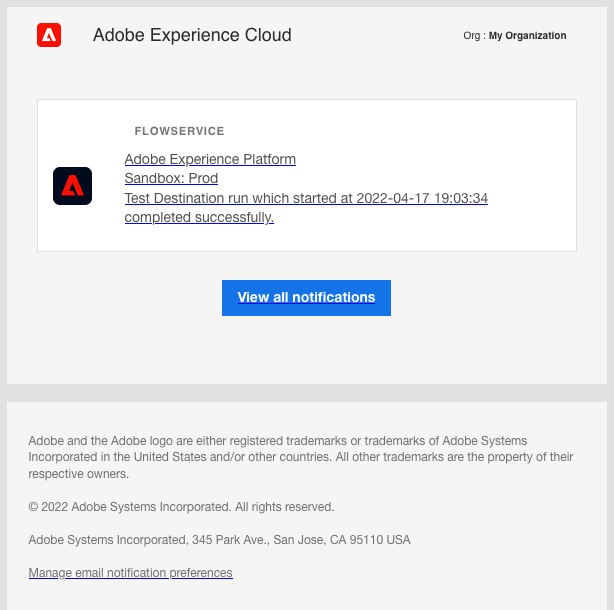

# 컨텍스트 내 대상 경고 구독

Adobe Experience Platform을 사용하면 Adobe Experience Platform 활동과 관련된 이벤트 기반 경고를 구독할 수 있습니다. 경고는 작업이 완료되었는지, 워크플로우 내의 특정 마일스톤에 도달했는지 또는 오류가 발생했는지 확인하기 위해 [[!DNL Observability Insights] API](../../observability/api/overview.md)를 폴링하지 않아도 됩니다.

데이터 흐름을 만들 때 경고를 구독하여 흐름 실행의 상태, 성공 또는 실패와 관련된 경고 메시지를 받을 수 있습니다.

이 문서에서는 대상 데이터 흐름에 대한 알림 메시지 수신을 구독하는 방법에 대한 단계를 설명합니다.

## 시작하기

이 문서를 사용하려면 Adobe Experience Platform의 다음 구성 요소에 대해 잘 알고 있어야 합니다.

* [대상](../home.md): Adobe Experience Platform에서 데이터를 원활하게 활성화할 수 있도록 대상 플랫폼과의 사전 빌드된 통합. 대상을 사용해 교차 채널 마케팅 캠페인, 이메일 캠페인, 타겟팅 광고 및 기타 많은 사용 사례를 위해 알려진 데이터와 알 수 없는 데이터를 활성화할 수 있습니다.
* [가시성](../../observability/home.md): [!DNL Observability Insights]을(를) 사용하면 통계 지표 및 이벤트 알림을 사용하여 플랫폼 활동을 모니터링할 수 있습니다.
   * [경고](../../observability/alerts/overview.md): Platform 작업의 특정 조건 집합에 도달하면(예: 시스템이 임계값을 위반한 경우 발생할 수 있는 문제) Platform에서 해당 조건을 구독한 조직의 모든 사용자에게 경고 메시지를 전달할 수 있습니다.

## UI에서 알림 구독 {#subscribe-destination-alerts}

>[!CONTEXTUALHELP]
>id="platform_destination_alerts_subscribe"
>title="대상 알림 구독"
>abstract="경고를 사용하여 대상 데이터 흐름 상태에 따라 알림을 수신할 수 있습니다. 데이터 흐름이 시작되거나 성공 또는 실패했을 경우 또는 데이터를 대상으로 보내지 않은 경우 경고 알림을 설정하여 업데이트를 받을 수 있습니다."
>text="Learn more in documentation"

>[!IMPORTANT]
>
>데이터 흐름에 대한 이메일 기반 경고 알림을 수신하려면 Platform 계정에 대해 이메일 인스턴트 알림을 활성화해야 합니다.

[대상 연결](connect-destination.md) 워크플로의 [!UICONTROL 새 대상 구성] 단계 동안 데이터 흐름에 대한 경고를 사용하도록 설정할 수 있습니다.

대상 경고 섹션을 표시하는 

구독할 경고를 선택한 다음 **[!UICONTROL 다음]**&#x200B;을(를) 선택하여 데이터 흐름을 검토하고 완료합니다.

대상 데이터 흐름에 사용할 수 있는 경고는 아래 표에 설명되어 있습니다.

* 스트리밍 대상의 경우 [!DNL Activation Skipped Rate Exceeded] 경고만 사용할 수 있습니다.
* 파일 기반 대상의 경우 모든 경고를 사용할 수 있습니다.

| 경고 | 설명 |
| --- | --- |
| 대상 흐름 실행 지연 | 이 경고는 대상 플로우 실행이 대상자를 활성화하는 데 150분 이상 걸리면 알려줍니다. |
| 대상 흐름 실행 실패 | 이 경고는 대상을 대상으로 활성화하는 동안 오류가 발생하면 알려줍니다. |
| 대상 흐름 실행 성공 | 이 경고는 대상자가 대상에 성공적으로 활성화되면 알려줍니다. |
| 대상 플로우 실행 시작 | 이 경고는 대상 플로우 실행이 대상자 활성화를 시작할 때 알려줍니다. |
| 활성화 건너뛰기 비율 초과 | 이 경고는 활성화 건너뛰기 비율이 총 활성화의 1%를 초과하면 알려줍니다. 누락된 속성 또는 동의 위반이 있는 경우 활성화 중에 ID를 건너뜁니다. |

## 경고 수신 중 {#receiving-alerts}

대상 데이터 흐름이 실행되면 UI를 통해 또는 이메일로 경고를 받을 수 있습니다.

### UI에서 경고 받기 {#receiving-alerts-in-ui}

경고는 Platform UI의 상단 헤더에 있는 알림 아이콘으로 UI에 표시됩니다. 알림 아이콘을 선택하여 데이터 흐름과 관련된 특정 경고 메시지를 확인합니다.

만든 데이터 흐름의 상태 업데이트 목록을 표시하는 알림 패널이 나타납니다.

알림 패널을 표시하는 

경고 메시지를 마우스로 가리켜 읽음으로 표시하거나 시계 아이콘을 선택하여 데이터 흐름 상태에 대한 향후 미리 알림을 설정할 수 있습니다.

알림 미리 알림 옵션을 표시하는 

데이터 흐름의 특정 정보를 보려면 경고 메시지를 선택합니다.

알림을 선택하는 방법을 보여 주는 

[!UICONTROL 데이터 흐름 실행 세부 정보] 페이지가 나타납니다. 화면 상단에는 속성, 해당 데이터 흐름 실행 ID 및 높은 수준의 오류 요약에 대한 정보를 포함하여 데이터 흐름에 대한 개요가 표시됩니다.

페이지 아래쪽에 데이터 흐름 실행 단계에서 발생한 [!UICONTROL 데이터 흐름 실행 오류]가 표시됩니다. 여기에서 오류 진단을 미리 보거나 [[!DNL Data Access] API](https://www.adobe.io/experience-platform-apis/references/data-access/)를 사용하여 오류 진단 또는 데이터 흐름에 해당하는 파일 매니페스트를 다운로드할 수 있습니다.

데이터 흐름 오류 처리에 대한 자세한 내용은 [UI에서 대상 데이터 흐름 모니터링](../../dataflows/ui/monitor-destinations.md)에 대한 안내서를 참조하십시오.

### 이메일로 경고 받기 {#receiving-alerts-by-email}

데이터 흐름에 대한 경고도 이메일로 제공됩니다. 데이터 흐름에 대한 자세한 내용을 보려면 이메일 본문에서 데이터 흐름 이름을 선택합니다.

경고 전자 메일의 

UI 경고와 마찬가지로 [!UICONTROL 데이터 흐름 실행 개요] 페이지가 표시되어 데이터 흐름과 관련된 모든 오류를 조사할 수 있는 인터페이스를 제공합니다.

## 경고 구독 및 구독 취소 {#subscribe-and-unsubscribe}

대상 [!UICONTROL 찾아보기] 페이지에서 기존 대상 데이터 흐름에 대해 더 많은 경고를 구독하거나 설정된 경고에서 구독을 취소할 수 있습니다.

알림을 받을 대상 연결을 찾은 다음 타원(`...`)을 선택하여 옵션의 드롭다운 메뉴를 확인합니다. 다음으로 **[!UICONTROL 경고 구독]**&#x200B;을 선택하여 대상 데이터 흐름의 경고 설정을 수정합니다.

대상 옵션을 표시하는 

대상 경고 목록을 제공하는 팝업 창이 나타납니다. 가입하려는 경고를 선택하거나 가입을 해지하려는 경고를 선택 취소합니다. 완료되면 **[!UICONTROL 저장]**&#x200B;을 선택합니다.

## 다음 단계 {#next-steps}

이 문서에서는 대상 데이터 흐름에 대한 컨텍스트 내 경고에 가입하는 방법에 대한 단계별 안내서를 제공합니다. 자세한 내용은 [경고 UI 안내서](../../observability/alerts/ui.md)를 참조하십시오.
