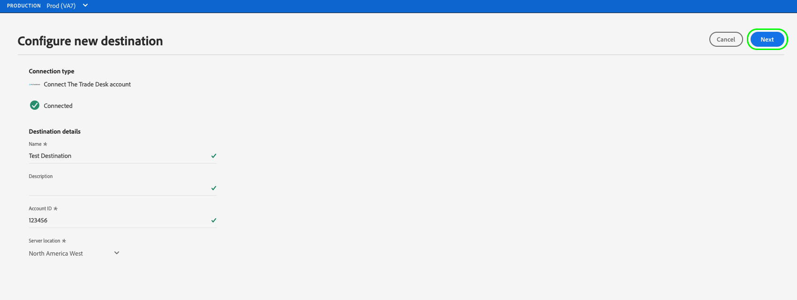

# 새 대상 연결 만들기

## 개요 {#overview}

대상 데이터를 대상에 보내려면 먼저 대상 플랫폼에 연결을 설정해야 합니다. 이 문서에서는 Adobe Experience Platform 사용자 인터페이스를 사용하여 새 대상을 설정하는 방법을 보여 줍니다.

## 새 대상 연결 만들기 {#setup}

1. **[!UICONTROL 연결]** > **[!UICONTROL 대상]**&#x200B;으로 이동하고 **[!UICONTROL 카탈로그]** 탭을 선택합니다.

   

1. 대상에 대한 기존 연결이 있는지 여부에 따라 대상 카드에 **[!UICONTROL 설정]** 또는 **[!UICONTROL 세그먼트 활성화]** 단추가 표시됩니다. **[!UICONTROL 세그먼트 활성화]** 및 **[!UICONTROL 설정]**&#x200B;의 차이에 대한 자세한 내용은 대상 작업 공간 설명서의 [카탈로그](../ui/destinations-workspace.md#catalog) 섹션을 참조하십시오.

   사용 가능한 단추에 따라 **[!UICONTROL 설정]** 또는 **[!UICONTROL 세그먼트 활성화]**&#x200B;를 선택합니다.

   

   

1. **[!UICONTROL 설정]**&#x200B;을 선택한 경우 다음 단계로 건너뜁니다.

   이제 **[!UICONTROL 세그먼트 활성화]**&#x200B;를 선택한 경우 기존 대상 연결 목록을 볼 수 있습니다.

   **[!UICONTROL 새 대상 구성]**&#x200B;을 선택합니다.

   

1. 대상 플랫폼 연결 세부 정보를 입력한 다음 **[!UICONTROL 대상에 연결]**&#x200B;을 선택합니다.

   >[!NOTE]
   >
   >아래 이미지는 일러스트레이션용으로만 사용됩니다. 대상 연결 세부 사항은 대상에 따라 다릅니다. 대상에 대한 연결 세부 정보에 대한 자세한 내용은 각 [대상 카탈로그](../catalog/overview.md) 페이지의 **연결 매개 변수** 섹션을 참조하십시오(예: [Google Customer Match](..//catalog/advertising/google-customer-match.md#parameters)).

   

1. **[!UICONTROL 다음]**&#x200B;을 선택합니다.

   

1. 대상으로 내보내려는 데이터에 적용할 수 있는 마케팅 작업을 선택합니다. 마케팅 작업은 대상으로 데이터를 내보낼 의도를 나타냅니다. Adobe 정의 마케팅 작업에서 선택하거나 고유한 마케팅 작업을 만들 수 있습니다. 마케팅 작업에 대한 자세한 내용은 [데이터 사용 정책 개요](../../data-governance/policies/overview.md) 페이지를 참조하십시오.

   

1. **[!UICONTROL 저장 및 종료]**&#x200B;를 선택하여 대상 구성을 저장하거나 **[!UICONTROL 다음]**&#x200B;을 선택하여 대상 데이터 [활성화 흐름](activation-overview.md)으로 진행합니다.