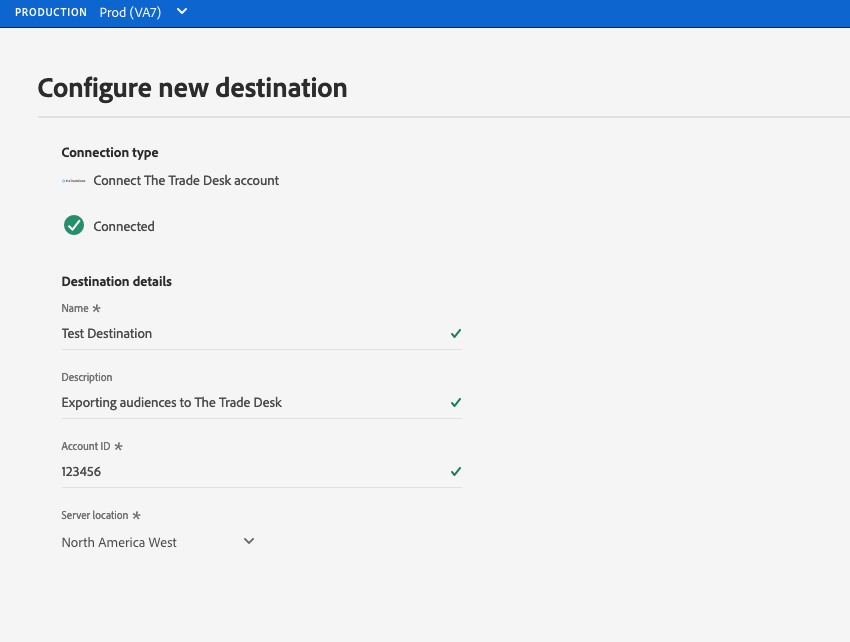

# 대상에 연결

Adobe Experience Platform의 대상에 연결하려면 아래 절차를 따르십시오.

1. [Experience Platform UI](https://platform.adobe.com/)에 로그인하고 왼쪽 탐색 막대에서 **[!UICONTROL Destinations]**&#x200B;를 선택합니다.

   

2. [[!UICONTROL Catalog]](./destinations-workspace.md#catalog) 탭에서 연결할 대상을 선택합니다.

3. **[!UICONTROL Configure]**&#x200B;을 선택하여 연결 대상 마법사를 시작합니다.

   

   >[!NOTE]
   >
   >대상과의 연결이 있는 경우 대상 카드에 **[!UICONTROL Activate]** 단추가 표시될 수 있습니다. **[!UICONTROL Activate]**&#x200B;과 **[!UICONTROL Configure]** 사이의 차이에 대한 자세한 내용은 대상 작업 공간 설명서의 [카탈로그](../ui/destinations-workspace.md#catalog) 섹션을 참조하십시오.

4. 특정 유형의 대상에 연결하는 방법에 대한 자세한 내용은 [대상 카탈로그 개요](../catalog/overview.md)를 참조하십시오.

5. 선택적으로 아래 비디오를 통해 대상에 연결하고 세그먼트를 활성화시키는 방법에 대한 개요를 확인하십시오.

   >[!VIDEO](https://video.tv.adobe.com/v/29710?quality=12)
